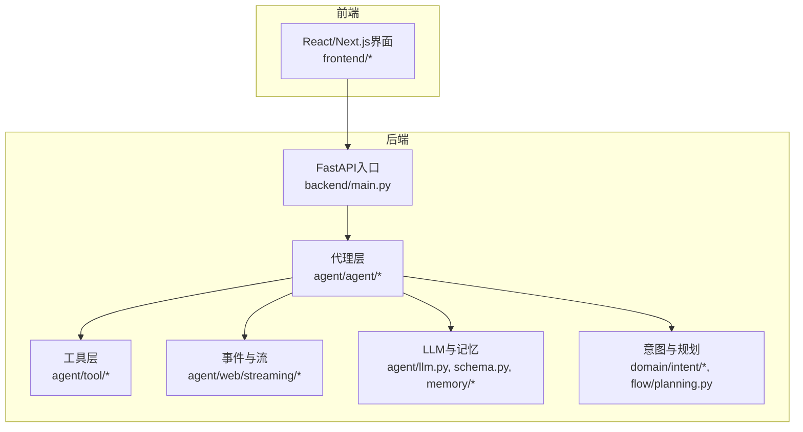
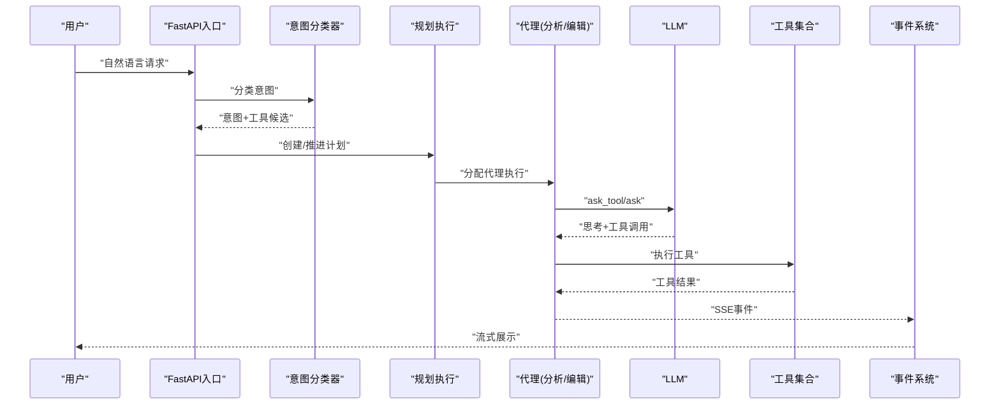
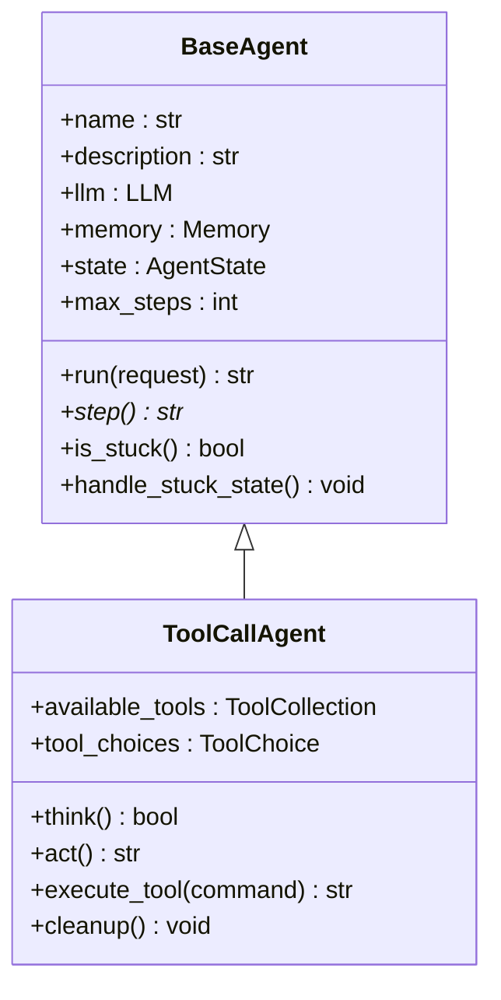
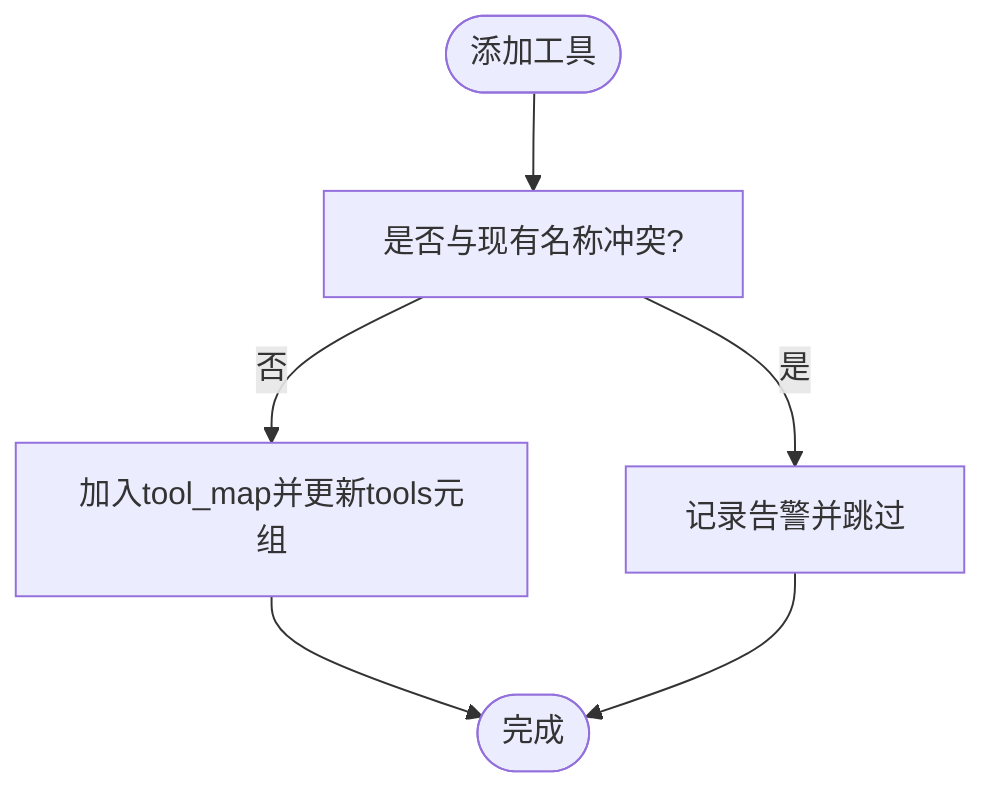
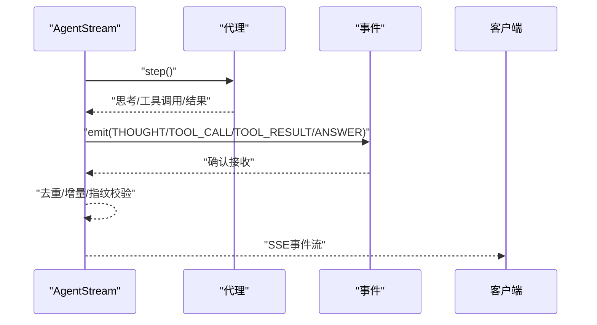
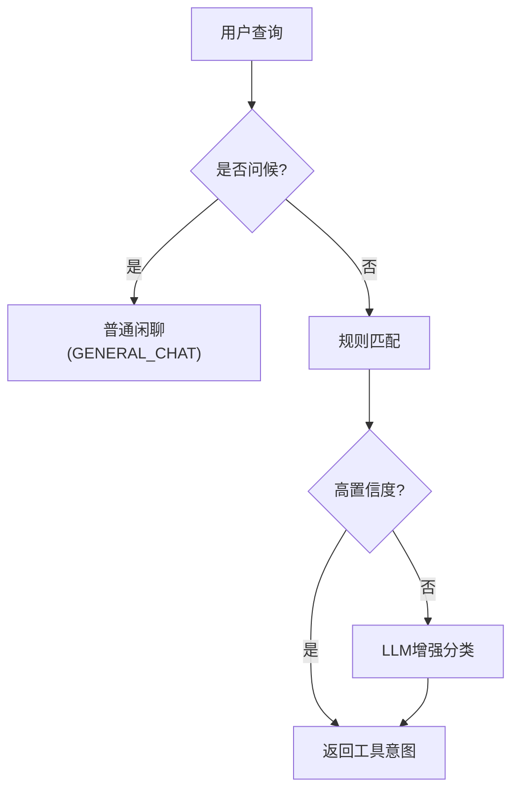
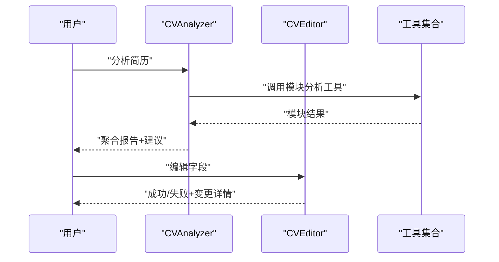
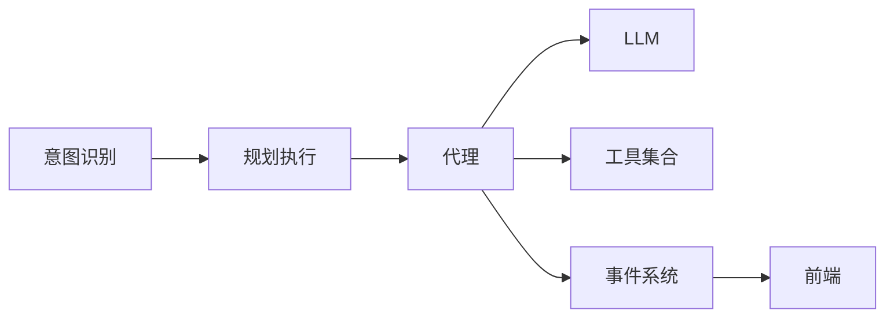

# AI代理系统

<cite>
**本文引用的文件**
- [backend/main.py](file://backend/main.py)
- [backend/agent/agent/__init__.py](file://backend/agent/agent/__init__.py)
- [backend/agent/agent/base.py](file://backend/agent/agent/base.py)
- [backend/agent/agent/toolcall.py](file://backend/agent/agent/toolcall.py)
- [backend/agent/agent/cv_analyzer.py](file://backend/agent/agent/cv_analyzer.py)
- [backend/agent/agent/cv_editor.py](file://backend/agent/agent/cv_editor.py)
- [backend/agent/tool/tool_collection.py](file://backend/agent/tool/tool_collection.py)
- [backend/agent/web/streaming/events.py](file://backend/agent/web/streaming/events.py)
- [backend/agent/web/streaming/state_machine.py](file://backend/agent/web/streaming/state_machine.py)
- [backend/agent/web/streaming/agent_stream.py](file://backend/agent/web/streaming/agent_stream.py)
- [backend/agent/schema.py](file://backend/agent/schema.py)
- [backend/agent/llm.py](file://backend/agent/llm.py)
- [backend/agent/domain/intent/intent_classifier.py](file://backend/agent/domain/intent/intent_classifier.py)
- [backend/agent/flow/planning.py](file://backend/agent/flow/planning.py)
- [backend/agent/memory/chat_history_manager.py](file://backend/agent/memory/chat_history_manager.py)
</cite>

## 目录
1. [简介](#简介)
2. [项目结构](#项目结构)
3. [核心组件](#核心组件)
4. [架构总览](#架构总览)
5. [详细组件分析](#详细组件分析)
6. [依赖关系分析](#依赖关系分析)
7. [性能考量](#性能考量)
8. [故障排查指南](#故障排查指南)
9. [结论](#结论)
10. [附录](#附录)

## 简介
本文件面向AI代理系统，系统以“简历”为核心场景，提供简历分析、简历编辑两大代理能力，并围绕工具调用、事件系统与流式处理构建了可扩展的执行框架。系统通过统一的LLM抽象接入多家模型服务，结合工具集合与意图识别，实现从“自然语言指令”到“结构化简历数据”的闭环。

## 项目结构
系统采用后端模块化组织，核心位于 backend/agent，前端位于 frontend，后端入口为 FastAPI 应用。关键模块包括：
- 代理层：基础代理、工具调用代理、简历分析/编辑代理
- 工具层：工具集合、工具基类与各类工具
- 事件与流：SSE事件模型、状态机、流式输出
- LLM与记忆：LLM封装、消息格式化、聊天历史管理
- 意图与规划：意图分类、多代理规划执行

图表来源
- [backend/main.py:1-326](file://backend/main.py#L1-L326)
- [backend/agent/agent/__init__.py:1-25](file://backend/agent/agent/__init__.py#L1-L25)

章节来源
- [backend/main.py:1-326](file://backend/main.py#L1-L326)

## 核心组件
- 代理基类与生命周期
  - BaseAgent：定义状态机、内存、最大步数、重复检测与自动终止策略
  - ToolCallAgent：在BaseAgent之上实现“思考-行动”循环，自动注入next_step提示、工具调用解析与结果落盘
- 工具系统
  - ToolCollection：工具注册、参数导出、批量执行与冲突处理
  - 工具基类与具体工具：浏览器、搜索、Python执行、简历读取/编辑、生成等
- 事件与流
  - StreamEvent：事件枚举与数据模型，覆盖代理生命周期、思考、工具调用、输出、简历变更等
  - AgentStateMachine：状态机，支持回调、错误处理、停止信号
  - AgentStream：将代理执行映射为SSE事件，支持去重、增量输出、建议按钮
- LLM与消息格式
  - LLM：统一LLM客户端，支持多供应商、流式/非流式、令牌计数与去重
  - Message/Memory：消息模型、滑动窗口、LangChain兼容
- 意图与规划
  - IntentClassifier：规则+LLM双阶段意图识别
  - PlanningFlow：计划驱动的多代理协作执行

章节来源
- [backend/agent/agent/base.py:1-199](file://backend/agent/agent/base.py#L1-L199)
- [backend/agent/agent/toolcall.py:1-522](file://backend/agent/agent/toolcall.py#L1-L522)
- [backend/agent/tool/tool_collection.py:1-74](file://backend/agent/tool/tool_collection.py#L1-L74)
- [backend/agent/web/streaming/events.py:1-415](file://backend/agent/web/streaming/events.py#L1-L415)
- [backend/agent/web/streaming/state_machine.py:1-247](file://backend/agent/web/streaming/state_machine.py#L1-L247)
- [backend/agent/web/streaming/agent_stream.py:1-800](file://backend/agent/web/streaming/agent_stream.py#L1-L800)
- [backend/agent/schema.py:1-229](file://backend/agent/schema.py#L1-L229)
- [backend/agent/llm.py:1-800](file://backend/agent/llm.py#L1-L800)
- [backend/agent/domain/intent/intent_classifier.py:1-332](file://backend/agent/domain/intent/intent_classifier.py#L1-L332)
- [backend/agent/flow/planning.py:1-445](file://backend/agent/flow/planning.py#L1-L445)

## 架构总览
系统以“意图识别—计划—代理执行—工具调用—事件流式输出”为主线，LLM贯穿思考与工具选择，工具集合承载外部能力，事件系统保障前后端一致的交互体验。

图表来源
- [backend/agent/domain/intent/intent_classifier.py:132-332](file://backend/agent/domain/intent/intent_classifier.py#L132-L332)
- [backend/agent/flow/planning.py:96-445](file://backend/agent/flow/planning.py#L96-L445)
- [backend/agent/agent/toolcall.py:258-420](file://backend/agent/agent/toolcall.py#L258-L420)
- [backend/agent/web/streaming/agent_stream.py:476-800](file://backend/agent/web/streaming/agent_stream.py#L476-L800)

## 详细组件分析

### 代理核心：BaseAgent 与 ToolCallAgent
- 生命周期与状态
  - state_context：安全的状态切换，异常时进入ERROR并回滚
  - run：步进执行，达到max_steps或FINISHED即终止
  - is_stuck/handle_stuck_state：检测重复输出并注入策略提示
- 工具调用与流式
  - think：条件注入next_step提示；调用LLM；自动终止判定；记录tool_calls
  - act：顺序执行工具，落盘tool结果；支持max_observe裁剪
  - execute_tool：参数解析、安全守卫（如禁止在浏览请求中使用特定工具）、结果标准化
  - cleanup：清理工具资源

图表来源
- [backend/agent/agent/base.py:15-199](file://backend/agent/agent/base.py#L15-L199)
- [backend/agent/agent/toolcall.py:21-522](file://backend/agent/agent/toolcall.py#L21-L522)

章节来源
- [backend/agent/agent/base.py:118-156](file://backend/agent/agent/base.py#L118-L156)
- [backend/agent/agent/toolcall.py:258-420](file://backend/agent/agent/toolcall.py#L258-L420)

### 工具系统与扩展机制
- ToolCollection
  - to_params：导出工具参数给LLM
  - execute：按名称查找并执行，捕获ToolError转为ToolFailure
  - add_tool/add_tools：去重插入，冲突告警
- 扩展点
  - 在代理构造时注入ToolCollection，即可动态扩展工具集
  - 工具需实现可异步调用协议，返回ToolResult/ToolFailure

图表来源
- [backend/agent/tool/tool_collection.py:11-74](file://backend/agent/tool/tool_collection.py#L11-L74)

章节来源
- [backend/agent/tool/tool_collection.py:27-48](file://backend/agent/tool/tool_collection.py#L27-L48)

### 事件系统与流式处理
- 事件模型
  - EventType：涵盖代理生命周期、思考、工具调用/结果、输出、简历变更、系统消息等
  - StreamEvent及派生类：统一序列化/反序列化接口，便于SSE传输
- 状态机
  - AgentStateMachine：状态流转、回调、错误处理、停止请求
- 流式输出
  - AgentStream：将代理每步的思考、工具调用、工具结果、最终答案映射为事件；去重、增量、建议按钮解析

图表来源
- [backend/agent/web/streaming/events.py:15-415](file://backend/agent/web/streaming/events.py#L15-L415)
- [backend/agent/web/streaming/state_machine.py:26-247](file://backend/agent/web/streaming/state_machine.py#L26-L247)
- [backend/agent/web/streaming/agent_stream.py:476-800](file://backend/agent/web/streaming/agent_stream.py#L476-L800)

章节来源
- [backend/agent/web/streaming/events.py:55-204](file://backend/agent/web/streaming/events.py#L55-L204)
- [backend/agent/web/streaming/state_machine.py:102-151](file://backend/agent/web/streaming/state_machine.py#L102-L151)
- [backend/agent/web/streaming/agent_stream.py:224-305](file://backend/agent/web/streaming/agent_stream.py#L224-L305)

### 意图识别与代理间通信
- IntentClassifier
  - 两阶段：规则快速匹配 + LLM增强（可选）
  - 输出IntentResult：意图类型、置信度、匹配工具列表、推理过程
- 代理间通信
  - PlanningFlow：基于计划的多代理协作，按步骤选择执行器，更新步骤状态
  - 通过LLM的工具调用能力，代理可“委托”其他代理执行任务

图表来源
- [backend/agent/domain/intent/intent_classifier.py:96-188](file://backend/agent/domain/intent/intent_classifier.py#L96-L188)
- [backend/agent/flow/planning.py:79-95](file://backend/agent/flow/planning.py#L79-L95)

章节来源
- [backend/agent/domain/intent/intent_classifier.py:132-332](file://backend/agent/domain/intent/intent_classifier.py#L132-L332)
- [backend/agent/flow/planning.py:96-137](file://backend/agent/flow/planning.py#L96-L137)

### 简历分析代理与编辑代理
- 简历分析代理(CVAnalyzer)
  - 职责：协调模块分析器、聚合结果、给出优化建议
  - 机制：加载简历数据至共享存储；调用工具收集模块结果；排序与汇总
- 简历编辑代理(CVEditor)
  - 职责：修改、添加、删除简历字段；保持JSON结构一致性
  - 机制：规范化路径别名；基于JSON Path进行增删改；异常包装为结构化错误

图表来源
- [backend/agent/agent/cv_analyzer.py:26-193](file://backend/agent/agent/cv_analyzer.py#L26-L193)
- [backend/agent/agent/cv_editor.py:45-265](file://backend/agent/agent/cv_editor.py#L45-L265)

章节来源
- [backend/agent/agent/cv_analyzer.py:65-123](file://backend/agent/agent/cv_analyzer.py#L65-L123)
- [backend/agent/agent/cv_editor.py:116-154](file://backend/agent/agent/cv_editor.py#L116-L154)

### LLM集成与最佳实践
- 统一封装
  - LLM：多供应商、流式/非流式、令牌计数、去重、错误处理
  - Message格式化：LangChain兼容、工具消息去重与孤儿过滤
- 最佳实践
  - 控制上下文长度：使用Memory/ChatHistoryManager的滑动窗口
  - 工具调用稳定性：确保assistant+tool消息一一对应，避免API拒绝
  - 令牌限制：在ask/ask_tool前计算输入令牌，必要时抛出TokenLimitExceeded
  - 图像输入：多模态模型专用，注意content格式与图像尺寸估算

章节来源
- [backend/agent/llm.py:211-800](file://backend/agent/llm.py#L211-L800)
- [backend/agent/schema.py:162-229](file://backend/agent/schema.py#L162-L229)
- [backend/agent/memory/chat_history_manager.py:21-264](file://backend/agent/memory/chat_history_manager.py#L21-L264)

## 依赖关系分析
- 组件耦合
  - 代理依赖LLM与工具集合；事件系统独立于代理，通过SSE对接前端
  - 意图识别与规划为上层编排，可插拔替换
- 外部依赖
  - LLM SDK（OpenAI/Azure/AWS Bedrock）、httpx、tiktoken
  - 前端通过SSE订阅事件，按事件类型渲染UI

图表来源
- [backend/agent/agent/toolcall.py:36-40](file://backend/agent/agent/toolcall.py#L36-L40)
- [backend/agent/domain/intent/intent_classifier.py:50-95](file://backend/agent/domain/intent/intent_classifier.py#L50-L95)
- [backend/agent/flow/planning.py:47-78](file://backend/agent/flow/planning.py#L47-L78)

章节来源
- [backend/agent/agent/toolcall.py:36-40](file://backend/agent/agent/toolcall.py#L36-L40)
- [backend/agent/domain/intent/intent_classifier.py:50-95](file://backend/agent/domain/intent/intent_classifier.py#L50-L95)
- [backend/agent/flow/planning.py:47-78](file://backend/agent/flow/planning.py#L47-L78)

## 性能考量
- 令牌与上下文
  - 使用TokenCounter估算输入/工具调用令牌，避免超过模型限制
  - Memory/ChatHistoryManager采用滑动窗口，控制消息数量
- 流式与去重
  - AgentStream对思考/工具/结果进行指纹去重，降低重复渲染
  - SSE增量输出，提升用户体验
- 并发与取消
  - 流式回调配合取消事件，支持用户中断

## 故障排查指南
- 代理卡死/重复
  - 现象：连续重复输出
  - 处理：is_stuck触发handle_stuck_state，注入策略提示
- 工具调用失败
  - 现象：execute_tool返回错误或异常
  - 处理：检查参数JSON解析、工具名称、守卫规则（如浏览请求禁止某些工具）
- 令牌超限
  - 现象：ask/ask_tool抛出TokenLimitExceeded
  - 处理：减少上下文、压缩消息、调整max_tokens
- 事件重复/乱序
  - 现象：前端重复显示或顺序异常
  - 处理：检查AgentStream去重逻辑与SSE事件序列号

章节来源
- [backend/agent/agent/base.py:172-188](file://backend/agent/agent/base.py#L172-L188)
- [backend/agent/agent/toolcall.py:420-480](file://backend/agent/agent/toolcall.py#L420-L480)
- [backend/agent/llm.py:502-624](file://backend/agent/llm.py#L502-L624)
- [backend/agent/web/streaming/agent_stream.py:257-305](file://backend/agent/web/streaming/agent_stream.py#L257-L305)

## 结论
本系统以“意图识别—计划—代理—工具—事件流”的闭环架构，实现了简历场景下的分析与编辑能力。通过统一的LLM抽象、可扩展的工具集合、完备的事件与状态机，以及流式输出，既保证了工程可维护性，也提供了良好的用户体验。后续可在工具生态、意图规则与规划策略上持续演进。

## 附录
- 使用模式
  - 简历分析：CVAnalyzer.load_resume + chat，聚合模块结果并给出优化建议
  - 简历编辑：CVEditor.load_resume + edit_resume，支持update/add/delete
  - 流式交互：AgentStream将代理每步输出映射为SSE事件，前端实时渲染
- 与LLM服务集成
  - 通过LLM.ask/ask_tool传入messages/system_msgs/tools，自动处理工具调用与消息去重
  - 多供应商支持：OpenAI/Azure/AWS Bedrock，按配置切换