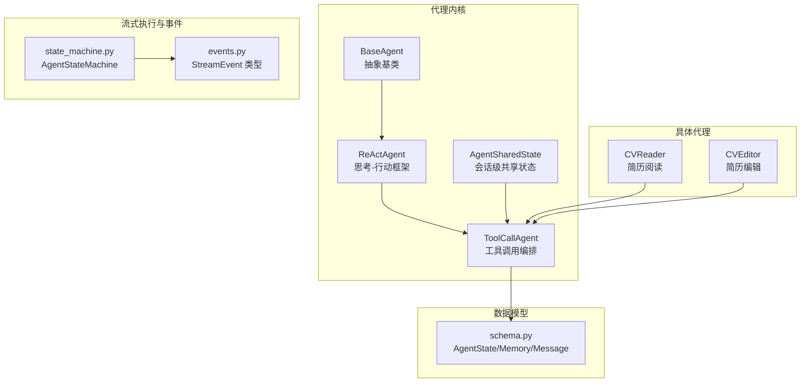
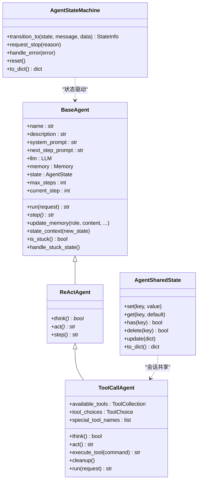
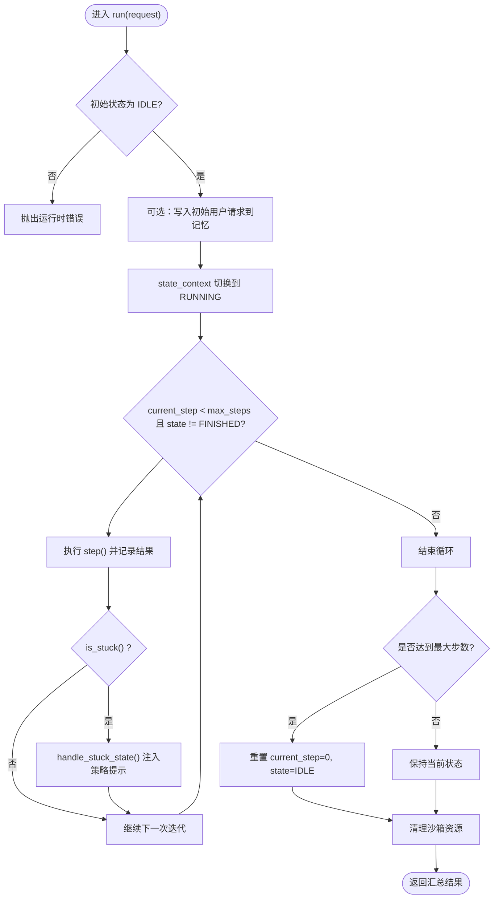
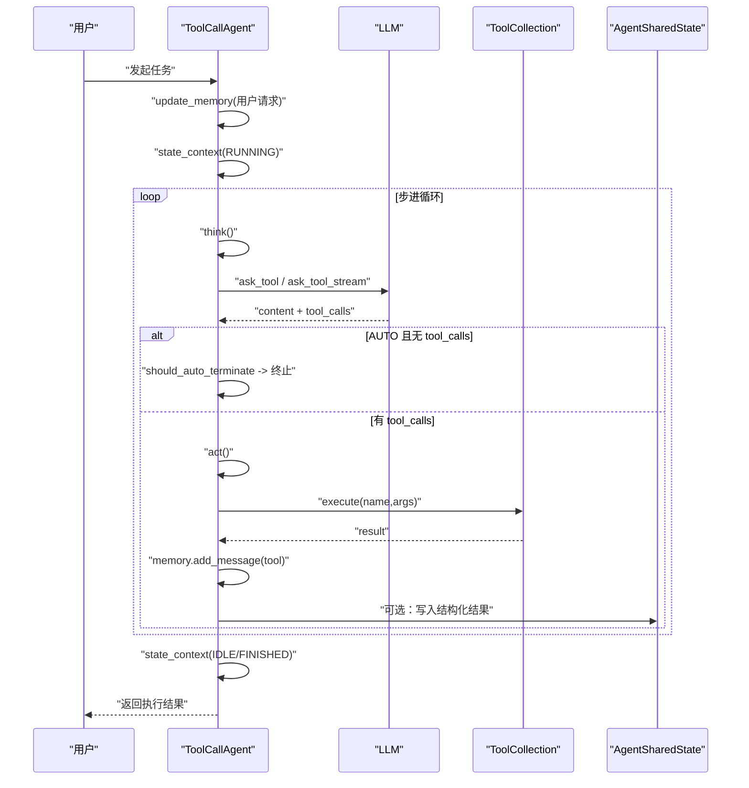
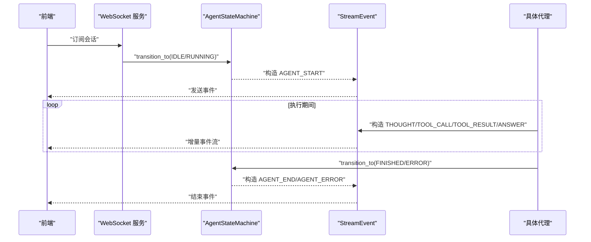
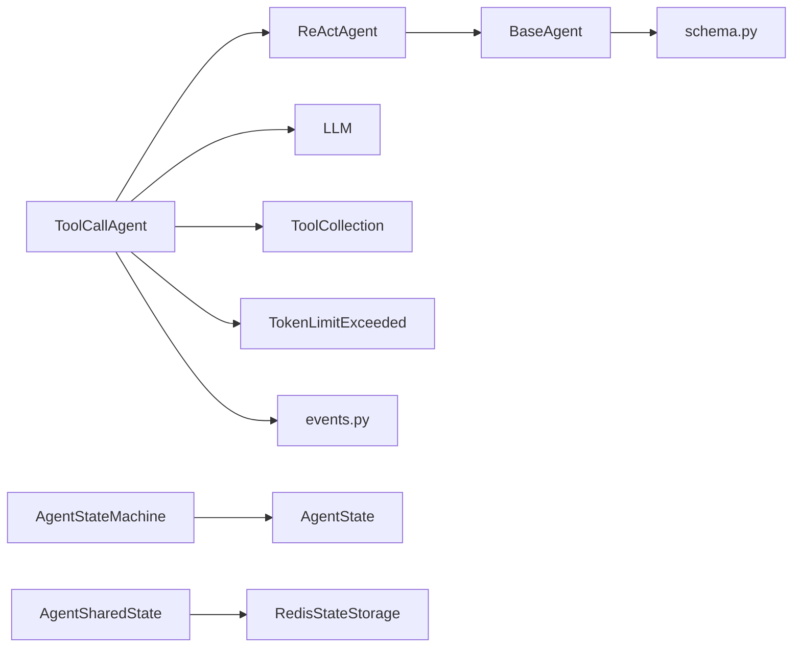

# 代理核心架构

<cite>
**本文引用的文件**
- [backend/agent/agent/base.py](file://backend/agent/agent/base.py)
- [backend/agent/schema.py](file://backend/agent/schema.py)
- [backend/agent/agent/react.py](file://backend/agent/agent/react.py)
- [backend/agent/agent/toolcall.py](file://backend/agent/agent/toolcall.py)
- [backend/agent/agent/shared_state.py](file://backend/agent/agent/shared_state.py)
- [backend/agent/web/streaming/state_machine.py](file://backend/agent/web/streaming/state_machine.py)
- [backend/agent/web/streaming/events.py](file://backend/agent/web/streaming/events.py)
- [backend/agent/agent/cv_reader.py](file://backend/agent/agent/cv_reader.py)
- [backend/agent/agent/cv_editor.py](file://backend/agent/agent/cv_editor.py)
</cite>

## 目录
1. [引言](#引言)
2. [项目结构](#项目结构)
3. [核心组件](#核心组件)
4. [架构总览](#架构总览)
5. [详细组件分析](#详细组件分析)
6. [依赖分析](#依赖分析)
7. [性能考虑](#性能考虑)
8. [故障排查指南](#故障排查指南)
9. [结论](#结论)
10. [附录](#附录)

## 引言
本文件系统性阐述代理核心架构，围绕抽象基类 BaseAgent 的设计理念、状态管理、内存管理与执行循环展开；同时覆盖 ReActAgent 与 ToolCallAgent 的扩展模式、代理间通信协议与共享状态机制，并提供最佳实践与常见问题解决方案。目标是帮助读者快速理解并安全地继承与扩展代理体系。

## 项目结构
后端代理相关代码主要位于 backend/agent/agent 下，围绕“抽象基类 + 具体代理实现 + 数据模型 + 流式事件与状态机”的分层组织方式构建。前端交互通过 backend/agent/web/streaming 提供的事件模型与状态机进行会话级生命周期管理。

图示来源
- [backend/agent/agent/base.py:15-199](file://backend/agent/agent/base.py#L15-L199)
- [backend/agent/schema.py:32-229](file://backend/agent/schema.py#L32-L229)
- [backend/agent/agent/react.py:11-39](file://backend/agent/agent/react.py#L11-L39)
- [backend/agent/agent/toolcall.py:21-522](file://backend/agent/agent/toolcall.py#L21-L522)
- [backend/agent/agent/shared_state.py:47-101](file://backend/agent/agent/shared_state.py#L47-L101)
- [backend/agent/web/streaming/state_machine.py:26-247](file://backend/agent/web/streaming/state_machine.py#L26-L247)
- [backend/agent/web/streaming/events.py:15-415](file://backend/agent/web/streaming/events.py#L15-L415)
- [backend/agent/agent/cv_reader.py:16-104](file://backend/agent/agent/cv_reader.py#L16-L104)
- [backend/agent/agent/cv_editor.py:45-265](file://backend/agent/agent/cv_editor.py#L45-L265)

章节来源
- [backend/agent/agent/base.py:15-199](file://backend/agent/agent/base.py#L15-L199)
- [backend/agent/schema.py:32-229](file://backend/agent/schema.py#L32-L229)
- [backend/agent/agent/react.py:11-39](file://backend/agent/agent/react.py#L11-L39)
- [backend/agent/agent/toolcall.py:21-522](file://backend/agent/agent/toolcall.py#L21-L522)
- [backend/agent/agent/shared_state.py:47-101](file://backend/agent/agent/shared_state.py#L47-L101)
- [backend/agent/web/streaming/state_machine.py:26-247](file://backend/agent/web/streaming/state_machine.py#L26-L247)
- [backend/agent/web/streaming/events.py:15-415](file://backend/agent/web/streaming/events.py#L15-L415)
- [backend/agent/agent/cv_reader.py:16-104](file://backend/agent/agent/cv_reader.py#L16-L104)
- [backend/agent/agent/cv_editor.py:45-265](file://backend/agent/agent/cv_editor.py#L45-L265)

## 核心组件
- 抽象基类 BaseAgent：统一状态、记忆、执行循环与错误兜底；提供状态上下文管理、消息写入、运行循环与卡顿检测。
- ReActAgent：在 BaseAgent 基础上引入 think/act 分层，强调“思考-行动”闭环。
- ToolCallAgent：面向工具调用的高层封装，内置工具集合、流式回调、特殊工具处理、自动终止与清理。
- 数据模型 schema：定义 AgentState、Message、Memory 等核心类型，支撑状态机与消息契约。
- 流式事件与状态机：AgentStateMachine 维护会话生命周期与状态迁移；StreamEvent 定义前后端一致的事件协议。
- 会话共享状态 AgentSharedState：线程安全的会话级键值存储，可选持久化后端。

章节来源
- [backend/agent/agent/base.py:15-199](file://backend/agent/agent/base.py#L15-L199)
- [backend/agent/agent/react.py:11-39](file://backend/agent/agent/react.py#L11-L39)
- [backend/agent/agent/toolcall.py:21-522](file://backend/agent/agent/toolcall.py#L21-L522)
- [backend/agent/schema.py:32-229](file://backend/agent/schema.py#L32-L229)
- [backend/agent/web/streaming/state_machine.py:26-247](file://backend/agent/web/streaming/state_machine.py#L26-L247)
- [backend/agent/web/streaming/events.py:15-415](file://backend/agent/web/streaming/events.py#L15-L415)
- [backend/agent/agent/shared_state.py:47-101](file://backend/agent/agent/shared_state.py#L47-L101)

## 架构总览
代理核心采用“抽象-扩展-编排-事件”的分层架构：
- 抽象层：BaseAgent/ReActAgent/ToolCallAgent 提供统一接口与通用能力。
- 执行层：LLM 作为推理引擎，Memory 作为短期记忆，ToolCollection 作为外部能力入口。
- 生命周期层：AgentStateMachine 管理会话状态；StreamEvent 描述事件流。
- 共享层：AgentSharedState 提供跨代理的会话级共享数据。

图示来源
- [backend/agent/agent/base.py:15-199](file://backend/agent/agent/base.py#L15-L199)
- [backend/agent/agent/react.py:11-39](file://backend/agent/agent/react.py#L11-L39)
- [backend/agent/agent/toolcall.py:21-522](file://backend/agent/agent/toolcall.py#L21-L522)
- [backend/agent/agent/shared_state.py:47-101](file://backend/agent/agent/shared_state.py#L47-L101)
- [backend/agent/web/streaming/state_machine.py:26-247](file://backend/agent/web/streaming/state_machine.py#L26-L247)

## 详细组件分析

### BaseAgent 抽象基类
- 设计理念
  - 以 Pydantic 模型承载配置与验证，结合 ABC 抽象约束 step 实现。
  - 将“状态”“记忆”“执行步数”“最大步数”等统一纳入模型，便于序列化与调试。
- 状态管理
  - 使用 state_context 上下文在进入/退出新状态时进行异常捕获与回滚，保证状态一致性。
  - 提供 is_stuck 与 handle_stuck_state，基于“助手消息重复内容计数”检测卡顿并注入策略提示。
- 内存管理
  - update_memory 统一封装消息写入，支持 user/system/assistant/tool 角色与工具调用上下文。
  - Memory 采用滑动窗口，限制历史消息长度，避免上下文溢出。
- 执行循环
  - run 在 IDLE 状态启动，切换至 RUNNING 后按步执行 step，直至达到 FINISHED 或 max_steps。
  - 循环中检测卡顿并清理沙箱资源，最终恢复 IDLE 或标记 FINISHED。

图示来源
- [backend/agent/agent/base.py:118-156](file://backend/agent/agent/base.py#L118-L156)
- [backend/agent/agent/base.py:165-188](file://backend/agent/agent/base.py#L165-L188)

章节来源
- [backend/agent/agent/base.py:15-199](file://backend/agent/agent/base.py#L15-L199)
- [backend/agent/schema.py:32-229](file://backend/agent/schema.py#L32-L229)

### ReActAgent 思考-行动框架
- 结构与职责
  - 将单次 step 拆分为 think/act 两阶段，think 决策是否需要行动，act 执行具体动作。
  - 通过抽象方法约束子类实现，形成稳定的执行节奏。
- 与 BaseAgent 的关系
  - 复用 BaseAgent 的状态、记忆与执行循环，专注于“思考-行动”的工作流。

章节来源
- [backend/agent/agent/react.py:11-39](file://backend/agent/agent/react.py#L11-L39)

### ToolCallAgent 工具调用编排
- 工具选择与流式回调
  - 支持 ToolChoice.AUTO/NONE/REQUIRED 三种模式；可注册流式内容回调与取消事件，适配前端增量渲染。
- 自动终止与去重
  - should_auto_terminate 在 AUTO 模式下根据 LLM 输出是否含 tool_calls 决定是否终止。
  - _should_add_next_step_prompt 避免重复注入提示词，防止消息膨胀。
- 特殊工具与结构化结果
  - special_tool_names 识别终止类工具；_store_structured_tool_result 对特定工具结果进行结构化缓存，便于后续事件或 UI 使用。
- 错误处理与清理
  - 统一捕获 TokenLimitExceeded 并转入 FINISHED；cleanup 逐个工具异步清理资源。
- 与 CVReader/CVEditor 的集成
  - 两者均继承 ToolCallAgent，分别注入领域工具（读取/编辑），并在 run 完成后进行清理。

图示来源
- [backend/agent/agent/toolcall.py:258-418](file://backend/agent/agent/toolcall.py#L258-L418)
- [backend/agent/agent/toolcall.py:420-480](file://backend/agent/agent/toolcall.py#L420-L480)
- [backend/agent/agent/toolcall.py:516-522](file://backend/agent/agent/toolcall.py#L516-L522)
- [backend/agent/agent/shared_state.py:61-96](file://backend/agent/agent/shared_state.py#L61-L96)

章节来源
- [backend/agent/agent/toolcall.py:21-522](file://backend/agent/agent/toolcall.py#L21-L522)
- [backend/agent/agent/cv_reader.py:16-104](file://backend/agent/agent/cv_reader.py#L16-L104)
- [backend/agent/agent/cv_editor.py:45-265](file://backend/agent/agent/cv_editor.py#L45-L265)

### 代理间通信协议与共享状态
- 事件协议（StreamEvent）
  - 定义 AGENT_START/END/ERROR、THOUGHT、TOOL_CALL/RESULT、ANSWER、RESUME_*、SYSTEM/WARNING 等事件类型，统一前后端传输格式。
  - ToolCallEvent/ToolResultEvent 支持携带 tool_call_id，实现工具调用与其结果的上下文关联。
- 状态机（AgentStateMachine）
  - 管理会话状态迁移、停止信号、错误回调与历史记录；对外暴露 to_dict 便于监控与调试。
- 共享状态（AgentSharedState）
  - 会话级键值存储，支持本地内存与可选 Redis 后端；提供线程安全的 get/set/update/delete 接口。

图示来源
- [backend/agent/web/streaming/events.py:15-415](file://backend/agent/web/streaming/events.py#L15-L415)
- [backend/agent/web/streaming/state_machine.py:102-151](file://backend/agent/web/streaming/state_machine.py#L102-L151)

章节来源
- [backend/agent/web/streaming/events.py:15-415](file://backend/agent/web/streaming/events.py#L15-L415)
- [backend/agent/web/streaming/state_machine.py:26-247](file://backend/agent/web/streaming/state_machine.py#L26-L247)
- [backend/agent/agent/shared_state.py:47-101](file://backend/agent/agent/shared_state.py#L47-L101)

### 典型代理实现示例
- CVReader：面向简历阅读的专用代理，加载简历上下文后通过工具调用回答问题，适合“只读+问答”场景。
- CVEditor：面向简历编辑的专用代理，提供 update/add/delete 的 JSON Path 操作封装，适合“结构化修改”。

章节来源
- [backend/agent/agent/cv_reader.py:16-104](file://backend/agent/agent/cv_reader.py#L16-L104)
- [backend/agent/agent/cv_editor.py:45-265](file://backend/agent/agent/cv_editor.py#L45-L265)

## 依赖分析
- 组件耦合
  - BaseAgent 依赖 schema 的 AgentState/Memory/Message；ReActAgent/ToolCallAgent 继承之并扩展。
  - ToolCallAgent 依赖 LLM、ToolCollection、异常类型与前端事件模型。
  - AgentStateMachine 依赖 AgentState/StateInfo/StateTransitionError。
- 外部依赖
  - LLM：推理与工具调用；ToolCollection：工具注册与执行；SANDBOX_CLIENT：沙箱资源清理。
  - 可选 Redis：AgentSharedState 的持久化后端。

图示来源
- [backend/agent/agent/base.py:15-199](file://backend/agent/agent/base.py#L15-L199)
- [backend/agent/agent/react.py:11-39](file://backend/agent/agent/react.py#L11-L39)
- [backend/agent/agent/toolcall.py:21-522](file://backend/agent/agent/toolcall.py#L21-L522)
- [backend/agent/web/streaming/state_machine.py:26-247](file://backend/agent/web/streaming/state_machine.py#L26-L247)
- [backend/agent/agent/shared_state.py:22-45](file://backend/agent/agent/shared_state.py#L22-L45)

章节来源
- [backend/agent/agent/base.py:15-199](file://backend/agent/agent/base.py#L15-L199)
- [backend/agent/agent/react.py:11-39](file://backend/agent/agent/react.py#L11-L39)
- [backend/agent/agent/toolcall.py:21-522](file://backend/agent/agent/toolcall.py#L21-L522)
- [backend/agent/web/streaming/state_machine.py:26-247](file://backend/agent/web/streaming/state_machine.py#L26-L247)
- [backend/agent/agent/shared_state.py:22-45](file://backend/agent/agent/shared_state.py#L22-L45)

## 性能考虑
- 记忆窗口与上下文控制
  - Memory 的滑动窗口限制消息数量，建议配合工具选择策略（如 ToolChoice.NONE）减少冗余工具调用。
- 卡顿检测与自适应
  - is_stuck 与 handle_stuck_state 有助于避免无效循环；合理设置 duplicate_threshold 与 next_step_prompt。
- 流式回调与取消
  - 使用流式回调与取消事件降低前端等待时间，提升交互体验；注意在异常时及时清理资源。
- 共享状态的并发安全
  - AgentSharedState 使用 RLock 保证线程安全；若接入 Redis，需关注网络延迟与序列化开销。

## 故障排查指南
- 运行时错误
  - BaseAgent.run 要求初始状态为 IDLE，否则抛出运行时错误；请先通过状态机正确初始化。
- Token 限额
  - ToolCallAgent 在捕获 TokenLimitExceeded 后会写入记忆并转入 FINISHED；检查提示词长度与消息窗口。
- 工具参数解析
  - execute_tool 对 JSON 参数进行严格解析，非法 JSON 会返回错误信息；请确保工具参数格式正确。
- 状态机异常
  - AgentStateMachine 在非法状态转移时抛出 StateTransitionError；请确认状态迁移顺序与业务逻辑一致。
- 沙箱资源泄漏
  - ToolCallAgent.run 最终调用 cleanup；若出现资源未释放，检查自定义工具的清理逻辑。

章节来源
- [backend/agent/agent/base.py:118-156](file://backend/agent/agent/base.py#L118-L156)
- [backend/agent/agent/toolcall.py:304-320](file://backend/agent/agent/toolcall.py#L304-L320)
- [backend/agent/agent/toolcall.py:470-479](file://backend/agent/agent/toolcall.py#L470-L479)
- [backend/agent/web/streaming/state_machine.py:121-127](file://backend/agent/web/streaming/state_machine.py#L121-L127)
- [backend/agent/agent/toolcall.py:500-514](file://backend/agent/agent/toolcall.py#L500-L514)

## 结论
本架构以 BaseAgent 为核心抽象，通过 ReActAgent 与 ToolCallAgent 形成清晰的“思考-行动-工具调用”闭环；借助 AgentStateMachine 与 StreamEvent 实现会话级生命周期与事件流；AgentSharedState 提供跨代理的会话级共享能力。遵循本文的最佳实践与故障排查建议，可在保证稳定性的同时高效扩展新的代理能力。

## 附录
- 继承与扩展最佳实践
  - 优先继承 ToolCallAgent 以获得工具调用与流式能力；仅在需要自定义思考/行动流程时继承 ReActAgent。
  - 合理设置 tool_choices 与 next_step_prompt，避免重复注入与消息膨胀。
  - 在自定义工具中实现 cleanup 并在 ToolCallAgent.run 中确保资源回收。
- 常见问题速查
  - “无法从非 IDLE 状态运行”：检查状态机是否正确初始化。
  - “频繁卡顿”：调整 duplicate_threshold 或在子类中重写 is_stuck/handle_stuck_state。
  - “工具调用失败”：核对参数 JSON 格式与工具可用性；查看日志中的错误堆栈。