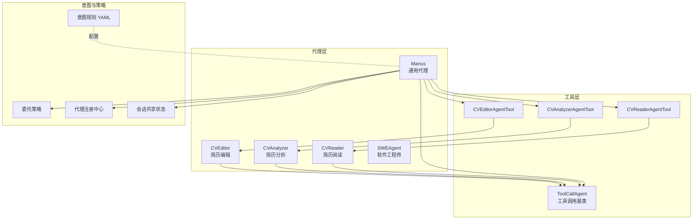
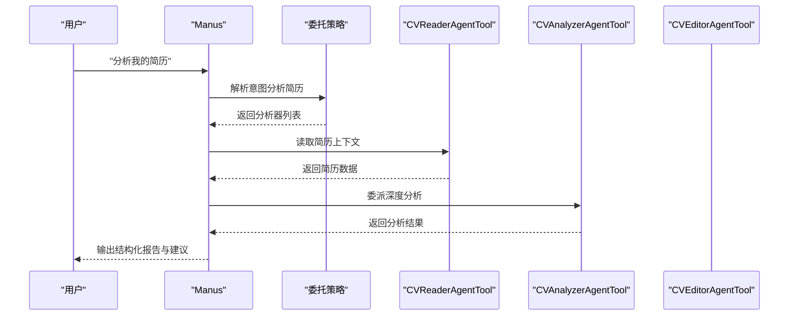
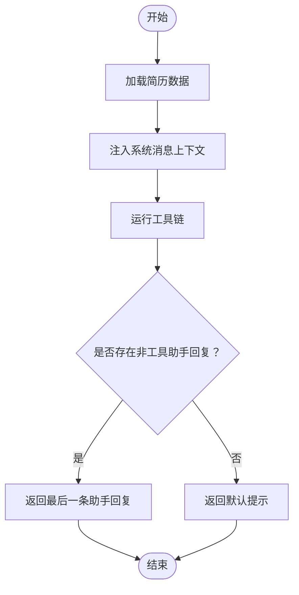
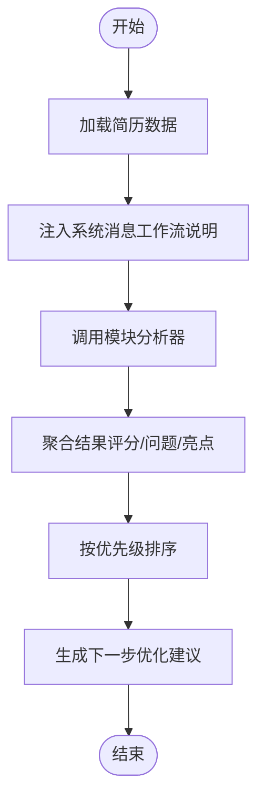
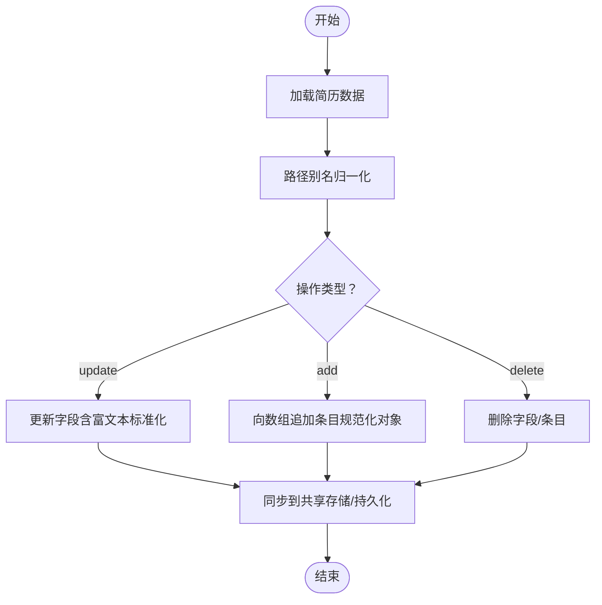
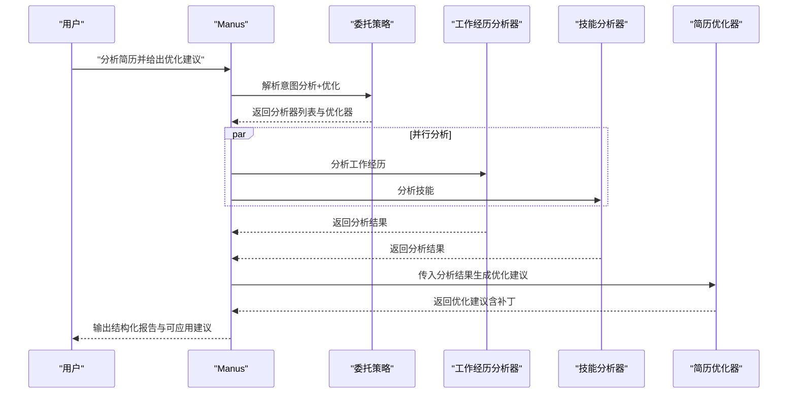
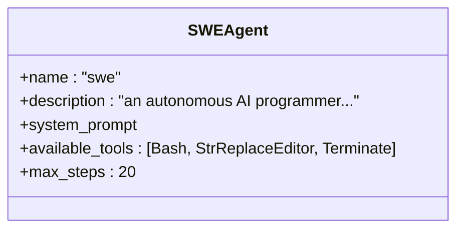
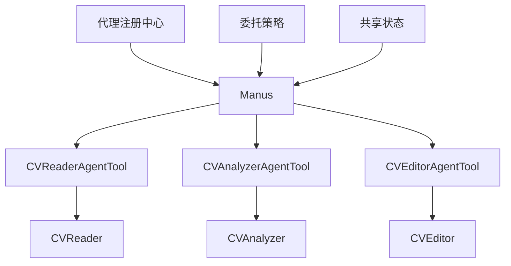

# 代理类型与角色

<cite>
**本文档引用的文件**
- [backend/agent/agent/cv_analyzer.py](file://backend/agent/agent/cv_analyzer.py)
- [backend/agent/agent/cv_editor.py](file://backend/agent/agent/cv_editor.py)
- [backend/agent/agent/cv_reader.py](file://backend/agent/agent/cv_reader.py)
- [backend/agent/agent/manus.py](file://backend/agent/agent/manus.py)
- [backend/agent/agent/swe.py](file://backend/agent/agent/swe.py)
- [backend/agent/agent/toolcall.py](file://backend/agent/agent/toolcall.py)
- [backend/agent/agent/delegation_strategy.py](file://backend/agent/agent/delegation_strategy.py)
- [backend/agent/agent/registry.py](file://backend/agent/agent/registry.py)
- [backend/agent/agent/shared_state.py](file://backend/agent/agent/shared_state.py)
- [backend/agent/tool/cv_analyzer_agent_tool.py](file://backend/agent/tool/cv_analyzer_agent_tool.py)
- [backend/agent/tool/cv_editor_agent_tool.py](file://backend/agent/tool/cv_editor_agent_tool.py)
- [backend/agent/domain/intent/configs/cv_analyzer_agent.yaml](file://backend/agent/domain/intent/configs/cv_analyzer_agent.yaml)
- [backend/agent/domain/intent/configs/cv_editor_agent.yaml](file://backend/agent/domain/intent/configs/cv_editor_agent.yaml)
- [backend/agent/domain/intent/configs/cv_reader_agent.yaml](file://backend/agent/domain/intent/configs/cv_reader_agent.yaml)
</cite>

## 目录
1. [简介](#简介)
2. [项目结构](#项目结构)
3. [核心组件](#核心组件)
4. [架构总览](#架构总览)
5. [详细组件分析](#详细组件分析)
6. [依赖分析](#依赖分析)
7. [性能考虑](#性能考虑)
8. [故障排查指南](#故障排查指南)
9. [结论](#结论)
10. [附录](#附录)

## 简介
本文件系统性梳理简历与软件工程领域的代理类型与角色，聚焦以下代理：
- 简历分析代理（CVAnalyzer）：负责协调模块分析器、聚合结果并给出优化建议。
- 简历编辑代理（CVEditor）：负责对简历数据进行结构化更新、新增与删除。
- 简历阅读代理（CVReader）：负责读取简历上下文并回答相关问题。
- 论文代理（Manus）：通用型代理，具备本地工具编排能力，支持意图识别、状态管理、并行分析与优化建议生成。
- 软件工程师代理（SWEAgent）：面向代码执行与自然对话的软件工程师范式代理。

文档解释每种代理的职责边界、工作流程、交互模式、协作机制与性能优化策略，并提供实际使用案例与配置示例。

## 项目结构
围绕代理体系的关键目录与文件：
- 代理实现：backend/agent/agent/*.py
- 工具封装：backend/agent/tool/*.py
- 意图规则：backend/agent/domain/intent/configs/*.yaml
- 基础框架：backend/agent/agent/toolcall.py（工具调用基类）

**图表来源**
- [backend/agent/agent/manus.py](file://backend/agent/agent/manus.py)
- [backend/agent/agent/cv_reader.py](file://backend/agent/agent/cv_reader.py)
- [backend/agent/agent/cv_analyzer.py](file://backend/agent/agent/cv_analyzer.py)
- [backend/agent/agent/cv_editor.py](file://backend/agent/agent/cv_editor.py)
- [backend/agent/agent/toolcall.py](file://backend/agent/agent/toolcall.py)
- [backend/agent/tool/cv_reader_agent_tool.py](file://backend/agent/tool/cv_reader_agent_tool.py)
- [backend/agent/tool/cv_analyzer_agent_tool.py](file://backend/agent/tool/cv_analyzer_agent_tool.py)
- [backend/agent/tool/cv_editor_agent_tool.py](file://backend/agent/tool/cv_editor_agent_tool.py)
- [backend/agent/agent/delegation_strategy.py](file://backend/agent/agent/delegation_strategy.py)
- [backend/agent/agent/registry.py](file://backend/agent/agent/registry.py)
- [backend/agent/agent/shared_state.py](file://backend/agent/agent/shared_state.py)

**章节来源**
- [backend/agent/agent/manus.py](file://backend/agent/agent/manus.py)
- [backend/agent/agent/cv_reader.py](file://backend/agent/agent/cv_reader.py)
- [backend/agent/agent/cv_analyzer.py](file://backend/agent/agent/cv_analyzer.py)
- [backend/agent/agent/cv_editor.py](file://backend/agent/agent/cv_editor.py)
- [backend/agent/agent/toolcall.py](file://backend/agent/agent/toolcall.py)
- [backend/agent/tool/cv_reader_agent_tool.py](file://backend/agent/tool/cv_reader_agent_tool.py)
- [backend/agent/tool/cv_analyzer_agent_tool.py](file://backend/agent/tool/cv_analyzer_agent_tool.py)
- [backend/agent/tool/cv_editor_agent_tool.py](file://backend/agent/tool/cv_editor_agent_tool.py)
- [backend/agent/agent/delegation_strategy.py](file://backend/agent/agent/delegation_strategy.py)
- [backend/agent/agent/registry.py](file://backend/agent/agent/registry.py)
- [backend/agent/agent/shared_state.py](file://backend/agent/agent/shared_state.py)

## 核心组件
- ToolCallAgent：工具调用基类，统一处理工具选择、执行与自动终止逻辑，支持流式回调与状态追踪。
- Manus：通用代理，集成记忆系统（对话历史、会话状态）、意图识别与工具白名单，支持并行分析与优化建议生成。
- CVReader/CVAnalyzer/CVEditor：专注简历领域的三类代理，分别负责“读取/问答”、“分析/优化建议”、“结构化编辑”。
- SWEAgent：面向代码执行的软件工程师代理，结合终端与文本替换工具，实现“边写边跑”的协同开发体验。

**章节来源**
- [backend/agent/agent/toolcall.py](file://backend/agent/agent/toolcall.py)
- [backend/agent/agent/manus.py](file://backend/agent/agent/manus.py)
- [backend/agent/agent/cv_reader.py](file://backend/agent/agent/cv_reader.py)
- [backend/agent/agent/cv_analyzer.py](file://backend/agent/agent/cv_analyzer.py)
- [backend/agent/agent/cv_editor.py](file://backend/agent/agent/cv_editor.py)
- [backend/agent/agent/swe.py](file://backend/agent/agent/swe.py)

## 架构总览
Manus 作为中枢代理，负责：
- 意图识别与状态管理：根据用户输入推断意图（分析、优化、只读查看等），并维护会话状态。
- 工具编排：构建工具集合（基础工具+领域工具），按能力白名单动态装配。
- 子代理委派：将分析/优化任务委派给 CVAnalyzer、CVEditor 等子代理，或并行执行多个分析器。
- 共享状态注入：为工具与子代理注入会话级共享状态，保障跨组件一致性。

**图表来源**
- [backend/agent/agent/manus.py](file://backend/agent/agent/manus.py)
- [backend/agent/agent/delegation_strategy.py](file://backend/agent/agent/delegation_strategy.py)
- [backend/agent/tool/cv_reader_agent_tool.py](file://backend/agent/tool/cv_reader_agent_tool.py)
- [backend/agent/tool/cv_analyzer_agent_tool.py](file://backend/agent/tool/cv_analyzer_agent_tool.py)

## 详细组件分析

### CVReader（简历阅读代理）
- 职责
  - 读取当前简历上下文，支持按模块抽取与问答。
  - 与工具 ReadCVContext 协作，将上下文注入系统提示，辅助后续分析/编辑。
- 关键流程
  - 加载简历数据并注入系统消息，随后运行工具链，最终返回最后一条非工具调用的助手消息。
- 适用场景
  - 用户希望快速了解简历内容、定位某模块信息或进行问答澄清。

**图表来源**
- [backend/agent/agent/cv_reader.py](file://backend/agent/agent/cv_reader.py)

**章节来源**
- [backend/agent/agent/cv_reader.py](file://backend/agent/agent/cv_reader.py)

### CVAnalyzer（简历分析代理）
- 职责
  - 协调模块分析器，聚合各模块评分与问题，输出整体质量、亮点与优化建议。
  - 不直接执行分析，而是通过工具链调用模块分析器并汇总结果。
- 关键流程
  - 加载简历数据，设置共享数据存储，注入工作流说明。
  - 聚合模块结果：按优先级排序、计算整体评分、合并亮点与问题。
  - 基于聚合结果生成下一步优化建议。
- 适用场景
  - 用户希望获得结构化的简历质量评估与优化优先级。

**图表来源**
- [backend/agent/agent/cv_analyzer.py](file://backend/agent/agent/cv_analyzer.py)

**章节来源**
- [backend/agent/agent/cv_analyzer.py](file://backend/agent/agent/cv_analyzer.py)

### CVEditor（简历编辑代理）
- 职责
  - 提供结构化编辑能力：更新字段、向数组追加条目、删除字段或条目。
  - 支持路径别名归一化、富文本标准化与幂等更新检测。
- 关键流程
  - 加载简历数据，注入上下文。
  - 解析路径别名，执行 update/add/delete 操作，记录旧值与新值。
  - 将变更同步至共享存储，必要时持久化。
- 适用场景
  - 用户需要精确修改简历字段、批量补全经历或删除冗余信息。

**图表来源**
- [backend/agent/agent/cv_editor.py](file://backend/agent/agent/cv_editor.py)

**章节来源**
- [backend/agent/agent/cv_editor.py](file://backend/agent/agent/cv_editor.py)

### Manus（论文/通用代理）
- 职责
  - 通用型代理，具备本地工具编排、意图识别与会话状态管理。
  - 支持并行分析多个模块、生成优化建议、队列化补丁并流式推送。
- 关键流程
  - 初始化工具集合（基础工具+白名单领域工具），注入共享状态。
  - 委派分析：按意图解析分析器列表，支持并行执行。
  - 生成优化建议：将建议转为补丁并排队，必要时回退为长文输出。
  - 流式控制：拦截只读轮次的编辑工具调用，防止误触发。
- 适用场景
  - 综合性的简历诊断、多模块并行分析与定制化优化。

**图表来源**
- [backend/agent/agent/manus.py](file://backend/agent/agent/manus.py)
- [backend/agent/agent/delegation_strategy.py](file://backend/agent/agent/delegation_strategy.py)

**章节来源**
- [backend/agent/agent/manus.py](file://backend/agent/agent/manus.py)
- [backend/agent/agent/delegation_strategy.py](file://backend/agent/agent/delegation_strategy.py)

### SWEAgent（软件工程师代理）
- 职责
  - 面向代码执行的代理，结合 Bash 与文本替换工具，实现“边写边跑”的开发体验。
- 适用场景
  - 需要执行脚本、修改代码片段或进行交互式调试的软件工程任务。

**图表来源**
- [backend/agent/agent/swe.py](file://backend/agent/agent/swe.py)

**章节来源**
- [backend/agent/agent/swe.py](file://backend/agent/agent/swe.py)

## 依赖分析
- 代理注册中心（AgentRegistry）：集中管理子代理创建，便于委派与扩展。
- 委托策略（AgentDelegationStrategy）：按意图映射分析器与优化器，支持按模块细化。
- 共享状态（AgentSharedState）：线程安全的会话级状态容器，支持可选 Redis 存储后端。
- 工具封装（CVReaderAgentTool/CVAnalyzerAgentTool/CVEditorAgentTool）：将子代理包装为工具，便于 Manus 调用。

**图表来源**
- [backend/agent/agent/registry.py](file://backend/agent/agent/registry.py)
- [backend/agent/agent/delegation_strategy.py](file://backend/agent/agent/delegation_strategy.py)
- [backend/agent/agent/shared_state.py](file://backend/agent/agent/shared_state.py)
- [backend/agent/agent/manus.py](file://backend/agent/agent/manus.py)
- [backend/agent/tool/cv_reader_agent_tool.py](file://backend/agent/tool/cv_reader_agent_tool.py)
- [backend/agent/tool/cv_analyzer_agent_tool.py](file://backend/agent/tool/cv_analyzer_agent_tool.py)
- [backend/agent/tool/cv_editor_agent_tool.py](file://backend/agent/tool/cv_editor_agent_tool.py)

**章节来源**
- [backend/agent/agent/registry.py](file://backend/agent/agent/registry.py)
- [backend/agent/agent/delegation_strategy.py](file://backend/agent/agent/delegation_strategy.py)
- [backend/agent/agent/shared_state.py](file://backend/agent/agent/shared_state.py)
- [backend/agent/agent/manus.py](file://backend/agent/agent/manus.py)
- [backend/agent/tool/cv_reader_agent_tool.py](file://backend/agent/tool/cv_reader_agent_tool.py)
- [backend/agent/tool/cv_analyzer_agent_tool.py](file://backend/agent/tool/cv_analyzer_agent_tool.py)
- [backend/agent/tool/cv_editor_agent_tool.py](file://backend/agent/tool/cv_editor_agent_tool.py)

## 性能考虑
- 并行分析：Manus 在“分析简历”与“全量优化”场景下并行委托多个分析器，显著缩短响应时间。
- 工具白名单：通过能力注册与工具白名单限制工具集合，降低推理负担与误用风险。
- 只读拦截：在只读轮次拦截编辑工具调用，避免无效工具调用与资源浪费。
- 流式推送：通过队列化补丁与流式回调，减少一次性大输出带来的延迟。
- 会话共享状态：避免重复计算与重复加载，提升跨组件协作效率。

[本节为通用指导，无需列出具体文件来源]

## 故障排查指南
- “未加载简历数据”
  - 现象：编辑/分析代理返回“未加载简历数据”。
  - 处理：先通过 CVReaderAgentTool 读取简历，再进行编辑或分析。
- “编辑无实质变更”
  - 现象：返回“内容未变化，已跳过更新”。
  - 处理：确认新旧值是否相等，或检查富文本标准化是否导致等价替换。
- “持久化失败”
  - 现象：编辑成功但提示持久化失败。
  - 处理：检查会话元数据（resume_id、user_id）是否齐全，或稍后重试。
- “只读轮次拦截编辑工具”
  - 现象：调用 cv_editor_agent/str_replace_editor 报错。
  - 处理：在只读模式下仅允许只读查看，避免修改操作。

**章节来源**
- [backend/agent/tool/cv_editor_agent_tool.py](file://backend/agent/tool/cv_editor_agent_tool.py)
- [backend/agent/agent/manus.py](file://backend/agent/agent/manus.py)

## 结论
本代理体系以 Manus 为核心，结合 CVReader/CVAnalyzer/CVEditor 三大简历代理与 SWEAgent，形成从“读取—分析—编辑—优化”的闭环。通过意图识别、委托策略与共享状态，实现高效、可扩展且可协作的简历处理流程。建议在生产环境中启用工具白名单、合理设置最大步数与观察窗口，并利用并行分析与流式推送提升用户体验。

[本节为总结性内容，无需列出具体文件来源]

## 附录

### 代理选择策略
- 仅读取/问答：使用 CVReader。
- 深度分析/生成建议：使用 Manus（委派 CVAnalyzer）。
- 结构化编辑：使用 Manus（委派 CVEditor）或直接调用 CVEditorAgentTool。
- 代码执行：使用 SWEAgent。

**章节来源**
- [backend/agent/agent/cv_reader.py](file://backend/agent/agent/cv_reader.py)
- [backend/agent/agent/cv_analyzer.py](file://backend/agent/agent/cv_analyzer.py)
- [backend/agent/agent/cv_editor.py](file://backend/agent/agent/cv_editor.py)
- [backend/agent/agent/manus.py](file://backend/agent/agent/manus.py)
- [backend/agent/agent/swe.py](file://backend/agent/agent/swe.py)

### 协作机制
- 委派与并行：Manus 根据意图解析分析器列表，支持并行执行多个分析器。
- 工具封装：CVReaderAgentTool/CVAnalyzerAgentTool/CVEditorAgentTool 将子代理包装为工具，便于统一调度。
- 共享状态：AgentSharedState 为工具与子代理提供会话级共享数据，保障一致性。

**章节来源**
- [backend/agent/agent/manus.py](file://backend/agent/agent/manus.py)
- [backend/agent/agent/delegation_strategy.py](file://backend/agent/agent/delegation_strategy.py)
- [backend/agent/agent/shared_state.py](file://backend/agent/agent/shared_state.py)
- [backend/agent/tool/cv_reader_agent_tool.py](file://backend/agent/tool/cv_reader_agent_tool.py)
- [backend/agent/tool/cv_analyzer_agent_tool.py](file://backend/agent/tool/cv_analyzer_agent_tool.py)
- [backend/agent/tool/cv_editor_agent_tool.py](file://backend/agent/tool/cv_editor_agent_tool.py)

### 性能优化建议
- 合理设置 max_steps 与 max_observe，避免过度推理。
- 使用工具白名单限制不必要的工具，降低上下文复杂度。
- 在只读轮次拦截编辑工具调用，减少无效开销。
- 对高频分析任务采用并行策略，缩短总耗时。

[本节为通用指导，无需列出具体文件来源]

### 实际使用案例
- 案例1：分析简历并生成优化建议
  - 步骤：用户输入“分析我的简历”，Manus 解析意图，委派 CVAnalyzer，返回结构化报告与 Top 建议。
- 案例2：修改某段工作经历
  - 步骤：用户输入“修改第一条工作经历”，Manus 委派 CVEditor，执行 update 操作并返回 diff 卡片。
- 案例3：只读查看当前简历
  - 步骤：用户输入“显示简历数据”，Manus 调用 CVReaderAgentTool，返回简历上下文。

**章节来源**
- [backend/agent/agent/manus.py](file://backend/agent/agent/manus.py)
- [backend/agent/tool/cv_analyzer_agent_tool.py](file://backend/agent/tool/cv_analyzer_agent_tool.py)
- [backend/agent/tool/cv_editor_agent_tool.py](file://backend/agent/tool/cv_editor_agent_tool.py)
- [backend/agent/tool/cv_reader_agent_tool.py](file://backend/agent/tool/cv_reader_agent_tool.py)

### 配置示例
- 意图规则（YAML）
  - 分析简历：cv_analyzer_agent.yaml
  - 编辑简历：cv_editor_agent.yaml
  - 读取简历：cv_reader_agent.yaml
- 工具白名单
  - Manus 依据能力注册与工具白名单装配工具集合，避免加载无关工具。

**章节来源**
- [backend/agent/domain/intent/configs/cv_analyzer_agent.yaml](file://backend/agent/domain/intent/configs/cv_analyzer_agent.yaml)
- [backend/agent/domain/intent/configs/cv_editor_agent.yaml](file://backend/agent/domain/intent/configs/cv_editor_agent.yaml)
- [backend/agent/domain/intent/configs/cv_reader_agent.yaml](file://backend/agent/domain/intent/configs/cv_reader_agent.yaml)
- [backend/agent/agent/manus.py](file://backend/agent/agent/manus.py)