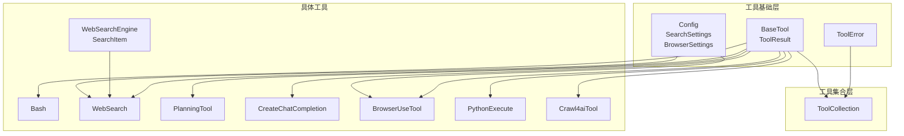
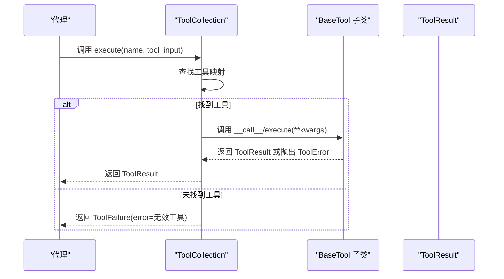
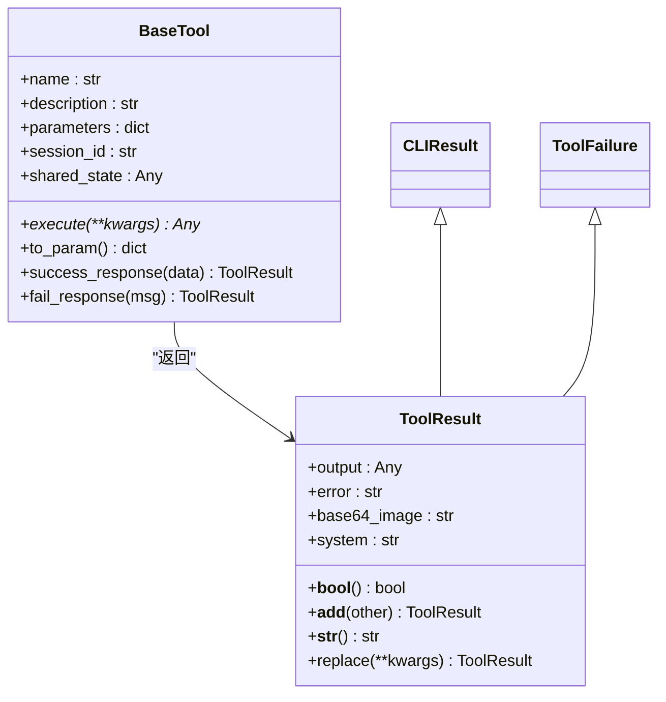
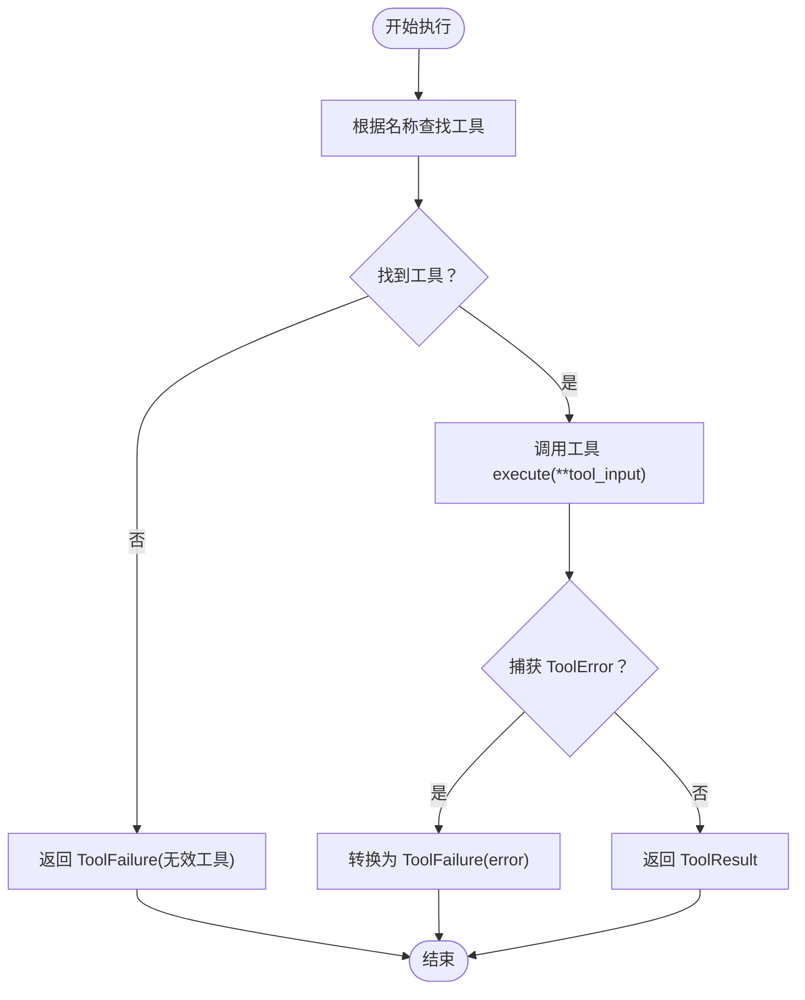
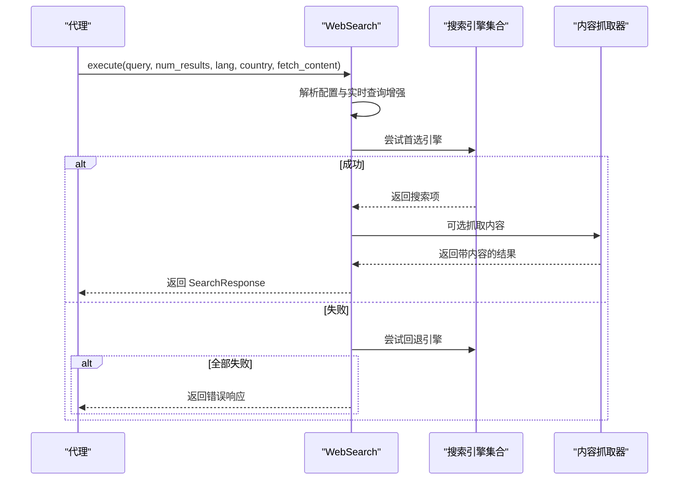
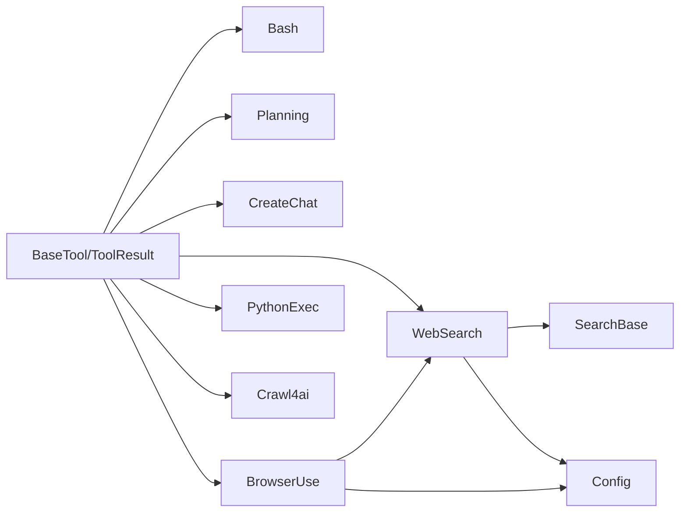

# 工具调用系统

<cite>
**本文档引用的文件**
- [backend/agent/tool/base.py](file://backend/agent/tool/base.py)
- [backend/agent/tool/tool_collection.py](file://backend/agent/tool/tool_collection.py)
- [backend/agent/tool/__init__.py](file://backend/agent/tool/__init__.py)
- [backend/agent/tool/bash.py](file://backend/agent/tool/bash.py)
- [backend/agent/tool/web_search.py](file://backend/agent/tool/web_search.py)
- [backend/agent/tool/planning.py](file://backend/agent/tool/planning.py)
- [backend/agent/tool/create_chat_completion.py](file://backend/agent/tool/create_chat_completion.py)
- [backend/agent/tool/browser_use_tool.py](file://backend/agent/tool/browser_use_tool.py)
- [backend/agent/tool/python_execute.py](file://backend/agent/tool/python_execute.py)
- [backend/agent/tool/crawl4ai.py](file://backend/agent/tool/crawl4ai.py)
- [backend/agent/tool/search/base.py](file://backend/agent/tool/search/base.py)
- [backend/agent/exceptions.py](file://backend/agent/exceptions.py)
- [backend/agent/config.py](file://backend/agent/config.py)
</cite>

## 目录
1. [简介](#简介)
2. [项目结构](#项目结构)
3. [核心组件](#核心组件)
4. [架构总览](#架构总览)
5. [详细组件分析](#详细组件分析)
6. [依赖关系分析](#依赖关系分析)
7. [性能考虑](#性能考虑)
8. [故障排除指南](#故障排除指南)
9. [结论](#结论)
10. [附录](#附录)

## 简介
本文件系统化阐述 ResumeAgent 的工具调用系统，涵盖工具注册与发现、参数验证与错误处理、工具集合管理、动态工具加载与工具链组合等机制。文档同时提供工具开发指南、自定义工具创建与集成最佳实践，并通过序列图与类图展示工具与代理的交互协议及内部数据流。

## 项目结构
工具系统位于后端模块的工具子包下，采用“按功能分层”的组织方式：
- 基础抽象与结果模型：base.py
- 工具集合管理：tool_collection.py
- 工具导出入口：__init__.py
- 具体工具实现：bash.py、web_search.py、planning.py、create_chat_completion.py、browser_use_tool.py、python_execute.py、crawl4ai.py
- 搜索引擎基类：search/base.py
- 异常与配置：exceptions.py、config.py

**图表来源**
- [backend/agent/tool/base.py:80-178](file://backend/agent/tool/base.py#L80-L178)
- [backend/agent/tool/tool_collection.py:11-74](file://backend/agent/tool/tool_collection.py#L11-L74)
- [backend/agent/tool/web_search.py:168-484](file://backend/agent/tool/web_search.py#L168-L484)
- [backend/agent/tool/planning.py:14-364](file://backend/agent/tool/planning.py#L14-L364)
- [backend/agent/tool/create_chat_completion.py:8-170](file://backend/agent/tool/create_chat_completion.py#L8-L170)
- [backend/agent/tool/browser_use_tool.py:40-577](file://backend/agent/tool/browser_use_tool.py#L40-L577)
- [backend/agent/tool/python_execute.py:9-76](file://backend/agent/tool/python_execute.py#L9-L76)
- [backend/agent/tool/crawl4ai.py:18-272](file://backend/agent/tool/crawl4ai.py#L18-L272)
- [backend/agent/tool/search/base.py:6-41](file://backend/agent/tool/search/base.py#L6-L41)
- [backend/agent/exceptions.py:1-14](file://backend/agent/exceptions.py#L1-L14)
- [backend/agent/config.py:148-201](file://backend/agent/config.py#L148-L201)

**章节来源**
- [backend/agent/tool/base.py:80-178](file://backend/agent/tool/base.py#L80-L178)
- [backend/agent/tool/tool_collection.py:11-74](file://backend/agent/tool/tool_collection.py#L11-L74)
- [backend/agent/tool/__init__.py:1-49](file://backend/agent/tool/__init__.py#L1-L49)

## 核心组件
- BaseTool：所有工具的抽象基类，提供统一的执行接口、参数模式生成、成功/失败响应封装与 Pydantic 模型能力。
- ToolResult：标准化的工具执行结果载体，支持输出、错误、图片与系统消息字段。
- ToolCollection：工具集合容器，负责工具注册、名称映射、顺序执行与批量执行。
- 具体工具：如 Bash、WebSearch、PlanningTool、CreateChatCompletion、BrowserUseTool、PythonExecute、Crawl4aiTool 等，均继承 BaseTool 并实现 execute 方法。

**章节来源**
- [backend/agent/tool/base.py:80-178](file://backend/agent/tool/base.py#L80-L178)
- [backend/agent/tool/tool_collection.py:11-74](file://backend/agent/tool/tool_collection.py#L11-L74)

## 架构总览
工具调用系统遵循“抽象基类 + 结果模型 + 集合管理 + 具体实现”的分层设计。代理通过 ToolCollection 统一调度工具，工具以 OpenAI 函数调用格式暴露元数据（名称、描述、参数），并在执行过程中返回 ToolResult 或抛出 ToolError。

**图表来源**
- [backend/agent/tool/tool_collection.py:27-48](file://backend/agent/tool/tool_collection.py#L27-L48)
- [backend/agent/tool/base.py:120-127](file://backend/agent/tool/base.py#L120-L127)

## 详细组件分析

### 基础抽象与结果模型
- BaseTool
  - 提供统一的 __call__ 和 execute 接口，便于异步调用。
  - to_param 将工具元数据转换为 OpenAI 函数调用格式，便于代理进行函数式调用规划。
  - success_response/fail_response 提供一致的成功/失败响应构造。
- ToolResult
  - 支持布尔判断、字段合并与字符串化，便于上层聚合与展示。
  - 支持 base64 图片与系统消息，适配浏览器截图等场景。

**图表来源**
- [backend/agent/tool/base.py:40-178](file://backend/agent/tool/base.py#L40-L178)

**章节来源**
- [backend/agent/tool/base.py:40-178](file://backend/agent/tool/base.py#L40-L178)

### 工具集合管理
- ToolCollection
  - 维护工具列表与名称到实例的映射，支持按名查找与批量执行。
  - execute(name, tool_input)：根据名称定位工具并调用，捕获 ToolError 转换为 ToolFailure。
  - add_tool/add_tools：动态注册工具，避免同名冲突并记录警告。
  - execute_all：顺序执行所有工具，收集结果或失败项。

**图表来源**
- [backend/agent/tool/tool_collection.py:27-48](file://backend/agent/tool/tool_collection.py#L27-L48)

**章节来源**
- [backend/agent/tool/tool_collection.py:11-74](file://backend/agent/tool/tool_collection.py#L11-L74)

### Bash 工具
- 功能：在受控会话中执行 Bash 命令，支持后台运行、超时控制与交互中断。
- 关键点：
  - _BashSession：维护子进程、超时与缓冲区清理。
  - 参数校验：命令必填；restart 控制会话重启。
  - 错误处理：ToolError 抛出，CLIResult 输出系统提示。

**章节来源**
- [backend/agent/tool/bash.py:16-153](file://backend/agent/tool/bash.py#L16-L153)

### WebSearch 工具
- 功能：多搜索引擎检索与内容抓取，具备自动降级与重试机制。
- 关键点：
  - 多引擎策略：首选引擎 + 回退引擎，失败自动切换。
  - 实时查询增强：对天气、新闻、股价等关键词自动附加日期。
  - 内容提取：可选抓取结果页正文并截断输出。
  - 配置驱动：从 config.search_config 读取语言、国家、重试次数与延迟。

**图表来源**
- [backend/agent/tool/web_search.py:251-354](file://backend/agent/tool/web_search.py#L251-L354)
- [backend/agent/tool/search/base.py:20-41](file://backend/agent/tool/search/base.py#L20-L41)

**章节来源**
- [backend/agent/tool/web_search.py:168-484](file://backend/agent/tool/web_search.py#L168-L484)
- [backend/agent/tool/search/base.py:6-41](file://backend/agent/tool/search/base.py#L6-L41)
- [backend/agent/config.py:148-170](file://backend/agent/config.py#L148-L170)

### Planning 工具
- 功能：计划创建、更新、进度标记与活动计划切换。
- 关键点：
  - 命令式接口：create/update/list/get/set_active/mark_step/delete。
  - 参数校验：严格的必填字段与枚举值检查。
  - 进度统计：计算完成/进行中/阻塞/未开始步骤数量与百分比。

**章节来源**
- [backend/agent/tool/planning.py:14-364](file://backend/agent/tool/planning.py#L14-L364)

### CreateChatCompletion 工具
- 功能：基于响应类型动态构建参数模式并进行类型转换。
- 关键点：
  - 类型支持：str、int、float、bool、dict、list、Union、Pydantic 模型。
  - schema 生成：根据类型提示生成 JSON Schema。
  - 执行：按需提取字段并进行类型转换，失败时回退为原值。

**章节来源**
- [backend/agent/tool/create_chat_completion.py:8-170](file://backend/agent/tool/create_chat_completion.py#L8-L170)

### BrowserUseTool 工具
- 功能：浏览器自动化（导航、点击、输入、滚动、内容提取、标签管理）。
- 关键点：
  - 依赖可选：browser_use 未安装时返回错误提示。
  - 状态保持：单实例跨调用维持浏览器会话。
  - 安全限制：通过锁保证并发安全。
  - 内容提取：结合 LLM 与函数调用提取目标内容。

**章节来源**
- [backend/agent/tool/browser_use_tool.py:40-577](file://backend/agent/tool/browser_use_tool.py#L40-L577)
- [backend/agent/config.py:178-201](file://backend/agent/config.py#L178-L201)

### PythonExecute 工具
- 功能：在受限环境中执行 Python 代码，仅捕获 print 输出。
- 关键点：
  - 多进程隔离：防止长时间运行与副作用影响主进程。
  - 超时控制：超过阈值终止进程并返回错误信息。

**章节来源**
- [backend/agent/tool/python_execute.py:9-76](file://backend/agent/tool/python_execute.py#L9-L76)

### Crawl4ai 工具
- 功能：高性能网页爬虫，提取干净 Markdown 内容并统计链接与图片数量。
- 关键点：
  - URL 校验与批量处理。
  - 可配置缓存绕过、超时与词数阈值。
  - 统计指标：成功率、耗时、标题、字数、链接数、图片数。

**章节来源**
- [backend/agent/tool/crawl4ai.py:18-272](file://backend/agent/tool/crawl4ai.py#L18-L272)

### 工具注册与发现
- __all__ 导出：集中声明可公开使用的工具类，便于外部导入。
- 可选依赖：对 BrowserUseTool 与 Crawl4aiTool 进行 try/except 包裹，避免缺失依赖导致启动失败。
- 动态加载：ToolCollection 在运行时通过名称映射定位工具实例。

**章节来源**
- [backend/agent/tool/__init__.py:1-49](file://backend/agent/tool/__init__.py#L1-L49)
- [backend/agent/tool/tool_collection.py:17-20](file://backend/agent/tool/tool_collection.py#L17-L20)

## 依赖关系分析
- 工具间耦合
  - WebSearch 依赖搜索引擎基类与配置模块。
  - BrowserUseTool 依赖 WebSearch 以实现“网络搜索”动作。
  - 所有工具共享 BaseTool 与 ToolResult，降低耦合度。
- 外部依赖
  - requests、BeautifulSoup、tenacity 用于 WebSearch。
  - browser_use 用于 BrowserUseTool（可选）。
  - crawl4ai 用于 Crawl4aiTool（可选）。
- 配置注入
  - config.search_config、config.browser_config 等为工具提供运行时参数。

**图表来源**
- [backend/agent/tool/web_search.py:16-23](file://backend/agent/tool/web_search.py#L16-L23)
- [backend/agent/tool/browser_use_tool.py:17-21](file://backend/agent/tool/browser_use_tool.py#L17-L21)
- [backend/agent/tool/search/base.py:20-41](file://backend/agent/tool/search/base.py#L20-L41)
- [backend/agent/config.py:148-201](file://backend/agent/config.py#L148-L201)

**章节来源**
- [backend/agent/tool/web_search.py:16-23](file://backend/agent/tool/web_search.py#L16-L23)
- [backend/agent/tool/browser_use_tool.py:17-21](file://backend/agent/tool/browser_use_tool.py#L17-L21)

## 性能考虑
- 异步执行：WebSearch 使用线程池与异步事件循环，提升并发抓取效率。
- 超时与重试：WebSearch 对搜索引擎设置最大重试次数与等待间隔，避免长时间阻塞。
- 缓存与降级：Crawl4ai 支持缓存绕过与阈值过滤，减少无效内容传输。
- 进程隔离：PythonExecute 使用多进程执行代码，避免阻塞与资源泄漏。
- 浏览器复用：BrowserUseTool 单例会话减少启动成本，但需注意资源清理。

## 故障排除指南
- 工具错误
  - ToolError：工具内部抛出，ToolCollection 捕获并转换为 ToolFailure，便于上层识别。
- 依赖缺失
  - BrowserUseTool/Crawl4aiTool：若未安装对应依赖，工具返回错误提示，建议按提示安装。
- 配置问题
  - 搜索引擎：检查 config.search_config.engine 与 fallback_engines 设置。
  - 浏览器：检查 config.browser_config.headless、proxy 等参数。
- 超时与中断
  - Bash：超时后需重启会话；可通过 restart 参数重置状态。
  - PythonExecute：超时后终止进程并返回错误信息。

**章节来源**
- [backend/agent/exceptions.py:1-14](file://backend/agent/exceptions.py#L1-L14)
- [backend/agent/tool/tool_collection.py:36-37](file://backend/agent/tool/tool_collection.py#L36-L37)
- [backend/agent/tool/bash.py:64-67](file://backend/agent/tool/bash.py#L64-L67)
- [backend/agent/tool/python_execute.py:67-75](file://backend/agent/tool/python_execute.py#L67-L75)
- [backend/agent/tool/browser_use_tool.py:143-150](file://backend/agent/tool/browser_use_tool.py#L143-L150)

## 结论
该工具调用系统以 BaseTool 为核心抽象，配合 ToolResult 标准化输出与 ToolCollection 统一调度，实现了高内聚、低耦合的工具生态。通过 OpenAI 函数调用格式的参数模式与错误处理机制，系统既满足代理的工具编排需求，又兼顾了可扩展性与可维护性。建议在新增工具时严格遵循参数模式生成与错误处理规范，并充分利用配置模块实现运行时可调优。

## 附录

### 工具开发指南
- 继承 BaseTool 并实现 execute 方法。
- 明确定义 name、description、parameters 字段，确保 to_param 输出符合 OpenAI 函数调用格式。
- 使用 success_response/fail_response 返回标准结果。
- 对外部依赖进行可选导入与错误提示。
- 在 __init__.py 中纳入导出清单，便于统一引用。

**章节来源**
- [backend/agent/tool/base.py:120-170](file://backend/agent/tool/base.py#L120-L170)
- [backend/agent/tool/__init__.py:28-49](file://backend/agent/tool/__init__.py#L28-L49)

### 自定义工具创建与集成最佳实践
- 参数模式：优先使用 Pydantic 模型或 JSON Schema 描述参数，明确必填与默认值。
- 错误处理：统一抛出 ToolError，避免吞异常；必要时返回 ToolFailure。
- 并发安全：涉及共享资源（如浏览器）时使用锁或单例管理。
- 配置注入：通过 config.* 读取运行时参数，避免硬编码。
- 日志记录：使用 get_logger 记录关键路径与异常堆栈，便于排查。

**章节来源**
- [backend/agent/tool/browser_use_tool.py:127-131](file://backend/agent/tool/browser_use_tool.py#L127-L131)
- [backend/agent/config.py:317-351](file://backend/agent/config.py#L317-L351)