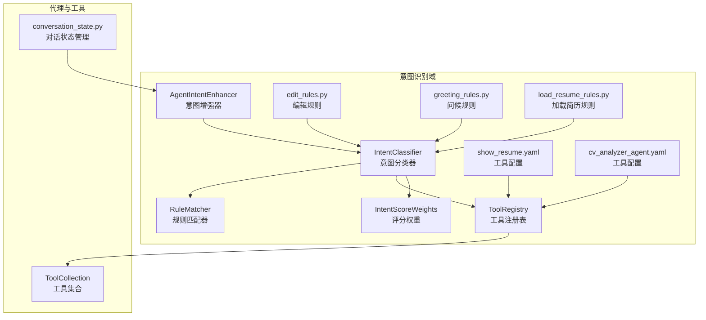
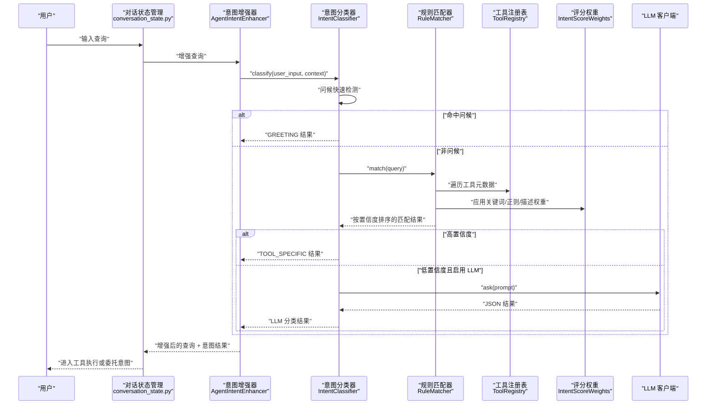
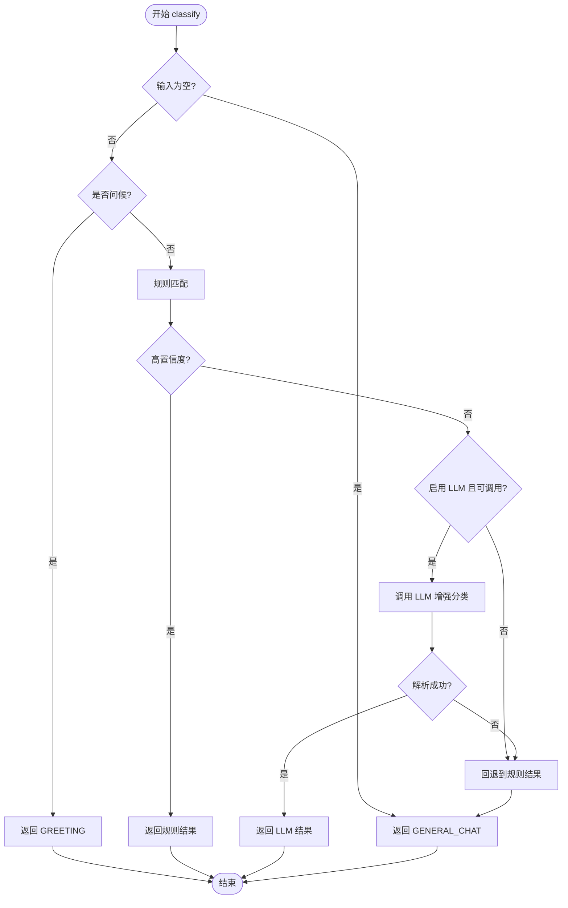
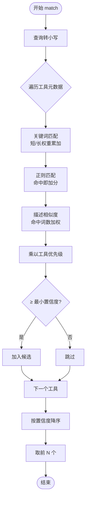
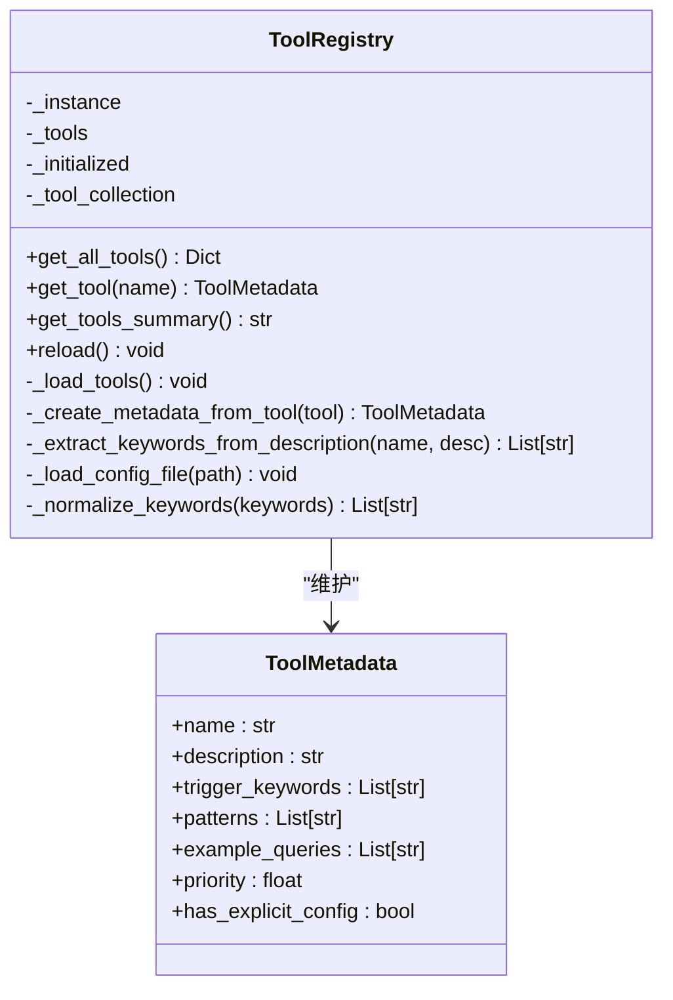
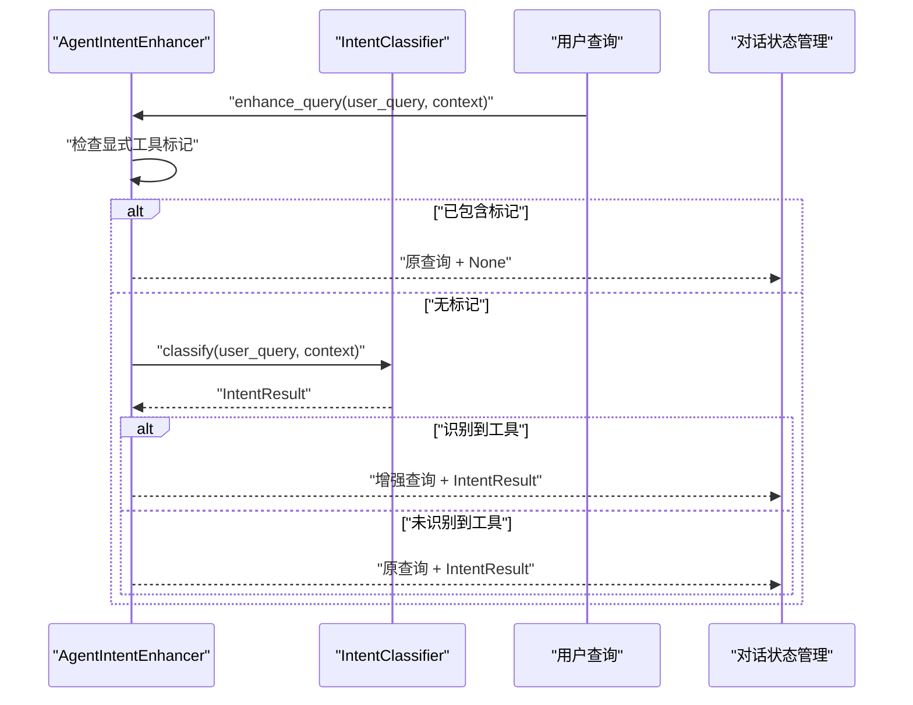
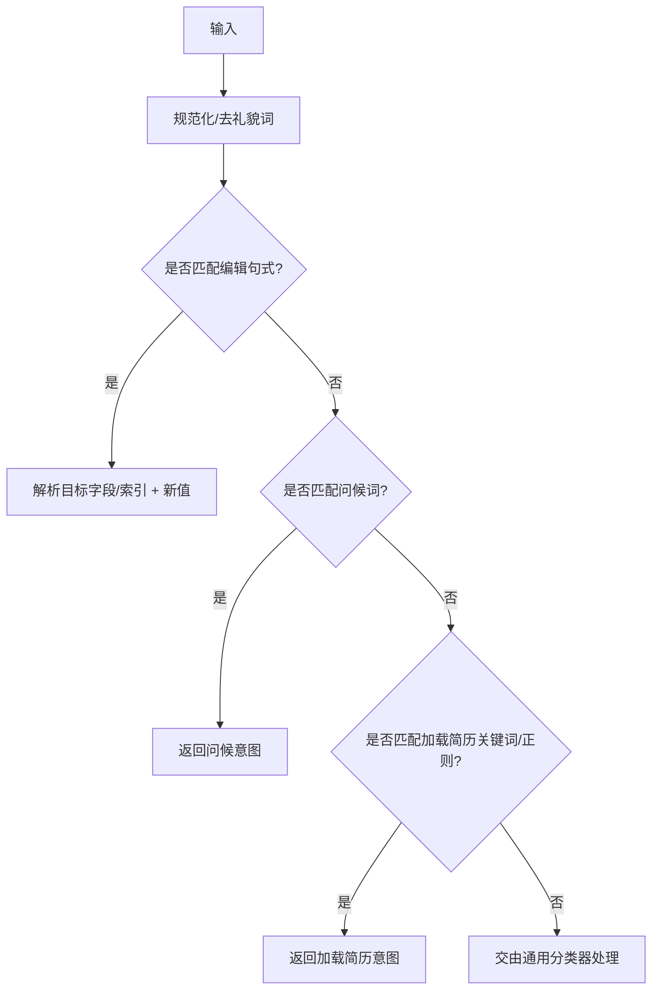
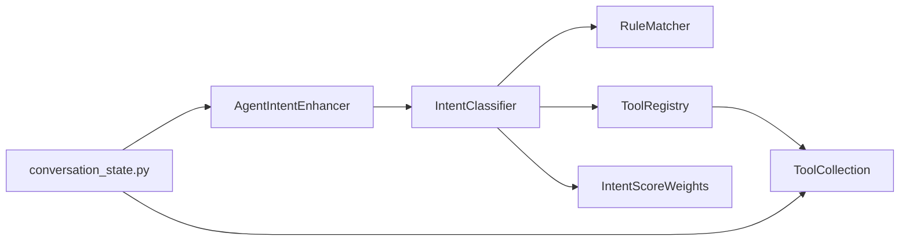

# 意图与领域规则

<cite>
**本文引用的文件**
- [intent_classifier.py](file://backend/agent/domain/intent/intent_classifier.py)
- [rule_matcher.py](file://backend/agent/domain/intent/rule_matcher.py)
- [tool_registry.py](file://backend/agent/domain/intent/tool_registry.py)
- [weights.py](file://backend/agent/domain/intent/weights.py)
- [intent_enhancer.py](file://backend/agent/domain/intent/intent_enhancer.py)
- [edit_rules.py](file://backend/agent/domain/intent/edit_rules.py)
- [greeting_rules.py](file://backend/agent/domain/intent/greeting_rules.py)
- [load_resume_rules.py](file://backend/agent/domain/intent/load_resume_rules.py)
- [show_resume.yaml](file://backend/agent/domain/intent/configs/show_resume.yaml)
- [cv_analyzer_agent.yaml](file://backend/agent/domain/intent/configs/cv_analyzer_agent.yaml)
- [__init__.py](file://backend/agent/domain/intent/__init__.py)
- [conversation_state.py](file://backend/agent/application/conversation/conversation_state.py)
- [tool_collection.py](file://backend/agent/tool/tool_collection.py)
</cite>

## 目录
1. [简介](#简介)
2. [项目结构](#项目结构)
3. [核心组件](#核心组件)
4. [架构总览](#架构总览)
5. [详细组件分析](#详细组件分析)
6. [依赖关系分析](#依赖关系分析)
7. [性能考量](#性能考量)
8. [故障排查指南](#故障排查指南)
9. [结论](#结论)
10. [附录](#附录)

## 简介
本文件系统性阐述 ResumeAgent 中“意图与领域规则”子系统，涵盖意图分类器的工作原理、规则匹配引擎、工具注册机制、领域规则设计模式、意图识别算法与决策流程，并提供规则配置指南、自定义规则开发方法、性能优化策略以及与代理协作的实际应用与示例。

## 项目结构
该子系统位于后端领域层的意图识别域，围绕“两阶段分类 + 工具注册表 + 意图增强”的架构组织，关键模块包括：
- 意图分类器：两阶段分类（规则匹配 + LLM 增强）
- 规则匹配器：关键词/正则/描述相似度 + 权重与优先级
- 工具注册表：自动发现 + YAML 配置覆盖 + 关键词自动生成
- 意图增强器：在代理执行前为查询注入工具标记
- 领域规则：编辑、问候、加载简历等专用快速规则
- 配置文件：各工具的关键词、正则、示例与优先级

图表来源
- [intent_classifier.py:50-332](file://backend/agent/domain/intent/intent_classifier.py#L50-L332)
- [rule_matcher.py:25-115](file://backend/agent/domain/intent/rule_matcher.py#L25-L115)
- [tool_registry.py:60-259](file://backend/agent/domain/intent/tool_registry.py#L60-L259)
- [intent_enhancer.py:21-170](file://backend/agent/domain/intent/intent_enhancer.py#L21-L170)
- [weights.py:10-31](file://backend/agent/domain/intent/weights.py#L10-L31)
- [edit_rules.py:1-206](file://backend/agent/domain/intent/edit_rules.py#L1-L206)
- [greeting_rules.py:1-42](file://backend/agent/domain/intent/greeting_rules.py#L1-L42)
- [load_resume_rules.py:1-117](file://backend/agent/domain/intent/load_resume_rules.py#L1-L117)
- [show_resume.yaml:1-21](file://backend/agent/domain/intent/configs/show_resume.yaml#L1-L21)
- [cv_analyzer_agent.yaml:1-31](file://backend/agent/domain/intent/configs/cv_analyzer_agent.yaml#L1-L31)
- [conversation_state.py:467-559](file://backend/agent/application/conversation/conversation_state.py#L467-L559)
- [tool_collection.py:11-74](file://backend/agent/tool/tool_collection.py#L11-L74)

章节来源
- [__init__.py:1-37](file://backend/agent/domain/intent/__init__.py#L1-L37)

## 核心组件
- 意图分类器：提供同步与异步两类分类接口，先做问候快速检测，再进行规则匹配；若规则置信度不足或启用 LLM，则进行 LLM 增强分类，最终输出意图类型、匹配工具列表与置信度。
- 规则匹配器：对每个工具计算关键词（短/长）、正则命中、描述相似度得分，乘以工具优先级，按置信度排序并限制返回数量。
- 工具注册表：单例模式，从工具集合自动发现工具元数据，加载 YAML 配置覆盖默认值，必要时自动生成关键词；提供工具摘要给 LLM。
- 意图增强器：在代理执行前对用户查询进行意图识别，若识别到特定工具，则在查询前注入工具标记，便于后续路由到具体工具。
- 领域规则：针对编辑、问候、加载简历等场景提供确定性快速规则，提升首屏体验与稳定性。

章节来源
- [intent_classifier.py:50-332](file://backend/agent/domain/intent/intent_classifier.py#L50-L332)
- [rule_matcher.py:25-115](file://backend/agent/domain/intent/rule_matcher.py#L25-L115)
- [tool_registry.py:60-259](file://backend/agent/domain/intent/tool_registry.py#L60-L259)
- [intent_enhancer.py:21-170](file://backend/agent/domain/intent/intent_enhancer.py#L21-L170)
- [weights.py:10-31](file://backend/agent/domain/intent/weights.py#L10-L31)
- [edit_rules.py:1-206](file://backend/agent/domain/intent/edit_rules.py#L1-L206)
- [greeting_rules.py:1-42](file://backend/agent/domain/intent/greeting_rules.py#L1-L42)
- [load_resume_rules.py:1-117](file://backend/agent/domain/intent/load_resume_rules.py#L1-L117)

## 架构总览
意图识别系统采用“规则优先 + LLM 增强”的混合策略，结合工具注册表与意图增强器，形成从用户输入到工具调用的闭环。

图表来源
- [intent_enhancer.py:67-114](file://backend/agent/domain/intent/intent_enhancer.py#L67-L114)
- [intent_classifier.py:132-188](file://backend/agent/domain/intent/intent_classifier.py#L132-L188)
- [rule_matcher.py:46-103](file://backend/agent/domain/intent/rule_matcher.py#L46-L103)
- [tool_registry.py:220-243](file://backend/agent/domain/intent/tool_registry.py#L220-L243)
- [weights.py:10-20](file://backend/agent/domain/intent/weights.py#L10-L20)
- [conversation_state.py:467-559](file://backend/agent/application/conversation/conversation_state.py#L467-L559)

## 详细组件分析

### 意图分类器（IntentClassifier）
- 设计要点
  - 两阶段分类：规则匹配（关键词/正则/描述相似度）+ LLM 增强
  - 置信度阈值：高置信度直接使用规则结果；低置信度回退到规则或尝试 LLM
  - 问候快速通道：短文本命中问候词集直接返回问候意图
- 数据结构
  - IntentType：工具特定、普通对话、问候、未知
  - IntentResult：包含意图类型、匹配工具列表、置信度与推理过程
- 处理流程
  - 输入校验 → 问候检测 → 规则匹配 → 置信度判定 → LLM 增强（可选）→ 构建结果

图表来源
- [intent_classifier.py:96-188](file://backend/agent/domain/intent/intent_classifier.py#L96-L188)

章节来源
- [intent_classifier.py:50-332](file://backend/agent/domain/intent/intent_classifier.py#L50-L332)

### 规则匹配器（RuleMatcher）
- 设计要点
  - 对每个工具计算关键词得分（短/长不同权重，上限控制）、正则命中（命中即加分）、描述相似度（命中词数加权，上限控制）
  - 乘以工具优先级，过滤低于最小置信度的候选，按置信度降序，最多返回前 N 个
- 复杂度
  - 时间复杂度：O(T·(K+P+D))，T 为工具数，K/P/D 为关键词/正则/描述处理量
  - 空间复杂度：O(N)，N 为返回的匹配数量

图表来源
- [rule_matcher.py:46-103](file://backend/agent/domain/intent/rule_matcher.py#L46-L103)

章节来源
- [rule_matcher.py:25-115](file://backend/agent/domain/intent/rule_matcher.py#L25-L115)
- [weights.py:10-20](file://backend/agent/domain/intent/weights.py#L10-L20)

### 工具注册表（ToolRegistry）
- 设计要点
  - 单例模式，延迟注入工具集合
  - 自动发现：从工具集合提取工具名与描述，生成关键词与默认优先级
  - 配置覆盖：加载 configs/*.yaml，覆盖关键词/正则/示例/优先级
  - 自动生成：若未显式配置关键词，从描述中抽取重要词汇（过滤中英文停用词）
  - 工具摘要：为 LLM 分类提供简洁工具清单
- 关键接口
  - get_all_tools / get_tool / get_tools_summary
  - reload 支持开发期热更新

图表来源
- [tool_registry.py:60-259](file://backend/agent/domain/intent/tool_registry.py#L60-L259)

章节来源
- [tool_registry.py:60-259](file://backend/agent/domain/intent/tool_registry.py#L60-L259)

### 意图增强器（AgentIntentEnhancer）
- 设计要点
  - 若用户查询已包含显式工具标记，则跳过意图识别，直接返回
  - 否则调用意图分类器进行识别，若识别到工具特定意图，则在查询前添加工具标记
  - 提供同步/异步两种增强方式，同步版本仅使用规则匹配
- 与代理协作
  - 增强后的查询由对话状态管理接收，根据意图类型决定是否调用工具或进入委托意图分支

图表来源
- [intent_enhancer.py:67-114](file://backend/agent/domain/intent/intent_enhancer.py#L67-L114)
- [conversation_state.py:467-559](file://backend/agent/application/conversation/conversation_state.py#L467-L559)

章节来源
- [intent_enhancer.py:21-170](file://backend/agent/domain/intent/intent_enhancer.py#L21-L170)
- [conversation_state.py:467-559](file://backend/agent/application/conversation/conversation_state.py#L467-L559)

### 领域规则（编辑/问候/加载简历）
- 编辑规则（edit_rules.py）
  - 快速确定性规则：规范化输入、去除礼貌前缀/后缀、识别“把…改成…”句式、解析目标字段（如姓名、实习公司）与索引
  - 返回结构化编辑指令（路径、动作、值、节、字段、索引、归一化文本）
- 问候规则（greeting_rules.py）
  - 快速问候检测：命中预设短词集合或归一化后的短词集合
- 加载简历规则（load_resume_rules.py）
  - 从 YAML 加载关键词/正则，若不可用则回落到通用模式
  - 特殊处理：粘贴导入（包含“导入我的简历内容：…”）不走文件路径逻辑

图表来源
- [edit_rules.py:125-205](file://backend/agent/domain/intent/edit_rules.py#L125-L205)
- [greeting_rules.py:21-41](file://backend/agent/domain/intent/greeting_rules.py#L21-L41)
- [load_resume_rules.py:79-116](file://backend/agent/domain/intent/load_resume_rules.py#L79-L116)

章节来源
- [edit_rules.py:1-206](file://backend/agent/domain/intent/edit_rules.py#L1-L206)
- [greeting_rules.py:1-42](file://backend/agent/domain/intent/greeting_rules.py#L1-L42)
- [load_resume_rules.py:1-117](file://backend/agent/domain/intent/load_resume_rules.py#L1-L117)

## 依赖关系分析
- 组件耦合
  - 意图分类器依赖规则匹配器、工具注册表与评分权重
  - 意图增强器依赖意图分类器
  - 工具注册表依赖工具集合与 YAML 配置
  - 对话状态管理依赖意图增强器与工具集合
- 外部依赖
  - LLM 客户端（OpenManus ask 接口）用于意图增强
  - 工具集合（ToolCollection）提供工具实例与执行能力

图表来源
- [intent_classifier.py:83-94](file://backend/agent/domain/intent/intent_classifier.py#L83-L94)
- [intent_enhancer.py:47-47](file://backend/agent/domain/intent/intent_enhancer.py#L47-L47)
- [tool_registry.py:80-90](file://backend/agent/domain/intent/tool_registry.py#L80-L90)
- [conversation_state.py:467-477](file://backend/agent/application/conversation/conversation_state.py#L467-L477)
- [tool_collection.py:17-20](file://backend/agent/tool/tool_collection.py#L17-L20)

章节来源
- [__init__.py:10-25](file://backend/agent/domain/intent/__init__.py#L10-L25)

## 性能考量
- 规则匹配性能
  - 控制工具数量与关键词/正则复杂度，避免过多正则异常捕获开销
  - 通过权重上限与最小置信度阈值减少无效计算
- LLM 增强成本
  - 仅在低置信度或需要时触发，降低调用频率
  - 温度参数设置为较低值，提高稳定性与一致性
- 缓存与热更新
  - 工具注册表支持 reload，便于开发期快速迭代
  - 加载简历规则使用缓存以减少重复解析

## 故障排查指南
- LLM 分类失败
  - 现象：意图增强阶段抛出异常或回退到规则
  - 排查：确认 LLM 客户端可用性、提示词构造与 JSON 提取逻辑
- 正则错误
  - 现象：规则匹配日志出现正则错误警告
  - 排查：检查工具配置中的正则表达式语法
- 工具未被识别
  - 现象：意图分类返回普通对话
  - 排查：检查工具注册表是否正确加载配置、关键词/正则是否合理、优先级是否过低
- 查询未注入工具标记
  - 现象：代理未按预期路由到工具
  - 排查：确认意图增强器是否被调用、查询是否包含显式工具标记、增强后的查询是否传入对话状态管理

章节来源
- [intent_classifier.py:171-182](file://backend/agent/domain/intent/intent_classifier.py#L171-L182)
- [rule_matcher.py:74-81](file://backend/agent/domain/intent/rule_matcher.py#L74-L81)
- [tool_registry.py:166-204](file://backend/agent/domain/intent/tool_registry.py#L166-L204)
- [intent_enhancer.py:111-113](file://backend/agent/domain/intent/intent_enhancer.py#L111-L113)

## 结论
该意图与领域规则系统通过“规则优先 + LLM 增强”的混合策略，实现了高吞吐、可扩展且可解释的意图识别。工具注册表与 YAML 配置提供了灵活的规则定制能力，意图增强器将识别结果无缝注入到代理执行链路中，显著提升了用户体验与系统稳定性。建议在生产环境中结合业务场景持续优化关键词与正则，合理设置阈值与权重，并利用缓存与热更新机制提升开发效率。

## 附录

### 规则配置指南
- 工具配置文件位置
  - configs/*.yaml：如 show_resume.yaml、cv_analyzer_agent.yaml
- 配置项说明
  - name：工具名称（需与工具实例一致）
  - keywords：关键词列表（自动去重与小写标准化）
  - patterns：正则表达式列表
  - examples：示例查询
  - priority：工具优先级（数值越大越靠前）
- 配置加载顺序
  - 自动发现工具元数据
  - 加载 YAML 配置覆盖默认值
  - 若未显式配置关键词，将从描述中自动生成

章节来源
- [tool_registry.py:166-218](file://backend/agent/domain/intent/tool_registry.py#L166-L218)
- [show_resume.yaml:1-21](file://backend/agent/domain/intent/configs/show_resume.yaml#L1-L21)
- [cv_analyzer_agent.yaml:1-31](file://backend/agent/domain/intent/configs/cv_analyzer_agent.yaml#L1-L31)

### 自定义规则开发
- 新增工具
  - 在工具集合中注册新工具实例
  - 如需显式配置关键词/正则/优先级，请在 configs 下新增 YAML 文件
- 优化关键词与正则
  - 通过权重与上限控制得分分布
  - 使用更精确的正则表达式减少误匹配
- 领域规则扩展
  - 在 edit_rules.py 或新增文件中定义确定性规则
  - 保持输入规范化与解析逻辑清晰

章节来源
- [tool_registry.py:100-133](file://backend/agent/domain/intent/tool_registry.py#L100-L133)
- [weights.py:10-20](file://backend/agent/domain/intent/weights.py#L10-L20)
- [edit_rules.py:125-205](file://backend/agent/domain/intent/edit_rules.py#L125-L205)

### 实际应用场景与示例
- 场景一：加载简历
  - 快速规则：命中“加载/打开/查看/选择/切换 + 简历/cv”
  - 行为：直接进入加载简历流程，避免 LLM 干扰
- 场景二：编辑简历字段
  - 快速规则：识别“把…改成…”句式，解析字段路径与新值
  - 行为：构造编辑指令并执行
- 场景三：问候
  - 快速规则：命中短词集合或归一化后的短词
  - 行为：直接返回问候意图，进入问候分支

章节来源
- [load_resume_rules.py:92-116](file://backend/agent/domain/intent/load_resume_rules.py#L92-L116)
- [edit_rules.py:144-205](file://backend/agent/domain/intent/edit_rules.py#L144-L205)
- [greeting_rules.py:34-41](file://backend/agent/domain/intent/greeting_rules.py#L34-L41)

### 与代理协作实现
- 对话状态管理在收到增强查询后：
  - 若识别为问候：切换到问候状态并返回
  - 若识别到工具：选择最高置信度工具并准备工具参数
  - 若未识别到工具：尝试识别代理委托意图（如分析、编辑等）

章节来源
- [conversation_state.py:467-559](file://backend/agent/application/conversation/conversation_state.py#L467-L559)