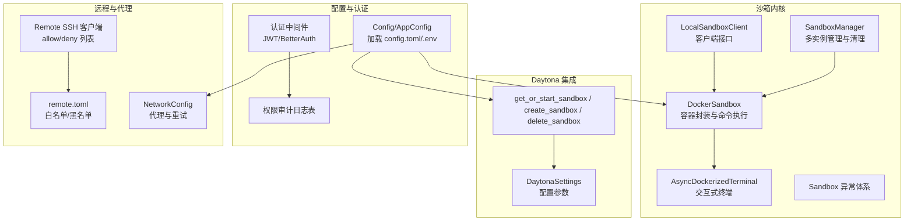
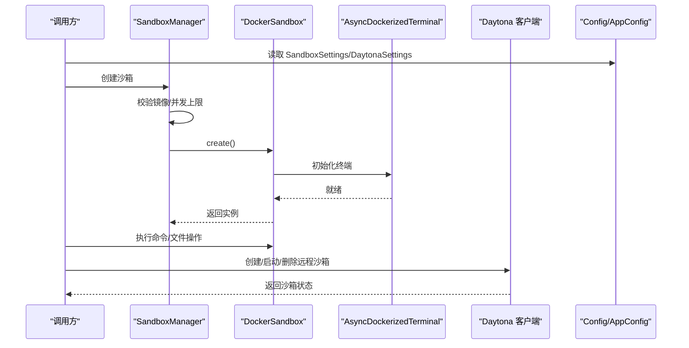
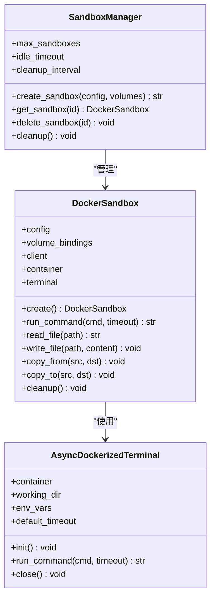
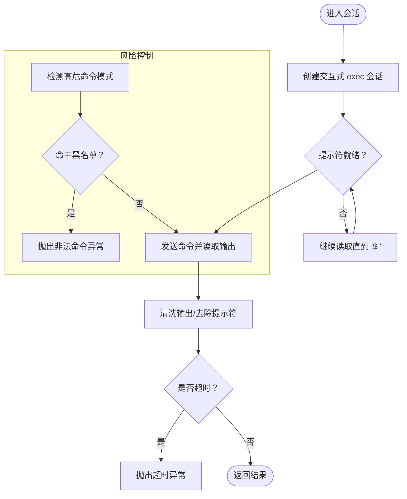
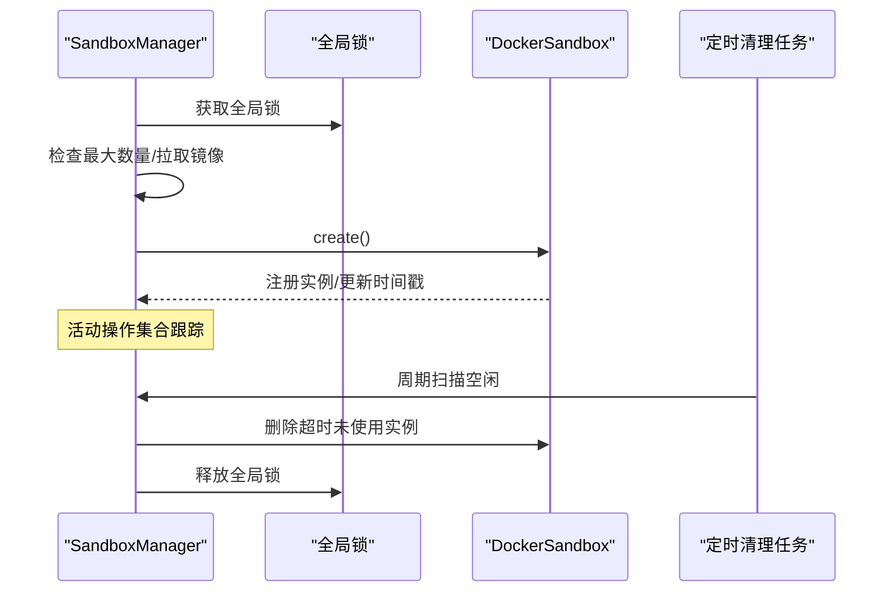
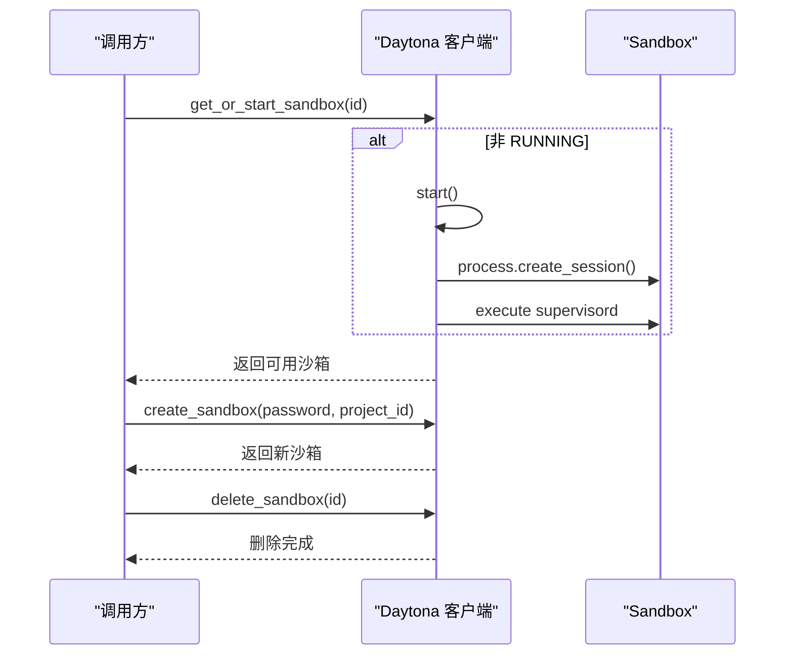
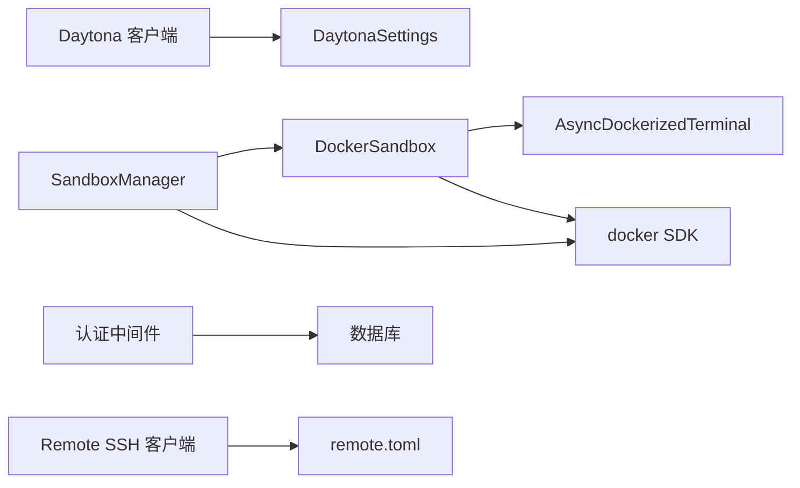

# 沙箱与安全

<cite>
**本文引用的文件**
- [backend/agent/sandbox/core/sandbox.py](file://backend/agent/sandbox/core/sandbox.py)
- [backend/agent/sandbox/core/manager.py](file://backend/agent/sandbox/core/manager.py)
- [backend/agent/sandbox/core/terminal.py](file://backend/agent/sandbox/core/terminal.py)
- [backend/agent/sandbox/client.py](file://backend/agent/sandbox/client.py)
- [backend/agent/sandbox/core/exceptions.py](file://backend/agent/sandbox/core/exceptions.py)
- [backend/agent/daytona/sandbox.py](file://backend/agent/daytona/sandbox.py)
- [backend/agent/config.py](file://backend/agent/config.py)
- [backend/middleware/auth.py](file://backend/middleware/auth.py)
- [models.py](file://backend/models.py)
- [remote/client.py](file://remote/client.py)
- [remote/remote.toml](file://remote/remote.toml)
- [config.toml](file://config.toml)
</cite>

## 目录
1. [引言](#引言)
2. [项目结构](#项目结构)
3. [核心组件](#核心组件)
4. [架构总览](#架构总览)
5. [详细组件分析](#详细组件分析)
6. [依赖关系分析](#依赖关系分析)
7. [性能考量](#性能考量)
8. [故障排除指南](#故障排除指南)
9. [结论](#结论)
10. [附录](#附录)

## 引言
本文件面向“沙箱与安全”主题，系统梳理项目中的沙箱隔离机制、安全执行环境、资源限制策略、Daytona 集成、容器化部署与权限控制，并给出安全最佳实践、漏洞防护与合规性建议、配置指南、安全审计方法与故障排除技巧，以及与代理系统的集成方式与性能影响评估。

## 项目结构
围绕沙箱与安全的关键模块主要分布在以下路径：
- 后端沙箱内核：Docker 容器封装、异步终端、资源管理与生命周期
- Daytona 集成：远程沙箱生命周期管理与服务启动
- 配置中心：统一加载 TOML/ENV 并生成运行时配置对象
- 权限与审计：认证中间件、权限审计日志表
- 远程执行与白名单：受控 SSH 命令执行
- 工具与代理：工具基类与网络代理配置

图示来源
- [backend/agent/sandbox/core/sandbox.py:18-103](file://backend/agent/sandbox/core/sandbox.py#L18-L103)
- [backend/agent/sandbox/core/terminal.py:251-346](file://backend/agent/sandbox/core/terminal.py#L251-L346)
- [backend/agent/sandbox/core/manager.py:16-65](file://backend/agent/sandbox/core/manager.py#L16-L65)
- [backend/agent/sandbox/client.py:86-198](file://backend/agent/sandbox/client.py#L86-L198)
- [backend/agent/daytona/sandbox.py:19-50](file://backend/agent/daytona/sandbox.py#L19-L50)
- [backend/agent/config.py:285-312](file://backend/agent/config.py#L285-L312)
- [backend/middleware/auth.py:113-145](file://backend/middleware/auth.py#L113-L145)
- [models.py:253-256](file://backend/models.py#L253-L256)
- [remote/client.py:26-37](file://remote/client.py#L26-L37)
- [remote/remote.toml:1-8](file://remote/remote.toml#L1-L8)
- [backend/agent/config.py:91-146](file://backend/agent/config.py#L91-L146)

章节来源
- [backend/agent/sandbox/core/sandbox.py:18-103](file://backend/agent/sandbox/core/sandbox.py#L18-L103)
- [backend/agent/sandbox/core/manager.py:16-65](file://backend/agent/sandbox/core/manager.py#L16-L65)
- [backend/agent/sandbox/core/terminal.py:251-346](file://backend/agent/sandbox/core/terminal.py#L251-L346)
- [backend/agent/sandbox/client.py:86-198](file://backend/agent/sandbox/client.py#L86-L198)
- [backend/agent/daytona/sandbox.py:19-50](file://backend/agent/daytona/sandbox.py#L19-L50)
- [backend/agent/config.py:285-312](file://backend/agent/config.py#L285-L312)
- [backend/middleware/auth.py:113-145](file://backend/middleware/auth.py#L113-L145)
- [models.py:253-256](file://backend/models.py#L253-L256)
- [remote/client.py:26-37](file://remote/client.py#L26-L37)
- [remote/remote.toml:1-8](file://remote/remote.toml#L1-L8)
- [backend/agent/config.py:91-146](file://backend/agent/config.py#L91-L146)

## 核心组件
- DockerSandbox：基于 Docker 的隔离执行环境，支持资源限制、工作目录映射、文件读写与命令执行；提供安全路径解析与超时控制。
- AsyncDockerizedTerminal：容器内交互式终端，支持命令执行、输出清洗、超时与风险命令检测。
- SandboxManager：多实例生命周期管理，含并发锁、空闲回收、镜像拉取与全局清理。
- LocalSandboxClient：本地沙箱客户端适配器，统一对外接口。
- Daytona 集成：按需懒加载 Daytona 客户端，支持创建/启动/删除远程沙箱并初始化 supervisord。
- 配置中心：集中加载 config.toml 与 .env，生成 SandboxSettings、DaytonaSettings、NetworkConfig 等。
- 权限与审计：认证中间件支持多种来源，配合权限审计日志表记录角色变更等操作。
- 远程执行与代理：SSH 客户端基于 allow/deny 白名单/黑名单校验命令；NetworkConfig 提供代理与重试策略。

章节来源
- [backend/agent/sandbox/core/sandbox.py:18-103](file://backend/agent/sandbox/core/sandbox.py#L18-L103)
- [backend/agent/sandbox/core/terminal.py:251-346](file://backend/agent/sandbox/core/terminal.py#L251-L346)
- [backend/agent/sandbox/core/manager.py:16-65](file://backend/agent/sandbox/core/manager.py#L16-L65)
- [backend/agent/sandbox/client.py:86-198](file://backend/agent/sandbox/client.py#L86-L198)
- [backend/agent/daytona/sandbox.py:19-50](file://backend/agent/daytona/sandbox.py#L19-L50)
- [backend/agent/config.py:285-312](file://backend/agent/config.py#L285-L312)
- [backend/middleware/auth.py:113-145](file://backend/middleware/auth.py#L113-L145)
- [models.py:253-256](file://backend/models.py#L253-L256)
- [remote/client.py:26-37](file://remote/client.py#L26-L37)
- [remote/remote.toml:1-8](file://remote/remote.toml#L1-L8)
- [backend/agent/config.py:91-146](file://backend/agent/config.py#L91-L146)

## 架构总览
下图展示沙箱与安全相关模块之间的交互关系与数据流：

图示来源
- [backend/agent/sandbox/core/manager.py:116-159](file://backend/agent/sandbox/core/manager.py#L116-L159)
- [backend/agent/sandbox/core/sandbox.py:49-99](file://backend/agent/sandbox/core/sandbox.py#L49-L99)
- [backend/agent/sandbox/core/terminal.py:278-289](file://backend/agent/sandbox/core/terminal.py#L278-L289)
- [backend/agent/daytona/sandbox.py:114-163](file://backend/agent/daytona/sandbox.py#L114-L163)
- [backend/agent/config.py:432-441](file://backend/agent/config.py#L432-L441)

## 详细组件分析

### DockerSandbox：容器化隔离与资源限制
- 容器创建：通过 host_config 设置内存限制、CPU 配额、网络模式与卷绑定；工作目录映射到临时宿主目录以避免跨主机冲突。
- 命令执行：通过 AsyncDockerizedTerminal 发送命令，支持超时与输出清洗；对危险命令进行显式检测。
- 文件操作：tar 流读写容器内外文件，提供 copy_to/copy_from/read_file/write_file；路径解析防止越界访问。
- 清理流程：关闭终端、停止并强制移除容器，捕获并汇总清理错误。

图示来源
- [backend/agent/sandbox/core/sandbox.py:18-103](file://backend/agent/sandbox/core/sandbox.py#L18-L103)
- [backend/agent/sandbox/core/terminal.py:251-346](file://backend/agent/sandbox/core/terminal.py#L251-L346)
- [backend/agent/sandbox/core/manager.py:16-65](file://backend/agent/sandbox/core/manager.py#L16-L65)

章节来源
- [backend/agent/sandbox/core/sandbox.py:49-99](file://backend/agent/sandbox/core/sandbox.py#L49-L99)
- [backend/agent/sandbox/core/sandbox.py:140-231](file://backend/agent/sandbox/core/sandbox.py#L140-L231)
- [backend/agent/sandbox/core/sandbox.py:232-314](file://backend/agent/sandbox/core/sandbox.py#L232-L314)
- [backend/agent/sandbox/core/sandbox.py:425-462](file://backend/agent/sandbox/core/sandbox.py#L425-L462)

### AsyncDockerizedTerminal：交互式终端与命令安全
- 会话建立：以 root 权限创建交互式 bash 会话，设置工作目录与环境变量，阻塞模式切换与提示符等待。
- 命令执行：发送命令并读取输出，清洗 echo $? 与提示符；支持超时；对高危命令进行显式拦截。
- 资源清理：退出会话、关闭 socket、检查 exec 实例状态，确保资源释放。

图示来源
- [backend/agent/sandbox/core/terminal.py:19-116](file://backend/agent/sandbox/core/terminal.py#L19-L116)
- [backend/agent/sandbox/core/terminal.py:139-216](file://backend/agent/sandbox/core/terminal.py#L139-L216)
- [backend/agent/sandbox/core/terminal.py:218-248](file://backend/agent/sandbox/core/terminal.py#L218-L248)

章节来源
- [backend/agent/sandbox/core/terminal.py:139-216](file://backend/agent/sandbox/core/terminal.py#L139-L216)
- [backend/agent/sandbox/core/terminal.py:218-248](file://backend/agent/sandbox/core/terminal.py#L218-L248)

### SandboxManager：并发与空闲回收
- 并发控制：每个沙箱实例拥有独立 asyncio.Lock，全局锁保护资源池；活动操作集合用于空闲判定。
- 生命周期：自动清理任务周期扫描空闲沙箱；优雅关闭时取消任务并并发清理所有实例。
- 镜像管理：确保所需镜像存在，缺失时异步拉取并记录日志。

图示来源
- [backend/agent/sandbox/core/manager.py:90-114](file://backend/agent/sandbox/core/manager.py#L90-L114)
- [backend/agent/sandbox/core/manager.py:176-207](file://backend/agent/sandbox/core/manager.py#L176-L207)
- [backend/agent/sandbox/core/manager.py:208-244](file://backend/agent/sandbox/core/manager.py#L208-L244)

章节来源
- [backend/agent/sandbox/core/manager.py:90-114](file://backend/agent/sandbox/core/manager.py#L90-L114)
- [backend/agent/sandbox/core/manager.py:176-207](file://backend/agent/sandbox/core/manager.py#L176-L207)
- [backend/agent/sandbox/core/manager.py:208-244](file://backend/agent/sandbox/core/manager.py#L208-L244)

### Daytona 集成：远程沙箱生命周期
- 懒加载：仅当配置存在 API Key 时初始化 Daytona 客户端。
- 创建/启动：根据 Resources 与环境变量创建沙箱，必要时启动 supervisord 会话。
- 删除：按 ID 获取并删除沙箱，记录成功/失败日志。

图示来源
- [backend/agent/daytona/sandbox.py:53-89](file://backend/agent/daytona/sandbox.py#L53-L89)
- [backend/agent/daytona/sandbox.py:114-163](file://backend/agent/daytona/sandbox.py#L114-L163)
- [backend/agent/daytona/sandbox.py:166-183](file://backend/agent/daytona/sandbox.py#L166-L183)

章节来源
- [backend/agent/daytona/sandbox.py:53-89](file://backend/agent/daytona/sandbox.py#L53-L89)
- [backend/agent/daytona/sandbox.py:114-163](file://backend/agent/daytona/sandbox.py#L114-L163)
- [backend/agent/daytona/sandbox.py:166-183](file://backend/agent/daytona/sandbox.py#L166-L183)

### 配置中心：统一加载与默认值
- 配置来源：优先加载 config.toml，展开 ${VAR_NAME} 环境变量；同时加载 .env 文件。
- 关键配置：
  - SandboxSettings：镜像、工作目录、内存/CPU 限制、超时、网络开关。
  - DaytonaSettings：API Key、服务器地址、目标区域、镜像名、入口命令、VNC 密码。
  - NetworkConfig：代理开关、HTTP/HTTPS/NO_PROXY、tiktoken 下载例外、初始化重试策略。
- 应用层：各模块通过 config.sandbox、config.daytona、config.network 获取所需配置。

章节来源
- [backend/agent/config.py:337-478](file://backend/agent/config.py#L337-L478)
- [backend/agent/config.py:203-236](file://backend/agent/config.py#L203-L236)
- [backend/agent/config.py:91-146](file://backend/agent/config.py#L91-L146)
- [config.toml:1-28](file://config.toml#L1-L28)

### 权限与审计：认证与角色控制
- 认证中间件：支持 Trusted Headers、BetterAuth Bearer 与 JWT；失败时抛出 401/403；提供 require_admin_only/require_admin_or_member。
- 审计日志：PermissionAuditLog 表记录操作者、目标用户、角色变化与动作时间，便于合规审计。

章节来源
- [backend/middleware/auth.py:113-191](file://backend/middleware/auth.py#L113-L191)
- [models.py:253-256](file://backend/models.py#L253-L256)

### 远程执行与代理：白名单与网络策略
- SSH 客户端：基于 allow/deny 列表校验命令，仅允许白名单命令执行；严格校验密钥路径。
- remote.toml：定义主机、端口、用户、密钥路径、连接/命令超时、allowlist/denylist。
- 网络代理：NetworkConfig 支持全局代理与特定场景例外（如 tiktoken 下载），并提供初始化重试策略。

章节来源
- [remote/client.py:26-37](file://remote/client.py#L26-L37)
- [remote/client.py:40-55](file://remote/client.py#L40-L55)
- [remote/remote.toml:1-8](file://remote/remote.toml#L1-L8)
- [backend/agent/config.py:91-146](file://backend/agent/config.py#L91-L146)

## 依赖关系分析
- 模块耦合：
  - SandboxManager 依赖 DockerSandbox 与 docker SDK；负责并发与生命周期。
  - DockerSandbox 依赖 AsyncDockerizedTerminal 与 docker SDK；负责资源限制与文件/命令操作。
  - Daytona 集成依赖 Config 中的 DaytonaSettings；懒加载客户端。
  - 认证中间件依赖 BetterAuth/JWT 解析与数据库用户查询。
- 外部依赖：
  - Docker Engine（本地/远端）、Daytona 服务、数据库（审计日志）、SSH 服务器（远程执行）。

图示来源
- [backend/agent/sandbox/core/manager.py:48-65](file://backend/agent/sandbox/core/manager.py#L48-L65)
- [backend/agent/sandbox/core/sandbox.py:43-47](file://backend/agent/sandbox/core/sandbox.py#L43-L47)
- [backend/agent/daytona/sandbox.py:27-50](file://backend/agent/daytona/sandbox.py#L27-L50)
- [backend/middleware/auth.py:19-23](file://backend/middleware/auth.py#L19-L23)
- [remote/client.py:40-55](file://remote/client.py#L40-L55)

章节来源
- [backend/agent/sandbox/core/manager.py:48-65](file://backend/agent/sandbox/core/manager.py#L48-L65)
- [backend/agent/sandbox/core/sandbox.py:43-47](file://backend/agent/sandbox/core/sandbox.py#L43-L47)
- [backend/agent/daytona/sandbox.py:27-50](file://backend/agent/daytona/sandbox.py#L27-L50)
- [backend/middleware/auth.py:19-23](file://backend/middleware/auth.py#L19-L23)
- [remote/client.py:40-55](file://remote/client.py#L40-L55)

## 性能考量
- 资源限制：通过 mem_limit、cpu_quota、cpu_period 控制容器资源占用，避免资源争抢。
- 并发与空闲回收：SandboxManager 的全局锁与每实例锁降低竞争；定时清理空闲沙箱释放资源。
- I/O 优化：文件读写采用 tar 流传输，减少中间态；终端输出清洗避免多余字符处理。
- 网络策略：NetworkConfig 的代理与重试策略提升初始化稳定性，避免外部依赖导致的阻塞。
- Daytona：按需懒加载客户端，避免不必要的网络开销；创建时一次性配置资源与环境变量。

章节来源
- [backend/agent/sandbox/core/sandbox.py:61-67](file://backend/agent/sandbox/core/sandbox.py#L61-L67)
- [backend/agent/sandbox/core/manager.py:176-187](file://backend/agent/sandbox/core/manager.py#L176-L187)
- [backend/agent/config.py:91-146](file://backend/agent/config.py#L91-L146)
- [backend/agent/daytona/sandbox.py:27-50](file://backend/agent/daytona/sandbox.py#L27-L50)

## 故障排除指南
- 沙箱创建失败
  - 检查镜像是否存在且可拉取；确认 Docker 服务可用。
  - 查看 SandboxManager 的日志与异常堆栈，定位具体步骤。
- 命令执行超时
  - 调整 SandboxSettings.timeout 或调用侧传入 timeout；检查命令复杂度与资源限制。
  - 若命中高危命令检测，修正命令或调整策略。
- 文件读写异常
  - 确认路径解析未越界；检查容器内工作目录与权限。
  - 对于 tar 流读写，确认容器内父目录已创建。
- Daytona 无法初始化
  - 确认 DaytonaSettings 的 API Key、Server URL、Target 正确；查看懒加载日志。
- 权限问题
  - 认证中间件返回 401/403 时，检查请求头与令牌有效性；核对用户角色。
- 远程执行被拒绝
  - 检查 remote.toml 的 allowlist/denylist 与命令是否匹配；确认密钥路径存在。

章节来源
- [backend/agent/sandbox/core/manager.py:76-88](file://backend/agent/sandbox/core/manager.py#L76-L88)
- [backend/agent/sandbox/core/sandbox.py:101-103](file://backend/agent/sandbox/core/sandbox.py#L101-L103)
- [backend/agent/sandbox/core/sandbox.py:154-164](file://backend/agent/sandbox/core/sandbox.py#L154-L164)
- [backend/agent/sandbox/core/terminal.py:213-216](file://backend/agent/sandbox/core/terminal.py#L213-L216)
- [backend/agent/daytona/sandbox.py:34-36](file://backend/agent/daytona/sandbox.py#L34-L36)
- [backend/middleware/auth.py:133-145](file://backend/middleware/auth.py#L133-L145)
- [remote/client.py:26-37](file://remote/client.py#L26-L37)

## 结论
本项目通过 Docker 容器实现强隔离的沙箱执行环境，结合 AsyncDockerizedTerminal 的命令安全与路径校验、SandboxManager 的并发与空闲回收、Daytona 的远程沙箱生命周期管理，形成一套可扩展、可观测、可审计的安全执行框架。配合统一配置中心、认证中间件与权限审计日志，满足生产级安全与合规要求。建议在实际部署中持续监控资源使用、完善日志与告警，并定期审查命令白名单与代理策略。

## 附录

### 沙箱配置指南（关键项）
- SandboxSettings
  - use_sandbox：是否启用沙箱
  - image：基础镜像
  - work_dir：容器工作目录
  - memory_limit：内存限制
  - cpu_limit：CPU 配额比例
  - timeout：默认命令超时
  - network_enabled：是否启用网络
- DaytonaSettings
  - daytona_api_key：Daytona API Key
  - daytona_server_url：Daytona 服务地址
  - daytona_target：区域（us/eu）
  - sandbox_image_name：沙箱镜像名
  - sandbox_entrypoint：入口命令
  - VNC_password：VNC 密码
- NetworkConfig
  - use_proxy/http_proxy/https_proxy/no_proxy：代理配置
  - disable_proxy_for_tiktoken：tiktoken 下载例外
  - agent_init_max_retries/agent_init_retry_delay/agent_init_retry_backoff：初始化重试

章节来源
- [backend/agent/config.py:203-236](file://backend/agent/config.py#L203-L236)
- [backend/agent/config.py:217-236](file://backend/agent/config.py#L217-L236)
- [backend/agent/config.py:91-146](file://backend/agent/config.py#L91-L146)

### 安全审计方法
- 权限审计日志：记录角色变更、操作者与目标用户、动作与时间，便于回溯与合规检查。
- 命令审计：对高危命令进行拦截与告警；保留命令执行日志。
- 运行时审计：结合 Daytona 日志与容器事件，追踪沙箱状态变化。

章节来源
- [models.py:253-256](file://backend/models.py#L253-L256)
- [backend/agent/sandbox/core/terminal.py:218-248](file://backend/agent/sandbox/core/terminal.py#L218-L248)
- [backend/agent/daytona/sandbox.py:53-89](file://backend/agent/daytona/sandbox.py#L53-L89)

### 与代理系统的集成与影响
- 全局代理：NetworkConfig.apply 将代理注入环境变量；tiktoken 下载默认禁用代理以避免失败。
- 代理重试：初始化阶段具备指数退避重试，提升网络不稳定下的成功率。
- 影响评估：合理配置代理可提升外部依赖访问稳定性；不当配置可能导致超时与降级。

章节来源
- [backend/agent/config.py:80-88](file://backend/agent/config.py#L80-L88)
- [backend/agent/config.py:113-146](file://backend/agent/config.py#L113-L146)