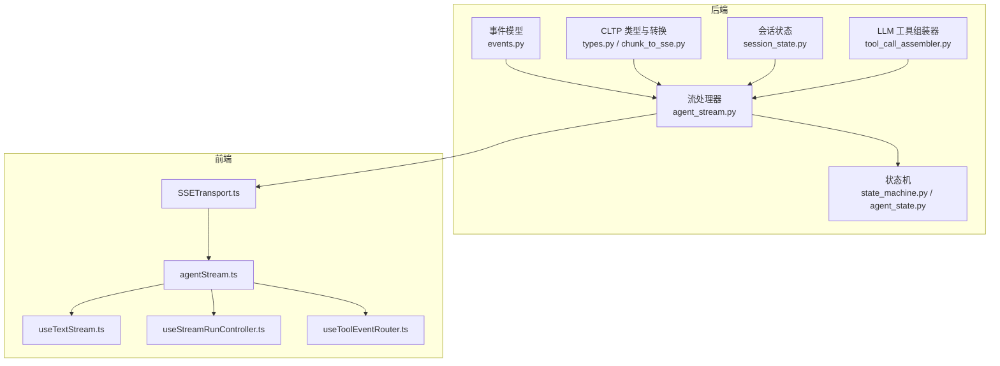
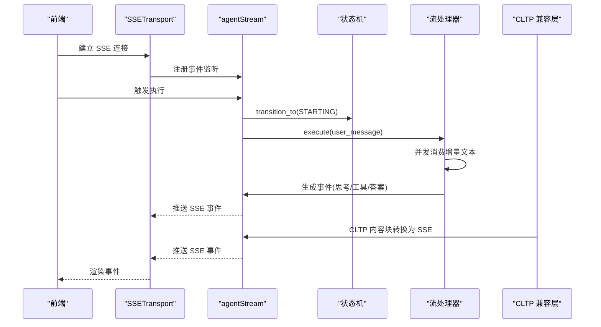
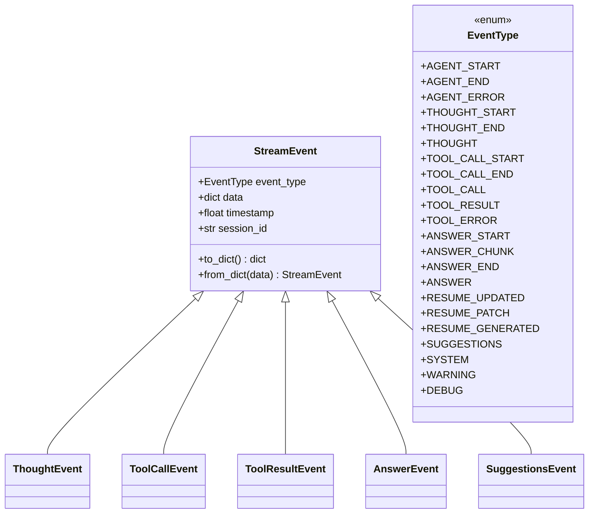
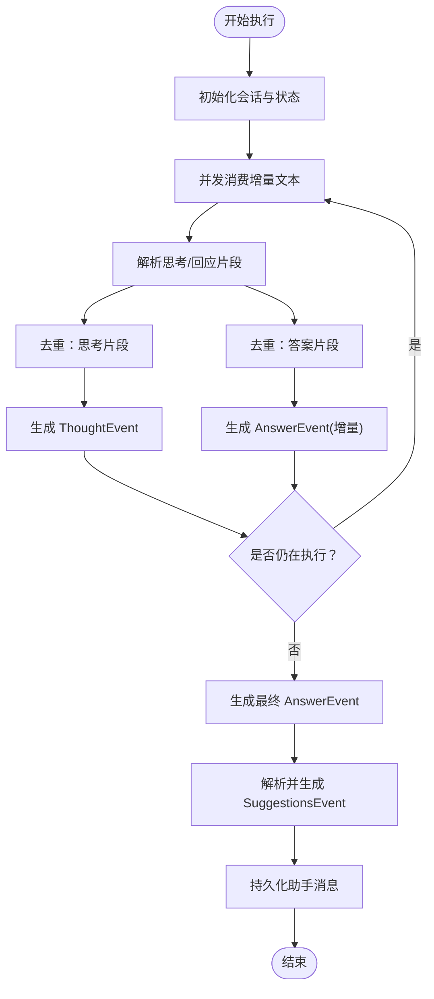
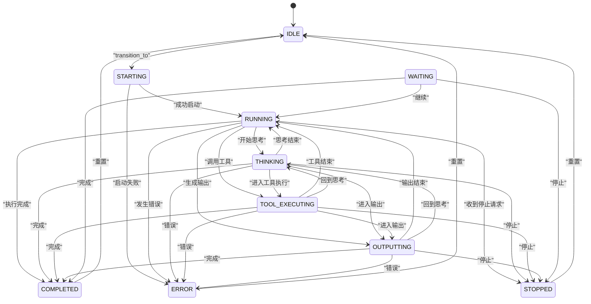
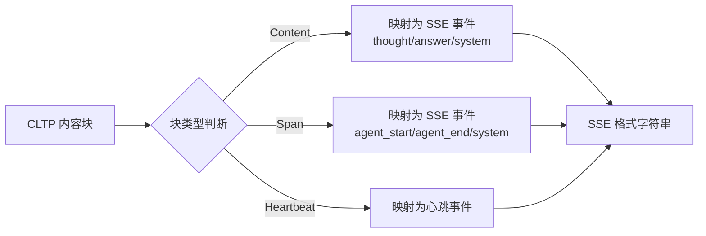
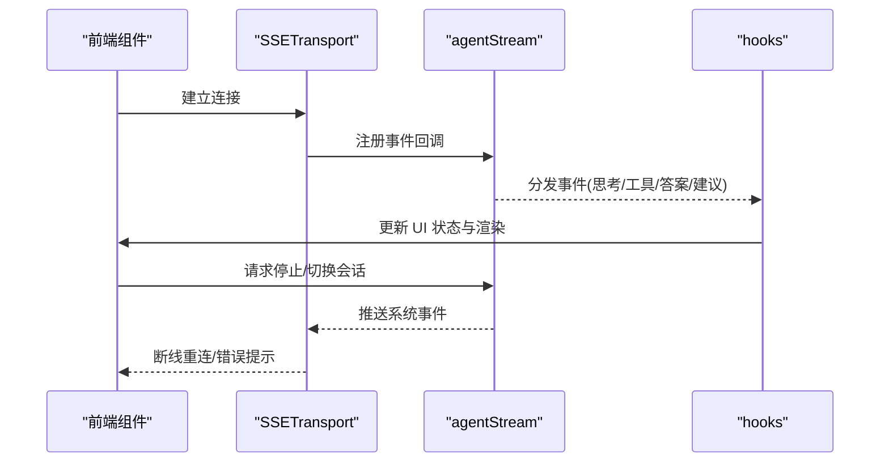
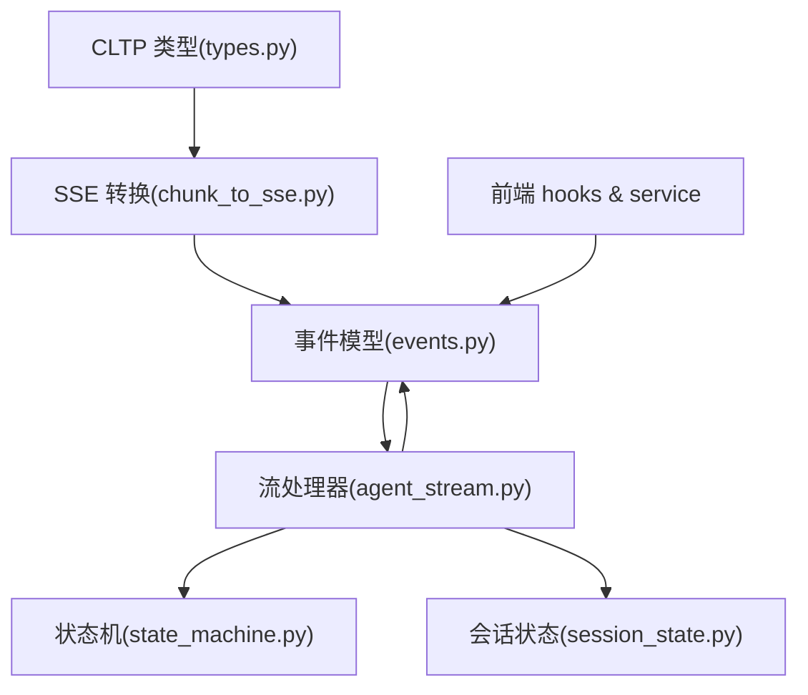

# 流式处理与事件

<cite>
**本文引用的文件**   
- [backend/agent/web/streaming/events.py](file://backend/agent/web/streaming/events.py)
- [backend/agent/web/streaming/agent_stream.py](file://backend/agent/web/streaming/agent_stream.py)
- [backend/agent/web/streaming/state_machine.py](file://backend/agent/web/streaming/state_machine.py)
- [backend/agent/web/streaming/agent_state.py](file://backend/agent/web/streaming/agent_state.py)
- [backend/agent/cltp/chunk_to_sse.py](file://backend/agent/cltp/chunk_to_sse.py)
- [backend/agent/cltp/types.py](file://backend/agent/cltp/types.py)
- [backend/agent/cltp/session_state.py](file://backend/agent/cltp/session_state.py)
- [backend/agent/llm_streaming/tool_call_assembler.py](file://backend/agent/llm_streaming/tool_call_assembler.py)
- [frontend/src/services/agentStream.ts](file://frontend/src/services/agentStream.ts)
- [frontend/src/transports/SSETransport.ts](file://frontend/src/transports/SSETransport.ts)
- [frontend/src/hooks/useTextStream.ts](file://frontend/src/hooks/useTextStream.ts)
- [frontend/src/hooks/agent-chat/useStreamRunController.ts](file://frontend/src/hooks/agent-chat/useStreamRunController.ts)
- [frontend/src/hooks/agent-chat/useToolEventRouter.ts](file://frontend/src/hooks/agent-chat/useToolEventRouter.ts)
</cite>

## 目录
1. [引言](#引言)
2. [项目结构](#项目结构)
3. [核心组件](#核心组件)
4. [架构总览](#架构总览)
5. [详细组件分析](#详细组件分析)
6. [依赖关系分析](#依赖关系分析)
7. [性能考虑](#性能考虑)
8. [故障排查指南](#故障排查指南)
9. [结论](#结论)
10. [附录](#附录)

## 引言
本文件系统性阐述 ResumeAgent 的流式处理与事件系统，覆盖以下要点：
- LLM 流式输出处理：如何从智能体回调中接收增量文本，解析“思考/回应”结构，并生成标准化事件。
- CLTP 协议实现：将 CLTP 内容块转换为 SSE 事件，确保与现有事件系统的兼容。
- 事件驱动架构：通过事件类型、状态机与去重策略，构建可扩展的前端渲染与交互。
- 消息流处理：包括工具调用、工具结果、答案片段与最终答案的事件序列。
- 事件分发机制：事件到前端的路由与展示策略。
- 状态同步策略：会话状态、运行状态与持久化。
- 流式传输优化：并发消费与去重、增量拼接与指纹校验。
- 错误恢复与性能监控：状态机错误处理、停止请求与超时控制。
- 前端 SSE 通信：SSETransport、useTextStream 与事件路由钩子。

## 项目结构
后端采用模块化设计，围绕“事件模型 → 流处理器 → 状态机 → CLTP 兼容层”的链路组织；前端通过 SSETransport 接收事件并使用 hooks 进行事件路由与渲染。

**图表来源**
- [backend/agent/web/streaming/events.py:1-415](file://backend/agent/web/streaming/events.py#L1-L415)
- [backend/agent/web/streaming/agent_stream.py:1-800](file://backend/agent/web/streaming/agent_stream.py#L1-L800)
- [backend/agent/web/streaming/state_machine.py:1-247](file://backend/agent/web/streaming/state_machine.py#L1-L247)
- [backend/agent/web/streaming/agent_state.py:1-169](file://backend/agent/web/streaming/agent_state.py#L1-L169)
- [backend/agent/cltp/types.py:1-51](file://backend/agent/cltp/types.py#L1-L51)
- [backend/agent/cltp/chunk_to_sse.py:1-114](file://backend/agent/cltp/chunk_to_sse.py#L1-L114)
- [backend/agent/cltp/session_state.py:1-81](file://backend/agent/cltp/session_state.py#L1-L81)
- [backend/agent/llm_streaming/tool_call_assembler.py](file://backend/agent/llm_streaming/tool_call_assembler.py)
- [frontend/src/transports/SSETransport.ts](file://frontend/src/transports/SSETransport.ts)
- [frontend/src/services/agentStream.ts](file://frontend/src/services/agentStream.ts)
- [frontend/src/hooks/useTextStream.ts](file://frontend/src/hooks/useTextStream.ts)
- [frontend/src/hooks/agent-chat/useStreamRunController.ts](file://frontend/src/hooks/agent-chat/useStreamRunController.ts)
- [frontend/src/hooks/agent-chat/useToolEventRouter.ts](file://frontend/src/hooks/agent-chat/useToolEventRouter.ts)

**章节来源**
- [backend/agent/web/streaming/events.py:1-415](file://backend/agent/web/streaming/events.py#L1-L415)
- [backend/agent/web/streaming/agent_stream.py:1-800](file://backend/agent/web/streaming/agent_stream.py#L1-L800)
- [backend/agent/web/streaming/state_machine.py:1-247](file://backend/agent/web/streaming/state_machine.py#L1-L247)
- [backend/agent/web/streaming/agent_state.py:1-169](file://backend/agent/web/streaming/agent_state.py#L1-L169)
- [backend/agent/cltp/types.py:1-51](file://backend/agent/cltp/types.py#L1-L51)
- [backend/agent/cltp/chunk_to_sse.py:1-114](file://backend/agent/cltp/chunk_to_sse.py#L1-L114)
- [backend/agent/cltp/session_state.py:1-81](file://backend/agent/cltp/session_state.py#L1-L81)
- [backend/agent/llm_streaming/tool_call_assembler.py](file://backend/agent/llm_streaming/tool_call_assembler.py)
- [frontend/src/transports/SSETransport.ts](file://frontend/src/transports/SSETransport.ts)
- [frontend/src/services/agentStream.ts](file://frontend/src/services/agentStream.ts)
- [frontend/src/hooks/useTextStream.ts](file://frontend/src/hooks/useTextStream.ts)
- [frontend/src/hooks/agent-chat/useStreamRunController.ts](file://frontend/src/hooks/agent-chat/useStreamRunController.ts)
- [frontend/src/hooks/agent-chat/useToolEventRouter.ts](file://frontend/src/hooks/agent-chat/useToolEventRouter.ts)

## 核心组件
- 事件模型：定义事件类型与数据结构，统一前后端交互契约。
- 流处理器：负责从智能体回调中消费增量文本，解析“思考/回应”，生成标准化事件，并进行去重与持久化。
- 状态机：管理智能体生命周期状态与转换，支持错误处理与停止请求。
- CLTP 兼容层：将 CLTP 内容块转换为 SSE 事件，保证与既有事件系统的兼容。
- 会话状态：维护会话级元数据（span 栈、消息序号等），支持内存与文件持久化。
- LLM 工具组装器：聚合工具调用与结果，辅助前端事件路由。

**章节来源**
- [backend/agent/web/streaming/events.py:15-415](file://backend/agent/web/streaming/events.py#L15-L415)
- [backend/agent/web/streaming/agent_stream.py:224-800](file://backend/agent/web/streaming/agent_stream.py#L224-L800)
- [backend/agent/web/streaming/state_machine.py:26-247](file://backend/agent/web/streaming/state_machine.py#L26-L247)
- [backend/agent/cltp/chunk_to_sse.py:12-114](file://backend/agent/cltp/chunk_to_sse.py#L12-L114)
- [backend/agent/cltp/session_state.py:14-81](file://backend/agent/cltp/session_state.py#L14-L81)
- [backend/agent/llm_streaming/tool_call_assembler.py](file://backend/agent/llm_streaming/tool_call_assembler.py)

## 架构总览
后端以事件为中心，通过状态机驱动智能体执行，流处理器将执行过程与结果转化为事件；CLTP 兼容层负责将 CLTP 内容块映射为 SSE 事件，确保与前端现有实现兼容。前端通过 SSETransport 接收事件，使用 hooks 进行事件路由与渲染。

**图表来源**
- [backend/agent/web/streaming/agent_stream.py:476-800](file://backend/agent/web/streaming/agent_stream.py#L476-L800)
- [backend/agent/web/streaming/state_machine.py:102-151](file://backend/agent/web/streaming/state_machine.py#L102-L151)
- [backend/agent/cltp/chunk_to_sse.py:12-114](file://backend/agent/cltp/chunk_to_sse.py#L12-L114)
- [frontend/src/transports/SSETransport.ts](file://frontend/src/transports/SSETransport.ts)
- [frontend/src/services/agentStream.ts](file://frontend/src/services/agentStream.ts)

## 详细组件分析

### 事件模型与类型
- 事件类型涵盖智能体生命周期、思考、工具调用/结果、最终答案、简历域事件、系统与警告事件等。
- 事件基类包含通用字段（类型、数据、时间戳、会话标识），并提供序列化/反序列化方法。
- 特定事件类（如 ThoughtEvent、ToolCallEvent、ToolResultEvent、AnswerEvent、SuggestionsEvent 等）提供前端兼容的序列化格式。

**图表来源**
- [backend/agent/web/streaming/events.py:15-415](file://backend/agent/web/streaming/events.py#L15-L415)

**章节来源**
- [backend/agent/web/streaming/events.py:15-415](file://backend/agent/web/streaming/events.py#L15-L415)

### 流处理器：消息流与去重
- 并发消费：通过回调与异步队列并发接收增量文本，避免阻塞智能体执行。
- “思考/回应”解析：从增量文本中识别“思考”与“回应”片段，分别生成 ThoughtEvent 与 AnswerEvent。
- 增量拼接：根据是否为累积文本或增量文本，选择替换或追加，保证顺序正确。
- 去重策略：对思考、工具调用、工具结果与答案片段使用指纹集合去重，避免重复事件。
- 建议按钮：从内容中解析 %%SUGGESTIONS%% 标记，生成 SuggestionsEvent。
- 最终答案：在完成阶段生成完整 AnswerEvent，并持久化助手消息。

**图表来源**
- [backend/agent/web/streaming/agent_stream.py:563-791](file://backend/agent/web/streaming/agent_stream.py#L563-L791)

**章节来源**
- [backend/agent/web/streaming/agent_stream.py:224-800](file://backend/agent/web/streaming/agent_stream.py#L224-L800)

### 状态机：生命周期与错误处理
- 状态定义：IDLE、STARTING、RUNNING、THINKING、TOOL_EXECUTING、OUTPUTTING、COMPLETED、ERROR、STOPPED、WAITING。
- 转换规则：严格的有向图，确保状态流转合法。
- 停止请求：支持手动停止与会话切换停止，触发 STOPPED 状态与系统事件。
- 错误处理：捕获异常并转为 ERROR 状态，通知错误回调。

**图表来源**
- [backend/agent/web/streaming/agent_state.py:12-115](file://backend/agent/web/streaming/agent_state.py#L12-L115)
- [backend/agent/web/streaming/state_machine.py:102-151](file://backend/agent/web/streaming/state_machine.py#L102-L151)

**章节来源**
- [backend/agent/web/streaming/agent_state.py:12-169](file://backend/agent/web/streaming/agent_state.py#L12-L169)
- [backend/agent/web/streaming/state_machine.py:26-247](file://backend/agent/web/streaming/state_machine.py#L26-L247)

### CLTP 协议与 SSE 转换
- CLTP 类型：Span、Content、Heartbeat 三类块，携带元数据与负载。
- 转换策略：Span 块映射为 agent_start/agent_end/system；Content 块映射为 thought/answer/system；Heartbeat 块映射为心跳事件。
- 文本保持原样：Content 块中的 text 字段不做任何修改，确保与原始输出一致。

**图表来源**
- [backend/agent/cltp/types.py:16-51](file://backend/agent/cltp/types.py#L16-L51)
- [backend/agent/cltp/chunk_to_sse.py:12-114](file://backend/agent/cltp/chunk_to_sse.py#L12-L114)

**章节来源**
- [backend/agent/cltp/types.py:1-51](file://backend/agent/cltp/types.py#L1-L51)
- [backend/agent/cltp/chunk_to_sse.py:1-114](file://backend/agent/cltp/chunk_to_sse.py#L1-L114)

### 会话状态与持久化
- 会话状态：包含 conversation_id、span 栈、消息序号、当前运行 span、创建时间等。
- 存储策略：内存中维护活跃会话；可选启用文件持久化，支持加载、保存与删除。
- 生命周期：获取或创建会话，清理会话时同时清理持久化数据。

**章节来源**
- [backend/agent/cltp/session_state.py:14-81](file://backend/agent/cltp/session_state.py#L14-L81)

### LLM 工具组装器
- 聚合工具调用与结果，便于前端事件路由与渲染。
- 支持序列化工具调用参数，辅助去重与一致性校验。

**章节来源**
- [backend/agent/llm_streaming/tool_call_assembler.py](file://backend/agent/llm_streaming/tool_call_assembler.py)

### 前端 SSE 通信与事件路由
- SSETransport：封装浏览器原生 EventSource，负责连接、断线重连与事件分发。
- agentStream：后端事件到前端的桥接服务，订阅 SSE 并触发回调。
- useTextStream：将事件流转换为可渲染的文本片段，支持增量更新。
- useStreamRunController：控制运行生命周期、停止与会话切换。
- useToolEventRouter：根据事件类型路由到相应 UI 组件（工具面板、提示按钮等）。

**图表来源**
- [frontend/src/transports/SSETransport.ts](file://frontend/src/transports/SSETransport.ts)
- [frontend/src/services/agentStream.ts](file://frontend/src/services/agentStream.ts)
- [frontend/src/hooks/useTextStream.ts](file://frontend/src/hooks/useTextStream.ts)
- [frontend/src/hooks/agent-chat/useStreamRunController.ts](file://frontend/src/hooks/agent-chat/useStreamRunController.ts)
- [frontend/src/hooks/agent-chat/useToolEventRouter.ts](file://frontend/src/hooks/agent-chat/useToolEventRouter.ts)

**章节来源**
- [frontend/src/transports/SSETransport.ts](file://frontend/src/transports/SSETransport.ts)
- [frontend/src/services/agentStream.ts](file://frontend/src/services/agentStream.ts)
- [frontend/src/hooks/useTextStream.ts](file://frontend/src/hooks/useTextStream.ts)
- [frontend/src/hooks/agent-chat/useStreamRunController.ts](file://frontend/src/hooks/agent-chat/useStreamRunController.ts)
- [frontend/src/hooks/agent-chat/useToolEventRouter.ts](file://frontend/src/hooks/agent-chat/useToolEventRouter.ts)

## 依赖关系分析
- 事件模型被流处理器与 CLTP 兼容层共同依赖，形成统一的数据契约。
- 流处理器依赖状态机进行生命周期管理，并与会话状态协作。
- 前端通过 SSETransport 与 agentStream 间接依赖后端事件模型与状态机。

**图表来源**
- [backend/agent/web/streaming/events.py:15-415](file://backend/agent/web/streaming/events.py#L15-L415)
- [backend/agent/web/streaming/agent_stream.py:178-195](file://backend/agent/web/streaming/agent_stream.py#L178-L195)
- [backend/agent/cltp/types.py:16-51](file://backend/agent/cltp/types.py#L16-L51)
- [backend/agent/cltp/chunk_to_sse.py:12-114](file://backend/agent/cltp/chunk_to_sse.py#L12-L114)
- [backend/agent/web/streaming/state_machine.py:26-151](file://backend/agent/web/streaming/state_machine.py#L26-L151)
- [backend/agent/cltp/session_state.py:24-81](file://backend/agent/cltp/session_state.py#L24-L81)
- [frontend/src/services/agentStream.ts](file://frontend/src/services/agentStream.ts)

**章节来源**
- [backend/agent/web/streaming/agent_stream.py:178-195](file://backend/agent/web/streaming/agent_stream.py#L178-L195)
- [backend/agent/cltp/chunk_to_sse.py:12-114](file://backend/agent/cltp/chunk_to_sse.py#L12-L114)
- [backend/agent/web/streaming/state_machine.py:26-151](file://backend/agent/web/streaming/state_machine.py#L26-L151)
- [backend/agent/cltp/session_state.py:24-81](file://backend/agent/cltp/session_state.py#L24-L81)
- [frontend/src/services/agentStream.ts](file://frontend/src/services/agentStream.ts)

## 性能考虑
- 并发消费：通过异步队列与回调并发处理增量文本，减少等待时间。
- 增量拼接：区分累积与增量文本，避免不必要的字符串拼接。
- 去重策略：使用指纹集合快速检测重复事件，降低前端渲染压力。
- 超时与取消：在流消费中设置短超时与取消事件，及时响应停止请求。
- CLTP 文本保持原样：避免额外编码/解码开销，提升传输效率。

[本节为通用性能指导，不直接分析具体文件]

## 故障排查指南
- 状态机错误：当状态转换非法时抛出异常，需检查状态流转逻辑与外部触发条件。
- 停止请求：若前端未收到停止反馈，检查状态机的 stop_requested 标志与回调通知。
- 事件重复：若前端出现重复内容，检查去重指纹生成与集合缓存。
- CLTP 映射异常：确认块类型与元数据字段是否存在，必要时降级为 system 事件。
- SSE 连接问题：前端检查 EventSource 初始化与断线重连策略。

**章节来源**
- [backend/agent/web/streaming/state_machine.py:14-247](file://backend/agent/web/streaming/state_machine.py#L14-L247)
- [backend/agent/web/streaming/agent_stream.py:257-305](file://backend/agent/web/streaming/agent_stream.py#L257-L305)
- [backend/agent/cltp/chunk_to_sse.py:12-114](file://backend/agent/cltp/chunk_to_sse.py#L12-L114)
- [frontend/src/transports/SSETransport.ts](file://frontend/src/transports/SSETransport.ts)

## 结论
本系统通过事件模型、状态机与流处理器实现了高可靠、可扩展的流式处理与事件驱动架构；CLTP 兼容层确保了与新协议的平滑过渡；前端通过 SSETransport 与 hooks 实现了流畅的实时交互体验。整体设计兼顾性能与可维护性，适合在复杂对话与工具调用场景中稳定运行。

[本节为总结性内容，不直接分析具体文件]

## 附录
- 集成指南（后端）：在智能体中注册流内容回调，使用 AgentStream.execute(user_message) 获取事件流；通过状态机 transition_to 管理生命周期；必要时启用 CLTP 转换。
- 集成指南（前端）：使用 SSETransport 建立连接，注册 agentStream 事件回调；在 hooks 中根据事件类型更新 UI；处理停止与会话切换。

[本节为通用集成指导，不直接分析具体文件]