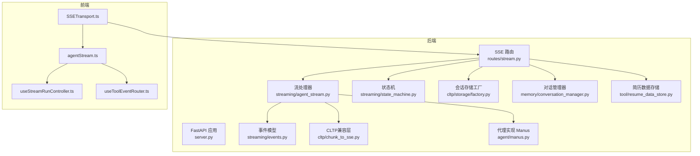
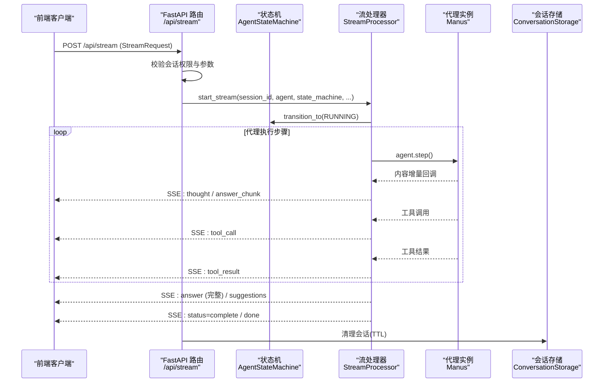
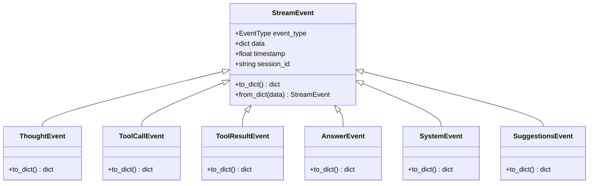
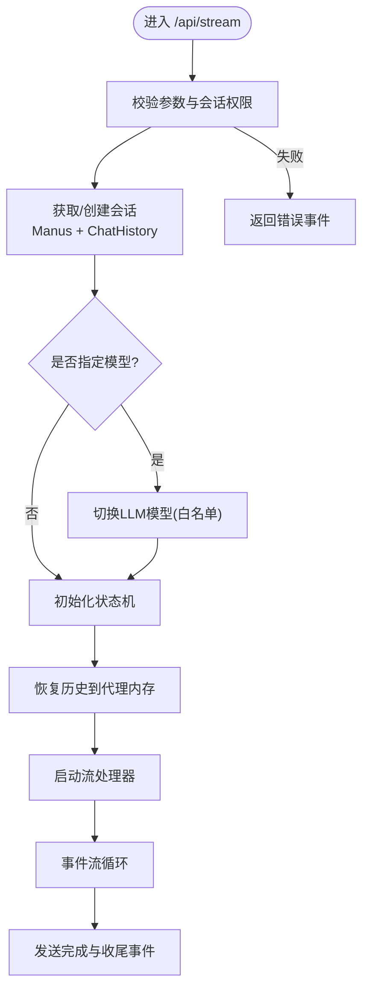
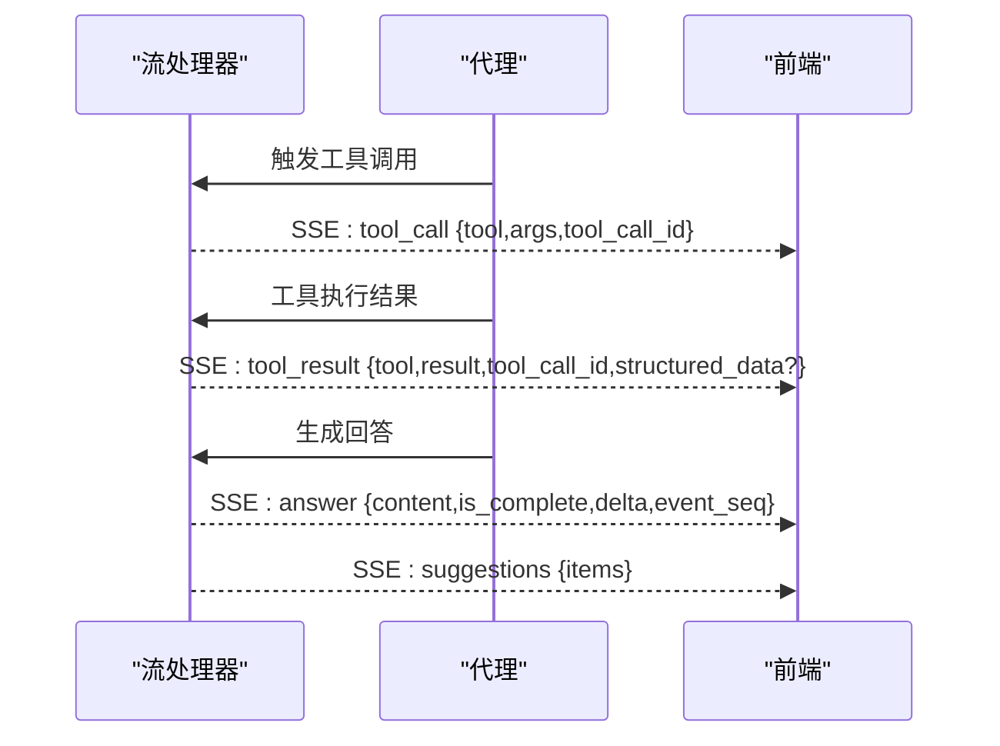
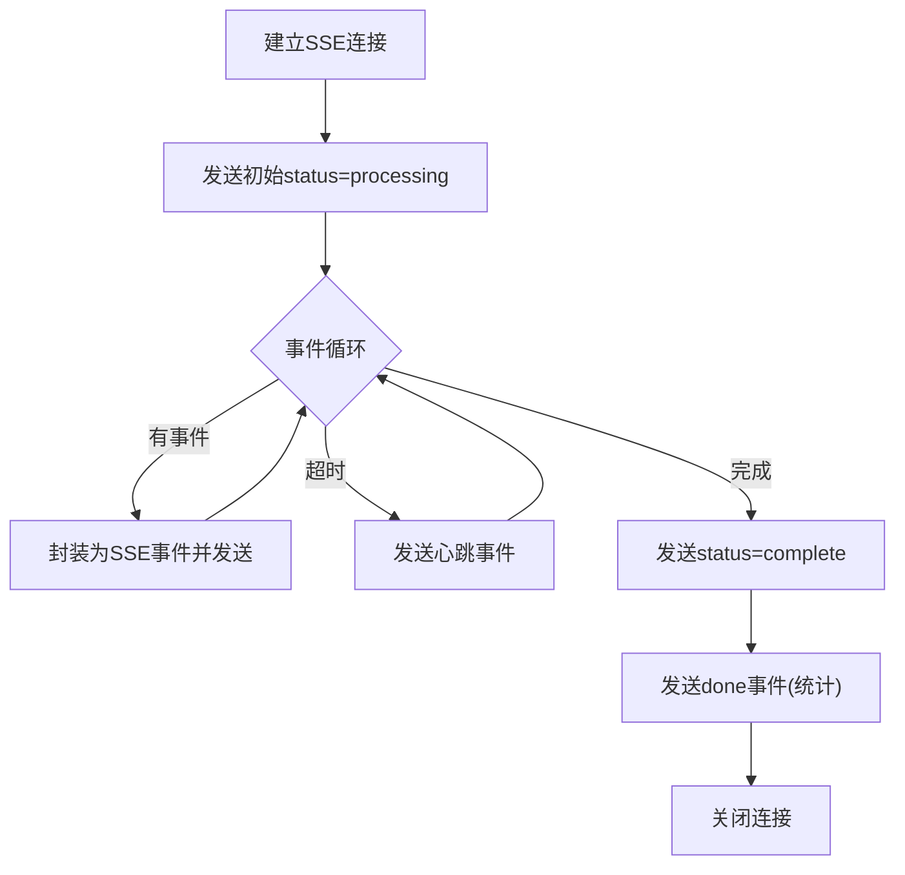
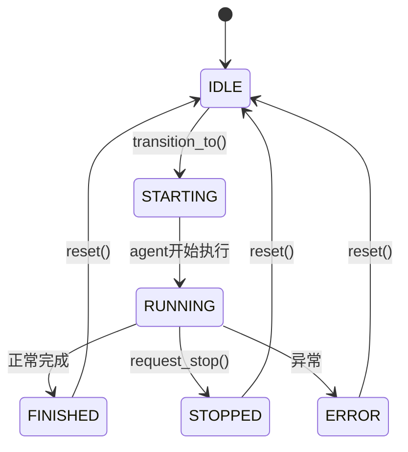
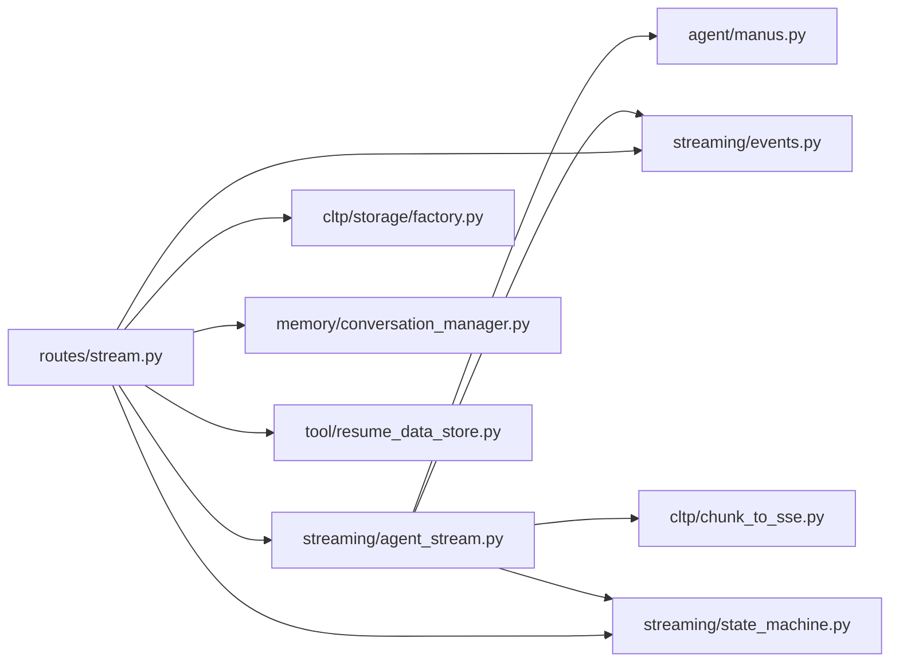

# AI代理API

<cite>
**本文引用的文件**
- [backend/agent/web/server.py](file://backend/agent/web/server.py)
- [backend/agent/web/routes/stream.py](file://backend/agent/web/routes/stream.py)
- [backend/agent/web/streaming/agent_stream.py](file://backend/agent/web/streaming/agent_stream.py)
- [backend/agent/web/streaming/events.py](file://backend/agent/web/streaming/events.py)
- [backend/agent/web/streaming/state_machine.py](file://backend/agent/web/streaming/state_machine.py)
- [backend/agent/web/schemas/stream.py](file://backend/agent/web/schemas/stream.py)
- [backend/agent/web/streaming/agent_state.py](file://backend/agent/web/streaming/agent_state.py)
- [backend/agent/cltp/chunk_to_sse.py](file://backend/agent/cltp/chunk_to_sse.py)
- [backend/agent/cltp/types.py](file://backend/agent/cltp/types.py)
- [backend/agent/cltp/storage/factory.py](file://backend/agent/cltp/storage/factory.py)
- [backend/agent/memory/conversation_manager.py](file://backend/agent/memory/conversation_manager.py)
- [backend/agent/tool/resume_data_store.py](file://backend/agent/tool/resume_data_store.py)
- [backend/agent/agent/manus.py](file://backend/agent/agent/manus.py)
- [backend/agent/schema.py](file://backend/agent/schema.py)
- [backend/middleware/auth.py](file://backend/middleware/auth.py)
- [backend/models.py](file://backend/models.py)
- [frontend/src/services/agentStream.ts](file://frontend/src/services/agentStream.ts)
- [frontend/src/transports/SSETransport.ts](file://frontend/src/transports/SSETransport.ts)
- [frontend/src/hooks/agent-chat/useStreamRunController.ts](file://frontend/src/hooks/agent-chat/useStreamRunController.ts)
- [frontend/src/hooks/agent-chat/useToolEventRouter.ts](file://frontend/src/hooks/agent-chat/useToolEventRouter.ts)
- [frontend/src/lib/fetchWithTimeout.ts](file://frontend/src/lib/fetchWithTimeout.ts)
</cite>

## 目录
1. [简介](#简介)
2. [项目结构](#项目结构)
3. [核心组件](#核心组件)
4. [架构总览](#架构总览)
5. [详细组件分析](#详细组件分析)
6. [依赖关系分析](#依赖关系分析)
7. [性能考虑](#性能考虑)
8. [故障排查指南](#故障排查指南)
9. [结论](#结论)
10. [附录](#附录)

## 简介
本文件为AI代理API的完整技术文档，聚焦于以下目标：
- 代理调用接口：POST /api/stream 的SSE实时流式交互
- 工具执行接口：代理内部工具调用与结果回传
- 流式响应接口：SSE事件格式、心跳保活、连接管理
- 代理配置：模型切换、会话生命周期、并发控制
- 参数传递：请求体字段、会话标识、简历数据注入
- 错误处理：权限、配额、网络异常、超时与重连
- 状态管理：状态机驱动的生命周期与停止信号
- 性能监控：心跳诊断、内存清理、会话TTL

## 项目结构
后端采用FastAPI提供HTTP+SSE服务，前端通过SSETransport订阅事件流。核心模块包括：
- Web服务入口与路由：server.py、routes/stream.py
- 流式事件模型：streaming/events.py
- 事件生成器与会话管理：streaming/agent_stream.py、streaming/state_machine.py
- CLTP兼容层：cltp/chunk_to_sse.py、cltp/types.py
- 存储与会话：cltp/storage/factory.py、memory/conversation_manager.py
- 工具与简历数据：tool/resume_data_store.py
- 代理实现：agent/manus.py
- 前端SSE客户端：frontend/src/transports/SSETransport.ts、frontend/src/services/agentStream.ts

**图表来源**
- [backend/agent/web/server.py:1-300](file://backend/agent/web/server.py#L1-L300)
- [backend/agent/web/routes/stream.py:1-611](file://backend/agent/web/routes/stream.py#L1-L611)
- [backend/agent/web/streaming/agent_stream.py:1-800](file://backend/agent/web/streaming/agent_stream.py#L1-L800)
- [backend/agent/web/streaming/events.py:1-415](file://backend/agent/web/streaming/events.py#L1-L415)
- [backend/agent/web/streaming/state_machine.py:1-247](file://backend/agent/web/streaming/state_machine.py#L1-L247)
- [backend/agent/cltp/chunk_to_sse.py](file://backend/agent/cltp/chunk_to_sse.py)
- [backend/agent/cltp/storage/factory.py](file://backend/agent/cltp/storage/factory.py)
- [backend/agent/memory/conversation_manager.py](file://backend/agent/memory/conversation_manager.py)
- [backend/agent/tool/resume_data_store.py](file://backend/agent/tool/resume_data_store.py)
- [backend/agent/agent/manus.py](file://backend/agent/agent/manus.py)

**章节来源**
- [backend/agent/web/server.py:1-300](file://backend/agent/web/server.py#L1-L300)
- [backend/agent/web/routes/stream.py:1-611](file://backend/agent/web/routes/stream.py#L1-L611)

## 核心组件
- SSE服务端点：POST /api/stream 提供实时事件流，支持心跳保活、会话清理、并发保护
- 事件模型：统一的StreamEvent体系，涵盖思考、工具调用、结果、回答、系统消息等
- 状态机：AgentStateMachine管理生命周期与停止信号，保证线程安全与可观测性
- 会话管理：基于会话ID的内存缓存与TTL清理，支持模型动态切换
- CLTP兼容：将内部事件转换为SSE对外协议，兼容前端适配

**章节来源**
- [backend/agent/web/routes/stream.py:472-551](file://backend/agent/web/routes/stream.py#L472-L551)
- [backend/agent/web/streaming/events.py:15-415](file://backend/agent/web/streaming/events.py#L15-L415)
- [backend/agent/web/streaming/state_machine.py:26-247](file://backend/agent/web/streaming/state_machine.py#L26-L247)

## 架构总览
SSE流式架构以FastAPI路由为核心，结合流处理器与状态机，将代理执行过程分解为一系列可观察的事件。前端通过SSETransport持续接收事件，按类型进行渲染与交互。

**图表来源**
- [backend/agent/web/routes/stream.py:231-470](file://backend/agent/web/routes/stream.py#L231-L470)
- [backend/agent/web/streaming/agent_stream.py:476-800](file://backend/agent/web/streaming/agent_stream.py#L476-L800)
- [backend/agent/web/streaming/state_machine.py:102-151](file://backend/agent/web/streaming/state_machine.py#L102-L151)
- [backend/agent/agent/manus.py](file://backend/agent/agent/manus.py)

## 详细组件分析

### SSE流式传输机制与事件格式
- 事件类型：包含代理生命周期、思考、工具调用/结果、回答、系统消息、建议按钮等
- 事件格式：统一的to_dict输出，SSE端点将其转为text/event-stream
- 心跳保活：固定间隔的心跳事件，前端超时阈值预留安全余量
- 会话清理：按会话TTL清理内存中的代理实例，释放资源

**图表来源**
- [backend/agent/web/streaming/events.py:55-415](file://backend/agent/web/streaming/events.py#L55-L415)

**章节来源**
- [backend/agent/web/streaming/events.py:15-415](file://backend/agent/web/streaming/events.py#L15-L415)
- [backend/agent/web/routes/stream.py:55-60](file://backend/agent/web/routes/stream.py#L55-L60)

### 代理调用接口（POST /api/stream）
- 请求体：StreamRequest包含prompt/message、可选conversation_id、resume_path、resume_data、cursor、resume、model等
- 会话管理：根据conversation_id获取或创建代理实例，支持模型白名单切换
- 并发保护：同一会话若已有活动流，先停止旧流再启动新流
- 历史对齐：将持久化的历史消息恢复到代理内存，避免上下文丢失
- 错误处理：权限拒绝、配额不足、网络异常等映射为SSE error事件

**图表来源**
- [backend/agent/web/routes/stream.py:472-551](file://backend/agent/web/routes/stream.py#L472-L551)
- [backend/agent/web/routes/stream.py:74-190](file://backend/agent/web/routes/stream.py#L74-L190)

**章节来源**
- [backend/agent/web/routes/stream.py:472-551](file://backend/agent/web/routes/stream.py#L472-L551)
- [backend/agent/web/schemas/stream.py](file://backend/agent/web/schemas/stream.py)

### 工具执行接口与事件
- 工具调用：代理在推理过程中发出tool_call事件，携带工具名与参数
- 工具结果：工具执行完成后发出tool_result事件，支持结构化数据
- 上下文关联：事件包含tool_call_id，便于前端关联调用与结果
- 建议按钮：在回答后发送suggestions事件，承载一键操作项

**图表来源**
- [backend/agent/web/streaming/events.py:114-204](file://backend/agent/web/streaming/events.py#L114-L204)
- [backend/agent/web/streaming/events.py:392-415](file://backend/agent/web/streaming/events.py#L392-L415)

**章节来源**
- [backend/agent/web/streaming/events.py:114-204](file://backend/agent/web/streaming/events.py#L114-L204)
- [backend/agent/web/streaming/events.py:392-415](file://backend/agent/web/streaming/events.py#L392-L415)

### 流式响应接口与SSE事件
- SSE事件：status(processing/complete/cancelled)、done(统计信息)、heartbeat
- 心跳机制：固定周期发送心跳，前端超时阈值预留安全余量
- 连接管理：保持长连接，关闭Nginx缓冲，支持跨域与keep-alive
- 停止接口：/api/stream/stop/{conversation_id}主动中断当前流

**图表来源**
- [backend/agent/web/routes/stream.py:231-470](file://backend/agent/web/routes/stream.py#L231-L470)

**章节来源**
- [backend/agent/web/routes/stream.py:231-470](file://backend/agent/web/routes/stream.py#L231-L470)

### 代理配置、工具注册与参数传递
- 模型白名单：允许在请求级别切换模型（如deepseek-v4-flash等）
- 简历数据注入：通过resume_data注入到ResumeDataStore，并更新会话状态
- 工具注册：工具集合由代理内部维护，事件中携带工具名与参数
- 会话隔离：每个conversation_id绑定独立的代理实例与历史

**章节来源**
- [backend/agent/web/routes/stream.py:49-60](file://backend/agent/web/routes/stream.py#L49-L60)
- [backend/agent/web/routes/stream.py:158-168](file://backend/agent/web/routes/stream.py#L158-L168)
- [backend/agent/tool/resume_data_store.py](file://backend/agent/tool/resume_data_store.py)

### 代理状态管理与并发控制
- 状态机：IDLE → STARTING → RUNNING → FINISHED/ERROR/STOPPED
- 停止信号：request_stop(reason)支持手动与会话切换两种原因
- 并发保护：同一会话仅允许一个活动流，新请求会先停止旧流
- 内存清理：按会话TTL清理，避免内存泄漏

**图表来源**
- [backend/agent/web/streaming/state_machine.py:102-151](file://backend/agent/web/streaming/state_machine.py#L102-L151)
- [backend/agent/web/streaming/state_machine.py:162-171](file://backend/agent/web/streaming/state_machine.py#L162-L171)

**章节来源**
- [backend/agent/web/streaming/state_machine.py:26-247](file://backend/agent/web/streaming/state_machine.py#L26-L247)
- [backend/agent/web/routes/stream.py:503-510](file://backend/agent/web/routes/stream.py#L503-L510)

### 错误处理、超时管理与重连机制
- 权限与配额：403/余额不足映射为error事件，前端提示充值
- 网络异常：代理连接失败、代理被取消等场景的分类处理
- 超时与心跳：心跳事件用于检测连接活性，前端应在此阈值内重连
- 重连策略：建议指数退避与最大重试次数，避免雪崩

**章节来源**
- [backend/agent/web/routes/stream.py:434-466](file://backend/agent/web/routes/stream.py#L434-L466)
- [backend/agent/web/routes/stream.py:55-60](file://backend/agent/web/routes/stream.py#L55-L60)

### 前端集成要点
- SSETransport：封装浏览器原生EventSource，处理连接、重连与错误
- agentStream：封装SSE事件解析与路由，对接UI组件
- useStreamRunController：控制流的启动、停止与状态展示
- useToolEventRouter：路由工具调用/结果事件，驱动工具面板

**章节来源**
- [frontend/src/transports/SSETransport.ts](file://frontend/src/transports/SSETransport.ts)
- [frontend/src/services/agentStream.ts](file://frontend/src/services/agentStream.ts)
- [frontend/src/hooks/agent-chat/useStreamRunController.ts](file://frontend/src/hooks/agent-chat/useStreamRunController.ts)
- [frontend/src/hooks/agent-chat/useToolEventRouter.ts](file://frontend/src/hooks/agent-chat/useToolEventRouter.ts)

## 依赖关系分析

**图表来源**
- [backend/agent/web/routes/stream.py:32-44](file://backend/agent/web/routes/stream.py#L32-L44)
- [backend/agent/web/streaming/agent_stream.py:178-195](file://backend/agent/web/streaming/agent_stream.py#L178-L195)

**章节来源**
- [backend/agent/web/routes/stream.py:32-44](file://backend/agent/web/routes/stream.py#L32-L44)
- [backend/agent/web/streaming/agent_stream.py:178-195](file://backend/agent/web/streaming/agent_stream.py#L178-L195)

## 性能考虑
- 会话TTL：通过环境变量控制，避免长期占用内存
- 心跳保活：固定周期心跳，降低空闲连接资源占用
- 去重与增量：前端按delta渲染，减少重复内容传输
- 并发控制：同一会话串行执行，避免竞争与状态混乱
- 存储与历史：会话结束后清理代理内存与ResumeDataStore

**章节来源**
- [backend/agent/web/routes/stream.py:52-59](file://backend/agent/web/routes/stream.py#L52-L59)
- [backend/agent/web/routes/stream.py:205-229](file://backend/agent/web/routes/stream.py#L205-L229)

## 故障排查指南
- 403/权限不足：确认用户角色与会话所有权，检查会话访问断言
- 余额不足/配额限制：查看error事件中的提示，引导充值
- 网络异常：检查代理连接与代理配置，关注心跳是否持续
- 连接中断：前端应基于心跳阈值进行重连，避免频繁重建
- 会话冲突：同一会话并发请求会被自动停止旧流，确认前端逻辑

**章节来源**
- [backend/agent/web/routes/stream.py:62-72](file://backend/agent/web/routes/stream.py#L62-L72)
- [backend/agent/web/routes/stream.py:434-466](file://backend/agent/web/routes/stream.py#L434-L466)

## 结论
本API以SSE为核心，结合状态机与事件模型，提供了稳定、可观测的代理流式交互体验。通过会话隔离、心跳保活与TTL清理，兼顾了可用性与性能。前端通过SSETransport与事件路由，实现了对思考、工具调用、回答与建议按钮的实时渲染与交互。

## 附录

### 接口定义与示例

- 健康检查
  - 方法：GET
  - 路径：/api/health
  - 响应：包含服务状态与传输方式

- SSE流式接口
  - 方法：POST
  - 路径：/api/stream
  - 请求体：StreamRequest
    - 字段：prompt/message、conversation_id、resume_path、resume_data、cursor、resume、model
  - 响应：text/event-stream，事件类型参考事件模型
  - 示例请求（示意）：
    - {
      "prompt": "请优化我的简历",
      "conversation_id": "conv-xxx",
      "model": "deepseek-v4-flash",
      "resume_data": { "basic": { "name": "张三" }, "sections": [...] }
    }
  - 示例事件（示意）：
    - data: {"type":"status","data":{"content":"processing","conversation_id":"conv-xxx"}}
    - data: {"type":"thought","content":"分析用户需求..."}
    - data: {"type":"tool_call","tool":"cv_analyzer_agent_tool","args":{...},"tool_call_id":"call_xxx"}
    - data: {"type":"tool_result","tool":"cv_analyzer_agent_tool","result":"分析完成","tool_call_id":"call_xxx"}
    - data: {"type":"answer","content":"这是优化建议","is_complete":true}
    - data: {"type":"done","data":{"conversation_id":"conv-xxx","last_emit_seconds_ago":0.1}}

- 停止流
  - 方法：POST
  - 路径：/api/stream/stop/{conversation_id}
  - 响应：{"status":"stopped","conversation_id":"conv-xxx"}

- 清理会话
  - 方法：DELETE
  - 路径：/api/stream/session/{conversation_id}
  - 响应：{"status":"cleared","conversation_id":"conv-xxx"}

- 历史与检查点
  - GET /api/history/chat：获取对话历史
  - GET /api/history/checkpoints：获取检查点版本
  - POST /api/history/rollback/{version}：回滚到指定版本

- 简历数据
  - GET /api/resume：获取当前简历数据（内存优先，其次文件解析）
  - POST /api/resume：设置简历数据并同步到工具

**章节来源**
- [backend/agent/web/server.py:58-132](file://backend/agent/web/server.py#L58-L132)
- [backend/agent/web/server.py:202-262](file://backend/agent/web/server.py#L202-L262)
- [backend/agent/web/server.py:102-172](file://backend/agent/web/server.py#L102-L172)
- [backend/agent/web/routes/stream.py:472-551](file://backend/agent/web/routes/stream.py#L472-L551)
- [backend/agent/web/routes/stream.py:554-611](file://backend/agent/web/routes/stream.py#L554-L611)