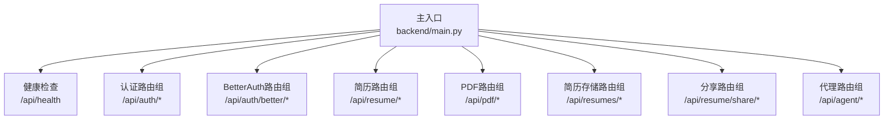
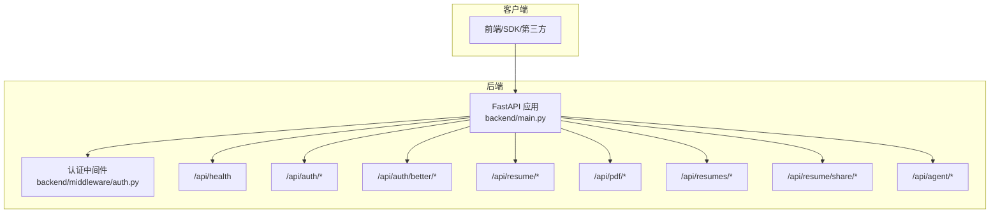
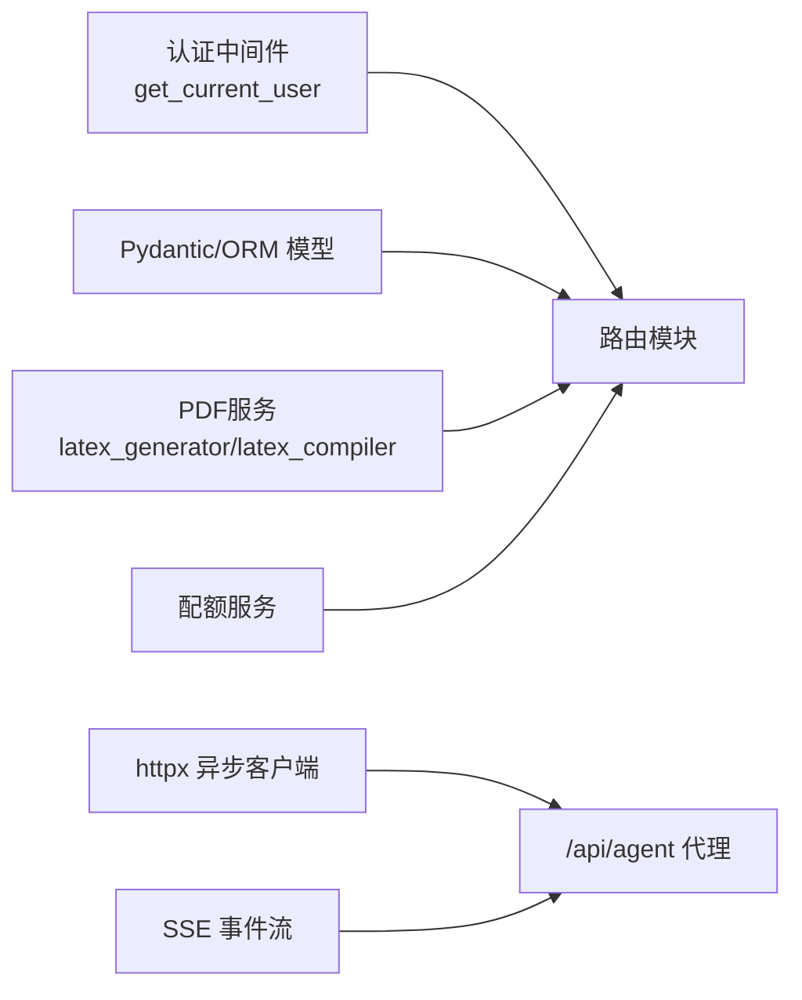

# API接口文档

<cite>
**本文档引用的文件**
- [backend/main.py](file://backend/main.py)
- [backend/routes/health.py](file://backend/routes/health.py)
- [backend/routes/resume.py](file://backend/routes/resume.py)
- [backend/routes/pdf.py](file://backend/routes/pdf.py)
- [backend/routes/auth.py](file://backend/routes/auth.py)
- [backend/routes/better_auth.py](file://backend/routes/better_auth.py)
- [backend/routes/resumes.py](file://backend/routes/resumes.py)
- [backend/routes/share.py](file://backend/routes/share.py)
- [backend/middleware/auth.py](file://backend/middleware/auth.py)
- [backend/models.py](file://backend/models.py)
</cite>

## 目录
1. [简介](#简介)
2. [项目结构](#项目结构)
3. [核心组件](#核心组件)
4. [架构总览](#架构总览)
5. [详细组件分析](#详细组件分析)
6. [依赖分析](#依赖分析)
7. [性能考虑](#性能考虑)
8. [故障排除指南](#故障排除指南)
9. [结论](#结论)
10. [附录](#附录)

## 简介
本文件为 ResumeAgent 项目的完整 API 接口文档，覆盖以下功能模块：
- 健康检查与AI测试
- 简历管理（创建、读取、更新、删除、同步）
- PDF 渲染与流式渲染（SSE）
- 用户认证与BetterAuth集成
- 简历分享
- AI代理反向代理与SSE流式接口

文档提供每个端点的HTTP方法、URL模式、请求/响应模式、认证要求、参数说明、数据类型定义、错误码说明、示例请求/响应以及速率限制、版本控制与最佳实践。

## 项目结构
后端采用 FastAPI 构建，统一前缀为 /api，核心路由在 backend/routes 下按功能模块划分，认证中间件位于 backend/middleware/auth.py，数据模型位于 backend/models.py。主入口 backend/main.py 负责注册路由、CORS、可观测性与代理逻辑。

图表来源
- [backend/main.py:106-138](file://backend/main.py#L106-L138)
- [backend/routes/health.py:9-12](file://backend/routes/health.py#L9-L12)
- [backend/routes/auth.py:46-232](file://backend/routes/auth.py#L46-L232)
- [backend/routes/better_auth.py:44-89](file://backend/routes/better_auth.py#L44-L89)
- [backend/routes/resume.py:795-800](file://backend/routes/resume.py#L795-L800)
- [backend/routes/pdf.py:125-185](file://backend/routes/pdf.py#L125-L185)
- [backend/routes/resumes.py:52-261](file://backend/routes/resumes.py#L52-L261)
- [backend/routes/share.py:39-104](file://backend/routes/share.py#L39-L104)

章节来源
- [backend/main.py:93-138](file://backend/main.py#L93-L138)

## 核心组件
- FastAPI 应用与路由注册：统一前缀 /api，CORS 允许跨域，注册健康检查、认证、简历、PDF、分享、代理等路由。
- 认证中间件：支持 JWT 与 BetterAuth 双通道，提供 get_current_user/get_current_user_optional 与管理员权限校验。
- 数据模型：Pydantic 模型定义请求/响应结构，SQLAlchemy ORM 映射数据库表。
- PDF 渲染：LaTeX 渲染简历为 PDF，支持直接流式与 SSE 流式。
- 代理与SSE：将 /api/agent/** 代理至外部 Agent 后端，或在本地合并路由；SSE 事件流用于进度反馈。

章节来源
- [backend/main.py:106-138](file://backend/main.py#L106-L138)
- [backend/middleware/auth.py:113-191](file://backend/middleware/auth.py#L113-L191)
- [backend/models.py:24-372](file://backend/models.py#L24-L372)

## 架构总览

图表来源
- [backend/main.py:106-138](file://backend/main.py#L106-L138)
- [backend/middleware/auth.py:113-191](file://backend/middleware/auth.py#L113-L191)

## 详细组件分析

### 健康检查
- 方法与路径
  - GET /api/health
- 认证
  - 无需认证
- 请求/响应
  - 请求：无
  - 响应：{"status": "ok"}
- 示例
  - curl -s http://127.0.0.1:9000/api/health

章节来源
- [backend/routes/health.py:9-12](file://backend/routes/health.py#L9-L12)

### AI测试
- 方法与路径
  - POST /api/ai/test
- 认证
  - 无需认证
- 请求体
  - provider: 选择 zhipu/doubao/deepseek
  - prompt: 测试提示词
- 响应
  - 成功：AI Provider 可用性验证结果
  - 失败：错误详情
- 示例
  - curl -s -X POST http://127.0.0.1:9000/api/ai/test -H 'Content-Type: application/json' -d '{"provider":"doubao","prompt":"用一句话介绍人工智能"}'

章节来源
- [backend/main.py:6-11](file://backend/main.py#L6-L11)

### 简历管理
- 方法与路径
  - POST /api/resume/generate
  - POST /api/resume/jd-optimize
  - POST /api/resume/jd-keyword-integrate
  - POST /api/resume/translate
  - POST /api/resume/health-check
  - POST /api/resume/grammar-check
  - POST /api/resume/rewrite-text/intent
- 认证
  - 除 /api/resume/grammar-check 与 /api/resume/rewrite-text/intent 外，其余端点均需 Bearer 认证
- 请求体与响应（节选）
  - /api/resume/generate
    - 请求：instruction（字符串）、provider（可选）、locale（可选）
    - 响应：resume（字典）、provider（字符串）
  - /api/resume/jd-optimize
    - 请求：jd_text（字符串）、fields（字段数组，含 key/label/content）、provider（可选）、locale（可选）
    - 响应：matchScore、atsScore、keywordMatches、missingKeywords、suggestions
  - /api/resume/jd-keyword-integrate
    - 请求：keyword（字符串）、jd_text（可选）、fields（字段数组）
    - 响应：integrated（布尔）、keyword、key、original、suggested、reason
  - /api/resume/translate
    - 请求：target_lang（目标语言代码）、fields（字段数组）
    - 响应：translations（字段翻译）
  - /api/resume/health-check
    - 请求：fields（字段数组）
    - 响应：overallScore、dimensions（含维度名、分数、评语）、suggestions、summary
  - /api/resume/grammar-check
    - 请求：text（字段内容）、path（可选字段路径）、provider（可选）、locale（可选）
    - 响应：issues（问题列表，含 original/suggestion/type/severity）、summary、score
  - /api/resume/rewrite-text/intent
    - 请求：text（选中文本）、instruction（改写指令）、path（可选）、locale（可选）
    - 响应：intent/intents/confidence 及来源（rule/llm）
- 错误码
  - 400：参数非法
  - 401：未认证或认证失败
  - 500：AI调用或解析失败
- 示例
  - curl -s -X POST http://127.0.0.1:9000/api/resume/generate -H 'Authorization: Bearer <token>' -H 'Content-Type: application/json' -d '{"instruction":"计算机科学硕士，5年Java开发经验","provider":"deepseek","locale":"zh"}'

章节来源
- [backend/routes/resume.py:795-800](file://backend/routes/resume.py#L795-L800)
- [backend/routes/resume.py:551-612](file://backend/routes/resume.py#L551-L612)
- [backend/routes/resume.py:638-682](file://backend/routes/resume.py#L638-L682)
- [backend/routes/resume.py:685-723](file://backend/routes/resume.py#L685-L723)
- [backend/routes/resume.py:726-792](file://backend/routes/resume.py#L726-L792)
- [backend/routes/resume.py:362-419](file://backend/routes/resume.py#L362-L419)
- [backend/routes/resume.py:252-297](file://backend/routes/resume.py#L252-L297)

### PDF 渲染与流式渲染（SSE）
- 方法与路径
  - POST /api/pdf/render
  - POST /api/pdf/render/stream
  - POST /api/pdf/compile-latex
  - POST /api/pdf/compile-latex/stream
  - GET /api/pdf/quota
  - POST /api/pdf/downloads/record
- 认证
  - /api/pdf/render、/api/pdf/render/stream、/api/pdf/compile-latex、/api/pdf/compile-latex/stream、/api/pdf/downloads/record 需 Bearer 认证；/api/pdf/quota 支持匿名
- 请求体与响应（节选）
  - /api/pdf/render
    - 请求：resume（简历JSON）、section_order（可选）、engine（可选）
    - 响应：application/pdf 流，带 X-PDF-Trace-Id、X-PDF-Download-Remaining 等头部
  - /api/pdf/render/stream
    - 请求：同上
    - 响应：SSE 事件流，事件包括 start/progress/pdf/error/quota
  - /api/pdf/compile-latex
    - 请求：latex_content（LaTeX源码）
    - 响应：application/pdf 流
  - /api/pdf/compile-latex/stream
    - 请求：latex_content
    - 响应：SSE 事件流，事件包括 start/progress/pdf/error
  - /api/pdf/quota
    - 响应：配额信息（used/limit/remaining）
  - /api/pdf/downloads/record
    - 响应：更新后的配额信息
- 错误码
  - 401：未认证
  - 403：超出PDF下载配额
  - 500：渲染/编译失败
- 示例
  - curl -s -X POST http://127.0.0.1:9000/api/pdf/render -H 'Authorization: Bearer <token>' -H 'Content-Type: application/json' -d '{"resume":{...},"section_order":["basic","experience"]}' -o resume.pdf

章节来源
- [backend/routes/pdf.py:125-185](file://backend/routes/pdf.py#L125-L185)
- [backend/routes/pdf.py:187-299](file://backend/routes/pdf.py#L187-L299)
- [backend/routes/pdf.py:302-334](file://backend/routes/pdf.py#L302-L334)
- [backend/routes/pdf.py:337-379](file://backend/routes/pdf.py#L337-L379)
- [backend/routes/pdf.py:76-122](file://backend/routes/pdf.py#L76-L122)

### 用户认证
- 方法与路径
  - POST /api/auth/register
  - POST /api/auth/login
  - GET /api/auth/me
- 认证
  - 除注册/登录外，其余端点需 Bearer 认证
- 请求体与响应（节选）
  - /api/auth/register
    - 请求：username、password
    - 响应：access_token、token_type、user（id/username/email/role）
  - /api/auth/login
    - 请求：username、password
    - 响应：access_token、token_type、user
  - /api/auth/me
    - 响应：当前用户信息
- 错误码
  - 400：参数非法
  - 401：账号或密码错误
  - 500：数据库/加密/令牌生成失败
- 示例
  - curl -s -X POST http://127.0.0.1:9000/api/auth/register -H 'Content-Type: application/json' -d '{"username":"test","password":"pass"}'

章节来源
- [backend/routes/auth.py:46-136](file://backend/routes/auth.py#L46-L136)
- [backend/routes/auth.py:149-226](file://backend/routes/auth.py#L149-L226)
- [backend/routes/auth.py:229-232](file://backend/routes/auth.py#L229-L232)

### BetterAuth 集成
- 方法与路径
  - GET /api/auth/better/health
  - GET /api/auth/better/me
  - GET /api/auth/better/account
- 认证
  - 需 BetterAuth 令牌或受信内部头（见认证中间件）
- 响应（节选）
  - /api/auth/better/health：返回 BetterAuth 内部地址、配置状态、权益表就绪状态
  - /api/auth/better/me：返回 BetterAuthUser
  - /api/auth/better/account：返回用户与权益信息（plan/credits/daily_usage_count/subscription_status 等）
- 示例
  - curl -s http://127.0.0.1:9000/api/auth/better/me -H 'Authorization: Bearer <token>'

章节来源
- [backend/routes/better_auth.py:44-89](file://backend/routes/better_auth.py#L44-L89)

### 简历存储
- 方法与路径
  - GET /api/resumes
  - GET /api/resumes/{resume_id}
  - POST /api/resumes
  - PUT /api/resumes/{resume_id}
  - DELETE /api/resumes/{resume_id}
  - POST /api/resumes/sync
- 认证
  - 需 Bearer 认证
- 请求体与响应（节选）
  - GET /api/resumes：返回当前用户简历列表
  - GET /api/resumes/{resume_id}：返回单个简历
  - POST /api/resumes：创建简历，payload 包含 id/name/alias/template_type/data
  - PUT /api/resumes/{resume_id}：更新简历（不存在时自动创建）
  - DELETE /api/resumes/{resume_id}：删除简历
  - POST /api/resumes/sync：同步简历数据（localStorage ↔ 数据库）
- 错误码
  - 404：简历不存在
  - 409：ID冲突
  - 500：数据库操作失败
- 示例
  - curl -s http://127.0.0.1:9000/api/resumes -H 'Authorization: Bearer <token>'

章节来源
- [backend/routes/resumes.py:52-261](file://backend/routes/resumes.py#L52-L261)

### 分享简历
- 方法与路径
  - POST /api/resume/share
  - GET /api/resume/share/{share_id}
  - DELETE /api/resume/share/{share_id}
  - GET /api/resume/shares
- 认证
  - 无需认证
- 请求体与响应（节选）
  - POST /api/resume/share：传入 resume_data/resume_name/expire_days，返回 share_url/share_id/expires_at
  - GET /api/resume/share/{share_id}：返回简历数据与统计
  - DELETE /api/resume/share/{share_id}：删除分享链接
  - GET /api/resume/shares：列出所有分享链接
- 错误码
  - 404：分享链接不存在或已过期
- 示例
  - curl -s -X POST http://127.0.0.1:9000/api/resume/share -H 'Content-Type: application/json' -d '{"resume_data":{...},"resume_name":"张三简历","expire_days":30}'

章节来源
- [backend/routes/share.py:39-104](file://backend/routes/share.py#L39-L104)
- [backend/routes/share.py:117-134](file://backend/routes/share.py#L117-L134)

### AI代理反向代理与SSE
- 方法与路径
  - /api/agent/**（支持 GET/POST/PUT/PATCH/DELETE/OPTIONS/HEAD）
- 认证
  - 透传客户端请求头；如启用内部合并路由，则通过受信内部头或 BetterAuth 令牌进行身份识别
- 行为
  - 若配置 AGENT_BACKEND_BASE_URL，则将 /api/agent/** 反向代理至上游；若上游返回 text/event-stream，则原样转发为 SSE
  - 否则合并本地 OpenManus 路由（如缺少可选依赖则警告）
- 错误码
  - 502：上游不可达
- 示例
  - curl -N -X GET http://127.0.0.1:9000/api/agent/chat/completions

章节来源
- [backend/main.py:141-224](file://backend/main.py#L141-L224)

## 依赖分析
- 认证依赖
  - get_current_user：支持 BetterAuth Bearer 与 JWT，内部受信头优先
  - get_current_user_optional：匿名可访问端点使用
  - require_admin_only/require_admin_or_member：管理员/成员权限
- 数据模型依赖
  - Pydantic 模型用于请求/响应校验
  - SQLAlchemy 模型映射 users/resumes 等表
- PDF 渲染依赖
  - latex_generator/latex_compiler 提供 LaTeX 到 PDF 的编译
  - 配额服务控制下载次数
- 代理依赖
  - httpx 异步客户端转发请求，保持头部与体
  - SSE 事件流透传上游事件

图表来源
- [backend/middleware/auth.py:113-191](file://backend/middleware/auth.py#L113-L191)
- [backend/models.py:24-372](file://backend/models.py#L24-L372)
- [backend/routes/pdf.py:43-56](file://backend/routes/pdf.py#L43-L56)
- [backend/main.py:141-224](file://backend/main.py#L141-L224)

章节来源
- [backend/middleware/auth.py:113-191](file://backend/middleware/auth.py#L113-L191)
- [backend/models.py:24-372](file://backend/models.py#L24-L372)
- [backend/routes/pdf.py:43-56](file://backend/routes/pdf.py#L43-L56)
- [backend/main.py:141-224](file://backend/main.py#L141-L224)

## 性能考虑
- 启动优化
  - 预热 HTTP 连接、数据库连接、tiktoken 编码文件，减少首次请求延迟
- PDF 渲染
  - 使用线程池执行 LaTeX 生成与编译，避免阻塞事件循环
  - SSE 流式渲染提供实时进度反馈，提升用户体验
- 并发与限流
  - 翻译接口使用信号量限制并发，避免单次调用过大响应
- 日志与可观测性
  - 启用观测性处理器，记录请求/错误/链路追踪

章节来源
- [backend/main.py:228-315](file://backend/main.py#L228-L315)
- [backend/routes/pdf.py:187-299](file://backend/routes/pdf.py#L187-L299)
- [backend/routes/resume.py:699-723](file://backend/routes/resume.py#L699-L723)

## 故障排除指南
- 认证相关
  - 401 未认证：检查 Authorization 头是否为 Bearer 令牌；确认 BetterAuth 令牌有效
  - 403 非管理员：调用 require_admin_only/require_admin_or_member 的端点时检查用户角色
  - 数据库连接异常：重试或稍后重试，关注 503
- PDF 渲染
  - 500 渲染失败：检查 LaTeX 源码与模板目录；确认配额状态
  - SSE 无事件：确认上游返回 text/event-stream；检查网络与代理配置
- 认证接口
  - 登录失败：账号或密码错误；检查数据库连接与密码哈希
  - 注册失败：用户名冲突、密码加密失败、数据库保存失败
- 代理
  - 502 上游不可达：检查 AGENT_BACKEND_BASE_URL 与上游服务状态

章节来源
- [backend/middleware/auth.py:113-191](file://backend/middleware/auth.py#L113-L191)
- [backend/routes/pdf.py:180-184](file://backend/routes/pdf.py#L180-L184)
- [backend/routes/auth.py:196-201](file://backend/routes/auth.py#L196-L201)
- [backend/main.py:172-183](file://backend/main.py#L172-L183)

## 结论
本 API 文档覆盖了 ResumeAgent 的核心功能模块，提供了统一的 /api 前缀、明确的认证要求、详尽的请求/响应模型与错误码说明。结合 SSE 流式接口与代理机制，能够满足简历生成、渲染、分享与AI代理交互的多样化需求。建议在生产环境中完善速率限制、配额策略与安全审计，并使用 BetterAuth 进行统一身份治理。

## 附录

### 认证要求与最佳实践
- 使用 Bearer 令牌进行认证，令牌格式为 "Bearer <token>"
- 管理员端点需管理员角色
- 建议在客户端缓存令牌并定期刷新
- 对敏感端点增加速率限制与配额控制

章节来源
- [backend/middleware/auth.py:113-191](file://backend/middleware/auth.py#L113-L191)

### 速率限制与配额
- PDF 下载配额：通过 /api/pdf/quota 查询，/api/pdf/downloads/record 记录成功下载
- 管理端配额：管理员可通过 require_admin_only/require_admin_or_member 控制访问

章节来源
- [backend/routes/pdf.py:76-122](file://backend/routes/pdf.py#L76-L122)
- [backend/middleware/auth.py:176-191](file://backend/middleware/auth.py#L176-L191)

### 版本控制与兼容性
- 当前版本未显式声明 API 版本号，建议在请求头中携带 X-API-Version 或在路径中引入版本前缀（如 /api/v1）

[本节为通用指导，不涉及具体文件分析]

### SSE 流式接口说明
- 事件类型
  - start：开始生成
  - progress：进度更新
  - pdf：PDF 字节（十六进制字符串）
  - error：错误信息
  - quota：配额信息
- 客户端集成建议
  - 使用 EventSource 接收事件
  - 对 pdf 事件进行解码并拼接为 PDF 文件
  - 对 error 事件进行错误提示与重试

章节来源
- [backend/routes/pdf.py:187-299](file://backend/routes/pdf.py#L187-L299)