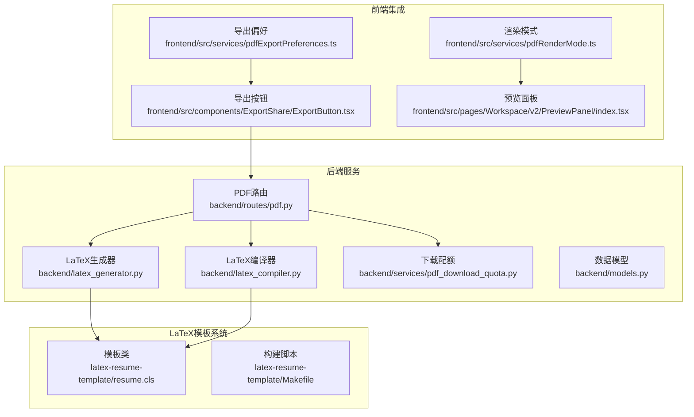
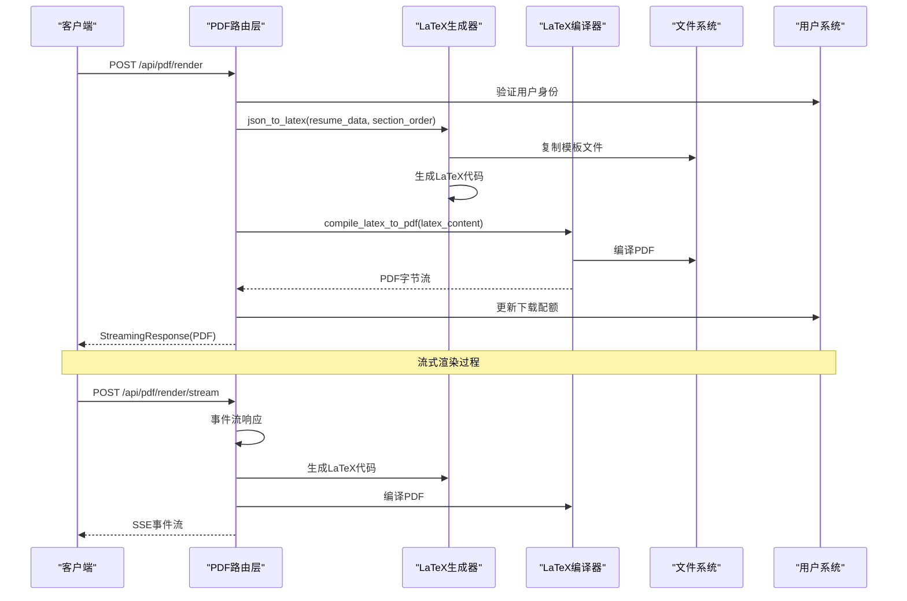
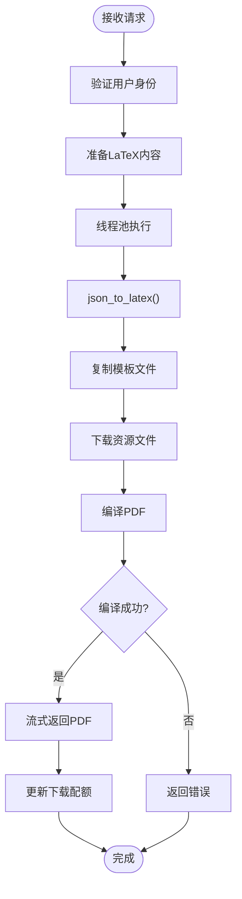
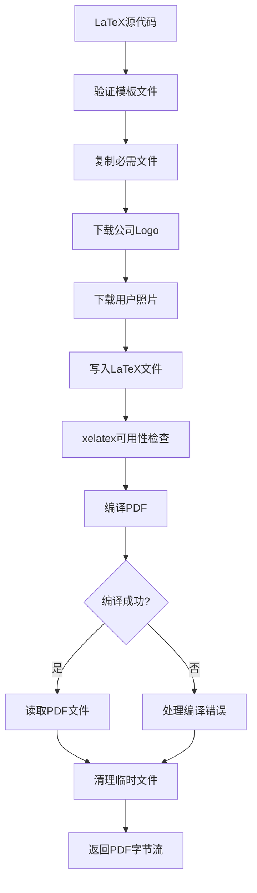
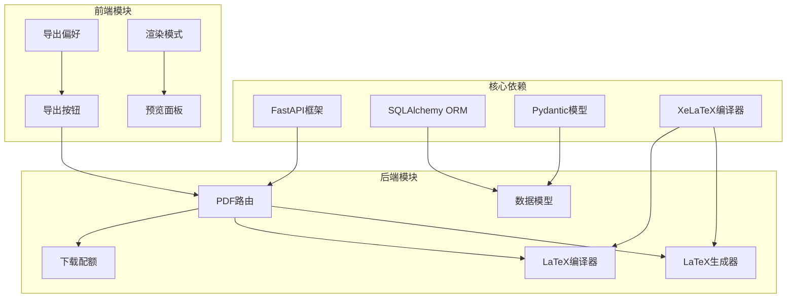

# PDF导出API

<cite>
**本文档引用的文件**
- [backend/routes/pdf.py](file://backend/routes/pdf.py)
- [backend/services/pdf_download_quota.py](file://backend/services/pdf_download_quota.py)
- [backend/latex_generator.py](file://backend/latex_generator.py)
- [backend/latex_compiler.py](file://backend/latex_compiler.py)
- [backend/models.py](file://backend/models.py)
- [latex-resume-template/resume.cls](file://latex-resume-template/resume.cls)
- [latex-resume-template/Makefile](file://latex-resume-template/Makefile)
- [backend/tests/test_pdf_download_quota.py](file://backend/tests/test_pdf_download_quota.py)
- [backend/tests/test_pdf_stream_threadpool.py](file://backend/tests/test_pdf_stream_threadpool.py)
- [backend/routes/admin.py](file://backend/routes/admin.py)
- [frontend/src/components/ExportShare/pdfGenerator.ts](file://frontend/src/components/ExportShare/pdfGenerator.ts)
- [frontend/src/services/pdfExportPreferences.ts](file://frontend/src/services/pdfExportPreferences.ts)
- [frontend/src/services/pdfRenderMode.ts](file://frontend/src/services/pdfRenderMode.ts)
- [frontend/src/pages/Workspace/v2/PreviewPanel/index.tsx](file://frontend/src/pages/Workspace/v2/PreviewPanel/index.tsx)
</cite>

## 目录
1. [简介](#简介)
2. [项目结构](#项目结构)
3. [核心组件](#核心组件)
4. [架构概览](#架构概览)
5. [详细组件分析](#详细组件分析)
6. [依赖关系分析](#依赖关系分析)
7. [性能考虑](#性能考虑)
8. [故障排除指南](#故障排除指南)
9. [结论](#结论)

## 简介
本文件详细记录了ResumeAgent项目中的PDF导出API，涵盖LaTeX模板系统集成、PDF编译流程、字体和样式配置、PDF质量设置、页面布局选项、批量导出功能，以及完整的请求参数说明、响应格式定义、错误处理机制。同时解释了PDF下载配额、缓存策略和性能优化方案。

## 项目结构
PDF导出功能主要分布在后端服务、LaTeX模板系统和前端集成三个层面：

**图表来源**
- [backend/routes/pdf.py:1-380](file://backend/routes/pdf.py#L1-380)
- [backend/latex_generator.py:1-676](file://backend/latex_generator.py#L1-676)
- [backend/latex_compiler.py:1-131](file://backend/latex_compiler.py#L1-131)
- [backend/services/pdf_download_quota.py:1-111](file://backend/services/pdf_download_quota.py#L1-111)
- [latex-resume-template/resume.cls:1-125](file://latex-resume-template/resume.cls#L1-125)
- [latex-resume-template/Makefile:1-26](file://latex-resume-template/Makefile#L1-26)

**章节来源**
- [backend/routes/pdf.py:1-380](file://backend/routes/pdf.py#L1-380)
- [backend/latex_generator.py:1-676](file://backend/latex_generator.py#L1-676)
- [backend/latex_compiler.py:1-131](file://backend/latex_compiler.py#L1-131)
- [latex-resume-template/resume.cls:1-125](file://latex-resume-template/resume.cls#L1-125)

## 核心组件
PDF导出API包含以下核心组件：

### 1. PDF渲染路由
- `/api/pdf/render`: 直接渲染PDF并返回
- `/api/pdf/render/stream`: 流式渲染PDF，提供实时进度反馈
- `/api/pdf/compile-latex`: 直接编译LaTeX源代码为PDF
- `/api/pdf/compile-latex/stream`: 流式编译LaTeX源代码为PDF

### 2. 下载配额管理
- `/api/pdf/quota`: 查询当前用户PDF下载配额
- `/api/pdf/downloads/record`: 记录一次真实PDF下载

### 3. LaTeX模板系统
- 支持多种字体大小（9, 10, 11, 12pt）
- 页面边距配置（tight, compact, standard, relaxed, wide）
- 行间距设置（0.8-2.0倍）
- 中文字体支持和Unicode编码

**章节来源**
- [backend/routes/pdf.py:76-380](file://backend/routes/pdf.py#L76-380)
- [backend/services/pdf_download_quota.py:17-111](file://backend/services/pdf_download_quota.py#L17-111)
- [backend/latex_generator.py:293-353](file://backend/latex_generator.py#L293-353)
- [latex-resume-template/resume.cls:1-125](file://latex-resume-template/resume.cls#L1-125)

## 架构概览
PDF导出API采用分层架构设计，实现了前后端分离和可扩展的模板系统：

**图表来源**
- [backend/routes/pdf.py:125-299](file://backend/routes/pdf.py#L125-299)
- [backend/latex_generator.py:463-599](file://backend/latex_generator.py#L463-599)
- [backend/latex_compiler.py:18-129](file://backend/latex_compiler.py#L18-129)

## 详细组件分析

### PDF渲染接口
PDF渲染接口提供了两种渲染模式：直接渲染和流式渲染。

#### 直接渲染接口
- **端点**: `POST /api/pdf/render`
- **功能**: 将简历JSON直接渲染为PDF并返回
- **特点**: 不使用缓存，适合一次性导出

#### 流式渲染接口
- **端点**: `POST /api/pdf/render/stream`
- **功能**: 提供实时进度反馈的PDF渲染
- **事件类型**:
  - `start`: 开始生成PDF
  - `progress`: 进度更新
  - `pdf`: PDF数据（十六进制）
  - `quota`: 配额信息
  - `error`: 错误信息

**图表来源**
- [backend/routes/pdf.py:125-299](file://backend/routes/pdf.py#L125-299)
- [backend/latex_generator.py:463-676](file://backend/latex_generator.py#L463-676)

**章节来源**
- [backend/routes/pdf.py:125-299](file://backend/routes/pdf.py#L125-299)
- [backend/latex_generator.py:261-461](file://backend/latex_generator.py#L261-461)

### 模板选择接口
LaTeX模板系统提供了灵活的模板选择和配置机制：

#### 字体配置
- 支持四种字体大小：9pt, 10pt, 11pt, 12pt
- 默认字体大小：11pt
- 字体文件：Main字体库和中文字体支持

#### 页面布局配置
- **边距设置**: tight(0.25in), compact(0.3in), standard(0.4in), relaxed(0.5in), wide(0.6in)
- **行间距**: 0.8-2.0倍，默认1.0倍
- **页尺寸**: A4纸张标准

#### 样式配置
- 中文字体支持：Adobe字体外部样式
- 行间距修正：linespacing_fix.sty
- 字体加载：zh_CN-Adobefonts_external.sty

**章节来源**
- [backend/latex_generator.py:293-353](file://backend/latex_generator.py#L293-353)
- [latex-resume-template/resume.cls:28-45](file://latex-resume-template/resume.cls#L28-45)

### 格式转换接口
PDF导出API支持多种格式转换方式：

#### LaTeX直接编译
- **端点**: `POST /api/pdf/compile-latex`
- **功能**: 直接编译用户提供的LaTeX源代码
- **特点**: 使用slager原版样式，与slager.link完全一致

#### HTML到LaTeX转换
- 支持富文本格式转换
- 支持列表、标题、强调等格式
- 自动处理HTML特殊字符

**章节来源**
- [backend/routes/pdf.py:302-380](file://backend/routes/pdf.py#L302-380)
- [backend/latex_compiler.py:18-129](file://backend/latex_compiler.py#L18-129)

### PDF编译流程
PDF编译流程包含多个步骤，确保高质量的PDF输出：

**图表来源**
- [backend/latex_generator.py:463-604](file://backend/latex_generator.py#L463-604)
- [backend/latex_compiler.py:18-129](file://backend/latex_compiler.py#L18-129)

**章节来源**
- [backend/latex_generator.py:463-604](file://backend/latex_generator.py#L463-604)
- [backend/latex_compiler.py:18-129](file://backend/latex_compiler.py#L18-129)

### 字体和样式配置
系统提供了全面的字体和样式配置选项：

#### 字体系统
- 主字体：TeX Gyre Termes
- 支持中文字体：Adobe字体外部样式
- 字体特性：粗体、斜体、小型大写字母

#### 样式特性
- 标题格式：`\section`, `\subsection`命令
- 列表格式：`itemize`, `enumerate`环境
- 时间线格式：`datedsection`, `datedsubsection`命令
- 联系信息格式：`\contactInfo`, `\blogLine`命令

**章节来源**
- [latex-resume-template/resume.cls:28-125](file://latex-resume-template/resume.cls#L28-125)

### PDF质量设置
PDF质量设置包括多个方面：

#### 编译质量
- 编译器：XeLaTeX（支持Unicode）
- 输出格式：PDF 1.4
- 编译超时：180秒

#### 资源处理
- Logo下载：自动下载并缓存公司Logo
- 照片处理：支持PNG、JPG、JPEG、WEBP格式
- 字体文件：包含完整的字体目录

**章节来源**
- [backend/latex_compiler.py:84-99](file://backend/latex_compiler.py#L84-99)
- [backend/latex_generator.py:497-538](file://backend/latex_generator.py#L497-538)

### 页面布局选项
系统提供了丰富的页面布局选项：

#### 边距配置
- tight: 0.25英寸
- compact: 0.3英寸  
- standard: 0.4英寸（默认）
- relaxed: 0.5英寸
- wide: 0.6英寸

#### 间距调整
- 头部顶部间距：支持px到pt转换
- 姓名与联系信息间距：可调
- 头部底部间距：可调

#### 字体大小
- 支持9pt, 10pt, 11pt, 12pt
- 默认11pt，与原始模板保持一致

**章节来源**
- [backend/latex_generator.py:299-318](file://backend/latex_generator.py#L299-318)

### 批量导出功能
系统支持批量导出功能，通过以下机制实现：

#### 缓存策略
- 内存缓存：最多保留50个PDF
- 缓存键：基于简历数据和章节顺序的MD5哈希
- 缓存淘汰：LRU算法，移除最旧的缓存

#### 并发处理
- 线程池：使用FastAPI的线程池执行阻塞操作
- 异步处理：支持SSE事件流
- 资源清理：自动清理临时文件

**章节来源**
- [backend/latex_generator.py:606-676](file://backend/latex_generator.py#L606-676)
- [backend/routes/pdf.py:14-11](file://backend/routes/pdf.py#L14-11)

## 依赖关系分析

**图表来源**
- [backend/routes/pdf.py:1-35](file://backend/routes/pdf.py#L1-35)
- [backend/latex_generator.py:1-24](file://backend/latex_generator.py#L1-24)
- [backend/latex_compiler.py:1-16](file://backend/latex_compiler.py#L1-16)

**章节来源**
- [backend/routes/pdf.py:1-35](file://backend/routes/pdf.py#L1-35)
- [backend/latex_generator.py:1-24](file://backend/latex_generator.py#L1-24)

## 性能考虑

### 缓存优化
系统实现了智能缓存机制来提升性能：

- **缓存容量**: 最多50个PDF实例
- **缓存键**: 基于简历数据和章节顺序的MD5哈希
- **缓存策略**: LRU淘汰算法
- **命中率**: 显著减少重复编译开销

### 线程池优化
- **阻塞操作**: LaTeX编译和文件I/O操作在独立线程执行
- **并发控制**: 避免阻塞主事件循环
- **资源管理**: 自动清理临时文件和进程

### 内存管理
- **临时文件**: 编译完成后自动清理
- **PDF对象**: 使用BytesIO避免磁盘I/O
- **缓存限制**: 防止内存泄漏

**章节来源**
- [backend/latex_generator.py:606-676](file://backend/latex_generator.py#L606-676)
- [backend/tests/test_pdf_stream_threadpool.py:14-41](file://backend/tests/test_pdf_stream_threadpool.py#L14-41)

## 故障排除指南

### 常见错误类型

#### LaTeX编译错误
- **错误类型**: 编译器找不到xelatex命令
- **解决方案**: 安装BasicTeX或MacTeX
- **错误信息**: 提供详细的安装指导

#### 资源下载失败
- **错误类型**: Logo或照片下载超时
- **解决方案**: 自动降级为无资源渲染
- **影响**: 保持PDF完整性但缺少图片

#### 配额超限
- **错误类型**: PDF下载次数达到上限
- **解决方案**: 升级账户或等待重置
- **状态码**: 403 Forbidden

### 调试工具
系统提供了完善的调试和监控功能：

#### 日志记录
- **跟踪ID**: X-PDF-Trace-Id头
- **性能指标**: 渲染时间和字节数
- **错误详情**: 详细的错误堆栈信息

#### 监控指标
- **渲染时间**: X-Render-Time头
- **剩余配额**: X-PDF-Download-Remaining头
- **请求追踪**: 完整的请求-响应链路

**章节来源**
- [backend/routes/pdf.py:145-184](file://backend/routes/pdf.py#L145-184)
- [backend/services/pdf_download_quota.py:58-111](file://backend/services/pdf_download_quota.py#L58-111)

### 测试验证
系统包含完整的测试套件：

#### 配额测试
- **测试场景**: 正常用户、管理员、超限情况
- **验证内容**: 配额计算、权限控制、并发安全
- **测试方法**: 单元测试和集成测试

#### 性能测试
- **测试场景**: 线程池使用、缓存命中率
- **验证内容**: 异步处理、资源清理
- **测试方法**: 性能基准测试

**章节来源**
- [backend/tests/test_pdf_download_quota.py:1-133](file://backend/tests/test_pdf_download_quota.py#L1-133)
- [backend/tests/test_pdf_stream_threadpool.py:14-41](file://backend/tests/test_pdf_stream_threadpool.py#L14-41)

## 结论
ResumeAgent的PDF导出API提供了完整的LaTeX驱动的PDF生成解决方案。系统具有以下优势：

1. **灵活性**: 支持多种模板配置和自定义选项
2. **可靠性**: 完善的错误处理和恢复机制
3. **性能**: 智能缓存和异步处理优化
4. **可扩展性**: 模块化设计便于功能扩展
5. **用户体验**: 流式渲染提供实时反馈

该API适用于各种简历生成和导出场景，能够满足从个人简历到企业级批量导出的各种需求。通过合理的配置和优化，可以实现高质量、高效率的PDF生成服务。