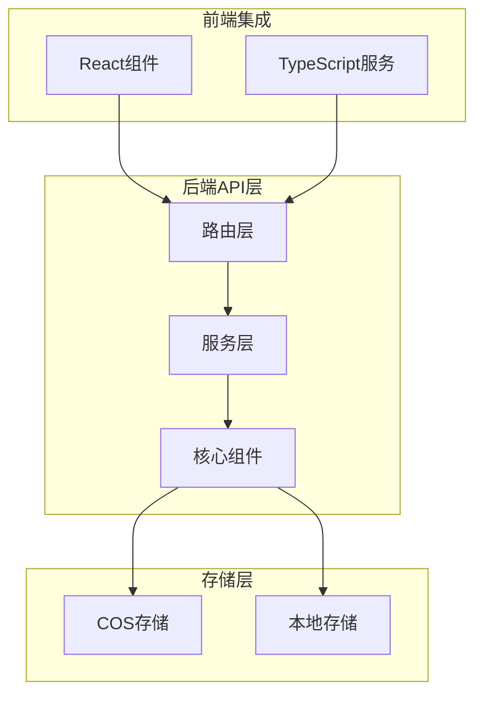
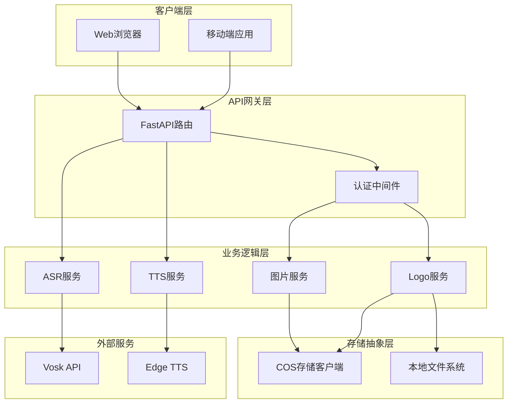
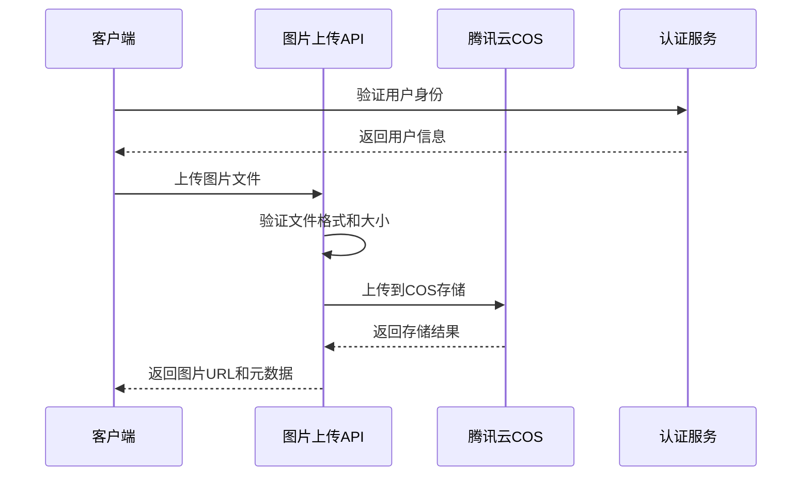
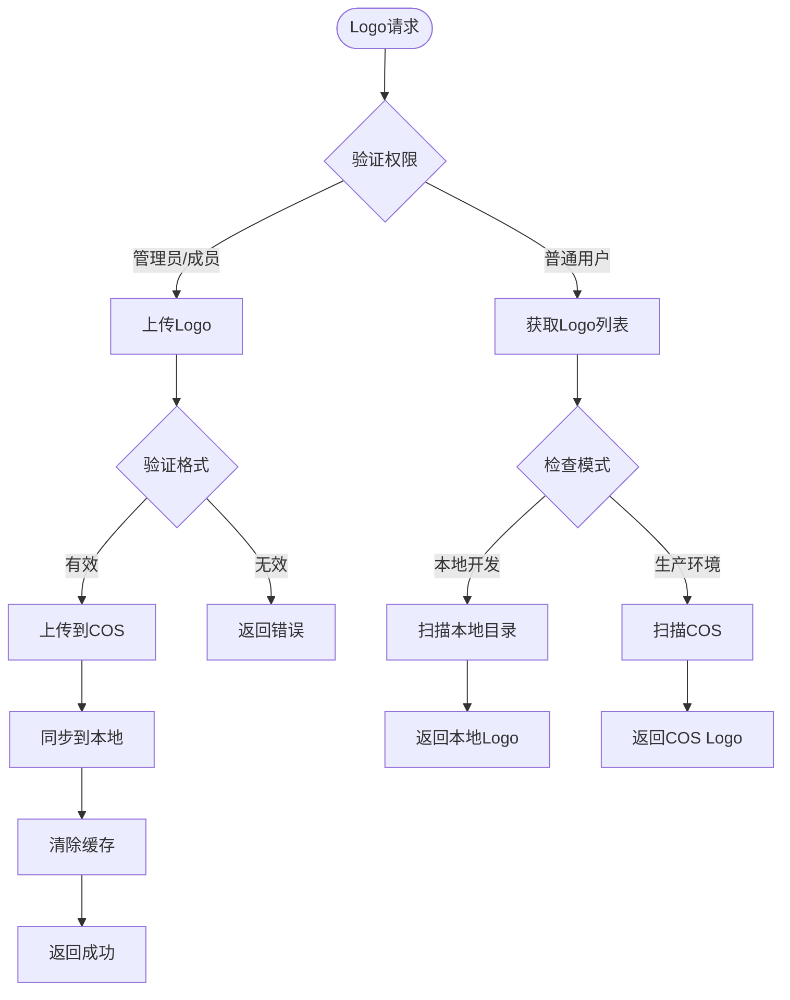
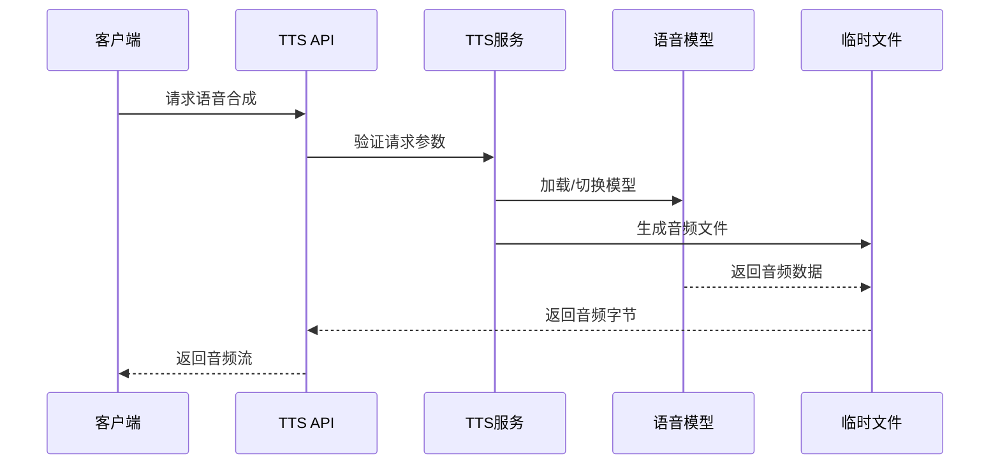
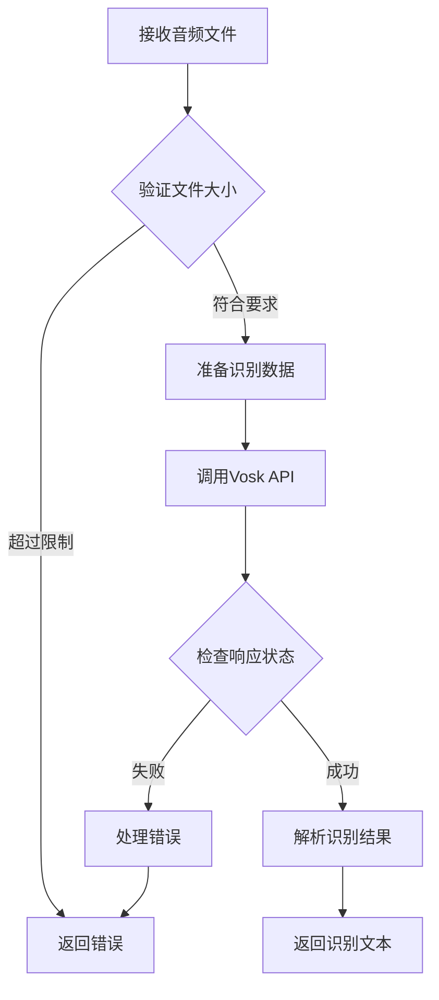
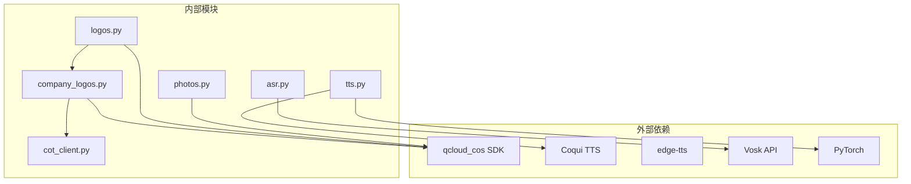

# 媒体资源API

<cite>
**本文档引用的文件**
- [photos.py](file://backend/routes/photos.py)
- [logos.py](file://backend/routes/logos.py)
- [tts.py](file://backend/routes/tts.py)
- [tts_edge.py](file://backend/routes/tts_edge.py)
- [asr.py](file://backend/routes/asr.py)
- [tts_service.py](file://backend/services/tts_service.py)
- [tts_service_edge.py](file://backend/services/tts_service_edge.py)
- [company_logos.py](file://backend/company_logos.py)
- [cos_client.py](file://backend/core/cos_client.py)
- [README.md](file://README.md)
</cite>

## 目录
1. [简介](#简介)
2. [项目结构](#项目结构)
3. [核心组件](#核心组件)
4. [架构概览](#架构概览)
5. [详细组件分析](#详细组件分析)
6. [依赖关系分析](#依赖关系分析)
7. [性能考虑](#性能考虑)
8. [故障排除指南](#故障排除指南)
9. [结论](#结论)

## 简介

Resume-Agent是一个面向中文求职场景的AI简历系统，提供从内容生成、结构化编辑到PDF导出的完整流程。本文档详细介绍了媒体资源API的设计与实现，包括图片上传和管理接口、Logo处理接口、语音合成(TTS)接口、语音识别(ASR)接口。

该系统采用FastAPI框架构建，支持多种媒体格式处理，集成了腾讯云COS存储服务，并提供了完整的错误处理和性能优化机制。

## 项目结构

媒体资源API主要分布在以下目录结构中：

**图表来源**
- [photos.py:1-102](file://backend/routes/photos.py#L1-L102)
- [logos.py:1-156](file://backend/routes/logos.py#L1-L156)
- [tts.py:1-114](file://backend/routes/tts.py#L1-L114)

**章节来源**
- [README.md:1-106](file://README.md#L1-L106)

## 核心组件

### 图片上传与管理组件

系统提供了完整的图片上传和管理功能，支持用户头像上传和公司Logo管理。

**章节来源**
- [photos.py:33-102](file://backend/routes/photos.py#L33-L102)
- [logos.py:77-156](file://backend/routes/logos.py#L77-L156)

### 语音合成(TTS)组件

系统实现了两种TTS解决方案：
- Coqui TTS：基于深度学习的高质量语音合成
- Edge TTS：微软免费方案，支持多语言和多声音

**章节来源**
- [tts.py:18-114](file://backend/routes/tts.py#L18-L114)
- [tts_edge.py:19-115](file://backend/routes/tts_edge.py#L19-L115)
- [tts_service.py:39-184](file://backend/services/tts_service.py#L39-L184)
- [tts_service_edge.py:30-171](file://backend/services/tts_service_edge.py#L30-L171)

### 语音识别(ASR)组件

实现了基于Vosk API的语音识别功能，支持实时流式识别和批量音频识别。

**章节来源**
- [asr.py:18-193](file://backend/routes/asr.py#L18-L193)

## 架构概览

**图表来源**
- [photos.py:1-102](file://backend/routes/photos.py#L1-L102)
- [logos.py:1-156](file://backend/routes/logos.py#L1-L156)
- [tts.py:1-114](file://backend/routes/tts.py#L1-L114)
- [asr.py:1-193](file://backend/routes/asr.py#L1-L193)

## 详细组件分析

### 图片上传与管理接口

#### 用户照片上传接口

用户照片上传接口提供了安全的图片上传功能，支持多种格式并包含严格的安全检查。

**接口规范**
- 方法：POST
- 路径：`/api/photos/upload`
- 认证：必需
- 支持格式：PNG, JPG, JPEG, WEBP
- 大小限制：2MB
- 存储路径：`users/{account}/photos/{uuid}.{ext}`

**图表来源**
- [photos.py:33-102](file://backend/routes/photos.py#L33-L102)

**章节来源**
- [photos.py:33-102](file://backend/routes/photos.py#L33-L102)

#### Logo管理接口

Logo管理接口提供了完整的Logo上传、查询和管理功能。

**接口规范**
- GET `/api/logos`：获取所有可用Logo列表
- GET `/api/logos/file/{key}`：获取本地Logo文件
- POST `/api/logos/upload`：上传自定义Logo

**Logo存储策略**
- 优先存储到COS `company_logo/` 目录
- 同步到本地 `images/logo/` 目录
- 支持缓存机制，缓存有效期5分钟

**图表来源**
- [logos.py:44-156](file://backend/routes/logos.py#L44-L156)
- [company_logos.py:335-363](file://backend/company_logos.py#L335-L363)

**章节来源**
- [logos.py:44-156](file://backend/routes/logos.py#L44-L156)
- [company_logos.py:1-439](file://backend/company_logos.py#L1-L439)

### 语音合成(TTS)接口

#### Coqui TTS接口

Coqui TTS提供了高质量的中文和英文语音合成服务。

**接口规范**
- POST `/api/tts/synthesize`
- 支持模型：`zh-CN-baker`, `zh-CN-vits`, `en-US`
- 支持格式：WAV, MP3
- 文本长度：1-5000字符

**语音合成流程**

**图表来源**
- [tts.py:37-87](file://backend/routes/tts.py#L37-L87)
- [tts_service.py:74-145](file://backend/services/tts_service.py#L74-L145)

**章节来源**
- [tts.py:18-114](file://backend/routes/tts.py#L18-L114)
- [tts_service.py:39-184](file://backend/services/tts_service.py#L39-L184)

#### Edge TTS接口

Edge TTS提供了微软免费的语音合成服务，支持多语言和多声音选择。

**接口规范**
- POST `/api/tts/synthesize`
- 支持语言：中文、英文、日文、韩文
- 支持声音：多种神经网络声音
- 支持格式：MP3, WAV

**章节来源**
- [tts_edge.py:19-115](file://backend/routes/tts_edge.py#L19-L115)
- [tts_service_edge.py:30-171](file://backend/services/tts_service_edge.py#L30-L171)

### 语音识别(ASR)接口

#### 批量语音识别接口

ASR接口提供了基于Vosk API的语音识别功能，支持多种音频格式。

**接口规范**
- POST `/api/asr/recognize`
- 支持格式：WAV, MP3, OGG, OPUS
- 文件大小：最大25MB
- 采样率：16kHz

**识别流程**

**图表来源**
- [asr.py:33-114](file://backend/routes/asr.py#L33-L114)

**章节来源**
- [asr.py:18-193](file://backend/routes/asr.py#L18-L193)

#### 流式语音识别接口

系统还提供了WebSocket接口，支持实时流式语音识别。

**接口规范**
- WebSocket: `/api/asr/ws/stream`
- 支持配置：语言、采样率、块大小
- 实时处理：音频块流式传输和识别

**章节来源**
- [asr.py:123-183](file://backend/routes/asr.py#L123-L183)

## 依赖关系分析

**图表来源**
- [photos.py:60-71](file://backend/routes/photos.py#L60-L71)
- [logos.py:107-118](file://backend/routes/logos.py#L107-L118)
- [tts_service.py:13-15](file://backend/services/tts_service.py#L13-L15)
- [asr.py:49-88](file://backend/routes/asr.py#L49-L88)

**章节来源**
- [cos_client.py:19-37](file://backend/core/cos_client.py#L19-L37)

## 性能考虑

### 存储优化

系统采用了多层次的存储策略来优化性能：

1. **缓存机制**：Logo列表缓存5分钟，减少COS访问频率
2. **本地回退**：开发环境下优先使用本地资源，避免网络延迟
3. **异步处理**：使用`asyncio.to_thread`进行阻塞操作的异步化

### 网络优化

1. **超时配置**：COS请求超时时间可配置，默认8秒
2. **代理设置**：禁用系统代理，使用直连连接
3. **CDN集成**：前端PDF.js使用多个CDN源，提高加载稳定性

### 内存管理

1. **临时文件**：语音合成使用临时文件，及时清理
2. **流式处理**：大文件采用流式读取，避免内存溢出
3. **GPU检测**：自动检测GPU可用性，优化计算性能

## 故障排除指南

### 常见错误及解决方案

**COS配置错误**
- 错误：COS凭证未配置
- 解决：设置`COS_SECRET_ID`和`COS_SECRET_KEY`环境变量
- 影响：Logo上传和用户照片上传失败

**文件格式错误**
- 错误：不支持的文件格式
- 解决：检查文件扩展名是否在允许列表中
- 支持格式：PNG, JPG, JPEG, WEBP, SVG

**文件大小超限**
- 错误：文件过大
- 解决：压缩图片或选择更小的文件
- 大小限制：2MB（图片）/ 25MB（音频）

**章节来源**
- [photos.py:45-57](file://backend/routes/photos.py#L45-L57)
- [logos.py:88-104](file://backend/routes/logos.py#L88-L104)
- [asr.py:57-63](file://backend/routes/asr.py#L57-L63)

### 监控和日志

系统提供了完善的监控机制：

1. **请求追踪**：每个请求都有唯一的trace ID
2. **错误日志**：详细的错误堆栈信息
3. **性能指标**：API响应时间和状态码统计

**章节来源**
- [tts.py:101-114](file://backend/routes/tts.py#L101-L114)
- [asr.py:185-193](file://backend/routes/asr.py#L185-L193)

## 结论

Resume-Agent的媒体资源API设计合理，功能完整，具有以下特点：

1. **安全性**：严格的文件格式和大小验证，防止恶意文件上传
2. **可靠性**：多重存储策略和缓存机制，确保服务稳定性
3. **可扩展性**：模块化的架构设计，便于功能扩展
4. **性能优化**：异步处理、缓存策略和资源管理优化

该API为简历系统的多媒体功能提供了坚实的技术基础，支持用户头像管理、Logo品牌化、语音合成和语音识别等核心功能。