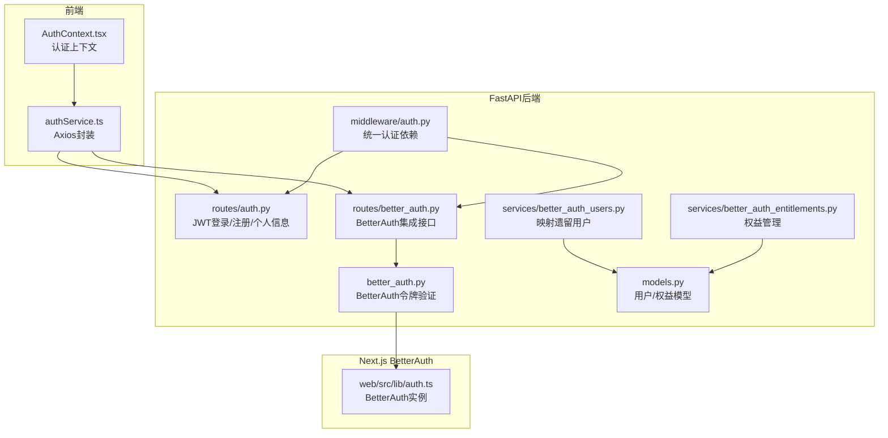
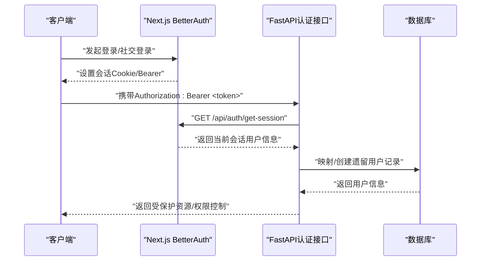
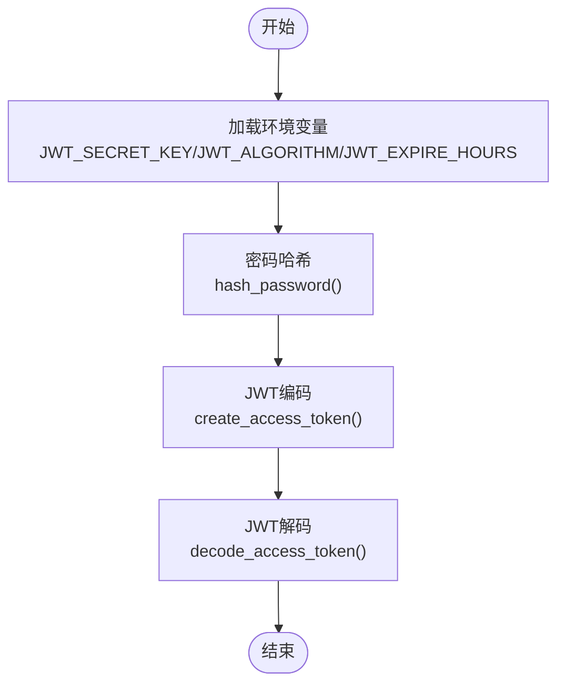
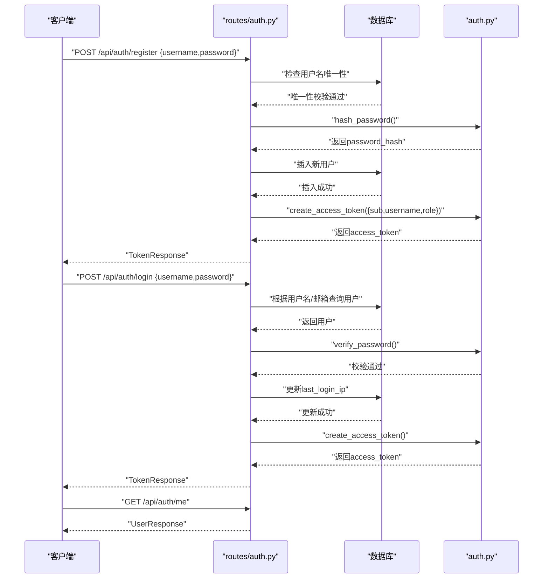
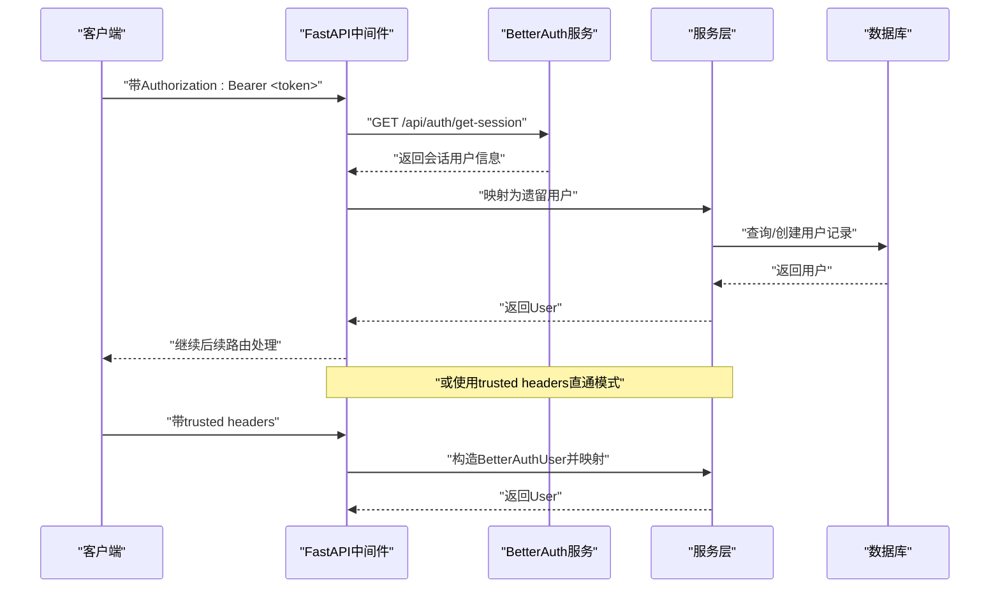
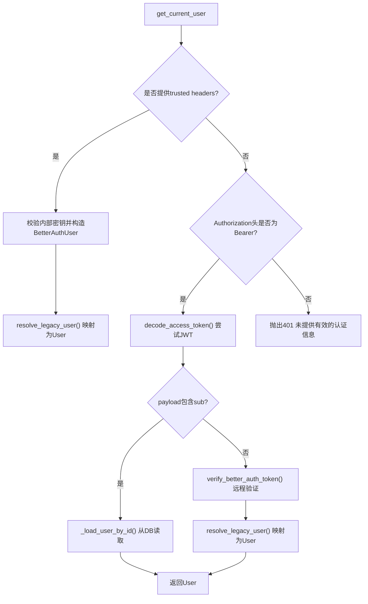
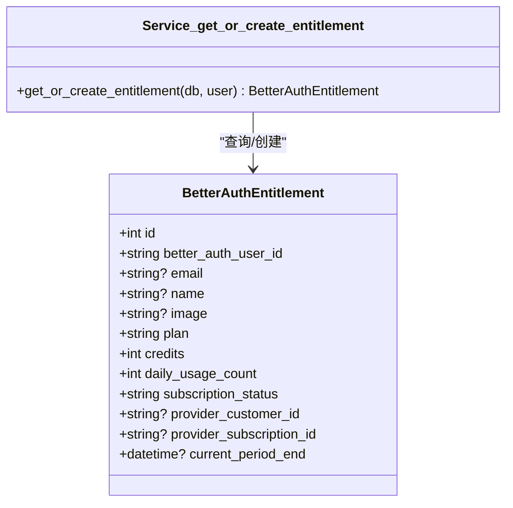
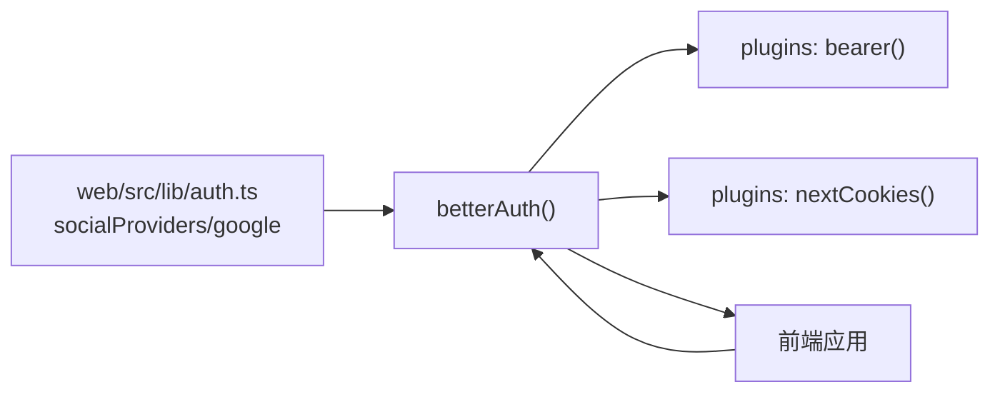
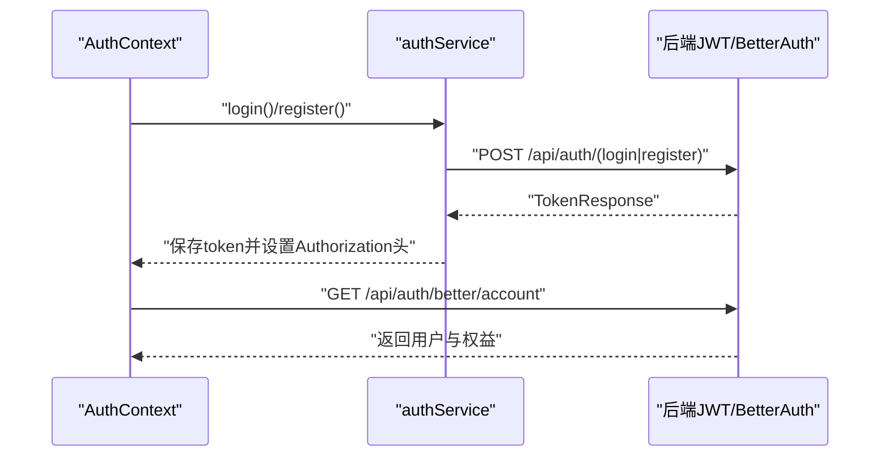
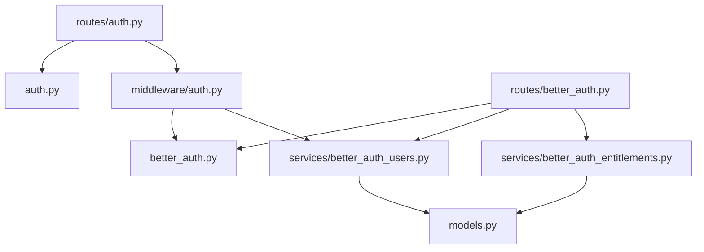

# 用户认证API

<cite>
**本文档引用的文件**
- [backend/auth.py](file://backend/auth.py)
- [backend/better_auth.py](file://backend/better_auth.py)
- [backend/routes/auth.py](file://backend/routes/auth.py)
- [backend/routes/better_auth.py](file://backend/routes/better_auth.py)
- [backend/middleware/auth.py](file://backend/middleware/auth.py)
- [backend/services/better_auth_users.py](file://backend/services/better_auth_users.py)
- [backend/services/better_auth_entitlements.py](file://backend/services/better_auth_entitlements.py)
- [backend/models.py](file://backend/models.py)
- [frontend/src/contexts/AuthContext.tsx](file://frontend/src/contexts/AuthContext.tsx)
- [frontend/src/services/authService.ts](file://frontend/src/services/authService.ts)
- [web/src/lib/auth.ts](file://web/src/lib/auth.ts)
- [auth-stack.env.example](file://auth-stack.env.example)
</cite>

## 目录
1. [简介](#简介)
2. [项目结构](#项目结构)
3. [核心组件](#核心组件)
4. [架构总览](#架构总览)
5. [详细组件分析](#详细组件分析)
6. [依赖关系分析](#依赖关系分析)
7. [性能考虑](#性能考虑)
8. [故障排除指南](#故障排除指南)
9. [结论](#结论)
10. [附录](#附录)

## 简介
本文件系统性梳理 ResumeAgent 的用户认证API，覆盖传统JWT登录注册、BetterAuth集成、会话验证、权限控制、角色管理、商业权益（额度/订阅）以及OAuth社交登录支持。文档同时给出认证头格式、令牌刷新策略、安全最佳实践与常见问题排查方法，帮助开发者与运维人员快速理解与维护认证体系。

## 项目结构
认证相关代码主要分布在以下位置：
- 后端FastAPI认证与中间件：backend/auth.py、backend/routes/auth.py、backend/middleware/auth.py、backend/better_auth.py、backend/routes/better_auth.py、backend/services/better_auth_users.py、backend/services/better_auth_entitlements.py、backend/models.py
- 前端认证上下文与服务：frontend/src/contexts/AuthContext.tsx、frontend/src/services/authService.ts
- Next.js BetterAuth服务端：web/src/lib/auth.ts
- BetterAuth环境配置示例：auth-stack.env.example

**图表来源**
- [frontend/src/contexts/AuthContext.tsx:1-248](file://frontend/src/contexts/AuthContext.tsx#L1-L248)
- [frontend/src/services/authService.ts:1-132](file://frontend/src/services/authService.ts#L1-L132)
- [web/src/lib/auth.ts:1-80](file://web/src/lib/auth.ts#L1-L80)
- [backend/routes/auth.py:1-233](file://backend/routes/auth.py#L1-L233)
- [backend/routes/better_auth.py:1-90](file://backend/routes/better_auth.py#L1-L90)
- [backend/middleware/auth.py:1-191](file://backend/middleware/auth.py#L1-L191)
- [backend/better_auth.py:1-113](file://backend/better_auth.py#L1-L113)
- [backend/services/better_auth_users.py:1-55](file://backend/services/better_auth_users.py#L1-L55)
- [backend/services/better_auth_entitlements.py:1-36](file://backend/services/better_auth_entitlements.py#L1-L36)
- [backend/models.py:111-161](file://backend/models.py#L111-L161)

**章节来源**
- [backend/routes/auth.py:1-233](file://backend/routes/auth.py#L1-L233)
- [backend/routes/better_auth.py:1-90](file://backend/routes/better_auth.py#L1-L90)
- [backend/middleware/auth.py:1-191](file://backend/middleware/auth.py#L1-L191)
- [backend/better_auth.py:1-113](file://backend/better_auth.py#L1-L113)
- [backend/services/better_auth_users.py:1-55](file://backend/services/better_auth_users.py#L1-L55)
- [backend/services/better_auth_entitlements.py:1-36](file://backend/services/better_auth_entitlements.py#L1-L36)
- [backend/models.py:111-161](file://backend/models.py#L111-L161)
- [frontend/src/contexts/AuthContext.tsx:1-248](file://frontend/src/contexts/AuthContext.tsx#L1-L248)
- [frontend/src/services/authService.ts:1-132](file://frontend/src/services/authService.ts#L1-L132)
- [web/src/lib/auth.ts:1-80](file://web/src/lib/auth.ts#L1-L80)
- [auth-stack.env.example:1-6](file://auth-stack.env.example#L1-L6)

## 核心组件
- JWT工具与令牌生成/验证：负责密码哈希、JWT签名算法、过期时间、令牌编码/解码。
- 传统认证路由：提供注册、登录、获取当前用户信息等接口。
- BetterAuth集成：提供健康检查、当前用户、账户详情（含权益）等接口；通过BetterAuth服务验证会话。
- 统一认证中间件：支持trusted headers直通、JWT与BetterAuth令牌三通道获取当前用户，并提供管理员/成员权限门控。
- 用户与权益服务：将BetterAuth用户映射为遗留用户记录；管理商业权益（计划、额度、订阅状态等）。
- 前端认证上下文与服务：处理登录/注册、令牌持久化、错误拦截、登出与额度刷新。

**章节来源**
- [backend/auth.py:1-66](file://backend/auth.py#L1-L66)
- [backend/routes/auth.py:1-233](file://backend/routes/auth.py#L1-L233)
- [backend/routes/better_auth.py:1-90](file://backend/routes/better_auth.py#L1-L90)
- [backend/middleware/auth.py:1-191](file://backend/middleware/auth.py#L1-L191)
- [backend/services/better_auth_users.py:1-55](file://backend/services/better_auth_users.py#L1-L55)
- [backend/services/better_auth_entitlements.py:1-36](file://backend/services/better_auth_entitlements.py#L1-L36)
- [frontend/src/contexts/AuthContext.tsx:1-248](file://frontend/src/contexts/AuthContext.tsx#L1-L248)
- [frontend/src/services/authService.ts:1-132](file://frontend/src/services/authService.ts#L1-L132)

## 架构总览
系统采用“前端Next.js BetterAuth + 后端FastAPI”的双层认证架构：
- 前端通过BetterAuth进行社交登录与邮箱密码登录，获得会话。
- 后端FastAPI通过BetterAuth提供的Bearer令牌或trusted headers进行会话验证，再映射为遗留用户模型，实现统一权限控制与业务逻辑。

**图表来源**
- [web/src/lib/auth.ts:42-77](file://web/src/lib/auth.ts#L42-L77)
- [backend/better_auth.py:65-87](file://backend/better_auth.py#L65-L87)
- [backend/middleware/auth.py:113-145](file://backend/middleware/auth.py#L113-L145)
- [backend/services/better_auth_users.py:33-55](file://backend/services/better_auth_users.py#L33-L55)

## 详细组件分析

### JWT工具与令牌机制
- 密码哈希：使用passlib的CryptContext，优先bcrypt，降级pbkdf2_sha256。
- JWT配置：从环境变量读取密钥、算法与过期小时数，默认HS256、168小时。
- 令牌生成：将sub、username、role等加入payload并签名。
- 令牌验证：解码JWT，捕获JWTError与异常并返回None，避免泄露细节。

**图表来源**
- [backend/auth.py:19-66](file://backend/auth.py#L19-L66)

**章节来源**
- [backend/auth.py:1-66](file://backend/auth.py#L1-L66)

### 传统认证接口（JWT）
- 注册：校验用户名/密码长度，去重，密码哈希，入库，生成JWT返回。
- 登录：支持用户名或邮箱登录，查询用户并校验密码，更新last_login_ip，签发JWT。
- 获取当前用户：依赖get_current_user中间件，实时从数据库读取角色，确保权限最新。

**图表来源**
- [backend/routes/auth.py:46-137](file://backend/routes/auth.py#L46-L137)
- [backend/routes/auth.py:149-226](file://backend/routes/auth.py#L149-L226)
- [backend/routes/auth.py:229-233](file://backend/routes/auth.py#L229-L233)
- [backend/auth.py:32-66](file://backend/auth.py#L32-L66)

**章节来源**
- [backend/routes/auth.py:1-233](file://backend/routes/auth.py#L1-L233)
- [backend/auth.py:1-66](file://backend/auth.py#L1-L66)

### BetterAuth集成与会话验证
- BetterAuth基础URL与内部密钥：支持从多个环境变量读取，提供健康检查接口。
- 令牌提取与验证：从Authorization头提取Bearer token，调用BetterAuth的getSession接口验证。
- 受信任headers路径：当FastAPI内部密钥存在且匹配时，可直接信任来自上游的BetterAuth用户信息，无需远程验证。
- 当前用户与账户详情：提供/user与/account接口，后者附加商业权益信息。

**图表来源**
- [backend/better_auth.py:39-113](file://backend/better_auth.py#L39-L113)
- [backend/middleware/auth.py:89-145](file://backend/middleware/auth.py#L89-L145)
- [backend/routes/better_auth.py:44-89](file://backend/routes/better_auth.py#L44-L89)
- [backend/services/better_auth_users.py:33-55](file://backend/services/better_auth_users.py#L33-L55)

**章节来源**
- [backend/better_auth.py:1-113](file://backend/better_auth.py#L1-L113)
- [backend/routes/better_auth.py:1-90](file://backend/routes/better_auth.py#L1-L90)
- [backend/middleware/auth.py:1-191](file://backend/middleware/auth.py#L1-L191)
- [backend/services/better_auth_users.py:1-55](file://backend/services/better_auth_users.py#L1-L55)

### 权限与角色控制
- 角色字段：User模型包含role字段，默认user；支持admin与member。
- 权限门控：require_admin_only与require_admin_or_member两个依赖，分别限制admin与admin/member访问。
- BetterAuth用户映射：resolve_legacy_user将BetterAuth用户映射为遗留用户，确保权限一致性。

**图表来源**
- [backend/middleware/auth.py:113-191](file://backend/middleware/auth.py#L113-L191)
- [backend/services/better_auth_users.py:33-55](file://backend/services/better_auth_users.py#L33-L55)

**章节来源**
- [backend/middleware/auth.py:176-191](file://backend/middleware/auth.py#L176-L191)
- [backend/services/better_auth_users.py:1-55](file://backend/services/better_auth_users.py#L1-L55)
- [backend/models.py:111-128](file://backend/models.py#L111-L128)

### 商业权益与订阅状态
- 权益模型：BetterAuthEntitlement表记录plan、credits、daily_usage_count、subscription_status、provider信息等。
- 权益服务：get_or_create_entitlement根据BetterAuth用户ID查询或创建权益记录，并在变更时同步更新。
- 接口返回：/api/auth/better/account返回用户与权益组合信息。

**图表来源**
- [backend/models.py:138-161](file://backend/models.py#L138-L161)
- [backend/services/better_auth_entitlements.py:10-36](file://backend/services/better_auth_entitlements.py#L10-L36)

**章节来源**
- [backend/services/better_auth_entitlements.py:1-36](file://backend/services/better_auth_entitlements.py#L1-L36)
- [backend/routes/better_auth.py:68-89](file://backend/routes/better_auth.py#L68-L89)
- [backend/models.py:138-161](file://backend/models.py#L138-L161)

### OAuth与第三方登录
- 社交提供商：Google登录通过socialProviders配置clientId/clientSecret。
- Bearer插件：启用bearer()插件，使前端可直接使用Bearer令牌访问后端。
- Cookie跨子域：在开发环境下可配置cookieDomain，启用跨子域SameSite=None+Secure。

**图表来源**
- [web/src/lib/auth.ts:65-77](file://web/src/lib/auth.ts#L65-L77)

**章节来源**
- [web/src/lib/auth.ts:1-80](file://web/src/lib/auth.ts#L1-L80)

### 前端认证流程与令牌管理
- 登录/注册：调用后端JWT接口，保存access_token与用户信息至localStorage，设置全局Authorization头。
- BetterAuth模式：若启用AuthWeb，则优先使用BetterAuth会话，不走JWT /api/auth/me，避免首屏卡顿。
- 错误处理：拦截401自动清理本地token，登出并重定向。
- 额度刷新：异步拉取用户权益，更新UI。

**图表来源**
- [frontend/src/contexts/AuthContext.tsx:62-239](file://frontend/src/contexts/AuthContext.tsx#L62-L239)
- [frontend/src/services/authService.ts:86-132](file://frontend/src/services/authService.ts#L86-L132)
- [backend/routes/better_auth.py:68-89](file://backend/routes/better_auth.py#L68-L89)

**章节来源**
- [frontend/src/contexts/AuthContext.tsx:1-248](file://frontend/src/contexts/AuthContext.tsx#L1-L248)
- [frontend/src/services/authService.ts:1-132](file://frontend/src/services/authService.ts#L1-L132)

## 依赖关系分析
- 组件耦合
  - routes/auth.py依赖auth.py进行密码哈希与JWT生成。
  - middleware/auth.py是统一入口，被各路由依赖；同时依赖better_auth.py与services。
  - routes/better_auth.py依赖better_auth.py与services，暴露健康检查、当前用户与账户详情。
  - services/better_auth_users.py与services/better_auth_entitlements.py依赖models。
- 外部依赖
  - BetterAuth服务（Next.js）提供会话验证与社交登录。
  - 数据库：用户与权益表。

**图表来源**
- [backend/routes/auth.py:14-17](file://backend/routes/auth.py#L14-L17)
- [backend/middleware/auth.py:19-23](file://backend/middleware/auth.py#L19-L23)
- [backend/routes/better_auth.py:10-17](file://backend/routes/better_auth.py#L10-L17)
- [backend/better_auth.py:10-12](file://backend/better_auth.py#L10-L12)
- [backend/services/better_auth_users.py:7-11](file://backend/services/better_auth_users.py#L7-L11)
- [backend/services/better_auth_entitlements.py:4-7](file://backend/services/better_auth_entitlements.py#L4-L7)
- [backend/models.py:111-161](file://backend/models.py#L111-L161)

**章节来源**
- [backend/routes/auth.py:1-233](file://backend/routes/auth.py#L1-L233)
- [backend/routes/better_auth.py:1-90](file://backend/routes/better_auth.py#L1-L90)
- [backend/middleware/auth.py:1-191](file://backend/middleware/auth.py#L1-L191)
- [backend/better_auth.py:1-113](file://backend/better_auth.py#L1-L113)
- [backend/services/better_auth_users.py:1-55](file://backend/services/better_auth_users.py#L1-L55)
- [backend/services/better_auth_entitlements.py:1-36](file://backend/services/better_auth_entitlements.py#L1-L36)
- [backend/models.py:111-161](file://backend/models.py#L111-L161)

## 性能考虑
- BetterAuth远程验证：verify_better_auth_token使用较短读超时，避免阻塞；建议在网关层做超时与熔断。
- 数据库重试：get_current_user对OperationalError/DisconnectionError等进行有限次重试，提升稳定性。
- 首屏优化：BetterAuth模式下避免调用JWT /api/auth/me，减少首屏等待。
- 密码哈希：bcrypt/pbkdf2_sha256选择，兼顾安全性与性能。

[本节为通用指导，不涉及特定文件分析]

## 故障排除指南
- 401 未提供有效的认证信息：检查Authorization头格式是否为Bearer，或trusted headers是否正确传递。
- 401 BetterAuth session无效或已过期：确认BetterAuth服务可用、令牌未过期、BETTER_AUTH_URL配置正确。
- 503 BetterAuth 服务暂时不可用：检查网络连通性与超时设置。
- 401/403 权限不足：确认用户角色为admin或admin/member，或检查require_*依赖。
- 数据库连接异常：关注middleware/auth.py中的重试与回滚逻辑，必要时扩容连接池。

**章节来源**
- [backend/better_auth.py:39-87](file://backend/better_auth.py#L39-L87)
- [backend/middleware/auth.py:41-86](file://backend/middleware/auth.py#L41-L86)
- [backend/middleware/auth.py:176-191](file://backend/middleware/auth.py#L176-L191)

## 结论
本认证体系通过JWT与BetterAuth双轨并行，既满足传统邮箱密码登录，又支持OAuth社交登录与跨域会话共享。通过统一认证中间件与权限门控，确保了前后端一致的鉴权体验。结合商业权益模型与前端上下文，实现了从登录到功能使用的全链路闭环。

[本节为总结性内容，不涉及特定文件分析]

## 附录

### 认证头格式与令牌刷新
- 认证头格式
  - Authorization: Bearer <access_token>
  - Trusted headers（内部直通）：X-Internal-Auth-Secret、X-Better-Auth-User-ID、X-Better-Auth-User-Email、X-Better-Auth-User-Name、X-Better-Auth-User-Image
- 令牌刷新
  - JWT过期时间由JWT_EXPIRE_HOURS控制，默认168小时；建议在前端定期检测过期并引导重新登录。
  - BetterAuth会话由Next.js BetterAuth管理，前端通过会话API保持登录态。

**章节来源**
- [backend/auth.py:20-22](file://backend/auth.py#L20-L22)
- [backend/better_auth.py:90-113](file://backend/better_auth.py#L90-L113)

### 环境变量与部署要点
- BetterAuth相关
  - BETTER_AUTH_URL：BetterAuth服务地址
  - BETTER_AUTH_SECRET：BetterAuth密钥
  - AUTH_GOOGLE_ID/AUTH_GOOGLE_SECRET：Google OAuth客户端凭据
  - BETTER_AUTH_COOKIE_DOMAIN：跨子域Cookie域名
  - AUTH_PROXY_ALLOWED_ORIGINS：允许的代理来源
- FastAPI相关
  - BETTER_AUTH_INTERNAL_URL/FASTAPI_INTERNAL_AUTH_SECRET：内部直通BetterAuth的地址与密钥
  - JWT_SECRET_KEY/JWT_ALGORITHM/JWT_EXPIRE_HOURS：JWT配置

**章节来源**
- [web/src/lib/auth.ts:42-77](file://web/src/lib/auth.ts#L42-L77)
- [auth-stack.env.example:1-6](file://auth-stack.env.example#L1-L6)
- [backend/auth.py:19-22](file://backend/auth.py#L19-L22)
- [backend/better_auth.py:22-37](file://backend/better_auth.py#L22-L37)