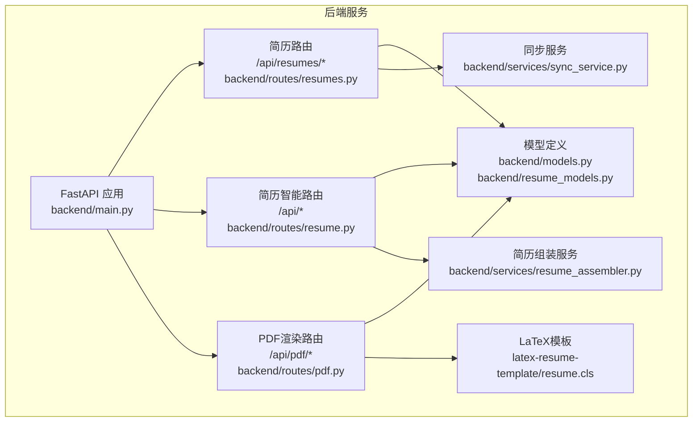
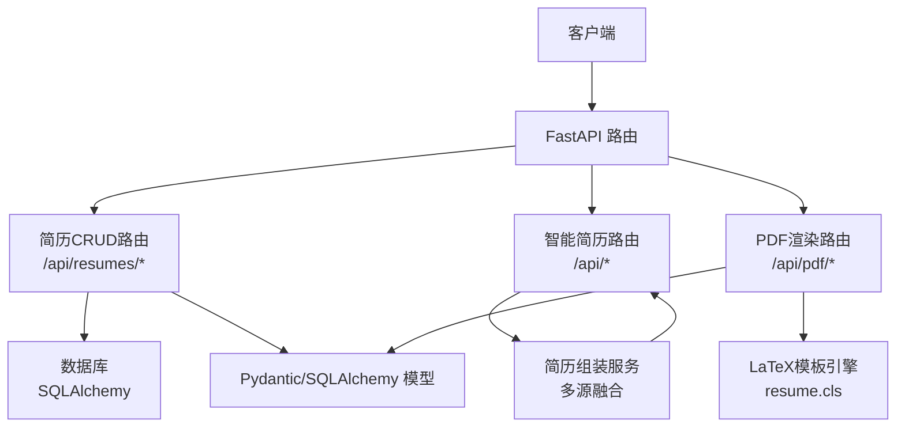
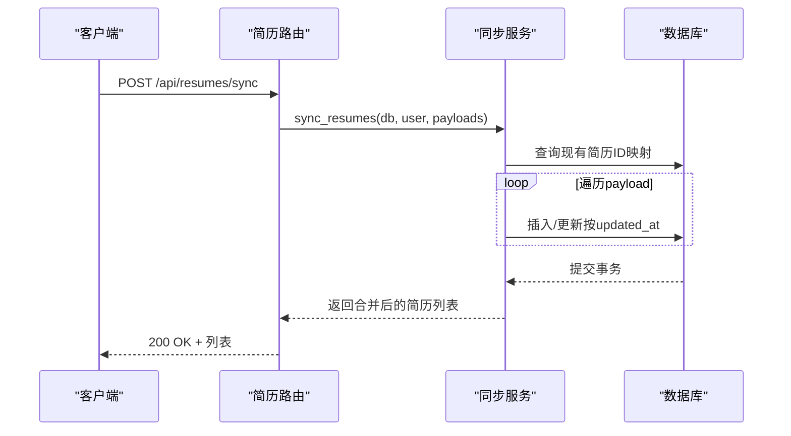
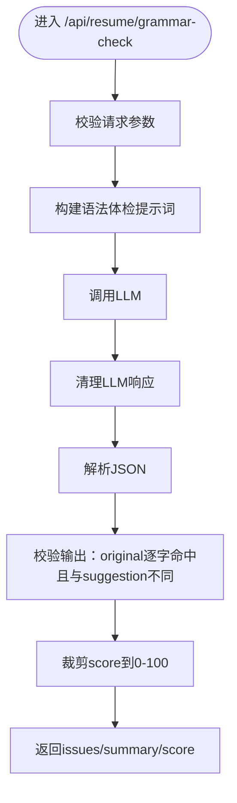
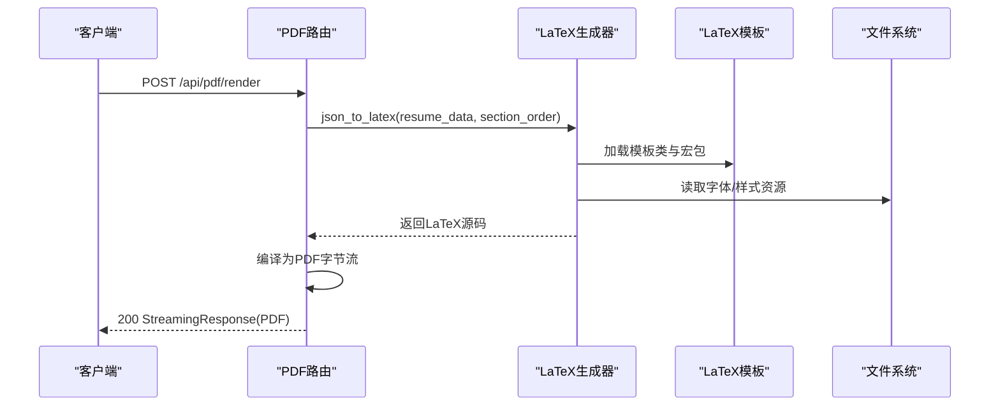
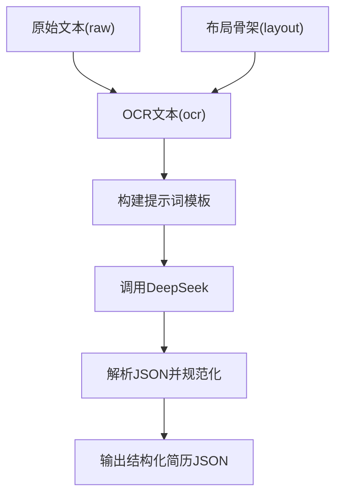
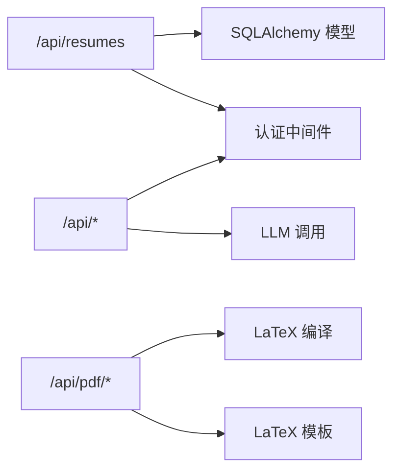

# 简历管理API

<cite>
**本文档引用的文件**
- [backend/main.py](file://backend/main.py)
- [backend/routes/resumes.py](file://backend/routes/resumes.py)
- [backend/routes/resume.py](file://backend/routes/resume.py)
- [backend/routes/pdf.py](file://backend/routes/pdf.py)
- [backend/models.py](file://backend/models.py)
- [backend/resume_models.py](file://backend/resume_models.py)
- [backend/services/resume_assembler.py](file://backend/services/resume_assembler.py)
- [backend/services/sync_service.py](file://backend/services/sync_service.py)
- [backend/prompts_pdf_parser.py](file://backend/prompts_pdf_parser.py)
- [latex-resume-template/resume.cls](file://latex-resume-template/resume.cls)
</cite>

## 目录
1. [简介](#简介)
2. [项目结构](#项目结构)
3. [核心组件](#核心组件)
4. [架构总览](#架构总览)
5. [详细组件分析](#详细组件分析)
6. [依赖关系分析](#依赖关系分析)
7. [性能考虑](#性能考虑)
8. [故障排除指南](#故障排除指南)
9. [结论](#结论)
10. [附录](#附录)

## 简介
本文件面向简历管理API的使用者与维护者，系统性梳理RESTful接口、数据模型、模板系统与数据转换流程。文档覆盖简历的创建、读取、更新、删除，以及导入导出、批量同步、搜索与过滤、模板渲染与PDF生成等能力。同时提供接口调用示例、错误码与状态码说明、字段约束与验证规则，帮助开发者快速集成与扩展。

## 项目结构
后端采用FastAPI框架，路由模块化组织，核心模块包括：
- 路由层：/api/resumes（简历CRUD与批量同步）、/api（简历智能分析与翻译）、/api/pdf（LaTeX渲染与PDF生成）
- 模型层：Pydantic模型定义简历结构与请求/响应格式，SQLAlchemy模型定义数据库表结构
- 服务层：简历组装、同步、PDF配额控制、LaTeX编译等
- 模板层：LaTeX简历模板类与样式定义

**图表来源**
- [backend/main.py:93-138](file://backend/main.py#L93-L138)
- [backend/routes/resumes.py:19](file://backend/routes/resumes.py#L19)
- [backend/routes/resume.py:92](file://backend/routes/resume.py#L92)
- [backend/routes/pdf.py:34](file://backend/routes/pdf.py#L34)

**章节来源**
- [backend/main.py:93-138](file://backend/main.py#L93-L138)
- [backend/routes/resumes.py:19](file://backend/routes/resumes.py#L19)
- [backend/routes/resume.py:92](file://backend/routes/resume.py#L92)
- [backend/routes/pdf.py:34](file://backend/routes/pdf.py#L34)

## 核心组件
- FastAPI应用与路由注册：集中于入口文件，动态注册健康检查、认证、简历、PDF、分享等路由
- 简历路由（/api/resumes）：提供简历列表、详情、创建、更新、删除与批量同步
- 智能简历路由（/api）：提供简历生成、语法检查、翻译、JD优化、关键词融合、通用体检等
- PDF渲染路由（/api/pdf）：提供LaTeX渲染、流式渲染、配额记录与原始LaTeX编译
- 模型定义：Pydantic模型定义请求/响应结构，SQLAlchemy模型定义数据库表结构
- 服务组件：简历组装（多源融合）、同步（冲突解决与合并）、PDF配额控制、LaTeX编译

**章节来源**
- [backend/main.py:93-138](file://backend/main.py#L93-L138)
- [backend/routes/resumes.py:52-262](file://backend/routes/resumes.py#L52-L262)
- [backend/routes/resume.py:795-800](file://backend/routes/resume.py#L795-L800)
- [backend/routes/pdf.py:125-380](file://backend/routes/pdf.py#L125-L380)
- [backend/models.py:40-105](file://backend/models.py#L40-L105)
- [backend/resume_models.py:82-128](file://backend/resume_models.py#L82-L128)

## 架构总览
系统采用“路由-服务-模型-模板”的分层架构。路由负责HTTP协议与参数校验，服务层封装业务逻辑，模型层统一数据结构，模板层负责LaTeX渲染。

**图表来源**
- [backend/main.py:93-138](file://backend/main.py#L93-L138)
- [backend/routes/resumes.py:52-262](file://backend/routes/resumes.py#L52-L262)
- [backend/routes/resume.py:795-800](file://backend/routes/resume.py#L795-L800)
- [backend/routes/pdf.py:125-380](file://backend/routes/pdf.py#L125-L380)
- [latex-resume-template/resume.cls:1-125](file://latex-resume-template/resume.cls#L1-L125)

## 详细组件分析

### 简历存储与批量同步（/api/resumes）
- 接口概览
  - GET /api/resumes：获取当前用户的所有简历，按更新时间倒序
  - GET /api/resumes/{resume_id}：获取单个简历
  - POST /api/resumes：创建简历（支持指定ID与模板类型）
  - PUT /api/resumes/{resume_id}：更新简历（不存在时自动创建，避免前端首次云端保存404）
  - DELETE /api/resumes/{resume_id}：删除简历（级联删除向量嵌入）
  - POST /api/resumes/sync：批量同步（localStorage ↔ 数据库），按updated_at合并
- 数据模型
  - 请求体：ResumePayload（id/name/alias/template_type/data/时间戳）
  - 响应体：ResumeResponse（与请求体字段一致）
- 关键行为
  - 自动提取template_type：若data中存在templateType则使用，否则默认latex
  - 更新时若payload携带template_type，同步写入data["templateType"]
  - 删除时先删除向量嵌入，再删除简历记录
  - 批量同步按updated_at比较决定覆盖或跳过，插入新记录并提交事务

**图表来源**
- [backend/routes/resumes.py:234-262](file://backend/routes/resumes.py#L234-L262)
- [backend/services/sync_service.py:25-87](file://backend/services/sync_service.py#L25-L87)

**章节来源**
- [backend/routes/resumes.py:52-262](file://backend/routes/resumes.py#L52-L262)
- [backend/services/sync_service.py:25-87](file://backend/services/sync_service.py#L25-L87)

### 简历智能分析与优化（/api）
- 接口概览
  - POST /api/resume/rewrite-text/intent：划词改写意图检测（规则+LLM）
  - POST /api/resume/grammar-check：单字段语法/表达体检（issues + 评分）
  - POST /api/resume/jd-optimize：针对JD的多字段优化建议（匹配度、ATS评分、关键词）
  - POST /api/resume/jd-keyword-integrate：将JD缺失关键词自然融入最相关字段
  - POST /api/resume/translate：多字段翻译（HTML标签保留）
  - POST /api/resume/health-check：通用简历体检（维度评分 + 建议）
- 数据模型
  - JdOptimizeField：key/label/content
  - JdOptimizeRequest/JdKeywordIntegrateRequest/TranslateRequest/HealthCheckRequest
  - GrammarCheckRequest/RewriteIntentRequest/ChatStreamRequest
- 关键行为
  - 输出校验：确保original在原文中逐字出现，避免越界替换
  - 评分归一化：0-100区间裁剪
  - 翻译并发：信号量限制并发，逐字段翻译并保持顺序
  - 意图检测：规则优先，LLM兜底，confidence阈值控制

**图表来源**
- [backend/routes/resume.py:362-420](file://backend/routes/resume.py#L362-L420)

**章节来源**
- [backend/routes/resume.py:252-298](file://backend/routes/resume.py#L252-L298)
- [backend/routes/resume.py:362-420](file://backend/routes/resume.py#L362-L420)
- [backend/routes/resume.py:551-613](file://backend/routes/resume.py#L551-L613)
- [backend/routes/resume.py:638-683](file://backend/routes/resume.py#L638-L683)
- [backend/routes/resume.py:685-724](file://backend/routes/resume.py#L685-L724)
- [backend/routes/resume.py:726-792](file://backend/routes/resume.py#L726-L792)

### PDF渲染与模板系统（/api/pdf）
- 接口概览
  - GET /api/pdf/quota：查询PDF下载配额
  - POST /api/pdf/downloads/record：记录一次真实PDF下载（预览/渲染不扣减）
  - POST /api/pdf/render：直接渲染PDF（StreamingResponse）
  - POST /api/pdf/render/stream：流式渲染PDF（SSE事件流）
  - POST /api/pdf/compile-latex：直接编译LaTeX源码为PDF
  - POST /api/pdf/compile-latex/stream：流式编译LaTeX源码为PDF
- 数据模型
  - RenderPDFRequest：resume/section_order/engine/demo
- 模板系统
  - LaTeX模板类：resume.cls，定义字体、边距、标题样式、时间列等
  - 模板目录：latex-resume-template
- 关键行为
  - 配额控制：记录下载次数，限制用户下载频率
  - 流式渲染：事件流逐步返回进度、PDF字节与配额信息
  - 模板渲染：JSON → LaTeX → PDF，支持自定义section_order

**图表来源**
- [backend/routes/pdf.py:125-185](file://backend/routes/pdf.py#L125-L185)
- [latex-resume-template/resume.cls:1-125](file://latex-resume-template/resume.cls#L1-L125)

**章节来源**
- [backend/routes/pdf.py:76-123](file://backend/routes/pdf.py#L76-L123)
- [backend/routes/pdf.py:125-185](file://backend/routes/pdf.py#L125-L185)
- [backend/routes/pdf.py:187-299](file://backend/routes/pdf.py#L187-L299)
- [backend/routes/pdf.py:302-380](file://backend/routes/pdf.py#L302-L380)
- [latex-resume-template/resume.cls:1-125](file://latex-resume-template/resume.cls#L1-L125)

### 简历数据模型与字段约束
- Pydantic模型
  - ResumeGenerateRequest/ResumeGenerateResponse：简历生成请求/响应
  - ResumeJSON：简历JSON结构（name/contact/summary/experience/projects/skills/education/awards）
  - RenderPDFRequest：PDF渲染请求
  - ChatRequest/ChatMessage：聊天请求
  - SectionParseRequest/ResumeParseRequest：模块/整份简历解析请求
- SQLAlchemy模型
  - User/Resume/ResumeEmbedding：用户、简历、向量嵌入
  - APIRequestLog/APIErrorLog/APITraceSpan：日志与追踪
- 字段约束与验证规则
  - provider枚举：zhipu/doubao/deepseek
  - locale枚举：zh/en
  - JSON字段：使用JSON类型存储完整简历数据，支持灵活扩展
  - template_type：html/latex，默认latex
  - updated_at：用于批量同步的冲突解决

**章节来源**
- [backend/models.py:40-105](file://backend/models.py#L40-L105)
- [backend/models.py:163-182](file://backend/models.py#L163-L182)
- [backend/models.py:310-330](file://backend/models.py#L310-L330)
- [backend/resume_models.py:82-128](file://backend/resume_models.py#L82-L128)

### 简历导入与数据转换（多源融合）
- 组件：resume_assembler
- 数据流
  - MinerU：PDF → Markdown（基础文本结构）
  - glm-ocr：PDF → Markdown（高质量 OCR + 结构识别）
  - DeepSeek：融合两路数据 → 结构化JSON
- 规则与模板
  - OUTPUT_SCHEMA：标准输出模式
  - DATA_FUSION_RULES：数据融合优先级与去重
  - SECTION_MAPPING_RULES：模块归属与类型映射
  - HIGHLIGHTS_RULES：highlights/items数组格式
  - NESTED_RULES：嵌套分组结构
  - SKILLS_RULES：技能模块格式
  - FORMAT_RULES：格式保留（list_style、has_category等）

**图表来源**
- [backend/services/resume_assembler.py:280-388](file://backend/services/resume_assembler.py#L280-L388)
- [backend/prompts_pdf_parser.py:15-107](file://backend/prompts_pdf_parser.py#L15-L107)

**章节来源**
- [backend/services/resume_assembler.py:280-388](file://backend/services/resume_assembler.py#L280-L388)
- [backend/prompts_pdf_parser.py:15-107](file://backend/prompts_pdf_parser.py#L15-L107)

## 依赖关系分析
- 路由依赖：/api/resumes依赖数据库与认证中间件；/api依赖LLM与解析服务；/api/pdf依赖LaTeX编译与模板
- 模型耦合：Resume与User一对多关系，Cascade删除；ResumeEmbedding与Resume/用户关联
- 外部依赖：LLM提供商（zhipu/doubao/deepseek）、LaTeX编译器、PDF配额服务

**图表来源**
- [backend/routes/resumes.py:14-18](file://backend/routes/resumes.py#L14-L18)
- [backend/routes/resume.py:18-48](file://backend/routes/resume.py#L18-L48)
- [backend/routes/pdf.py:15-32](file://backend/routes/pdf.py#L15-L32)

**章节来源**
- [backend/routes/resumes.py:14-18](file://backend/routes/resumes.py#L14-L18)
- [backend/routes/resume.py:18-48](file://backend/routes/resume.py#L18-L48)
- [backend/routes/pdf.py:15-32](file://backend/routes/pdf.py#L15-L32)

## 性能考虑
- 批量同步：按updated_at合并，避免无谓覆盖；插入/更新后一次性提交
- 翻译并发：信号量限制并发度，逐字段翻译并保持顺序
- 流式渲染：SSE事件流逐步返回进度与结果，降低首屏等待
- 启动预热：数据库连接、tiktoken编码文件预加载，减少首次请求延迟
- 模板渲染：LaTeX编译在独立线程池执行，避免阻塞主线程

[本节为通用指导，无需特定文件引用]

## 故障排除指南
- 常见HTTP状态码
  - 200：成功
  - 400：请求参数无效（如text为空、fields为空）
  - 404：简历不存在
  - 409：ID冲突（更新时ID已被他人占用）
  - 500：服务器内部错误（LLM调用失败、解析JSON失败、LaTeX编译错误）
- 错误处理要点
  - 语法体检：校验original逐字命中，避免越界替换
  - JD优化：校验建议的original在对应字段内容中存在
  - 翻译：全部失败才视为接口错误，部分成功正常返回
  - 删除：捕获SQLAlchemy异常并回滚事务
- 日志与追踪
  - PDF渲染：打印trace_id、耗时、字节数、剩余配额
  - 同步：打印合并统计（插入/更新/跳过/总数）

**章节来源**
- [backend/routes/resume.py:362-420](file://backend/routes/resume.py#L362-L420)
- [backend/routes/resume.py:551-613](file://backend/routes/resume.py#L551-L613)
- [backend/routes/resume.py:685-724](file://backend/routes/resume.py#L685-L724)
- [backend/routes/resumes.py:228-232](file://backend/routes/resumes.py#L228-L232)
- [backend/routes/pdf.py:145-184](file://backend/routes/pdf.py#L145-L184)

## 结论
本API围绕“简历数据模型 + 智能分析 + 模板渲染”三大能力构建，提供完整的CRUD、批量同步、导入导出、搜索与过滤、翻译与优化、PDF生成等接口。通过严格的输出校验、并发控制与流式渲染，兼顾易用性与性能。建议在生产环境中结合配额控制与可观测性日志，持续优化用户体验与系统稳定性。

[本节为总结性内容，无需特定文件引用]

## 附录

### 接口清单与示例（路径与说明）
- 简历存储与同步
  - GET /api/resumes：返回当前用户简历列表
  - GET /api/resumes/{resume_id}：返回指定简历详情
  - POST /api/resumes：创建简历（支持id/name/alias/template_type/data）
  - PUT /api/resumes/{resume_id}：更新简历（不存在时自动创建）
  - DELETE /api/resumes/{resume_id}：删除简历
  - POST /api/resumes/sync：批量同步（本地↔数据库）
- 智能分析与优化
  - POST /api/resume/rewrite-text/intent：意图检测
  - POST /api/resume/grammar-check：语法体检
  - POST /api/resume/jd-optimize：JD优化建议
  - POST /api/resume/jd-keyword-integrate：关键词融入
  - POST /api/resume/translate：多字段翻译
  - POST /api/resume/health-check：通用体检
- PDF渲染
  - GET /api/pdf/quota：查询配额
  - POST /api/pdf/downloads/record：记录下载
  - POST /api/pdf/render：渲染PDF
  - POST /api/pdf/render/stream：流式渲染PDF
  - POST /api/pdf/compile-latex：编译LaTeX源码
  - POST /api/pdf/compile-latex/stream：流式编译LaTeX源码

**章节来源**
- [backend/routes/resumes.py:52-262](file://backend/routes/resumes.py#L52-L262)
- [backend/routes/resume.py:252-298](file://backend/routes/resume.py#L252-L298)
- [backend/routes/resume.py:362-420](file://backend/routes/resume.py#L362-L420)
- [backend/routes/resume.py:551-613](file://backend/routes/resume.py#L551-L613)
- [backend/routes/resume.py:638-683](file://backend/routes/resume.py#L638-L683)
- [backend/routes/resume.py:685-724](file://backend/routes/resume.py#L685-L724)
- [backend/routes/resume.py:726-792](file://backend/routes/resume.py#L726-L792)
- [backend/routes/pdf.py:76-123](file://backend/routes/pdf.py#L76-L123)
- [backend/routes/pdf.py:125-185](file://backend/routes/pdf.py#L125-L185)
- [backend/routes/pdf.py:187-299](file://backend/routes/pdf.py#L187-L299)
- [backend/routes/pdf.py:302-380](file://backend/routes/pdf.py#L302-L380)

### 字段映射与数据转换
- 模板类型映射：data.templateType → template_type
- 模块归属：experience → internships；openSource ≠ projects
- highlights/items：数组化、禁止拼接为单字符串
- 技能分类：skills数组每项为{category, details}，禁止放入项目描述
- 格式保留：format字段记录list_style、has_category等

**章节来源**
- [backend/services/resume_assembler.py:146-182](file://backend/services/resume_assembler.py#L146-L182)
- [backend/prompts_pdf_parser.py:43-84](file://backend/prompts_pdf_parser.py#L43-L84)