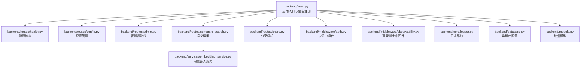
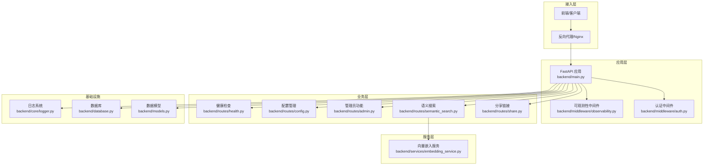
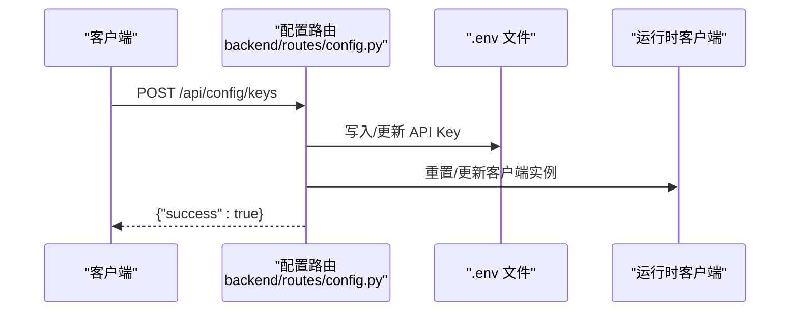
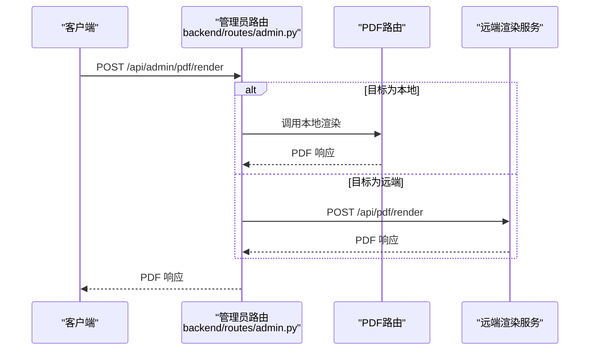
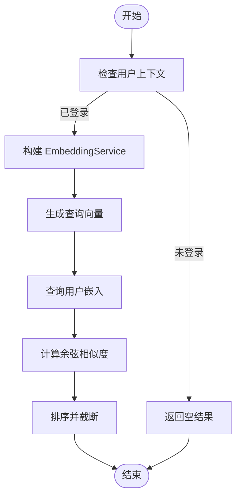
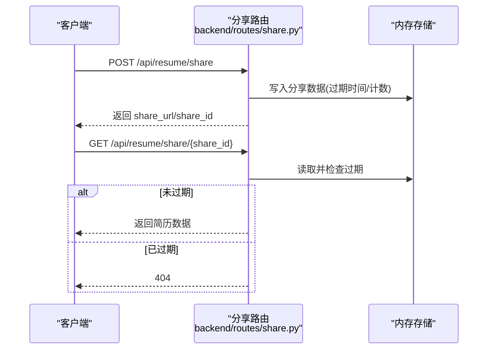
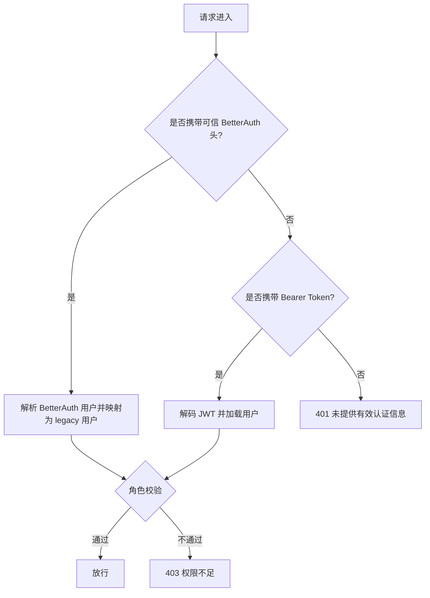
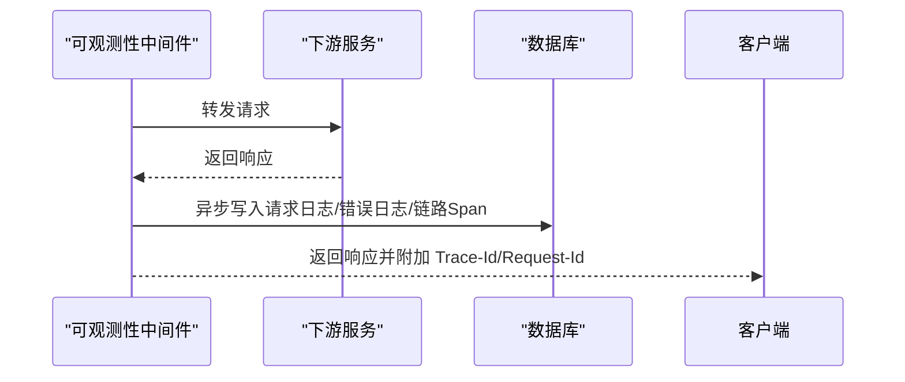
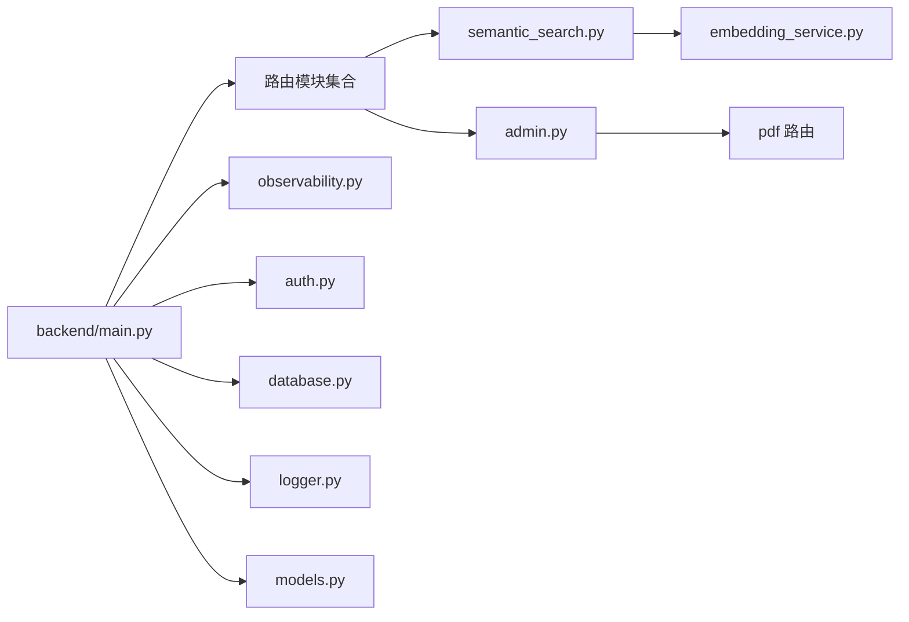

# 系统管理API

<cite>
**本文档引用的文件**
- [backend/main.py](file://backend/main.py)
- [backend/routes/admin.py](file://backend/routes/admin.py)
- [backend/routes/health.py](file://backend/routes/health.py)
- [backend/routes/config.py](file://backend/routes/config.py)
- [backend/routes/semantic_search.py](file://backend/routes/semantic_search.py)
- [backend/routes/share.py](file://backend/routes/share.py)
- [backend/middleware/auth.py](file://backend/middleware/auth.py)
- [backend/middleware/observability.py](file://backend/middleware/observability.py)
- [backend/core/logger.py](file://backend/core/logger.py)
- [backend/database.py](file://backend/database.py)
- [backend/models.py](file://backend/models.py)
- [backend/services/embedding_service.py](file://backend/services/embedding_service.py)
</cite>

## 目录
1. [简介](#简介)
2. [项目结构](#项目结构)
3. [核心组件](#核心组件)
4. [架构概览](#架构概览)
5. [详细组件分析](#详细组件分析)
6. [依赖关系分析](#依赖关系分析)
7. [性能考虑](#性能考虑)
8. [故障排查指南](#故障排查指南)
9. [结论](#结论)

## 简介
本文件系统性梳理 ResumeAgent 项目的“系统管理API”，覆盖以下能力域：
- 健康检查接口：快速判断服务可用性
- 配置管理接口：API Key 管理、提示词模板管理、AI 服务连通性测试
- 管理员功能接口：PDF 渲染代理、用户统计、渲染模式变更审计
- 语义搜索接口：基于向量嵌入的简历内容检索与嵌入生成
- 分享链接接口：简历分享链接的创建、查询、删除与列表
- 权限控制机制：基于 BetterAuth/JWT 的统一认证与角色授权
- 系统状态监控：可观测性中间件、审计日志、性能指标
- 运维工具集成：日志系统、数据库连接池、启动时预热

## 项目结构
后端采用 FastAPI 模块化路由组织，入口文件集中注册各子路由，并通过中间件实现统一鉴权与可观测性。

**图表来源**
- [backend/main.py:92-138](file://backend/main.py#L92-L138)
- [backend/routes/health.py:6-12](file://backend/routes/health.py#L6-L12)
- [backend/routes/config.py:34-308](file://backend/routes/config.py#L34-L308)
- [backend/routes/admin.py:21-258](file://backend/routes/admin.py#L21-L258)
- [backend/routes/semantic_search.py:13-141](file://backend/routes/semantic_search.py#L13-L141)
- [backend/routes/share.py:15-134](file://backend/routes/share.py#L15-L134)
- [backend/middleware/auth.py:176-191](file://backend/middleware/auth.py#L176-L191)
- [backend/middleware/observability.py:170-191](file://backend/middleware/observability.py#L170-L191)
- [backend/core/logger.py:184-251](file://backend/core/logger.py#L184-L251)
- [backend/database.py:69-137](file://backend/database.py#L69-L137)
- [backend/models.py:111-200](file://backend/models.py#L111-L200)
- [backend/services/embedding_service.py:15-294](file://backend/services/embedding_service.py#L15-L294)

**章节来源**
- [backend/main.py:92-138](file://backend/main.py#L92-L138)

## 核心组件
- 应用入口与路由注册：集中注册健康检查、配置、管理员、语义搜索、分享等路由，并挂载可观测性中间件
- 认证中间件：支持 BetterAuth 令牌与传统 JWT，提供管理员/成员权限校验
- 可观测性中间件：统一记录请求/错误日志、链路追踪、异步落库
- 日志系统：支持生产/开发双模式、敏感信息脱敏、分类日志文件
- 数据库配置：支持 MySQL/PostgreSQL/SQLite，连接池参数可调
- 向量嵌入服务：OpenAI 兼容接口生成嵌入，支持简历内容分段聚合

**章节来源**
- [backend/main.py:54-104](file://backend/main.py#L54-L104)
- [backend/middleware/auth.py:176-191](file://backend/middleware/auth.py#L176-L191)
- [backend/middleware/observability.py:19-77](file://backend/middleware/observability.py#L19-L77)
- [backend/core/logger.py:92-182](file://backend/core/logger.py#L92-L182)
- [backend/database.py:69-112](file://backend/database.py#L69-L112)
- [backend/services/embedding_service.py:15-35](file://backend/services/embedding_service.py#L15-L35)

## 架构概览
系统管理API围绕“统一入口 + 中间件 + 路由模块 + 服务层”的分层设计：

**图表来源**
- [backend/main.py:92-138](file://backend/main.py#L92-L138)
- [backend/middleware/observability.py:170-191](file://backend/middleware/observability.py#L170-L191)
- [backend/middleware/auth.py:113-146](file://backend/middleware/auth.py#L113-L146)
- [backend/routes/health.py:6-12](file://backend/routes/health.py#L6-L12)
- [backend/routes/config.py:34-308](file://backend/routes/config.py#L34-L308)
- [backend/routes/admin.py:21-258](file://backend/routes/admin.py#L21-L258)
- [backend/routes/semantic_search.py:13-141](file://backend/routes/semantic_search.py#L13-L141)
- [backend/routes/share.py:15-134](file://backend/routes/share.py#L15-L134)
- [backend/services/embedding_service.py:15-294](file://backend/services/embedding_service.py#L15-L294)
- [backend/core/logger.py:184-251](file://backend/core/logger.py#L184-L251)
- [backend/database.py:69-137](file://backend/database.py#L69-L137)
- [backend/models.py:111-200](file://backend/models.py#L111-L200)

## 详细组件分析

### 健康检查接口
- 路由：GET /api/health
- 功能：返回服务可用性状态
- 适用场景：容器探针、负载均衡健康检查
- 安全性：无需认证
- 性能：常驻内存，无数据库/外部依赖

**章节来源**
- [backend/routes/health.py:9-12](file://backend/routes/health.py#L9-L12)

### 配置管理接口
- 路由前缀：/api
- 主要接口
  - GET /ai/config：获取当前 AI 配置
  - GET /config/keys：查询 API Key 配置状态（不返回完整密钥）
  - POST /config/keys：保存 API Key 到 .env 并更新运行时客户端
  - GET /config/prompts：获取提示词模板注册表与模板内容
  - PUT /config/prompts：保存提示词模板
  - GET /ai/test-keys：检测各 Provider Key 可用性（最小代价调用）
  - POST /ai/test：测试指定 Provider 的可用性
  - POST /chat：通用聊天接口，支持默认 Provider 选择
- 权限控制：除 AI 配置外，均需管理员或成员权限
- 安全性：Key 写入 .env，读取时进行长度校验；运行时客户端实例重置以生效新 Key
- 可靠性：.env 读写失败回退至环境变量；Key 变更后立即生效

**图表来源**
- [backend/routes/config.py:104-174](file://backend/routes/config.py#L104-L174)

**章节来源**
- [backend/routes/config.py:45-308](file://backend/routes/config.py#L45-L308)

### 管理员功能接口
- 路由前缀：/api/admin
- 主要接口
  - GET /stats/users：统计总用户数
  - POST /pdf/render-mode/log：记录 PDF 渲染模式变更（审计日志）
  - POST /pdf/render：远程 PDF 渲染代理（支持本地自返与远端转发）
  - POST /pdf/render/stream：远程 PDF 渲染流式代理（SSE 包装）
- 权限控制：仅管理员可访问
- 安全性：支持透传 Authorization/X-PDF-* 等头；可配置远端渲染 Token
- 可靠性：自检逻辑避免环路代理；远端超时与错误包装；SSE 流式事件

**图表来源**
- [backend/routes/admin.py:217-258](file://backend/routes/admin.py#L217-L258)
- [backend/routes/admin.py:102-214](file://backend/routes/admin.py#L102-L214)

**章节来源**
- [backend/routes/admin.py:30-38](file://backend/routes/admin.py#L30-L38)
- [backend/routes/admin.py:41-56](file://backend/routes/admin.py#L41-L56)
- [backend/routes/admin.py:217-258](file://backend/routes/admin.py#L217-L258)

### 语义搜索接口
- 路由前缀：/api/search
- 主要接口
  - POST /semantic：语义搜索简历内容（基于向量相似度）
  - POST /embeddings/generate/{resume_id}：为指定简历生成向量嵌入
  - GET /embeddings/status/{resume_id}：查询嵌入状态与类型分布
- 权限控制：需登录用户上下文
- 数据模型：ResumeEmbedding（向量、元数据、内容类型）
- 依赖：OpenAI 兼容 API、pgvector（PostgreSQL）

**图表来源**
- [backend/routes/semantic_search.py:33-69](file://backend/routes/semantic_search.py#L33-L69)
- [backend/routes/semantic_search.py:72-101](file://backend/routes/semantic_search.py#L72-L101)
- [backend/routes/semantic_search.py:104-141](file://backend/routes/semantic_search.py#L104-L141)
- [backend/services/embedding_service.py:196-267](file://backend/services/embedding_service.py#L196-L267)

**章节来源**
- [backend/routes/semantic_search.py:16-69](file://backend/routes/semantic_search.py#L16-L69)
- [backend/routes/semantic_search.py:72-141](file://backend/routes/semantic_search.py#L72-L141)
- [backend/services/embedding_service.py:15-294](file://backend/services/embedding_service.py#L15-L294)

### 分享链接接口
- 路由前缀：/api/resume
- 主要接口
  - POST /share：生成分享链接（内存存储，生产建议持久化）
  - GET /share/{share_id}：获取分享内容（含过期检查与访问计数）
  - DELETE /share/{share_id}：删除分享链接
  - GET /shares：列出所有分享链接（含过期状态）
- 配置：FRONTEND_URL 环境变量决定分享链接域名
- 安全性：过期时间控制、访问计数审计

**图表来源**
- [backend/routes/share.py:39-104](file://backend/routes/share.py#L39-L104)
- [backend/routes/share.py:117-134](file://backend/routes/share.py#L117-L134)

**章节来源**
- [backend/routes/share.py:25-104](file://backend/routes/share.py#L25-L104)
- [backend/routes/share.py:117-134](file://backend/routes/share.py#L117-L134)

### 权限控制机制
- 认证来源：trusted headers（BetterAuth）、Bearer JWT、BetterAuth Token
- 权限级别：require_admin_only（仅管理员）、require_admin_or_member（管理员/成员）
- 用户加载：带重试与连接异常处理，避免鉴权失败导致服务不可用
- 适配：支持内部可信调用与外部 BetterAuth 令牌混合模式

**图表来源**
- [backend/middleware/auth.py:113-191](file://backend/middleware/auth.py#L113-L191)

**章节来源**
- [backend/middleware/auth.py:113-191](file://backend/middleware/auth.py#L113-L191)

### 系统状态监控与审计
- 可观测性中间件：记录请求/响应、耗时、状态码、用户ID、IP、UA、大小等
- 错误日志：捕获异常并异步落库，避免阻塞主流程
- 链路追踪：为业务 API 生成 Span，便于问题定位
- 日志系统：生产模式结构化输出，开发模式彩色格式；支持敏感信息脱敏与分类日志文件

**图表来源**
- [backend/middleware/observability.py:19-77](file://backend/middleware/observability.py#L19-L77)
- [backend/middleware/observability.py:79-151](file://backend/middleware/observability.py#L79-L151)

**章节来源**
- [backend/middleware/observability.py:19-191](file://backend/middleware/observability.py#L19-L191)
- [backend/core/logger.py:92-182](file://backend/core/logger.py#L92-L182)

## 依赖关系分析
- 路由依赖：入口文件集中导入并注册各路由模块
- 中间件依赖：认证与可观测性中间件在应用层统一挂载
- 服务依赖：语义搜索依赖向量嵌入服务与数据库；管理员 PDF 代理依赖 httpx
- 数据依赖：数据库连接池参数可配置；模型定义统一于 models.py

**图表来源**
- [backend/main.py:74-89](file://backend/main.py#L74-L89)
- [backend/routes/semantic_search.py:13-141](file://backend/routes/semantic_search.py#L13-L141)
- [backend/services/embedding_service.py:15-294](file://backend/services/embedding_service.py#L15-L294)
- [backend/routes/admin.py:21-258](file://backend/routes/admin.py#L21-L258)
- [backend/database.py:69-137](file://backend/database.py#L69-L137)
- [backend/core/logger.py:184-251](file://backend/core/logger.py#L184-L251)
- [backend/models.py:111-200](file://backend/models.py#L111-L200)

**章节来源**
- [backend/main.py:74-89](file://backend/main.py#L74-L89)
- [backend/database.py:69-137](file://backend/database.py#L69-L137)

## 性能考虑
- 启动时预热
  - HTTP 连接预热：减少首次请求延迟
  - 数据库连接预热：避免仪表盘首开卡顿
  - tiktoken 编码文件预加载：避免首次使用阻塞
- 数据库连接池
  - 可配置 pool_pre_ping、pool_recycle、pool_size、max_overflow、pool_timeout
  - PostgreSQL 支持连接超时回退策略
- 可观测性异步落库
  - 请求/错误日志异步写入，降低尾延迟
- 语义搜索
  - 向量生成成本较高，建议按需触发；提供状态查询接口
  - 建议结合数据库向量扩展（如 pgvector）实现原生相似度计算

**章节来源**
- [backend/main.py:228-315](file://backend/main.py#L228-L315)
- [backend/database.py:72-112](file://backend/database.py#L72-L112)
- [backend/middleware/observability.py:43-57](file://backend/middleware/observability.py#L43-L57)
- [backend/services/embedding_service.py:36-57](file://backend/services/embedding_service.py#L36-L57)

## 故障排查指南
- 健康检查失败
  - 检查 /api/health 是否返回 {"status": "ok"}
  - 关注可观测性中间件日志与异常处理器输出
- 认证失败
  - 确认请求头包含正确的 Authorization/BetterAuth 头
  - 核对角色权限：管理员/成员
- 配置管理失败
  - .env 写入失败时回退到环境变量
  - Key 变更后需重启或等待运行时客户端重置生效
- 语义搜索异常
  - 确认 OPENAI_API_KEY 与 base_url 配置
  - 检查简历嵌入是否已生成且状态正常
- 分享链接异常
  - 检查 FRONTEND_URL 配置
  - 过期时间与访问计数是否符合预期
- PDF 渲染代理
  - 检查 REMOTE_PDF_RENDER_BASE_URL 与 TOKEN
  - 关注远端服务可用性与超时设置

**章节来源**
- [backend/routes/health.py:9-12](file://backend/routes/health.py#L9-L12)
- [backend/middleware/auth.py:176-191](file://backend/middleware/auth.py#L176-L191)
- [backend/routes/config.py:104-174](file://backend/routes/config.py#L104-L174)
- [backend/routes/semantic_search.py:72-101](file://backend/routes/semantic_search.py#L72-L101)
- [backend/routes/share.py:39-104](file://backend/routes/share.py#L39-L104)
- [backend/routes/admin.py:59-86](file://backend/routes/admin.py#L59-L86)

## 结论
本系统管理API以 FastAPI 为核心，结合统一认证、可观测性与日志体系，提供了从健康检查、配置管理、管理员功能、语义搜索到分享链接的完整能力闭环。通过启动时预热、连接池配置与异步落库等手段，兼顾了性能与可靠性。建议在生产环境中：
- 使用数据库向量扩展替代纯内存相似度计算
- 将分享链接存储迁移至持久化存储
- 配置完善的告警与审计日志策略
- 对外部依赖（远端渲染服务、OpenAI）设置合理的超时与熔断