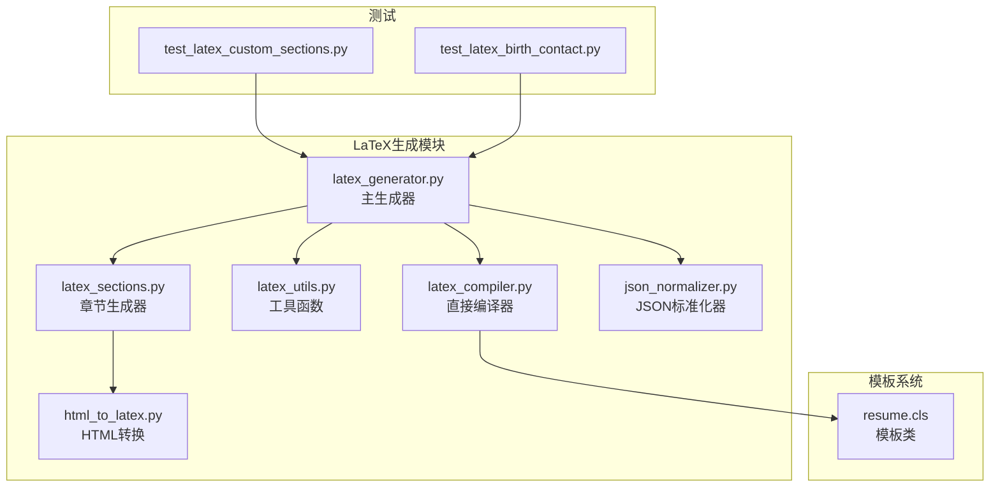
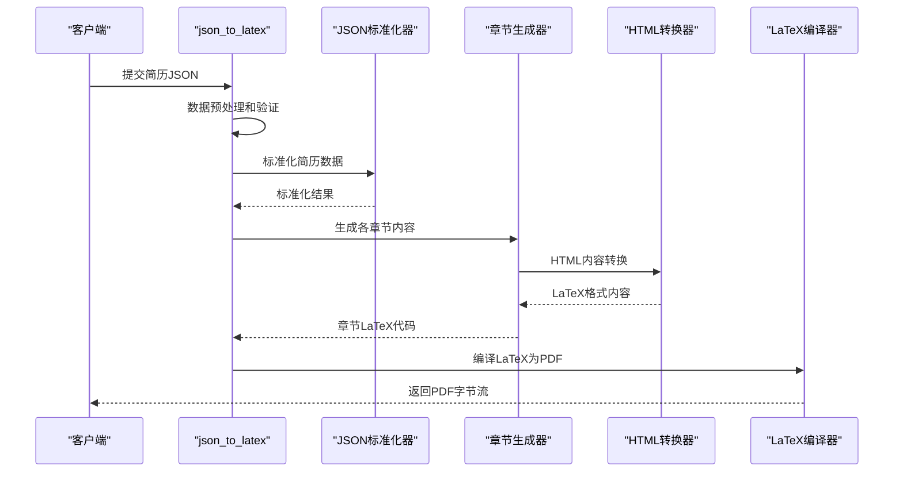
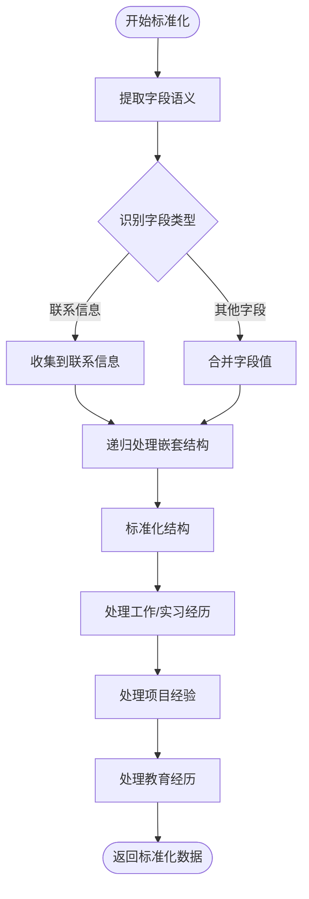
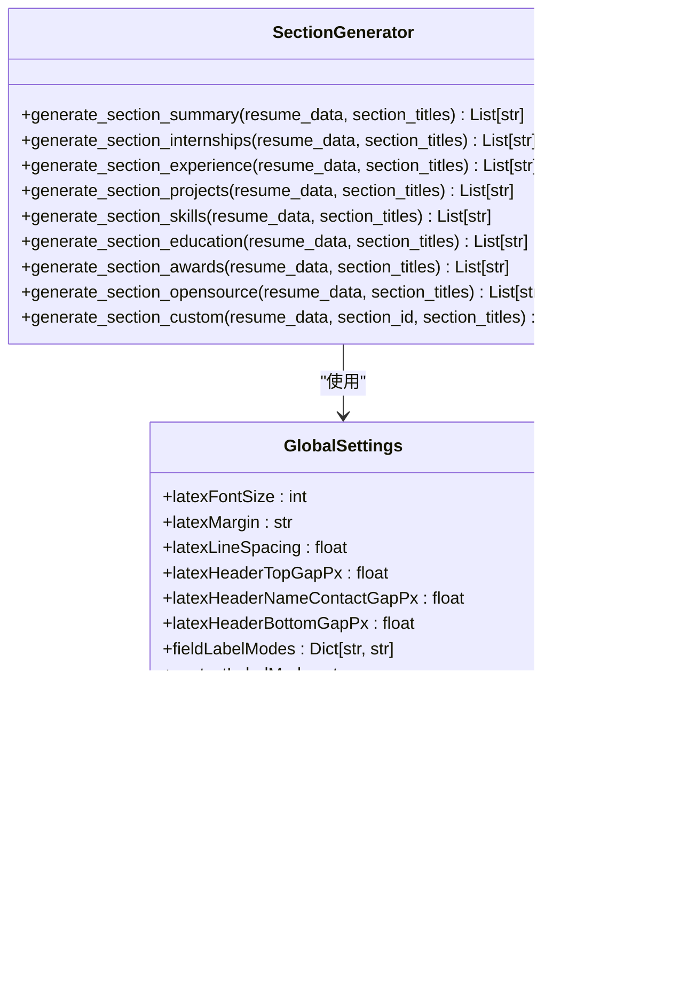
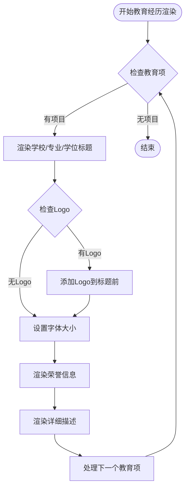
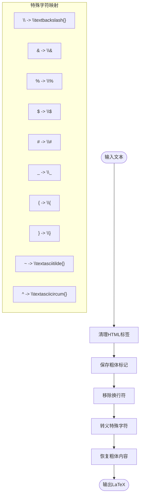
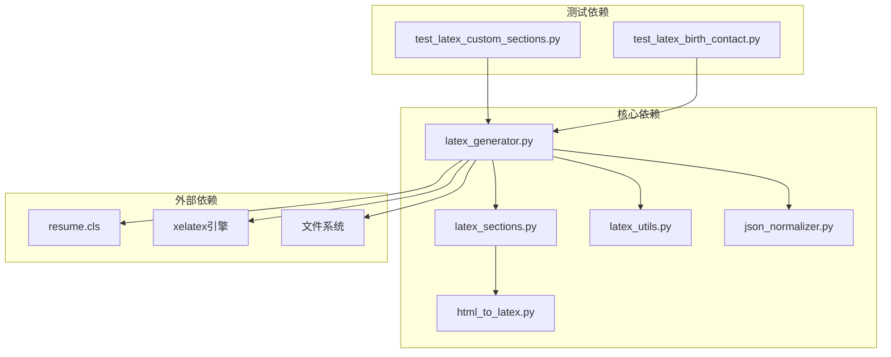

# LaTeX代码生成

<cite>
**本文档引用的文件**
- [backend/latex_generator.py](file://backend/latex_generator.py)
- [backend/latex_sections.py](file://backend/latex_sections.py)
- [backend/latex_utils.py](file://backend/latex_utils.py)
- [backend/html_to_latex.py](file://backend/html_to_latex.py)
- [backend/latex_compiler.py](file://backend/latex_compiler.py)
- [backend/json_normalizer.py](file://backend/json_normalizer.py)
- [latex-resume-template/resume.cls](file://latex-resume-template/resume.cls)
- [backend/tests/test_latex_custom_sections.py](file://backend/tests/test_latex_custom_sections.py)
- [backend/tests/test_latex_birth_contact.py](file://backend/tests/test_latex_birth_contact.py)
</cite>

## 目录
1. [简介](#简介)
2. [项目结构](#项目结构)
3. [核心组件](#核心组件)
4. [架构概览](#架构概览)
5. [详细组件分析](#详细组件分析)
6. [依赖关系分析](#依赖关系分析)
7. [性能考虑](#性能考虑)
8. [故障排除指南](#故障排除指南)
9. [结论](#结论)
10. [附录](#附录)

## 简介
本文件面向LaTeX代码生成模块的技术文档，深入解释从JSON到LaTeX的转换逻辑、数据预处理流程和模板渲染机制。文档涵盖简历数据标准化、字段映射规则、特殊字符转义和格式化处理，以及自定义模块生成、全局设置处理和布局参数计算。同时提供错误处理机制、数据验证规则和性能优化策略，并给出代码生成器扩展指南和调试技巧。

## 项目结构
LaTeX代码生成模块由多个协同工作的组件构成，主要文件分布如下：
- 生成器核心：backend/latex_generator.py
- 模块化章节生成：backend/latex_sections.py
- LaTeX工具函数：backend/latex_utils.py
- HTML到LaTeX转换：backend/html_to_latex.py
- 直接编译器：backend/latex_compiler.py
- JSON标准化器：backend/json_normalizer.py
- 模板类定义：latex-resume-template/resume.cls
- 测试用例：backend/tests/...



**图表来源**
- [backend/latex_generator.py:1-676](file://backend/latex_generator.py#L1-L676)
- [backend/latex_sections.py:1-879](file://backend/latex_sections.py#L1-L879)
- [backend/latex_utils.py:1-252](file://backend/latex_utils.py#L1-L252)
- [backend/html_to_latex.py:1-305](file://backend/html_to_latex.py#L1-L305)
- [backend/latex_compiler.py:1-131](file://backend/latex_compiler.py#L1-L131)
- [latex-resume-template/resume.cls:1-125](file://latex-resume-template/resume.cls#L1-L125)

**章节来源**
- [backend/latex_generator.py:1-676](file://backend/latex_generator.py#L1-L676)
- [backend/latex_sections.py:1-879](file://backend/latex_sections.py#L1-L879)
- [backend/latex_utils.py:1-252](file://backend/latex_utils.py#L1-L252)
- [backend/html_to_latex.py:1-305](file://backend/html_to_latex.py#L1-L305)
- [backend/latex_compiler.py:1-131](file://backend/latex_compiler.py#L1-L131)
- [latex-resume-template/resume.cls:1-125](file://latex-resume-template/resume.cls#L1-L125)

## 核心组件
LaTeX代码生成模块的核心组件包括：

### 主生成器 (json_to_latex)
- 负责将简历JSON数据转换为完整的LaTeX文档
- 处理全局设置、字体大小、页面边距、行间距等布局参数
- 管理联系信息、头像、自定义模块等内容的渲染
- 调用各章节生成器和HTML转换器

### 章节生成器集合
- 提供针对不同简历模块的专业生成函数
- 支持教育经历、工作经历、项目经验、技能、奖项等标准模块
- 支持自定义模块的灵活扩展
- 统一的时间列渲染格式和列表样式

### 工具函数库
- LaTeX特殊字符转义和HTML标签清理
- JSON数据标准化和字段映射
- XeLaTeX可执行文件路径解析和环境配置
- 联系信息合并和去重处理

### HTML到LaTeX转换器
- 将TipTap富文本编辑器输出的HTML转换为LaTeX
- 支持加粗、斜体、下划线、列表、段落等格式
- 处理Markdown语法兼容性

**章节来源**
- [backend/latex_generator.py:261-461](file://backend/latex_generator.py#L261-L461)
- [backend/latex_sections.py:11-879](file://backend/latex_sections.py#L11-L879)
- [backend/latex_utils.py:25-252](file://backend/latex_utils.py#L25-L252)
- [backend/html_to_latex.py:87-241](file://backend/html_to_latex.py#L87-L241)

## 架构概览
LaTeX代码生成采用分层架构设计，确保高内聚低耦合：



**图表来源**
- [backend/latex_generator.py:620-676](file://backend/latex_generator.py#L620-L676)
- [backend/json_normalizer.py:66-96](file://backend/json_normalizer.py#L66-L96)
- [backend/latex_sections.py:11-879](file://backend/latex_sections.py#L11-L879)
- [backend/html_to_latex.py:192-241](file://backend/html_to_latex.py#L192-L241)
- [backend/latex_compiler.py:18-126](file://backend/latex_compiler.py#L18-L126)

### 数据流处理
1. **输入验证**：检查简历数据完整性，处理缺失字段
2. **数据标准化**：统一字段命名，扁平化嵌套结构
3. **章节生成**：按顺序生成各模块的LaTeX内容
4. **格式转换**：HTML内容转换为LaTeX格式
5. **模板渲染**：组合文档头部、章节内容和尾部
6. **编译输出**：生成最终的PDF文件

**章节来源**
- [backend/latex_generator.py:261-461](file://backend/latex_generator.py#L261-L461)
- [backend/json_normalizer.py:66-96](file://backend/json_normalizer.py#L66-L96)

## 详细组件分析

### JSON标准化器
JSON标准化器采用语义识别方法，能够智能处理各种格式的简历数据：



**图表来源**
- [backend/json_normalizer.py:66-96](file://backend/json_normalizer.py#L66-L96)
- [backend/json_normalizer.py:352-411](file://backend/json_normalizer.py#L352-L411)
- [backend/json_normalizer.py:412-474](file://backend/json_normalizer.py#L412-L474)

#### 字段映射规则
标准化器支持中英文混合字段名，通过语义模式识别进行映射：
- 姓名：姓名/name/full_name
- 联系方式：电话/手机/联系方式/phone/mobile/tel
- 邮箱：邮箱/email/e-mail/mail
- 求职意向：求职意向/求职方向/objective/job_title/position_wanted

**章节来源**
- [backend/json_normalizer.py:24-64](file://backend/json_normalizer.py#L24-L64)
- [backend/json_normalizer.py:172-189](file://backend/json_normalizer.py#L172-L189)

### 章节生成器系统
章节生成器采用统一的接口设计，支持标准模块和自定义模块：



**图表来源**
- [backend/latex_sections.py:11-879](file://backend/latex_sections.py#L11-L879)
- [backend/latex_generator.py:290-461](file://backend/latex_generator.py#L290-L461)

#### 教育经历生成逻辑
教育经历采用统一的渲染格式，支持Logo显示和字体大小控制：



**图表来源**
- [backend/latex_sections.py:550-638](file://backend/latex_sections.py#L550-L638)

**章节来源**
- [backend/latex_sections.py:550-638](file://backend/latex_sections.py#L550-L638)

### HTML到LaTeX转换器
HTML转换器支持丰富的格式转换，确保LaTeX文档的美观和一致性：

```mermaid
classDiagram
class HTMLToLatexConverter {
+result : List[str]
+tag_stack : List[str]
+in_list : bool
+list_type : str
+handle_starttag(tag, attrs) void
+handle_endtag(tag) void
+handle_data(data) void
+get_latex() str
}
class FormatSupport {
+加粗 : strong/b -> \textbf{}
+斜体 : em/i -> \textit{}
+下划线 : u -> \underline{}
+无序列表 : ul/li -> itemize
+有序列表 : ol/li -> enumerate
+段落 : p -> 换行
+换行 : br -> \\
}
HTMLToLatexConverter --> FormatSupport : "支持"
```

**图表来源**
- [backend/html_to_latex.py:87-160](file://backend/html_to_latex.py#L87-L160)
- [backend/html_to_latex.py:192-241](file://backend/html_to_latex.py#L192-L241)

#### Markdown兼容性处理
转换器内置Markdown到HTML的预处理，支持常见的Markdown语法：
- **粗体**：使用双星号标记
- - 无序列表：支持减号、星号、点符号
- 1. 有序列表：支持数字加点格式
- # 标题：支持一级到三级标题

**章节来源**
- [backend/html_to_latex.py:20-85](file://backend/html_to_latex.py#L20-L85)
- [backend/html_to_latex.py:192-241](file://backend/html_to_latex.py#L192-L241)

### LaTeX工具函数库
工具函数库提供底层的LaTeX处理能力：

#### 特殊字符转义机制


**图表来源**
- [backend/latex_utils.py:25-74](file://backend/latex_utils.py#L25-L74)

**章节来源**
- [backend/latex_utils.py:25-74](file://backend/latex_utils.py#L25-L74)

## 依赖关系分析



**图表来源**
- [backend/latex_generator.py:20-23](file://backend/latex_generator.py#L20-L23)
- [backend/latex_sections.py:7-8](file://backend/latex_sections.py#L7-L8)
- [backend/latex_utils.py:5-9](file://backend/latex_utils.py#L5-L9)
- [backend/html_to_latex.py:15-17](file://backend/html_to_latex.py#L15-L17)

### 模块间耦合度
- **低耦合设计**：各模块职责明确，通过清晰的接口交互
- **数据流向**：JSON标准化器 → 章节生成器 → HTML转换器 → 主生成器 → 编译器
- **可扩展性**：自定义模块生成器遵循统一接口规范

**章节来源**
- [backend/latex_generator.py:261-461](file://backend/latex_generator.py#L261-L461)
- [backend/latex_sections.py:855-879](file://backend/latex_sections.py#L855-L879)

## 性能考虑
LaTeX代码生成模块在性能方面采用了多项优化策略：

### 缓存机制
- **内存缓存**：最多缓存50个PDF生成结果
- **缓存键生成**：基于简历数据和章节顺序的MD5哈希
- **LRU淘汰**：超过容量时自动淘汰最旧的缓存项

### 资源管理
- **临时目录清理**：编译完成后自动删除临时文件
- **内存优化**：使用BytesIO避免磁盘I/O
- **超时控制**：LaTeX编译设置180秒超时

### 编译优化
- **一次性编译**：避免交叉引用导致的多次编译
- **路径优化**：XeLaTeX环境变量设置确保依赖工具可访问
- **错误快速反馈**：编译失败时提供详细的错误摘要

**章节来源**
- [backend/latex_generator.py:606-676](file://backend/latex_generator.py#L606-L676)
- [backend/latex_compiler.py:92-126](file://backend/latex_compiler.py#L92-L126)

## 故障排除指南

### 常见错误及解决方案

#### XeLaTeX未找到
**问题症状**：运行时报错提示xelatex命令未找到
**解决步骤**：
1. 检查系统PATH环境变量
2. 验证LaTeX安装完整性
3. 使用resolve_xelatex_executable()函数自动查找

#### 编译失败
**问题症状**：LaTeX编译返回错误信息
**排查方法**：
1. 查看错误摘要函数提取的关键错误行
2. 检查特殊字符转义是否正确
3. 验证HTML内容格式合法性

#### 资源文件缺失
**问题症状**：编译过程中找不到Logo或其他资源文件
**解决方法**：
1. 确认资源文件下载成功
2. 检查文件路径和权限
3. 验证资源文件格式支持性

**章节来源**
- [backend/latex_generator.py:543-591](file://backend/latex_generator.py#L543-L591)
- [backend/latex_utils.py:202-242](file://backend/latex_utils.py#L202-L242)

### 调试技巧
1. **启用详细日志**：观察各阶段的处理时间和错误信息
2. **分步验证**：分别测试JSON标准化、章节生成、HTML转换
3. **最小化复现**：使用简单的简历数据测试特定功能
4. **模板对比**：比较生成的LaTeX代码与预期输出的差异

**章节来源**
- [backend/latex_generator.py:632-676](file://backend/latex_generator.py#L632-L676)

## 结论
LaTeX代码生成模块通过模块化设计实现了高度的可维护性和扩展性。其核心优势包括：

1. **智能数据处理**：JSON标准化器能够处理各种格式的简历数据
2. **统一格式标准**：章节生成器确保输出的一致性和美观性
3. **强大的格式转换**：HTML到LaTeX转换器支持丰富的格式
4. **完善的错误处理**：多层次的错误检测和恢复机制
5. **性能优化策略**：缓存、资源管理和编译优化确保高效运行

该模块为简历生成提供了稳定可靠的LaTeX解决方案，支持复杂的定制需求和高质量的PDF输出。

## 附录

### 扩展指南
开发者可以通过以下方式扩展LaTeX生成器：

#### 添加新的章节类型
1. 在SECTION_GENERATORS中注册新的生成器函数
2. 实现generate_section_[newtype]函数
3. 在DEFAULT_SECTION_ORDER中添加新类型
4. 编写相应的单元测试

#### 自定义字段映射
1. 修改latex_utils.py中的字段映射表
2. 更新json_normalizer.py中的语义模式
3. 确保HTML转换器支持新字段的格式

#### 性能优化建议
1. 对大数据集启用缓存机制
2. 优化复杂HTML内容的转换性能
3. 考虑异步编译处理大量请求

**章节来源**
- [backend/latex_sections.py:855-879](file://backend/latex_sections.py#L855-L879)
- [backend/latex_utils.py:87-157](file://backend/latex_utils.py#L87-L157)
- [backend/json_normalizer.py:24-64](file://backend/json_normalizer.py#L24-L64)