# LaTeX模板系统

<cite>
**本文档引用的文件**
- [resume.cls](file://latex-resume-template/resume.cls)
- [zh_CN-Adobefonts_internal.sty](file://latex-resume-template/zh_CN-Adobefonts_internal.sty)
- [zh_CN-Adobefonts_external.sty](file://latex-resume-template/zh_CN-Adobefonts_external.sty)
- [fontawesome.sty](file://latex-resume-template/fontawesome.sty)
- [linespacing_fix.sty](file://latex-resume-template/linespacing_fix.sty)
- [Makefile](file://latex-resume-template/Makefile)
- [resume-zh_CN.tex](file://latex-resume-template/resume-zh_CN.tex)
- [latex_generator.py](file://backend/latex_generator.py)
- [latex_sections.py](file://backend/latex_sections.py)
- [latex_utils.py](file://backend/latex_utils.py)
- [test_latex_custom_sections.py](file://backend/tests/test_latex_custom_sections.py)
- [test_latex_education_description.py](file://backend/tests/test_latex_education_description.py)
</cite>

## 目录
1. [简介](#简介)
2. [项目结构](#项目结构)
3. [核心组件](#核心组件)
4. [架构概览](#架构概览)
5. [详细组件分析](#详细组件分析)
6. [依赖分析](#依赖分析)
7. [性能考虑](#性能考虑)
8. [故障排除指南](#故障排除指南)
9. [结论](#结论)
10. [附录](#附录)

## 简介

LaTeX模板系统是一个完整的简历生成解决方案，基于LaTeX文档类和宏包构建，专门针对中文环境进行了深度优化。该系统提供了优雅的简历模板、强大的中文字体支持、灵活的样式配置和丰富的自定义功能。

系统的核心特点包括：
- **LaTeX文档类设计**：基于resume.cls文档类，提供专业的简历排版
- **中文字体支持**：集成Adobe字体系统，支持简体中文显示
- **样式配置系统**：通过全局设置实现灵活的样式定制
- **模板继承体系**：清晰的模板层次结构和样式覆盖规则
- **跨平台兼容性**：支持Windows、macOS和Linux平台

## 项目结构

LaTeX模板系统采用模块化设计，主要分为以下几个部分：

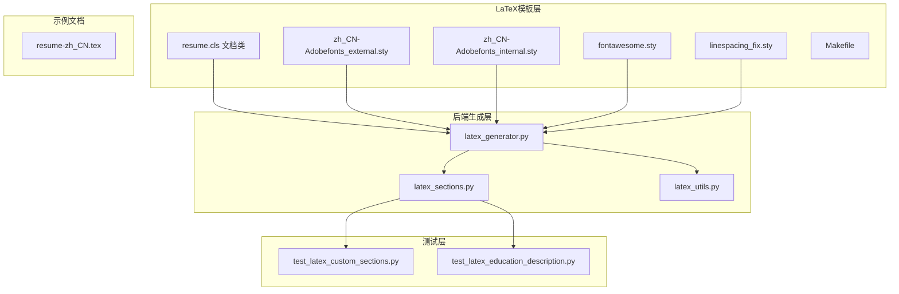

**图表来源**
- [resume.cls:1-125](file://latex-resume-template/resume.cls#L1-L125)
- [latex_generator.py:1-676](file://backend/latex_generator.py#L1-L676)

**章节来源**
- [Makefile:1-26](file://latex-resume-template/Makefile#L1-L26)
- [resume-zh_CN.tex:1-110](file://latex-resume-template/resume-zh_CN.tex#L1-L110)

## 核心组件

### LaTeX文档类架构

resume.cls文档类是整个系统的核心，它基于LaTeX2e内核，提供了简历专用的排版功能：

#### 字体配置系统
- **主字体设置**：使用TeX Gyre Termes作为默认正文字体
- **字体选项**：支持9pt、10pt、11pt、12pt四种字体大小
- **中文字体支持**：集成Adobe字体系统，支持简体中文显示

#### 样式定义
- **段落格式**：禁用首行缩进，设置合理的行间距
- **标题格式**：自定义section和subsection的标题样式
- **列表格式**：统一itemize和enumerate环境的间距和样式

#### 时间列系统
- **固定宽度设计**：使用绝对单位确保不同字号下的列宽一致性
- **左右对齐**：时间信息右对齐，内容左对齐
- **灵活布局**：支持不同长度的时间字符串

**章节来源**
- [resume.cls:1-125](file://latex-resume-template/resume.cls#L1-L125)

### 中文字体支持机制

系统提供了两种中文字体配置方案：

#### 外部字体配置 (zh_CN-Adobefonts_external.sty)
- **字体路径**：使用相对路径fonts/zh_CN-Adobe/
- **Adobe字体集**：支持Adobe Song、Heiti、Kaiti、Fangsong字体
- **字体映射**：通过Mapping=tex-text确保正确的字符映射

#### 系统字体配置 (zh_CN-Adobefonts_internal.sty)
- **系统字体**：直接使用系统已安装的中文字体
- **字体族设置**：定义songti、heiti、kaishu、fangsong等字体族
- **兼容性**：与系统字体环境无缝集成

**章节来源**
- [zh_CN-Adobefonts_external.sty:1-32](file://latex-resume-template/zh_CN-Adobefonts_external.sty#L1-L32)
- [zh_CN-Adobefonts_internal.sty:1-33](file://latex-resume-template/zh_CN-Adobefonts_internal.sty#L1-L33)

### 宏包依赖关系

系统使用的宏包及其作用：

| 宏包名称 | 版本要求 | 主要功能 | 依赖关系 |
|---------|---------|---------|----------|
| xltxtra | ≥1994/06/01 | LaTeX2e扩展功能 | LaTeX2e核心 |
| xifthen | - | 条件判断 | LaTeX2e核心 |
| fontawesome | - | 图标字体支持 | fontspec |
| xcolor | usenames,dvipsnames | 颜色管理 | LaTeX2e核心 |
| fontspec | - | XeLaTeX字体支持 | LaTeX2e核心 |
| geometry | - | 页面尺寸和边距 | LaTeX2e核心 |
| titlesec | - | 标题格式定制 | LaTeX2e核心 |
| enumitem | - | 列表环境增强 | LaTeX2e核心 |
| setspace | - | 行间距控制 | LaTeX2e核心 |

**章节来源**
- [resume.cls:18-55](file://latex-resume-template/resume.cls#L18-L55)

## 架构概览

LaTeX模板系统采用分层架构设计，从底层的LaTeX文档类到上层的应用接口：

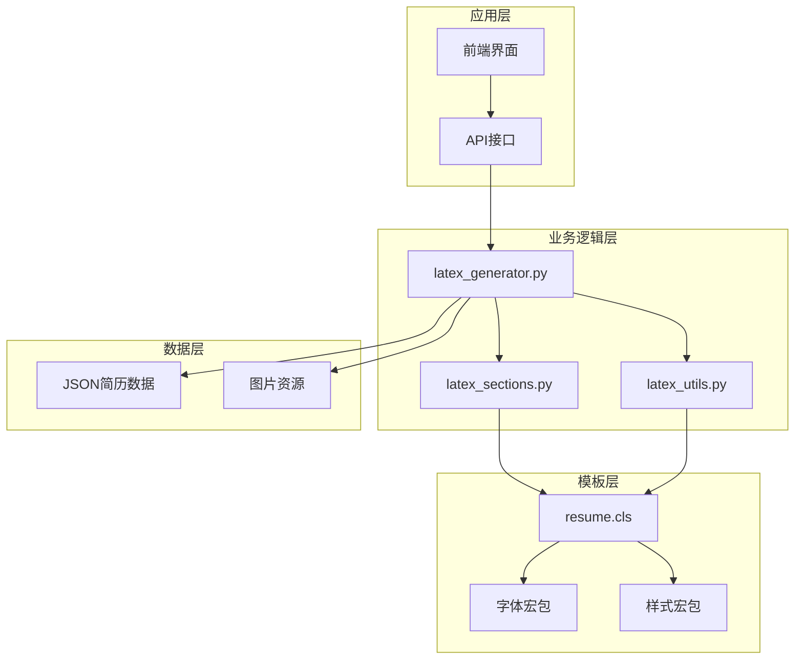

**图表来源**
- [latex_generator.py:261-460](file://backend/latex_generator.py#L261-L460)
- [latex_sections.py:1-800](file://backend/latex_sections.py#L1-L800)

### 控制流程

系统的主要工作流程如下：

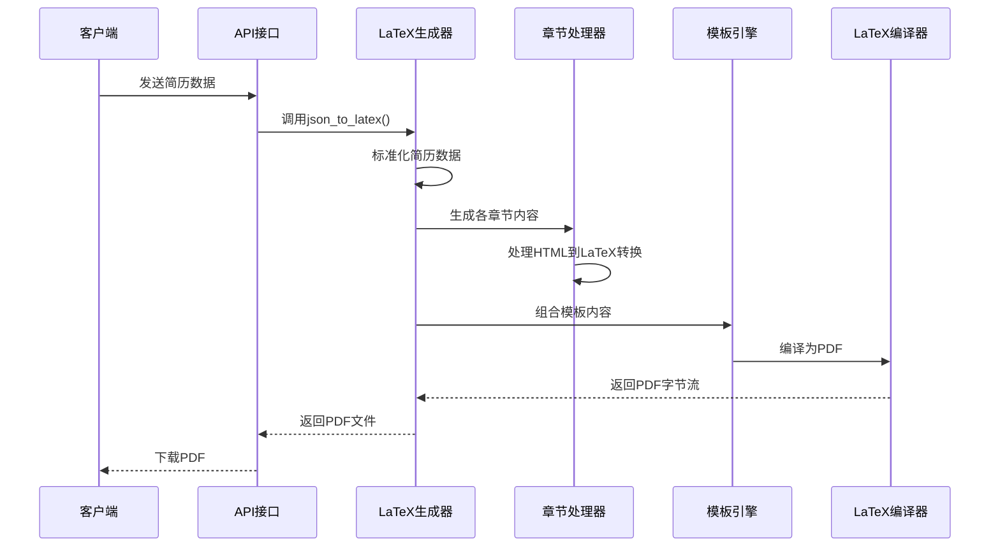

**图表来源**
- [latex_generator.py:261-460](file://backend/latex_generator.py#L261-L460)
- [latex_sections.py:1-800](file://backend/latex_sections.py#L1-L800)

**章节来源**
- [latex_generator.py:463-676](file://backend/latex_generator.py#L463-L676)

## 详细组件分析

### LaTeX文档类详细分析

#### 字体配置实现
resume.cls通过fontspec宏包实现XeLaTeX字体配置：

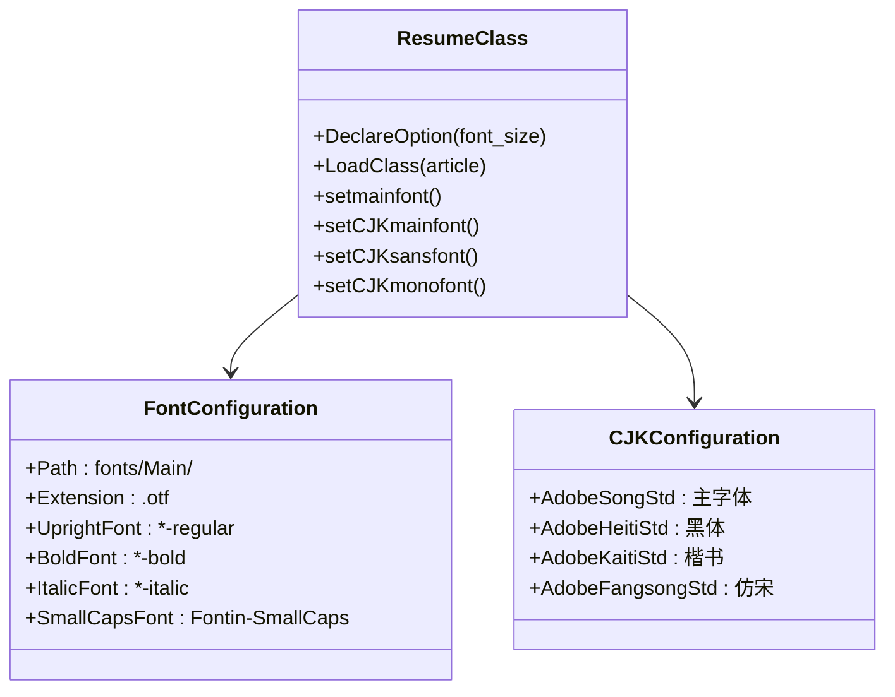

**图表来源**
- [resume.cls:28-36](file://latex-resume-template/resume.cls#L28-L36)
- [zh_CN-Adobefonts_internal.sty:10-16](file://latex-resume-template/zh_CN-Adobefonts_internal.sty#L10-L16)

#### 样式定义机制
系统通过titlesec宏包实现标题样式的自定义：

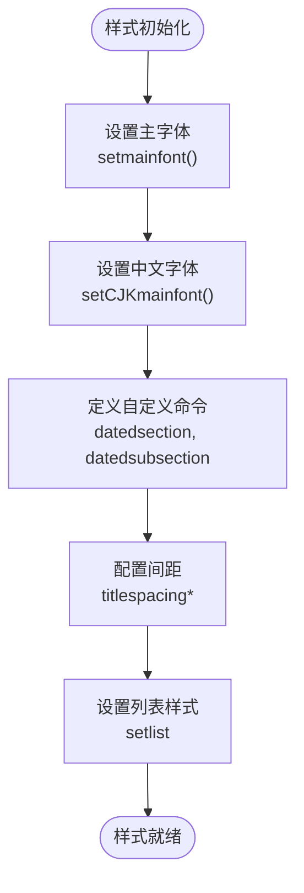

**图表来源**
- [resume.cls:57-95](file://latex-resume-template/resume.cls#L57-L95)

**章节来源**
- [resume.cls:57-125](file://latex-resume-template/resume.cls#L57-L125)

### 字体宏包分析

#### FontAwesome图标系统
fontawesome.sty提供了完整的Font Awesome图标支持：

```mermaid
classDiagram
class FontAwesomePackage {
+Requires : fontspec
+Define : \FA font family
+Scale : 0.85
+IconCommands : faicon@*
+SymbolMapping : Unicode → Symbol
}
class IconCommand {
+\faicon{name}
+\fa{name}
+支持 : 400+图标
+路径 : fonts/fontawesome-webfont.ttf
}
FontAwesomePackage --> IconCommand
```

**图表来源**
- [fontawesome.sty:29-38](file://latex-resume-template/fontawesome.sty#L29-L38)

#### 行间距修复宏包
linespacing_fix.sty解决了setspace宏包引入的额外间距问题：

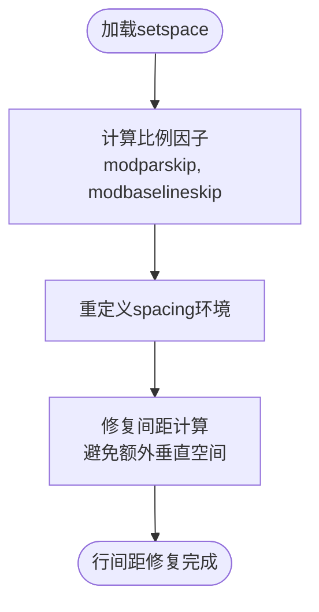

**图表来源**
- [linespacing_fix.sty:15-22](file://latex-resume-template/linespacing_fix.sty#L15-L22)

**章节来源**
- [fontawesome.sty:1-649](file://latex-resume-template/fontawesome.sty#L1-L649)
- [linespacing_fix.sty:1-25](file://latex-resume-template/linespacing_fix.sty#L1-L25)

### 后端生成器分析

#### LaTeX生成器架构
latex_generator.py是系统的核心组件，负责将JSON数据转换为LaTeX代码：

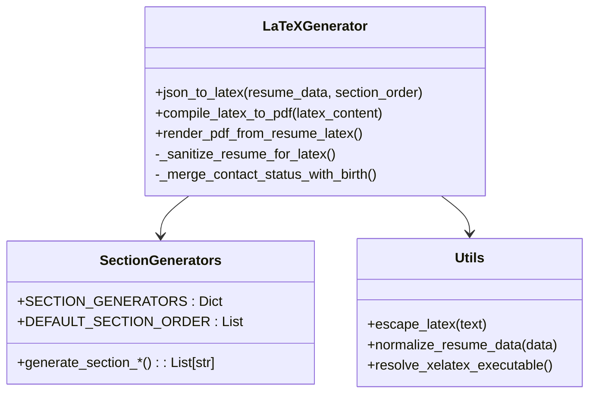

**图表来源**
- [latex_generator.py:261-460](file://backend/latex_generator.py#L261-L460)
- [latex_sections.py:1-800](file://backend/latex_sections.py#L1-L800)

#### 章节生成器系统
latex_sections.py提供了各种简历模块的LaTeX代码生成：

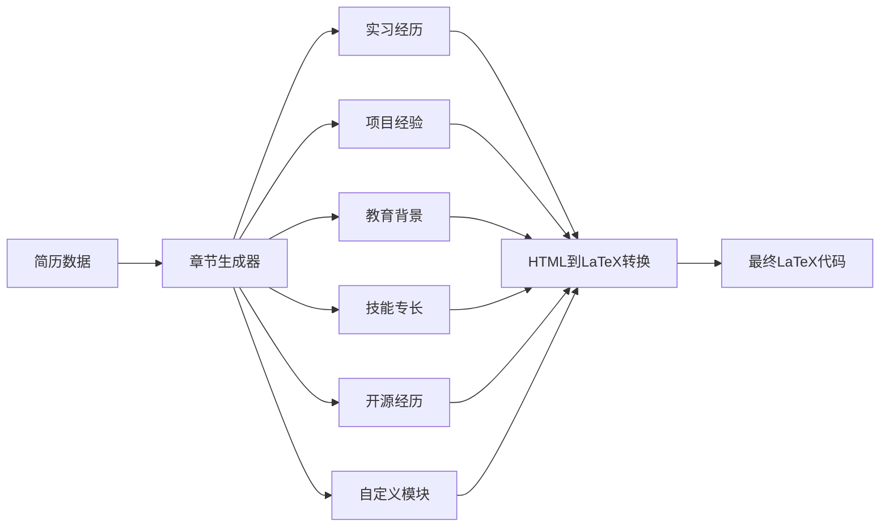

**图表来源**
- [latex_sections.py:26-800](file://backend/latex_sections.py#L26-L800)

**章节来源**
- [latex_generator.py:261-460](file://backend/latex_generator.py#L261-L460)
- [latex_sections.py:1-800](file://backend/latex_sections.py#L1-L800)

### 测试框架分析

系统包含完善的测试框架，确保模板功能的正确性：

#### 自定义模块测试
测试验证了自定义模块的渲染逻辑：

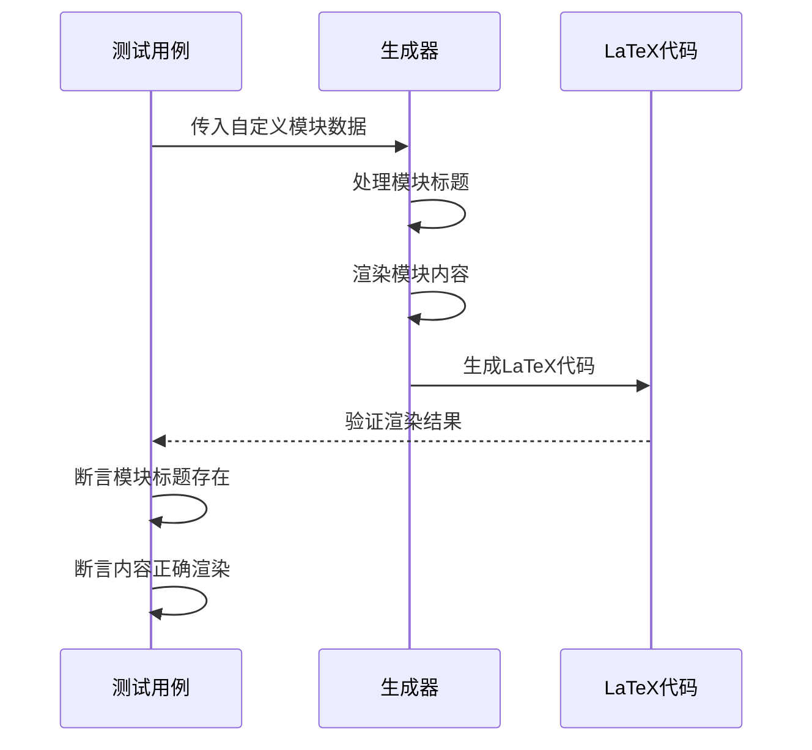

**图表来源**
- [test_latex_custom_sections.py:32-38](file://backend/tests/test_latex_custom_sections.py#L32-L38)

**章节来源**
- [test_latex_custom_sections.py:1-152](file://backend/tests/test_latex_custom_sections.py#L1-L152)
- [test_latex_education_description.py:1-50](file://backend/tests/test_latex_education_description.py#L1-L50)

## 依赖分析

### 宏包依赖关系图

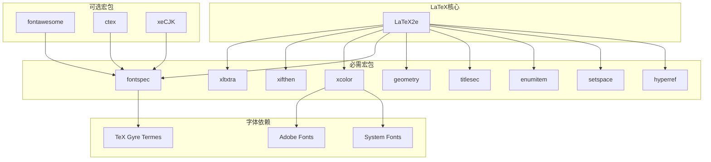

**图表来源**
- [resume.cls:18-55](file://latex-resume-template/resume.cls#L18-L55)
- [zh_CN-Adobefonts_external.sty:4-5](file://latex-resume-template/zh_CN-Adobefonts_external.sty#L4-L5)

### 模板继承体系

系统采用了清晰的模板继承和样式覆盖机制：

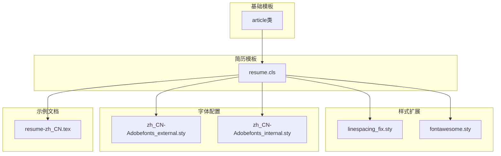

**图表来源**
- [resume.cls:13-13](file://latex-resume-template/resume.cls#L13-L13)
- [resume-zh_CN.tex:5-7](file://latex-resume-template/resume-zh_CN.tex#L5-L7)

**章节来源**
- [resume.cls:1-125](file://latex-resume-template/resume.cls#L1-L125)
- [resume-zh_CN.tex:1-110](file://latex-resume-template/resume-zh_CN.tex#L1-L110)

## 性能考虑

### 编译性能优化

系统实现了多项性能优化策略：

#### 缓存机制
- **PDF缓存**：内存缓存最近生成的PDF，最大50个
- **缓存键生成**：基于简历数据的MD5哈希
- **LRU淘汰**：超过容量时自动淘汰最旧缓存

#### 编译优化
- **单次编译**：默认只编译一次，避免多次调用
- **超时控制**：编译超时180秒，防止长时间阻塞
- **错误摘要**：提取LaTeX错误的关键信息

#### 资源管理
- **临时目录清理**：编译完成后自动清理
- **字体文件复制**：只复制必要的字体文件
- **图片资源优化**：下载并缓存外部图片资源

**章节来源**
- [latex_generator.py:606-676](file://backend/latex_generator.py#L606-L676)

### 内存使用优化

系统通过以下方式优化内存使用：
- **渐进式处理**：逐章节生成LaTeX代码
- **流式编译**：避免一次性加载大量数据
- **及时释放**：编译完成后立即释放临时资源

## 故障排除指南

### 常见问题及解决方案

#### LaTeX编译错误
**问题**：xelatex命令未找到
**解决方案**：
1. 检查系统是否安装了MacTeX或BasicTeX
2. 验证PATH环境变量是否包含LaTeX路径
3. 在Windows系统中检查MiKTeX安装路径

#### 字体显示问题
**问题**：中文字符显示为方框
**解决方案**：
1. 确认Adobe字体已正确安装
2. 检查字体路径配置
3. 验证XeLaTeX的字体映射设置

#### 编译超时问题
**问题**：编译过程卡死或超时
**解决方案**：
1. 检查网络连接（下载外部资源时）
2. 减少图片数量和大小
3. 简化复杂的LaTeX代码

#### 内存不足问题
**问题**：生成大型PDF时内存溢出
**解决方案**：
1. 清理PDF缓存
2. 减少同时生成的PDF数量
3. 优化简历数据结构

**章节来源**
- [latex_generator.py:543-560](file://backend/latex_generator.py#L543-L560)

### 调试技巧

#### 错误信息分析
系统提供了详细的错误信息提取功能：
- 优先提取包含"!"的错误行
- 提取包含"Error"的关键行
- 返回最后40行的日志信息

#### 日志记录
- **性能统计**：记录JSON转换、LaTeX编译、PDF生成的时间
- **缓存状态**：显示缓存命中率和缓存数量
- **资源使用**：监控内存和磁盘使用情况

## 结论

LaTeX模板系统是一个设计精良、功能完整的简历生成解决方案。系统具有以下优势：

### 技术优势
- **架构清晰**：分层设计便于维护和扩展
- **功能完整**：涵盖简历生成的各个环节
- **性能优秀**：通过缓存和优化策略提升用户体验
- **兼容性强**：支持多种平台和字体配置

### 设计特色
- **模板继承**：基于LaTeX文档类的继承体系
- **样式覆盖**：灵活的样式配置和覆盖机制
- **国际化支持**：完善的中文字体和多语言支持
- **测试完备**：全面的单元测试确保质量

### 应用价值
该系统不仅适用于个人简历制作，还可作为企业内部文档模板的基础，具有良好的扩展性和维护性。

## 附录

### 安装和配置指南

#### 系统要求
- **LaTeX发行版**：MacTeX或BasicTeX（推荐）
- **操作系统**：Windows、macOS、Linux
- **内存**：至少4GB RAM
- **存储**：至少2GB可用空间

#### 安装步骤
1. 安装LaTeX发行版
2. 配置字体文件（可选）
3. 复制模板文件到项目目录
4. 验证安装结果

### 开发最佳实践

#### 代码规范
- **模块化设计**：每个功能模块保持独立
- **错误处理**：完善的异常处理和错误恢复
- **文档注释**：详细的函数和类注释
- **测试驱动**：先编写测试再实现功能

#### 性能优化
- **缓存策略**：合理使用缓存提升性能
- **资源管理**：及时释放临时资源
- **内存控制**：避免内存泄漏
- **并发处理**：支持多任务并行处理

#### 维护建议
- **版本控制**：使用Git管理代码变更
- **持续集成**：自动化测试和部署
- **文档更新**：及时更新技术文档
- **用户反馈**：建立用户反馈机制