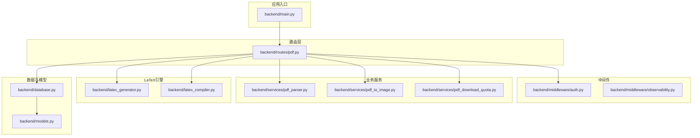
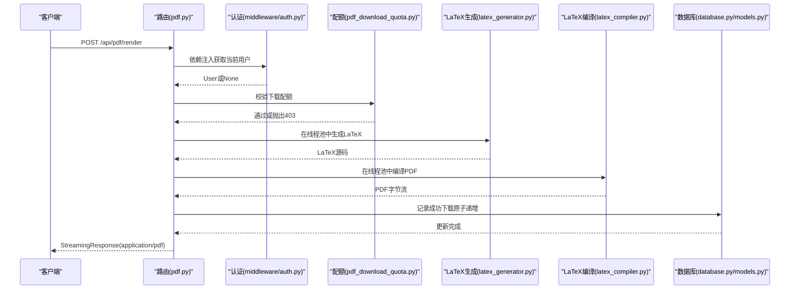
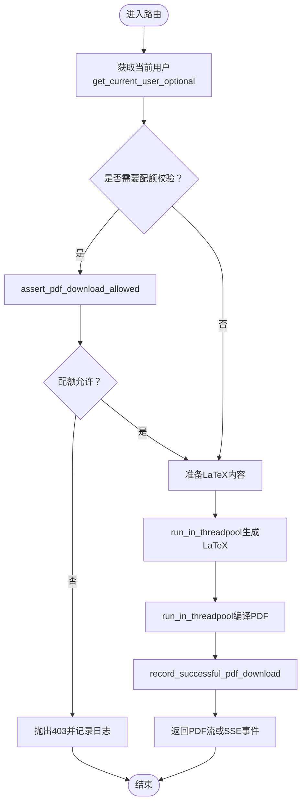
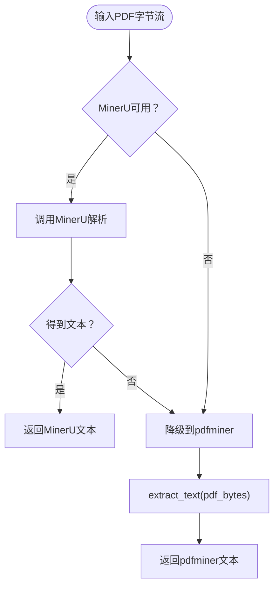
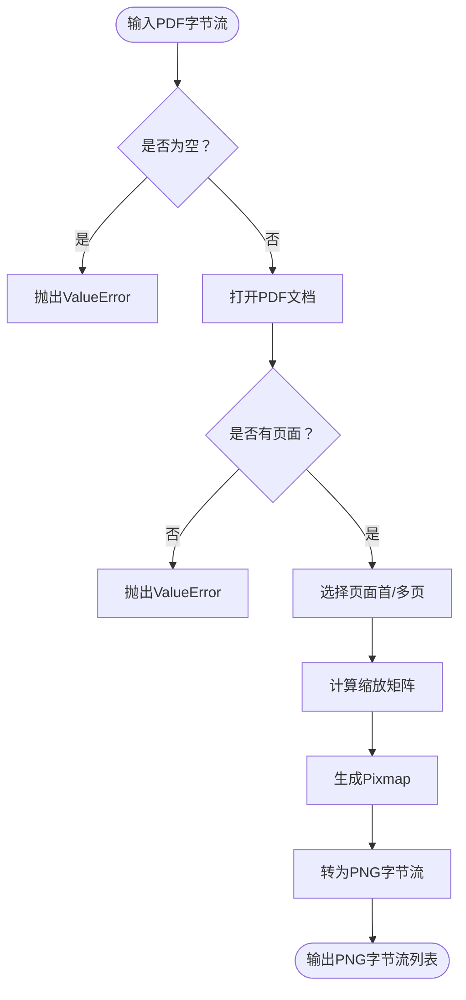
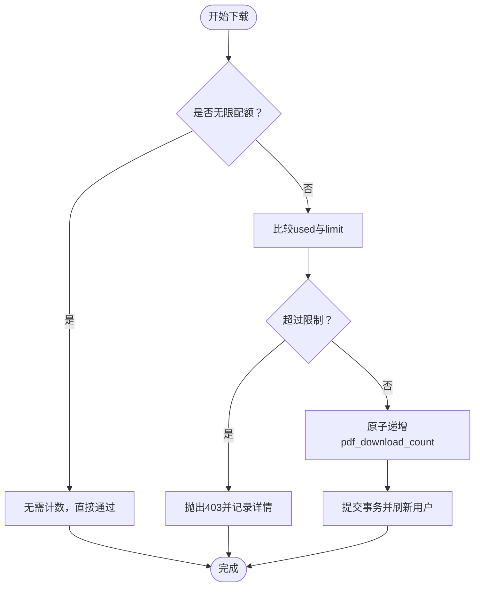
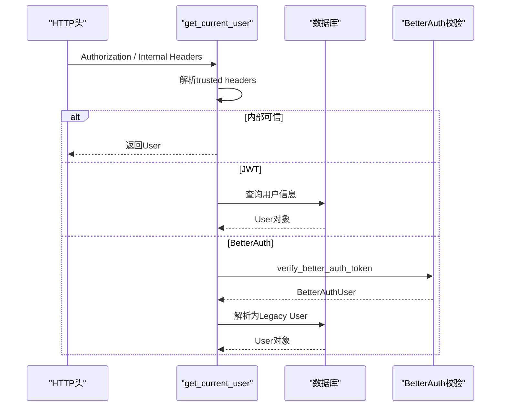
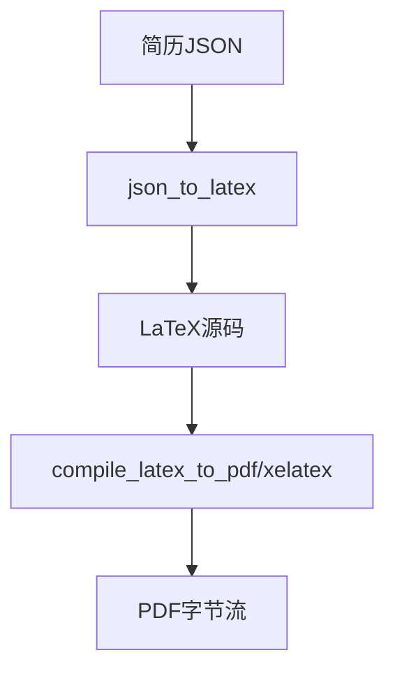
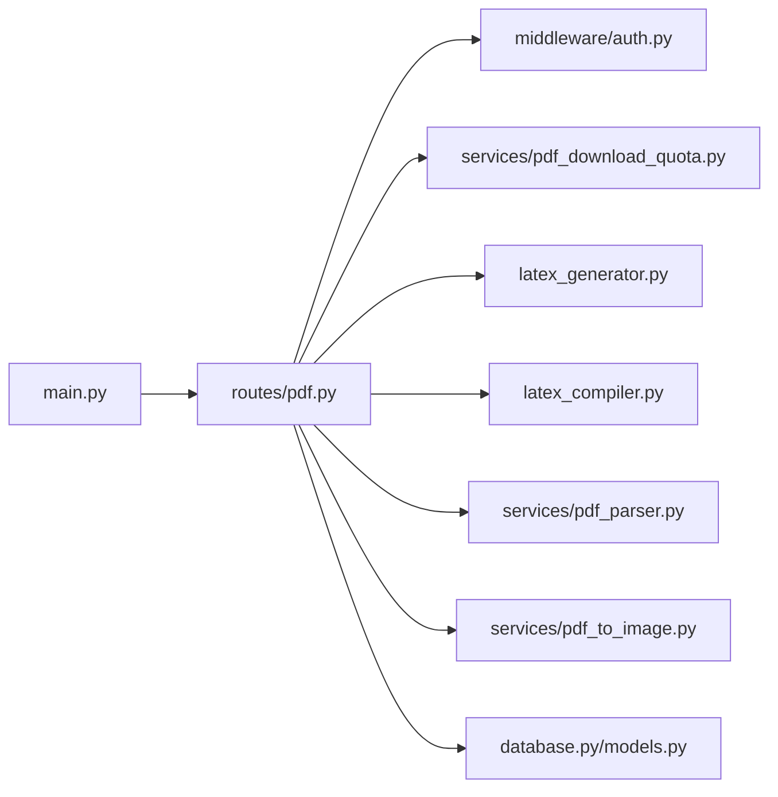

# PDF API集成

<cite>
**本文档引用的文件**
- [backend/routes/pdf.py](file://backend/routes/pdf.py)
- [backend/services/pdf_parser.py](file://backend/services/pdf_parser.py)
- [backend/services/pdf_to_image.py](file://backend/services/pdf_to_image.py)
- [backend/services/pdf_download_quota.py](file://backend/services/pdf_download_quota.py)
- [backend/middleware/auth.py](file://backend/middleware/auth.py)
- [backend/latex_generator.py](file://backend/latex_generator.py)
- [backend/latex_compiler.py](file://backend/latex_compiler.py)
- [backend/models.py](file://backend/models.py)
- [backend/database.py](file://backend/database.py)
- [backend/main.py](file://backend/main.py)
- [config.toml](file://config.toml)
</cite>

## 目录
1. [简介](#简介)
2. [项目结构](#项目结构)
3. [核心组件](#核心组件)
4. [架构总览](#架构总览)
5. [详细组件分析](#详细组件分析)
6. [依赖关系分析](#依赖关系分析)
7. [性能考虑](#性能考虑)
8. [故障排除指南](#故障排除指南)
9. [结论](#结论)
10. [附录](#附录)

## 简介
本文件面向需要集成和扩展PDF API能力的开发者，系统性阐述基于FastAPI的PDF生成API的设计与实现，包括路由设计、请求处理流程、响应格式、PDF解析服务、图像转换服务、文件存储机制、API版本管理、错误处理与安全验证、性能监控、并发控制与资源管理策略，并提供API使用示例、集成指南与最佳实践。

## 项目结构
后端采用模块化组织，PDF相关能力主要分布在以下模块：
- 路由层：负责HTTP接口定义与请求分发
- 业务服务层：PDF解析、PDF转图片、配额控制等
- 中间件层：认证与授权、可观测性
- LaTeX引擎：简历JSON到LaTeX再到PDF的编译管线
- 数据模型与数据库：用户、配额、持久化
- 应用入口：FastAPI应用初始化与路由注册

**图表来源**
- [backend/main.py:92-139](file://backend/main.py#L92-L139)
- [backend/routes/pdf.py:34-380](file://backend/routes/pdf.py#L34-L380)
- [backend/middleware/auth.py:113-174](file://backend/middleware/auth.py#L113-L174)
- [backend/services/pdf_parser.py:71-89](file://backend/services/pdf_parser.py#L71-L89)
- [backend/services/pdf_to_image.py:12-52](file://backend/services/pdf_to_image.py#L12-L52)
- [backend/services/pdf_download_quota.py:36-111](file://backend/services/pdf_download_quota.py#L36-L111)
- [backend/latex_generator.py:1-200](file://backend/latex_generator.py#L1-L200)
- [backend/latex_compiler.py:18-131](file://backend/latex_compiler.py#L18-L131)
- [backend/models.py:65-128](file://backend/models.py#L65-L128)
- [backend/database.py:90-131](file://backend/database.py#L90-L131)

**章节来源**
- [backend/main.py:92-139](file://backend/main.py#L92-L139)
- [backend/routes/pdf.py:34-380](file://backend/routes/pdf.py#L34-L380)

## 核心组件
- PDF渲染路由：提供一次性直出PDF、流式渲染PDF、直接编译LaTeX三种能力
- PDF解析服务：优先使用MinerU，失败时降级到pdfminer
- PDF转图片服务：支持首页PNG与多页PNG导出
- 配额与下载统计：非管理员默认10次/天，原子性更新防止竞态
- 认证与授权：支持BetterAuth/JWT，内部信任头，匿名可访问渲染预览
- LaTeX引擎：JSON到LaTeX再到PDF的完整编译链路
- 数据模型与数据库：用户、配额、会话与连接池配置

**章节来源**
- [backend/routes/pdf.py:76-380](file://backend/routes/pdf.py#L76-L380)
- [backend/services/pdf_parser.py:71-89](file://backend/services/pdf_parser.py#L71-L89)
- [backend/services/pdf_to_image.py:12-52](file://backend/services/pdf_to_image.py#L12-L52)
- [backend/services/pdf_download_quota.py:36-111](file://backend/services/pdf_download_quota.py#L36-L111)
- [backend/middleware/auth.py:113-174](file://backend/middleware/auth.py#L113-L174)
- [backend/latex_generator.py:1-200](file://backend/latex_generator.py#L1-L200)
- [backend/latex_compiler.py:18-131](file://backend/latex_compiler.py#L18-L131)
- [backend/models.py:65-128](file://backend/models.py#L65-L128)
- [backend/database.py:90-131](file://backend/database.py#L90-L131)

## 架构总览
PDF API的请求处理遵循“路由-中间件-服务-引擎-响应”的清晰分层，配合线程池执行CPU密集任务，结合SSE实现流式进度反馈，数据库连接池保障并发稳定性。

**图表来源**
- [backend/routes/pdf.py:125-185](file://backend/routes/pdf.py#L125-L185)
- [backend/middleware/auth.py:113-174](file://backend/middleware/auth.py#L113-L174)
- [backend/services/pdf_download_quota.py:58-111](file://backend/services/pdf_download_quota.py#L58-L111)
- [backend/latex_generator.py:43-56](file://backend/latex_generator.py#L43-L56)
- [backend/latex_compiler.py:18-131](file://backend/latex_compiler.py#L18-L131)
- [backend/database.py:90-131](file://backend/database.py#L90-L131)

## 详细组件分析

### PDF渲染路由与请求处理
- 路由前缀：/api/pdf
- 主要端点：
  - GET /pdf/quota：查询当前用户PDF下载配额
  - POST /pdf/downloads/record：记录一次真实PDF下载（预览/渲染不消耗）
  - POST /pdf/render：一次性直出PDF（StreamingResponse）
  - POST /pdf/render/stream：流式渲染PDF（SSE事件流）
  - POST /pdf/compile-latex：直接编译LaTeX源码为PDF
  - POST /pdf/compile-latex/stream：流式编译LaTeX源码为PDF
- 关键特性：
  - 匿名可访问渲染预览（get_current_user_optional）
  - Trace ID与来源追踪头：X-PDF-Trace-Id、X-PDF-Trace-Source、X-PDF-Trace-Trigger
  - 响应头携带渲染耗时与剩余配额
  - 流式端点通过SSE事件start/progress/pdf/error传递状态

**图表来源**
- [backend/routes/pdf.py:125-299](file://backend/routes/pdf.py#L125-L299)
- [backend/services/pdf_download_quota.py:58-111](file://backend/services/pdf_download_quota.py#L58-L111)

**章节来源**
- [backend/routes/pdf.py:76-380](file://backend/routes/pdf.py#L76-L380)

### PDF解析服务（MinerU优先，pdfminer降级）
- 功能：从PDF字节流抽取文本内容，优先使用MinerU，失败时降级pdfminer
- 环境变量控制：
  - MINERU_BACKEND：hybrid-auto-engine/vlm等
  - MINERU_PARSE_METHOD：auto等
  - MINERU_LANG：ch等
- 输出：标准化后的Markdown文本（若MinerU不可用则返回pdfminer结果）

**图表来源**
- [backend/services/pdf_parser.py:71-89](file://backend/services/pdf_parser.py#L71-L89)

**章节来源**
- [backend/services/pdf_parser.py:71-89](file://backend/services/pdf_parser.py#L71-L89)

### PDF转图片服务（PyMuPDF）
- 单页转PNG：pdf_first_page_to_png_bytes
- 多页转PNG：pdf_pages_to_png_bytes（支持dpi与最大页数限制）
- 异常处理：空PDF、无页面等输入校验

**图表来源**
- [backend/services/pdf_to_image.py:12-52](file://backend/services/pdf_to_image.py#L12-L52)

**章节来源**
- [backend/services/pdf_to_image.py:12-52](file://backend/services/pdf_to_image.py#L12-L52)

### 配额与下载统计（并发安全）
- 默认配额：非管理员10次/天
- 配额结构：limit、used、remaining、unlimited
- 并发控制：
  - assert_pdf_download_allowed：快速校验，避免超限用户继续
  - record_successful_pdf_download：原子递增pdf_download_count，防止竞态
- 日志：记录配额变更、超额行为与最终结果

**图表来源**
- [backend/services/pdf_download_quota.py:58-111](file://backend/services/pdf_download_quota.py#L58-L111)

**章节来源**
- [backend/services/pdf_download_quota.py:36-111](file://backend/services/pdf_download_quota.py#L36-L111)

### 认证与授权（JWT/BetterAuth/内部信任头）
- 支持来源：
  - Trusted Internal Headers：内部服务间调用
  - BetterAuth Token：异步校验
  - JWT Bearer：标准令牌
- 依赖注入：
  - get_current_user：必须认证
  - get_current_user_optional：匿名可访问
- 数据库重试与连接恢复，避免短暂故障导致失败

**图表来源**
- [backend/middleware/auth.py:113-174](file://backend/middleware/auth.py#L113-L174)

**章节来源**
- [backend/middleware/auth.py:113-174](file://backend/middleware/auth.py#L113-L174)

### LaTeX引擎（JSON→LaTeX→PDF）
- JSON到LaTeX：json_to_latex（由路由调用）
- LaTeX到PDF：compile_latex_to_pdf（由路由调用）
- 直接编译LaTeX：compile_latex_raw（独立端点）
- 环境与超时：xelatex可执行路径解析、子进程环境注入、编译超时控制
- 错误摘要：提取!块附近上下文或关键错误行，便于定位问题

**图表来源**
- [backend/latex_generator.py:43-56](file://backend/latex_generator.py#L43-L56)
- [backend/latex_compiler.py:18-131](file://backend/latex_compiler.py#L18-L131)

**章节来源**
- [backend/latex_generator.py:1-200](file://backend/latex_generator.py#L1-L200)
- [backend/latex_compiler.py:18-131](file://backend/latex_compiler.py#L18-L131)

### 数据模型与数据库
- RenderPDFRequest：渲染请求体（简历JSON、演示标记、段落顺序、引擎）
- User：用户模型，包含pdf_download_count等字段
- 数据库连接池：可配置池大小、回收时间、超时、预检等
- 初始化：创建所有表

**章节来源**
- [backend/models.py:65-128](file://backend/models.py#L65-L128)
- [backend/database.py:90-131](file://backend/database.py#L90-L131)

## 依赖关系分析
- 路由依赖认证中间件与数据库会话
- 渲染流程依赖LaTeX引擎与配额服务
- PDF解析与图片转换作为独立服务被调用
- 应用入口集中注册所有路由，包含CORS与可观测性

**图表来源**
- [backend/routes/pdf.py:34-380](file://backend/routes/pdf.py#L34-L380)
- [backend/middleware/auth.py:113-174](file://backend/middleware/auth.py#L113-L174)
- [backend/services/pdf_download_quota.py:36-111](file://backend/services/pdf_download_quota.py#L36-L111)
- [backend/latex_generator.py:43-56](file://backend/latex_generator.py#L43-L56)
- [backend/latex_compiler.py:18-131](file://backend/latex_compiler.py#L18-L131)
- [backend/services/pdf_parser.py:71-89](file://backend/services/pdf_parser.py#L71-L89)
- [backend/services/pdf_to_image.py:12-52](file://backend/services/pdf_to_image.py#L12-L52)
- [backend/database.py:90-131](file://backend/database.py#L90-L131)
- [backend/main.py:92-139](file://backend/main.py#L92-L139)

**章节来源**
- [backend/main.py:92-139](file://backend/main.py#L92-L139)
- [backend/routes/pdf.py:34-380](file://backend/routes/pdf.py#L34-L380)

## 性能考虑
- 线程池执行：LaTeX生成与编译在run_in_threadpool中执行，避免阻塞事件循环
- SSE流式：渲染过程分阶段推送事件，前端可即时反馈进度
- 连接池：数据库连接池参数可调，生产环境建议合理配置池大小与回收时间
- 启动预热：预热HTTP连接、数据库连接与tiktoken编码，降低首次请求延迟
- 超时控制：LaTeX编译超时、数据库连接超时、CORS与代理配置
- 资源清理：临时目录与PDF字节流及时释放，避免内存与磁盘压力

[本节为通用性能指导，不直接分析特定文件]

## 故障排除指南
- LaTeX编译失败：查看SSE事件中的error内容，关注!块附近上下文或最后关键行
- 配额不足：检查/quota端点返回的remaining，确认record端点是否正确记录
- 认证失败：确认Authorization头格式、BetterAuth令牌有效性或内部信任头配置
- PDF为空或无页面：检查输入字节流与PDF有效性
- 数据库连接异常：查看重试日志与连接池参数，必要时调整超时与池大小

**章节来源**
- [backend/routes/pdf.py:273-297](file://backend/routes/pdf.py#L273-L297)
- [backend/services/pdf_download_quota.py:58-111](file://backend/services/pdf_download_quota.py#L58-L111)
- [backend/middleware/auth.py:40-86](file://backend/middleware/auth.py#L40-L86)
- [backend/latex_compiler.py:100-113](file://backend/latex_compiler.py#L100-L113)

## 结论
该PDF API集成以模块化设计为核心，通过路由、中间件、服务与LaTeX引擎的清晰分工，实现了从简历JSON到PDF的高效生成与流式反馈。配合严格的配额控制、认证授权与可观测性，满足了生产环境对安全性、稳定性和可维护性的要求。建议在生产环境中启用合理的连接池与超时策略，并持续监控渲染耗时与错误率。

[本节为总结性内容，不直接分析特定文件]

## 附录

### API版本管理
- 当前路由前缀为/api/pdf，未显式包含版本号
- 建议在路由前缀中加入版本号（如/api/v1/pdf），以便平滑演进与向后兼容

[本节为概念性建议，不直接分析特定文件]

### 错误处理与安全验证
- HTTPException：统一抛出403/401/500，便于前端识别
- 安全头：内部信任头需严格校验，避免越权
- 认证降级：JWT与BetterAuth双通道，提升可用性

**章节来源**
- [backend/routes/pdf.py:100-122](file://backend/routes/pdf.py#L100-L122)
- [backend/middleware/auth.py:96-111](file://backend/middleware/auth.py#L96-L111)

### 性能监控与并发控制
- Trace ID与来源追踪：便于端到端链路追踪
- SSE事件：start/progress/pdf/error，便于前端可视化进度
- 数据库连接池：可配置参数保障并发稳定性

**章节来源**
- [backend/routes/pdf.py:137-184](file://backend/routes/pdf.py#L137-L184)
- [backend/routes/pdf.py:197-299](file://backend/routes/pdf.py#L197-L299)
- [backend/database.py:90-112](file://backend/database.py#L90-L112)

### 资源管理策略
- 临时目录：LaTeX编译与MinerU输出均使用临时目录，结束后清理
- PDF字节流：StreamingResponse按块传输，避免大对象驻留内存
- 连接池：LIFO复用、归还时重置事务状态，减少脏连接影响

**章节来源**
- [backend/latex_compiler.py:40-131](file://backend/latex_compiler.py#L40-L131)
- [backend/services/pdf_parser.py:28-67](file://backend/services/pdf_parser.py#L28-L67)

### API使用示例与集成指南
- 健康检查：GET /api/health
- 查询配额：GET /api/pdf/quota（需认证）
- 记录下载：POST /api/pdf/downloads/record（需认证）
- 直出PDF：POST /api/pdf/render（请求体包含简历JSON、段落顺序等）
- 流式渲染：POST /api/pdf/render/stream（SSE事件流）
- 直接编译LaTeX：POST /api/pdf/compile-latex（请求体包含LaTeX源码）
- 流式编译LaTeX：POST /api/pdf/compile-latex/stream（SSE事件流）

集成要点：
- 设置Authorization头或内部信任头
- 通过X-PDF-Trace-*头进行端到端追踪
- 使用SSE时注意浏览器EventSource支持
- 生产环境配置数据库连接池与超时参数

**章节来源**
- [backend/main.py:9-12](file://backend/main.py#L9-L12)
- [backend/routes/pdf.py:76-380](file://backend/routes/pdf.py#L76-L380)
- [config.toml:1-28](file://config.toml#L1-L28)