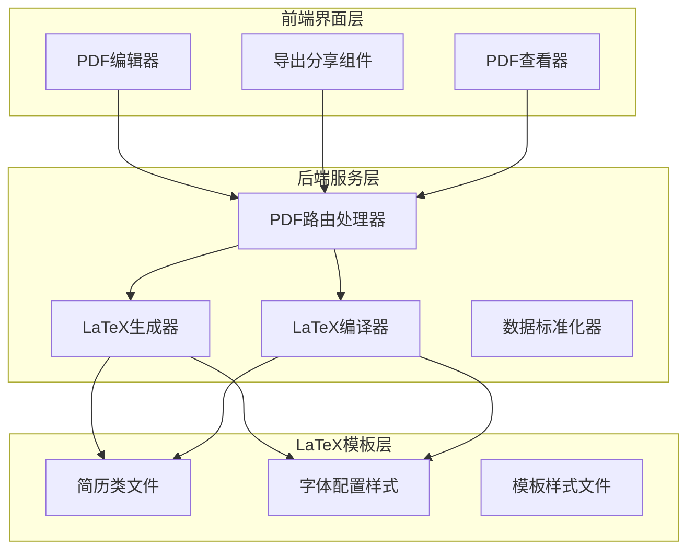
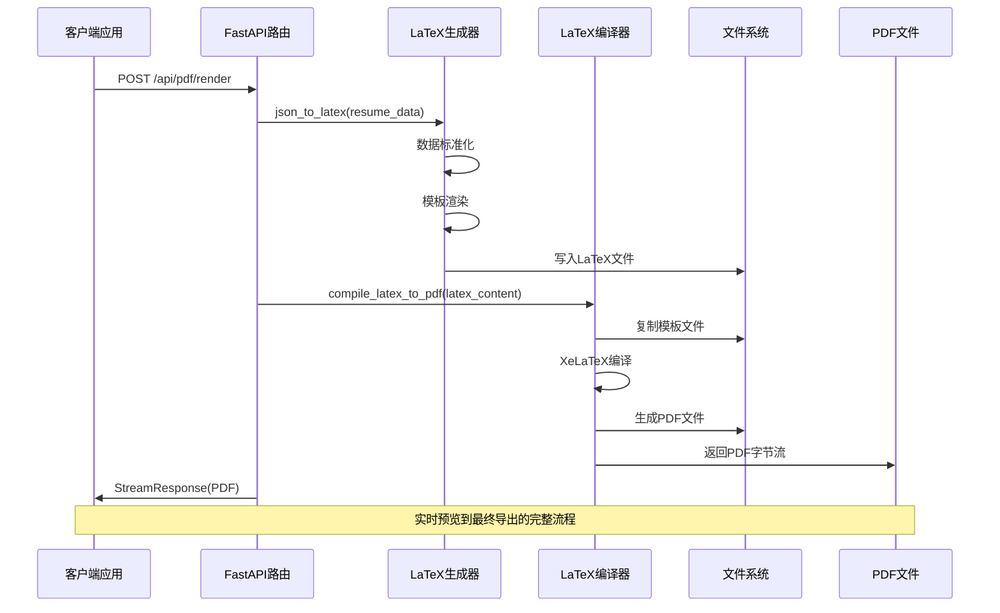
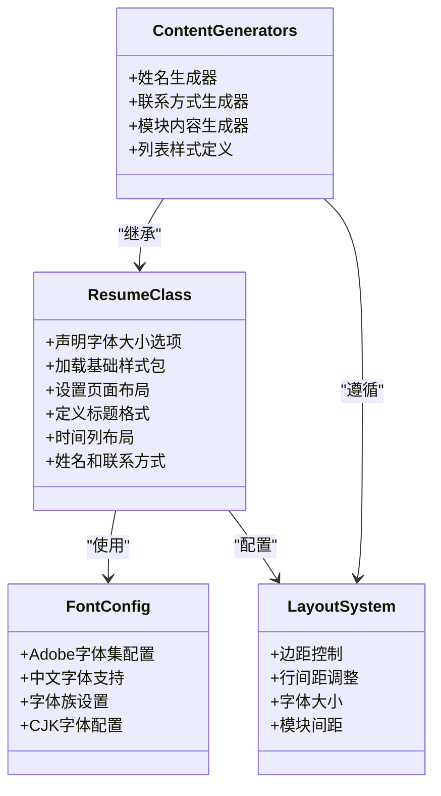
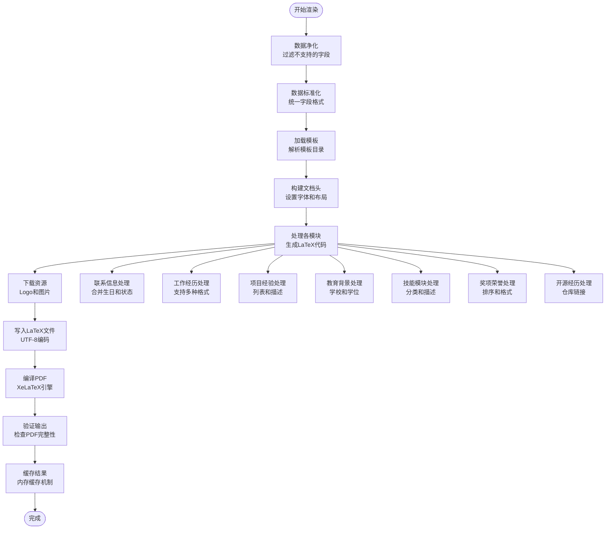
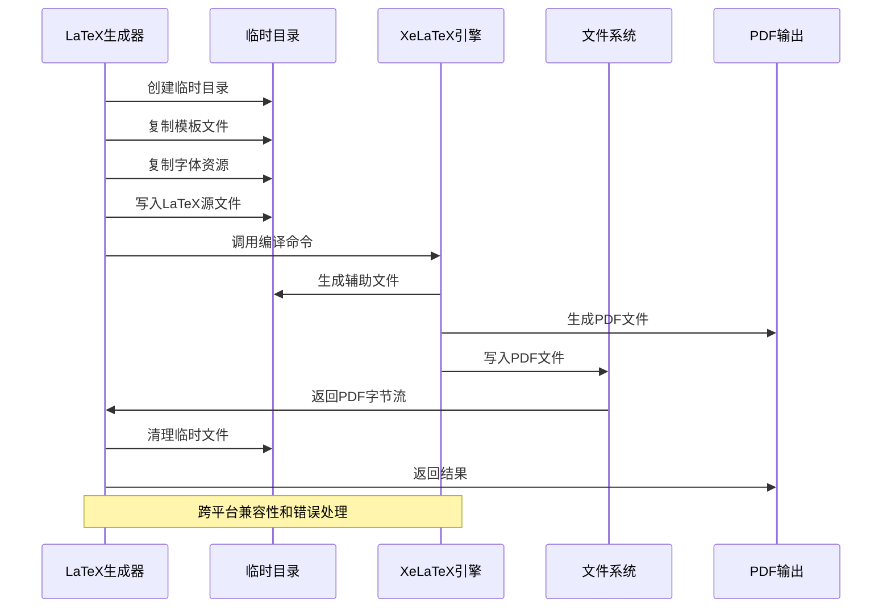
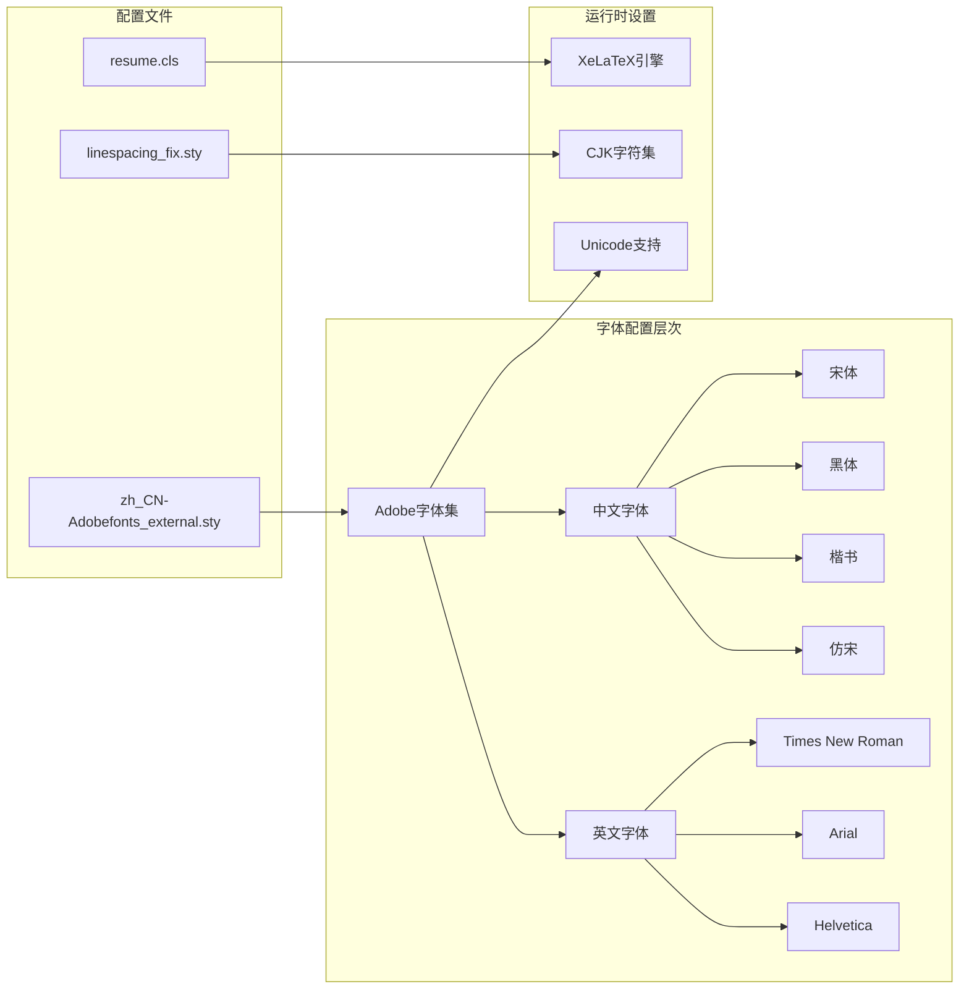
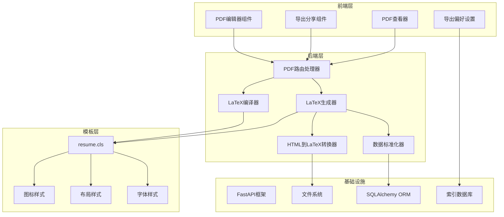

# PDF导出系统

<cite>
**本文档引用的文件**
- [latex_generator.py](file://backend/latex_generator.py)
- [latex_compiler.py](file://backend/latex_compiler.py)
- [latex_sections.py](file://backend/latex_sections.py)
- [latex_utils.py](file://backend/latex_utils.py)
- [html_to_latex.py](file://backend/html_to_latex.py)
- [json_normalizer.py](file://backend/json_normalizer.py)
- [pdf.py](file://backend/routes/pdf.py)
- [resume.cls](file://latex-resume-template/resume.cls)
- [zh_CN-Adobefonts_external.sty](file://latex-resume-template/zh_CN-Adobefonts_external.sty)
- [pdfExportPreferences.ts](file://frontend/src/services/pdfExportPreferences.ts)
- [PDFViewer.tsx](file://frontend/src/components/PDFEditor/PDFViewer.tsx)
- [pdfGenerator.ts](file://frontend/src/components/ExportShare/pdfGenerator.ts)
- [models.py](file://backend/models.py)
</cite>

## 目录
1. [引言](#引言)
2. [项目结构](#项目结构)
3. [核心组件](#核心组件)
4. [架构概览](#架构概览)
5. [详细组件分析](#详细组件分析)
6. [依赖关系分析](#依赖关系分析)
7. [性能考虑](#性能考虑)
8. [故障排除指南](#故障排除指南)
9. [结论](#结论)
10. [附录](#附录)

## 引言

PDF导出系统是一个基于LaTeX的高质量简历生成解决方案，专为ResumeAgent平台设计。该系统提供了完整的从JSON简历数据到PDF文件的自动化流水线，支持复杂的模板渲染、字体配置和跨平台兼容性。

系统的核心优势在于其模块化的架构设计，将LaTeX模板系统、数据标准化、HTML到LaTeX转换、PDF编译等关键功能分离到独立的组件中，实现了高内聚、低耦合的代码结构。通过智能的缓存机制和流式处理，系统能够在保证质量的同时提供优秀的用户体验。

## 项目结构

PDF导出系统采用分层架构设计，主要分为前端界面层、后端服务层和LaTeX模板层三个核心部分：

**图表来源**
- [pdf.py:1-380](file://backend/routes/pdf.py#L1-L380)
- [latex_generator.py:1-676](file://backend/latex_generator.py#L1-L676)
- [latex_compiler.py:1-131](file://backend/latex_compiler.py#L1-L131)

**章节来源**
- [pdf.py:1-380](file://backend/routes/pdf.py#L1-L380)
- [latex_generator.py:1-676](file://backend/latex_generator.py#L1-L676)
- [latex_compiler.py:1-131](file://backend/latex_compiler.py#L1-L131)

## 核心组件

### LaTeX生成器组件

LaTeX生成器是系统的核心组件，负责将JSON简历数据转换为LaTeX源代码。该组件实现了完整的模板渲染流程，包括数据预处理、模板选择、内容生成和后处理优化。

主要功能特性：
- **智能数据标准化**：支持中英文混合字段名，自动识别和转换简历数据结构
- **动态模板渲染**：根据全局设置动态调整字体大小、边距和行间距
- **资源管理**：自动下载和管理公司Logo、学校Logo等外部资源
- **错误处理**：提供详细的LaTeX编译错误诊断和摘要

### LaTeX编译器组件

LaTeX编译器专注于将LaTeX源代码直接编译为PDF文件，绕过了完整的简历数据处理流程，适用于直接上传LaTeX源码的场景。

核心能力：
- **原版样式支持**：完全兼容slager.link的原版样式
- **环境检测**：自动检测和配置XeLaTeX编译环境
- **资源复制**：智能复制模板文件和字体资源
- **编译优化**：提供超时控制和错误恢复机制

### 模板系统组件

模板系统基于resume.cls类文件和一系列样式配置，提供了完整的简历排版框架。系统支持多种字体配置、布局选项和样式定制。

关键特性：
- **字体配置**：支持Adobe字体集，提供中英文字体的完美结合
- **布局控制**：灵活的边距、行间距和字体大小控制
- **模块化设计**：每个简历模块都有独立的生成器和样式定义
- **跨平台兼容**：针对Windows和macOS的XeLaTeX路径优化

**章节来源**
- [latex_generator.py:261-461](file://backend/latex_generator.py#L261-L461)
- [latex_compiler.py:18-131](file://backend/latex_compiler.py#L18-L131)
- [latex_sections.py:1-800](file://backend/latex_sections.py#L1-L800)
- [resume.cls:1-125](file://latex-resume-template/resume.cls#L1-L125)

## 架构概览

PDF导出系统采用事件驱动的异步架构，通过FastAPI提供RESTful接口，支持同步和流式两种渲染模式：

**图表来源**
- [pdf.py:125-185](file://backend/routes/pdf.py#L125-L185)
- [latex_generator.py:620-676](file://backend/latex_generator.py#L620-L676)
- [latex_compiler.py:18-131](file://backend/latex_compiler.py#L18-L131)

系统架构的关键特点：
- **异步处理**：使用run_in_threadpool避免阻塞主线程
- **流式传输**：通过SSE提供实时进度反馈
- **缓存策略**：内存缓存减少重复编译开销
- **错误隔离**：每个组件都有独立的错误处理机制

## 详细组件分析

### LaTeX模板系统设计

LaTeX模板系统基于resume.cls类文件构建，提供了完整的简历排版框架。该系统支持多种布局选项和样式定制，能够适应不同行业和职位的简历需求。

**图表来源**
- [resume.cls:1-125](file://latex-resume-template/resume.cls#L1-L125)
- [zh_CN-Adobefonts_external.sty:1-32](file://latex-resume-template/zh_CN-Adobefonts_external.sty#L1-L32)

模板系统的核心设计原则：
- **模块化结构**：每个简历模块都有独立的生成逻辑
- **样式一致性**：所有模块共享相同的布局和字体规范
- **灵活性配置**：通过全局设置支持个性化的排版调整
- **国际化支持**：完整的中英文字体和字符集支持

### 模板渲染流程

模板渲染流程是PDF导出系统的核心，涉及多个步骤的复杂数据转换和处理：

**图表来源**
- [latex_generator.py:261-461](file://backend/latex_generator.py#L261-L461)
- [latex_sections.py:11-800](file://backend/latex_sections.py#L11-L800)

渲染流程的关键优化：
- **智能缓存**：基于内容哈希的内存缓存，避免重复编译
- **资源管理**：自动下载和清理外部资源，防止编译失败
- **错误恢复**：详细的错误诊断和降级处理机制
- **性能监控**：完整的性能指标收集和报告

### PDF编译过程

PDF编译过程是整个系统的技术核心，涉及LaTeX引擎调用、资源管理和错误处理等多个方面：

**图表来源**
- [latex_generator.py:463-604](file://backend/latex_generator.py#L463-L604)
- [latex_compiler.py:18-131](file://backend/latex_compiler.py#L18-L131)

编译过程的特殊处理：
- **Windows兼容**：自动搜索MiKTeX安装路径
- **环境隔离**：为XeLaTeX设置正确的PATH环境
- **超时控制**：180秒超时防止长时间挂起
- **错误摘要**：提取关键错误信息便于调试

### 字体配置系统

字体配置系统是LaTeX模板的重要组成部分，提供了完整的中英文字体支持和国际化排版能力：

**图表来源**
- [zh_CN-Adobefonts_external.sty:1-32](file://latex-resume-template/zh_CN-Adobefonts_external.sty#L1-L32)
- [resume.cls:1-125](file://latex-resume-template/resume.cls#L1-L125)

字体配置的关键特性：
- **Adobe字体集**：使用Adobe官方字体，确保专业印刷质量
- **CJK支持**：完整的中日韩字符集支持
- **字体映射**：自动字体族和字体样式的映射关系
- **性能优化**：字体缓存和延迟加载机制

**章节来源**
- [latex_generator.py:326-346](file://backend/latex_generator.py#L326-L346)
- [latex_utils.py:25-74](file://backend/latex_utils.py#L25-L74)
- [zh_CN-Adobefonts_external.sty:11-31](file://latex-resume-template/zh_CN-Adobefonts_external.sty#L11-L31)

## 依赖关系分析

PDF导出系统的依赖关系体现了清晰的分层架构和模块化设计：

**图表来源**
- [pdf.py:1-380](file://backend/routes/pdf.py#L1-L380)
- [latex_generator.py:1-676](file://backend/latex_generator.py#L1-L676)
- [latex_compiler.py:1-131](file://backend/latex_compiler.py#L1-L131)
- [json_normalizer.py:1-536](file://backend/json_normalizer.py#L1-L536)

依赖关系的特点：
- **单向依赖**：前端依赖后端，后端依赖模板层，形成清晰的调用链
- **松耦合设计**：各组件通过接口通信，降低相互依赖
- **可替换性**：模板层可以独立替换而不影响其他层
- **扩展性**：新的功能模块可以轻松集成到现有架构中

**章节来源**
- [models.py:65-71](file://backend/models.py#L65-L71)
- [pdf.py:1-380](file://backend/routes/pdf.py#L1-L380)

## 性能考虑

PDF导出系统在设计时充分考虑了性能优化，采用了多种策略来提升系统的响应速度和资源利用率：

### 缓存策略

系统实现了多层次的缓存机制，有效减少了重复计算和编译的开销：

- **内存缓存**：最多缓存50个PDF文件，基于内容哈希进行快速查找
- **智能失效**：超过缓存上限时自动清理最旧的缓存项
- **命中率优化**：通过标准化输入数据提高缓存命中率

### 并发处理

系统采用异步并发处理模式，充分利用现代硬件的多核性能：

- **线程池隔离**：LaTeX编译在独立线程池中执行，避免阻塞HTTP请求
- **流式响应**：支持SSE流式传输，提供实时进度反馈
- **超时控制**：编译操作设置合理的超时时间，防止资源泄露

### 资源管理

高效的资源管理是系统性能的关键保障：

- **临时文件清理**：编译完成后自动清理临时文件和中间产物
- **网络资源优化**：Logo和图片资源的智能下载和缓存
- **内存使用控制**：限制缓存大小和编译超时，防止内存溢出

## 故障排除指南

PDF导出系统提供了完善的错误处理和诊断机制，帮助开发者快速定位和解决问题：

### 常见问题及解决方案

**LaTeX编译失败**
- 检查XeLaTeX是否正确安装和配置
- 验证模板文件是否完整复制到临时目录
- 查看详细的错误摘要信息，重点关注!开头的错误行

**字体显示异常**
- 确认Adobe字体文件是否正确安装
- 检查CJK字符集支持是否启用
- 验证字体映射配置是否正确

**资源下载失败**
- 检查网络连接和代理设置
- 验证URL格式和访问权限
- 确认目标服务器的可用性

### 调试工具和技巧

系统提供了丰富的调试信息和诊断工具：

- **性能日志**：详细的编译时间和内存使用统计
- **错误摘要**：提取关键错误信息，便于快速定位问题
- **缓存状态**：监控缓存命中率和内存使用情况
- **网络监控**：跟踪资源下载进度和成功率

**章节来源**
- [latex_generator.py:153-179](file://backend/latex_generator.py#L153-L179)
- [latex_compiler.py:102-114](file://backend/latex_compiler.py#L102-L114)

## 结论

PDF导出系统通过精心设计的架构和实现，成功地将复杂的LaTeX编译过程封装为简单易用的服务。系统不仅提供了高质量的PDF输出，还具备良好的扩展性和维护性。

系统的主要优势包括：
- **模块化设计**：清晰的组件分离和接口定义
- **跨平台兼容**：针对不同操作系统的优化配置
- **性能优化**：多层次的缓存和并发处理机制
- **错误处理**：完善的错误诊断和恢复机制
- **用户体验**：流式处理和实时反馈的交互设计

未来的发展方向可以包括：
- **模板扩展**：支持更多样化的简历模板和样式
- **性能提升**：进一步优化编译速度和资源使用
- **功能增强**：增加更多的自定义选项和高级功能
- **集成扩展**：与其他办公软件和服务的深度集成

## 附录

### API接口规范

系统提供RESTful API接口，支持多种PDF生成和预览场景：

- **POST /api/pdf/render**：同步PDF渲染接口
- **POST /api/pdf/render/stream**：流式PDF渲染接口  
- **POST /api/pdf/compile-latex**：直接LaTeX编译接口
- **POST /api/pdf/compile-latex/stream**：流式LaTeX编译接口

### 配置选项

系统支持丰富的配置选项，用户可以根据需要调整PDF输出的各种参数：

- **字体大小**：9pt, 10pt, 11pt, 12pt
- **页面边距**：tight, compact, standard, relaxed, wide
- **行间距**：0.8-2.0之间的任意值
- **模块顺序**：自定义简历模块的显示顺序
- **样式设置**：各种视觉效果和布局选项

### 开发指南

对于想要扩展或定制系统的开发者，建议遵循以下最佳实践：

- **模块化开发**：保持组件的独立性和可测试性
- **错误处理**：为每个公共接口提供完整的错误处理
- **性能监控**：在关键路径添加性能指标收集
- **文档维护**：及时更新API文档和使用说明
- **测试覆盖**：编写全面的单元测试和集成测试