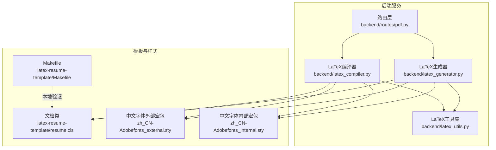
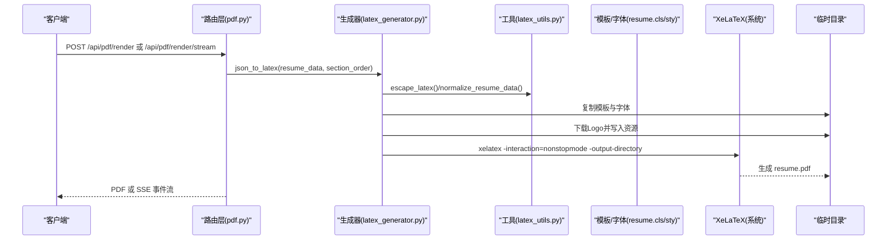
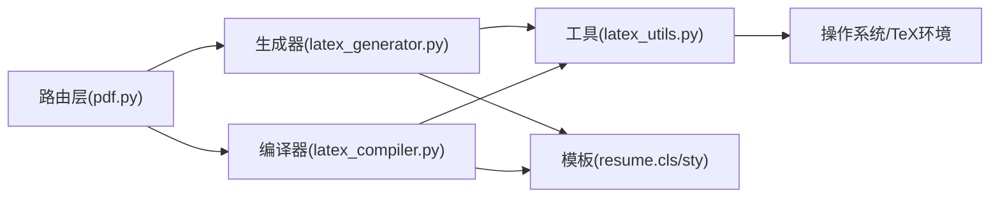
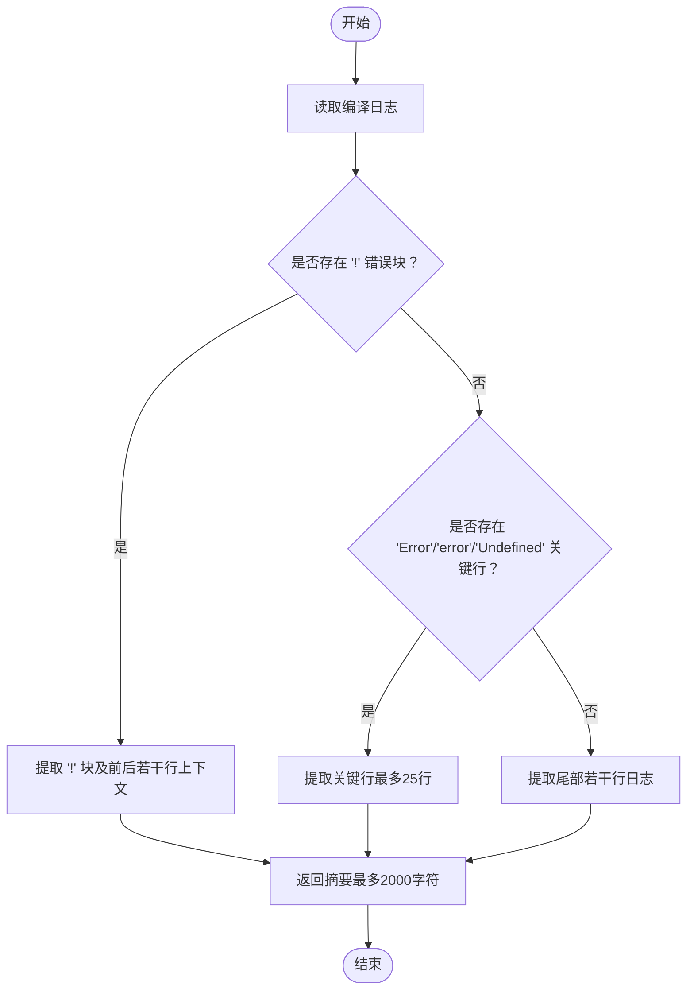

# PDF编译流程

<cite>
**本文引用的文件**
- [latex_compiler.py](file://backend/latex_compiler.py)
- [latex_generator.py](file://backend/latex_generator.py)
- [latex_utils.py](file://backend/latex_utils.py)
- [pdf.py](file://backend/routes/pdf.py)
- [Makefile](file://latex-resume-template/Makefile)
- [resume.cls](file://latex-resume-template/resume.cls)
- [zh_CN-Adobefonts_external.sty](file://latex-resume-template/zh_CN-Adobefonts_external.sty)
- [zh_CN-Adobefonts_internal.sty](file://latex-resume-template/zh_CN-Adobefonts_internal.sty)
</cite>

## 目录
1. [引言](#引言)
2. [项目结构](#项目结构)
3. [核心组件](#核心组件)
4. [架构总览](#架构总览)
5. [详细组件分析](#详细组件分析)
6. [依赖关系分析](#依赖关系分析)
7. [性能考虑](#性能考虑)
8. [故障排查指南](#故障排查指南)
9. [结论](#结论)
10. [附录](#附录)

## 引言
本文件面向需要理解与维护该仓库中“PDF编译流程”的工程师与运维人员，系统阐述基于 XeLaTeX 的编译器配置、编译环境设置、编译参数优化、临时文件管理、资源文件处理、编译过程监控、错误诊断与日志分析、故障恢复机制、跨平台兼容性、依赖检测与安装指引，以及编译性能优化、缓存策略与内存管理方案。文档以代码为依据，结合流程图与类图，帮助读者快速定位问题、优化性能并稳定交付。

## 项目结构
围绕 PDF 编译的关键文件与职责如下：
- 后端路由层：负责接收请求、触发编译、流式返回与进度事件
- LaTeX 生成与编译：负责将简历 JSON 转换为 LaTeX 源码、下载资源、复制模板、调用 XeLaTeX 编译、清理临时目录
- LaTeX 工具：提供字符转义、数据标准化、XeLaTeX 可执行路径解析与子进程环境注入
- 模板与样式：resume.cls 与中文字体样式宏包，提供字体、版式与排版能力
- 构建辅助：模板目录下的 Makefile，便于本地验证与清理

图表来源
- [pdf.py:125-380](file://backend/routes/pdf.py#L125-L380)
- [latex_generator.py:260-676](file://backend/latex_generator.py#L260-L676)
- [latex_compiler.py:18-131](file://backend/latex_compiler.py#L18-L131)
- [latex_utils.py:202-252](file://backend/latex_utils.py#L202-L252)
- [Makefile:1-26](file://latex-resume-template/Makefile#L1-L26)
- [resume.cls:1-125](file://latex-resume-template/resume.cls#L1-L125)
- [zh_CN-Adobefonts_external.sty:1-32](file://latex-resume-template/zh_CN-Adobefonts_external.sty#L1-L32)
- [zh_CN-Adobefonts_internal.sty:1-33](file://latex-resume-template/zh_CN-Adobefonts_internal.sty#L1-L33)

章节来源
- [pdf.py:125-380](file://backend/routes/pdf.py#L125-L380)
- [latex_generator.py:260-676](file://backend/latex_generator.py#L260-L676)
- [latex_compiler.py:18-131](file://backend/latex_compiler.py#L18-L131)
- [latex_utils.py:202-252](file://backend/latex_utils.py#L202-L252)
- [Makefile:1-26](file://latex-resume-template/Makefile#L1-L26)
- [resume.cls:1-125](file://latex-resume-template/resume.cls#L1-L125)
- [zh_CN-Adobefonts_external.sty:1-32](file://latex-resume-template/zh_CN-Adobefonts_external.sty#L1-L32)
- [zh_CN-Adobefonts_internal.sty:1-33](file://latex-resume-template/zh_CN-Adobefonts_internal.sty#L1-L33)

## 核心组件
- 路由层（FastAPI）：提供 /api/pdf/render、/api/pdf/render/stream、/api/pdf/compile-latex、/api/pdf/compile-latex/stream 等接口，支持同步与流式编译，返回 PDF 或 SSE 事件流。
- LaTeX 生成器：将简历 JSON 规范化、生成 LaTeX 源码、下载公司/学校 Logo、写入临时目录、调用 XeLaTeX 编译、读取 PDF 并返回。
- LaTeX 编译器：直接编译用户提供的 LaTeX 源码（slager 原版样式），复制模板与字体资源，调用 XeLaTeX，捕获错误并返回 PDF。
- LaTeX 工具集：提供 LaTeX 字符转义、简历数据标准化、XeLaTeX 可执行路径解析（含 Windows/MacOS）、子进程 PATH 注入。
- 模板与样式：resume.cls 定义文档类、版式与命令；中文字体宏包提供 Adobe 字体集配置；Makefile 提供本地编译与清理。

章节来源
- [pdf.py:125-380](file://backend/routes/pdf.py#L125-L380)
- [latex_generator.py:260-676](file://backend/latex_generator.py#L260-L676)
- [latex_compiler.py:18-131](file://backend/latex_compiler.py#L18-L131)
- [latex_utils.py:25-193](file://backend/latex_utils.py#L25-L193)
- [resume.cls:1-125](file://latex-resume-template/resume.cls#L1-L125)
- [zh_CN-Adobefonts_external.sty:1-32](file://latex-resume-template/zh_CN-Adobefonts_external.sty#L1-L32)
- [zh_CN-Adobefonts_internal.sty:1-33](file://latex-resume-template/zh_CN-Adobefonts_internal.sty#L1-L33)

## 架构总览
下图展示了从请求到 PDF 输出的端到端流程，包括同步与流式两种路径。

图表来源
- [pdf.py:125-380](file://backend/routes/pdf.py#L125-L380)
- [latex_generator.py:260-676](file://backend/latex_generator.py#L260-L676)
- [latex_utils.py:25-193](file://backend/latex_utils.py#L25-L193)
- [resume.cls:1-125](file://latex-resume-template/resume.cls#L1-L125)
- [zh_CN-Adobefonts_external.sty:1-32](file://latex-resume-template/zh_CN-Adobefonts_external.sty#L1-L32)
- [zh_CN-Adobefonts_internal.sty:1-33](file://latex-resume-template/zh_CN-Adobefonts_internal.sty#L1-L33)

## 详细组件分析

### 路由层（PDF 渲染与编译）
- 同步渲染：在线程池中准备 LaTeX 源码并编译，返回 PDF 流响应，附带渲染耗时与配额信息头。
- 流式渲染：SSE 分阶段推送“开始”“进度”“PDF 数据”“配额”等事件，便于前端实时反馈。
- 直接编译：接收用户提供的 LaTeX 源码，按 slager 原版样式编译，返回 PDF。
- 错误处理：捕获业务异常与系统异常，统一包装为 HTTP 500，并打印跟踪日志。

章节来源
- [pdf.py:125-380](file://backend/routes/pdf.py#L125-L380)

### LaTeX 生成器（JSON → LaTeX → PDF）
- 数据预处理：标准化简历字段名，转义 LaTeX 特殊字符，合并联系信息，处理年龄/生日展示模式，去除不支持的学校 Logo。
- 模板与资源：复制 resume.cls、sty 与 fonts 目录；下载公司/学校 Logo 至临时目录；必要时降级无照片渲染。
- 编译参数：使用 -interaction=nonstopmode，超时 180 秒；注入 PATH 使 kpsewhich 等工具可见。
- 错误摘要：提取关键错误行（!、Error、Undefined）与尾部日志，提升可读性。
- 性能监控：统计 JSON→LaTeX、LaTeX→PDF、总耗时；内存缓存最多 50 条结果，LRU 替换。

章节来源
- [latex_generator.py:260-676](file://backend/latex_generator.py#L260-L676)

### LaTeX 编译器（raw LaTeX → PDF）
- 用途：直接编译用户提交的 LaTeX 源码，复用模板与字体资源，调用 XeLaTeX，捕获并提炼错误信息，清理临时目录。
- 适用场景：与 slager.link 完全一致的原版样式渲染。

章节来源
- [latex_compiler.py:18-131](file://backend/latex_compiler.py#L18-L131)

### LaTeX 工具集（转义、标准化、路径解析）
- 字符转义：HTML 标签清理、换行处理、特殊字符转义、加粗标记转换，确保命令参数安全。
- 数据标准化：中英字段名映射、联系信息合并、嵌套结构递归处理。
- 跨平台路径解析：优先 PATH，macOS 枚举 TeX 安装路径，Windows 枚举 MiKTeX 常见路径；子进程注入 PATH 保证 kpsewhich 等工具可用。

章节来源
- [latex_utils.py:25-193](file://backend/latex_utils.py#L25-L193)
- [latex_utils.py:202-252](file://backend/latex_utils.py#L202-L252)

### 模板与样式（版式与字体）
- 文档类：定义字体大小选项、版式、标题与列表样式、时间列固定宽度等。
- 中文字体宏包：配置 Adobe 字体集，设置中/英/等宽字体族与常用命令。
- Makefile：提供本地一键编译与清理，便于验证模板与字体。

章节来源
- [resume.cls:1-125](file://latex-resume-template/resume.cls#L1-L125)
- [zh_CN-Adobefonts_external.sty:1-32](file://latex-resume-template/zh_CN-Adobefonts_external.sty#L1-L32)
- [zh_CN-Adobefonts_internal.sty:1-33](file://latex-resume-template/zh_CN-Adobefonts_internal.sty#L1-L33)
- [Makefile:1-26](file://latex-resume-template/Makefile#L1-L26)

## 依赖关系分析

图表来源
- [pdf.py:125-380](file://backend/routes/pdf.py#L125-L380)
- [latex_generator.py:260-676](file://backend/latex_generator.py#L260-L676)
- [latex_compiler.py:18-131](file://backend/latex_compiler.py#L18-L131)
- [latex_utils.py:202-252](file://backend/latex_utils.py#L202-L252)
- [resume.cls:1-125](file://latex-resume-template/resume.cls#L1-L125)
- [zh_CN-Adobefonts_external.sty:1-32](file://latex-resume-template/zh_CN-Adobefonts_external.sty#L1-L32)
- [zh_CN-Adobefonts_internal.sty:1-33](file://latex-resume-template/zh_CN-Adobefonts_internal.sty#L1-L33)

章节来源
- [pdf.py:125-380](file://backend/routes/pdf.py#L125-L380)
- [latex_generator.py:260-676](file://backend/latex_generator.py#L260-L676)
- [latex_compiler.py:18-131](file://backend/latex_compiler.py#L18-L131)
- [latex_utils.py:202-252](file://backend/latex_utils.py#L202-L252)

## 性能考虑
- 编译超时：默认 180 秒，适用于大多数简历编译场景；首次安装 MiKTeX 包时可适当放宽。
- 编译参数：使用 -interaction=nonstopmode，避免交互阻塞；输出目录指定到临时目录，减少 IO 干扰。
- 缓存策略：内存缓存最多 50 条，采用 MD5(key) 作为索引，按访问顺序维护队列，满额时淘汰最旧条目；命中即返回 BytesIO，显著降低重复渲染成本。
- 资源下载：Logo 与照片按需下载至临时目录，避免重复下载；若下载失败自动降级为无资源渲染。
- 字符转义与数据清洗：在生成 LaTeX 前进行转义与清洗，减少编译期错误重试成本。

章节来源
- [latex_generator.py:570-580](file://backend/latex_generator.py#L570-L580)
- [latex_generator.py:606-676](file://backend/latex_generator.py#L606-L676)
- [latex_utils.py:25-74](file://backend/latex_utils.py#L25-L74)

## 故障排查指南

### 依赖与环境
- XeLaTeX 未找到
  - 现象：抛出“xelatex 命令未找到”并附带安装提示。
  - 排查：确认 PATH 是否包含 TeX 发行版 bin 目录；macOS 常见路径为 /usr/local/texlive/* 或 /Library/TeX/texbin；Windows 常见路径为 MiKTeX 安装目录。
  - 解决：按提示安装 BasicTeX 或 MacTeX（macOS）；或安装完整版 MacTeX；重启终端或执行 eval "$(/usr/libexec/path_helper)"。
- 子进程无法找到 kpsewhich
  - 现象：宏包解析失败或字体资源无法定位。
  - 排查：确认子进程环境变量 PATH 前置了 xelatex 所在目录。
  - 解决：使用工具函数注入 PATH，确保同目录工具可见。

章节来源
- [latex_compiler.py:64-82](file://backend/latex_compiler.py#L64-L82)
- [latex_generator.py:543-561](file://backend/latex_generator.py#L543-L561)
- [latex_utils.py:245-252](file://backend/latex_utils.py#L245-L252)

### 编译错误与日志
- 错误提取策略
  - 优先提取包含 “!” 的错误块及其前后若干行上下文；
  - 否则提取包含 “Error”、“error”、“Undefined” 的关键行；
  - 最后兜底返回尾部若干行日志，通常最接近失败原因。
- 常见错误类型
  - 字符转义不当：如未转义的 &、%、#、_、{、}、~、^、\ 等；
  - 图片/资源缺失：includegraphics 指向不存在文件（降级为无资源渲染）；
  - 字体/宏包缺失：MiKTeX 首次安装包时会延时，建议增加超时或允许首次安装时间。
- 日志与追踪
  - 路由层打印 trace_id、用户信息、会话与来源、耗时、字节数等；
  - 流式接口通过 SSE 推送“start”“progress”“pdf”“error”事件，便于前端实时反馈。

章节来源
- [latex_generator.py:153-179](file://backend/latex_generator.py#L153-L179)
- [latex_generator.py:581-586](file://backend/latex_generator.py#L581-L586)
- [pdf.py:145-184](file://backend/routes/pdf.py#L145-L184)
- [pdf.py:204-299](file://backend/routes/pdf.py#L204-L299)

### 临时文件与资源管理
- 临时目录
  - 生成器与编译器均在系统临时目录创建临时目录，写入 resume.tex、模板与字体、资源文件，编译完成后删除。
- 资源文件处理
  - 公司/学校 Logo 下载至 logos/ 子目录；照片下载为 photo.*；若下载失败自动降级。
- 清理策略
  - finally 块中统一删除临时目录，忽略错误；模板与字体复制失败会打印警告。

章节来源
- [latex_generator.py:475-604](file://backend/latex_generator.py#L475-L604)
- [latex_compiler.py:40-130](file://backend/latex_compiler.py#L40-L130)

### 跨平台兼容性
- macOS：优先 PATH，若未找到则枚举 /usr/local/texlive/* 与 /Library/TeX/texbin 等常见路径。
- Windows：优先 PATH，若未找到则枚举 LOCALAPPDATA 与 ProgramFiles 下的 MiKTeX 安装路径。
- 子进程环境：将 xelatex 所在目录前置到 PATH，确保 kpsewhich 等工具可见。

章节来源
- [latex_utils.py:202-242](file://backend/latex_utils.py#L202-L242)
- [latex_utils.py:245-252](file://backend/latex_utils.py#L245-L252)

### 依赖检测与安装指引
- macOS（Homebrew）
  - BasicTeX（推荐，体积小）：brew install --cask basictex；随后执行 eval "$(/usr/libexec/path_helper)"。
  - MacTeX（完整发行版）：brew install --cask mactex。
- Windows（MiKTeX）
  - 安装 MiKTeX，确保其 bin 目录进入 PATH；若仍不可用，使用工具函数解析并注入 PATH。
- Linux（可选）
  - 可通过发行版包管理器安装 TeX Live；确保 xelatex 与字体宏包可用。

章节来源
- [latex_compiler.py:68-81](file://backend/latex_compiler.py#L68-L81)
- [latex_generator.py:547-559](file://backend/latex_generator.py#L547-L559)
- [latex_utils.py:202-242](file://backend/latex_utils.py#L202-L242)

## 结论
该 PDF 编译流程以 FastAPI 路由层为入口，依托 LaTeX 生成器与编译器完成从简历 JSON 到 PDF 的端到端转换。通过严格的字符转义、资源下载与降级策略、跨平台 XeLaTeX 路径解析、子进程环境注入、错误摘要与流式事件推送，实现了高可靠性与可观测性。配合内存缓存与超时控制，可在保证质量的同时兼顾性能与稳定性。建议在生产环境中：
- 明确 TeX 发行版安装与 PATH 配置；
- 监控编译耗时与错误率，适时调整超时与缓存容量；
- 对于首次 MiKTeX 安装场景，预留足够时间或放宽超时；
- 使用 Makefile 进行本地模板验证与清理，确保字体与宏包一致性。

## 附录

### 关键流程图：LaTeX 编译错误提取

图表来源
- [latex_generator.py:153-179](file://backend/latex_generator.py#L153-L179)