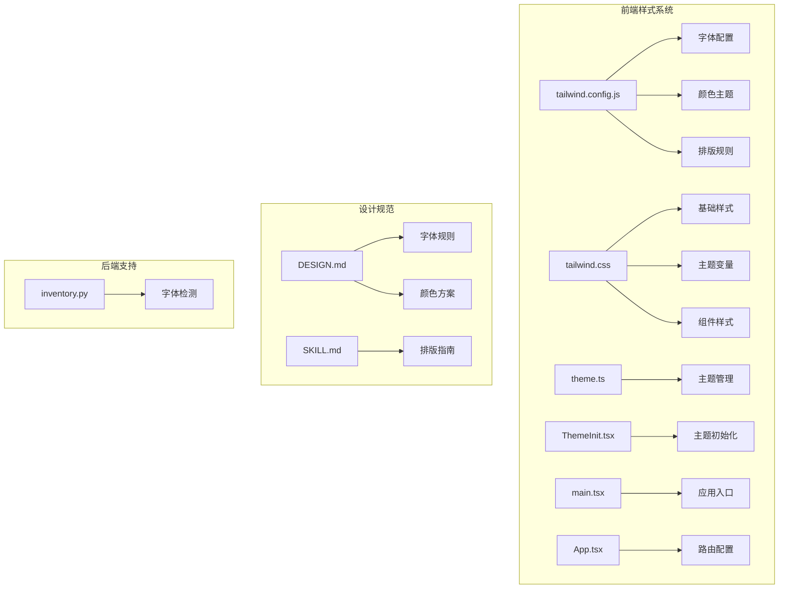
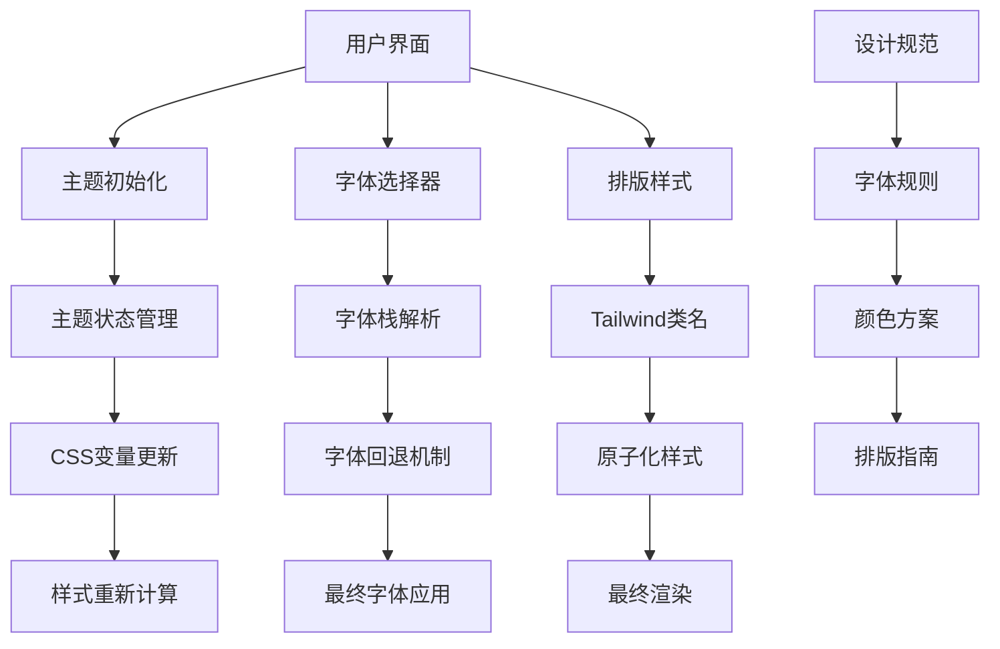
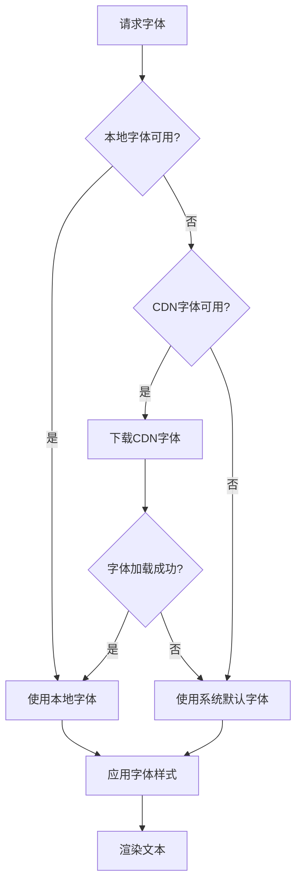
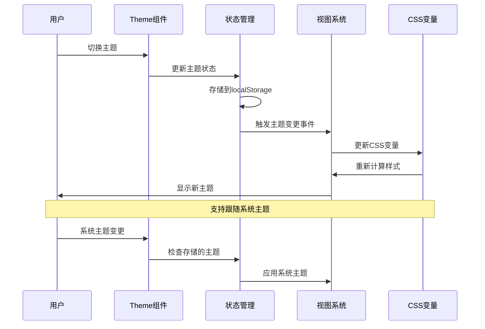
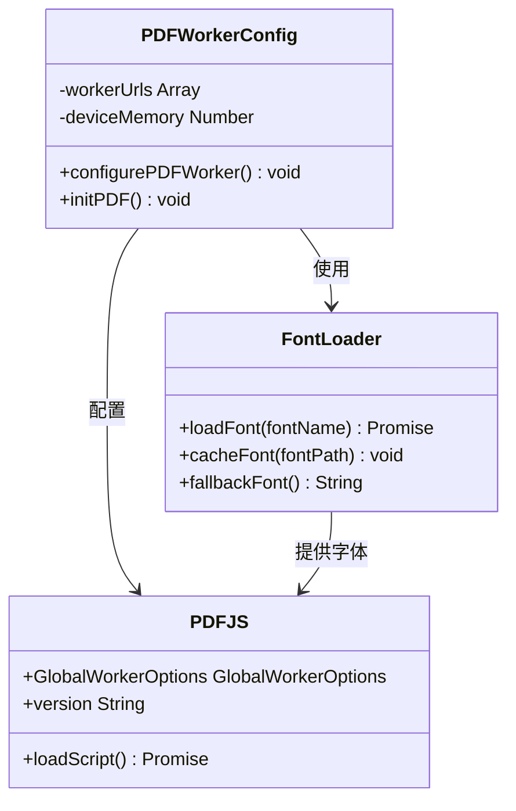

# 字体与样式系统

<cite>
**本文档引用的文件**
- [tailwind.config.js](file://frontend/tailwind.config.js)
- [tailwind.css](file://frontend/src/tailwind.css)
- [theme.ts](file://frontend/src/lib/theme.ts)
- [ThemeInit.tsx](file://frontend/src/components/ThemeInit.tsx)
- [main.tsx](file://frontend/src/main.tsx)
- [App.tsx](file://frontend/src/App.tsx)
- [pdfWorkerConfig.ts](file://frontend/src/components/PDFEditor/pdfWorkerConfig.ts)
- [DESIGN.md](file://.agents/skills/stitch-design-taste/DESIGN.md)
- [SKILL.md](file://.agents/skills/stitch-design-taste/SKILL.md)
- [inventory.py](file://backend/agent/skills/office-files/pptx/scripts/inventory.py)
</cite>

## 目录
1. [简介](#简介)
2. [项目结构](#项目结构)
3. [核心组件](#核心组件)
4. [架构概览](#架构概览)
5. [详细组件分析](#详细组件分析)
6. [依赖关系分析](#依赖关系分析)
7. [性能考虑](#性能考虑)
8. [故障排除指南](#故障排除指南)
9. [结论](#结论)
10. [附录](#附录)

## 简介

ResumeAgent项目采用了一套完整的字体与样式系统，旨在提供跨平台的一致用户体验。该系统结合了现代前端技术栈和设计规范，实现了中文字体的优雅支持、主题化样式管理和高性能的渲染机制。

系统的核心特点包括：
- 基于Tailwind CSS的原子化样式架构
- 支持中文字体的渐进式回退机制
- 动态主题切换系统
- PDF渲染优化配置
- 设计系统化的排版规范

## 项目结构

字体与样式系统主要分布在以下目录中：



**图表来源**
- [tailwind.config.js:1-129](file://frontend/tailwind.config.js#L1-L129)
- [tailwind.css:1-270](file://frontend/src/tailwind.css#L1-L270)
- [theme.ts:1-46](file://frontend/src/lib/theme.ts#L1-L46)

**章节来源**
- [tailwind.config.js:1-129](file://frontend/tailwind.config.js#L1-L129)
- [tailwind.css:1-270](file://frontend/src/tailwind.css#L1-L270)
- [theme.ts:1-46](file://frontend/src/lib/theme.ts#L1-L46)

## 核心组件

### 字体配置系统

系统采用多层次的字体配置策略，确保在不同平台和环境下都能获得最佳的显示效果：

#### 中文字体栈配置
- **显示字体**: Noto Sans SC → PingFang SC → Hiragino Sans GB → Microsoft YaHei UI → Microsoft YaHei → sans-serif
- **正文字体**: Noto Sans SC → PingFang SC → Hiragino Sans GB → Microsoft YaHei UI → sans-serif  
- **中文衬线字体**: Songti SC → STSong → Source Han Serif SC → Noto Serif SC → SimSun → serif

#### 字体回退机制
系统实现了智能的字体回退策略，从最优质的本地字体开始，逐步降级到通用字体族，确保在任何环境下都有合适的字体显示。

**章节来源**
- [tailwind.config.js:22-47](file://frontend/tailwind.config.js#L22-L47)

### 主题管理系统

系统提供了完整的主题切换功能，支持亮色、暗色和跟随系统三种模式：

#### 主题状态管理
- 使用localStorage存储用户偏好设置
- 支持系统主题跟随功能
- 实时主题切换事件通知

#### CSS变量主题系统
通过CSS自定义属性实现主题的动态切换，包括背景色、前景色、边框色等所有UI元素的颜色变化。

**章节来源**
- [theme.ts:1-46](file://frontend/src/lib/theme.ts#L1-L46)
- [tailwind.css:92-148](file://frontend/src/tailwind.css#L92-L148)

### 排版样式系统

基于Tailwind CSS的原子化设计原则，系统提供了丰富的排版样式选项：

#### Markdown增强样式
- 统一的段落间距和行高
- 代码块的特殊样式处理
- 列表项的自定义标记颜色

#### Typographic插件集成
通过@tailwindcss/typography插件，系统获得了专业的排版样式支持，包括标题层级、引用格式、表格样式等。

**章节来源**
- [tailwind.css:205-270](file://frontend/src/tailwind.css#L205-L270)
- [tailwind.config.js:93-104](file://frontend/tailwind.config.js#L93-L104)

## 架构概览



**图表来源**
- [ThemeInit.tsx:1-27](file://frontend/src/components/ThemeInit.tsx#L1-L27)
- [theme.ts:1-46](file://frontend/src/lib/theme.ts#L1-L46)
- [tailwind.config.js:22-47](file://frontend/tailwind.config.js#L22-L47)

## 详细组件分析

### 字体回退机制分析



**图表来源**
- [tailwind.config.js:22-47](file://frontend/tailwind.config.js#L22-L47)

系统实现了多层字体回退机制，确保在各种环境下都能获得最佳的字体显示效果。从本地字体到CDN字体，再到系统默认字体，形成了完整的字体加载链路。

**章节来源**
- [tailwind.config.js:22-47](file://frontend/tailwind.config.js#L22-L47)

### 主题切换流程分析



**图表来源**
- [ThemeInit.tsx:1-27](file://frontend/src/components/ThemeInit.tsx#L1-L27)
- [theme.ts:33-45](file://frontend/src/lib/theme.ts#L33-L45)

**章节来源**
- [ThemeInit.tsx:1-27](file://frontend/src/components/ThemeInit.tsx#L1-L27)
- [theme.ts:12-45](file://frontend/src/lib/theme.ts#L12-L45)

### PDF字体渲染优化



**图表来源**
- [pdfWorkerConfig.ts:1-43](file://frontend/src/components/PDFEditor/pdfWorkerConfig.ts#L1-L43)

**章节来源**
- [pdfWorkerConfig.ts:1-43](file://frontend/src/components/PDFEditor/pdfWorkerConfig.ts#L1-L43)

## 依赖关系分析

```mermaid
graph LR
A[tailwind.config.js] --> B[fontFamily配置]
A --> C[color配置]
A --> D[typography插件]
E[tailwind.css] --> F[基础样式]
E --> G[主题变量]
E --> H[组件样式]
I[theme.ts] --> J[主题常量]
I --> K[主题函数]
L[ThemeInit.tsx] --> I : 依赖
M[main.tsx] --> L : 引用
N[App.tsx] --> M : 启动
O[DESIGN.md] --> P[字体规则]
O --> Q[颜色方案]
R[SKILL.md] --> S[排版指南]
```

**图表来源**
- [tailwind.config.js:1-129](file://frontend/tailwind.config.js#L1-L129)
- [tailwind.css:1-270](file://frontend/src/tailwind.css#L1-L270)
- [theme.ts:1-46](file://frontend/src/lib/theme.ts#L1-L46)

**章节来源**
- [tailwind.config.js:1-129](file://frontend/tailwind.config.js#L1-L129)
- [tailwind.css:1-270](file://frontend/src/tailwind.css#L1-L270)
- [theme.ts:1-46](file://frontend/src/lib/theme.ts#L1-L46)

## 性能考虑

### 字体加载优化策略

1. **CDN加速**: 系统配置了多个CDN源点，包括jsDelivr和unpkg，确保字体资源的快速访问
2. **缓存机制**: 利用浏览器缓存和CDN缓存减少重复加载
3. **渐进式回退**: 从高质量字体到通用字体的渐进式降级，避免阻塞渲染

### 渲染性能优化

1. **CSS变量主题**: 通过CSS自定义属性实现主题切换，避免重排重绘
2. **原子化样式**: Tailwind CSS的原子化设计减少了CSS文件大小
3. **懒加载组件**: 主题初始化组件采用懒加载策略

### 移动端适配

1. **低内存设备优化**: 检测设备内存容量，自动调整PDF渲染参数
2. **响应式字体**: 使用clamp()函数实现流式字体缩放
3. **触摸友好的交互**: 优化按钮和链接的触摸目标尺寸

## 故障排除指南

### 字体显示问题

**问题症状**: 文本显示为方块或默认字体
**可能原因**:
1. 字体文件加载失败
2. 字体格式不被支持
3. 字体路径配置错误

**解决步骤**:
1. 检查网络连接和CDN可达性
2. 验证字体文件的完整性和正确性
3. 确认字体回退链路的配置

### 主题切换异常

**问题症状**: 主题切换后样式未更新
**可能原因**:
1. localStorage访问受限
2. CSS变量更新失败
3. 事件监听器未正确绑定

**解决步骤**:
1. 检查浏览器的localStorage设置
2. 验证CSS变量的语法正确性
3. 确认事件监听器的生命周期管理

### PDF渲染问题

**问题症状**: PDF页面显示异常或渲染缓慢
**可能原因**:
1. Web Worker加载失败
2. 字体资源加载超时
3. 内存不足导致渲染中断

**解决步骤**:
1. 检查Web Worker的脚本路径
2. 验证字体资源的可用性
3. 监控内存使用情况并进行优化

**章节来源**
- [pdfWorkerConfig.ts:9-38](file://frontend/src/components/PDFEditor/pdfWorkerConfig.ts#L9-L38)
- [ThemeInit.tsx:5-24](file://frontend/src/components/ThemeInit.tsx#L5-L24)

## 结论

ResumeAgent项目的字体与样式系统展现了现代前端开发的最佳实践。通过精心设计的字体回退机制、灵活的主题管理系统和优化的渲染策略，系统在保证视觉一致性的同时，也确保了良好的性能表现。

系统的主要优势包括：
- 完善的中文字体支持和回退机制
- 灵活且可扩展的主题系统
- 高性能的样式渲染架构
- 详细的故障排除和调试机制

未来可以考虑的方向包括：
- 进一步优化字体加载策略
- 增强主题系统的可定制性
- 扩展更多平台的字体支持

## 附录

### 字体配置参考

| 字体类别 | 配置名称 | 字体栈 |
|---------|----------|--------|
| 显示字体 | hero | Noto Sans SC, PingFang SC, Hiragino Sans GB, Microsoft YaHei UI, Microsoft YaHei, sans-serif |
| 正文字体 | chat | Noto Sans SC, PingFang SC, Hiragino Sans GB, Microsoft YaHei UI, sans-serif |
| 中文衬线 | serifcn | Songti SC, STSong, Source Han Serif SC, Noto Serif SC, SimSun, serif |

### 主题配置选项

| 主题模式 | 描述 | 适用场景 |
|---------|------|----------|
| light | 亮色主题 | 日间使用、高对比度需求 |
| dark | 暗色主题 | 夜间使用、护眼需求 |
| system | 跟随系统 | 用户偏好设置、系统集成 |

### 设计规范要点

1. **字体选择**: 优先使用Geist、Satoshi、Cabinet Grotesk等现代无衬线字体
2. **颜色搭配**: 严格遵循设计系统中的色彩规范，避免使用纯黑和过度饱和的颜色
3. **排版规则**: 控制行高和字间距，确保良好的阅读体验
4. **响应式设计**: 字体大小应根据屏幕尺寸自适应调整