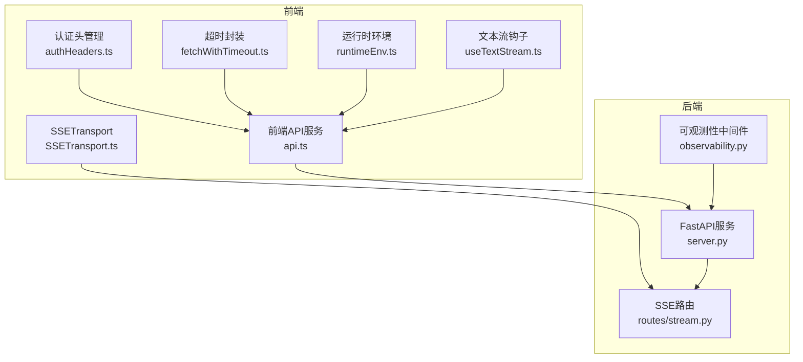
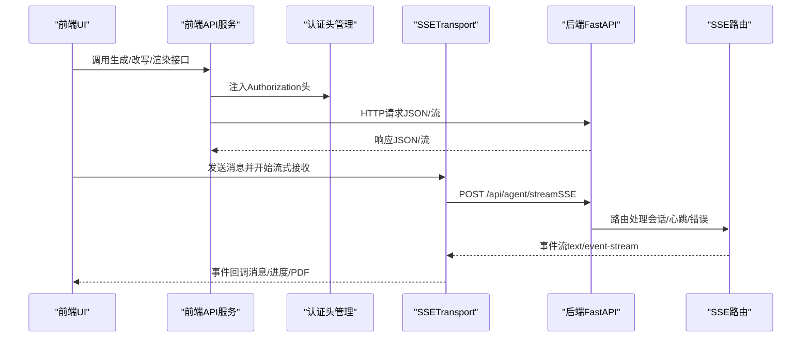
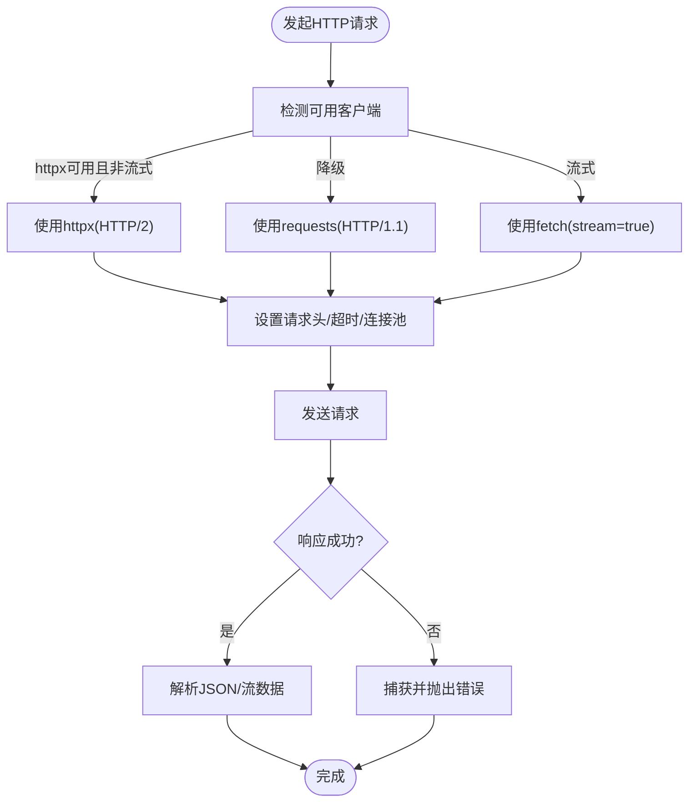
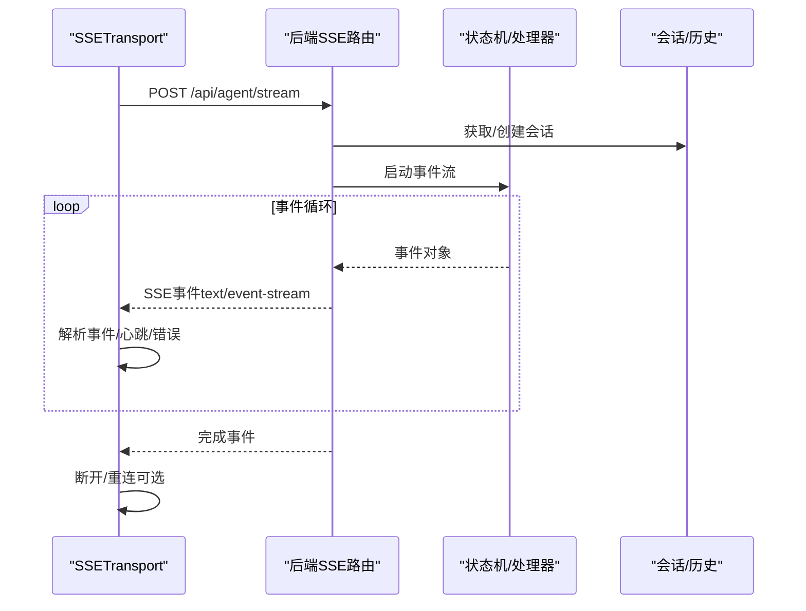
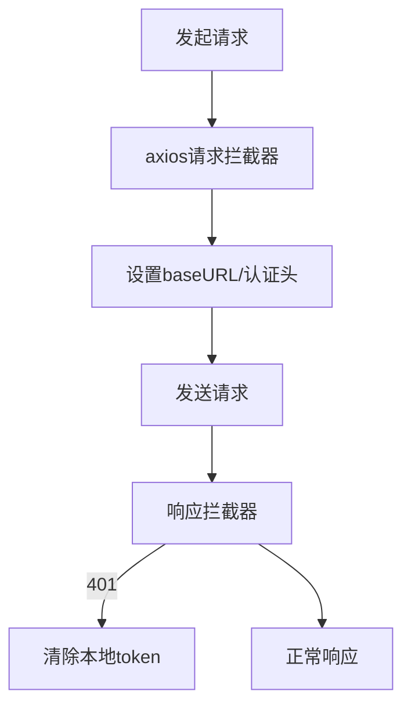
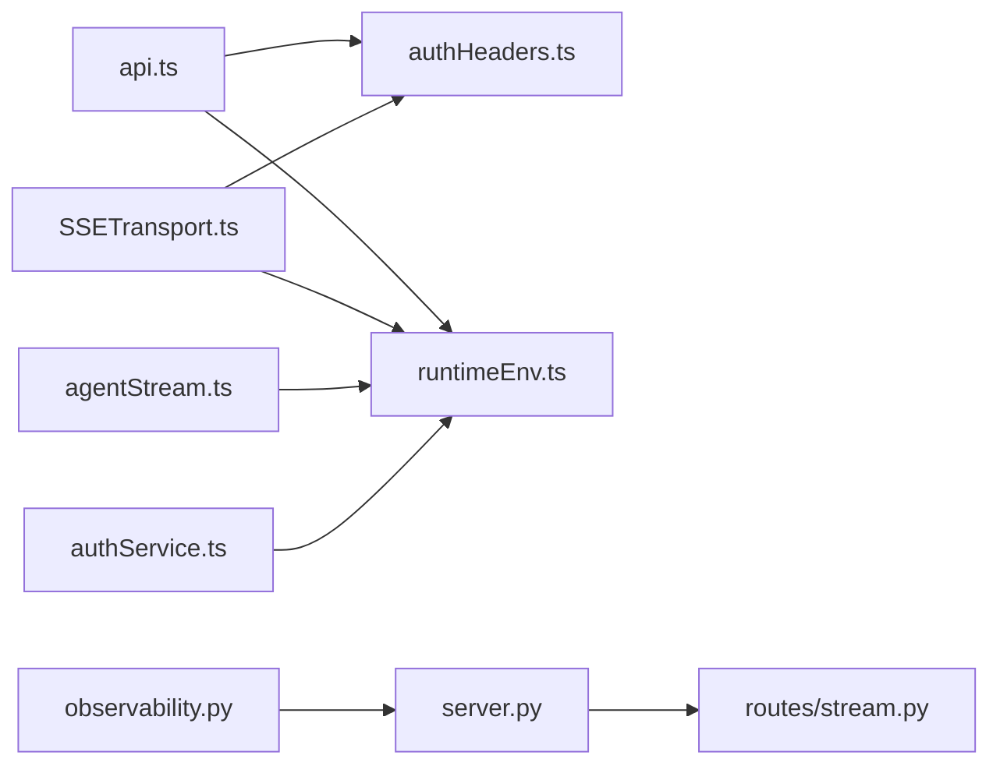

# API通信机制

<cite>
**本文档引用的文件**
- [backend/http_client.py](file://backend/http_client.py)
- [frontend/src/lib/fetchWithTimeout.ts](file://frontend/src/lib/fetchWithTimeout.ts)
- [frontend/src/lib/configureAuthWebRequests.ts](file://frontend/src/lib/configureAuthWebRequests.ts)
- [frontend/src/transports/SSETransport.ts](file://frontend/src/transports/SSETransport.ts)
- [frontend/src/services/api.ts](file://frontend/src/services/api.ts)
- [frontend/src/lib/authHeaders.ts](file://frontend/src/lib/authHeaders.ts)
- [frontend/src/services/agentStream.ts](file://frontend/src/services/agentStream.ts)
- [frontend/src/hooks/useTextStream.ts](file://frontend/src/hooks/useTextStream.ts)
- [backend/agent/web/server.py](file://backend/agent/web/server.py)
- [backend/agent/web/routes/stream.py](file://backend/agent/web/routes/stream.py)
- [frontend/src/lib/runtimeEnv.ts](file://frontend/src/lib/runtimeEnv.ts)
- [frontend/src/services/authService.ts](file://frontend/src/services/authService.ts)
- [backend/middleware/observability.py](file://backend/middleware/observability.py)
</cite>

## 目录
1. [简介](#简介)
2. [项目结构](#项目结构)
3. [核心组件](#核心组件)
4. [架构总览](#架构总览)
5. [详细组件分析](#详细组件分析)
6. [依赖关系分析](#依赖关系分析)
7. [性能考虑](#性能考虑)
8. [故障排查指南](#故障排查指南)
9. [结论](#结论)
10. [附录](#附录)

## 简介
本文件系统性梳理 ResumeAgent 项目的 API 通信机制，涵盖 HTTP 请求封装、API 客户端设计、错误处理策略、SSE 流式传输、WebSocket 替代方案、实时数据更新机制、请求/响应拦截器、认证头管理、超时与重试、缓存策略、并发控制与取消、网络状态监控、调试与性能监控、错误追踪等。文档面向不同技术背景读者，既提供高层概览也包含代码级细节与可视化图示。

## 项目结构
项目采用前后端分离架构：
- 前端使用 TypeScript/React，通过 fetch/axios 与后端交互，内置 SSETransport 实现稳定实时流。
- 后端基于 FastAPI，提供 SSE 流式端点与常规 HTTP API，并集成可观测性中间件。

**图表来源**
- [frontend/src/services/api.ts](file://frontend/src/services/api.ts)
- [frontend/src/transports/SSETransport.ts](file://frontend/src/transports/SSETransport.ts)
- [frontend/src/lib/authHeaders.ts](file://frontend/src/lib/authHeaders.ts)
- [frontend/src/lib/fetchWithTimeout.ts](file://frontend/src/lib/fetchWithTimeout.ts)
- [frontend/src/lib/runtimeEnv.ts](file://frontend/src/lib/runtimeEnv.ts)
- [frontend/src/hooks/useTextStream.ts](file://frontend/src/hooks/useTextStream.ts)
- [backend/agent/web/server.py](file://backend/agent/web/server.py)
- [backend/agent/web/routes/stream.py](file://backend/agent/web/routes/stream.py)
- [backend/middleware/observability.py](file://backend/middleware/observability.py)

**章节来源**
- [frontend/src/services/api.ts](file://frontend/src/services/api.ts)
- [frontend/src/transports/SSETransport.ts](file://frontend/src/transports/SSETransport.ts)
- [backend/agent/web/server.py](file://backend/agent/web/server.py)
- [backend/agent/web/routes/stream.py](file://backend/agent/web/routes/stream.py)

## 核心组件
- HTTP 客户端与连接优化：后端提供高性能 HTTP/2 客户端（httpx），支持 DNS 预解析、连接池复用、压缩与降级方案（requests）。
- 前端 API 服务：统一封装 axios/fetch，集中处理认证头、错误解析、PDF 渲染流、SSE 流等。
- SSETransport：自研稳定可靠的 SSE 客户端，具备心跳检测、自动重连、事件解析、错误监听与断开控制。
- 认证与拦截器：前端 axios 拦截器统一注入认证头；fetch 超时封装；认证 Web 代理自动注入 withCredentials。
- 后端 SSE 路由：FastAPI 提供 /api/agent/stream，支持心跳、会话管理、并发保护、错误映射与清理。
- 可观测性：请求/错误日志、链路 span、异常兜底处理，异步落库避免阻塞。

**章节来源**
- [backend/http_client.py](file://backend/http_client.py)
- [frontend/src/services/api.ts](file://frontend/src/services/api.ts)
- [frontend/src/transports/SSETransport.ts](file://frontend/src/transports/SSETransport.ts)
- [frontend/src/lib/configureAuthWebRequests.ts](file://frontend/src/lib/configureAuthWebRequests.ts)
- [backend/agent/web/routes/stream.py](file://backend/agent/web/routes/stream.py)
- [backend/middleware/observability.py](file://backend/middleware/observability.py)

## 架构总览
前端通过统一 API 服务与后端交互，SSETransport 专用于实时流式对话；后端 SSE 路由负责会话生命周期管理与事件流产出；可观测性中间件贯穿请求全链路。

**图表来源**
- [frontend/src/services/api.ts](file://frontend/src/services/api.ts)
- [frontend/src/transports/SSETransport.ts](file://frontend/src/transports/SSETransport.ts)
- [backend/agent/web/server.py](file://backend/agent/web/server.py)
- [backend/agent/web/routes/stream.py](file://backend/agent/web/routes/stream.py)

## 详细组件分析

### HTTP 请求封装与客户端设计
- 后端高性能客户端
  - 优先使用 httpx(HTTP/2)：多路复用、头部压缩、服务器推送；配置超时、连接池上限与 keepalive。
  - DNS 预解析：提前解析常用 API 主机，降低首包延迟。
  - 降级方案：无 httpx 时使用 requests，启用连接池与重试。
  - 统一调用接口：支持同步/异步/流式调用，自动选择最佳实现。
- 前端 API 服务
  - axios/fetch 双栈：通用接口统一走 axios，部分场景（如流式渲染）使用原生 fetch。
  - 认证头注入：getAuthHeaders 自动从 localStorage 读取 auth_token，统一添加 Authorization。
  - 错误解析：parseApiErrorDetail 统一解析后端错误体，兼容多种字段结构。
  - PDF 渲染流：支持非流式与流式两种模式，流式模式解析 SSE 事件（progress/pdf/error）。
  - 文本流式：rewriteResumeStream/compileLatexStream 等接口使用 fetch + ReadableStream 解析 SSE。

**图表来源**
- [backend/http_client.py](file://backend/http_client.py)
- [frontend/src/services/api.ts](file://frontend/src/services/api.ts)
- [frontend/src/lib/authHeaders.ts](file://frontend/src/lib/authHeaders.ts)

**章节来源**
- [backend/http_client.py](file://backend/http_client.py)
- [frontend/src/services/api.ts](file://frontend/src/services/api.ts)
- [frontend/src/lib/authHeaders.ts](file://frontend/src/lib/authHeaders.ts)

### SSE 流式传输实现
- 前端 SSETransport
  - 连接管理：AbortController 控制断开；心跳检测（默认60s）；自动重连（指数退避，最多N次）。
  - 事件解析：按行解析 SSE 格式（id/event/data），支持心跳事件过滤，其余事件转为统一格式。
  - 会话状态：维护 conversation_id、lastEventId、resumeData；支持清会话、续聊。
  - 回调机制：onMessage/onError/onConnect/onDisconnect；事件派发与错误监听。
- 后端 SSE 路由
  - 会话生命周期：按 conversation_id 管理会话，内存缓存 + TTL 清理；并发保护：同一会话仅允许一个活跃流。
  - 心跳机制：后端每55s发送一次心跳，前端心跳超时触发重连。
  - 错误映射：根据异常类型映射为用户可读提示（余额不足/网络错误等）。
  - 事件生成：状态事件（processing/complete）、错误事件、完成事件与自定义业务事件。

**图表来源**
- [frontend/src/transports/SSETransport.ts](file://frontend/src/transports/SSETransport.ts)
- [backend/agent/web/routes/stream.py](file://backend/agent/web/routes/stream.py)

**章节来源**
- [frontend/src/transports/SSETransport.ts](file://frontend/src/transports/SSETransport.ts)
- [backend/agent/web/routes/stream.py](file://backend/agent/web/routes/stream.py)

### WebSocket 连接管理与替代方案
- 项目采用 SSE 替代 WebSocket，原因：
  - 更好的连接稳定性与自动重连能力；
  - 简化架构与心跳检测；
  - 与现有后端 SSE 实现无缝对接。
- 若未来需要 WebSocket，可在前端新增 Transport 层，保持与现有事件接口一致。

**章节来源**
- [frontend/src/transports/SSETransport.ts](file://frontend/src/transports/SSETransport.ts)
- [backend/agent/web/routes/stream.py](file://backend/agent/web/routes/stream.py)

### 实时数据更新机制
- SSETransport 将后端事件流转换为前端统一事件对象，触发 UI 更新。
- 文本流式接口（如 rewriteResumeStream）逐块推送增量内容，前端即时渲染。
- PDF 流式渲染接口解析 progress/pdf/error 事件，逐步拼接 PDF 数据并最终生成 Blob。

**章节来源**
- [frontend/src/transports/SSETransport.ts](file://frontend/src/transports/SSETransport.ts)
- [frontend/src/services/api.ts](file://frontend/src/services/api.ts)

### 请求拦截器与认证头管理
- axios 拦截器
  - 请求拦截：动态设置 baseURL（依据运行时环境），注入认证头。
  - 响应拦截：401 自动清除本地 token，保证安全。
- fetch 超时封装
  - 使用 AbortController 实现超时控制，超时抛出自定义错误类型。
- 认证 Web 代理
  - 当启用认证 Web 时，自动为同源请求注入 withCredentials，确保 Cookie 传递。
- 认证头管理
  - getAuthHeaders 从 localStorage 读取 auth_token，自动添加 Authorization 头。

**图表来源**
- [frontend/src/services/authService.ts](file://frontend/src/services/authService.ts)
- [frontend/src/lib/configureAuthWebRequests.ts](file://frontend/src/lib/configureAuthWebRequests.ts)
- [frontend/src/lib/authHeaders.ts](file://frontend/src/lib/authHeaders.ts)
- [frontend/src/lib/fetchWithTimeout.ts](file://frontend/src/lib/fetchWithTimeout.ts)

**章节来源**
- [frontend/src/services/authService.ts](file://frontend/src/services/authService.ts)
- [frontend/src/lib/configureAuthWebRequests.ts](file://frontend/src/lib/configureAuthWebRequests.ts)
- [frontend/src/lib/authHeaders.ts](file://frontend/src/lib/authHeaders.ts)
- [frontend/src/lib/fetchWithTimeout.ts](file://frontend/src/lib/fetchWithTimeout.ts)

### 超时处理、重试机制与缓存策略
- 超时处理
  - fetchWithTimeout：基于 AbortController 的超时控制，超时抛出特定错误类型。
  - 后端 SSE 心跳：前端心跳超时触发重连，避免连接假死。
- 重试机制
  - SSETransport：指数退避自动重连（可配置最大次数与延迟）。
  - 后端会话并发保护：同一会话仅允许一个活跃流，避免竞争。
- 缓存策略
  - 前端：localStorage 保存认证信息与运行时环境；后端 SSE 会话内存缓存 + TTL 清理。
  - 后端 HTTP/2：连接池复用与 keep-alive，减少握手开销。

**章节来源**
- [frontend/src/lib/fetchWithTimeout.ts](file://frontend/src/lib/fetchWithTimeout.ts)
- [frontend/src/transports/SSETransport.ts](file://frontend/src/transports/SSETransport.ts)
- [backend/agent/web/routes/stream.py](file://backend/agent/web/routes/stream.py)
- [backend/http_client.py](file://backend/http_client.py)

### 并发请求控制、请求取消与网络状态监控
- 并发控制
  - 后端：同一 conversation_id 仅允许一个活跃流，避免并发冲突。
  - 前端：SSETransport 使用 AbortController 管理单个流的生命周期。
- 请求取消
  - fetchWithTimeout：超时取消；
  - SSETransport：disconnect 主动取消当前流。
- 网络状态监控
  - 前端：心跳超时作为网络异常信号；
  - 后端：可观测性中间件记录请求耗时、状态码、错误堆栈，便于定位问题。

**章节来源**
- [backend/agent/web/routes/stream.py](file://backend/agent/web/routes/stream.py)
- [frontend/src/transports/SSETransport.ts](file://frontend/src/transports/SSETransport.ts)
- [backend/middleware/observability.py](file://backend/middleware/observability.py)

### 调试工具、性能监控与错误追踪
- 调试工具
  - 前端：SSETransport 日志输出（连接/断开/事件/错误）；PDF/文本流接口打印 trace 信息。
  - 后端：SSE 路由与可观测性中间件记录请求/错误/链路 span。
- 性能监控
  - 后端可观测性中间件异步落库，记录延迟、大小、状态码等指标。
  - 前端：useTextStream 提供打字机/淡入等渲染策略，降低视觉负担。
- 错误追踪
  - 后端：全局异常处理器与 BrokenPipe 处理，统一返回 trace_id。
  - 前端：parseApiErrorDetail 统一解析后端错误体，401 自动登出。

**章节来源**
- [frontend/src/transports/SSETransport.ts](file://frontend/src/transports/SSETransport.ts)
- [frontend/src/services/api.ts](file://frontend/src/services/api.ts)
- [frontend/src/hooks/useTextStream.ts](file://frontend/src/hooks/useTextStream.ts)
- [backend/middleware/observability.py](file://backend/middleware/observability.py)

## 依赖关系分析
- 前端依赖
  - api.ts 依赖 runtimeEnv、authHeaders、fetchWithTimeout；
  - SSETransport 依赖 runtimeEnv、authHeaders；
  - agentStream 依赖 runtimeEnv；
  - authService 依赖 axios 与 runtimeEnv。
- 后端依赖
  - server.py 依赖 routes/stream.py 与中间件；
  - routes/stream.py 依赖 StreamProcessor、ConversationManager、ResumeDataStore 等。

**图表来源**
- [frontend/src/services/api.ts](file://frontend/src/services/api.ts)
- [frontend/src/transports/SSETransport.ts](file://frontend/src/transports/SSETransport.ts)
- [frontend/src/lib/authHeaders.ts](file://frontend/src/lib/authHeaders.ts)
- [frontend/src/lib/runtimeEnv.ts](file://frontend/src/lib/runtimeEnv.ts)
- [frontend/src/services/agentStream.ts](file://frontend/src/services/agentStream.ts)
- [frontend/src/services/authService.ts](file://frontend/src/services/authService.ts)
- [backend/agent/web/server.py](file://backend/agent/web/server.py)
- [backend/agent/web/routes/stream.py](file://backend/agent/web/routes/stream.py)
- [backend/middleware/observability.py](file://backend/middleware/observability.py)

**章节来源**
- [frontend/src/services/api.ts](file://frontend/src/services/api.ts)
- [frontend/src/transports/SSETransport.ts](file://frontend/src/transports/SSETransport.ts)
- [backend/agent/web/server.py](file://backend/agent/web/server.py)
- [backend/agent/web/routes/stream.py](file://backend/agent/web/routes/stream.py)

## 性能考虑
- 连接与协议
  - 后端优先使用 HTTP/2（httpx），提升多路复用与头部压缩效率；DNS 预解析减少首包延迟。
  - 前端 fetch/stream 与 SSETransport 降低不必要的轮询与握手成本。
- 资源管理
  - 后端会话 TTL 清理与并发保护，避免内存泄漏与资源争用。
  - 前端 AbortController 精准取消，避免悬挂请求。
- 渲染优化
  - useTextStream 提供多种渲染策略，兼顾体验与性能。

**章节来源**
- [backend/http_client.py](file://backend/http_client.py)
- [backend/agent/web/routes/stream.py](file://backend/agent/web/routes/stream.py)
- [frontend/src/hooks/useTextStream.ts](file://frontend/src/hooks/useTextStream.ts)

## 故障排查指南
- 常见问题与定位
  - SSE 连接失败：检查后端 /api/agent/stream 是否可达、认证头是否正确、前端心跳超时设置。
  - 401/403：确认 auth_token 是否有效，axios 响应拦截器是否触发自动登出。
  - PDF 流式渲染失败：检查 progress/pdf/error 事件解析逻辑，确认 hex 数据合法性。
  - 后端异常：查看可观测性中间件记录的 trace_id、状态码、错误堆栈。
- 建议步骤
  - 打开前端日志与后端日志，定位具体阶段（网络/鉴权/业务）；
  - 使用 fetchWithTimeout 设置合理超时，避免长时间阻塞；
  - 在 SSETransport 中启用自动重连，观察心跳恢复情况。

**章节来源**
- [frontend/src/transports/SSETransport.ts](file://frontend/src/transports/SSETransport.ts)
- [frontend/src/services/api.ts](file://frontend/src/services/api.ts)
- [backend/middleware/observability.py](file://backend/middleware/observability.py)

## 结论
本项目在前后端分别实现了高可靠、高性能的 API 通信机制：后端以 SSE 为核心，结合会话管理与可观测性中间件保障稳定性；前端以统一 API 服务与 SSETransport 为基础，提供完善的超时、重试、认证与错误处理能力。整体架构清晰、扩展性强，适合在复杂实时场景中持续演进。

## 附录
- 关键接口与职责
  - /api/agent/stream：SSE 实时流式对话端点（后端）
  - /api/pdf/render、/api/pdf/render/stream：PDF 渲染与流式渲染（前端）
  - /api/resume/*：简历数据管理（后端）
  - axios/fetch 拦截器：认证头注入与401处理（前端）
  - SSETransport：心跳、重连、事件解析（前端）