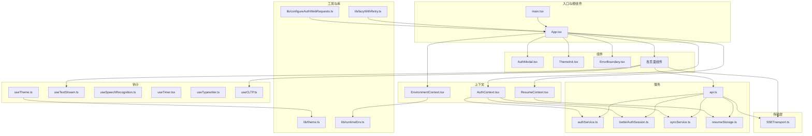
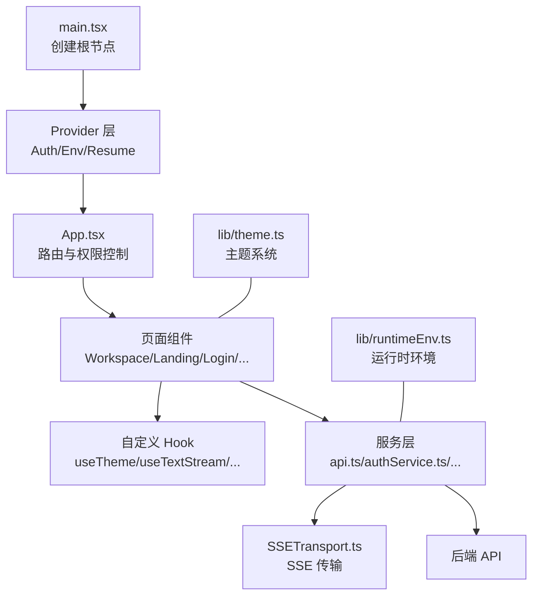
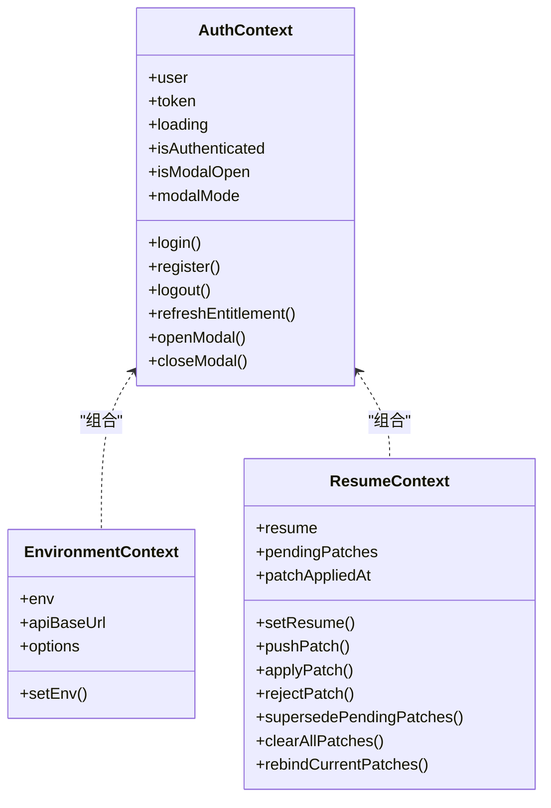
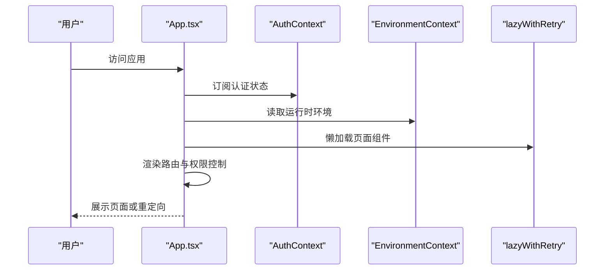
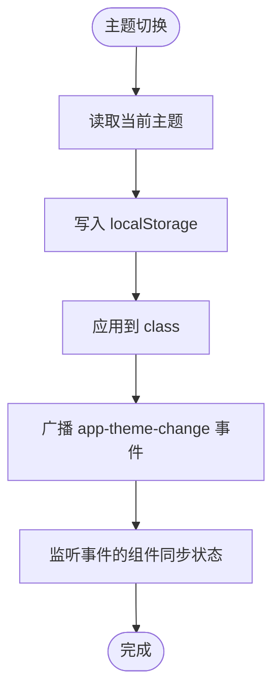
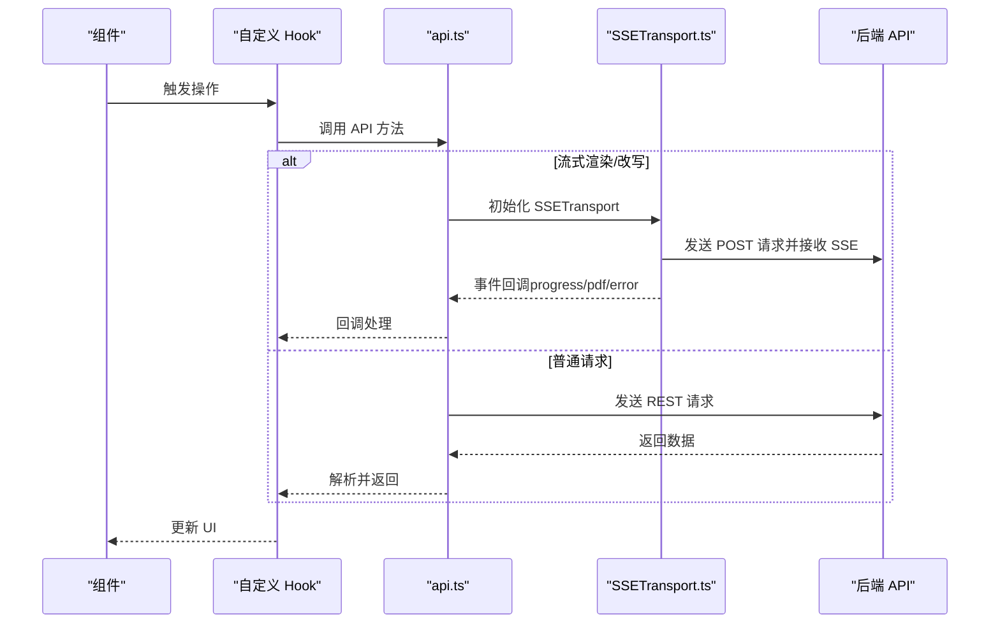
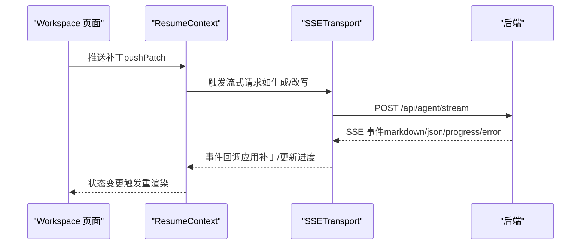
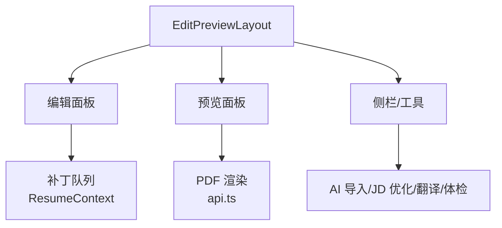
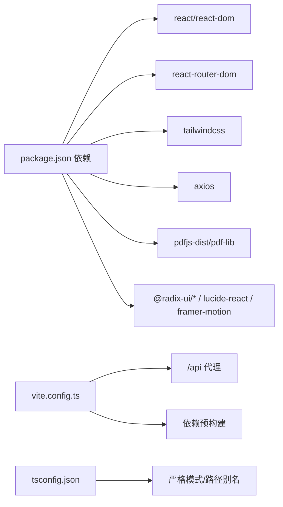

# 前端应用架构

<cite>
**本文档引用的文件**
- [frontend/src/main.tsx](file://frontend/src/main.tsx)
- [frontend/src/App.tsx](file://frontend/src/App.tsx)
- [frontend/src/contexts/AuthContext.tsx](file://frontend/src/contexts/AuthContext.tsx)
- [frontend/src/contexts/EnvironmentContext.tsx](file://frontend/src/contexts/EnvironmentContext.tsx)
- [frontend/src/contexts/ResumeContext.tsx](file://frontend/src/contexts/ResumeContext.tsx)
- [frontend/src/lib/theme.ts](file://frontend/src/lib/theme.ts)
- [frontend/src/lib/runtimeEnv.ts](file://frontend/src/lib/runtimeEnv.ts)
- [frontend/src/lib/lazyWithRetry.ts](file://frontend/src/lib/lazyWithRetry.ts)
- [frontend/src/lib/configureAuthWebRequests.ts](file://frontend/src/lib/configureAuthWebRequests.ts)
- [frontend/src/lib/utils.ts](file://frontend/src/lib/utils.ts)
- [frontend/src/hooks/useTheme.ts](file://frontend/src/hooks/useTheme.ts)
- [frontend/src/hooks/useTextStream.ts](file://frontend/src/hooks/useTextStream.ts)
- [frontend/src/hooks/useSpeechRecognition.ts](file://frontend/src/hooks/useSpeechRecognition.ts)
- [frontend/src/hooks/useTimer.tsx](file://frontend/src/hooks/useTimer.tsx)
- [frontend/src/hooks/useTypewriter.ts](file://frontend/src/hooks/useTypewriter.ts)
- [frontend/src/hooks/useCLTP.ts](file://frontend/src/hooks/useCLTP.ts)
- [frontend/src/services/api.ts](file://frontend/src/services/api.ts)
- [frontend/src/services/authService.ts](file://frontend/src/services/authService.ts)
- [frontend/src/services/betterAuthSession.ts](file://frontend/src/services/betterAuthSession.ts)
- [frontend/src/services/syncService.ts](file://frontend/src/services/syncService.ts)
- [frontend/src/services/resumeStorage.ts](file://frontend/src/services/resumeStorage.ts)
- [frontend/src/transports/SSETransport.ts](file://frontend/src/transports/SSETransport.ts)
- [frontend/src/pages/Workspace/v2/index.tsx](file://frontend/src/pages/Workspace/v2/index.tsx)
- [frontend/package.json](file://frontend/package.json)
- [frontend/tsconfig.json](file://frontend/tsconfig.json)
- [frontend/vite.config.ts](file://frontend/vite.config.ts)
- [frontend/tailwind.config.js](file://frontend/tailwind.config.js)
</cite>

## 目录
1. [简介](#简介)
2. [项目结构](#项目结构)
3. [核心组件](#核心组件)
4. [架构总览](#架构总览)
5. [详细组件分析](#详细组件分析)
6. [依赖关系分析](#依赖关系分析)
7. [性能考量](#性能考量)
8. [故障排查指南](#故障排查指南)
9. [结论](#结论)
10. [附录](#附录)

## 简介
本项目采用 React 18 + TypeScript 构建前端应用，结合 TailwindCSS 实现样式与主题系统，并通过自定义 Hook、上下文系统与服务层实现清晰的状态管理与路由控制。应用支持多环境运行（本地/远程开发）、主题切换（亮/暗/跟随系统）、懒加载与重试机制、以及与后端 API 的多种通信方式，包括普通 REST 请求、SSE 流式传输与实时更新策略。此外，应用还提供了 PDF 渲染（含流式）、LaTeX 编译、语音识别、打字机效果等增强体验。

## 项目结构
前端代码位于 frontend 目录，采用按功能域划分的模块化组织方式：
- 入口与根组件：main.tsx、App.tsx
- 上下文：认证、环境、简历状态
- 组件：通用组件、聊天组件、PDF 编辑器、工作区等
- 钩子：主题、文本流、语音识别、计时器、打字机、CLTP 等
- 服务：API、认证、BetterAuth 会话、存储、TTS 等
- 传输层：SSETransport（SSE 传输）
- 类型：聊天、简历、传输相关类型
- 工具与库：主题、运行时环境、懒加载与重试、认证 Web 请求配置等
- 页面：登录、工作区、LeetCode、Legal、Pricing、Account 等
- 样式：TailwindCSS 配置与主题扩展

**图表来源**
- [frontend/src/main.tsx:1-25](file://frontend/src/main.tsx#L1-L25)
- [frontend/src/App.tsx:1-111](file://frontend/src/App.tsx#L1-L111)
- [frontend/src/contexts/AuthContext.tsx:1-275](file://frontend/src/contexts/AuthContext.tsx#L1-L275)
- [frontend/src/contexts/EnvironmentContext.tsx:1-46](file://frontend/src/contexts/EnvironmentContext.tsx#L1-L46)
- [frontend/src/contexts/ResumeContext.tsx:1-117](file://frontend/src/contexts/ResumeContext.tsx#L1-L117)
- [frontend/src/lib/theme.ts:1-46](file://frontend/src/lib/theme.ts#L1-L46)
- [frontend/src/lib/runtimeEnv.ts:1-161](file://frontend/src/lib/runtimeEnv.ts#L1-L161)
- [frontend/src/lib/lazyWithRetry.ts](file://frontend/src/lib/lazyWithRetry.ts)
- [frontend/src/lib/configureAuthWebRequests.ts](file://frontend/src/lib/configureAuthWebRequests.ts)
- [frontend/src/hooks/useTheme.ts:1-28](file://frontend/src/hooks/useTheme.ts#L1-L28)
- [frontend/src/hooks/useTextStream.ts](file://frontend/src/hooks/useTextStream.ts)
- [frontend/src/hooks/useSpeechRecognition.ts](file://frontend/src/hooks/useSpeechRecognition.ts)
- [frontend/src/hooks/useTimer.tsx](file://frontend/src/hooks/useTimer.tsx)
- [frontend/src/hooks/useTypewriter.ts](file://frontend/src/hooks/useTypewriter.ts)
- [frontend/src/hooks/useCLTP.ts](file://frontend/src/hooks/useCLTP.ts)
- [frontend/src/services/api.ts:1-800](file://frontend/src/services/api.ts#L1-L800)
- [frontend/src/services/authService.ts](file://frontend/src/services/authService.ts)
- [frontend/src/services/betterAuthSession.ts](file://frontend/src/services/betterAuthSession.ts)
- [frontend/src/services/syncService.ts](file://frontend/src/services/syncService.ts)
- [frontend/src/services/resumeStorage.ts](file://frontend/src/services/resumeStorage.ts)
- [frontend/src/transports/SSETransport.ts:1-439](file://frontend/src/transports/SSETransport.ts#L1-L439)
- [frontend/src/pages/Workspace/v2/index.tsx:1-451](file://frontend/src/pages/Workspace/v2/index.tsx#L1-L451)

**章节来源**
- [frontend/src/main.tsx:1-25](file://frontend/src/main.tsx#L1-L25)
- [frontend/src/App.tsx:1-111](file://frontend/src/App.tsx#L1-L111)
- [frontend/package.json:1-66](file://frontend/package.json#L1-L66)
- [frontend/tsconfig.json:1-22](file://frontend/tsconfig.json#L1-L22)
- [frontend/vite.config.ts:1-159](file://frontend/vite.config.ts#L1-L159)
- [frontend/tailwind.config.js:1-129](file://frontend/tailwind.config.js#L1-L129)

## 核心组件
- 应用入口与根组件
  - main.tsx：初始化样式、配置认证 Web 请求、创建根节点并包裹 Provider 层级。
  - App.tsx：集中声明路由、权限控制、错误边界、主题初始化与模态组件挂载。
- 上下文系统
  - AuthContext：统一管理用户登录态、BetterAuth 会话、令牌与额度信息，提供登录/注册/注销与模态控制。
  - EnvironmentContext：集中管理运行时环境（本地/远程开发）与 API 基础地址。
  - ResumeContext：简历数据与补丁（patch）队列的状态管理，支持应用、拒绝、超时与重新绑定。
- 主题与样式
  - lib/theme.ts：主题持久化与跨组件同步，支持亮/暗/跟随系统三种模式。
  - tailwind.config.js：扩展字体族、颜色、排版与动画，启用暗色模式 class。
- 自定义 Hook
  - useTheme：主题读取与切换，监听主题变更事件。
  - useTextStream、useSpeechRecognition、useTimer、useTypewriter、useCLTP：围绕文本流、语音、计时与 CLTP 的业务抽象。
- 服务与传输
  - api.ts：封装 PDF 渲染（含流式）、LaTeX 编译、简历生成/改写、额度查询等 API。
  - SSETransport：基于 HTTP+SSe 的稳定连接、心跳检测与自动重连。
- 路由与懒加载
  - App.tsx 使用 React Router v7 的懒加载与重试策略，按需加载页面组件。

**章节来源**
- [frontend/src/main.tsx:1-25](file://frontend/src/main.tsx#L1-L25)
- [frontend/src/App.tsx:1-111](file://frontend/src/App.tsx#L1-L111)
- [frontend/src/contexts/AuthContext.tsx:1-275](file://frontend/src/contexts/AuthContext.tsx#L1-L275)
- [frontend/src/contexts/EnvironmentContext.tsx:1-46](file://frontend/src/contexts/EnvironmentContext.tsx#L1-L46)
- [frontend/src/contexts/ResumeContext.tsx:1-117](file://frontend/src/contexts/ResumeContext.tsx#L1-L117)
- [frontend/src/lib/theme.ts:1-46](file://frontend/src/lib/theme.ts#L1-L46)
- [frontend/tailwind.config.js:1-129](file://frontend/tailwind.config.js#L1-L129)
- [frontend/src/hooks/useTheme.ts:1-28](file://frontend/src/hooks/useTheme.ts#L1-L28)
- [frontend/src/services/api.ts:1-800](file://frontend/src/services/api.ts#L1-L800)
- [frontend/src/transports/SSETransport.ts:1-439](file://frontend/src/transports/SSETransport.ts#L1-L439)

## 架构总览
应用采用“入口 -> Provider 层 -> 路由与页面 -> 服务/传输层”的分层架构。Provider 层负责全局状态与环境配置，页面组件通过自定义 Hook 与服务层交互，SSETransport 提供稳定的实时通信能力，API 层统一封装后端接口。

**图表来源**
- [frontend/src/main.tsx:1-25](file://frontend/src/main.tsx#L1-L25)
- [frontend/src/App.tsx:1-111](file://frontend/src/App.tsx#L1-L111)
- [frontend/src/contexts/AuthContext.tsx:1-275](file://frontend/src/contexts/AuthContext.tsx#L1-L275)
- [frontend/src/contexts/EnvironmentContext.tsx:1-46](file://frontend/src/contexts/EnvironmentContext.tsx#L1-L46)
- [frontend/src/contexts/ResumeContext.tsx:1-117](file://frontend/src/contexts/ResumeContext.tsx#L1-L117)
- [frontend/src/lib/theme.ts:1-46](file://frontend/src/lib/theme.ts#L1-L46)
- [frontend/src/lib/runtimeEnv.ts:1-161](file://frontend/src/lib/runtimeEnv.ts#L1-L161)
- [frontend/src/services/api.ts:1-800](file://frontend/src/services/api.ts#L1-L800)
- [frontend/src/transports/SSETransport.ts:1-439](file://frontend/src/transports/SSETransport.ts#L1-L439)

## 详细组件分析

### 上下文系统与状态管理
- AuthContext
  - 职责：BetterAuth 会话与传统 JWT 并行支持、用户信息与令牌持久化、登录/注册/注销、额度刷新、模态控制。
  - 设计要点：惰性初始化、URL 参数兼容、异步回填 legacy 信息、延迟同步本地数据。
- EnvironmentContext
  - 职责：集中管理运行时环境与 API 基础地址，支持切换与选项展示。
- ResumeContext
  - 职责：简历数据与补丁队列管理，支持补丁应用、拒绝、超时与重新绑定，持久化保存。

**图表来源**
- [frontend/src/contexts/AuthContext.tsx:1-275](file://frontend/src/contexts/AuthContext.tsx#L1-L275)
- [frontend/src/contexts/EnvironmentContext.tsx:1-46](file://frontend/src/contexts/EnvironmentContext.tsx#L1-L46)
- [frontend/src/contexts/ResumeContext.tsx:1-117](file://frontend/src/contexts/ResumeContext.tsx#L1-L117)

**章节来源**
- [frontend/src/contexts/AuthContext.tsx:1-275](file://frontend/src/contexts/AuthContext.tsx#L1-L275)
- [frontend/src/contexts/EnvironmentContext.tsx:1-46](file://frontend/src/contexts/EnvironmentContext.tsx#L1-L46)
- [frontend/src/contexts/ResumeContext.tsx:1-117](file://frontend/src/contexts/ResumeContext.tsx#L1-L117)

### 路由与权限控制
- App.tsx
  - 使用 Suspense 与 lazyWithRetry 实现页面懒加载与重试。
  - 权限控制：根据认证状态与管理员角色动态渲染路由。
  - 主题初始化与错误边界包裹，保证用户体验与稳定性。

**图表来源**
- [frontend/src/App.tsx:1-111](file://frontend/src/App.tsx#L1-L111)
- [frontend/src/contexts/AuthContext.tsx:1-275](file://frontend/src/contexts/AuthContext.tsx#L1-L275)
- [frontend/src/contexts/EnvironmentContext.tsx:1-46](file://frontend/src/contexts/EnvironmentContext.tsx#L1-L46)
- [frontend/src/lib/lazyWithRetry.ts](file://frontend/src/lib/lazyWithRetry.ts)

**章节来源**
- [frontend/src/App.tsx:1-111](file://frontend/src/App.tsx#L1-L111)

### 主题系统与样式
- 主题持久化与跨组件同步：通过 localStorage 与自定义事件实现主题变更通知。
- TailwindCSS 扩展：字体、颜色、排版与动画，支持暗色模式 class。

**图表来源**
- [frontend/src/lib/theme.ts:1-46](file://frontend/src/lib/theme.ts#L1-L46)
- [frontend/src/hooks/useTheme.ts:1-28](file://frontend/src/hooks/useTheme.ts#L1-L28)
- [frontend/tailwind.config.js:1-129](file://frontend/tailwind.config.js#L1-L129)

**章节来源**
- [frontend/src/lib/theme.ts:1-46](file://frontend/src/lib/theme.ts#L1-L46)
- [frontend/src/hooks/useTheme.ts:1-28](file://frontend/src/hooks/useTheme.ts#L1-L28)
- [frontend/tailwind.config.js:1-129](file://frontend/tailwind.config.js#L1-L129)

### 与后端 API 的通信机制
- API 封装：统一通过 api.ts 封装 PDF 渲染（含流式）、LaTeX 编译、简历生成/改写、额度查询等。
- 认证头：通过 configureAuthWebRequests 与 authHeaders 统一注入认证头。
- 运行时环境：runtimeEnv 控制 API 基础地址与 BetterAuth 代理路径。

**图表来源**
- [frontend/src/services/api.ts:1-800](file://frontend/src/services/api.ts#L1-L800)
- [frontend/src/transports/SSETransport.ts:1-439](file://frontend/src/transports/SSETransport.ts#L1-L439)
- [frontend/src/lib/configureAuthWebRequests.ts](file://frontend/src/lib/configureAuthWebRequests.ts)
- [frontend/src/lib/runtimeEnv.ts:1-161](file://frontend/src/lib/runtimeEnv.ts#L1-L161)

**章节来源**
- [frontend/src/services/api.ts:1-800](file://frontend/src/services/api.ts#L1-L800)
- [frontend/src/transports/SSETransport.ts:1-439](file://frontend/src/transports/SSETransport.ts#L1-L439)
- [frontend/src/lib/configureAuthWebRequests.ts](file://frontend/src/lib/configureAuthWebRequests.ts)
- [frontend/src/lib/runtimeEnv.ts:1-161](file://frontend/src/lib/runtimeEnv.ts#L1-L161)

### SSE 流式传输与实时更新策略
- SSETransport
  - 基于 fetch + ReadableStream 解析 SSE，支持心跳检测、自动重连与事件派发。
  - 适用于长连接场景（如简历生成、PDF 流式渲染）。
- 实时更新策略
  - 在 Workspace 页面中，通过补丁队列与 ResumeContext 实现增量更新与防抖渲染，避免频繁重绘。

**图表来源**
- [frontend/src/pages/Workspace/v2/index.tsx:1-451](file://frontend/src/pages/Workspace/v2/index.tsx#L1-L451)
- [frontend/src/contexts/ResumeContext.tsx:1-117](file://frontend/src/contexts/ResumeContext.tsx#L1-L117)
- [frontend/src/transports/SSETransport.ts:1-439](file://frontend/src/transports/SSETransport.ts#L1-L439)

**章节来源**
- [frontend/src/pages/Workspace/v2/index.tsx:1-451](file://frontend/src/pages/Workspace/v2/index.tsx#L1-L451)
- [frontend/src/contexts/ResumeContext.tsx:1-117](file://frontend/src/contexts/ResumeContext.tsx#L1-L117)
- [frontend/src/transports/SSETransport.ts:1-439](file://frontend/src/transports/SSETransport.ts#L1-L439)

### 工作区与编辑器（概念性说明）
- 工作区采用三栏布局（编辑/预览/侧栏），支持点击/滚动/JSON 三种编辑模式。
- 通过 usePDFOperations 与 useAIImport 等 Hook 管理 PDF 渲染、AI 导入与 JD 优化等能力。
- 采用防抖策略减少渲染频率，提升交互流畅度。

**图表来源**
- [frontend/src/pages/Workspace/v2/index.tsx:1-451](file://frontend/src/pages/Workspace/v2/index.tsx#L1-L451)
- [frontend/src/contexts/ResumeContext.tsx:1-117](file://frontend/src/contexts/ResumeContext.tsx#L1-L117)
- [frontend/src/services/api.ts:1-800](file://frontend/src/services/api.ts#L1-L800)

## 依赖关系分析
- 依赖管理：package.json 使用 React 18、React Router v7、TailwindCSS、Axios、Mermaid、PDF.js 等。
- 构建工具：Vite 配置代理、日志输出、依赖优化与 Worker 格式。
- 类型系统：tsconfig.json 使用 bundler 模块解析与严格模式。

**图表来源**
- [frontend/package.json:1-66](file://frontend/package.json#L1-L66)
- [frontend/vite.config.ts:1-159](file://frontend/vite.config.ts#L1-L159)
- [frontend/tsconfig.json:1-22](file://frontend/tsconfig.json#L1-L22)

**章节来源**
- [frontend/package.json:1-66](file://frontend/package.json#L1-L66)
- [frontend/vite.config.ts:1-159](file://frontend/vite.config.ts#L1-L159)
- [frontend/tsconfig.json:1-22](file://frontend/tsconfig.json#L1-L22)

## 性能考量
- 懒加载与重试：通过 lazyWithRetry 减少首屏体积，提升首次访问速度。
- 依赖预构建：Vite optimizeDeps 排除重型依赖并在启动前预构建，避免首次进入特定页面时的即时优化导致整页闪烁。
- 渲染防抖：工作区对 PDF 渲染采用防抖策略，减少频繁重绘。
- SSE 优化：SSETransport 内部缓冲与事件解析，避免 UI 频繁更新带来的卡顿。
- 主题与样式：TailwindCSS 与原子类减少样式体积，主题切换通过 class 切换，避免样式重算。

## 故障排查指南
- 认证问题
  - BetterAuth 会话异常：检查 isAuthWebEnabled 与 buildAuthWebUrl 的返回值，确认认证页 URL 正确。
  - 传统 JWT 与 BetterAuth 并存：确保 token 与 user 的持久化逻辑正确，避免冲突。
- 环境切换
  - 运行时环境与 API 基础地址：通过 EnvironmentContext 与 runtimeEnv 切换，确认代理与直连路径正确。
- SSE 连接
  - 心跳超时：检查 heartbeatTimeout 设置与网络状况，必要时调整自动重连策略。
  - 事件解析失败：确认后端 SSE 输出格式（event/data），前端按格式解析。
- PDF 渲染
  - 流式渲染失败：检查后端 SSE 输出与前端解析逻辑，关注 progress/pdf/error 事件。
  - 额度限制：捕获 403 错误并提示用户额度不足。

**章节来源**
- [frontend/src/contexts/AuthContext.tsx:1-275](file://frontend/src/contexts/AuthContext.tsx#L1-L275)
- [frontend/src/lib/runtimeEnv.ts:1-161](file://frontend/src/lib/runtimeEnv.ts#L1-L161)
- [frontend/src/transports/SSETransport.ts:1-439](file://frontend/src/transports/SSETransport.ts#L1-L439)
- [frontend/src/services/api.ts:1-800](file://frontend/src/services/api.ts#L1-L800)

## 结论
该前端应用通过清晰的分层架构、完善的上下文系统与服务层封装，实现了稳定的状态管理、灵活的主题与样式体系、可靠的路由与权限控制，以及高效的 SSE 实时通信。配合 Vite 的优化策略与 TailwindCSS 的样式扩展，应用在开发体验与运行性能上均表现良好。建议在后续迭代中持续完善错误边界与监控埋点，进一步提升可观测性与可维护性。

## 附录
- 组件开发指南与最佳实践
  - 使用自定义 Hook 将业务逻辑与 UI 解耦，便于复用与测试。
  - 在上下文中集中管理全局状态，避免跨组件传递过深。
  - 对重型页面采用懒加载与重试策略，优化首屏性能。
  - 使用 Suspense 与 ErrorBoundary 提升用户体验与稳定性。
  - SSE 事件处理遵循“事件类型 -> 数据解析 -> UI 更新”的流程，确保健壮性。
  - 主题切换通过单一数据源与事件广播，保证多实例同步一致性。
- 响应式设计与主题配置
  - TailwindCSS 提供丰富的断点与原子类，结合主题系统实现亮/暗/跟随系统三态切换。
  - 在组件中优先使用语义化类名与主题变量，减少硬编码样式。