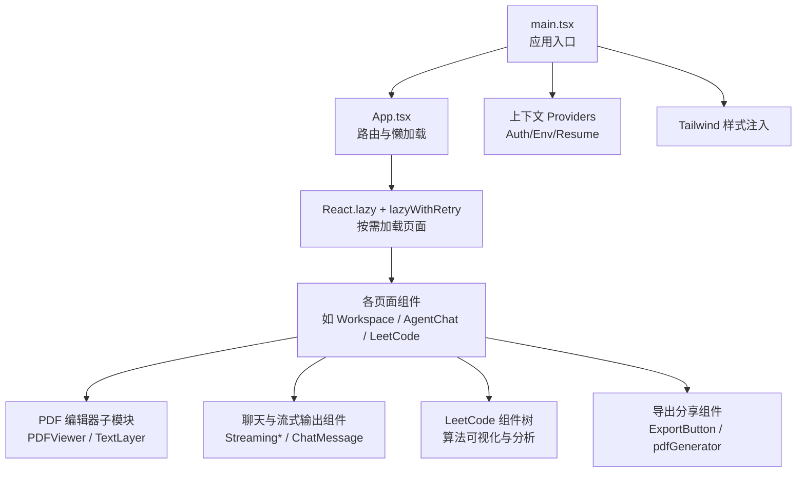
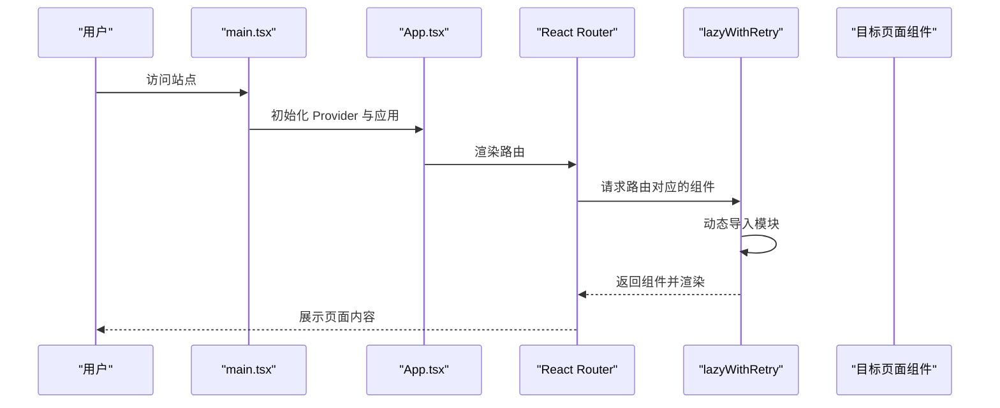
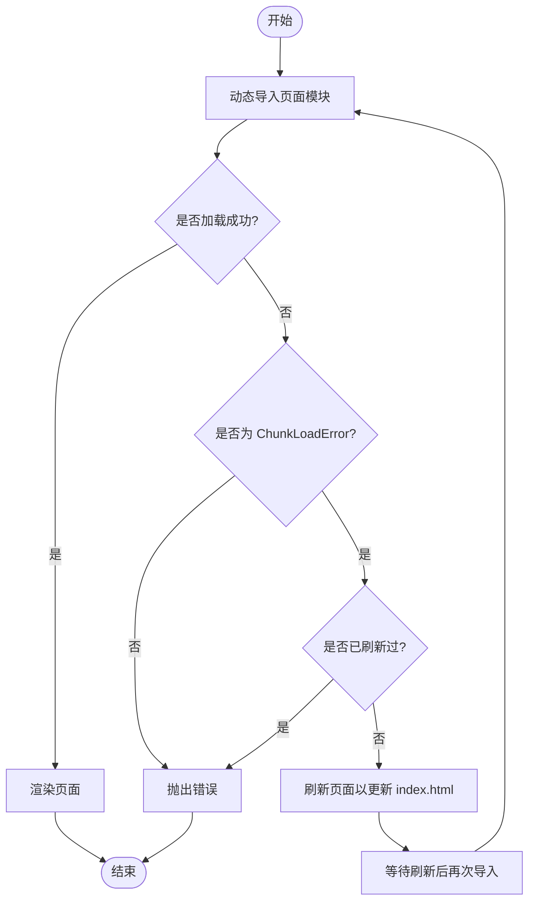
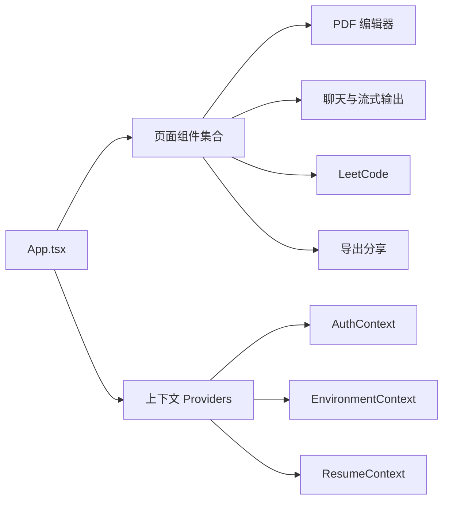

# 性能优化策略

<cite>
**本文引用的文件**
- [package.json](file://frontend/package.json)
- [vite.config.ts](file://frontend/vite.config.ts)
- [tailwind.config.js](file://frontend/tailwind.config.js)
- [tsconfig.json](file://frontend/tsconfig.json)
- [lazyWithRetry.ts](file://frontend/src/lib/lazyWithRetry.ts)
- [App.tsx](file://frontend/src/App.tsx)
- [main.tsx](file://frontend/src/main.tsx)
- [PDFViewer.tsx](file://frontend/src/components/PDFEditor/PDFViewer.tsx)
- [TextLayer.tsx](file://frontend/src/components/PDFEditor/TextLayer.tsx)
- [pdfWorkerConfig.ts](file://frontend/src/components/PDFEditor/pdfWorkerConfig.ts)
- [ResumeDashboard/index.tsx](file://frontend/src/pages/ResumeDashboard/index.tsx)
- [Workspace/index.tsx](file://frontend/src/pages/Workspace/v2/index.tsx)
- [LeetCode/index.tsx](file://frontend/src/pages/LeetCode/index.tsx)
- [LeetCode/api.ts](file://frontend/src/pages/LeetCode/api.ts)
- [LeetCode/types.ts](file://frontend/src/pages/LeetCode/types.ts)
- [LeetCode/analyzeGoComplexity.ts](file://frontend/src/pages/LeetCode/analyzeGoComplexity.ts)
- [hooks/useTimer.tsx](file://frontend/src/hooks/useTimer.tsx)
- [hooks/useTextStream.ts](file://frontend/src/hooks/useTextStream.ts)
- [hooks/useSpeechRecognition.ts](file://frontend/src/hooks/useSpeechRecognition.ts)
- [services/storage/LocalStorageAdapter.ts](file://frontend/src/services/storage/LocalStorageAdapter.ts)
- [services/storage/DatabaseAdapter.ts](file://frontend/src/services/storage/DatabaseAdapter.ts)
- [services/storage/StorageAdapter.ts](file://frontend/src/services/storage/StorageAdapter.ts)
- [services/storage/sanitizeResume.ts](file://frontend/src/services/storage/sanitizeResume.ts)
- [utils/linkifyText.tsx](file://frontend/src/utils/linkifyText.tsx)
- [utils/resumeMarkdownParser.ts](file://frontend/src/utils/resumeMarkdownParser.ts)
- [utils/resumePatch.ts](file://frontend/src/utils/resumePatch.ts)
- [utils/sessionLimits.ts](file://frontend/src/utils/sessionLimits.ts)
- [components/common/CustomScrollbar.tsx](file://frontend/src/components/common/CustomScrollbar.tsx)
- [components/common/PortalDropdown.tsx](file://frontend/src/components/common/PortalDropdown.tsx)
- [components/chat/ChatMessage.tsx](file://frontend/src/components/chat/ChatMessage.tsx)
- [components/chat/EnhancedMarkdown.tsx](file://frontend/src/components/chat/EnhancedMarkdown.tsx)
- [components/chat/StreamingOutputPanel.tsx](file://frontend/src/components/chat/StreamingOutputPanel.tsx)
- [components/chat/ResumeCard.tsx](file://frontend/src/components/chat/ResumeCard.tsx)
- [components/chat/ResumeEditDiffCard.tsx](file://frontend/src/components/chat/ResumeEditDiffCard.tsx)
- [components/chat/SearchResultPanel.tsx](file://frontend/src/components/chat/SearchResultPanel.tsx)
- [components/chat/StreamingResponse.tsx](file://frontend/src/components/chat/StreamingResponse.tsx)
- [components/chat/ResumeMarkdown.tsx](file://frontend/src/components/chat/ResumeMarkdown.tsx)
- [components/chat/ResumeSectionBlock.tsx](file://frontend/src/components/chat/ResumeSectionBlock.tsx)
- [components/chat/ThoughtProcess.tsx](file://frontend/src/components/chat/ThoughtProcess.tsx)
- [components/chat/VoiceInput.tsx](file://frontend/src/components/chat/VoiceInput.tsx)
- [components/chat/TTSButton.tsx](file://frontend/src/components/chat/TTSButton.tsx)
- [components/chat/TTSPlayer.tsx](file://frontend/src/components/chat/TTSPlayer.tsx)
- [components/agent-chat/MessageTimeline.tsx](file://frontend/src/components/agent-chat/MessageTimeline.tsx)
- [components/agent-chat/StreamingLane.tsx](file://frontend/src/components/agent-chat/StreamingLane.tsx)
- [components/agent-chat/DiagnosisToolCards.tsx](file://frontend/src/components/agent-chat/DiagnosisToolCards.tsx)
- [components/agent-chat/ResumeDiffCard.tsx](file://frontend/src/components/agent-chat/ResumeDiffCard.tsx)
- [components/agent-chat/ResumeGeneratedCard.tsx](file://frontend/src/components/agent-chat/ResumeGeneratedCard.tsx)
- [components/agent-chat/AssistantPaperCard.tsx](file://frontend/src/components/agent-chat/AssistantPaperCard.tsx)
- [components/agent-chat/AgentPdfPreviewPanel.tsx](file://frontend/src/components/agent-chat/AgentPdfPreviewPanel.tsx)
- [components/agent-chat/ParseImportTimerBadge.tsx](file://frontend/src/components/agent-chat/ParseImportTimerBadge.tsx)
- [components/agent-chat/ResumePreview.tsx](file://frontend/src/components/agent-chat/ResumePreview.tsx)
- [components/agent-chat/ResumeSelector.tsx](file://frontend/src/components/agent-chat/ResumeSelector.tsx)
- [components/agent-chat/Composer.tsx](file://frontend/src/components/agent-chat/Composer.tsx)
- [components/agent-chat/IntentChips.tsx](file://frontend/src/components/agent-chat/IntentChips.tsx)
- [components/agent-chat/ModelSelector.tsx](file://frontend/src/components/agent-chat/ModelSelector.tsx)
- [components/agent-chat/useMessageTimeline.ts](file://frontend/src/hooks/agent-chat/useMessageTimeline.ts)
- [components/agent-chat/useStreamRunController.ts](file://frontend/src/hooks/agent-chat/useStreamRunController.ts)
- [components/agent-chat/useAttachmentHandler.ts](file://frontend/src/hooks/agent-chat/useAttachmentHandler.ts)
- [components/agent-chat/useResumeDetection.ts](file://frontend/src/hooks/agent-chat/useResumeDetection.ts)
- [components/agent-chat/useResumePreview.ts](file://frontend/src/hooks/agent-chat/useResumePreview.ts)
- [components/agent-chat/useSessionPersistence.ts](file://frontend/src/hooks/agent-chat/useSessionPersistence.ts)
- [components/agent-chat/useToolEventRouter.ts](file://frontend/src/hooks/agent-chat/useToolEventRouter.ts)
- [components/ExportShare/ExportButton.tsx](file://frontend/src/components/ExportShare/ExportButton.tsx)
- [components/ExportShare/pdfGenerator.ts](file://frontend/src/components/ExportShare/pdfGenerator.ts)
- [services/tts.ts](file://frontend/src/services/tts.ts)
- [services/photoService.ts](file://frontend/src/services/photoService.ts)
- [services/resumeParse.ts](file://frontend/src/services/resumeParse.ts)
- [services/resumeStorage.ts](file://frontend/src/services/resumeStorage.ts)
- [services/syncService.ts](file://frontend/src/services/syncService.ts)
- [services/agentStream.ts](file://frontend/src/services/agentStream.ts)
- [services/api.ts](file://frontend/src/services/api.ts)
- [transports/SSETransport.ts](file://frontend/src/transports/SSETransport.ts)
- [lib/fetchWithTimeout.ts](file://frontend/src/lib/fetchWithTimeout.ts)
- [lib/runtimeEnv.ts](file://frontend/src/lib/runtimeEnv.ts)
- [lib/theme.ts](file://frontend/src/lib/theme.ts)
- [lib/utils.ts](file://frontend/src/lib/utils.ts)
- [lib/authHeaders.ts](file://frontend/src/lib/authHeaders.ts)
- [lib/configureAuthWebRequests.ts](file://frontend/src/lib/configureAuthWebRequests.ts)
- [contexts/AuthContext.tsx](file://frontend/src/contexts/AuthContext.tsx)
- [contexts/EnvironmentContext.tsx](file://frontend/src/contexts/EnvironmentContext.tsx)
- [contexts/ResumeContext.tsx](file://frontend/src/contexts/ResumeContext.tsx)
- [types/chat.ts](file://frontend/src/types/chat.ts)
- [types/resume.ts](file://frontend/src/types/resume.ts)
- [types/resumePreview.ts](file://frontend/src/types/resumePreview.ts)
- [types/transport.ts](file://frontend/src/types/transport.ts)
</cite>

## 目录
1. [引言](#引言)
2. [项目结构](#项目结构)
3. [核心组件](#核心组件)
4. [架构总览](#架构总览)
5. [详细组件分析](#详细组件分析)
6. [依赖分析](#依赖分析)
7. [性能考量](#性能考量)
8. [故障排查指南](#故障排查指南)
9. [结论](#结论)
10. [附录](#附录)

## 引言
本文件面向前端性能优化，结合仓库中的实际代码与配置，系统梳理代码分割与懒加载、资源预加载、组件渲染优化、虚拟滚动、防抖节流、图片与字体优化、CSS优化、内存管理与泄漏检测、Bundle分析与Tree Shaking、构建优化以及性能监控与基准测试等主题。内容既覆盖架构层面的设计原则，也包含可落地的实现细节与最佳实践。

## 项目结构
前端位于 frontend 目录，采用 Vite + React 18 + TypeScript 技术栈，使用 TailwindCSS 作为样式框架，并通过 React Router v6 实现页面级路由与代码分割。关键特性包括：
- 路由级懒加载与重试机制，降低首屏体积与提升稳定性
- 依赖预优化，避免首次进入重型页面时的即时构建开销
- PDF 渲染与文本层分离，配合 Web Worker 降低主线程阻塞
- 多处自定义 Hook 与工具函数用于节流、防抖与流式处理
- 存储适配器抽象，便于在不同存储介质间切换与优化

图表来源
- [main.tsx:1-25](file://frontend/src/main.tsx#L1-L25)
- [App.tsx:1-111](file://frontend/src/App.tsx#L1-L111)
- [vite.config.ts:46-159](file://frontend/vite.config.ts#L46-L159)

章节来源
- [package.json:1-66](file://frontend/package.json#L1-L66)
- [vite.config.ts:1-159](file://frontend/vite.config.ts#L1-L159)
- [tailwind.config.js:1-129](file://frontend/tailwind.config.js#L1-L129)
- [tsconfig.json:1-22](file://frontend/tsconfig.json#L1-L22)

## 核心组件
- 路由与懒加载：通过 React.lazy 结合 lazyWithRetry 实现页面级代码分割与错误重试，显著减少首屏 JS 体积与白屏时间。
- 依赖预优化：Vite 的 optimizeDeps.include 将重型依赖（markdown、图表、PDF 库）提前预构建，避免首次访问重型页面时的即时优化导致整页闪烁。
- PDF 渲染：PDFViewer 与 TextLayer 分离，配合 pdfWorkerConfig 使用 Web Worker 处理解析与渲染，降低主线程压力。
- 流式与交互：聊天与 LeetCode 页面广泛使用自定义 Hook（如 useTextStream、useTimer、useSpeechRecognition）进行数据流与交互优化。
- 存储与安全：StorageAdapter 抽象与 sanitizeResume 规范化，兼顾性能与安全性。

章节来源
- [App.tsx:13-28](file://frontend/src/App.tsx#L13-L28)
- [lazyWithRetry.ts:1-35](file://frontend/src/lib/lazyWithRetry.ts#L1-L35)
- [vite.config.ts:140-153](file://frontend/vite.config.ts#L140-L153)
- [PDFViewer.tsx](file://frontend/src/components/PDFEditor/PDFViewer.tsx)
- [TextLayer.tsx](file://frontend/src/components/PDFEditor/TextLayer.tsx)
- [pdfWorkerConfig.ts](file://frontend/src/components/PDFEditor/pdfWorkerConfig.ts)
- [hooks/useTextStream.ts](file://frontend/src/hooks/useTextStream.ts)
- [hooks/useTimer.tsx](file://frontend/src/hooks/useTimer.tsx)
- [hooks/useSpeechRecognition.ts](file://frontend/src/hooks/useSpeechRecognition.ts)
- [services/storage/StorageAdapter.ts](file://frontend/src/services/storage/StorageAdapter.ts)
- [services/storage/sanitizeResume.ts](file://frontend/src/services/storage/sanitizeResume.ts)

## 架构总览
下图展示从入口到页面组件、再到 PDF 与聊天子系统的整体调用链，体现懒加载与模块化组织：

图表来源
- [main.tsx:13-24](file://frontend/src/main.tsx#L13-L24)
- [App.tsx:41-108](file://frontend/src/App.tsx#L41-L108)
- [lazyWithRetry.ts:20-34](file://frontend/src/lib/lazyWithRetry.ts#L20-L34)

## 详细组件分析

### 代码分割与懒加载实现
- 路由级懒加载：App.tsx 中对多个页面使用 lazyWithRetry 包装，确保在部署更新后若出现 chunk 加载错误，自动刷新一次以拉取最新 index.html，随后恢复正常的动态导入流程。
- 首屏优化：仅加载基础路由与 LandingPage，其他页面（如 AgentChat、Workspace、LeetCode 等）按需加载，显著降低初始包体。
- 错误重试：lazyWithRetry 在捕获 ChunkLoadError 时写入 sessionStorage 标记并刷新页面，避免重复失败；成功后移除标记，保证后续导航不受影响。

图表来源
- [lazyWithRetry.ts:5-34](file://frontend/src/lib/lazyWithRetry.ts#L5-L34)
- [App.tsx:13-28](file://frontend/src/App.tsx#L13-L28)
- [main.tsx:9-10](file://frontend/src/main.tsx#L9-L10)

章节来源
- [App.tsx:13-28](file://frontend/src/App.tsx#L13-L28)
- [lazyWithRetry.ts:1-35](file://frontend/src/lib/lazyWithRetry.ts#L1-L35)
- [main.tsx:9-10](file://frontend/src/main.tsx#L9-L10)

### 资源预加载策略
- 依赖预优化：optimizeDeps.include 显式声明重型依赖（react-markdown、remark-gfm、mermaid、react-syntax-highlighter、pdf-lib），避免首次进入 /agent/new 时 Vite 即时优化导致整页闪烁。
- 字体与样式：Tailwind 配置中定义了多套中文字体族，建议在生产环境通过 preload 或 font-display 优化字体加载体验。
- 图片与媒体：建议在图片组件上使用现代格式（WebP/AVIF）、响应式尺寸与占位图，结合 IntersectionObserver 实现懒加载。

章节来源
- [vite.config.ts:140-153](file://frontend/vite.config.ts#L140-L153)
- [tailwind.config.js:22-47](file://frontend/tailwind.config.js#L22-L47)

### 组件渲染优化
- Suspense 与骨架：App.tsx 使用 Suspense 提供统一的加载骨架，减少白屏与布局抖动。
- 条件渲染与权限：根据认证状态与功能开关动态渲染路由，避免不必要的组件挂载。
- 列表渲染：聊天与简历列表组件应结合 key 与分页/虚拟化策略，减少重排与重绘。

章节来源
- [App.tsx:30-39](file://frontend/src/App.tsx#L30-L39)
- [App.tsx:46-49](file://frontend/src/App.tsx#L46-L49)

### 虚拟滚动
- 大列表场景：聊天消息、简历历史、LeetCode 提交记录等适合使用虚拟滚动（例如 react-window 或 react-virtualized）。建议：
  - 固定项高度或提供估算高度
  - 按需渲染可见区域前后缓冲区
  - 使用 useMemo 缓存计算结果
  - 避免在渲染函数中执行昂贵计算

（本小节为通用指导，不直接分析具体文件）

### 防抖与节流
- 输入与搜索：在搜索框输入事件中使用防抖，减少请求频率。
- 滚动与窗口调整：对 resize、scroll 事件使用节流，降低回调触发频率。
- 文本流式输出：useTextStream 可结合节流策略控制渲染节奏，避免 UI 卡顿。

章节来源
- [hooks/useTextStream.ts](file://frontend/src/hooks/useTextStream.ts)
- [hooks/useTimer.tsx](file://frontend/src/hooks/useTimer.tsx)

### 图片优化
- 格式选择：优先使用 WebP/AVIF；为不支持的浏览器提供降级方案。
- 响应式：使用 srcset 与 sizes，按设备像素比与视口宽度选择合适尺寸。
- 懒加载：IntersectionObserver 实现延迟加载，减少首屏带宽占用。
- 占位图：Skeleton 或低质量内联图（LQIP）提升感知性能。

（本小节为通用指导，不直接分析具体文件）

### 字体优化
- 字体加载：使用 font-display: swap 或 optional，避免 FOIT/FOIC。
- 字体裁剪：仅引入必要字重与字符集，减少字体文件体积。
- 主机字体：优先使用系统字体栈，降低网络请求。

章节来源
- [tailwind.config.js:22-47](file://frontend/tailwind.config.js#L22-L47)

### CSS 优化
- Tailwind 使用：content 白名单与按需生成，避免未使用类名进入产物。
- 动画与过渡：尽量使用 transform 与 opacity，避免触发布局与重绘。
- 深色模式：通过 CSS 变量与类名切换，减少运行时样式计算。

章节来源
- [tailwind.config.js:6-11](file://frontend/tailwind.config.js#L6-L11)
- [tailwind.config.js:105-124](file://frontend/tailwind.config.js#L105-L124)

### 内存管理、垃圾回收与内存泄漏检测
- 生命周期管理：在组件卸载时清理定时器、订阅与事件监听，避免闭包持有导致的泄漏。
- 大对象释放：PDF 解析与渲染产生的大数组/TypedArray，在不再使用时及时置空或重建引用。
- 存储适配器：LocalStorageAdapter 与 DatabaseAdapter 应定期清理过期数据，避免无限增长。
- 监控手段：使用 Performance API、Memory Profiler、Heap Snapshot 定期检查内存峰值与泄漏点。

章节来源
- [services/storage/LocalStorageAdapter.ts](file://frontend/src/services/storage/LocalStorageAdapter.ts)
- [services/storage/DatabaseAdapter.ts](file://frontend/src/services/storage/DatabaseAdapter.ts)
- [services/storage/StorageAdapter.ts](file://frontend/src/services/storage/StorageAdapter.ts)

### Bundle 分析、Tree Shaking、构建优化
- Tree Shaking：TypeScript 与 Vite 默认启用 ES 模块打包，确保无副作用的模块可被摇树优化。
- 依赖拆分：将重型库（pdfjs、mermaid、markdown）按需引入，避免打入公共包。
- 产物分析：使用 rollup-plugin-visualizer 或 vite-bundle-analyzer 生成依赖关系图与体积报告。
- 生产优化：开启压缩与最小化，合理拆分 vendor 与业务代码，利用 CDN 缓存策略。

章节来源
- [package.json:12-52](file://frontend/package.json#L12-L52)
- [vite.config.ts:46-159](file://frontend/vite.config.ts#L46-L159)
- [tsconfig.json:1-22](file://frontend/tsconfig.json#L1-L22)

### 性能监控、用户体验指标、性能基准测试
- 指标采集：LCP、FID、CLS、INP 等核心指标，结合 Navigation Timing 与 PerformanceObserver。
- 用户体验：首屏时间、可交互时间、功能可用性（如 PDF 渲染完成、聊天流式输出稳定）。
- 基准测试：在 CI 中集成 Lighthouse、WebPageTest 或 Chrome UX Report 数据，建立回归阈值。
- 日志与追踪：Vite 自定义 logger 输出到文件，辅助定位构建与运行问题。

章节来源
- [vite.config.ts:15-45](file://frontend/vite.config.ts#L15-L45)

## 依赖分析
- 组件耦合：App.tsx 作为顶层容器，通过 Provider 注入上下文，其余页面组件保持低耦合。
- 懒加载依赖：lazyWithRetry 仅在路由层使用，不影响非路由组件的按需导入。
- 第三方库：pdfjs-dist、mermaid、react-markdown 等通过 optimizeDeps 预构建，减少冷启动成本。
- 类型与路径：tsconfig.json 使用 bundler 解析与路径别名，提升开发体验与编译效率。

图表来源
- [App.tsx:41-108](file://frontend/src/App.tsx#L41-L108)
- [contexts/AuthContext.tsx](file://frontend/src/contexts/AuthContext.tsx)
- [contexts/EnvironmentContext.tsx](file://frontend/src/contexts/EnvironmentContext.tsx)
- [contexts/ResumeContext.tsx](file://frontend/src/contexts/ResumeContext.tsx)

章节来源
- [App.tsx:1-111](file://frontend/src/App.tsx#L1-L111)
- [vite.config.ts:140-153](file://frontend/vite.config.ts#L140-L153)
- [tsconfig.json:14-17](file://frontend/tsconfig.json#L14-L17)

## 性能考量
- 首屏加载：路由懒加载 + 预优化 + Skeleton，确保快速可交互。
- 交互流畅：节流/防抖 + 虚拟滚动 + Web Worker，降低主线程压力。
- 资源体积：Tree Shaking + 依赖拆分 + CDN 缓存，持续监控体积变化。
- 稳定性：懒加载重试 + 错误边界 + 日志记录，提升异常场景下的用户体验。

（本节为总体指导，不直接分析具体文件）

## 故障排查指南
- 懒加载失败：检查 lazyWithRetry 的错误识别逻辑与 sessionStorage 标记；确认部署后静态资源哈希变更导致的 chunk 加载错误。
- 首次进入重型页面卡顿：确认 optimizeDeps.include 是否包含所需依赖；检查浏览器缓存与网络状况。
- PDF 渲染慢：验证 Web Worker 配置与 TextLayer 分离；避免在主线程做大量同步计算。
- 内存泄漏：排查定时器、事件监听与闭包引用；定期进行 Heap Snapshot 分析。

章节来源
- [lazyWithRetry.ts:5-34](file://frontend/src/lib/lazyWithRetry.ts#L5-L34)
- [vite.config.ts:140-153](file://frontend/vite.config.ts#L140-L153)
- [pdfWorkerConfig.ts](file://frontend/src/components/PDFEditor/pdfWorkerConfig.ts)

## 结论
通过路由级懒加载与依赖预优化，结合虚拟滚动、防抖节流与 Web Worker，可在保证功能完整性的同时显著提升首屏速度与交互流畅度。配合完善的监控与基准测试体系，能够持续发现并解决性能瓶颈，确保产品在不同设备与网络环境下具备稳定的用户体验。

## 附录
- 关键实现位置索引
  - 路由懒加载与重试：[App.tsx:13-28](file://frontend/src/App.tsx#L13-L28)，[lazyWithRetry.ts:1-35](file://frontend/src/lib/lazyWithRetry.ts#L1-L35)
  - 依赖预优化：[vite.config.ts:140-153](file://frontend/vite.config.ts#L140-L153)
  - PDF 渲染与文本层：[PDFViewer.tsx](file://frontend/src/components/PDFEditor/PDFViewer.tsx)，[TextLayer.tsx](file://frontend/src/components/PDFEditor/TextLayer.tsx)，[pdfWorkerConfig.ts](file://frontend/src/components/PDFEditor/pdfWorkerConfig.ts)
  - 流式输出与交互：[hooks/useTextStream.ts](file://frontend/src/hooks/useTextStream.ts)，[hooks/useTimer.tsx](file://frontend/src/hooks/useTimer.tsx)，[hooks/useSpeechRecognition.ts](file://frontend/src/hooks/useSpeechRecognition.ts)
  - 存储与安全：[services/storage/StorageAdapter.ts](file://frontend/src/services/storage/StorageAdapter.ts)，[services/storage/sanitizeResume.ts](file://frontend/src/services/storage/sanitizeResume.ts)
  - 样式与字体：[tailwind.config.js:1-129](file://frontend/tailwind.config.js#L1-L129)
  - 构建与类型：[package.json:1-66](file://frontend/package.json#L1-L66)，[tsconfig.json:1-22](file://frontend/tsconfig.json#L1-L22)