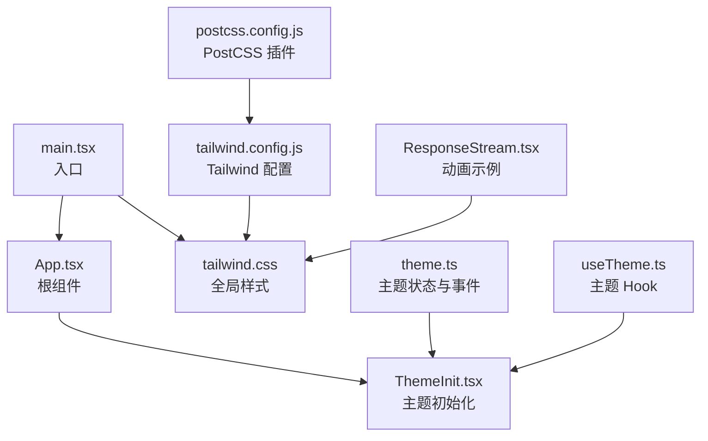
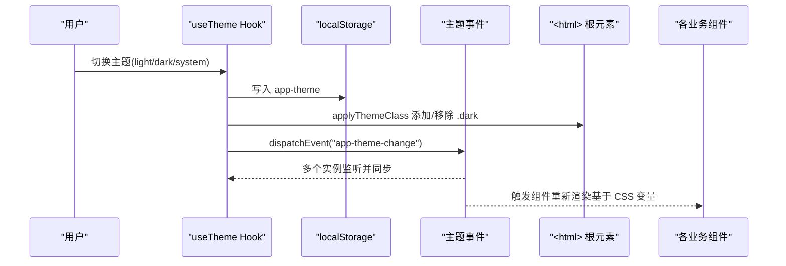
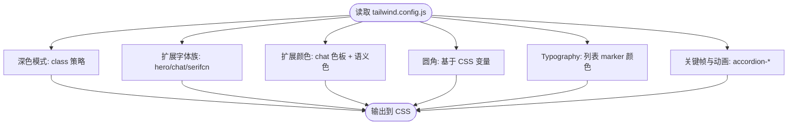
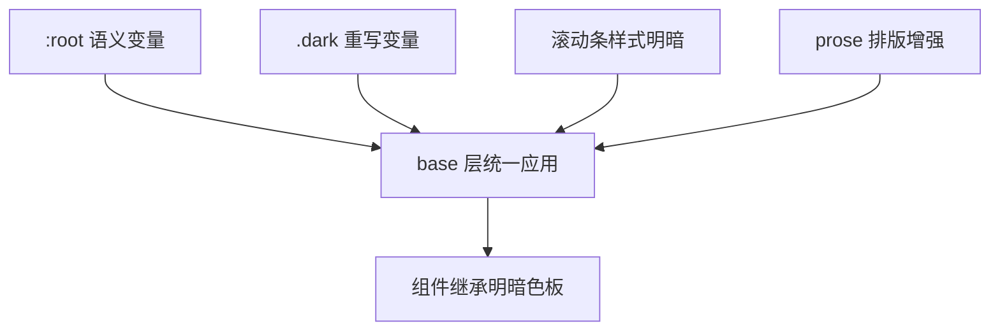
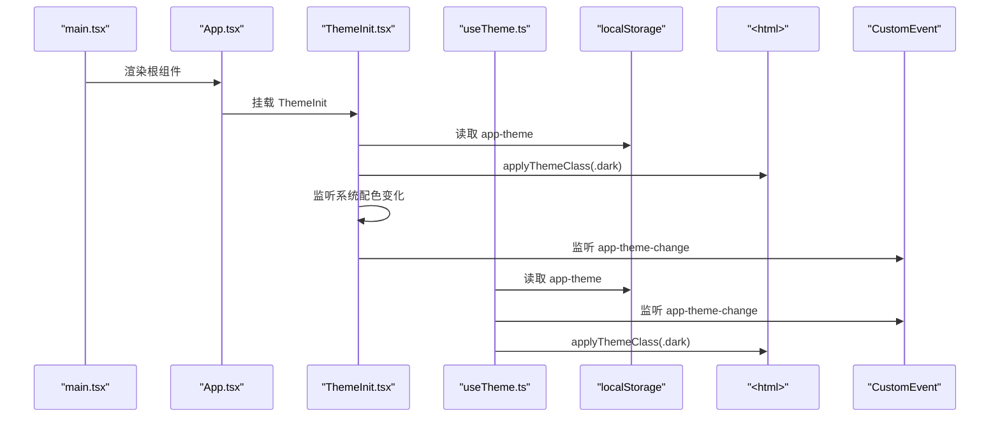
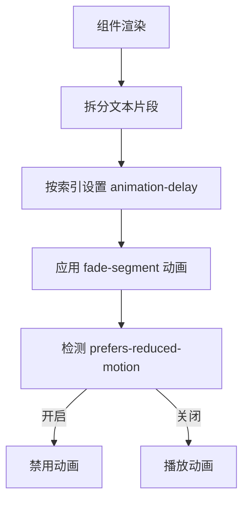
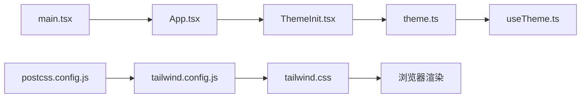

# 样式与主题系统

<cite>
**本文引用的文件**
- [tailwind.config.js](file://frontend/tailwind.config.js)
- [tailwind.css](file://frontend/src/tailwind.css)
- [theme.ts](file://frontend/src/lib/theme.ts)
- [useTheme.ts](file://frontend/src/hooks/useTheme.ts)
- [ThemeInit.tsx](file://frontend/src/components/ThemeInit.tsx)
- [App.tsx](file://frontend/src/App.tsx)
- [main.tsx](file://frontend/src/main.tsx)
- [postcss.config.js](file://frontend/postcss.config.js)
- [package.json](file://frontend/package.json)
- [ResponseStream.tsx](file://frontend/src/components/chat/ResponseStream.tsx)
</cite>

## 目录
1. [简介](#简介)
2. [项目结构](#项目结构)
3. [核心组件](#核心组件)
4. [架构总览](#架构总览)
5. [详细组件分析](#详细组件分析)
6. [依赖关系分析](#依赖关系分析)
7. [性能考虑](#性能考虑)
8. [故障排查指南](#故障排查指南)
9. [结论](#结论)
10. [附录](#附录)

## 简介
本文件系统性梳理 ResumeAgent 前端的样式与主题系统，重点覆盖 Tailwind CSS 配置、自定义主题变量、深色模式切换机制、CSS 变量管理、组件样式封装与继承、样式冲突治理、动画与过渡效果、以及样式开发规范与性能优化策略。目标是帮助开发者快速理解并高效维护样式体系。

## 项目结构
前端样式与主题相关的关键文件组织如下：
- 构建与预处理：PostCSS 配置负责加载 Tailwind 和 Autoprefixer 插件
- Tailwind 配置：定义内容扫描路径、深色模式策略、主题扩展（字体、颜色、圆角、动画等）
- 全局样式：通过 CSS 变量在 :root 与 .dark 中定义明暗两套语义色板，并在 base 层统一应用
- 主题逻辑：通过 localStorage 存储用户选择，事件广播跨组件同步，初始化组件在启动时应用主题
- 动画与过渡：在全局 CSS 中定义关键帧与过渡类，结合媒体查询减少动画偏好

**图表来源**
- [main.tsx:1-25](file://frontend/src/main.tsx#L1-L25)
- [App.tsx:1-111](file://frontend/src/App.tsx#L1-L111)
- [ThemeInit.tsx:1-27](file://frontend/src/components/ThemeInit.tsx#L1-L27)
- [tailwind.css:1-270](file://frontend/src/tailwind.css#L1-L270)
- [tailwind.config.js:1-129](file://frontend/tailwind.config.js#L1-L129)
- [postcss.config.js:1-8](file://frontend/postcss.config.js#L1-L8)
- [theme.ts:1-46](file://frontend/src/lib/theme.ts#L1-L46)
- [useTheme.ts:1-28](file://frontend/src/hooks/useTheme.ts#L1-L28)
- [ResponseStream.tsx:112-134](file://frontend/src/components/chat/ResponseStream.tsx#L112-L134)

**章节来源**
- [postcss.config.js:1-8](file://frontend/postcss.config.js#L1-L8)
- [tailwind.config.js:1-129](file://frontend/tailwind.config.js#L1-L129)
- [tailwind.css:1-270](file://frontend/src/tailwind.css#L1-L270)
- [theme.ts:1-46](file://frontend/src/lib/theme.ts#L1-L46)
- [useTheme.ts:1-28](file://frontend/src/hooks/useTheme.ts#L1-L28)
- [ThemeInit.tsx:1-27](file://frontend/src/components/ThemeInit.tsx#L1-L27)
- [App.tsx:1-111](file://frontend/src/App.tsx#L1-L111)
- [main.tsx:1-25](file://frontend/src/main.tsx#L1-L25)
- [package.json:1-66](file://frontend/package.json#L1-L66)

## 核心组件
- Tailwind 配置与主题扩展
  - 内容扫描范围覆盖 pages、components、app、src，确保按需生成样式
  - 深色模式采用 class 策略，根元素添加 .dark 类触发光暗变量
  - 自定义字体族（英文字体、中文无衬线、中文衬线），Typography 插件增强排版
  - 圆角半径由 CSS 变量驱动，便于主题一致性
  - 关键帧与动画（如手风琴展开/收起）在配置中声明，供组件复用
- CSS 变量与明暗主题
  - :root 定义默认语义色板；.dark 在深色模式下重写关键变量
  - 使用 hsl(var(--xxx)) 形式的 Tailwind 颜色映射，确保与 CSS 变量联动
- 主题状态管理
  - localStorage 作为单一事实源，保存 app-theme
  - applyThemeClass 在 <html> 上增删 .dark，setStoredTheme 写入并广播 app-theme-change
  - ThemeInit 在应用启动时应用主题，并监听系统配色变化与主题事件
  - useTheme 提供主题状态与切换方法，内部监听主题事件保持多实例同步
- 全局样式与动画
  - 在 utilities/base 层定义滚动条、列表/段落间距、链接样式、Markdown 增强规则
  - 定义聊天消息进入动画与减少动画偏好适配
  - 组件内可复用动画类（如 fade-segment）

**章节来源**
- [tailwind.config.js:1-129](file://frontend/tailwind.config.js#L1-L129)
- [tailwind.css:92-148](file://frontend/src/tailwind.css#L92-L148)
- [theme.ts:1-46](file://frontend/src/lib/theme.ts#L1-L46)
- [ThemeInit.tsx:1-27](file://frontend/src/components/ThemeInit.tsx#L1-L27)
- [useTheme.ts:1-28](file://frontend/src/hooks/useTheme.ts#L1-L28)
- [tailwind.css:10-90](file://frontend/src/tailwind.css#L10-L90)
- [ResponseStream.tsx:112-134](file://frontend/src/components/chat/ResponseStream.tsx#L112-L134)

## 架构总览
主题系统围绕“配置 → 变量 → 初始化 → Hook → 组件”闭环工作，Tailwind 与 CSS 变量协同提供明暗一致性，PostCSS 负责编译与前缀补全。

**图表来源**
- [useTheme.ts:14-27](file://frontend/src/hooks/useTheme.ts#L14-L27)
- [theme.ts:39-45](file://frontend/src/lib/theme.ts#L39-L45)
- [ThemeInit.tsx:3-24](file://frontend/src/components/ThemeInit.tsx#L3-L24)

## 详细组件分析

### Tailwind 配置与主题扩展
- 内容扫描与构建范围
  - 扫描 pages、components、app、src 下的 TS/TSX 文件，确保按需生成
- 深色模式策略
  - 使用 class 策略，根元素 .dark 控制明暗变量
- 主题扩展
  - 字体族：hero、chat、serifcn，满足不同场景排版需求
  - 颜色：提供 chat 专属色板与通用语义色（primary/secondary/muted 等）
  - 圆角：基于 CSS 变量，md/sm 通过计算与主 radius 对齐
  - Typography：增强列表 marker 颜色
  - 动画：accordion-down/up 关键帧与对应动画类
- 插件
  - @tailwindcss/typography

**图表来源**
- [tailwind.config.js:4-127](file://frontend/tailwind.config.js#L4-L127)

**章节来源**
- [tailwind.config.js:1-129](file://frontend/tailwind.config.js#L1-L129)

### CSS 变量与明暗主题
- 变量定义
  - :root 默认语义色板（background/foreground/card/popover/primary/secondary/muted/destructive/border/input/ring/radius）
  - .dark 重写上述变量，形成明暗两套主题
- 统一应用
  - base 层通过 @apply border-border、bg-background/text-foreground 实现全局继承
- 滚动条样式
  - 通过 CSS 变量与伪元素在明暗模式下分别设置滚动条颜色
- Markdown 增强
  - prose 样式在 utilities/base 层统一定义，提升阅读体验

**图表来源**
- [tailwind.css:92-148](file://frontend/src/tailwind.css#L92-L148)
- [tailwind.css:150-196](file://frontend/src/tailwind.css#L150-L196)
- [tailwind.css:204-270](file://frontend/src/tailwind.css#L204-L270)

**章节来源**
- [tailwind.css:92-148](file://frontend/src/tailwind.css#L92-L148)
- [tailwind.css:150-196](file://frontend/src/tailwind.css#L150-L196)
- [tailwind.css:204-270](file://frontend/src/tailwind.css#L204-L270)

### 主题初始化与事件同步
- ThemeInit
  - 启动时按存储主题应用（light/dark/system）
  - 监听 prefers-color-scheme 变化，在 system 模式下实时重应用
  - 监听 app-theme-change 事件，保证多实例一致
- useTheme
  - 读取存储主题，提供 setTheme 方法
  - 监听主题事件，确保 UI 同步
- theme.ts
  - getStoredTheme/systemPrefersDark/resolveIsDark/applyThemeClass/setStoredTheme
  - setStoredTheme 写入 localStorage 并广播事件

**图表来源**
- [main.tsx:1-25](file://frontend/src/main.tsx#L1-L25)
- [App.tsx:53-53](file://frontend/src/App.tsx#L53-L53)
- [ThemeInit.tsx:3-24](file://frontend/src/components/ThemeInit.tsx#L3-L24)
- [useTheme.ts:14-21](file://frontend/src/hooks/useTheme.ts#L14-L21)
- [theme.ts:39-45](file://frontend/src/lib/theme.ts#L39-L45)

**章节来源**
- [ThemeInit.tsx:1-27](file://frontend/src/components/ThemeInit.tsx#L1-L27)
- [useTheme.ts:1-28](file://frontend/src/hooks/useTheme.ts#L1-L28)
- [theme.ts:1-46](file://frontend/src/lib/theme.ts#L1-L46)

### 动画与过渡效果
- 全局动画
  - chat-fade-in：聊天消息进入时的淡入与位移动画
  - 减少动画偏好：prefers-reduced-motion: reduce 时禁用动画
- 组件级动画
  - ResponseStream：逐字符/分段渲染时使用 fade-segment 与 animation-delay 实现打字机效果
- 动画最佳实践
  - 仅使用 transform/opacity，避免布局抖动
  - 使用 will-change 与合理的缓动函数

**图表来源**
- [tailwind.css:21-40](file://frontend/src/tailwind.css#L21-L40)
- [ResponseStream.tsx:112-134](file://frontend/src/components/chat/ResponseStream.tsx#L112-L134)

**章节来源**
- [tailwind.css:21-40](file://frontend/src/tailwind.css#L21-L40)
- [ResponseStream.tsx:112-134](file://frontend/src/components/chat/ResponseStream.tsx#L112-L134)

### 组件样式封装与继承
- 封装策略
  - 使用 Tailwind 工具类进行原子化样式组合，避免重复定义
  - 在 utilities/base 层统一定义通用样式（滚动条、prose、列表/段落）
- 继承与一致性
  - 通过 CSS 变量与 hsl(...) 颜色映射，确保组件继承明暗一致的语义色
  - 圆角与阴影等尺寸统一由变量驱动
- 冲突解决
  - 优先使用语义类（bg-foreground、text-primary）而非硬编码颜色
  - 避免在组件内覆盖全局样式，必要时使用作用域类或层（@layer）

**章节来源**
- [tailwind.css:10-90](file://frontend/src/tailwind.css#L10-L90)
- [tailwind.css:92-148](file://frontend/src/tailwind.css#L92-L148)
- [tailwind.config.js:105-109](file://frontend/tailwind.config.js#L105-L109)

## 依赖关系分析
- 构建链路
  - PostCSS 加载 tailwindcss 与 autoprefixer 插件
  - Tailwind 读取配置，扫描内容，生成 CSS
  - 浏览器加载编译后的 CSS，配合 CSS 变量与 class 切换实现主题
- 运行时依赖
  - theme.ts 与 useTheme.ts 依赖 localStorage 与 CustomEvent
  - ThemeInit.tsx 依赖 window.matchMedia 与 DOM API

**图表来源**
- [postcss.config.js:1-8](file://frontend/postcss.config.js#L1-L8)
- [tailwind.config.js:1-129](file://frontend/tailwind.config.js#L1-L129)
- [tailwind.css:1-270](file://frontend/src/tailwind.css#L1-L270)
- [main.tsx:1-25](file://frontend/src/main.tsx#L1-L25)
- [App.tsx:1-111](file://frontend/src/App.tsx#L1-L111)
- [ThemeInit.tsx:1-27](file://frontend/src/components/ThemeInit.tsx#L1-L27)
- [theme.ts:1-46](file://frontend/src/lib/theme.ts#L1-L46)
- [useTheme.ts:1-28](file://frontend/src/hooks/useTheme.ts#L1-L28)

**章节来源**
- [postcss.config.js:1-8](file://frontend/postcss.config.js#L1-L8)
- [package.json:12-66](file://frontend/package.json#L12-L66)

## 性能考虑
- 按需生成
  - Tailwind 内容扫描路径精准，避免生成冗余样式
- CSS 变量与 class 切换
  - 明暗切换仅变更 CSS 变量与根元素 class，避免重排与重绘
- 动画性能
  - 仅使用 transform/opacity，减少布局触发
  - 减少动画偏好时禁用动画，降低资源消耗
- 构建优化
  - PostCSS 自动前缀，减少手动兼容成本

[本节为通用指导，无需特定文件引用]

## 故障排查指南
- 切换主题无效
  - 检查 localStorage 是否正确写入 app-theme
  - 确认 <html> 是否存在 .dark 类
  - 验证 ThemeInit 是否挂载且未被卸载
- 系统主题跟随不生效
  - 确认系统 prefers-color-scheme 支持
  - 检查 ThemeInit 中 mediaListener 是否注册
- 动画异常
  - 检查 prefers-reduced-motion 设置
  - 确认动画类与关键帧定义完整
- 样式冲突
  - 使用语义类替代硬编码颜色
  - 避免在组件内覆盖全局样式，必要时使用作用域类

**章节来源**
- [theme.ts:39-45](file://frontend/src/lib/theme.ts#L39-L45)
- [ThemeInit.tsx:9-18](file://frontend/src/components/ThemeInit.tsx#L9-L18)
- [tailwind.css:36-40](file://frontend/src/tailwind.css#L36-L40)

## 结论
该样式与主题系统通过 Tailwind 配置与 CSS 变量实现了明暗一致的主题体验，结合 class 策略与事件广播，确保多组件实例的同步与一致性。全局动画与排版增强提升了交互质量，同时兼顾性能与可维护性。建议在后续迭代中持续遵循语义化与原子化原则，强化样式开发规范与测试流程。

[本节为总结，无需特定文件引用]

## 附录

### 样式开发规范与最佳实践
- 命名约定
  - 使用 Tailwind 工具类进行原子化组合，避免自定义类名
  - 组件样式尽量通过语义类（bg-foreground/text-primary）表达意图
- 动画与过渡
  - 仅使用 transform/opacity，避免布局触发
  - 为重要过渡提供合理的缓动曲线与持续时间
- 可访问性
  - 保持足够的对比度，关注高对比度模式下的可读性
  - 提供减少动画偏好的降级方案
- 维护性
  - 将通用样式收敛至 utilities/base 层
  - 通过 CSS 变量与 Tailwind 配置集中管理主题色板

[本节为通用指导，无需特定文件引用]