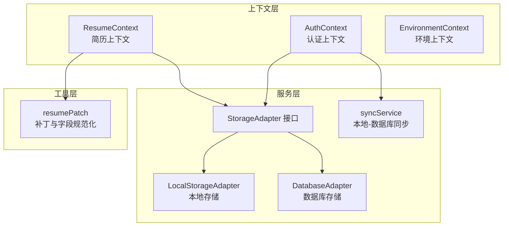
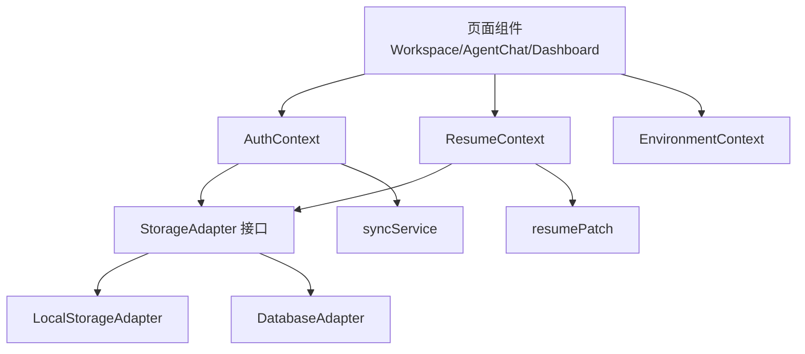
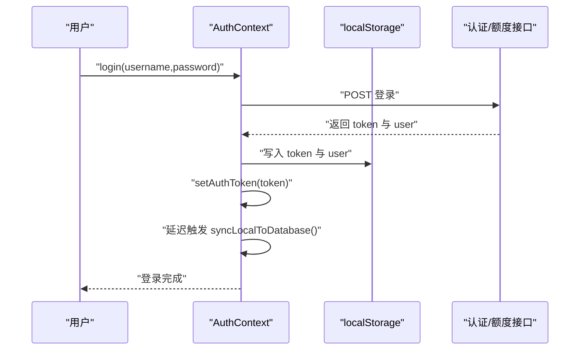
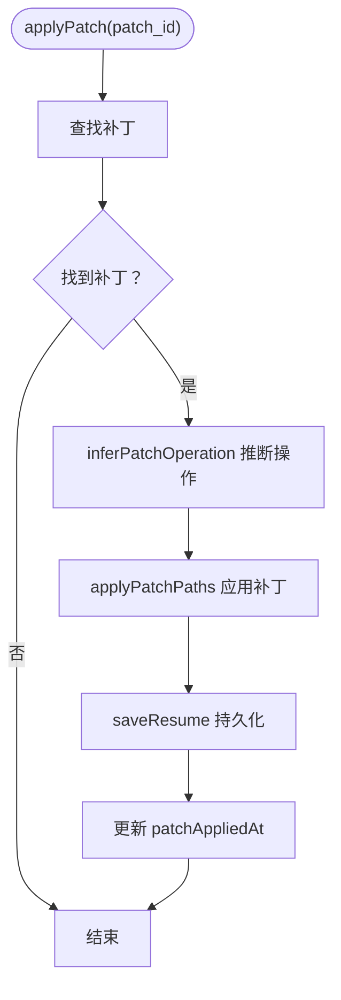
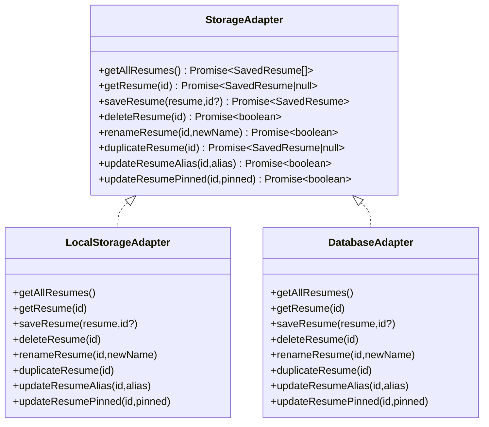
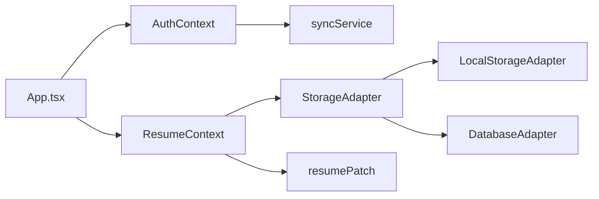

# 状态管理系统

<cite>
**本文引用的文件**
- [AuthContext.tsx](file://frontend/src/contexts/AuthContext.tsx)
- [ResumeContext.tsx](file://frontend/src/contexts/ResumeContext.tsx)
- [EnvironmentContext.tsx](file://frontend/src/contexts/EnvironmentContext.tsx)
- [LocalStorageAdapter.ts](file://frontend/src/services/storage/LocalStorageAdapter.ts)
- [DatabaseAdapter.ts](file://frontend/src/services/storage/DatabaseAdapter.ts)
- [StorageAdapter.ts](file://frontend/src/services/storage/StorageAdapter.ts)
- [syncService.ts](file://frontend/src/services/syncService.ts)
- [resumePatch.ts](file://frontend/src/utils/resumePatch.ts)
- [App.tsx](file://frontend/src/App.tsx)
- [ErrorBoundary.tsx](file://frontend/src/ErrorBoundary.tsx)
</cite>

## 目录
1. [简介](#简介)
2. [项目结构](#项目结构)
3. [核心组件](#核心组件)
4. [架构总览](#架构总览)
5. [详细组件分析](#详细组件分析)
6. [依赖关系分析](#依赖关系分析)
7. [性能考量](#性能考量)
8. [故障排查指南](#故障排查指南)
9. [结论](#结论)
10. [附录](#附录)

## 简介
本文件系统性梳理 ResumeAgent 前端的状态管理方案，覆盖 Context API 使用、自定义 Hook 设计模式、全局状态策略、本地存储适配器与数据持久化、状态同步机制、异步状态处理、错误状态管理与加载控制、性能优化与内存泄漏防护等主题。重点解释 ResumeContext、AuthContext 等核心上下文的作用与实现，并给出最佳实践与优化建议。

## 项目结构
前端状态管理主要由三层构成：
- 上下文层：负责声明 Provider 与消费 Hook，暴露状态与动作函数
- 服务层：封装存储适配器、同步服务、认证服务等
- 工具层：提供补丁计算、字段规范化、Diff 展示等通用逻辑

图表来源
- [AuthContext.tsx:61-266](file://frontend/src/contexts/AuthContext.tsx#L61-L266)
- [ResumeContext.tsx:37-110](file://frontend/src/contexts/ResumeContext.tsx#L37-L110)
- [EnvironmentContext.tsx:19-36](file://frontend/src/contexts/EnvironmentContext.tsx#L19-L36)
- [StorageAdapter.ts:17-28](file://frontend/src/services/storage/StorageAdapter.ts#L17-L28)
- [LocalStorageAdapter.ts:9-136](file://frontend/src/services/storage/LocalStorageAdapter.ts#L9-L136)
- [DatabaseAdapter.ts:45-167](file://frontend/src/services/storage/DatabaseAdapter.ts#L45-L167)
- [syncService.ts:37-70](file://frontend/src/services/syncService.ts#L37-L70)
- [resumePatch.ts:172-218](file://frontend/src/utils/resumePatch.ts#L172-L218)

章节来源
- [App.tsx:41-108](file://frontend/src/App.tsx#L41-L108)

## 核心组件
- AuthContext：统一管理用户认证态、令牌、登录/注册/登出、额度刷新、弹窗控制与 BetterAuth 回跳逻辑
- ResumeContext：管理简历数据、补丁队列、补丁应用/拒绝/失效、消息绑定与渲染触发
- EnvironmentContext：运行时环境与 API 基础地址管理
- StorageAdapter 生态：抽象接口 + 本地/数据库适配器 + 同步服务
- resumePatch：补丁路径解析、操作推断、字段规范化与 Diff 展示

章节来源
- [AuthContext.tsx:13-37](file://frontend/src/contexts/AuthContext.tsx#L13-L37)
- [ResumeContext.tsx:19-33](file://frontend/src/contexts/ResumeContext.tsx#L19-L33)
- [EnvironmentContext.tsx:10-15](file://frontend/src/contexts/EnvironmentContext.tsx#L10-L15)
- [StorageAdapter.ts:6-28](file://frontend/src/services/storage/StorageAdapter.ts#L6-L28)
- [resumePatch.ts:26-218](file://frontend/src/utils/resumePatch.ts#L26-L218)

## 架构总览
整体采用“上下文 + 适配器 + 工具”的分层设计：
- 上下文层通过 Context API 提供状态与动作，避免深层传递
- 服务层以 StorageAdapter 抽象屏蔽本地/云端差异，支持多后端切换
- 工具层集中处理复杂业务规则（补丁、Diff、字段清洗）

图表来源
- [App.tsx:41-108](file://frontend/src/App.tsx#L41-L108)
- [AuthContext.tsx:61-266](file://frontend/src/contexts/AuthContext.tsx#L61-L266)
- [ResumeContext.tsx:37-110](file://frontend/src/contexts/ResumeContext.tsx#L37-L110)
- [EnvironmentContext.tsx:19-36](file://frontend/src/contexts/EnvironmentContext.tsx#L19-L36)
- [StorageAdapter.ts:17-28](file://frontend/src/services/storage/StorageAdapter.ts#L17-L28)
- [LocalStorageAdapter.ts:9-136](file://frontend/src/services/storage/LocalStorageAdapter.ts#L9-L136)
- [DatabaseAdapter.ts:45-167](file://frontend/src/services/storage/DatabaseAdapter.ts#L45-L167)
- [syncService.ts:37-70](file://frontend/src/services/syncService.ts#L37-L70)
- [resumePatch.ts:172-218](file://frontend/src/utils/resumePatch.ts#L172-L218)

## 详细组件分析

### AuthContext 分析
- 状态与派生
  - 用户信息、令牌、加载状态、弹窗状态与模式
  - 认证态基于 user 存在且 token 或 betterAuthUserId 存在
- 初始化流程
  - 优先检查 URL 中的 legacy_token/legacy_user（从 Next.js 认证页回跳）
  - 若启用 BetterAuth，则尝试获取会话并回填 legacy id/role 与额度
  - 否则回退到本地 JWT，优先用本地用户信息完成首屏，再异步校验
- 登录/注册/登出
  - 写入本地 token 与用户信息，设置认证头，触发本地数据延迟同步
  - 登出时根据是否为 BetterAuth 会话决定调用对应登出接口
- 错误处理
  - 401/403 时清理本地 token 与用户信息，避免悬挂状态
- 弹窗与重定向
  - 启用 BetterAuth 时统一重定向至认证页，否则打开内嵌模态

图表来源
- [AuthContext.tsx:178-206](file://frontend/src/contexts/AuthContext.tsx#L178-L206)
- [AuthContext.tsx:186-190](file://frontend/src/contexts/AuthContext.tsx#L186-L190)

章节来源
- [AuthContext.tsx:61-176](file://frontend/src/contexts/AuthContext.tsx#L61-L176)
- [AuthContext.tsx:178-228](file://frontend/src/contexts/AuthContext.tsx#L178-L228)
- [AuthContext.tsx:230-245](file://frontend/src/contexts/AuthContext.tsx#L230-L245)
- [AuthContext.tsx:208-215](file://frontend/src/contexts/AuthContext.tsx#L208-L215)

### ResumeContext 分析
- 状态与派生
  - 当前简历数据、待处理补丁队列、补丁应用时间戳（触发 PDF 重渲染）
- 动作函数
  - setResume：设置/清空简历
  - pushPatch/rejectPatch/supersede/clear/rebind：补丁生命周期管理
  - applyPatch：推断操作、应用补丁、持久化、更新时间戳
- 持久化策略
  - 通过 saveResume 持久化，失败静默记录日志
- 补丁算法
  - inferPatchOperation：根据摘要/路径/前后值推断 add/update/delete/set
  - applyPatchPaths：按路径批量写入，支持数组删除与经验项规范化
  - pruneEmptyExperienceEntries：清理空经验占位

图表来源
- [ResumeContext.tsx:63-77](file://frontend/src/contexts/ResumeContext.tsx#L63-L77)
- [resumePatch.ts:60-87](file://frontend/src/utils/resumePatch.ts#L60-L87)
- [resumePatch.ts:172-218](file://frontend/src/utils/resumePatch.ts#L172-L218)

章节来源
- [ResumeContext.tsx:37-110](file://frontend/src/contexts/ResumeContext.tsx#L37-L110)
- [resumePatch.ts:60-87](file://frontend/src/utils/resumePatch.ts#L60-L87)
- [resumePatch.ts:172-218](file://frontend/src/utils/resumePatch.ts#L172-L218)

### EnvironmentContext 分析
- 提供运行时环境枚举、API 基础地址与环境切换能力
- 通过 getRuntimeEnv/getApiBaseUrl/getRuntimeEnvOptions 获取配置
- setEnv 更新内存与持久化状态

章节来源
- [EnvironmentContext.tsx:19-36](file://frontend/src/contexts/EnvironmentContext.tsx#L19-L36)

### 存储适配器与同步机制
- StorageAdapter 接口
  - 统一定义 getAll/get/save/delete/rename/duplicate/update 等方法
- LocalStorageAdapter
  - 以 localStorage 为唯一存储，维护当前简历 ID、去敏照片、重复项处理
- DatabaseAdapter
  - 通过 API 客户端访问后端，拦截 401 清理 token，支持按 id 创建/更新
- 同步服务 syncService
  - 读取本地全部简历，构造 payload 发送到 /api/resumes/sync
  - 合并结果后更新本地缓存

图表来源
- [StorageAdapter.ts:17-28](file://frontend/src/services/storage/StorageAdapter.ts#L17-L28)
- [LocalStorageAdapter.ts:9-136](file://frontend/src/services/storage/LocalStorageAdapter.ts#L9-L136)
- [DatabaseAdapter.ts:45-167](file://frontend/src/services/storage/DatabaseAdapter.ts#L45-L167)

章节来源
- [LocalStorageAdapter.ts:9-136](file://frontend/src/services/storage/LocalStorageAdapter.ts#L9-L136)
- [DatabaseAdapter.ts:45-167](file://frontend/src/services/storage/DatabaseAdapter.ts#L45-L167)
- [syncService.ts:37-70](file://frontend/src/services/syncService.ts#L37-L70)

### 补丁与字段规范化
- 路径工具：getByPath/setByPath/deleteByPath 支持数组索引
- 操作推断：inferPatchOperation 依据摘要/路径/前后值判定 add/update/delete/set
- 规范化：normalizeExperiencePatchItem、normalizeResumePatchValue
- Diff 展示：formatPatchDiffSide/formatResumeDiffPreview/getDiffDisplayContent

章节来源
- [resumePatch.ts:5-22](file://frontend/src/utils/resumePatch.ts#L5-L22)
- [resumePatch.ts:60-87](file://frontend/src/utils/resumePatch.ts#L60-L87)
- [resumePatch.ts:92-131](file://frontend/src/utils/resumePatch.ts#L92-L131)
- [resumePatch.ts:172-218](file://frontend/src/utils/resumePatch.ts#L172-L218)
- [resumePatch.ts:312-349](file://frontend/src/utils/resumePatch.ts#L312-L349)
- [resumePatch.ts:534-572](file://frontend/src/utils/resumePatch.ts#L534-L572)
- [resumePatch.ts:634-646](file://frontend/src/utils/resumePatch.ts#L634-L646)
- [resumePatch.ts:676-681](file://frontend/src/utils/resumePatch.ts#L676-L681)

## 依赖关系分析
- App 作为根组件，包裹 ResumeProvider 并挂载路由与错误边界
- AuthContext 在初始化阶段可能触发 BetterAuth 会话与额度拉取，影响路由权限
- ResumeContext 依赖 StorageAdapter 与 resumePatch，提供补丁应用与持久化
- syncService 依赖 StorageAdapter 与 API 客户端，负责本地与数据库的合并与落盘

图表来源
- [App.tsx:41-108](file://frontend/src/App.tsx#L41-L108)
- [AuthContext.tsx:61-266](file://frontend/src/contexts/AuthContext.tsx#L61-L266)
- [ResumeContext.tsx:37-110](file://frontend/src/contexts/ResumeContext.tsx#L37-L110)
- [StorageAdapter.ts:17-28](file://frontend/src/services/storage/StorageAdapter.ts#L17-L28)
- [LocalStorageAdapter.ts:9-136](file://frontend/src/services/storage/LocalStorageAdapter.ts#L9-L136)
- [DatabaseAdapter.ts:45-167](file://frontend/src/services/storage/DatabaseAdapter.ts#L45-L167)
- [syncService.ts:37-70](file://frontend/src/services/syncService.ts#L37-L70)
- [resumePatch.ts:172-218](file://frontend/src/utils/resumePatch.ts#L172-L218)

章节来源
- [App.tsx:41-108](file://frontend/src/App.tsx#L41-L108)

## 性能考量
- 首屏优化
  - AuthContext 优先使用本地用户信息完成首屏，避免等待 /api/auth/me
  - BetterAuth 会话存在时异步回填 legacy id/role 与额度，不阻塞首屏
- 资源竞争缓解
  - 登录/注册成功后延迟触发本地数据同步，减少与首屏请求的并发压力
- 数据一致性
  - DatabaseAdapter 拦截 401 清理 token，避免无效请求
  - syncService 合并后更新本地缓存，保证 UI 与存储一致
- UI 响应
  - ResumeContext 通过 patchAppliedAt 时间戳驱动 PDF 重渲染，避免不必要的全量重算

章节来源
- [AuthContext.tsx:100-130](file://frontend/src/contexts/AuthContext.tsx#L100-L130)
- [AuthContext.tsx:178-206](file://frontend/src/contexts/AuthContext.tsx#L178-L206)
- [AuthContext.tsx:186-190](file://frontend/src/contexts/AuthContext.tsx#L186-L190)
- [DatabaseAdapter.ts:16-29](file://frontend/src/services/storage/DatabaseAdapter.ts#L16-L29)
- [syncService.ts:37-70](file://frontend/src/services/syncService.ts#L37-L70)
- [ResumeContext.tsx:76](file://frontend/src/contexts/ResumeContext.tsx#L76)

## 故障排查指南
- 认证态异常
  - 现象：登录后仍显示未登录或 401
  - 排查：确认 AuthContext 是否清理了本地 token 与用户信息；检查 BetterAuth 会话与回跳参数
- 额度/角色缺失
  - 现象：管理员功能不可用
  - 排查：确认 BetterAuth 模式下是否成功回填 legacy id/role；检查 fetchUserEntitlement 是否报错
- 简历数据未持久化
  - 现象：刷新后丢失或未更新
  - 排查：检查 saveResume 是否抛错；确认 StorageAdapter 的实现与网络状态
- 补丁未生效
  - 现象：编辑后 UI 未更新
  - 排查：确认 applyPatch 是否被调用、inferPatchOperation 推断是否正确、applyPatchPaths 是否按路径写入
- 同步失败
  - 现象：本地与数据库不一致
  - 排查：查看 syncLocalToDatabase 的返回与本地缓存更新情况

章节来源
- [AuthContext.tsx:161-172](file://frontend/src/contexts/AuthContext.tsx#L161-L172)
- [AuthContext.tsx:107-128](file://frontend/src/contexts/AuthContext.tsx#L107-L128)
- [DatabaseAdapter.ts:108-112](file://frontend/src/services/storage/DatabaseAdapter.ts#L108-L112)
- [ResumeContext.tsx:63-77](file://frontend/src/contexts/ResumeContext.tsx#L63-L77)
- [syncService.ts:37-70](file://frontend/src/services/syncService.ts#L37-L70)

## 结论
该状态管理方案以 Context API 为核心，结合 StorageAdapter 抽象与 resumePatch 工具，实现了认证态、简历数据与补丁流的清晰分离。通过延迟同步、拦截 401、首屏本地回填等策略，兼顾了用户体验与数据一致性。建议在后续迭代中进一步完善错误边界与监控埋点，增强可观测性与可维护性。

## 附录
- 最佳实践
  - 使用 useMemo/memo 缓存上下文值，避免子树重渲染
  - 将副作用集中在 Provider 内部，保持消费端纯净
  - 对外暴露稳定的动作签名，内部实现可演进
- 性能优化
  - 将昂贵计算放入 Web Worker 或惰性执行
  - 使用 requestIdleCallback 控制批处理时机
- 内存泄漏防护
  - 在 useEffect 中返回清理函数，避免定时器/订阅泄漏
  - 对全局事件监听及时解绑
- 异步状态处理
  - 使用 loading、error、data 三元状态描述异步流程
  - 对幂等请求进行去抖/节流
- 错误状态管理
  - 明确错误边界与降级 UI
  - 对可恢复错误提供重试与回退策略
- 加载状态控制
  - 首屏使用骨架屏与占位符
  - 对长任务使用进度指示与取消能力