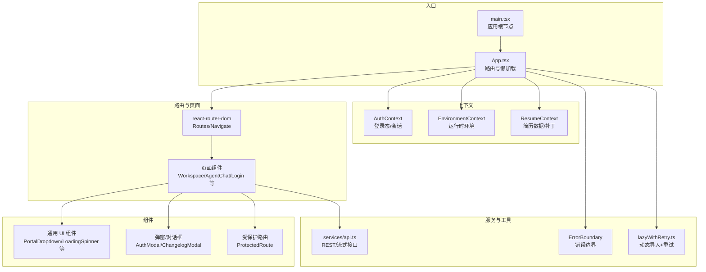
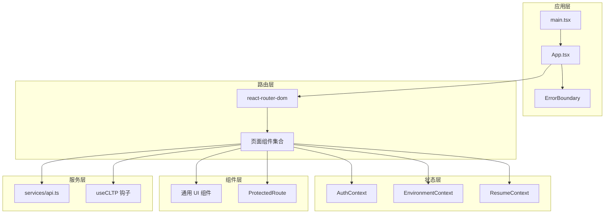
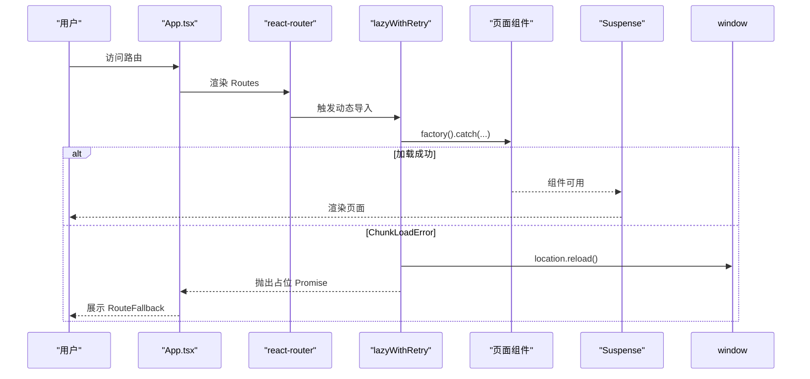
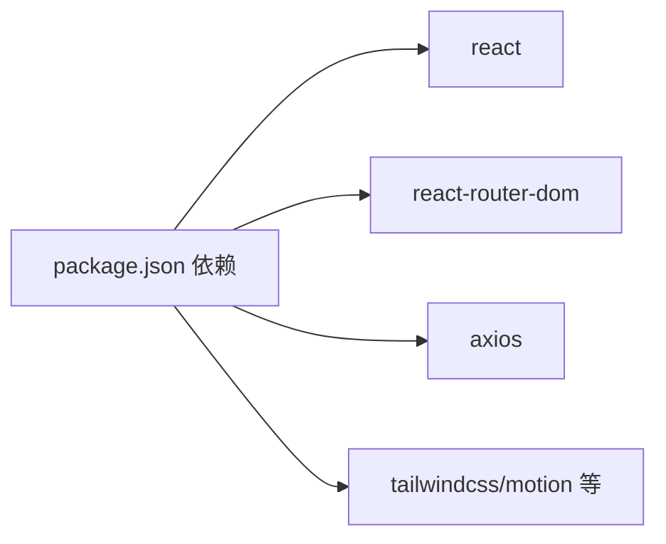
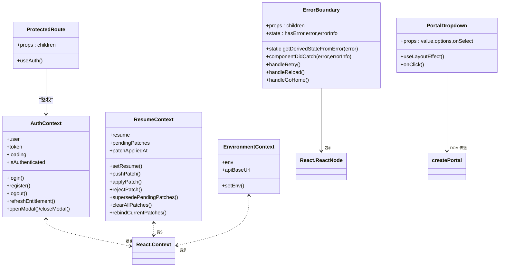

# 组件架构设计

<cite>
**本文档引用的文件**
- [frontend/src/App.tsx](file://frontend/src/App.tsx)
- [frontend/src/main.tsx](file://frontend/src/main.tsx)
- [frontend/src/ErrorBoundary.tsx](file://frontend/src/ErrorBoundary.tsx)
- [frontend/src/lib/lazyWithRetry.ts](file://frontend/src/lib/lazyWithRetry.ts)
- [frontend/src/contexts/AuthContext.tsx](file://frontend/src/contexts/AuthContext.tsx)
- [frontend/src/contexts/ResumeContext.tsx](file://frontend/src/contexts/ResumeContext.tsx)
- [frontend/src/contexts/EnvironmentContext.tsx](file://frontend/src/contexts/EnvironmentContext.tsx)
- [frontend/src/components/common/PortalDropdown.tsx](file://frontend/src/components/common/PortalDropdown.tsx)
- [frontend/src/components/ProtectedRoute.tsx](file://frontend/src/components/ProtectedRoute.tsx)
- [frontend/src/hooks/useCLTP.ts](file://frontend/src/hooks/useCLTP.ts)
- [frontend/src/services/api.ts](file://frontend/src/services/api.ts)
- [frontend/package.json](file://frontend/package.json)
</cite>

## 目录
1. [引言](#引言)
2. [项目结构](#项目结构)
3. [核心组件](#核心组件)
4. [架构总览](#架构总览)
5. [详细组件分析](#详细组件分析)
6. [依赖分析](#依赖分析)
7. [性能考虑](#性能考虑)
8. [故障排查指南](#故障排查指南)
9. [结论](#结论)
10. [附录](#附录)

## 引言
本文件系统性梳理前端组件架构，聚焦于组件层次结构、组件分类（UI 组件、容器组件、高阶组件）、组件复用策略；详解组件间通信模式（props 传递、事件处理）、错误边界处理、懒加载与动态导入策略；给出组件开发规范、命名约定、代码组织原则，并总结生命周期管理与性能优化技巧。目标是帮助开发者快速理解并高效扩展该 ResumeAgent 前端体系。

## 项目结构
前端采用“页面 + 组件 + 上下文 + 服务 + 工具”的分层组织方式：
- 页面层：负责路由与业务页面入口，如工作区、聊天、登录、设置等。
- 组件层：细分为通用 UI 组件（如下拉、加载、骨架屏）与业务组件（如 PDF 预览、聊天面板）。
- 上下文层：提供跨层级的状态共享（认证、环境、简历数据）。
- 服务层：封装 API 请求、流式传输、存储等能力。
- 工具层：运行时环境、主题初始化、懒加载增强等。

图表来源
- [frontend/src/main.tsx:1-25](file://frontend/src/main.tsx#L1-L25)
- [frontend/src/App.tsx:1-111](file://frontend/src/App.tsx#L1-L111)
- [frontend/src/ErrorBoundary.tsx:1-128](file://frontend/src/ErrorBoundary.tsx#L1-L128)
- [frontend/src/lib/lazyWithRetry.ts:1-35](file://frontend/src/lib/lazyWithRetry.ts#L1-L35)
- [frontend/src/contexts/AuthContext.tsx:1-275](file://frontend/src/contexts/AuthContext.tsx#L1-L275)
- [frontend/src/contexts/ResumeContext.tsx:1-117](file://frontend/src/contexts/ResumeContext.tsx#L1-L117)
- [frontend/src/contexts/EnvironmentContext.tsx:1-46](file://frontend/src/contexts/EnvironmentContext.tsx#L1-L46)
- [frontend/src/components/common/PortalDropdown.tsx:1-244](file://frontend/src/components/common/PortalDropdown.tsx#L1-L244)
- [frontend/src/components/ProtectedRoute.tsx:1-18](file://frontend/src/components/ProtectedRoute.tsx#L1-L18)
- [frontend/src/hooks/useCLTP.ts:1-387](file://frontend/src/hooks/useCLTP.ts#L1-L387)
- [frontend/src/services/api.ts:1-800](file://frontend/src/services/api.ts#L1-L800)

章节来源
- [frontend/src/App.tsx:1-111](file://frontend/src/App.tsx#L1-L111)
- [frontend/src/main.tsx:1-25](file://frontend/src/main.tsx#L1-L25)

## 核心组件
- 应用根节点与提供者
  - 根入口通过 Provider 层包装，依次注入运行时环境、认证上下文与应用根组件。
  - 关键提供者：EnvironmentProvider、AuthProvider、ResumeProvider。
- 错误边界
  - 统一捕获子树异常，提供重试、刷新、返回首页等交互。
- 懒加载与动态导入
  - 使用自定义 lazyWithRetry 包装动态 import，自动处理 chunk 加载错误并刷新页面。
- 路由与页面
  - 使用 react-router-dom 进行路由配置，结合受保护路由与条件渲染控制功能开关。
- 上下文
  - AuthContext：登录态、令牌、用户信息、模态控制、额度查询。
  - ResumeContext：简历数据、补丁队列、持久化、应用补丁。
  - EnvironmentContext：运行时环境、API 基址、环境切换。
- 通用组件
  - PortalDropdown：基于 createPortal 的下拉菜单，支持创建、徽标、定位等特性。
  - ProtectedRoute：鉴权守卫，未登录或加载中时进行跳转或占位。
- 服务与钩子
  - useCLTP：封装流式代理对话，统一事件解析、去重、合并与错误处理。
  - api.ts：封装 PDF 渲染（含流式）、简历生成/改写、额度/配额等接口。

章节来源
- [frontend/src/main.tsx:1-25](file://frontend/src/main.tsx#L1-L25)
- [frontend/src/ErrorBoundary.tsx:1-128](file://frontend/src/ErrorBoundary.tsx#L1-L128)
- [frontend/src/lib/lazyWithRetry.ts:1-35](file://frontend/src/lib/lazyWithRetry.ts#L1-L35)
- [frontend/src/contexts/AuthContext.tsx:1-275](file://frontend/src/contexts/AuthContext.tsx#L1-L275)
- [frontend/src/contexts/ResumeContext.tsx:1-117](file://frontend/src/contexts/ResumeContext.tsx#L1-L117)
- [frontend/src/contexts/EnvironmentContext.tsx:1-46](file://frontend/src/contexts/EnvironmentContext.tsx#L1-L46)
- [frontend/src/components/common/PortalDropdown.tsx:1-244](file://frontend/src/components/common/PortalDropdown.tsx#L1-L244)
- [frontend/src/components/ProtectedRoute.tsx:1-18](file://frontend/src/components/ProtectedRoute.tsx#L1-L18)
- [frontend/src/hooks/useCLTP.ts:1-387](file://frontend/src/hooks/useCLTP.ts#L1-L387)
- [frontend/src/services/api.ts:1-800](file://frontend/src/services/api.ts#L1-L800)

## 架构总览
应用采用“路由驱动 + 上下文共享 + 服务抽象 + 错误边界兜底”的架构模式。页面组件作为容器组件协调多个 UI 组件与服务钩子；上下文提供跨层级状态；服务层屏蔽网络细节；错误边界保障异常体验。

图表来源
- [frontend/src/main.tsx:1-25](file://frontend/src/main.tsx#L1-L25)
- [frontend/src/App.tsx:1-111](file://frontend/src/App.tsx#L1-L111)
- [frontend/src/ErrorBoundary.tsx:1-128](file://frontend/src/ErrorBoundary.tsx#L1-L128)
- [frontend/src/contexts/AuthContext.tsx:1-275](file://frontend/src/contexts/AuthContext.tsx#L1-L275)
- [frontend/src/contexts/ResumeContext.tsx:1-117](file://frontend/src/contexts/ResumeContext.tsx#L1-L117)
- [frontend/src/contexts/EnvironmentContext.tsx:1-46](file://frontend/src/contexts/EnvironmentContext.tsx#L1-L46)
- [frontend/src/hooks/useCLTP.ts:1-387](file://frontend/src/hooks/useCLTP.ts#L1-L387)
- [frontend/src/services/api.ts:1-800](file://frontend/src/services/api.ts#L1-L800)

## 详细组件分析

### 组件分类与复用策略
- UI 组件
  - 特征：纯展示、可复用性强、props 驱动、少量内部状态。
  - 示例：PortalDropdown、LoadingSpinner、Skeleton、ThemeInit 等。
  - 复用策略：通过 props 控制行为（禁用、徽标、创建选项等），通过 className 扩展样式。
- 容器组件
  - 特征：聚合多个 UI 组件与服务钩子，负责数据流与业务逻辑。
  - 示例：WorkspaceV2、AgentChat 页面、聊天相关面板。
  - 复用策略：通过 hooks 抽象数据与副作用，减少重复逻辑。
- 高阶组件（HOC）
  - 本项目未显式使用 HOC；但可通过函数式组件 + 自定义钩子实现类似能力（如鉴权守卫）。
- 组件复用
  - 通过上下文共享状态（Auth/Resume/Env），避免跨层级 props 下钻。
  - 通过服务层统一封装 API，降低页面对具体实现的耦合。

章节来源
- [frontend/src/components/common/PortalDropdown.tsx:1-244](file://frontend/src/components/common/PortalDropdown.tsx#L1-L244)
- [frontend/src/components/ProtectedRoute.tsx:1-18](file://frontend/src/components/ProtectedRoute.tsx#L1-L18)
- [frontend/src/contexts/AuthContext.tsx:1-275](file://frontend/src/contexts/AuthContext.tsx#L1-L275)
- [frontend/src/contexts/ResumeContext.tsx:1-117](file://frontend/src/contexts/ResumeContext.tsx#L1-L117)
- [frontend/src/contexts/EnvironmentContext.tsx:1-46](file://frontend/src/contexts/EnvironmentContext.tsx#L1-L46)

### 组件通信模式与事件处理
- Props 传递
  - 页面向 UI 组件传递配置与数据（如编辑模式、数据集、回调）。
  - UI 组件通过回调向上游传递用户交互（如选择、点击、输入变更）。
- 事件处理
  - 受保护路由在鉴权状态未就绪时返回占位，就绪后放行。
  - PortalDropdown 在点击外部区域时关闭下拉，支持键盘与按钮事件。
- 上下文通信
  - AuthContext 提供登录、注册、登出、额度刷新等方法，页面通过 useAuth 获取。
  - ResumeContext 提供简历数据与补丁队列管理，页面通过 useResumeContext 获取。
  - EnvironmentContext 提供运行时环境与 API 基址，页面通过 useEnvironment 获取。

章节来源
- [frontend/src/components/ProtectedRoute.tsx:1-18](file://frontend/src/components/ProtectedRoute.tsx#L1-L18)
- [frontend/src/components/common/PortalDropdown.tsx:1-244](file://frontend/src/components/common/PortalDropdown.tsx#L1-L244)
- [frontend/src/contexts/AuthContext.tsx:1-275](file://frontend/src/contexts/AuthContext.tsx#L1-L275)
- [frontend/src/contexts/ResumeContext.tsx:1-117](file://frontend/src/contexts/ResumeContext.tsx#L1-L117)
- [frontend/src/contexts/EnvironmentContext.tsx:1-46](file://frontend/src/contexts/EnvironmentContext.tsx#L1-L46)

### 错误边界处理
- 设计要点
  - 捕获子树异常，记录错误信息与堆栈。
  - 提供重试、刷新页面、返回首页三种恢复路径。
  - 错误详情可折叠查看，便于调试。
- 使用建议
  - 将 ErrorBoundary 放置在应用根部或关键页面根部，避免全局包裹导致性能开销过大。
  - 对于可恢复的网络错误，结合懒加载重试策略提升稳定性。

章节来源
- [frontend/src/ErrorBoundary.tsx:1-128](file://frontend/src/ErrorBoundary.tsx#L1-L128)

### 懒加载与动态导入
- 动态导入策略
  - 使用 React.lazy 结合 Suspense 实现页面级懒加载。
  - 自定义 lazyWithRetry 包装动态导入，自动识别 ChunkLoadError 并刷新页面。
- 配置与落地
  - App.tsx 中集中声明所有动态导入页面。
  - 路由回退页 RouteFallback 提供加载态占位。
- 性能与稳定性
  - 首屏加载优化：将非关键页面拆分为独立 chunk。
  - 缓存失效处理：检测到 chunk 加载失败时刷新 index.html，避免旧缓存导致白屏。

图表来源
- [frontend/src/App.tsx:13-28](file://frontend/src/App.tsx#L13-L28)
- [frontend/src/App.tsx:30-39](file://frontend/src/App.tsx#L30-L39)
- [frontend/src/lib/lazyWithRetry.ts:20-34](file://frontend/src/lib/lazyWithRetry.ts#L20-L34)

章节来源
- [frontend/src/App.tsx:1-111](file://frontend/src/App.tsx#L1-L111)
- [frontend/src/lib/lazyWithRetry.ts:1-35](file://frontend/src/lib/lazyWithRetry.ts#L1-L35)

### 生命周期管理
- 应用启动
  - main.tsx 初始化 Provider 层，随后渲染 App。
- 路由与页面
  - App.tsx 根据鉴权状态与功能开关动态渲染路由与页面。
  - 页面组件在挂载时初始化数据与副作用（如 PDF 渲染调度、JD 评分）。
- 上下文
  - AuthContext 在初始化阶段尝试恢复本地 token 与用户信息，必要时回退到后端校验。
  - ResumeContext 在应用补丁后触发 PDF 重渲染信号。
- 钩子
  - useCLTP 在组件卸载时自动取消流式请求，避免内存泄漏。

章节来源
- [frontend/src/main.tsx:1-25](file://frontend/src/main.tsx#L1-L25)
- [frontend/src/App.tsx:41-108](file://frontend/src/App.tsx#L41-L108)
- [frontend/src/contexts/AuthContext.tsx:61-176](file://frontend/src/contexts/AuthContext.tsx#L61-L176)
- [frontend/src/contexts/ResumeContext.tsx:37-110](file://frontend/src/contexts/ResumeContext.tsx#L37-L110)
- [frontend/src/hooks/useCLTP.ts:366-374](file://frontend/src/hooks/useCLTP.ts#L366-L374)

### 组件开发规范与命名约定
- 文件与目录
  - 页面组件以页面名命名，置于 pages/<page>/index.tsx 或 pages/<page>.tsx。
  - 通用 UI 组件置于 components/common。
  - 业务组件置于 components/<business>。
- 命名
  - 组件文件名采用 PascalCase，如 PortalDropdown.tsx。
  - 上下文文件名采用 Context.tsx，如 AuthContext.tsx。
- Props
  - 使用明确语义的 props 名称，布尔值前缀推荐 use/has/is 等。
  - 对外暴露的回调以 onXxx 命名，如 onClick/onSelect。
- 样式
  - 使用 className 与 Tailwind 类组合，避免内联样式。
  - 通过 props 接收 className 扩展样式，保持组件可定制性。
- 可访问性
  - 为交互元素提供 aria-label 或等价语义。
  - 为表单控件提供正确的标签与提示。

### 代码组织原则
- 分层清晰：页面/组件/上下文/服务/工具各司其职，避免交叉污染。
- 单一职责：组件尽量单一职责，复杂逻辑下沉至 hooks 或服务。
- 可测试性：将副作用隔离在 hooks 或服务中，便于单元测试。
- 可维护性：统一命名与目录结构，注释关键流程与边界条件。

## 依赖分析
- 外部依赖
  - React 生态：react、react-dom、react-router-dom、Suspense/lazy。
  - UI 与工具：@radix-ui/react-slot、lucide-react、framer-motion、tailwindcss 生态。
  - 网络与流式：axios、ReadableStream/SSE。
- 内部依赖
  - App.tsx 依赖 ErrorBoundary、lazyWithRetry、上下文与页面组件。
  - 页面组件依赖 hooks、服务、通用 UI 组件。
  - 上下文提供者被 main.tsx 与 App.tsx 串联。

图表来源
- [frontend/package.json:12-64](file://frontend/package.json#L12-L64)

章节来源
- [frontend/package.json:1-66](file://frontend/package.json#L1-L66)

## 性能考虑
- 懒加载与分包
  - 将非关键页面拆分为独立 chunk，结合 Suspense 提升首屏速度。
- 渲染优化
  - 使用 useMemo/useCallback 缓存计算结果与回调，减少重渲染。
  - 将高频更新的 UI 组件拆分为独立模块，按需渲染。
- 网络与流式
  - useCLTP 对流式事件进行去重与合并，避免 UI 频繁抖动。
  - PDF 渲染采用防抖策略，编辑空闲后统一触发，降低渲染压力。
- 存储与持久化
  - ResumeContext 将简历数据持久化到本地，减少后端压力。
- 主题与样式
  - 使用 Tailwind CSS，避免运行时样式计算开销。

## 故障排查指南
- 页面空白或白屏
  - 检查动态导入是否报 ChunkLoadError，lazyWithRetry 是否触发刷新。
  - 查看控制台错误与网络面板，确认 chunk 加载与路由匹配。
- 登录态异常
  - 检查 AuthContext 初始化流程，确认 token 与用户信息是否正确恢复。
  - 确认 BetterAuth 与传统 JWT 的兼容逻辑。
- PDF 渲染失败
  - 检查 PDF 渲染接口返回与 SSE 事件解析，关注 progress/error/pdf 事件。
  - 确认配额与鉴权头是否正确。
- 流式对话中断
  - 检查 useCLTP 的连接状态与错误信息，确认是否被会话切换或手动停止中断。
  - 关注 AbortController 的使用，避免悬挂请求。

章节来源
- [frontend/src/lib/lazyWithRetry.ts:5-14](file://frontend/src/lib/lazyWithRetry.ts#L5-L14)
- [frontend/src/contexts/AuthContext.tsx:68-176](file://frontend/src/contexts/AuthContext.tsx#L68-L176)
- [frontend/src/hooks/useCLTP.ts:321-330](file://frontend/src/hooks/useCLTP.ts#L321-L330)
- [frontend/src/services/api.ts:285-525](file://frontend/src/services/api.ts#L285-L525)

## 结论
该前端架构以“路由驱动 + 上下文共享 + 服务抽象 + 错误边界”为核心，通过懒加载与动态导入提升首屏性能，通过上下文与钩子解耦状态与副作用，通过错误边界与重试策略提升稳定性。遵循本文档的规范与最佳实践，可在保证可维护性的前提下快速扩展新功能。

## 附录
- 组件类图（概览）

图表来源
- [frontend/src/ErrorBoundary.tsx:13-127](file://frontend/src/ErrorBoundary.tsx#L13-L127)
- [frontend/src/contexts/AuthContext.tsx:39-266](file://frontend/src/contexts/AuthContext.tsx#L39-L266)
- [frontend/src/contexts/ResumeContext.tsx:35-110](file://frontend/src/contexts/ResumeContext.tsx#L35-L110)
- [frontend/src/contexts/EnvironmentContext.tsx:17-36](file://frontend/src/contexts/EnvironmentContext.tsx#L17-L36)
- [frontend/src/components/common/PortalDropdown.tsx:33-243](file://frontend/src/components/common/PortalDropdown.tsx#L33-L243)
- [frontend/src/components/ProtectedRoute.tsx:5-17](file://frontend/src/components/ProtectedRoute.tsx#L5-L17)