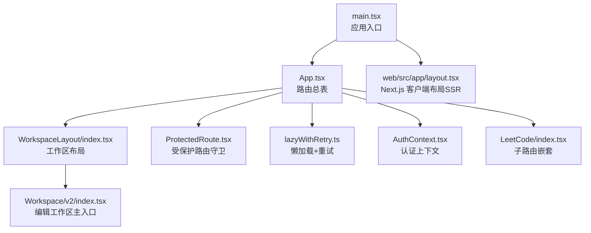
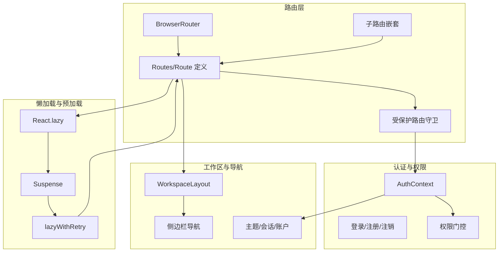
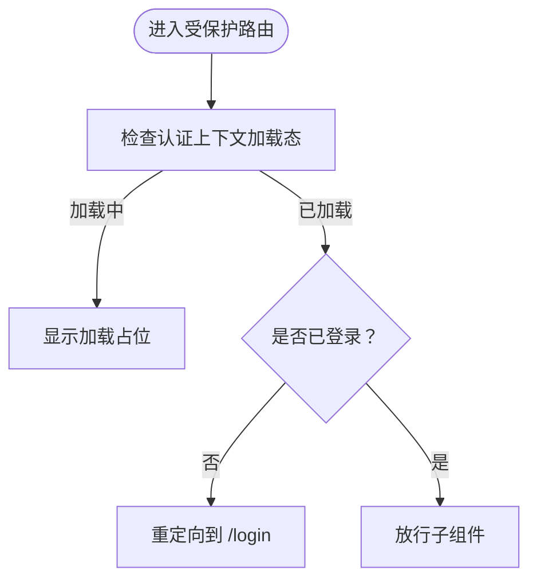
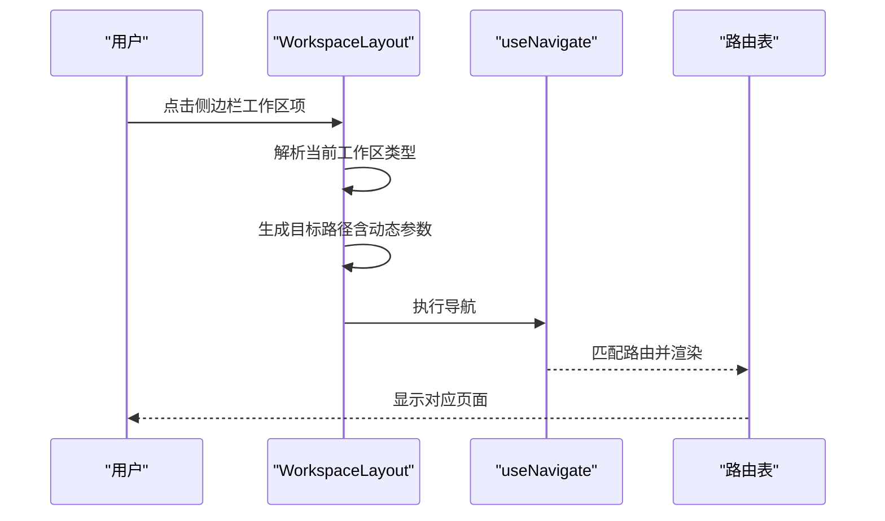
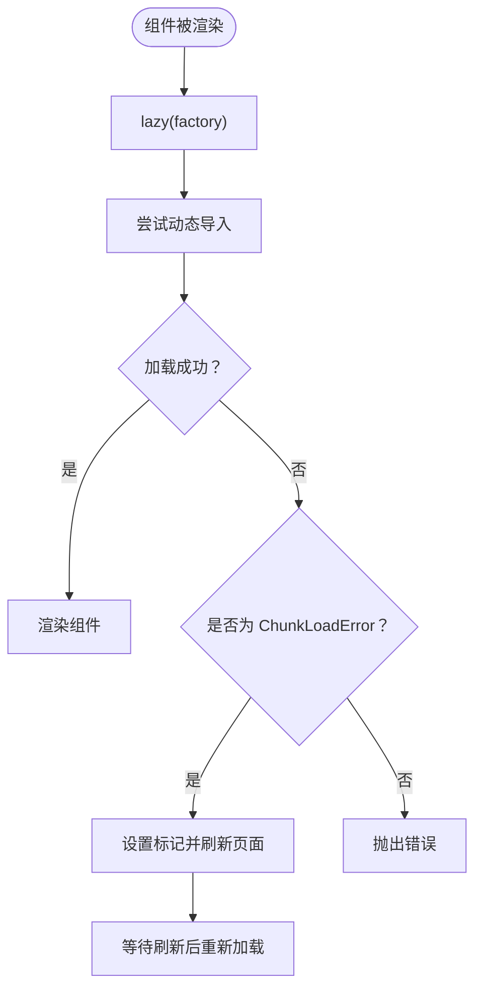
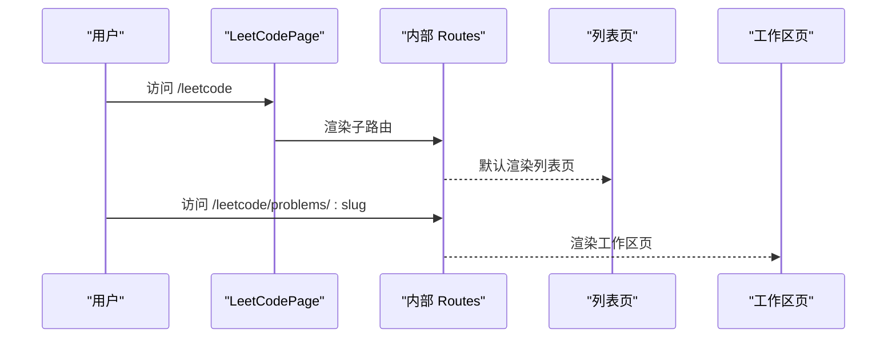
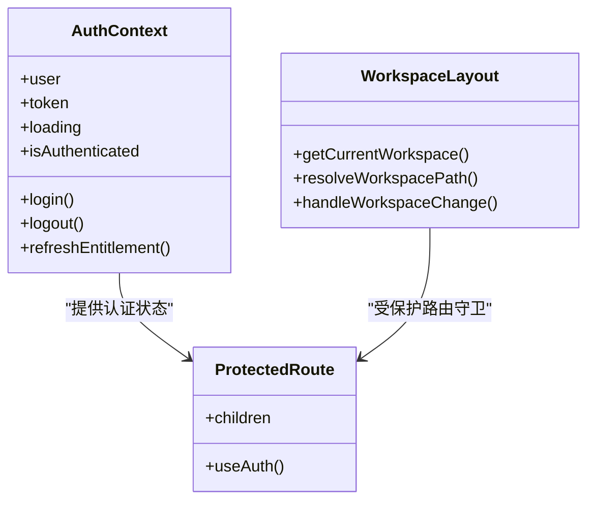
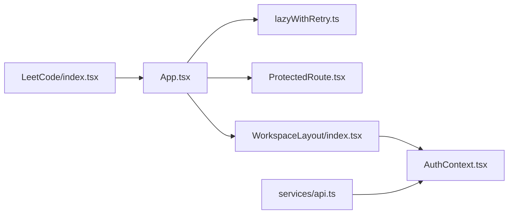

# 路由与导航

<cite>
**本文引用的文件**
- [frontend/src/App.tsx](file://frontend/src/App.tsx)
- [frontend/src/main.tsx](file://frontend/src/main.tsx)
- [frontend/src/components/ProtectedRoute.tsx](file://frontend/src/components/ProtectedRoute.tsx)
- [frontend/src/lib/lazyWithRetry.ts](file://frontend/src/lib/lazyWithRetry.ts)
- [frontend/src/contexts/AuthContext.tsx](file://frontend/src/contexts/AuthContext.tsx)
- [frontend/src/pages/Workspace/v2/index.tsx](file://frontend/src/pages/Workspace/v2/index.tsx)
- [frontend/src/pages/LeetCode/index.tsx](file://frontend/src/pages/LeetCode/index.tsx)
- [frontend/src/pages/WorkspaceLayout/index.tsx](file://frontend/src/pages/WorkspaceLayout/index.tsx)
- [frontend/src/services/api.ts](file://frontend/src/services/api.ts)
- [web/src/app/layout.tsx](file://web/src/app/layout.tsx)
</cite>

## 目录
1. [简介](#简介)
2. [项目结构](#项目结构)
3. [核心组件](#核心组件)
4. [架构总览](#架构总览)
5. [详细组件分析](#详细组件分析)
6. [依赖关系分析](#依赖关系分析)
7. [性能考量](#性能考量)
8. [故障排查指南](#故障排查指南)
9. [结论](#结论)
10. [附录](#附录)

## 简介
本文件系统性梳理前端路由与导航体系，覆盖 React Router 的配置方式、路由守卫与权限控制、动态路由参数处理、受保护路由与重定向逻辑、懒加载与代码分割策略、路由预加载机制、导航组件设计与面包屑思路、路由状态管理、以及 SSR 兼容与 SEO 优化建议。文档同时给出关键流程的时序与类图，帮助读者快速把握整体架构。

## 项目结构
前端采用单页应用（SPA）架构，基于 React Router v6 进行路由编排，并通过 React.lazy 与 Suspense 实现按需加载与错误重试。认证上下文负责全局登录态与权限判定，工作区布局组件提供统一导航与侧边栏切换能力。

图表来源
- [frontend/src/main.tsx:1-25](file://frontend/src/main.tsx#L1-L25)
- [frontend/src/App.tsx:1-111](file://frontend/src/App.tsx#L1-L111)
- [frontend/src/pages/WorkspaceLayout/index.tsx:1-674](file://frontend/src/pages/WorkspaceLayout/index.tsx#L1-L674)
- [frontend/src/components/ProtectedRoute.tsx:1-18](file://frontend/src/components/ProtectedRoute.tsx#L1-L18)
- [frontend/src/lib/lazyWithRetry.ts:1-35](file://frontend/src/lib/lazyWithRetry.ts#L1-L35)
- [frontend/src/contexts/AuthContext.tsx:1-275](file://frontend/src/contexts/AuthContext.tsx#L1-L275)
- [frontend/src/pages/Workspace/v2/index.tsx:1-451](file://frontend/src/pages/Workspace/v2/index.tsx#L1-L451)
- [frontend/src/pages/LeetCode/index.tsx:1-37](file://frontend/src/pages/LeetCode/index.tsx#L1-L37)
- [web/src/app/layout.tsx:1-34](file://web/src/app/layout.tsx#L1-L34)

章节来源
- [frontend/src/main.tsx:1-25](file://frontend/src/main.tsx#L1-L25)
- [frontend/src/App.tsx:1-111](file://frontend/src/App.tsx#L1-L111)

## 核心组件
- 应用入口与初始化
  - 在入口文件中注入环境上下文与认证上下文，随后挂载根组件 App。
  - 初始化阶段清理热更新残留标记，配置认证相关请求头。
- 路由总表与懒加载
  - 使用 React Router v6 的 Routes/Route 定义顶层路由，结合 lazyWithRetry 实现按需加载与部署后 chunk 加载失败的自动刷新。
  - 对工作区、登录、设置、分享页、LeetCode 等页面进行懒加载封装。
- 权限守卫与重定向
  - 提供受保护路由组件，依据认证上下文决定是否放行或重定向至登录页。
  - 根路由根据运行时特性与登录态动态启用/禁用特定路由（如 AI 助手、管理后台）。
- 认证上下文
  - 统一管理 token、用户信息、登录/注册/注销、额度查询、BetterAuth 与传统 JWT 的双栈兼容。
  - 提供 openModal/logout 等交互方法，支持统一登录入口与权限门控。
- 工作区布局与导航
  - 提供左侧固定导航栏，支持工作区切换、主题切换、登录态下拉菜单、历史会话管理。
  - 通过 useNavigate/useLocation 判断当前工作区并解析目标路径，支持在新标签页打开。
- 子路由嵌套
  - LeetCode 页面内部再次嵌套子路由，实现题库列表与题目工作区的分离。
- SSR 兼容
  - Next.js 客户端布局存在，便于未来扩展服务端渲染场景下的认证桥接与元数据管理。

章节来源
- [frontend/src/main.tsx:1-25](file://frontend/src/main.tsx#L1-L25)
- [frontend/src/App.tsx:13-28](file://frontend/src/App.tsx#L13-L28)
- [frontend/src/App.tsx:54-98](file://frontend/src/App.tsx#L54-L98)
- [frontend/src/components/ProtectedRoute.tsx:1-18](file://frontend/src/components/ProtectedRoute.tsx#L1-L18)
- [frontend/src/contexts/AuthContext.tsx:61-176](file://frontend/src/contexts/AuthContext.tsx#L61-L176)
- [frontend/src/pages/WorkspaceLayout/index.tsx:124-298](file://frontend/src/pages/WorkspaceLayout/index.tsx#L124-L298)
- [frontend/src/pages/LeetCode/index.tsx:8-36](file://frontend/src/pages/LeetCode/index.tsx#L8-L36)
- [web/src/app/layout.tsx:15-33](file://web/src/app/layout.tsx#L15-L33)

## 架构总览
下图展示路由层、认证层与工作区层的交互关系，以及懒加载与错误重试的介入点。

图表来源
- [frontend/src/App.tsx:54-98](file://frontend/src/App.tsx#L54-L98)
- [frontend/src/lib/lazyWithRetry.ts:20-34](file://frontend/src/lib/lazyWithRetry.ts#L20-L34)
- [frontend/src/components/ProtectedRoute.tsx:5-17](file://frontend/src/components/ProtectedRoute.tsx#L5-L17)
- [frontend/src/contexts/AuthContext.tsx:247-265](file://frontend/src/contexts/AuthContext.tsx#L247-L265)
- [frontend/src/pages/WorkspaceLayout/index.tsx:124-298](file://frontend/src/pages/WorkspaceLayout/index.tsx#L124-L298)

## 详细组件分析

### 路由守卫与权限控制
- 受保护路由
  - 当认证上下文处于加载态时，显示加载占位；未登录时重定向至登录页；已登录则放行子组件。
- 根路由重定向
  - 根据运行时特性与登录态，动态启用/禁用 AI 助手与管理后台路由，并在禁用时重定向至工作区。
- 认证上下文
  - 提供登录态、token、用户信息、BetterAuth 与传统 JWT 的双栈兼容逻辑，支持统一登录入口与权限门控。

图表来源
- [frontend/src/components/ProtectedRoute.tsx:5-17](file://frontend/src/components/ProtectedRoute.tsx#L5-L17)
- [frontend/src/App.tsx:73-78](file://frontend/src/App.tsx#L73-L78)

章节来源
- [frontend/src/components/ProtectedRoute.tsx:1-18](file://frontend/src/components/ProtectedRoute.tsx#L1-L18)
- [frontend/src/App.tsx:46-98](file://frontend/src/App.tsx#L46-L98)
- [frontend/src/contexts/AuthContext.tsx:247-265](file://frontend/src/contexts/AuthContext.tsx#L247-L265)

### 动态路由参数与重定向逻辑
- 动态参数
  - 工作区路由支持动态参数，例如 LaTeX/HTML 工作区带简历 ID 参数，AI 助手路由亦支持简历 ID 参数。
- 重定向
  - 当特性未启用或无权限时，将 AI 助手与管理后台路由重定向至工作区首页。
- 路径解析
  - 工作区布局根据当前路径推断当前工作区类型，解析目标路径并执行导航；支持在新标签页打开。

图表来源
- [frontend/src/pages/WorkspaceLayout/index.tsx:154-229](file://frontend/src/pages/WorkspaceLayout/index.tsx#L154-L229)
- [frontend/src/App.tsx:61-78](file://frontend/src/App.tsx#L61-L78)

章节来源
- [frontend/src/App.tsx:61-78](file://frontend/src/App.tsx#L61-L78)
- [frontend/src/pages/WorkspaceLayout/index.tsx:154-229](file://frontend/src/pages/WorkspaceLayout/index.tsx#L154-L229)

### 懒加载与代码分割策略
- 懒加载实现
  - 使用 React.lazy 包装页面组件，配合 Suspense 提供加载占位。
- 错误重试
  - lazyWithRetry 捕获 chunk 加载错误，自动刷新一次以拉取最新 index.html，解决部署后缓存导致的 404 问题。
- 代码分割
  - 将大型页面（如工作区、LeetCode、登录页等）拆分为独立 chunk，按需加载，减少首屏体积。

图表来源
- [frontend/src/lib/lazyWithRetry.ts:20-34](file://frontend/src/lib/lazyWithRetry.ts#L20-L34)
- [frontend/src/App.tsx:13-28](file://frontend/src/App.tsx#L13-L28)

章节来源
- [frontend/src/lib/lazyWithRetry.ts:1-35](file://frontend/src/lib/lazyWithRetry.ts#L1-L35)
- [frontend/src/App.tsx:13-28](file://frontend/src/App.tsx#L13-L28)

### 子路由嵌套与 LeetCode 路由
- 子路由嵌套
  - LeetCode 页面内部再次定义子路由，实现题库列表与题目工作区的分离，支持 slug 动态参数。
- 动态参数处理
  - 通过路由参数传递题目标识，页面内根据参数加载对应题目内容。

图表来源
- [frontend/src/pages/LeetCode/index.tsx:8-36](file://frontend/src/pages/LeetCode/index.tsx#L8-L36)

章节来源
- [frontend/src/pages/LeetCode/index.tsx:1-37](file://frontend/src/pages/LeetCode/index.tsx#L1-L37)

### 导航组件设计与路由状态管理
- 工作区布局
  - 提供统一的左侧导航栏，支持工作区切换、主题切换、登录态下拉菜单、历史会话管理。
  - 通过 useLocation/useNavigate 判断当前工作区并解析目标路径，支持在新标签页打开。
- 路由状态
  - 认证上下文提供 loading/isAuthenticated/token/user 等状态，驱动路由守卫与导航行为。
  - 工作区布局维护侧边栏折叠状态与会话刷新键，保证导航一致性。

图表来源
- [frontend/src/contexts/AuthContext.tsx:247-265](file://frontend/src/contexts/AuthContext.tsx#L247-L265)
- [frontend/src/pages/WorkspaceLayout/index.tsx:154-229](file://frontend/src/pages/WorkspaceLayout/index.tsx#L154-L229)
- [frontend/src/components/ProtectedRoute.tsx:5-17](file://frontend/src/components/ProtectedRoute.tsx#L5-L17)

章节来源
- [frontend/src/pages/WorkspaceLayout/index.tsx:124-298](file://frontend/src/pages/WorkspaceLayout/index.tsx#L124-L298)
- [frontend/src/contexts/AuthContext.tsx:247-265](file://frontend/src/contexts/AuthContext.tsx#L247-L265)

### SSR 兼容与 SEO 优化
- SSR 兼容
  - Next.js 客户端布局存在，便于未来在服务端渲染场景下集成认证桥接与元数据管理。
- SEO 优化
  - 建议在 Next.js 服务端设置页面级元数据与结构化数据，前端 SPA 侧保持路由层级清晰、语义化路径，利于搜索引擎抓取与索引。

章节来源
- [web/src/app/layout.tsx:15-33](file://web/src/app/layout.tsx#L15-L33)

## 依赖关系分析
- 组件耦合
  - App 路由表依赖懒加载模块与受保护路由守卫；工作区布局依赖认证上下文与导航钩子；LeetCode 页面内部嵌套子路由。
- 外部依赖
  - React Router v6 提供路由编排能力；Axios 用于 API 请求；Framer Motion 用于过渡动画。

图表来源
- [frontend/src/App.tsx:54-98](file://frontend/src/App.tsx#L54-L98)
- [frontend/src/lib/lazyWithRetry.ts:20-34](file://frontend/src/lib/lazyWithRetry.ts#L20-L34)
- [frontend/src/components/ProtectedRoute.tsx:5-17](file://frontend/src/components/ProtectedRoute.tsx#L5-L17)
- [frontend/src/pages/WorkspaceLayout/index.tsx:124-298](file://frontend/src/pages/WorkspaceLayout/index.tsx#L124-L298)
- [frontend/src/pages/LeetCode/index.tsx:8-36](file://frontend/src/pages/LeetCode/index.tsx#L8-L36)
- [frontend/src/services/api.ts:1-200](file://frontend/src/services/api.ts#L1-L200)

章节来源
- [frontend/src/App.tsx:54-98](file://frontend/src/App.tsx#L54-L98)
- [frontend/src/pages/WorkspaceLayout/index.tsx:124-298](file://frontend/src/pages/WorkspaceLayout/index.tsx#L124-L298)
- [frontend/src/services/api.ts:1-200](file://frontend/src/services/api.ts#L1-L200)

## 性能考量
- 懒加载与代码分割
  - 将大型页面拆分为独立 chunk，按需加载，显著降低首屏 JavaScript 体积。
- Suspense 占位
  - 使用 Suspense 提供一致的加载反馈，改善用户体验。
- 错误重试
  - 自动检测并修复部署后缓存导致的 chunk 加载失败，提升稳定性。
- 渲染节流
  - 工作区编辑器对 PDF 渲染进行去抖与合并，避免频繁重渲染。
- 并发控制
  - 登录/注册成功后延迟本地数据同步，降低首屏请求竞争。

章节来源
- [frontend/src/lib/lazyWithRetry.ts:20-34](file://frontend/src/lib/lazyWithRetry.ts#L20-L34)
- [frontend/src/App.tsx:13-28](file://frontend/src/App.tsx#L13-L28)
- [frontend/src/pages/Workspace/v2/index.tsx:174-213](file://frontend/src/pages/Workspace/v2/index.tsx#L174-L213)
- [frontend/src/contexts/AuthContext.tsx:178-206](file://frontend/src/contexts/AuthContext.tsx#L178-L206)

## 故障排查指南
- 路由无法匹配或空白页
  - 检查路由表是否正确声明，确认懒加载组件是否返回 default 导出。
- 登录后仍被重定向到登录页
  - 检查认证上下文初始化逻辑与 token 存储，确认 isAuthWebEnabled 与 BetterAuth 回退逻辑。
- chunk 加载失败或白屏
  - lazyWithRetry 会在捕获到 ChunkLoadError 时自动刷新一次，若仍失败，检查网络与缓存策略。
- 工作区导航异常
  - 检查 WorkspaceLayout 的路径解析函数与当前工作区判断逻辑，确认动态参数是否正确传入。
- 权限相关问题
  - 确认 canUseAgentFeature/canUseAdminFeature 的运行时判断与认证上下文中的角色/额度信息。

章节来源
- [frontend/src/App.tsx:46-98](file://frontend/src/App.tsx#L46-L98)
- [frontend/src/lib/lazyWithRetry.ts:5-14](file://frontend/src/lib/lazyWithRetry.ts#L5-L14)
- [frontend/src/pages/WorkspaceLayout/index.tsx:154-229](file://frontend/src/pages/WorkspaceLayout/index.tsx#L154-L229)
- [frontend/src/contexts/AuthContext.tsx:68-176](file://frontend/src/contexts/AuthContext.tsx#L68-L176)

## 结论
该路由与导航系统以 React Router v6 为核心，结合懒加载、错误重试、受保护路由与认证上下文，实现了灵活、稳定且高性能的前端路由体验。通过工作区布局与导航组件，提供了统一的交互与权限控制。未来可在 Next.js 侧完善 SSR 与 SEO 能力，并进一步细化路由预加载策略与面包屑实现。

## 附录
- 最佳实践建议
  - 为关键页面增加骨架屏或轻量占位，提升感知性能。
  - 对高频访问页面实施预加载策略（如鼠标悬停预加载）。
  - 使用面包屑组件记录路径层级，增强导航可发现性。
  - 在路由表中统一管理动态参数命名规范，便于维护与测试。