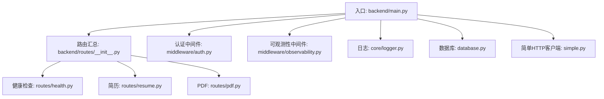
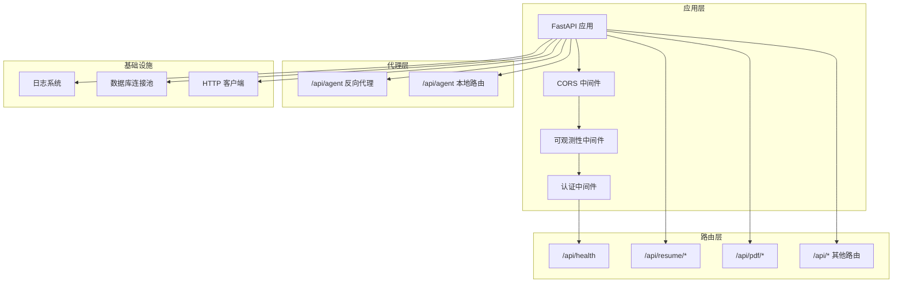
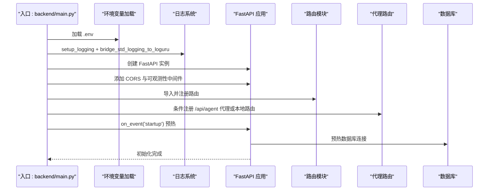
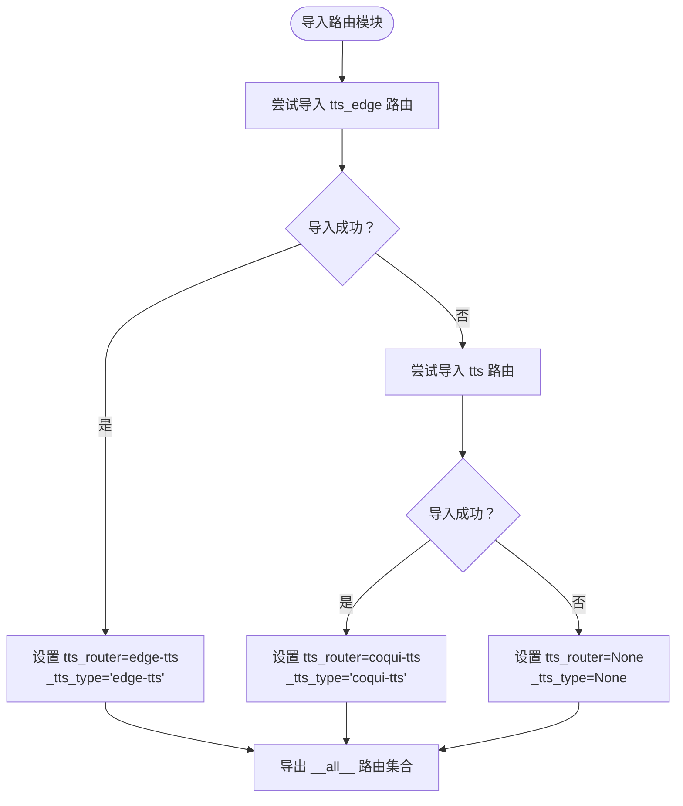
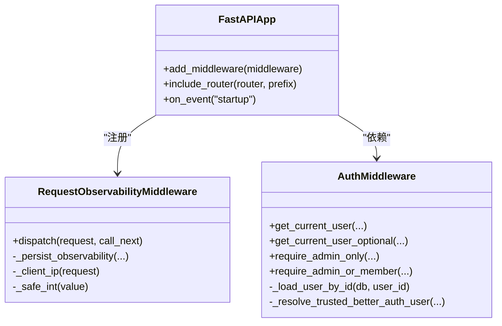
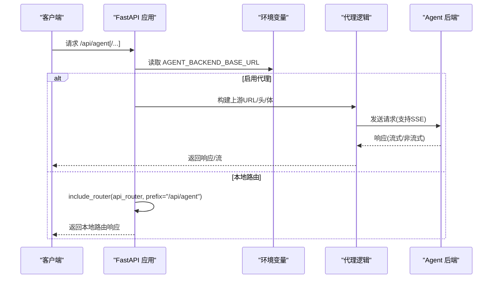
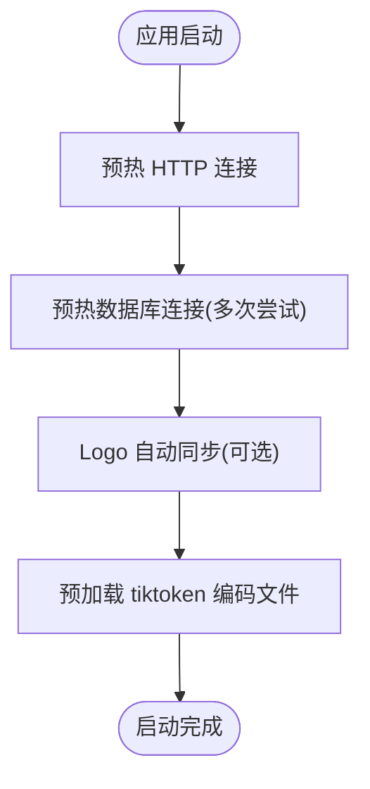
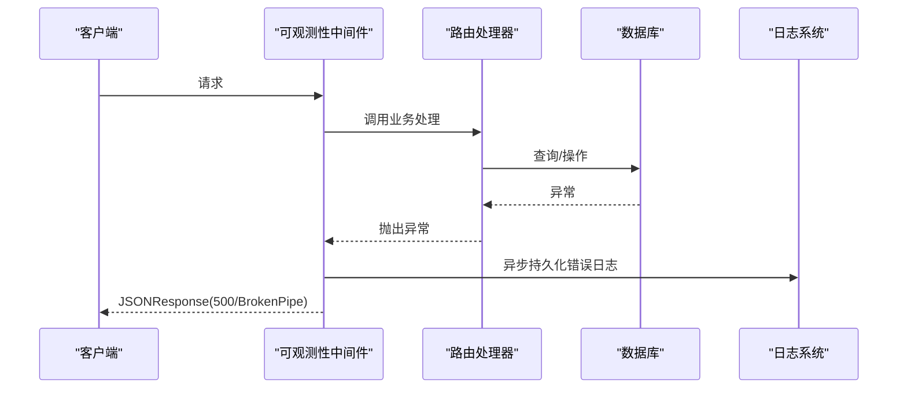
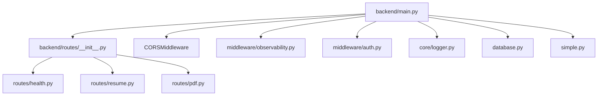

# FastAPI应用结构

<cite>
**本文档引用的文件**
- [backend/main.py](file://backend/main.py)
- [backend/routes/__init__.py](file://backend/routes/__init__.py)
- [backend/routes/health.py](file://backend/routes/health.py)
- [backend/routes/resume.py](file://backend/routes/resume.py)
- [backend/routes/pdf.py](file://backend/routes/pdf.py)
- [backend/middleware/__init__.py](file://backend/middleware/__init__.py)
- [backend/middleware/auth.py](file://backend/middleware/auth.py)
- [backend/middleware/observability.py](file://backend/middleware/observability.py)
- [backend/core/logger.py](file://backend/core/logger.py)
- [backend/database.py](file://backend/database.py)
- [backend/simple.py](file://backend/simple.py)
- [backend/agent/web/server.py](file://backend/agent/web/server.py)
</cite>

## 目录
1. [引言](#引言)
2. [项目结构](#项目结构)
3. [核心组件](#核心组件)
4. [架构总览](#架构总览)
5. [详细组件分析](#详细组件分析)
6. [依赖关系分析](#依赖关系分析)
7. [性能考虑](#性能考虑)
8. [故障排查指南](#故障排查指南)
9. [结论](#结论)
10. [附录](#附录)

## 引言
本文件面向希望深入理解并扩展该 FastAPI 应用的开发者，系统阐述应用入口点的设计模式、模块导入机制、环境变量加载、应用初始化流程、路由注册机制、模块化架构、启动时预热优化策略、CORS 配置、中间件集成、代理路由实现、应用生命周期管理、错误处理机制以及性能优化技巧。同时提供扩展新功能模块的方法论与最佳实践。

## 项目结构
该应用采用“入口文件 + 模块化路由 + 中间件 + 核心基础设施”的分层架构：
- 入口层：backend/main.py 负责应用初始化、环境变量加载、CORS 配置、路由注册、可观测性中间件、启动时预热与代理路由。
- 路由层：backend/routes/* 提供各业务领域的 API 路由，统一通过 backend/routes/__init__.py 汇总导出。
- 中间件层：认证中间件与可观测性中间件，提供统一鉴权与请求/错误日志采集。
- 基础设施层：日志系统（core/logger.py）、数据库连接池（database.py）、简单 HTTP 客户端（simple.py）等。

图表来源
- [backend/main.py:1-326](file://backend/main.py#L1-L326)
- [backend/routes/__init__.py:1-57](file://backend/routes/__init__.py#L1-L57)
- [backend/middleware/auth.py:1-191](file://backend/middleware/auth.py#L1-L191)
- [backend/middleware/observability.py:1-191](file://backend/middleware/observability.py#L1-L191)
- [backend/core/logger.py:1-252](file://backend/core/logger.py#L1-L252)
- [backend/database.py:1-138](file://backend/database.py#L1-L138)
- [backend/simple.py:1-614](file://backend/simple.py#L1-L614)

章节来源
- [backend/main.py:1-326](file://backend/main.py#L1-L326)
- [backend/routes/__init__.py:1-57](file://backend/routes/__init__.py#L1-L57)

## 核心组件
- 应用入口与初始化
  - 环境变量加载：通过 dotenv 从项目根目录与默认位置加载 .env。
  - 日志系统：桥接标准 logging 到 loguru，支持生产/开发双模式输出与敏感信息脱敏。
  - FastAPI 实例创建与中间件注册：CORS、可观测性中间件。
  - 路由注册：集中导入并 includeRouter，支持可选 TTS 路由。
  - 代理路由：根据环境变量动态启用反向代理至 Agent 后端，或加载本地 OpenManus 路由。
  - 启动事件：预热 HTTP 连接、数据库连接、Logo 同步与 tiktoken 编码文件。
- 路由模块化
  - routes/__init__.py 统一导出路由集合，优先加载 edge-tts，其次 coqui-tts，否则占位。
  - 各领域路由：健康检查、简历、PDF、分享、认证、LeetCode、账单等。
- 中间件
  - 认证中间件：支持 BetterAuth/JWT 与可信内部头，带数据库重试与降级。
  - 可观测性中间件：异步写入请求/错误/链路日志，支持 BrokenPipe 与全局异常兜底。
- 基础设施
  - 日志：结构化输出、请求/流程 ID 上下文、敏感信息清洗、按类别落盘。
  - 数据库：统一 URL 解析、连接池参数、依赖注入会话。
  - 简单 HTTP 客户端：HTTP/2 与 DNS 预解析优化、重试与连接预热。

章节来源
- [backend/main.py:28-326](file://backend/main.py#L28-L326)
- [backend/routes/__init__.py:21-57](file://backend/routes/__init__.py#L21-L57)
- [backend/middleware/auth.py:113-191](file://backend/middleware/auth.py#L113-L191)
- [backend/middleware/observability.py:170-191](file://backend/middleware/observability.py#L170-L191)
- [backend/core/logger.py:92-252](file://backend/core/logger.py#L92-L252)
- [backend/database.py:25-138](file://backend/database.py#L25-L138)
- [backend/simple.py:150-173](file://backend/simple.py#L150-L173)

## 架构总览
应用采用“入口聚合 + 路由模块化 + 中间件增强 + 基础设施共享”的架构，通过环境变量控制行为（如代理、日志模式、数据库类型），并通过启动事件进行资源预热，提升首屏与冷启动性能。

图表来源
- [backend/main.py:93-225](file://backend/main.py#L93-L225)
- [backend/middleware/observability.py:170-191](file://backend/middleware/observability.py#L170-L191)
- [backend/middleware/auth.py:113-191](file://backend/middleware/auth.py#L113-L191)
- [backend/routes/health.py:9-13](file://backend/routes/health.py#L9-L13)
- [backend/routes/resume.py:795-800](file://backend/routes/resume.py#L795-L800)
- [backend/routes/pdf.py:125-180](file://backend/routes/pdf.py#L125-L180)

## 详细组件分析

### 应用入口与初始化流程
- 模块导入兼容：确保项目根与 backend 目录在 sys.path，支持多种启动方式。
- 环境变量加载：从项目根 .env 与默认位置加载，保证配置一致性。
- 日志系统：setup_logging + bridge_std_logging_to_loguru，区分生产/开发输出。
- FastAPI 实例：title="Resume API"，注册 CORS 与可观测性中间件。
- 路由注册：import_module_candidates 保证模块存在性，includeRouter 注册健康检查与其他路由。
- 可选 TTS 路由：try/except 容错，记录警告日志。
- 代理路由：根据 AGENT_BACKEND_BASE_URL 动态启用，否则加载本地 OpenManus 路由。
- 启动事件：预热 HTTP 连接、数据库连接、Logo 同步、tiktoken 编码文件。

图表来源
- [backend/main.py:28-326](file://backend/main.py#L28-L326)
- [backend/core/logger.py:184-223](file://backend/core/logger.py#L184-L223)
- [backend/database.py:91-138](file://backend/database.py#L91-L138)

章节来源
- [backend/main.py:28-139](file://backend/main.py#L28-L139)
- [backend/main.py:227-316](file://backend/main.py#L227-L316)

### 路由注册机制与模块化架构
- 路由汇总：routes/__init__.py 统一导出各领域路由，包含可选 TTS 路由。
- 路由前缀与标签：各路由模块使用 APIRouter(prefix="/api", tags=[...]) 统一前缀。
- 可选模块：TTS 路由优先加载 edge-tts，其次 coqui-tts，否则置 None 占位，入口处条件 includeRouter。

图表来源
- [backend/routes/__init__.py:21-57](file://backend/routes/__init__.py#L21-L57)

章节来源
- [backend/routes/__init__.py:1-57](file://backend/routes/__init__.py#L1-L57)
- [backend/routes/health.py:6-13](file://backend/routes/health.py#L6-L13)

### CORS 配置与中间件集成
- CORS：允许所有源、凭据、方法与头部，暴露 X-LeetCode-Program 头。
- 认证中间件：支持 BetterAuth/JWT 与可信内部头，带数据库重试与降级。
- 可观测性中间件：异步持久化请求/错误/链路日志，支持 BrokenPipe 与全局异常兜底。

图表来源
- [backend/middleware/observability.py:19-191](file://backend/middleware/observability.py#L19-L191)
- [backend/middleware/auth.py:113-191](file://backend/middleware/auth.py#L113-L191)
- [backend/main.py:95-104](file://backend/main.py#L95-L104)

章节来源
- [backend/main.py:95-104](file://backend/main.py#L95-L104)
- [backend/middleware/observability.py:170-191](file://backend/middleware/observability.py#L170-L191)
- [backend/middleware/auth.py:113-191](file://backend/middleware/auth.py#L113-L191)

### 代理路由实现
- 环境变量驱动：AGENT_BACKEND_BASE_URL 存在时启用反向代理，否则加载本地 OpenManus 路由。
- 代理逻辑：构建上游 URL，透传请求头与主体，支持 SSE 场景的流式返回与错误处理。
- 本地 OpenManus：加载 backend.agent.web.routes.api_router，前缀 /api/agent。

图表来源
- [backend/main.py:141-225](file://backend/main.py#L141-L225)
- [backend/agent/web/server.py:28-56](file://backend/agent/web/server.py#L28-L56)

章节来源
- [backend/main.py:141-225](file://backend/main.py#L141-L225)
- [backend/agent/web/server.py:28-56](file://backend/agent/web/server.py#L28-L56)

### 应用生命周期管理与启动预热
- startup 事件：预热 HTTP 连接、数据库连接、Logo 同步、tiktoken 编码文件。
- 数据库预热：多次尝试连接并记录耗时，失败时逐步退避。
- 环境变量同步：从环境变量更新 simple 模块的 API Key 并重置客户端。

图表来源
- [backend/main.py:227-316](file://backend/main.py#L227-L316)
- [backend/simple.py:150-173](file://backend/simple.py#L150-L173)
- [backend/database.py:91-138](file://backend/database.py#L91-L138)

章节来源
- [backend/main.py:227-316](file://backend/main.py#L227-L316)

### 错误处理机制
- 可观测性中间件：捕获异常并在后台线程持久化错误日志，区分 BrokenPipe 与全局异常。
- 认证中间件：数据库异常重试与降级，令牌解析失败与用户不存在的明确错误码。
- 路由层：PDF 渲染与 LaTeX 编译的显式 HTTPException 与错误事件推送。

图表来源
- [backend/middleware/observability.py:170-191](file://backend/middleware/observability.py#L170-L191)
- [backend/middleware/auth.py:40-86](file://backend/middleware/auth.py#L40-L86)

章节来源
- [backend/middleware/observability.py:170-191](file://backend/middleware/observability.py#L170-L191)
- [backend/middleware/auth.py:40-86](file://backend/middleware/auth.py#L40-L86)

### 性能优化技巧
- HTTP/2 与 DNS 预解析：simple.py 中的 get_httpx_client/prefetch_api_hosts 降低网络延迟。
- 连接池参数：database.py 中 pool_pre_ping、pool_recycle、max_overflow 等参数平衡吞吐与稳定性。
- 启动预热：startup 事件中预热数据库与外部依赖，避免首次请求抖动。
- SSE 流式：PDF 渲染与 LaTeX 编译支持 EventSourceResponse，提升用户体验。
- 线程池：PDF 渲染使用 run_in_threadpool 执行 CPU/IO 密集任务，避免阻塞事件循环。

章节来源
- [backend/simple.py:94-173](file://backend/simple.py#L94-L173)
- [backend/database.py:78-112](file://backend/database.py#L78-L112)
- [backend/main.py:227-316](file://backend/main.py#L227-L316)
- [backend/routes/pdf.py:187-299](file://backend/routes/pdf.py#L187-L299)

### 扩展新功能模块的最佳实践
- 新增路由模块：在 backend/routes/ 下创建模块并导出 router，修改 backend/routes/__init__.py 汇总导出。
- 条件路由：如 TTS 路由，使用 try/except 与占位符，入口处条件 includeRouter。
- 中间件集成：在 main.py 中注册中间件或在路由层使用 Depends。
- 配置与环境变量：通过 .env 与环境变量控制行为，startup 事件中读取并应用。
- 日志与可观测性：使用 core/logger 与 middleware/observability，确保请求/错误/链路日志完整。
- 数据库：遵循 database.py 的依赖注入模式，使用 get_db 与 SessionLocal。
- 代理路由：根据需求选择启用代理或本地路由，保持前缀与路径一致。

章节来源
- [backend/routes/__init__.py:38-57](file://backend/routes/__init__.py#L38-L57)
- [backend/main.py:73-139](file://backend/main.py#L73-L139)
- [backend/core/logger.py:92-252](file://backend/core/logger.py#L92-L252)
- [backend/database.py:121-138](file://backend/database.py#L121-L138)

## 依赖关系分析
- 入口依赖：main.py 依赖 routes 汇总、CORS、可观测性中间件、日志、数据库、simple 等。
- 路由依赖：各路由模块依赖 models、llm/prompts、services、database、middleware 等。
- 中间件依赖：认证中间件依赖 better_auth 与数据库；可观测性中间件依赖数据库与 auth。
- 基础设施依赖：日志依赖 loguru；数据库依赖 SQLAlchemy；HTTP 客户端依赖 httpx/requests。

图表来源
- [backend/main.py:54-139](file://backend/main.py#L54-L139)
- [backend/routes/__init__.py:1-57](file://backend/routes/__init__.py#L1-L57)
- [backend/middleware/observability.py:10-17](file://backend/middleware/observability.py#L10-L17)
- [backend/middleware/auth.py:19-25](file://backend/middleware/auth.py#L19-L25)
- [backend/core/logger.py:9-11](file://backend/core/logger.py#L9-L11)
- [backend/database.py:6-11](file://backend/database.py#L6-L11)
- [backend/simple.py:16-31](file://backend/simple.py#L16-L31)

章节来源
- [backend/main.py:54-139](file://backend/main.py#L54-L139)
- [backend/routes/__init__.py:1-57](file://backend/routes/__init__.py#L1-57)

## 性能考虑
- 网络层：优先使用 HTTP/2 与 DNS 预解析，减少握手与解析开销。
- 连接层：合理配置连接池参数，启用 pool_pre_ping 与合适的回收策略。
- 启动层：在 startup 事件中预热关键依赖，避免首次请求抖动。
- IO 层：将耗时任务放入线程池或进程池，保持事件循环响应性。
- 缓存层：tiktoken 编码文件预加载，避免首次请求下载阻塞。

## 故障排查指南
- 认证失败：检查 BetterAuth/JWT 令牌格式与数据库连接，查看中间件重试与降级日志。
- PDF 渲染错误：检查 LaTeX 源码与模板目录权限，关注 SSE 错误事件推送。
- 数据库连接异常：查看 startup 预热日志与连接池参数，确认网络与凭据。
- 日志缺失：确认 LOG_MODE、LOG_LEVEL、LOG_DIR 环境变量，检查文件权限与磁盘空间。
- 代理不通：核对 AGENT_BACKEND_BASE_URL，检查上游服务可达性与超时配置。

章节来源
- [backend/middleware/auth.py:40-86](file://backend/middleware/auth.py#L40-L86)
- [backend/routes/pdf.py:187-299](file://backend/routes/pdf.py#L187-L299)
- [backend/database.py:91-138](file://backend/database.py#L91-L138)
- [backend/core/logger.py:184-252](file://backend/core/logger.py#L184-L252)
- [backend/main.py:141-225](file://backend/main.py#L141-L225)

## 结论
该 FastAPI 应用通过清晰的入口初始化、模块化路由、中间件增强与基础设施共享，实现了高可维护性与可扩展性。结合启动预热、可观测性与错误处理机制，能够在复杂业务场景下稳定运行。遵循本文档提供的扩展方法与最佳实践，可快速集成新功能模块并保持系统性能与可靠性。

## 附录
- 启动命令示例：uvicorn backend.main:app --reload --port 9000
- 健康检查：/api/health
- AI 测试：/api/ai/test
- 简历生成：/api/resume/generate
- PDF 渲染：/api/pdf/render 与 /api/pdf/render/stream