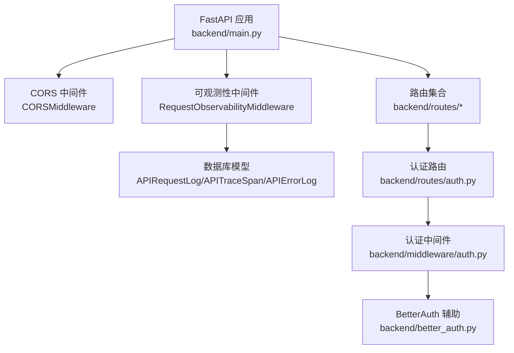
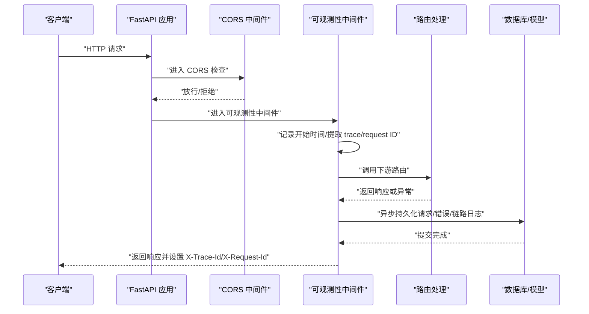
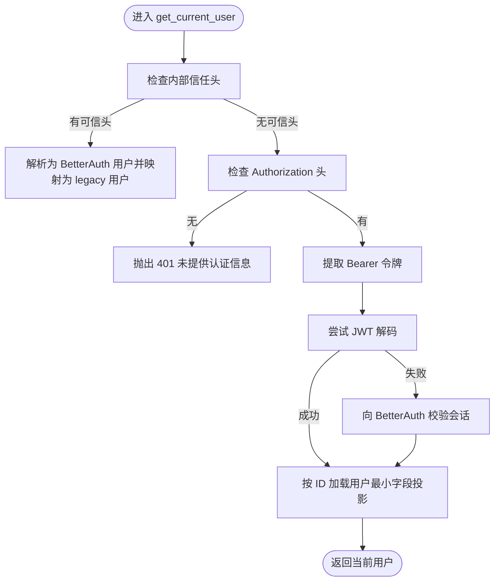
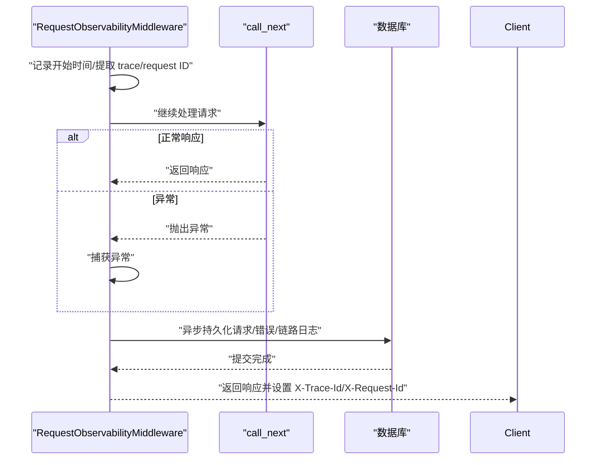
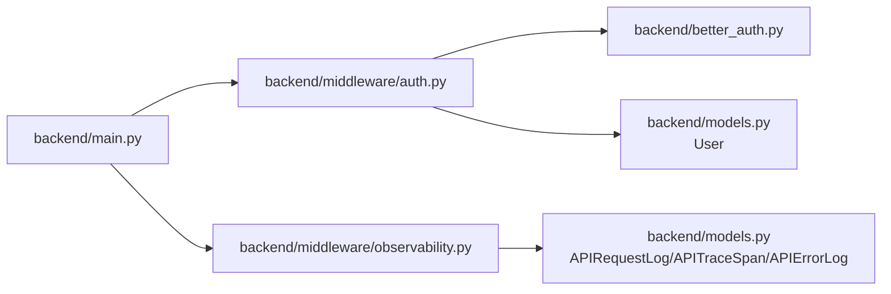

# 中间件配置

<cite>
**本文引用的文件**
- [backend/main.py](file://backend/main.py)
- [backend/middleware/__init__.py](file://backend/middleware/__init__.py)
- [backend/middleware/auth.py](file://backend/middleware/auth.py)
- [backend/middleware/observability.py](file://backend/middleware/observability.py)
- [backend/better_auth.py](file://backend/better_auth.py)
- [backend/routes/auth.py](file://backend/routes/auth.py)
- [backend/models.py](file://backend/models.py)
</cite>

## 目录
1. [简介](#简介)
2. [项目结构](#项目结构)
3. [核心组件](#核心组件)
4. [架构总览](#架构总览)
5. [详细组件分析](#详细组件分析)
6. [依赖分析](#依赖分析)
7. [性能考量](#性能考量)
8. [故障排查指南](#故障排查指南)
9. [结论](#结论)
10. [附录](#附录)

## 简介
本文件面向中间件配置与使用，聚焦以下主题：
- CORS 中间件的配置项与安全影响
- 认证中间件的实现机制、JWT 令牌处理、权限验证流程
- 可观测性中间件的日志记录、错误日志、链路 span、性能追踪
- 中间件链的执行顺序与自定义中间件开发指南
- 如何添加新中间件与修改现有中间件行为

## 项目结构
后端基于 FastAPI 构建，中间件主要位于 backend/middleware 目录，并在应用入口 backend/main.py 中集中注册。认证与可观测性两大中间件分别负责：
- CORS：跨域控制
- 认证：统一从 Authorization/BetterAuth 内部信任头解析用户身份
- 可观测性：请求日志、错误日志、链路 span、异常兜底

图表来源
- [backend/main.py:95-104](file://backend/main.py#L95-L104)
- [backend/middleware/observability.py:19-61](file://backend/middleware/observability.py#L19-L61)
- [backend/middleware/auth.py:113-146](file://backend/middleware/auth.py#L113-L146)
- [backend/better_auth.py:65-87](file://backend/better_auth.py#L65-L87)

章节来源
- [backend/main.py:92-138](file://backend/main.py#L92-L138)

## 核心组件
- CORS 中间件：在应用初始化阶段通过 CORSMiddleware 注册，支持通配配置，便于前端开发调试；生产部署建议收紧来源与暴露头。
- 认证中间件：提供 get_current_user/get_current_user_optional 以及 require_admin_only/require_admin_or_member 等权限约束，支持 JWT 与 BetterAuth 两种上游认证体系。
- 可观测性中间件：统一记录请求日志、错误日志、链路 span，异步落库避免阻塞主请求，同时提供全局异常与断开连接的兜底处理。

章节来源
- [backend/main.py:95-104](file://backend/main.py#L95-L104)
- [backend/middleware/auth.py:113-191](file://backend/middleware/auth.py#L113-L191)
- [backend/middleware/observability.py:19-191](file://backend/middleware/observability.py#L19-L191)

## 架构总览
下图展示中间件链在请求生命周期中的位置与交互：

图表来源
- [backend/main.py:95-104](file://backend/main.py#L95-L104)
- [backend/middleware/observability.py:19-61](file://backend/middleware/observability.py#L19-L61)
- [backend/middleware/observability.py:79-151](file://backend/middleware/observability.py#L79-L151)

## 详细组件分析

### CORS 中间件
- 配置要点
  - 允许来源：通配
  - 凭据：允许
  - 方法：通配
  - 请求头：通配
  - 暴露头：特定业务头（如用于 LeetCode 程序运行状态的头）
- 安全考虑
  - 生产环境建议将 allow_origins 限定为受信域名，避免 CSRF 风险
  - 若不需要凭据，建议关闭 allow_credentials
  - 显式列出 allow_headers/allow_methods，减少浏览器预检压力
- 修改方式
  - 在 backend/main.py 中调整 CORSMiddleware 的参数

章节来源
- [backend/main.py:95-103](file://backend/main.py#L95-L103)

### 认证中间件
- 实现机制
  - 优先解析内部信任头（如 x_internal_auth_secret、x_better_auth_user_*），用于服务内转发场景
  - 否则解析 Authorization: Bearer 令牌，先尝试 JWT 解码，再回退到 BetterAuth 服务校验
  - 用户加载采用最小字段投影，限制数据库查询范围
- JWT 令牌处理
  - 从 Authorization 提取 Bearer token，解码载荷，读取 sub 作为用户 ID
  - 对字符串 ID 做转换与校验，确保类型安全
- 权限验证流程
  - require_admin_only：仅 admin
  - require_admin_or_member：admin 或 member
  - get_current_user_optional：匿名可访问端点的可选认证
- 与 BetterAuth 的集成
  - 通过 BetterAuthUser 模型承载用户信息
  - verify_better_auth_token 向 BetterAuth 服务发起 GET /api/auth/get-session 校验会话有效性

图表来源
- [backend/middleware/auth.py:113-146](file://backend/middleware/auth.py#L113-L146)
- [backend/middleware/auth.py:41-86](file://backend/middleware/auth.py#L41-L86)
- [backend/better_auth.py:65-87](file://backend/better_auth.py#L65-L87)

章节来源
- [backend/middleware/auth.py:113-191](file://backend/middleware/auth.py#L113-L191)
- [backend/better_auth.py:65-113](file://backend/better_auth.py#L65-L113)
- [backend/routes/auth.py:229-233](file://backend/routes/auth.py#L229-L233)

### 可观测性中间件
- 日志记录
  - 请求日志：方法、路径、状态码、延迟、用户 ID、IP、UA、请求/响应大小
  - 错误日志：捕获异常时写入错误类型、消息、堆栈、服务标识
  - 链路 span：对业务 API（除健康检查）记录 span，包含标签与状态
- 性能追踪
  - 使用 perf_counter 记录毫秒级延迟
  - 异步线程池持久化，避免阻塞主请求
- 异常兜底
  - BrokenPipeError：返回 499 并携带 trace_id
  - 其他异常：返回 500 并携带 trace_id

图表来源
- [backend/middleware/observability.py:19-61](file://backend/middleware/observability.py#L19-L61)
- [backend/middleware/observability.py:79-151](file://backend/middleware/observability.py#L79-L151)
- [backend/middleware/observability.py:170-191](file://backend/middleware/observability.py#L170-L191)

章节来源
- [backend/middleware/observability.py:19-191](file://backend/middleware/observability.py#L19-L191)
- [backend/models.py:200-251](file://backend/models.py#L200-L251)

### 中间件链执行顺序
- CORS 在最外层，负责跨域预检与放行
- 可观测性中间件紧随其后，统一采集请求上下文与性能指标
- 路由处理完成后，可观测性中间件异步落库并返回响应

章节来源
- [backend/main.py:95-104](file://backend/main.py#L95-L104)
- [backend/middleware/observability.py:19-61](file://backend/middleware/observability.py#L19-L61)

### 自定义中间件开发指南
- 基于 BaseHTTPMiddleware 实现 dispatch 方法，遵循“先调用 call_next，再在 finally 中做收尾”的模式
- 在 request.state 中注入上下文（如 trace_id/request_id），供后续中间件/路由使用
- 异步持久化日志，避免阻塞主请求
- 严格区分异常与正常响应路径，确保资源释放与状态一致

章节来源
- [backend/middleware/observability.py:19-61](file://backend/middleware/observability.py#L19-L61)
- [backend/middleware/observability.py:79-151](file://backend/middleware/observability.py#L79-L151)

## 依赖分析
- 认证中间件依赖
  - JWT 解码：decode_access_token（外部模块）
  - BetterAuth 校验：verify_better_auth_token（外部模块）
  - 数据库：User 模型与最小字段投影
- 可观测性中间件依赖
  - 数据库：APIRequestLog/APITraceSpan/APIErrorLog
  - 日志：标准库日志桥接到 loguru（在 main.py 中统一配置）

图表来源
- [backend/middleware/auth.py:19-23](file://backend/middleware/auth.py#L19-L23)
- [backend/better_auth.py:65-87](file://backend/better_auth.py#L65-L87)
- [backend/models.py:111-127](file://backend/models.py#L111-L127)
- [backend/middleware/observability.py:14-16](file://backend/middleware/observability.py#L14-L16)
- [backend/models.py:200-251](file://backend/models.py#L200-L251)
- [backend/main.py:59-104](file://backend/main.py#L59-L104)

章节来源
- [backend/middleware/auth.py:19-23](file://backend/middleware/auth.py#L19-L23)
- [backend/better_auth.py:65-87](file://backend/better_auth.py#L65-L87)
- [backend/middleware/observability.py:14-16](file://backend/middleware/observability.py#L14-L16)
- [backend/models.py:200-251](file://backend/models.py#L200-L251)
- [backend/main.py:59-104](file://backend/main.py#L59-L104)

## 性能考量
- 可观测性中间件采用异步线程持久化，避免阻塞主请求
- 认证中间件对用户查询使用最小字段投影，降低数据库负载
- CORS 通配配置在开发阶段便利，生产需收紧以减少预检与跨域风险
- 建议对高频端点开启缓存与连接池预热（已在启动事件中实现）

章节来源
- [backend/middleware/observability.py:43-57](file://backend/middleware/observability.py#L43-L57)
- [backend/middleware/auth.py:28-38](file://backend/middleware/auth.py#L28-L38)
- [backend/main.py:228-296](file://backend/main.py#L228-L296)

## 故障排查指南
- CORS 相关问题
  - 现象：浏览器报跨域错误
  - 排查：确认 allow_origins 是否包含前端地址；若使用凭据，确保 allow_credentials=true
- 认证失败
  - 现象：401 未提供认证信息/用户不存在/会话无效
  - 排查：检查 Authorization 头格式；确认 BetterAuth 服务可达；核对 FASTAPI_INTERNAL_AUTH_SECRET
- 可观测性日志缺失
  - 现象：请求/错误/链路日志未入库
  - 排查：检查数据库连接；确认异步线程是否正常；查看异常兜底处理器返回的 trace_id
- 断开连接
  - 现象：客户端断开返回 499
  - 排查：确认客户端网络；检查可观测性中间件异常处理器

章节来源
- [backend/main.py:95-103](file://backend/main.py#L95-L103)
- [backend/middleware/auth.py:133-145](file://backend/middleware/auth.py#L133-L145)
- [backend/middleware/observability.py:170-191](file://backend/middleware/observability.py#L170-L191)

## 结论
- CORS 中间件提供基础跨域能力，生产需收紧策略
- 认证中间件统一了 JWT 与 BetterAuth 的接入路径，配合最小字段投影提升性能
- 可观测性中间件提供了完善的日志、错误与链路追踪能力，且通过异步持久化保障性能
- 建议在生产环境中：
  - 将 CORS 的 allow_origins 限定为受信域名
  - 为认证中间件增加速率限制与审计
  - 为可观测性中间件增加采样与告警阈值

## 附录
- 添加新中间件步骤
  - 在 backend/middleware 下新增模块，实现 BaseHTTPMiddleware.dispatch
  - 在 backend/main.py 中 app.add_middleware 注册
  - 在 request.state 中注入必要上下文，确保后续中间件/路由可读取
- 修改现有中间件
  - CORS：调整 CORSMiddleware 参数
  - 认证：扩展 get_current_user 的解析逻辑或权限函数
  - 可观测性：调整持久化策略或异常处理分支

章节来源
- [backend/main.py:95-104](file://backend/main.py#L95-L104)
- [backend/middleware/observability.py:170-191](file://backend/middleware/observability.py#L170-L191)