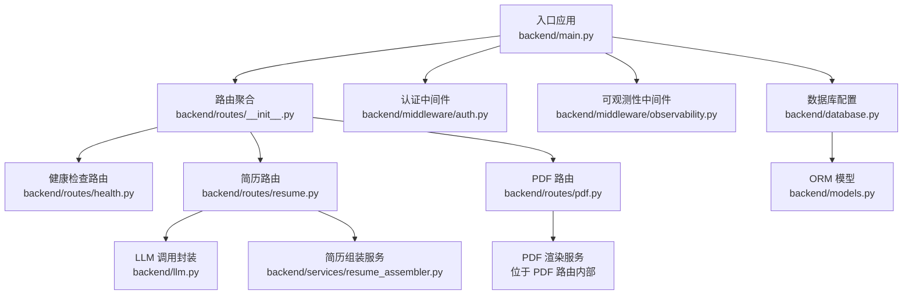
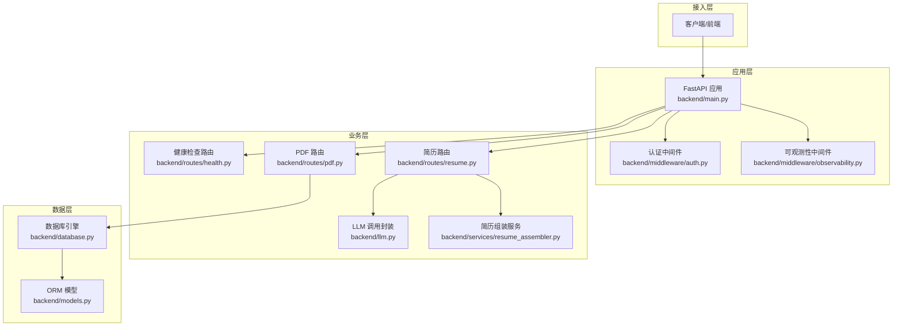
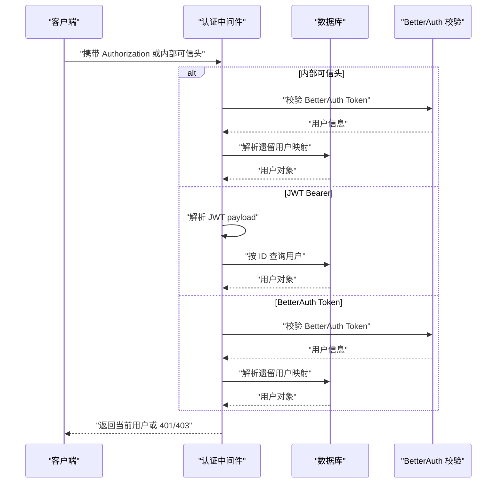
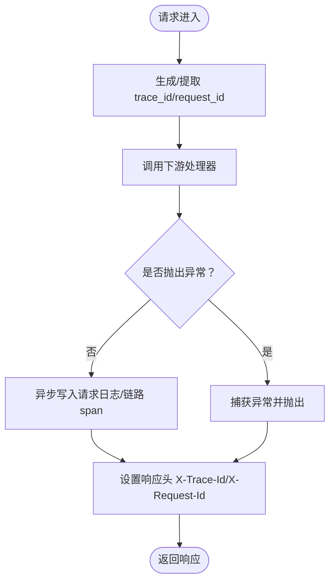
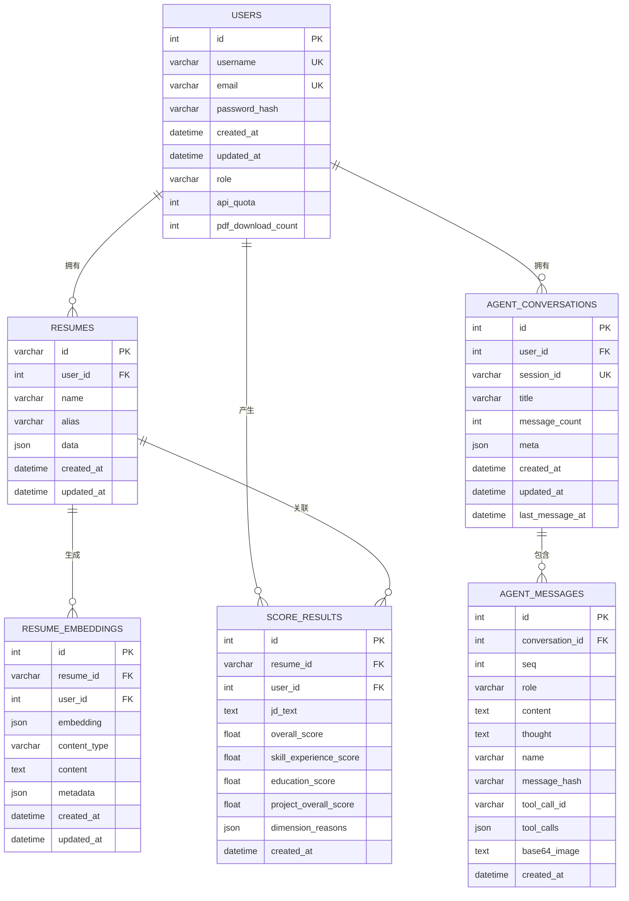
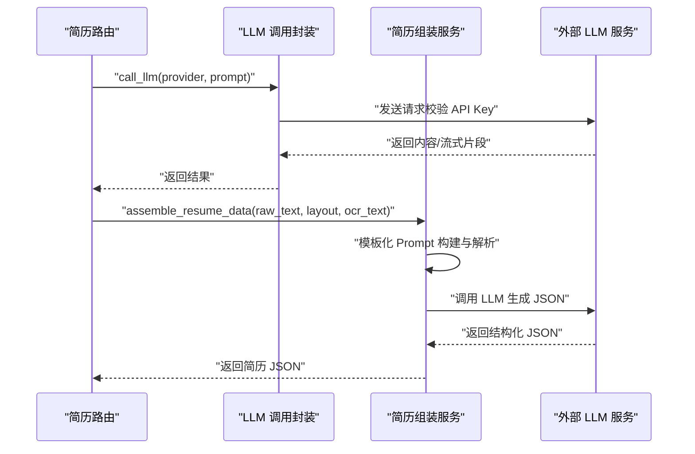
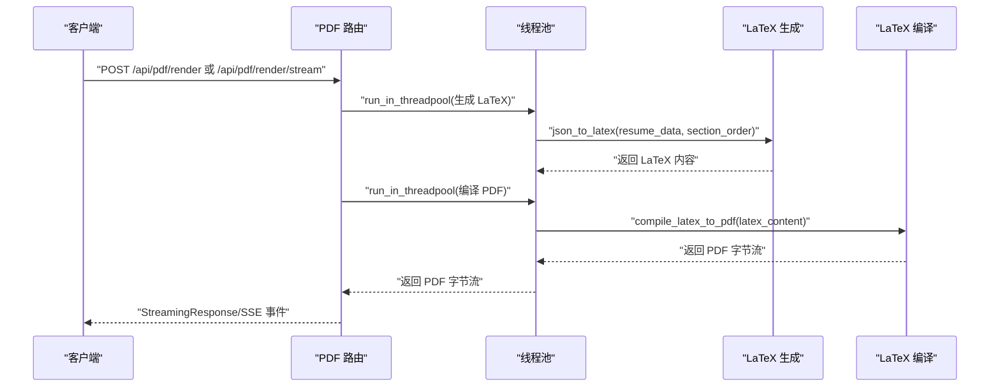
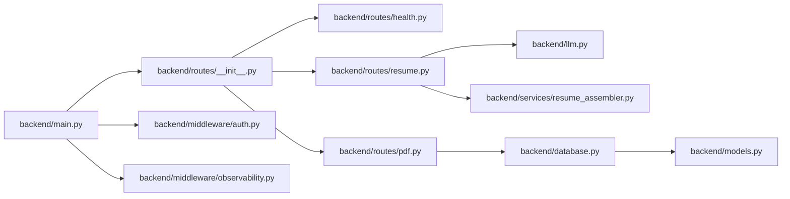

# 后端系统架构

<cite>
**本文引用的文件**
- [backend/main.py](file://backend/main.py)
- [backend/database.py](file://backend/database.py)
- [backend/models.py](file://backend/models.py)
- [backend/routes/__init__.py](file://backend/routes/__init__.py)
- [backend/routes/health.py](file://backend/routes/health.py)
- [backend/routes/resume.py](file://backend/routes/resume.py)
- [backend/routes/pdf.py](file://backend/routes/pdf.py)
- [backend/middleware/__init__.py](file://backend/middleware/__init__.py)
- [backend/middleware/auth.py](file://backend/middleware/auth.py)
- [backend/middleware/observability.py](file://backend/middleware/observability.py)
- [backend/core/logger.py](file://backend/core/logger.py)
- [backend/services/resume_assembler.py](file://backend/services/resume_assembler.py)
- [backend/llm.py](file://backend/llm.py)
</cite>

## 目录
1. [引言](#引言)
2. [项目结构](#项目结构)
3. [核心组件](#核心组件)
4. [架构总览](#架构总览)
5. [详细组件分析](#详细组件分析)
6. [依赖关系分析](#依赖关系分析)
7. [性能考虑](#性能考虑)
8. [故障排查指南](#故障排查指南)
9. [结论](#结论)
10. [附录](#附录)

## 引言
本文件面向 Resume-Agent 后端系统，围绕基于 FastAPI 的后端架构进行系统化梳理，涵盖应用结构、路由体系、中间件配置、数据库模型与核心组件，解释分层架构、模块化设计及组件交互关系。文档同时阐述数据库设计、ORM 使用、数据模型关系，以及配置管理、日志系统、错误处理机制，并提供架构决策的技术考量与性能优化策略。

## 项目结构
后端采用“入口应用 + 路由聚合 + 中间件 + 数据库 + 核心服务”的分层组织方式：
- 入口应用：FastAPI 应用实例集中于入口文件，负责路由注册、CORS、可观测性中间件与启动预热。
- 路由层：按功能域拆分路由模块，统一在路由聚合模块中导出并注册。
- 中间件层：认证中间件与可观测性中间件提供统一鉴权与链路追踪。
- 数据层：数据库配置与 ORM 模型定义，统一依赖注入与连接池参数。
- 核心服务：LLM 调用封装、简历组装、PDF 渲染等业务服务。

图表来源
- [backend/main.py:92-139](file://backend/main.py#L92-L139)
- [backend/routes/__init__.py:1-57](file://backend/routes/__init__.py#L1-L57)
- [backend/middleware/auth.py:113-146](file://backend/middleware/auth.py#L113-L146)
- [backend/middleware/observability.py:170-191](file://backend/middleware/observability.py#L170-L191)
- [backend/database.py:90-138](file://backend/database.py#L90-L138)
- [backend/models.py:111-372](file://backend/models.py#L111-L372)
- [backend/llm.py:52-158](file://backend/llm.py#L52-L158)
- [backend/services/resume_assembler.py:280-388](file://backend/services/resume_assembler.py#L280-L388)
- [backend/routes/pdf.py:125-185](file://backend/routes/pdf.py#L125-L185)

章节来源
- [backend/main.py:92-139](file://backend/main.py#L92-L139)
- [backend/routes/__init__.py:1-57](file://backend/routes/__init__.py#L1-L57)

## 核心组件
- FastAPI 应用与入口
  - 负责环境变量加载、日志初始化、CORS 配置、可观测性中间件注册、路由注册与启动预热。
  - 启动预热包括：外部 HTTP 连接预热、数据库连接预热、Logo 自动同步、tiktoken 编码文件预加载。
- 路由系统
  - 路由模块按功能域拆分，统一在聚合模块中导出并注册，支持动态可选路由（如 TTS）。
- 中间件
  - 认证中间件：支持 JWT 与 BetterAuth Token，内部可信头透传，带数据库重试与降级处理。
  - 可观测性中间件：异步写入请求日志、错误日志与链路 span，避免阻塞主请求。
- 数据库与 ORM
  - 统一数据库 URL 解析（支持 PostgreSQL/MySQL/SQLite），连接池参数可配置，提供依赖注入与初始化方法。
  - ORM 模型覆盖用户、简历、对话、向量嵌入、评分结果等核心实体。
- 核心服务
  - LLM 调用封装：统一 provider 与模型选择，校验 API Key，支持流式与非流式调用。
  - 简历组装服务：基于 OCR 与结构化文本融合生成简历 JSON，模板化 Prompt 构建与解析。
  - PDF 渲染：LaTeX 渲染与编译，支持直出与流式事件推送。

章节来源
- [backend/main.py:227-316](file://backend/main.py#L227-L316)
- [backend/routes/__init__.py:21-36](file://backend/routes/__init__.py#L21-L36)
- [backend/middleware/auth.py:113-191](file://backend/middleware/auth.py#L113-L191)
- [backend/middleware/observability.py:19-191](file://backend/middleware/observability.py#L19-L191)
- [backend/database.py:25-138](file://backend/database.py#L25-L138)
- [backend/models.py:111-372](file://backend/models.py#L111-L372)
- [backend/llm.py:52-158](file://backend/llm.py#L52-L158)
- [backend/services/resume_assembler.py:280-388](file://backend/services/resume_assembler.py#L280-L388)
- [backend/routes/pdf.py:125-185](file://backend/routes/pdf.py#L125-L185)

## 架构总览
后端采用“入口应用 + 路由层 + 中间件层 + 数据层 + 服务层”的分层架构，结合 FastAPI 的依赖注入与中间件机制，实现认证、可观测性与业务路由的解耦。数据库层通过 SQLAlchemy 提供 ORM 能力与连接池管理，服务层封装 LLM 与 PDF 渲染等复杂流程。

图表来源
- [backend/main.py:92-139](file://backend/main.py#L92-L139)
- [backend/middleware/auth.py:113-146](file://backend/middleware/auth.py#L113-L146)
- [backend/middleware/observability.py:170-191](file://backend/middleware/observability.py#L170-L191)
- [backend/routes/health.py:9-12](file://backend/routes/health.py#L9-L12)
- [backend/routes/resume.py:795-800](file://backend/routes/resume.py#L795-L800)
- [backend/routes/pdf.py:125-185](file://backend/routes/pdf.py#L125-L185)
- [backend/llm.py:52-158](file://backend/llm.py#L52-L158)
- [backend/services/resume_assembler.py:280-388](file://backend/services/resume_assembler.py#L280-L388)
- [backend/database.py:90-138](file://backend/database.py#L90-L138)
- [backend/models.py:111-372](file://backend/models.py#L111-L372)

## 详细组件分析

### 认证与授权中间件
- 统一鉴权入口支持三种来源：内部可信 BetterAuth 头、JWT Bearer Token、BetterAuth Token。
- 对数据库异常具备重试与回滚处理，避免瞬时故障导致鉴权失败。
- 提供可选认证依赖，用于匿名可访问端点（如 PDF 预览）。

图表来源
- [backend/middleware/auth.py:113-146](file://backend/middleware/auth.py#L113-L146)
- [backend/middleware/auth.py:41-86](file://backend/middleware/auth.py#L41-L86)

章节来源
- [backend/middleware/auth.py:113-191](file://backend/middleware/auth.py#L113-L191)

### 可观测性中间件
- 在请求进入与退出阶段记录 trace_id/request_id，异步持久化请求日志、错误日志与链路 span。
- 对健康检查等端点进行采样控制，避免管理端迁移后的冗余追踪。
- 提供全局异常与 BrokenPipe 错误处理，保证可观测性与稳定性。

图表来源
- [backend/middleware/observability.py:19-77](file://backend/middleware/observability.py#L19-L77)
- [backend/middleware/observability.py:79-152](file://backend/middleware/observability.py#L79-L152)
- [backend/middleware/observability.py:170-191](file://backend/middleware/observability.py#L170-L191)

章节来源
- [backend/middleware/observability.py:19-191](file://backend/middleware/observability.py#L19-L191)

### 数据库与 ORM 设计
- 数据库 URL 解析支持 PostgreSQL/MySQL/SQLite，连接池参数可配置，启用 pre_ping 与 recycle 控制连接生命周期。
- ORM 模型覆盖用户、简历、对话、向量嵌入、评分结果等，关系定义清晰，索引与约束满足查询与审计需求。
- 提供依赖注入 get_db 与初始化方法 init_db，确保会话生命周期与表结构一致性。

图表来源
- [backend/models.py:111-372](file://backend/models.py#L111-L372)

章节来源
- [backend/database.py:25-138](file://backend/database.py#L25-L138)
- [backend/models.py:111-372](file://backend/models.py#L111-L372)

### LLM 调用封装与简历组装
- LLM 调用封装：统一 provider 与模型选择，校验 API Key，支持流式与非流式调用，兼容不同提供商。
- 简历组装服务：基于 OCR 与结构化文本融合生成简历 JSON，采用模板化 Prompt 构建与解析，支持格式规范化与嵌套结构处理。

图表来源
- [backend/llm.py:52-158](file://backend/llm.py#L52-L158)
- [backend/services/resume_assembler.py:280-388](file://backend/services/resume_assembler.py#L280-L388)
- [backend/routes/resume.py:795-800](file://backend/routes/resume.py#L795-L800)

章节来源
- [backend/llm.py:52-158](file://backend/llm.py#L52-L158)
- [backend/services/resume_assembler.py:280-388](file://backend/services/resume_assembler.py#L280-L388)
- [backend/routes/resume.py:795-800](file://backend/routes/resume.py#L795-L800)

### PDF 渲染与流式事件
- PDF 路由提供直出与流式两种渲染模式，支持配额校验与下载记录。
- 流式渲染通过 SSE 推送进度事件，包含 LaTeX 生成、编译阶段与最终 PDF 数据。

图表来源
- [backend/routes/pdf.py:125-185](file://backend/routes/pdf.py#L125-L185)
- [backend/routes/pdf.py:187-299](file://backend/routes/pdf.py#L187-L299)

章节来源
- [backend/routes/pdf.py:125-185](file://backend/routes/pdf.py#L125-L185)
- [backend/routes/pdf.py:187-299](file://backend/routes/pdf.py#L187-L299)

### 日志系统与调试
- 日志系统支持生产与开发双模式，提供结构化输出、敏感信息脱敏、分类落盘与上下文变量注入。
- 提供专用调试日志写入函数，便于 LaTeX 与 LLM 调试。

章节来源
- [backend/core/logger.py:92-252](file://backend/core/logger.py#L92-L252)

## 依赖关系分析
- 入口应用依赖路由聚合模块，路由模块依赖中间件与数据库依赖注入。
- 路由层依赖 LLM 调用封装与核心服务，服务层依赖数据库 ORM 与外部 LLM。
- 中间件层依赖数据库与认证模块，提供统一鉴权与可观测性。

图表来源
- [backend/main.py:73-139](file://backend/main.py#L73-L139)
- [backend/routes/__init__.py:1-57](file://backend/routes/__init__.py#L1-L57)
- [backend/middleware/auth.py:113-146](file://backend/middleware/auth.py#L113-L146)
- [backend/middleware/observability.py:170-191](file://backend/middleware/observability.py#L170-L191)
- [backend/llm.py:52-158](file://backend/llm.py#L52-L158)
- [backend/services/resume_assembler.py:280-388](file://backend/services/resume_assembler.py#L280-L388)
- [backend/database.py:90-138](file://backend/database.py#L90-L138)
- [backend/models.py:111-372](file://backend/models.py#L111-L372)

章节来源
- [backend/main.py:73-139](file://backend/main.py#L73-L139)
- [backend/routes/__init__.py:1-57](file://backend/routes/__init__.py#L1-L57)

## 性能考虑
- 启动预热
  - 外部 HTTP 连接预热：减少首次调用延迟。
  - 数据库连接预热：避免首次打开仪表盘时的连接建立卡顿。
  - tiktoken 编码文件预加载：避免首次请求时下载阻塞。
- 连接池与超时
  - 连接池参数可配置（pre_ping/recycle/size/overflow/timeout），适配远程数据库高延迟场景。
  - PostgreSQL 连接超时可配置，保障启动时快速回退。
- 异步可观测性
  - 观测落库异步化，避免阻塞主请求，降低尾延迟。
- 线程池与 SSE
  - PDF 渲染使用线程池执行 CPU 密集任务，SSE 事件流提升用户体验。
- 缓存与降级
  - 可选路由（如 TTS）按依赖可用性动态注册，避免功能缺失导致启动失败。

章节来源
- [backend/main.py:227-316](file://backend/main.py#L227-L316)
- [backend/database.py:78-112](file://backend/database.py#L78-L112)
- [backend/middleware/observability.py:43-57](file://backend/middleware/observability.py#L43-L57)
- [backend/routes/pdf.py:155-180](file://backend/routes/pdf.py#L155-L180)

## 故障排查指南
- 认证失败
  - 检查 Authorization 头格式与 BetterAuth 内部可信头配置，确认数据库连接与用户存在性。
- LLM 调用失败
  - 校验对应提供商 API Key 是否配置，确认模型名称与 Base URL 正确。
- PDF 渲染失败
  - 查看 LaTeX 生成与编译阶段日志，确认模板目录与编译环境可用。
- 观测性异常
  - 检查可观测性中间件是否正确注册，确认数据库写入线程池与连接状态。

章节来源
- [backend/middleware/auth.py:113-191](file://backend/middleware/auth.py#L113-L191)
- [backend/llm.py:67-117](file://backend/llm.py#L67-L117)
- [backend/routes/pdf.py:182-184](file://backend/routes/pdf.py#L182-L184)
- [backend/middleware/observability.py:170-191](file://backend/middleware/observability.py#L170-L191)

## 结论
Resume-Agent 后端以 FastAPI 为核心，通过模块化路由、统一中间件与 ORM 设计，实现了清晰的分层架构与良好的扩展性。结合可观测性中间件与启动预热策略，系统在性能与稳定性方面具备良好表现。数据库设计覆盖用户、简历、对话与评分等核心实体，配合连接池与异步写入，满足业务增长需求。

## 附录
- 配置项概览
  - LOG_MODE/LOG_LEVEL/LOG_DIR：日志模式、级别与目录。
  - DATABASE_URL/USE_POSTGRESQL/POSTGRESQL_URL：数据库连接配置。
  - DB_*：连接池参数（pre_ping/recycle/size/overflow/timeout）。
  - PG_CONNECT_TIMEOUT：PostgreSQL 连接超时。
  - DASHSCOPE_API_KEY/DOUBAO_API_KEY/ZHIPU_API_KEY：LLM API Key。
  - AGENT_BACKEND_BASE_URL：Agent 合并反向代理地址。
- 启动与测试
  - 使用 uvicorn 启动入口应用，提供健康检查与 AI 测试接口示例。

章节来源
- [backend/main.py:43-51](file://backend/main.py#L43-L51)
- [backend/database.py:25-88](file://backend/database.py#L25-L88)
- [backend/main.py:318-326](file://backend/main.py#L318-L326)