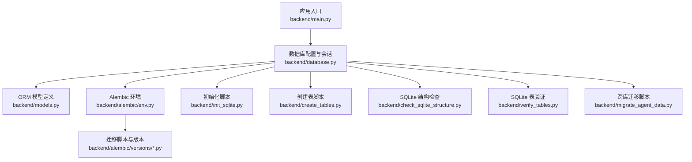
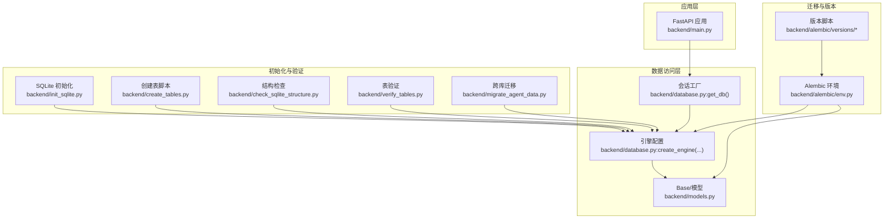
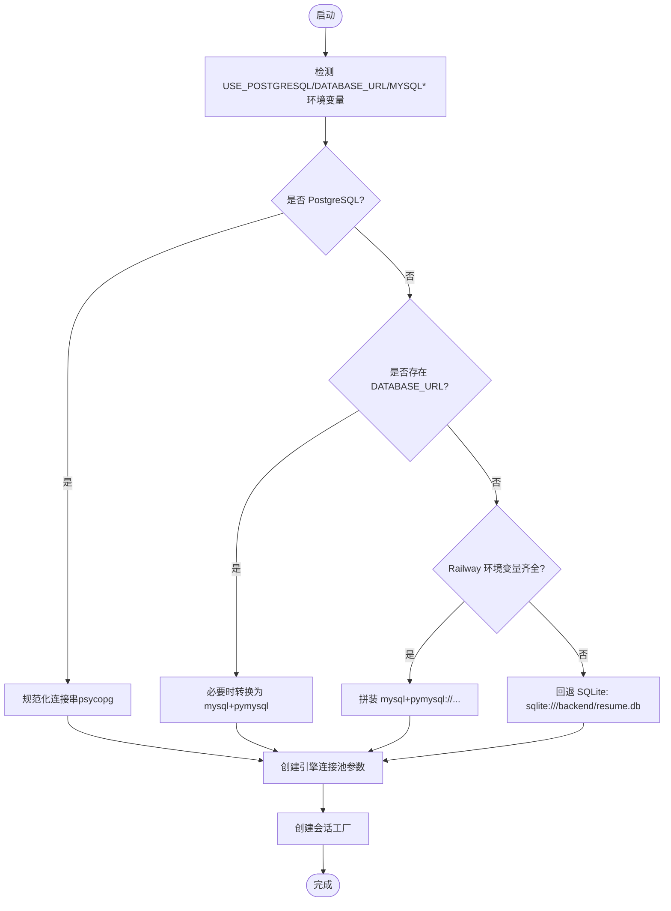
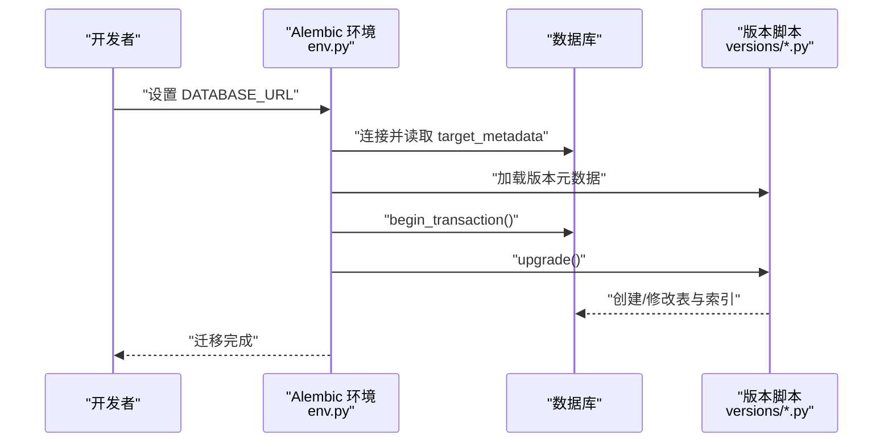
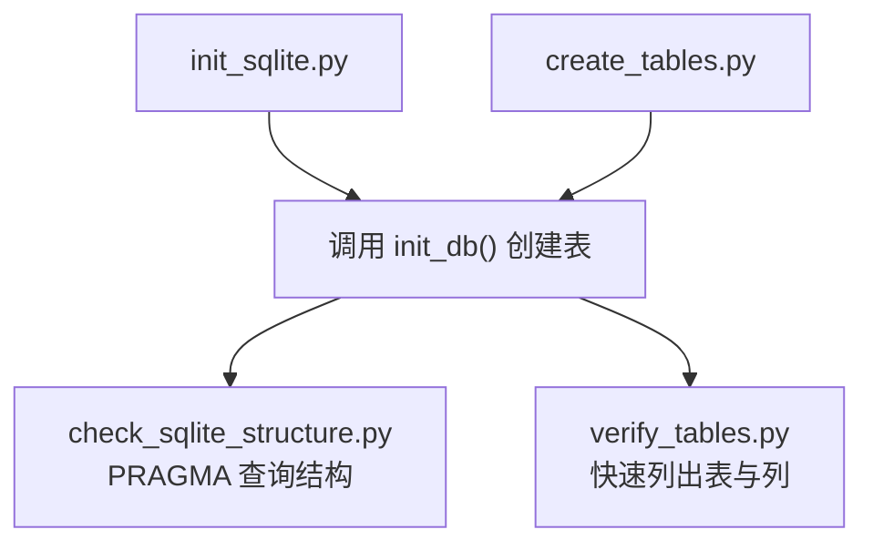
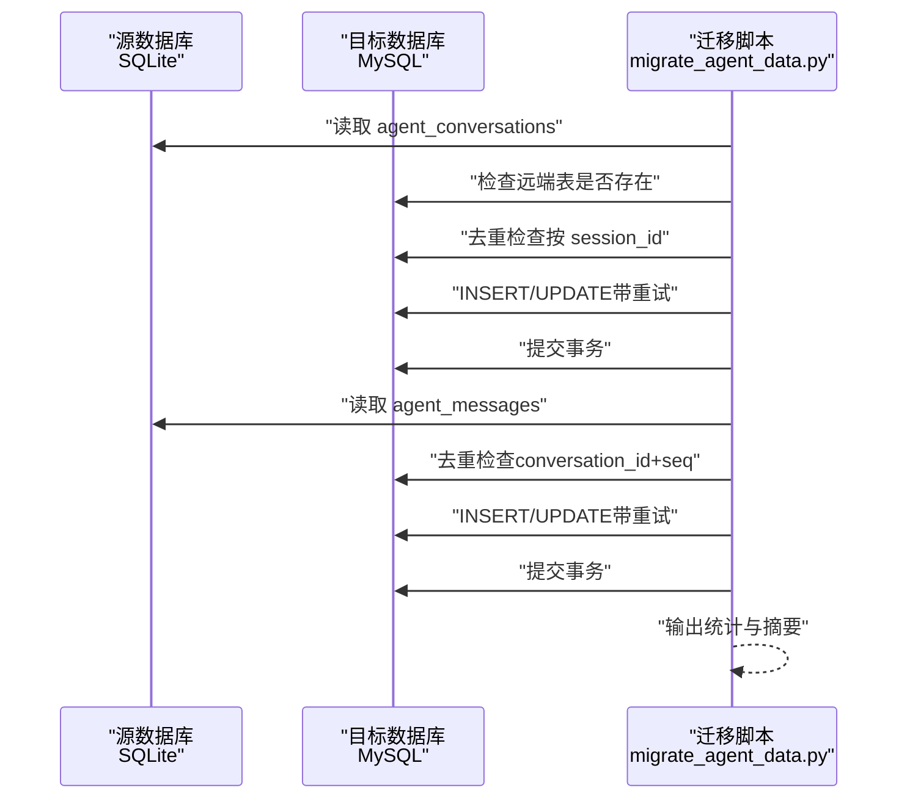
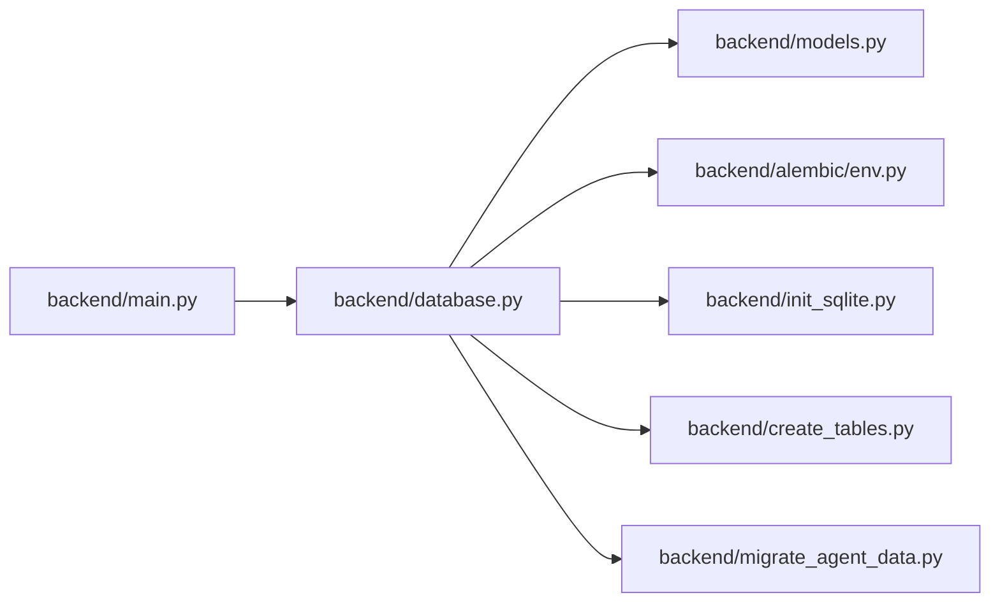

# 数据库集成

<cite>
**本文引用的文件**
- [backend/database.py](file://backend/database.py)
- [backend/models.py](file://backend/models.py)
- [backend/create_tables.py](file://backend/create_tables.py)
- [backend/check_sqlite_structure.py](file://backend/check_sqlite_structure.py)
- [backend/verify_tables.py](file://backend/verify_tables.py)
- [backend/alembic/env.py](file://backend/alembic/env.py)
- [backend/alembic.ini](file://backend/alembic.ini)
- [backend/alembic/versions/001_initial.py](file://backend/alembic/versions/001_initial.py)
- [backend/alembic/versions/010_add_agent_conversation_tables.py](file://backend/alembic/versions/010_add_agent_conversation_tables.py)
- [backend/alembic/versions/015_add_better_auth_entitlements.py](file://backend/alembic/versions/015_add_better_auth_entitlements.py)
- [backend/init_sqlite.py](file://backend/init_sqlite.py)
- [backend/migrate_agent_data.py](file://backend/migrate_agent_data.py)
- [backend/main.py](file://backend/main.py)
- [backend/resume_models.py](file://backend/resume_models.py)
</cite>

## 目录
1. [简介](#简介)
2. [项目结构](#项目结构)
3. [核心组件](#核心组件)
4. [架构总览](#架构总览)
5. [组件详解](#组件详解)
6. [依赖关系分析](#依赖关系分析)
7. [性能考量](#性能考量)
8. [故障排查指南](#故障排查指南)
9. [结论](#结论)
10. [附录](#附录)

## 简介
本文件系统性阐述本项目的数据库集成方案，覆盖数据库引擎配置、连接池参数、事务与会话管理、ORM 模型设计与关系映射、Alembic 迁移体系、数据库初始化与结构验证、查询优化与索引设计、数据完整性约束，以及新增模型与迁移变更的操作流程。文档面向不同层次读者，既提供高层概览也给出代码级定位与图示。

## 项目结构
数据库相关能力主要分布在以下模块：
- 引擎与会话：backend/database.py
- ORM 模型：backend/models.py
- 初始化与验证：backend/init_sqlite.py、backend/create_tables.py、backend/check_sqlite_structure.py、backend/verify_tables.py
- 迁移与版本：backend/alembic/* 与 backend/alembic/versions/*
- 数据迁移脚本：backend/migrate_agent_data.py
- 应用入口与依赖注入：backend/main.py
- 简历结构化模型（非 ORM）：backend/resume_models.py



图表来源
- [backend/main.py:1-200](file://backend/main.py#L1-L200)
- [backend/database.py:1-138](file://backend/database.py#L1-L138)
- [backend/models.py:1-372](file://backend/models.py#L1-L372)
- [backend/alembic/env.py:1-80](file://backend/alembic/env.py#L1-L80)
- [backend/alembic/versions/001_initial.py:1-49](file://backend/alembic/versions/001_initial.py#L1-L49)
- [backend/init_sqlite.py:1-69](file://backend/init_sqlite.py#L1-L69)
- [backend/create_tables.py:1-22](file://backend/create_tables.py#L1-L22)
- [backend/check_sqlite_structure.py:1-97](file://backend/check_sqlite_structure.py#L1-L97)
- [backend/verify_tables.py:1-33](file://backend/verify_tables.py#L1-L33)
- [backend/migrate_agent_data.py:1-369](file://backend/migrate_agent_data.py#L1-L369)

章节来源
- [backend/database.py:1-138](file://backend/database.py#L1-L138)
- [backend/models.py:1-372](file://backend/models.py#L1-L372)
- [backend/alembic/env.py:1-80](file://backend/alembic/env.py#L1-L80)
- [backend/alembic/versions/001_initial.py:1-49](file://backend/alembic/versions/001_initial.py#L1-L49)
- [backend/init_sqlite.py:1-69](file://backend/init_sqlite.py#L1-L69)
- [backend/create_tables.py:1-22](file://backend/create_tables.py#L1-L22)
- [backend/check_sqlite_structure.py:1-97](file://backend/check_sqlite_structure.py#L1-L97)
- [backend/verify_tables.py:1-33](file://backend/verify_tables.py#L1-L33)
- [backend/migrate_agent_data.py:1-369](file://backend/migrate_agent_data.py#L1-L369)
- [backend/main.py:1-200](file://backend/main.py#L1-L200)
- [backend/resume_models.py:1-128](file://backend/resume_models.py#L1-L128)

## 核心组件
- 数据库引擎与连接池
  - 支持 PostgreSQL（psycopg）、MySQL（pymysql）、SQLite 三种后端，自动从环境变量推断并构造连接串。
  - 连接池参数可配置：大小、溢出、回收、超时、预检、回滚重置等；针对 PostgreSQL 提供连接超时控制。
- 会话与依赖注入
  - 基于 SQLAlchemy 的 sessionmaker 工厂，提供依赖注入函数以在请求生命周期内获取/释放会话。
- ORM 模型
  - 定义用户、简历、成员、API 日志、Agent 对话与消息、向量嵌入、评分结果等表结构与关系。
  - 关系映射采用 back_populates/cascade/delete-orphan/lazy/select 等策略，兼顾一致性与性能。
- 迁移与版本
  - Alembic 环境读取 DATABASE_URL 并绑定 Base.metadata，支持在线/离线迁移。
  - 版本脚本覆盖初始表、Agent 对话表、BetterAuth 权益表等演进。
- 初始化与验证
  - 提供 SQLite 初始化脚本、创建表脚本、结构检查与表验证脚本。
- 跨库迁移
  - 从本地 SQLite 迁移到远端 MySQL 的专用脚本，含重试、去重、统计与校验。

章节来源
- [backend/database.py:25-138](file://backend/database.py#L25-L138)
- [backend/models.py:111-372](file://backend/models.py#L111-L372)
- [backend/alembic/env.py:30-80](file://backend/alembic/env.py#L30-L80)
- [backend/alembic/versions/001_initial.py:19-49](file://backend/alembic/versions/001_initial.py#L19-L49)
- [backend/alembic/versions/010_add_agent_conversation_tables.py:19-75](file://backend/alembic/versions/010_add_agent_conversation_tables.py#L19-L75)
- [backend/alembic/versions/015_add_better_auth_entitlements.py:18-92](file://backend/alembic/versions/015_add_better_auth_entitlements.py#L18-L92)
- [backend/init_sqlite.py:13-69](file://backend/init_sqlite.py#L13-L69)
- [backend/create_tables.py:9-22](file://backend/create_tables.py#L9-L22)
- [backend/check_sqlite_structure.py:1-97](file://backend/check_sqlite_structure.py#L1-L97)
- [backend/verify_tables.py:1-33](file://backend/verify_tables.py#L1-L33)
- [backend/migrate_agent_data.py:34-369](file://backend/migrate_agent_data.py#L34-L369)

## 架构总览
数据库子系统围绕“引擎—会话—模型—迁移—初始化”的闭环展开，应用通过依赖注入获取会话，执行 CRUD 与事务，迁移工具保障结构演进，初始化与验证工具保证部署一致性。



图表来源
- [backend/main.py:106-139](file://backend/main.py#L106-L139)
- [backend/database.py:90-138](file://backend/database.py#L90-L138)
- [backend/models.py:111-372](file://backend/models.py#L111-L372)
- [backend/alembic/env.py:30-80](file://backend/alembic/env.py#L30-L80)
- [backend/alembic/versions/001_initial.py:19-49](file://backend/alembic/versions/001_initial.py#L19-L49)
- [backend/init_sqlite.py:13-69](file://backend/init_sqlite.py#L13-L69)
- [backend/create_tables.py:9-22](file://backend/create_tables.py#L9-L22)
- [backend/check_sqlite_structure.py:1-97](file://backend/check_sqlite_structure.py#L1-L97)
- [backend/verify_tables.py:1-33](file://backend/verify_tables.py#L1-L33)
- [backend/migrate_agent_data.py:34-369](file://backend/migrate_agent_data.py#L34-L369)

## 组件详解

### 数据库引擎与连接池
- 连接串选择逻辑
  - 若启用 PostgreSQL，则强制使用 psycopg 驱动，并对 URL 做标准化处理；否则使用 DATABASE_URL 或从 Railway 环境变量拼装 MySQL URL。
  - 默认回退到 SQLite 文件数据库，路径为项目根下的 backend/resume.db。
- 连接池参数
  - 可配置 pool_size、max_overflow、pool_recycle、pool_timeout、pool_pre_ping、pool_use_lifo、pool_reset_on_return。
  - PostgreSQL 在启动阶段设置连接超时，避免长时间阻塞。
  - MySQL 设置字符集与读写超时，提升稳定性。
- 会话工厂
  - autocommit=false、autoflush=false，配合显式事务控制；依赖注入函数负责 try/finally 关闭会话。



图表来源
- [backend/database.py:25-112](file://backend/database.py#L25-L112)

章节来源
- [backend/database.py:25-112](file://backend/database.py#L25-L112)

### ORM 模型设计与关系映射
- 主要实体与字段
  - 用户：用户名/邮箱唯一、密码哈希、角色、IP、配额、计数等，带更新时间索引。
  - 简历：主键为字符串 ID，关联用户，JSON 存储完整数据。
  - 成员：平台内部成员，可反向关联用户。
  - API 日志/错误日志/Trace Span：可观测性支撑。
  - Agent 对话与消息：会话表唯一 session_id，消息表按会话+序号唯一，支持去重。
  - 向量嵌入：按 resume_id/user_id 维度建立索引，支持语义检索。
  - 评分结果：多维度分数与理由，外键关联用户与简历。
- 关系映射
  - 使用 back_populates 建立双向关系；cascade="all, delete-orphan" 确保删除用户时级联清理其简历。
  - 外键约束与 ON DELETE 策略明确，避免悬挂数据。
  - 部分关系使用 overlaps 避免重载导致的 mapper 冲突。

```mermaid
classDiagram
class User {
+整型 id
+字符串 username
+字符串 email
+字符串 password_hash
+枚举 role
+整型 api_quota
+字符串 last_login_ip
+整型 pdf_download_count
+时间 created_at
+时间 updated_at
}
class Resume {
+字符串 id
+整型 user_id
+字符串 name
+JSON data
+时间 created_at
+时间 updated_at
}
class Member {
+整型 id
+字符串 name
+字符串 email
+字符串 position
+字符串 team
+字符串 status
+整型 user_id
+时间 created_at
+时间 updated_at
}
class AgentConversation {
+整型 id
+字符串 session_id
+整型 user_id
+字符串 title
+整型 message_count
+JSON meta
+时间 created_at
+时间 updated_at
+时间 last_message_at
}
class AgentMessage {
+整型 id
+整型 conversation_id
+整型 seq
+字符串 role
+文本 content
+文本 thought
+字符串 name
+字符串 tool_call_id
+JSON tool_calls
+文本 base64_image
+时间 created_at
}
class ResumeEmbedding {
+整型 id
+字符串 resume_id
+整型 user_id
+JSON embedding
+字符串 content_type
+文本 content
+JSON extra_metadata
+时间 created_at
+时间 updated_at
}
class ScoreResult {
+整型 id
+字符串 resume_id
+整型 user_id
+文本 jd_text
+浮点 overall_score
+JSON dimension_reasons
+时间 created_at
}
User "1" <-- "多" Resume : "外键 user_id"
User "1" <-- "多" AgentConversation : "外键 user_id"
AgentConversation "1" "会话" <-- "多" AgentMessage : "外键 conversation_id"
Resume "1" <-- "多" ResumeEmbedding : "外键 resume_id"
User "1" <-- "多" ResumeEmbedding : "外键 user_id"
Resume "1" <-- "多" ScoreResult : "外键 resume_id"
User "1" <-- "多" ScoreResult : "外键 user_id"
```

图表来源
- [backend/models.py:111-372](file://backend/models.py#L111-L372)

章节来源
- [backend/models.py:111-372](file://backend/models.py#L111-L372)

### Alembic 迁移管理
- 环境配置
  - 通过 Alembic 配置读取 DATABASE_URL，并将 target_metadata 绑定到 Base.metadata，确保迁移扫描到所有模型。
  - 支持在线/离线迁移模式。
- 版本演进
  - 初始版本：创建 users/resumes 表及索引。
  - Agent 对话版本：新增 agent_conversations 与 agent_messages，含复合索引与唯一约束。
  - BetterAuth 权益版本：新增 better_auth_entitlements 表及多字段索引。
- 迁移执行
  - 通过 Alembic CLI 或脚本触发升级/降级，结合环境变量切换目标数据库。



图表来源
- [backend/alembic/env.py:30-80](file://backend/alembic/env.py#L30-L80)
- [backend/alembic/versions/001_initial.py:19-49](file://backend/alembic/versions/001_initial.py#L19-L49)
- [backend/alembic/versions/010_add_agent_conversation_tables.py:19-75](file://backend/alembic/versions/010_add_agent_conversation_tables.py#L19-L75)
- [backend/alembic/versions/015_add_better_auth_entitlements.py:18-92](file://backend/alembic/versions/015_add_better_auth_entitlements.py#L18-L92)

章节来源
- [backend/alembic/env.py:30-80](file://backend/alembic/env.py#L30-L80)
- [backend/alembic/versions/001_initial.py:19-49](file://backend/alembic/versions/001_initial.py#L19-L49)
- [backend/alembic/versions/010_add_agent_conversation_tables.py:19-75](file://backend/alembic/versions/010_add_agent_conversation_tables.py#L19-L75)
- [backend/alembic/versions/015_add_better_auth_entitlements.py:18-92](file://backend/alembic/versions/015_add_better_auth_entitlements.py#L18-L92)

### 数据库初始化与表结构验证
- 初始化
  - SQLite 初始化脚本：确认当前为 SQLite，创建所有表，输出文件大小与状态。
  - 创建表脚本：直接调用 init_db() 输出当前数据库并创建表。
- 结构验证
  - 结构检查脚本：列出表、列、索引、外键关系，便于人工核对。
  - 表验证脚本：快速输出表数量与列清单，辅助自动化校验。



图表来源
- [backend/init_sqlite.py:13-69](file://backend/init_sqlite.py#L13-L69)
- [backend/create_tables.py:9-22](file://backend/create_tables.py#L9-L22)
- [backend/check_sqlite_structure.py:1-97](file://backend/check_sqlite_structure.py#L1-L97)
- [backend/verify_tables.py:1-33](file://backend/verify_tables.py#L1-L33)

章节来源
- [backend/init_sqlite.py:13-69](file://backend/init_sqlite.py#L13-L69)
- [backend/create_tables.py:9-22](file://backend/create_tables.py#L9-L22)
- [backend/check_sqlite_structure.py:1-97](file://backend/check_sqlite_structure.py#L1-L97)
- [backend/verify_tables.py:1-33](file://backend/verify_tables.py#L1-L33)

### 跨库迁移（SQLite → MySQL）
- 目标与流程
  - 从本地 SQLite 迁移 Agent 对话与消息至远端 MySQL。
  - 支持 dry-run、重试、去重、提交与失败统计。
- 关键步骤
  - 检查远端 schema 是否已升级到最新版本。
  - 逐表读取源数据，按唯一键去重，批量插入远端。
  - 带指数退避重试，失败时回滚并记录。
- 参数
  - --dry-run：仅校验与打印计划。
  - --max-retries/--retry-delay：控制重试次数与延迟。



图表来源
- [backend/migrate_agent_data.py:34-369](file://backend/migrate_agent_data.py#L34-L369)

章节来源
- [backend/migrate_agent_data.py:34-369](file://backend/migrate_agent_data.py#L34-L369)

### 事务处理机制与依赖注入
- 会话生命周期
  - get_db() 创建会话，yield 给业务逻辑，finally 关闭，避免泄漏。
- 事务建议
  - 显式开启/提交/回滚事务，确保一致性。
  - 对并发写入场景使用合适的隔离级别与锁策略。
- FastAPI 集成
  - 应用通过 include_router 注册路由，路由层可注入 db=get_db() 使用会话。

章节来源
- [backend/database.py:121-131](file://backend/database.py#L121-L131)
- [backend/main.py:106-139](file://backend/main.py#L106-L139)

## 依赖关系分析
- 模块耦合
  - database.py 作为中心，被 models.py（继承 Base）、alembic/env.py（绑定 metadata）、init_sqlite.py/create_tables.py（创建表）、migrate_agent_data.py（跨库迁移）所依赖。
  - main.py 通过路由模块间接依赖数据库配置。
- 外部依赖
  - SQLAlchemy、Alembic、dotenv、psycopg（PostgreSQL）、pymysql（MySQL）、sqlite3（内置）。



图表来源
- [backend/database.py:11-23](file://backend/database.py#L11-L23)
- [backend/models.py:18-22](file://backend/models.py#L18-L22)
- [backend/alembic/env.py:30-35](file://backend/alembic/env.py#L30-L35)
- [backend/init_sqlite.py:13-13](file://backend/init_sqlite.py#L13-L13)
- [backend/create_tables.py:9-9](file://backend/create_tables.py#L9-L9)
- [backend/migrate_agent_data.py:34-34](file://backend/migrate_agent_data.py#L34-L34)
- [backend/main.py:74-91](file://backend/main.py#L74-L91)

章节来源
- [backend/database.py:11-23](file://backend/database.py#L11-L23)
- [backend/models.py:18-22](file://backend/models.py#L18-L22)
- [backend/alembic/env.py:30-35](file://backend/alembic/env.py#L30-L35)
- [backend/init_sqlite.py:13-13](file://backend/init_sqlite.py#L13-L13)
- [backend/create_tables.py:9-9](file://backend/create_tables.py#L9-L9)
- [backend/migrate_agent_data.py:34-34](file://backend/migrate_agent_data.py#L34-L34)
- [backend/main.py:74-91](file://backend/main.py#L74-L91)

## 性能考量
- 连接池
  - 合理设置 pool_size 与 max_overflow，避免高并发下连接耗尽。
  - pool_pre_ping 在高延迟网络下谨慎开启，减少陈旧连接带来的失败。
  - pool_recycle 控制连接生命周期，避免驱动/服务器回收导致的隐性失效。
- 索引设计
  - 高频过滤/排序字段建立索引（如 users.email、resumes.user_id、agent_conversations.session_id）。
  - 复合索引用于范围查询（如 agent_conversations.user_id + updated_at）。
- 查询优化
  - 使用 select 加载策略减少 N+1 查询；必要时使用 joined/ subquery 加载。
  - 对大字段（JSON/Text）进行分表或拆分，降低主表扫描成本。
- IO 与超时
  - MySQL 设置读写超时，避免慢查询阻塞连接。
  - PostgreSQL 设置连接超时，快速失败并回退到文件存储策略。

## 故障排查指南
- 连接失败
  - 检查 DATABASE_URL/USE_POSTGRESQL/环境变量是否正确；确认驱动版本与 URL 协议匹配。
  - PostgreSQL 可调整 PG_CONNECT_TIMEOUT 快速失败。
- 迁移失败
  - 确认 Alembic 目标 metadata 已绑定 Base；检查版本脚本语法与依赖。
  - 在线迁移失败时切换到离线模式或检查数据库权限。
- 初始化问题
  - SQLite 初始化前确认当前为 sqlite；检查 resume.db 路径与权限。
  - 使用 check_sqlite_structure.py/verify_tables.py 核对表结构与列定义。
- 跨库迁移
  - 确保远端已执行到最新版本；使用 --dry-run 先验证数据量与去重策略。
  - 失败时查看统计输出，定位失败条目并重试。

章节来源
- [backend/database.py:25-112](file://backend/database.py#L25-L112)
- [backend/alembic/env.py:44-80](file://backend/alembic/env.py#L44-L80)
- [backend/init_sqlite.py:20-69](file://backend/init_sqlite.py#L20-L69)
- [backend/check_sqlite_structure.py:1-97](file://backend/check_sqlite_structure.py#L1-L97)
- [backend/verify_tables.py:1-33](file://backend/verify_tables.py#L1-L33)
- [backend/migrate_agent_data.py:319-369](file://backend/migrate_agent_data.py#L319-L369)

## 结论
本项目的数据库集成以 SQLAlchemy 为核心，结合 Alembic 实现结构化演进，辅以完善的初始化与验证工具，满足从开发到生产的全生命周期需求。通过合理的连接池参数、索引设计与事务策略，可在多数据库后端上保持稳定与高性能。跨库迁移脚本提供了从本地 SQLite 到远端 MySQL 的可靠路径，便于平滑扩容与数据整合。

## 附录

### 新增数据模型与关系映射
- 步骤
  - 在 models.py 中定义新表与字段，确保继承自 Base。
  - 如涉及关系，使用 ForeignKey/back_populates/cascade 等声明。
  - 如需唯一约束或复合索引，在表级或列级声明。
- 迁移
  - 使用 Alembic 生成迁移脚本，编写 upgrade()/downgrade()。
  - 执行 alembic upgrade head 生效；必要时先 dry-run 验证。

章节来源
- [backend/models.py:111-372](file://backend/models.py#L111-L372)
- [backend/alembic/env.py:30-42](file://backend/alembic/env.py#L30-L42)

### 修改现有表结构
- 建议
  - 优先使用 Alembic 生成迁移，避免直接手工改表。
  - 对大表加索引或重命名字段，评估锁与复制开销。
  - 下游依赖（外键/索引/视图）需同步更新。
- 示例
  - 参考版本脚本中的索引创建与外键约束声明方式。

章节来源
- [backend/alembic/versions/010_add_agent_conversation_tables.py:19-75](file://backend/alembic/versions/010_add_agent_conversation_tables.py#L19-L75)
- [backend/alembic/versions/015_add_better_auth_entitlements.py:18-92](file://backend/alembic/versions/015_add_better_auth_entitlements.py#L18-L92)

### 数据完整性约束
- 外键约束
  - 用户与简历、会话与消息、嵌入与用户/简历均设置外键与 ON DELETE 策略。
- 唯一约束
  - 用户邮箱/用户名唯一；会话表 session_id 唯一；消息表 conversation_id+seq 唯一。
- 索引
  - 高频查询字段建立单列/复合索引，提升查询效率。

章节来源
- [backend/models.py:111-372](file://backend/models.py#L111-L372)

### 查询优化与索引设计原则
- 原则
  - 为过滤/排序/连接字段建立索引；避免在索引列上使用函数或隐式转换。
  - 复合索引顺序遵循最左前缀原则；将区分度高的列放在前面。
  - 控制索引数量，平衡写入与查询性能。
- 实践
  - 使用 EXPLAIN/ANALYZE 分析慢查询；定期维护统计信息。

[本节为通用指导，无需特定文件引用]