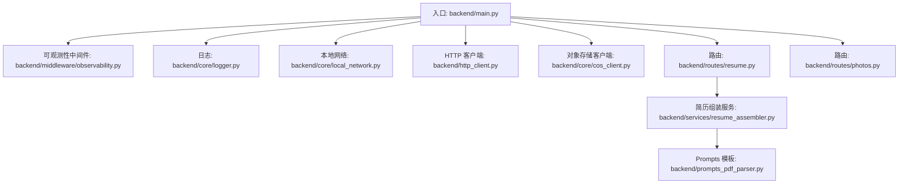
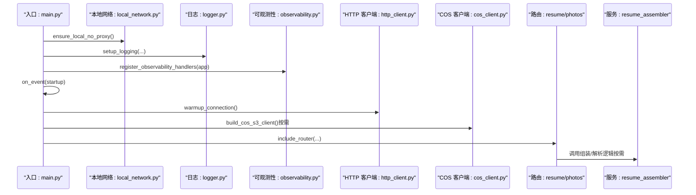
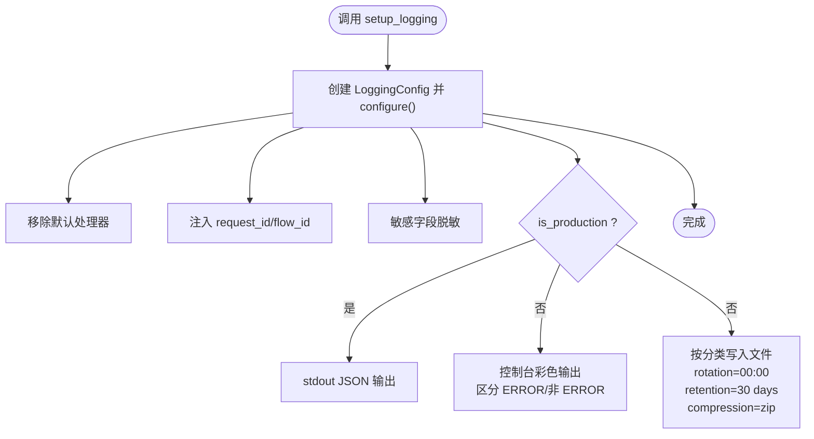
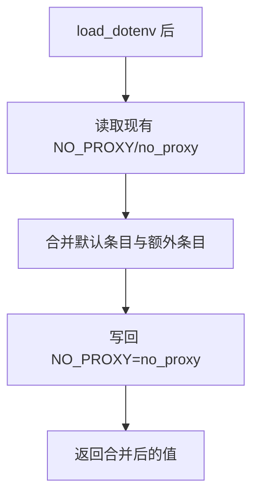
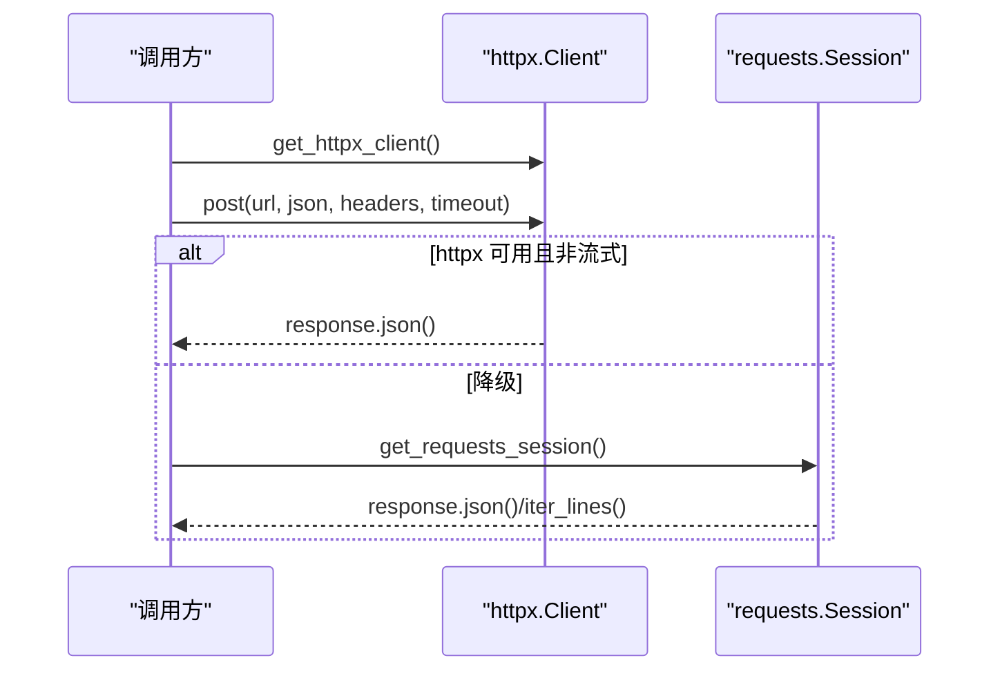
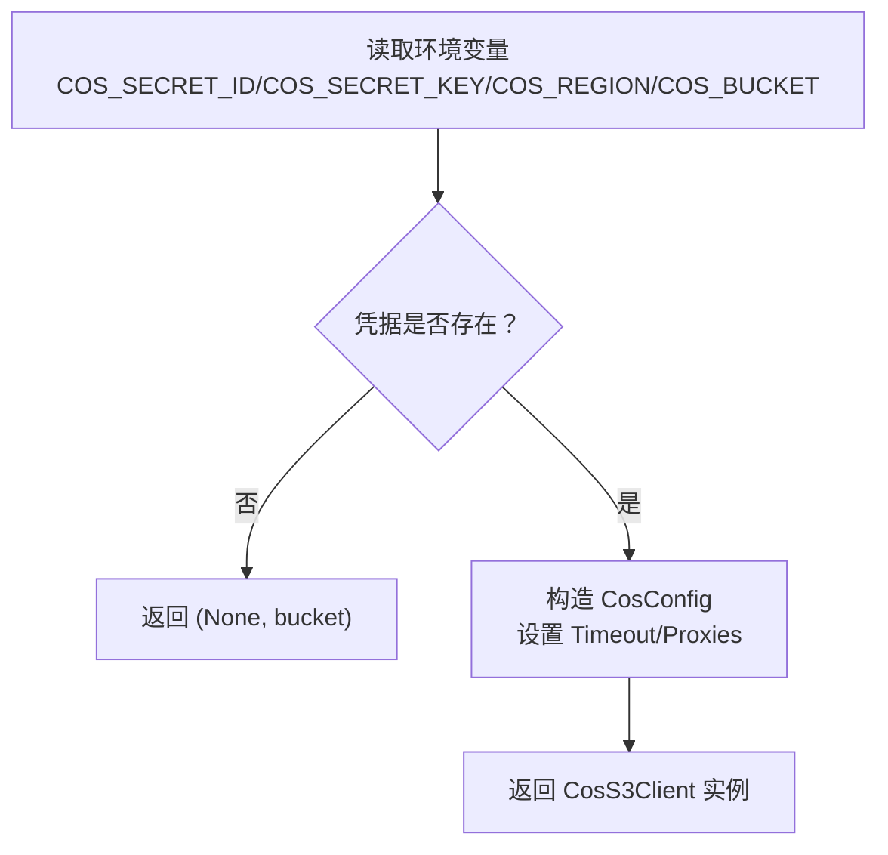
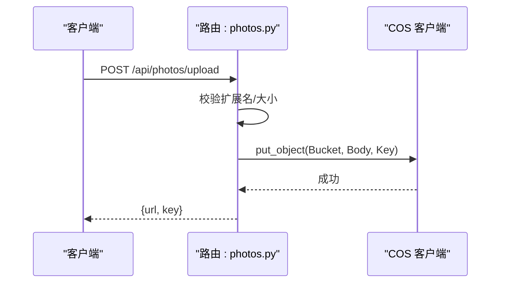
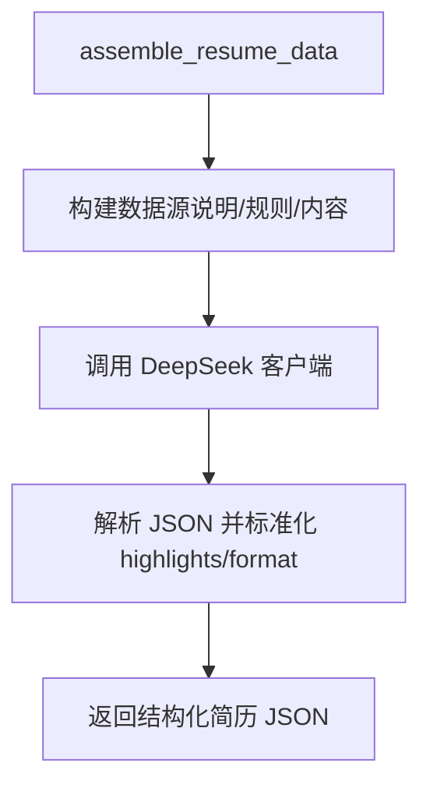
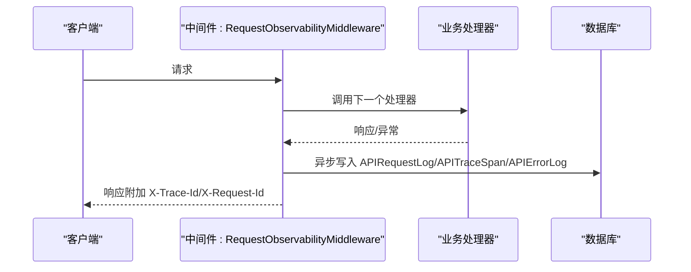
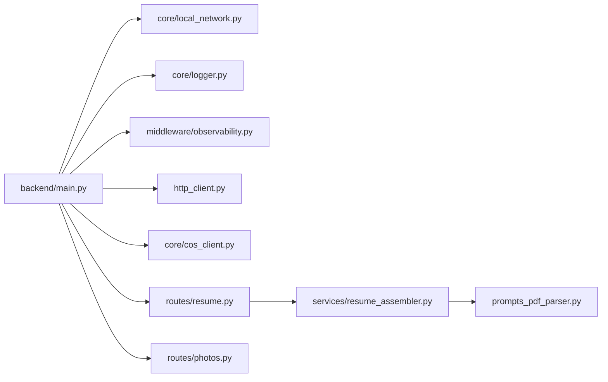

# 核心服务组件

<cite>
**本文引用的文件**
- [backend/core/logger.py](file://backend/core/logger.py)
- [backend/core/local_network.py](file://backend/core/local_network.py)
- [backend/core/cos_client.py](file://backend/core/cos_client.py)
- [backend/http_client.py](file://backend/http_client.py)
- [backend/main.py](file://backend/main.py)
- [backend/middleware/observability.py](file://backend/middleware/observability.py)
- [backend/routes/resume.py](file://backend/routes/resume.py)
- [backend/routes/photos.py](file://backend/routes/photos.py)
- [backend/services/resume_assembler.py](file://backend/services/resume_assembler.py)
- [backend/prompts_pdf_parser.py](file://backend/prompts_pdf_parser.py)
- [auth-stack.env.example](file://auth-stack.env.example)
</cite>

## 目录
1. [简介](#简介)
2. [项目结构](#项目结构)
3. [核心组件](#核心组件)
4. [架构总览](#架构总览)
5. [详细组件分析](#详细组件分析)
6. [依赖关系分析](#依赖关系分析)
7. [性能考量](#性能考量)
8. [故障排除指南](#故障排除指南)
9. [结论](#结论)
10. [附录](#附录)

## 简介
本文件面向“核心服务组件”，聚焦以下方面：
- 日志系统设计与实现：Loguru 集成、日志级别配置、生产环境日志管理、敏感信息脱敏、调试日志写入
- 本地网络配置与代理设置：避免国内云服务经系统代理导致的 SSL 失败
- HTTP 客户端优化：HTTP/2、DNS 预解析、连接池复用、降级方案与统一调用接口
- 对象存储客户端：COS 客户端工厂、本地开发绕过系统代理、缓存策略开关
- 文件上传下载处理：用户照片上传至 COS、URL 生成与访问控制
- 扩展方法与配置管理：如何在现有框架上开发新的核心服务组件
- 故障排除：常见问题定位与修复建议

## 项目结构
核心服务组件分布在 backend/core、backend/middleware、backend/routes、backend/services 等目录，围绕 FastAPI 应用入口 main.py 组织。

**图示来源**
- [backend/main.py:1-326](file://backend/main.py#L1-L326)
- [backend/middleware/observability.py:1-191](file://backend/middleware/observability.py#L1-L191)
- [backend/core/logger.py:1-252](file://backend/core/logger.py#L1-L252)
- [backend/core/local_network.py:1-44](file://backend/core/local_network.py#L1-L44)
- [backend/http_client.py:1-301](file://backend/http_client.py#L1-L301)
- [backend/core/cos_client.py:1-47](file://backend/core/cos_client.py#L1-L47)
- [backend/routes/resume.py:1-800](file://backend/routes/resume.py#L1-L800)
- [backend/routes/photos.py:1-102](file://backend/routes/photos.py#L1-L102)
- [backend/services/resume_assembler.py:1-388](file://backend/services/resume_assembler.py#L1-L388)
- [backend/prompts_pdf_parser.py:1-108](file://backend/prompts_pdf_parser.py#L1-L108)

**章节来源**
- [backend/main.py:1-326](file://backend/main.py#L1-L326)

## 核心组件
- 日志系统（Loguru）：集中配置、请求/流程 ID 注入、敏感信息脱敏、生产/开发差异化输出、文件落盘与分类归档、调试专用写入函数
- 本地网络配置：合并 NO_PROXY，确保国内云服务直连，避免代理导致的 SSL 失败
- HTTP 客户端：HTTP/2 优先、DNS 预解析、连接池复用、降级方案、统一 API 调用接口
- 对象存储客户端：COS 客户端工厂、禁用系统代理、超时控制、本地资源优先策略
- 文件上传：用户照片上传至 COS，路径规范化与 URL 生成
- 可观测性中间件：请求/错误日志、链路追踪、异步落库、异常兜底

**章节来源**
- [backend/core/logger.py:92-182](file://backend/core/logger.py#L92-L182)
- [backend/core/local_network.py:31-44](file://backend/core/local_network.py#L31-L44)
- [backend/http_client.py:78-156](file://backend/http_client.py#L78-L156)
- [backend/core/cos_client.py:19-37](file://backend/core/cos_client.py#L19-L37)
- [backend/routes/photos.py:33-102](file://backend/routes/photos.py#L33-L102)
- [backend/middleware/observability.py:19-61](file://backend/middleware/observability.py#L19-L61)

## 架构总览
后端服务启动时进行网络与日志初始化，注册可观测性中间件，随后加载各路由模块。HTTP 客户端在启动事件中预热，对象存储客户端在需要时按需创建。

**图示来源**
- [backend/main.py:37-52](file://backend/main.py#L37-L52)
- [backend/main.py:228-270](file://backend/main.py#L228-L270)
- [backend/core/local_network.py:31-44](file://backend/core/local_network.py#L31-L44)
- [backend/core/logger.py:184-194](file://backend/core/logger.py#L184-L194)
- [backend/middleware/observability.py:170-191](file://backend/middleware/observability.py#L170-L191)
- [backend/http_client.py:264-282](file://backend/http_client.py#L264-L282)
- [backend/core/cos_client.py:19-37](file://backend/core/cos_client.py#L19-L37)
- [backend/routes/resume.py:795-800](file://backend/routes/resume.py#L795-L800)

## 详细组件分析

### 日志系统（Loguru 集成与生产管理）
- 配置入口：通过 LoggingConfig.configure() 移除默认处理器，注入请求/流程 ID、敏感信息脱敏、生产/开发差异化输出
- 分类落盘：按 backend/agent/latex/other 分类，按日期滚动、保留 30 天、压缩 zip
- 调试写入：write_debug_log/write_latex_debug/write_llm_debug 提供专用调试日志写入
- 标准库桥接：bridge_std_logging_to_loguru 将 Python 标准 logging 接入 Loguru

**图示来源**
- [backend/core/logger.py:92-182](file://backend/core/logger.py#L92-L182)

**章节来源**
- [backend/core/logger.py:92-182](file://backend/core/logger.py#L92-L182)
- [backend/core/logger.py:184-252](file://backend/core/logger.py#L184-L252)

### 本地网络配置与代理设置
- 合并 NO_PROXY：ensure_local_no_proxy 将默认域名后缀与用户自定义条目合并，保证国内云服务直连
- 调用时机：在 main.py 启动早期调用，确保后续 COS/本地 API 请求不走系统代理

**图示来源**
- [backend/core/local_network.py:31-44](file://backend/core/local_network.py#L31-L44)
- [backend/main.py:37-39](file://backend/main.py#L37-L39)

**章节来源**
- [backend/core/local_network.py:31-44](file://backend/core/local_network.py#L31-L44)
- [backend/main.py:37-39](file://backend/main.py#L37-L39)

### HTTP 客户端优化
- 优先使用 httpx（HTTP/2、多路复用、头部压缩）
- DNS 预解析：prefetch_api_hosts 预热常用域名
- 连接池复用：限制最大连接数与 Keep-Alive
- 降级方案：requests（HTTP/1.1），启用连接池与重试
- 统一接口：call_api/call_api_async/call_api_stream

**图示来源**
- [backend/http_client.py:78-156](file://backend/http_client.py#L78-L156)
- [backend/http_client.py:161-207](file://backend/http_client.py#L161-L207)

**章节来源**
- [backend/http_client.py:78-156](file://backend/http_client.py#L78-L156)
- [backend/http_client.py:161-207](file://backend/http_client.py#L161-L207)
- [backend/http_client.py:264-282](file://backend/http_client.py#L264-L282)

### 对象存储客户端（COS）
- 客户端工厂：build_cos_s3_client 创建 CosS3Client，禁用系统代理，设置超时
- 超时控制：cos_request_timeout 从环境变量读取最小 3 秒
- 本地资源优先：prefer_local_assets 控制本地缓存资源优先策略（非 production 默认）

**图示来源**
- [backend/core/cos_client.py:19-37](file://backend/core/cos_client.py#L19-L37)

**章节来源**
- [backend/core/cos_client.py:11-17](file://backend/core/cos_client.py#L11-L17)
- [backend/core/cos_client.py:19-37](file://backend/core/cos_client.py#L19-L37)
- [backend/core/cos_client.py:40-47](file://backend/core/cos_client.py#L40-L47)

### 文件上传下载处理（用户照片）
- 上传路由：/api/photos/upload，仅登录用户可用
- 校验：扩展名限制、大小限制
- 存储：COS users/<account>/photos/<uuid>.<ext>
- URL 生成：基于 COS_BASE_URL 与编码后的 Key

**图示来源**
- [backend/routes/photos.py:33-102](file://backend/routes/photos.py#L33-L102)

**章节来源**
- [backend/routes/photos.py:33-102](file://backend/routes/photos.py#L33-L102)

### 简历组装服务（对象存储集成与调试）
- 组装流程：MinerU 文本 + OCR 文本融合，DeepSeek 生成结构化 JSON
- 模板系统：SYSTEM_PROMPT、OUTPUT_SCHEMA、DATA_FUSION_RULES 等模块化模板
- 调试写入：write_llm_debug 将原始/清洗响应写入 latex 调试日志

**图示来源**
- [backend/services/resume_assembler.py:280-388](file://backend/services/resume_assembler.py#L280-L388)
- [backend/prompts_pdf_parser.py:5-108](file://backend/prompts_pdf_parser.py#L5-L108)
- [backend/core/logger.py:246-251](file://backend/core/logger.py#L246-L251)

**章节来源**
- [backend/services/resume_assembler.py:280-388](file://backend/services/resume_assembler.py#L280-L388)
- [backend/prompts_pdf_parser.py:5-108](file://backend/prompts_pdf_parser.py#L5-L108)
- [backend/core/logger.py:246-251](file://backend/core/logger.py#L246-L251)

### 可观测性中间件
- 请求/错误日志：记录 trace_id/request_id、用户 ID、IP、UA、请求/响应大小、状态码、耗时
- 链路追踪：将业务 API 请求写入 APITraceSpan
- 异步落库：避免阻塞主请求
- 全局异常处理：BrokenPipe 与通用异常兜底

**图示来源**
- [backend/middleware/observability.py:19-61](file://backend/middleware/observability.py#L19-L61)
- [backend/middleware/observability.py:79-152](file://backend/middleware/observability.py#L79-L152)

**章节来源**
- [backend/middleware/observability.py:19-61](file://backend/middleware/observability.py#L19-L61)
- [backend/middleware/observability.py:170-191](file://backend/middleware/observability.py#L170-L191)

## 依赖关系分析
- 启动依赖：main.py 依赖 local_network、logger、observability；startup 事件中依赖 http_client、cos_client、company_logos
- 路由依赖：routes/resume.py 依赖 llm、prompts、services.resume_assembler、core.logger
- 服务依赖：resume_assembler 依赖 prompts_pdf_parser、OpenAI 客户端
- 中间件依赖：observability 依赖 models、auth、database

**图示来源**
- [backend/main.py:37-52](file://backend/main.py#L37-L52)
- [backend/routes/resume.py:42-88](file://backend/routes/resume.py#L42-L88)
- [backend/services/resume_assembler.py:25-48](file://backend/services/resume_assembler.py#L25-L48)

**章节来源**
- [backend/main.py:37-52](file://backend/main.py#L37-L52)
- [backend/routes/resume.py:42-88](file://backend/routes/resume.py#L42-L88)
- [backend/services/resume_assembler.py:25-48](file://backend/services/resume_assembler.py#L25-L48)

## 性能考量
- HTTP/2 与连接池：显著降低连接建立与首字节延迟，提升并发吞吐
- DNS 预解析：减少首次请求 DNS 解析开销
- 预热连接：启动时 HEAD 预热常用上游，缩短冷启动延迟
- 生产日志序列化与队列：避免日志 IO 阻塞
- 异步可观测落库：避免落库影响主请求时延

**章节来源**
- [backend/http_client.py:264-282](file://backend/http_client.py#L264-L282)
- [backend/core/logger.py:124-131](file://backend/core/logger.py#L124-L131)
- [backend/middleware/observability.py:43-57](file://backend/middleware/observability.py#L43-L57)

## 故障排除指南
- 日志未输出或格式异常
  - 检查 LOG_MODE 与 LOG_LEVEL，确认 setup_logging 已在启动早期调用
  - 生产模式 stdout JSON，开发模式彩色输出
  - 章节来源: [backend/core/logger.py:184-194](file://backend/core/logger.py#L184-L194), [backend/main.py:47-52](file://backend/main.py#L47-L52)

- 代理导致的 SSL/TLS 失败
  - 确认 ensure_local_no_proxy 已在 load_dotenv 之后调用
  - 检查 NO_PROXY/no_proxy 是否包含 .myqcloud.com/.tencentcos.cn 等域名
  - 章节来源: [backend/core/local_network.py:31-44](file://backend/core/local_network.py#L31-L44), [backend/main.py:37-39](file://backend/main.py#L37-L39)

- HTTP 请求超时或连接失败
  - 检查 httpx 是否可用；不可用时自动降级 requests
  - 调整超时参数，观察 DNS 预解析日志
  - 章节来源: [backend/http_client.py:18-34](file://backend/http_client.py#L18-L34), [backend/http_client.py:264-282](file://backend/http_client.py#L264-L282)

- COS 上传失败
  - 检查 COS_SECRET_ID/COS_SECRET_KEY/COS_REGION/COS_BUCKET
  - 本地开发可启用 prefer_local_assets 以优先使用本地资源
  - 章节来源: [backend/core/cos_client.py:19-37](file://backend/core/cos_client.py#L19-L37), [backend/core/cos_client.py:40-47](file://backend/core/cos_client.py#L40-L47)

- 路由注册失败或 TTS 依赖缺失
  - 查看启动日志 warning，确认依赖安装情况
  - 章节来源: [backend/main.py:110-119](file://backend/main.py#L110-L119)

- 数据库连接预热失败
  - 启动日志会多次重试，最终失败会记录 warning
  - 章节来源: [backend/main.py:271-296](file://backend/main.py#L271-L296)

- LLM 输出解析失败
  - 使用 write_llm_debug 记录原始/清洗响应，核对提示词与输出格式
  - 章节来源: [backend/core/logger.py:246-251](file://backend/core/logger.py#L246-L251), [backend/routes/resume.py:136-161](file://backend/routes/resume.py#L136-L161)

## 结论
本核心服务组件以模块化方式组织，围绕日志、网络、HTTP 客户端、对象存储与可观测性构建，既满足开发期的高效体验，又保障生产环境的稳定性与可运维性。通过统一的配置入口与中间件机制，新功能可快速接入并遵循既有规范。

## 附录

### 开发新的核心服务组件步骤
- 网络与日志
  - 在入口处尽早调用 ensure_local_no_proxy 与 setup_logging
  - 使用 get_logger 获取命名日志器，必要时使用 write_debug_log/write_latex_debug/write_llm_debug
  - 章节来源: [backend/main.py:37-52](file://backend/main.py#L37-L52), [backend/core/logger.py:184-251](file://backend/core/logger.py#L184-L251)

- HTTP 客户端
  - 优先使用 httpx（HTTP/2），必要时降级 requests
  - 统一通过 call_api/call_api_async/call_api_stream 调用
  - 章节来源: [backend/http_client.py:78-207](file://backend/http_client.py#L78-L207)

- 对象存储
  - 使用 build_cos_s3_client 创建客户端，注意禁用系统代理与超时设置
  - 本地开发可通过 PREFER_LOCAL_LOGOS 或 LOG_MODE 控制缓存策略
  - 章节来源: [backend/core/cos_client.py:19-37](file://backend/core/cos_client.py#L19-L37), [backend/core/cos_client.py:40-47](file://backend/core/cos_client.py#L40-L47)

- 路由与服务
  - 在 routes 下新增路由模块，include_router 注册
  - 服务逻辑放入 services，必要时引入 prompts 模板与外部 LLM
  - 章节来源: [backend/main.py:73-91](file://backend/main.py#L73-L91), [backend/routes/resume.py:795-800](file://backend/routes/resume.py#L795-L800)

- 可观测性
  - 依赖中间件自动记录请求/错误日志与链路追踪
  - 如需扩展，可在服务层记录额外上下文
  - 章节来源: [backend/middleware/observability.py:19-61](file://backend/middleware/observability.py#L19-L61)

### 配置清单（关键环境变量）
- 日志
  - LOG_MODE: console/production
  - LOG_LEVEL: INFO/WARNING/ERROR 等
  - LOG_DIR: 日志目录
  - 章节来源: [backend/main.py:43-51](file://backend/main.py#L43-L51), [backend/core/logger.py:184-188](file://backend/core/logger.py#L184-L188)

- 网络
  - NO_PROXY/no_proxy: 默认已合并，可追加
  - 章节来源: [backend/core/local_network.py:38-43](file://backend/core/local_network.py#L38-L43)

- HTTP 客户端
  - HTTPX 可用性决定是否启用 HTTP/2
  - 章节来源: [backend/http_client.py:18-34](file://backend/http_client.py#L18-L34)

- 对象存储
  - COS_SECRET_ID/COS_SECRET_KEY/COS_REGION/COS_BUCKET
  - COS_REQUEST_TIMEOUT: 默认 8 秒，最小 3 秒
  - PREFER_LOCAL_LOGOS/LOG_MODE: 控制本地资源优先策略
  - 章节来源: [backend/core/cos_client.py:23-27](file://backend/core/cos_client.py#L23-L27), [backend/core/cos_client.py:11-17](file://backend/core/cos_client.py#L11-L17), [backend/core/cos_client.py:40-47](file://backend/core/cos_client.py#L40-L47)

- 认证与 BetterAuth（可选）
  - BETTER_AUTH_INTERNAL_URL/FASTAPI_INTERNAL_AUTH_SECRET
  - 章节来源: [auth-stack.env.example:1-6](file://auth-stack.env.example#L1-L6)