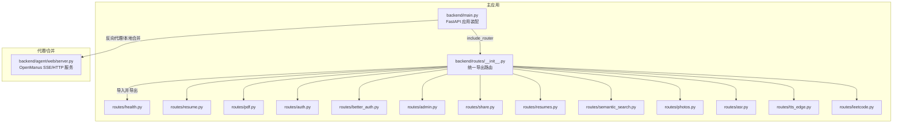
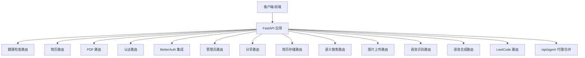
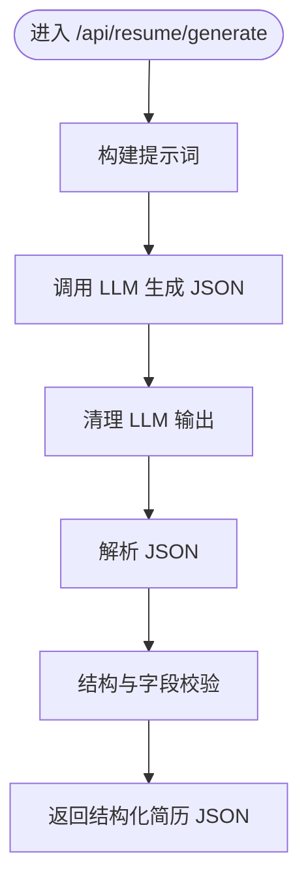
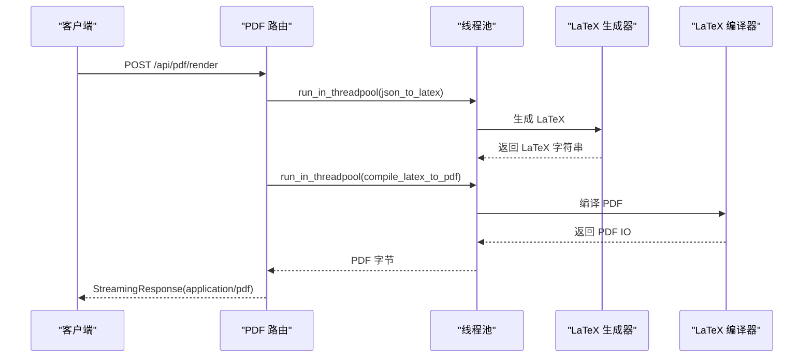
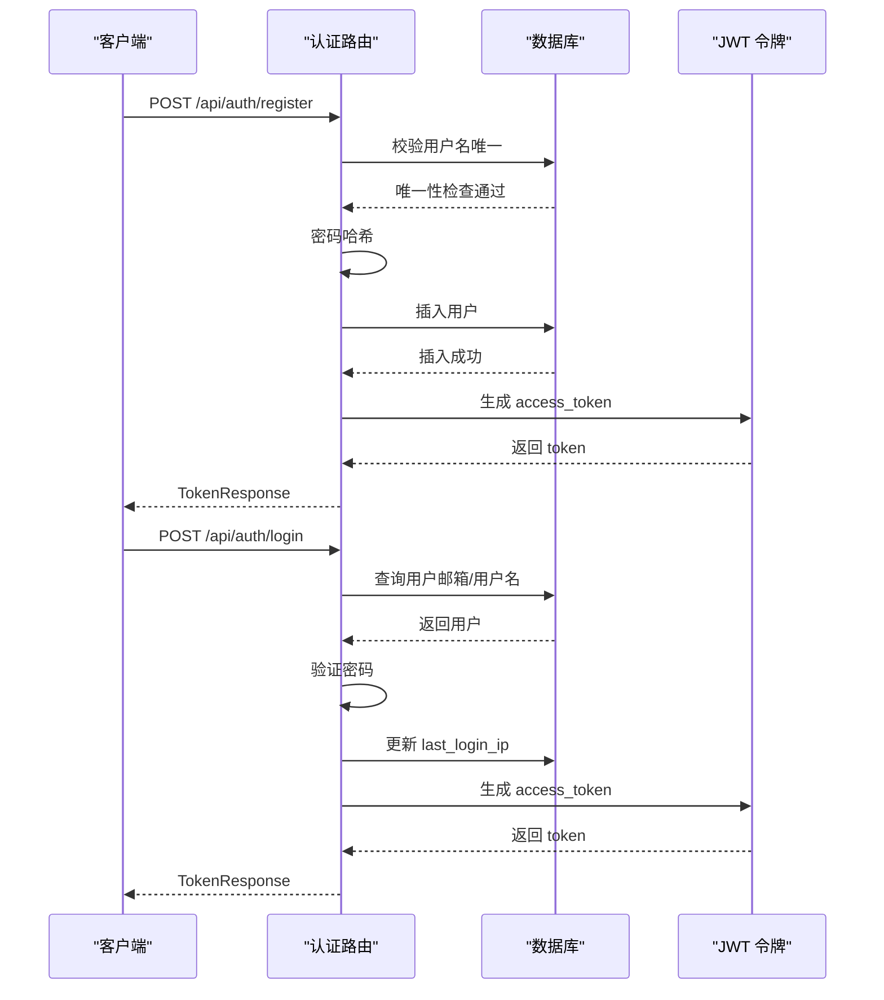
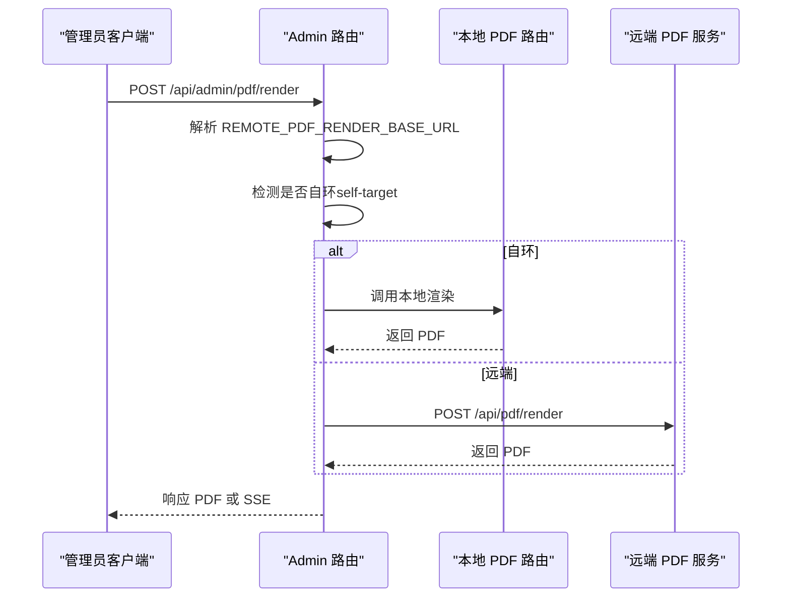
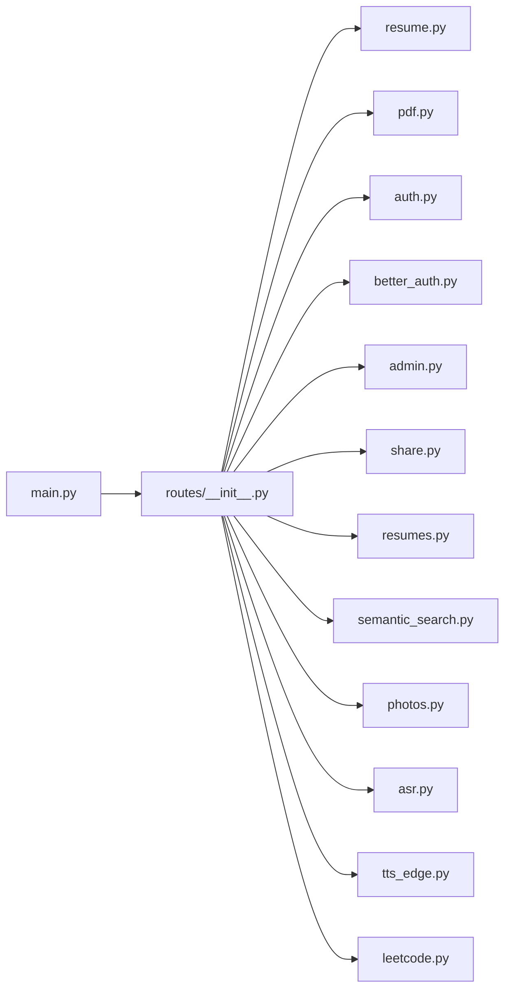

# 路由系统设计

<cite>
**本文档引用的文件**
- [backend/main.py](file://backend/main.py)
- [backend/routes/__init__.py](file://backend/routes/__init__.py)
- [backend/routes/health.py](file://backend/routes/health.py)
- [backend/routes/resume.py](file://backend/routes/resume.py)
- [backend/routes/pdf.py](file://backend/routes/pdf.py)
- [backend/routes/auth.py](file://backend/routes/auth.py)
- [backend/routes/better_auth.py](file://backend/routes/better_auth.py)
- [backend/routes/admin.py](file://backend/routes/admin.py)
- [backend/routes/share.py](file://backend/routes/share.py)
- [backend/routes/resumes.py](file://backend/routes/resumes.py)
- [backend/routes/semantic_search.py](file://backend/routes/semantic_search.py)
- [backend/routes/photos.py](file://backend/routes/photos.py)
- [backend/routes/asr.py](file://backend/routes/asr.py)
- [backend/routes/tts_edge.py](file://backend/routes/tts_edge.py)
- [backend/routes/leetcode.py](file://backend/routes/leetcode.py)
- [backend/agent/web/server.py](file://backend/agent/web/server.py)
</cite>

## 目录
1. [简介](#简介)
2. [项目结构](#项目结构)
3. [核心组件](#核心组件)
4. [架构总览](#架构总览)
5. [详细组件分析](#详细组件分析)
6. [依赖关系分析](#依赖关系分析)
7. [性能考虑](#性能考虑)
8. [故障排除指南](#故障排除指南)
9. [结论](#结论)
10. [附录](#附录)

## 简介
本文件系统性梳理 ResumeAgent 项目的路由体系设计，涵盖健康检查、简历处理、PDF 生成、认证、管理员、分享、语义搜索、语音识别与合成、图片上传、LeetCode 练习等模块。文档从模块组织、命名规范、URL 模式设计、参数处理、请求验证、响应格式标准化等方面进行深入分析，并提供扩展指南、最佳实践与常见问题解决方案，帮助开发者高效添加新的路由模块与 API 端点。

## 项目结构
路由系统采用“模块化路由 + 主应用装配”的架构：
- 路由模块集中于 backend/routes，每个功能域独立为一个 Python 文件，统一导出于 backend/routes/__init__.py
- 主应用 backend/main.py 动态导入路由模块并注册，同时支持条件注册（如 TTS 路由）
- 代理与合并：主应用支持将 /api/agent/** 反向代理至外部 Agent 后端，或在本地加载 OpenManus 路由
- 前端集成：OpenManus 侧单独提供 SSE+HTTP 的 Web 服务，与主 FastAPI 互补

**图表来源**
- [backend/main.py:106-138](file://backend/main.py#L106-L138)
- [backend/routes/__init__.py:1-57](file://backend/routes/__init__.py#L1-57)
- [backend/agent/web/server.py:28-55](file://backend/agent/web/server.py#L28-L55)

**章节来源**
- [backend/main.py:73-138](file://backend/main.py#L73-L138)
- [backend/routes/__init__.py:1-57](file://backend/routes/__init__.py#L1-L57)

## 核心组件
- 健康检查：/api/health
- 简历处理：/api/resume/*（生成、改写意图检测、语法检查、JD 优化、翻译、体检等）
- PDF 渲染：/api/pdf/*（直渲染、流式渲染、LaTeX 编译、配额控制）
- 认证：/api/auth/*（注册、登录、个人信息）、/api/auth/better/*（BetterAuth 集成）
- 管理员：/api/admin/pdf/*（远程/本地 PDF 渲染代理）
- 分享：/api/resume/share/*（分享链接生成、查看、删除、列举）
- 简历存储：/api/resumes/*（CRUD、同步）
- 语义搜索：/api/search/*（语义检索、嵌入生成、状态查询）
- 图片上传：/api/photos/upload（COS 上传）
- 语音识别：/api/asr/*（识别、WebSocket 流式）
- 语音合成：/api/tts/*（Edge TTS 合成、声音列表、健康检查）
- LeetCode：/api/leetcode/*（题目、草稿、提交、运行）

**章节来源**
- [backend/routes/health.py:1-13](file://backend/routes/health.py#L1-L13)
- [backend/routes/resume.py:1-800](file://backend/routes/resume.py#L1-L800)
- [backend/routes/pdf.py:1-380](file://backend/routes/pdf.py#L1-L380)
- [backend/routes/auth.py:1-233](file://backend/routes/auth.py#L1-L233)
- [backend/routes/better_auth.py:1-90](file://backend/routes/better_auth.py#L1-L90)
- [backend/routes/admin.py:1-259](file://backend/routes/admin.py#L1-L259)
- [backend/routes/share.py:1-135](file://backend/routes/share.py#L1-L135)
- [backend/routes/resumes.py:1-262](file://backend/routes/resumes.py#L1-L262)
- [backend/routes/semantic_search.py:1-142](file://backend/routes/semantic_search.py#L1-L142)
- [backend/routes/photos.py:1-102](file://backend/routes/photos.py#L1-L102)
- [backend/routes/asr.py:1-193](file://backend/routes/asr.py#L1-L193)
- [backend/routes/tts_edge.py:1-115](file://backend/routes/tts_edge.py#L1-L115)
- [backend/routes/leetcode.py:1-119](file://backend/routes/leetcode.py#L1-L119)

## 架构总览
路由系统遵循以下设计原则：
- 前缀与命名：各模块统一使用 /api 前缀，按功能域细分子路径（如 /api/resume、/api/pdf 等）
- 标签与可发现性：每个 APIRouter 设置 tags，便于文档生成与调试
- 参数与验证：Pydantic BaseModel 作为请求/响应模型，内置字段校验与默认值
- 依赖注入：通过 Depends 获取数据库会话、当前用户、可选用户等
- 错误处理：统一使用 HTTPException 抛出标准错误码与消息
- 响应格式：除流式/二进制外，统一返回 JSON 结构，便于前端消费
- 安全：认证中间件与权限装饰器（require_admin_only、require_admin_or_member）贯穿关键路由
- 扩展性：TTS 路由按可用性条件注册，支持可选依赖

**图表来源**
- [backend/main.py:106-138](file://backend/main.py#L106-L138)
- [backend/routes/__init__.py:1-57](file://backend/routes/__init__.py#L1-L57)

## 详细组件分析

### 健康检查路由
- 路径：/api/health
- 功能：返回服务健康状态
- 设计要点：最小实现，便于探活与监控

**章节来源**
- [backend/routes/health.py:1-13](file://backend/routes/health.py#L1-L13)

### 简历处理路由（/api/resume）
- 路径族：
  - /api/resume/rewrite-text/intent：基于规则与 LLM 的改写意图检测
  - /api/resume/grammar-check：单字段语法/表达体检
  - /api/resume/jd-optimize：基于 JD 的多字段优化建议
  - /api/resume/jd-keyword-integrate：将缺失关键词自然融入最相关字段
  - /api/resume/translate：多字段翻译（并发）
  - /api/resume/health-check：通用简历体检
  - /api/resume/generate：一句话生成结构化简历 JSON
- 参数与验证：Pydantic 模型定义请求体字段、默认值与校验
- 处理逻辑：
  - 文本清洗与 JSON 解析（去除代码块标记、提取 JSON 片段）
  - LLM 调用与结果校验（确保 original 在原文中逐字出现，避免伪造）
  - 并发翻译（信号量限流 + 线程池）
- 响应格式：结构化 JSON，包含评分、建议、摘要等

**图表来源**
- [backend/routes/resume.py:795-800](file://backend/routes/resume.py#L795-L800)

**章节来源**
- [backend/routes/resume.py:252-297](file://backend/routes/resume.py#L252-L297)
- [backend/routes/resume.py:362-419](file://backend/routes/resume.py#L362-L419)
- [backend/routes/resume.py:551-612](file://backend/routes/resume.py#L551-L612)
- [backend/routes/resume.py:638-682](file://backend/routes/resume.py#L638-L682)
- [backend/routes/resume.py:685-723](file://backend/routes/resume.py#L685-L723)
- [backend/routes/resume.py:726-792](file://backend/routes/resume.py#L726-L792)
- [backend/routes/resume.py:795-800](file://backend/routes/resume.py#L795-L800)

### PDF 渲染路由（/api/pdf）
- 路径族：
  - /api/pdf/quota：查询配额
  - /api/pdf/downloads/record：记录下载（预览不扣配额）
  - /api/pdf/render：直渲染 PDF（StreamingResponse）
  - /api/pdf/render/stream：流式渲染（SSE）
  - /api/pdf/compile-latex：编译 LaTeX 源码
  - /api/pdf/compile-latex/stream：流式编译 LaTeX
- 参数与验证：RenderPDFRequest、CompileLatexRequest
- 处理逻辑：
  - LaTeX 生成与编译分离，异步线程池执行
  - 流式渲染通过 SSE 事件推送进度与最终 PDF
  - 配额控制与审计日志（trace headers）
- 响应格式：二进制 PDF 或 SSE 事件流

**图表来源**
- [backend/routes/pdf.py:125-180](file://backend/routes/pdf.py#L125-L180)
- [backend/routes/pdf.py:187-299](file://backend/routes/pdf.py#L187-L299)

**章节来源**
- [backend/routes/pdf.py:76-123](file://backend/routes/pdf.py#L76-L123)
- [backend/routes/pdf.py:125-180](file://backend/routes/pdf.py#L125-L180)
- [backend/routes/pdf.py:187-299](file://backend/routes/pdf.py#L187-L299)
- [backend/routes/pdf.py:302-380](file://backend/routes/pdf.py#L302-L380)

### 认证路由（/api/auth 与 /api/auth/better）
- /api/auth/*：
  - /api/auth/register：注册（用户名/密码校验、哈希、入库、签发 token）
  - /api/auth/login：登录（双索引查询、密码校验、IP 记录、签发 token）
  - /api/auth/me：获取当前用户信息
- /api/auth/better/*：
  - /api/auth/better/health：健康检查（内部 BetterAuth 地址、配额表状态）
  - /api/auth/better/me：当前 BetterAuth 用户
  - /api/auth/better/account：账户与配额信息
- 安全与合规：
  - 密码哈希与盐值
  - 数据库重试与回滚
  - 权限装饰器（require_admin_only、require_admin_or_member）

**图表来源**
- [backend/routes/auth.py:46-137](file://backend/routes/auth.py#L46-L137)
- [backend/routes/auth.py:149-226](file://backend/routes/auth.py#L149-L226)

**章节来源**
- [backend/routes/auth.py:46-137](file://backend/routes/auth.py#L46-L137)
- [backend/routes/auth.py:149-226](file://backend/routes/auth.py#L149-L226)
- [backend/routes/better_auth.py:44-89](file://backend/routes/better_auth.py#L44-L89)

### 管理员路由（/api/admin/pdf）
- 路径族：
  - /api/admin/pdf/render：远程/本地 PDF 渲染代理
  - /api/admin/pdf/render/stream：远程/本地流式渲染代理
  - /api/admin/pdf/render-mode/log：记录渲染模式变更日志
- 设计要点：
  - 自检：若目标与本地端口一致，直接调用本地 PDF 路由
  - 代理：透传 Authorization、trace headers，转发至远端 /api/pdf/*
  - 包装：远端流式渲染在本地包装为 SSE 事件流
  - 权限：仅管理员可用

**图表来源**
- [backend/routes/admin.py:217-259](file://backend/routes/admin.py#L217-L259)
- [backend/routes/admin.py:102-119](file://backend/routes/admin.py#L102-L119)
- [backend/routes/admin.py:121-214](file://backend/routes/admin.py#L121-L214)

**章节来源**
- [backend/routes/admin.py:41-56](file://backend/routes/admin.py#L41-L56)
- [backend/routes/admin.py:217-259](file://backend/routes/admin.py#L217-L259)

### 分享路由（/api/resume/share）
- 路径族：
  - /api/resume/share：生成分享链接（UUID、过期时间、内存存储）
  - /api/resume/share/{share_id}：获取分享简历
  - /api/resume/share/{share_id} DELETE：删除分享链接
  - /api/resume/shares：列举所有分享链接
- 设计要点：
  - 内存存储（生产建议替换为数据库/Redis）
  - 前端 URL 动态配置（FRONTEND_URL）
  - 过期检查与访问计数

**章节来源**
- [backend/routes/share.py:39-104](file://backend/routes/share.py#L39-L104)
- [backend/routes/share.py:107-135](file://backend/routes/share.py#L107-L135)

### 简历存储路由（/api/resumes）
- 路径族：
  - /api/resumes：获取当前用户所有简历（分页排序）
  - /api/resumes/{resume_id}：获取/更新/删除单个简历
  - /api/resumes：创建简历（支持模板类型）
  - /api/resumes/sync：同步简历（localStorage ↔ 数据库）
- 设计要点：
  - 模板类型提取与同步（templateType）
  - 删除时级联清理向量嵌入
  - 同步策略：合并本地与数据库差异

**章节来源**
- [backend/routes/resumes.py:52-73](file://backend/routes/resumes.py#L52-L73)
- [backend/routes/resumes.py:76-95](file://backend/routes/resumes.py#L76-L95)
- [backend/routes/resumes.py:98-132](file://backend/routes/resumes.py#L98-L132)
- [backend/routes/resumes.py:135-195](file://backend/routes/resumes.py#L135-L195)
- [backend/routes/resumes.py:198-231](file://backend/routes/resumes.py#L198-L231)
- [backend/routes/resumes.py:234-261](file://backend/routes/resumes.py#L234-L261)

### 语义搜索路由（/api/search）
- 路径族：
  - /api/search/semantic：语义搜索（向量相似度）
  - /api/search/embeddings/generate/{resume_id}：为简历生成嵌入
  - /api/search/embeddings/status/{resume_id}：查询嵌入状态
- 设计要点：
  - 基于 EmbeddingService 与数据库 pgvector
  - 限制内容类型与返回数量
  - 生成嵌入产生 API 费用

**章节来源**
- [backend/routes/semantic_search.py:33-69](file://backend/routes/semantic_search.py#L33-L69)
- [backend/routes/semantic_search.py:72-101](file://backend/routes/semantic_search.py#L72-L101)
- [backend/routes/semantic_search.py:104-141](file://backend/routes/semantic_search.py#L104-L141)

### 图片上传路由（/api/photos）
- 路径：/api/photos/upload
- 功能：登录用户上传照片至 COS（png/jpg/jpeg/webp，≤2MB）
- 设计要点：
  - 用户名安全化处理
  - COS 凭证校验与错误处理
  - 返回可访问 URL 与 Key

**章节来源**
- [backend/routes/photos.py:33-96](file://backend/routes/photos.py#L33-L96)

### 语音识别路由（/api/asr）
- 路径族：
  - /api/asr/recognize：上传音频识别（wav/mp3/opus/ogg）
  - /api/asr/ws/stream：WebSocket 流式识别（示意）
  - /api/asr/health：健康检查
- 设计要点：
  - Vosk API 调用（免费层）
  - 文件大小限制与格式校验
  - WebSocket 流式处理（示例）

**章节来源**
- [backend/routes/asr.py:33-114](file://backend/routes/asr.py#L33-L114)
- [backend/routes/asr.py:123-183](file://backend/routes/asr.py#L123-L183)
- [backend/routes/asr.py:185-193](file://backend/routes/asr.py#L185-L193)

### 语音合成路由（/api/tts）
- 路径族：
  - /api/tts/synthesize：文本转语音（Edge TTS）
  - /api/tts/voices：获取可用声音列表
  - /api/tts/health：健康检查
- 设计要点：
  - 支持 mp3/wav 输出
  - 流式返回音频
  - 语音参数（语速、音量、音色）

**章节来源**
- [backend/routes/tts_edge.py:38-77](file://backend/routes/tts_edge.py#L38-L77)
- [backend/routes/tts_edge.py:90-99](file://backend/routes/tts_edge.py#L90-L99)
- [backend/routes/tts_edge.py:102-114](file://backend/routes/tts_edge.py#L102-L114)

### LeetCode 路由（/api/leetcode）
- 路径族：
  - /api/leetcode/problems：列举/增删改查题目
  - /api/leetcode/drafts/{slug}：草稿 CRUD
  - /api/leetcode/solutions/{slug}：题解 CRUD
  - /api/leetcode/submissions：提交记录
  - /api/leetcode/run：运行代码（含用例）
  - /api/leetcode/submit：提交代码
- 设计要点：
  - 本地文件存储（LeetCodeStore）
  - LeetCodeRunner 执行代码与测试
  - 响应头携带 X-LeetCode-ProgramRun 便于区分进程

**章节来源**
- [backend/routes/leetcode.py:34-118](file://backend/routes/leetcode.py#L34-L118)

## 依赖关系分析
- 模块耦合：
  - backend/main.py 通过 routes/__init__.py 统一导入与注册，降低耦合
  - PDF 路由依赖 latex_generator/latex_compiler 与数据库、配额服务
  - 认证路由依赖数据库与 JWT 令牌生成
  - 管理员路由依赖远端 PDF 服务与本地 PDF 路由
- 外部依赖：
  - TTS 路由按可用性条件注册（edge-tts/coqui-tts）
  - ASR 路由依赖 Vosk API
  - 语义搜索依赖 OpenAI API 与 pgvector
  - 图片上传依赖 COS SDK

**图表来源**
- [backend/main.py:73-138](file://backend/main.py#L73-L138)
- [backend/routes/__init__.py:1-57](file://backend/routes/__init__.py#L1-L57)

**章节来源**
- [backend/main.py:73-138](file://backend/main.py#L73-L138)
- [backend/routes/__init__.py:1-57](file://backend/routes/__init__.py#L1-L57)

## 性能考虑
- 线程池与并发：
  - PDF 渲染与 LaTeX 编译使用 run_in_threadpool，避免阻塞事件循环
  - 翻译采用信号量限并发，保证稳定性
- 流式传输：
  - PDF 流式渲染与 LaTeX 编译均使用 SSE，提升用户体验
- 启动优化：
  - 连接预热（HTTP/TikToken），数据库连接预热，Logo 自动同步
- 日志与可观测性：
  - 通过 Observability 中间件与 trace headers 记录渲染链路

[本节为通用指导，无需特定文件引用]

## 故障排除指南
- 认证失败：
  - 注册：检查用户名/密码长度、唯一性、数据库错误
  - 登录：确认账号形态（用户名/邮箱）、数据库连接、密码校验
- PDF 渲染失败：
  - 检查 LaTeX 生成与编译日志，确认模板目录与依赖
  - 查看配额与审计头（X-PDF-Trace-Id）
- 管理员代理：
  - 确认 REMOTE_PDF_RENDER_BASE_URL 与 TOKEN 配置
  - 检查自环判定与远端服务可达性
- 语义搜索：
  - 确认 OpenAI API Key 与 pgvector 可用
- 图片上传：
  - 检查 COS 凭证、桶与区域配置
- ASR/TTS：
  - 确认第三方服务可用性与网络连通

**章节来源**
- [backend/routes/auth.py:46-137](file://backend/routes/auth.py#L46-L137)
- [backend/routes/auth.py:149-226](file://backend/routes/auth.py#L149-L226)
- [backend/routes/pdf.py:125-180](file://backend/routes/pdf.py#L125-L180)
- [backend/routes/admin.py:59-65](file://backend/routes/admin.py#L59-L65)
- [backend/routes/admin.py:121-214](file://backend/routes/admin.py#L121-L214)
- [backend/routes/semantic_search.py:33-69](file://backend/routes/semantic_search.py#L33-L69)
- [backend/routes/photos.py:60-101](file://backend/routes/photos.py#L60-L101)
- [backend/routes/asr.py:83-113](file://backend/routes/asr.py#L83-L113)
- [backend/routes/tts_edge.py:79-87](file://backend/routes/tts_edge.py#L79-L87)

## 结论
该路由系统以模块化为核心，通过统一前缀与标签、严格的参数与响应模型、完善的错误处理与安全机制，实现了从健康检查到复杂业务（简历、PDF、认证、搜索、多媒体）的全栈 API 能力。主应用的动态装配与条件注册提升了可扩展性，代理与合并机制满足了多后端协同需求。建议在新增模块时遵循本文档的命名、参数、验证与响应规范，确保一致性与可维护性。

[本节为总结，无需特定文件引用]

## 附录

### 路由模块组织与命名规范
- 模块命名：小写，按功能域命名（如 resume.py、pdf.py、auth.py）
- 路由前缀：统一使用 /api，子路径按领域细分（/api/resume、/api/pdf 等）
- 标签：每个 APIRouter 设置 tags，便于文档与调试
- 导出：在 routes/__init__.py 中统一导入并导出

**章节来源**
- [backend/routes/__init__.py:1-57](file://backend/routes/__init__.py#L1-L57)

### URL 模式设计
- 常见模式：
  - 资源类：/api/{resource}（GET 列表）、/api/{resource}/{id}（GET/PUT/DELETE）
  - 操作类：/api/{resource}/{action}（POST 运行、提交等）
  - 流式：/api/{resource}/{action}/stream
  - 健康：/api/{resource}/health

**章节来源**
- [backend/routes/resume.py:795-800](file://backend/routes/resume.py#L795-L800)
- [backend/routes/pdf.py:187-299](file://backend/routes/pdf.py#L187-L299)
- [backend/routes/asr.py:185-193](file://backend/routes/asr.py#L185-L193)
- [backend/routes/tts_edge.py:102-114](file://backend/routes/tts_edge.py#L102-L114)

### 路由参数处理与请求验证
- 使用 Pydantic BaseModel 定义请求体，内置字段校验、默认值与序列化
- 通过 Depends 注入数据库会话与当前用户
- 对敏感操作使用 require_admin_* 权限装饰器

**章节来源**
- [backend/routes/resume.py:98-134](file://backend/routes/resume.py#L98-L134)
- [backend/routes/pdf.py:71-74](file://backend/routes/pdf.py#L71-L74)
- [backend/routes/admin.py:19-21](file://backend/routes/admin.py#L19-L21)

### 响应格式标准化
- JSON 响应为主，包含 success/message/status 等字段
- 流式响应使用 SSE（EventSourceResponse），事件类型包括 start/progress/pdf/error
- 二进制响应（PDF/音频）设置正确 Content-Type 与头部

**章节来源**
- [backend/routes/pdf.py:169-180](file://backend/routes/pdf.py#L169-L180)
- [backend/routes/pdf.py:218-299](file://backend/routes/pdf.py#L218-L299)
- [backend/routes/tts_edge.py:69-77](file://backend/routes/tts_edge.py#L69-L77)

### 路由扩展指南
- 新增模块步骤：
  1) 在 backend/routes 下创建 {module}.py，定义 APIRouter 与路由函数
  2) 在 backend/routes/__init__.py 中导入并导出 router
  3) 在 backend/main.py 中 include_router 注册（如需条件注册，参考 TTS 路由）
  4) 如需代理/合并，参考 /api/agent 的实现
- 最佳实践：
  - 使用 BaseModel 定义请求/响应
  - 明确权限与依赖注入
  - 统一错误处理与日志记录
  - 对耗时操作使用线程池或异步流式

**章节来源**
- [backend/routes/__init__.py:21-36](file://backend/routes/__init__.py#L21-L36)
- [backend/main.py:106-138](file://backend/main.py#L106-L138)
- [backend/agent/web/server.py:54-55](file://backend/agent/web/server.py#L54-L55)