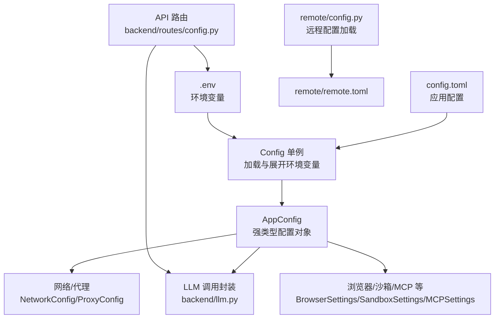
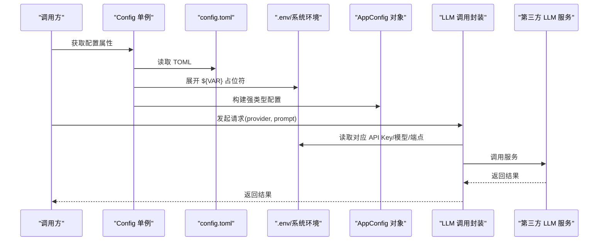
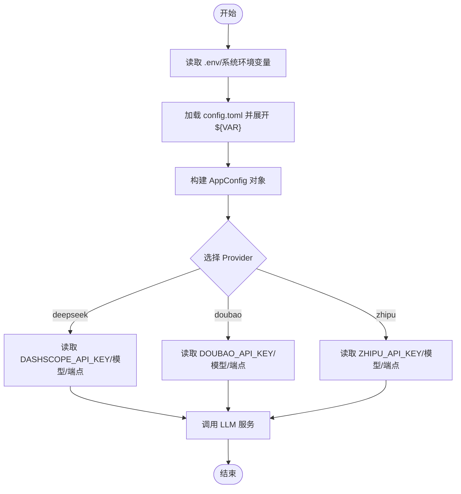
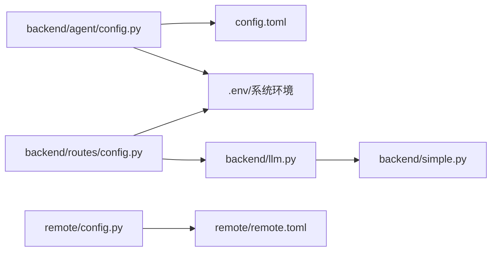

# 配置管理

<cite>
**本文引用的文件**
- [config.toml](file://config.toml)
- [backend/agent/config.py](file://backend/agent/config.py)
- [backend/routes/config.py](file://backend/routes/config.py)
- [backend/llm.py](file://backend/llm.py)
- [backend/simple.py](file://backend/simple.py)
- [remote/config.py](file://remote/config.py)
- [remote/remote.toml](file://remote/remote.toml)
- [auth-stack.env.example](file://auth-stack.env.example)
</cite>

## 目录
1. [简介](#简介)
2. [项目结构](#项目结构)
3. [核心组件](#核心组件)
4. [架构总览](#架构总览)
5. [详细组件分析](#详细组件分析)
6. [依赖关系分析](#依赖关系分析)
7. [性能考量](#性能考量)
8. [故障排查指南](#故障排查指南)
9. [结论](#结论)
10. [附录](#附录)

## 简介
本文件系统化阐述 ResumeAgent 的配置管理体系，覆盖以下主题：
- 配置文件层次与环境变量优先级
- 默认值设定与分组配置
- LLM API 密钥管理与服务端点配置
- 功能开关与网络代理控制
- 配置验证机制与动态更新策略
- 敏感信息保护与部署安全建议
- 新增配置项与修改现有配置的操作流程

## 项目结构
配置相关的关键位置与职责如下：
- 应用层配置文件：项目根目录的 TOML 配置文件，定义 LLM、网络、浏览器、沙箱、MCP 等模块的默认与覆盖参数。
- 运行时配置加载器：Python 单例类负责加载 TOML、展开环境变量占位符、构建强类型配置对象。
- API 路由：提供密钥状态查询、保存密钥、密钥可用性测试等接口。
- LLM 调用封装：根据 provider 与环境变量选择具体供应商与模型。
- 远程配置：独立的远程连接配置（非应用主配置），用于远端运维场景。

图表来源
- [config.toml](file://config.toml)
- [backend/agent/config.py](file://backend/agent/config.py)
- [backend/routes/config.py](file://backend/routes/config.py)
- [backend/llm.py](file://backend/llm.py)
- [remote/config.py](file://remote/config.py)
- [remote/remote.toml](file://remote/remote.toml)

章节来源
- [config.toml](file://config.toml)
- [backend/agent/config.py](file://backend/agent/config.py)
- [backend/routes/config.py](file://backend/routes/config.py)
- [backend/llm.py](file://backend/llm.py)
- [remote/config.py](file://remote/config.py)
- [remote/remote.toml](file://remote/remote.toml)

## 核心组件
- 配置文件层次
  - 顶层 TOML：集中声明 LLM、网络、浏览器、沙箱、MCP、上下文持久化等配置段。
  - 环境变量：通过 TOML 中的 ${VAR} 占位符在加载时展开；同时支持直接从 .env 与系统环境读取。
- 配置加载器
  - 单例 Config 类负责：
    - 定位 config.toml 并加载
    - 递归展开 ${VAR} 环境变量占位符
    - 构建 AppConfig 强类型对象，按需合并默认与覆盖配置
    - 应用网络代理设置到进程环境变量
- API 路由
  - 提供密钥状态查询、保存密钥、密钥可用性测试、通用聊天等接口，支持即时生效与运行时校验。
- LLM 调用封装
  - 基于 provider 与环境变量选择具体供应商与模型，统一返回格式，支持流式输出。
- 远程配置
  - 用于远端运维场景的独立配置模块，与应用主配置解耦。

章节来源
- [backend/agent/config.py](file://backend/agent/config.py)
- [backend/routes/config.py](file://backend/routes/config.py)
- [backend/llm.py](file://backend/llm.py)
- [remote/config.py](file://remote/config.py)

## 架构总览
下图展示配置从文件到运行时对象再到调用链的整体流转：

图表来源
- [backend/agent/config.py](file://backend/agent/config.py)
- [config.toml](file://config.toml)
- [backend/llm.py](file://backend/llm.py)

## 详细组件分析

### 配置文件层次与环境变量优先级
- 文件定位与加载
  - 优先在项目根目录查找 config.toml；若不存在则抛出异常。
  - 加载后递归展开 ${VAR} 形式的环境变量占位符，未匹配到的占位符保持原样。
- 环境变量来源与优先级
  - 顶层 .env 与系统环境变量共同参与展开与运行时读取。
  - 运行时读取顺序：系统环境变量 > .env 文件（若已加载）。
- 默认值与覆盖
  - LLM 配置支持“基础段”与“命名覆盖段”，最终形成多模型配置映射。
  - 网络配置优先使用 network 段，兼容旧版 proxy 段但标记为弃用。

章节来源
- [backend/agent/config.py](file://backend/agent/config.py)
- [config.toml](file://config.toml)

### LLM API 密钥管理与服务端点配置
- 密钥来源
  - TOML 中以 ${VAR} 占位符引用环境变量；运行时由 LLM 调用封装读取对应 PROVIDER 的 API Key。
  - 支持通过 API 路由将密钥写入 .env 并即时刷新相关客户端实例。
- 服务端点与模型
  - TOML 中可配置 base_url、model、temperature、max_tokens 等；运行时可按需覆盖。
  - 支持多提供商（deepseek、doubao、zhipu），默认提供商可在封装中配置。
- 密钥可用性测试
  - 提供测试接口，对已配置的密钥发起最小调用以验证连通性与有效性。

图表来源
- [backend/agent/config.py](file://backend/agent/config.py)
- [backend/llm.py](file://backend/llm.py)
- [backend/routes/config.py](file://backend/routes/config.py)

章节来源
- [backend/llm.py](file://backend/llm.py)
- [backend/routes/config.py](file://backend/routes/config.py)
- [config.toml](file://config.toml)

### 功能开关与网络代理控制
- 功能开关
  - run_flow_config：启用数据分析师代理等运行流功能。
  - enable_session_persistence：启用会话状态持久化。
- 网络与代理
  - NetworkConfig：统一代理开关、HTTP/HTTPS/NO_PROXY 设置、tiktoken 下载时的代理豁免、代理初始化重试策略。
  - 旧版 ProxyConfig：仍可加载但标记弃用，加载后立即应用到进程环境变量。
- 浏览器与沙箱
  - BrowserSettings：无头模式、安全选项、额外 Chromium 参数、CDP/WSS 连接、代理等。
  - SandboxSettings：容器镜像、工作目录、资源限制、超时、网络开关等。

章节来源
- [backend/agent/config.py](file://backend/agent/config.py)
- [config.toml](file://config.toml)

### 配置验证机制与动态更新
- 验证机制
  - LLM 调用封装在发起请求前检查必要密钥是否存在，缺失时返回明确错误。
  - API 路由提供密钥可用性测试接口，逐个验证各提供商密钥。
- 动态更新
  - 通过 API 路由保存密钥到 .env，并在成功后重新加载 .env，同时刷新相关客户端实例。
  - 运行时读取环境变量，无需重启即可生效（如模型、端点等）。

章节来源
- [backend/routes/config.py](file://backend/routes/config.py)
- [backend/llm.py](file://backend/llm.py)

### 敏感信息保护
- 密钥存储
  - 通过 .env 文件集中管理，API 路由提供保存接口，避免硬编码在代码中。
- 显示策略
  - 密钥状态接口仅返回“是否已配置”和有限前缀预览，不暴露完整密钥。
- 环境隔离
  - 支持多环境（开发/生产）使用不同的 .env 文件与系统环境变量，结合 CI/CD 注入。

章节来源
- [backend/routes/config.py](file://backend/routes/config.py)

### 不同环境的配置策略与部署最佳实践
- 开发环境
  - 使用本地 .env，开启日志级别与调试模式，必要时关闭代理或配置本地代理。
- 测试/预发布环境
  - 使用独立 .env，启用最小调用测试，确保密钥与端点正确。
- 生产环境
  - 通过平台注入系统环境变量，禁用不必要的日志与调试，严格控制 .env 内容与权限。
- 安全建议
  - 不提交 .env 至版本库；使用 CI/CD 的机密变量管理密钥。
  - 限制密钥权限范围，定期轮换；对敏感字段进行最小化暴露。

章节来源
- [auth-stack.env.example](file://auth-stack.env.example)
- [backend/routes/config.py](file://backend/routes/config.py)

### 如何添加新的配置项与修改现有配置
- 添加新配置项（以 LLM 新模型为例）
  - 在 config.toml 中新增 llm 段落或覆盖段，填写所需字段（如 model/base_url/api_key 等）。
  - 在 LLM 调用封装中增加对该 provider 的分支逻辑，读取相应环境变量或 TOML 字段。
  - 若涉及网络/代理行为差异，可在 NetworkConfig/BrowserSettings 中补充相关字段。
- 修改现有配置
  - 直接编辑 config.toml 中对应段落；如需从 .env 注入，更新 .env 并通过 API 路由保存或重启服务。
  - 若涉及强类型字段变更，需同步更新 backend/agent/config.py 中对应的 Pydantic 模型定义。

章节来源
- [config.toml](file://config.toml)
- [backend/agent/config.py](file://backend/agent/config.py)
- [backend/llm.py](file://backend/llm.py)

## 依赖关系分析
- 配置加载依赖
  - backend/agent/config.py 依赖 toml 解析库与 dotenv（可选），并依赖项目根路径定位 config.toml。
- 调用链依赖
  - backend/llm.py 依赖 backend/simple.py 提供的具体供应商实现，并读取环境变量。
- API 路由依赖
  - backend/routes/config.py 依赖 .env 加载（可选）、LLM 调用封装与认证中间件。

图表来源
- [backend/agent/config.py](file://backend/agent/config.py)
- [backend/llm.py](file://backend/llm.py)
- [backend/routes/config.py](file://backend/routes/config.py)
- [remote/config.py](file://remote/config.py)

章节来源
- [backend/agent/config.py](file://backend/agent/config.py)
- [backend/llm.py](file://backend/llm.py)
- [backend/routes/config.py](file://backend/routes/config.py)
- [remote/config.py](file://remote/config.py)

## 性能考量
- HTTP 客户端优化
  - 优先使用支持 HTTP/2 与 DNS 预解析的高性能客户端；若不可用则回退至 requests 并启用连接池与重试。
- 代理与直连策略
  - NetworkConfig 提供代理豁免策略（如 tiktoken 下载），避免代理导致的连接失败与性能下降。
- 初始化重试
  - 网络配置包含代理初始化的重试次数与退避策略，降低启动阶段的失败概率。

章节来源
- [backend/simple.py](file://backend/simple.py)
- [backend/agent/config.py](file://backend/agent/config.py)

## 故障排查指南
- 无法找到配置文件
  - 症状：启动时报错找不到 config.toml。
  - 处理：确认项目根目录存在 config.toml；或在正确路径放置配置文件。
- 环境变量未生效
  - 症状：${VAR} 占位符未被替换或读取不到值。
  - 处理：检查 .env 与系统环境变量是否正确设置；确认加载顺序与覆盖规则。
- 密钥无效或不可用
  - 症状：调用 LLM 返回 400 错误或可用性测试失败。
  - 处理：通过 API 路由保存密钥到 .env 并刷新客户端；使用密钥可用性测试接口逐一验证。
- 代理导致连接失败
  - 症状：tiktoken 下载或初始化失败。
  - 处理：调整 NetworkConfig 的代理豁免策略或关闭代理；检查 NO_PROXY 列表。

章节来源
- [backend/agent/config.py](file://backend/agent/config.py)
- [backend/routes/config.py](file://backend/routes/config.py)
- [backend/llm.py](file://backend/llm.py)

## 结论
本配置体系通过 TOML 文件集中管理、环境变量占位符展开、强类型配置对象与运行时读取相结合，实现了清晰的层次结构与灵活的优先级策略。配合 API 路由提供的密钥管理与可用性测试，能够在不重启服务的情况下完成动态更新与验证。建议在生产环境中严格遵循密钥保护与环境隔离的最佳实践，确保安全与稳定。

## 附录
- 远程配置（独立模块）
  - remote/config.py 提供独立的远程连接配置加载，适用于远端运维场景，与应用主配置解耦。
- 示例环境变量文件
  - auth-stack.env.example 展示了与 Next.js + BetterAuth 集成时所需的环境变量示例。

章节来源
- [remote/config.py](file://remote/config.py)
- [remote/remote.toml](file://remote/remote.toml)
- [auth-stack.env.example](file://auth-stack.env.example)