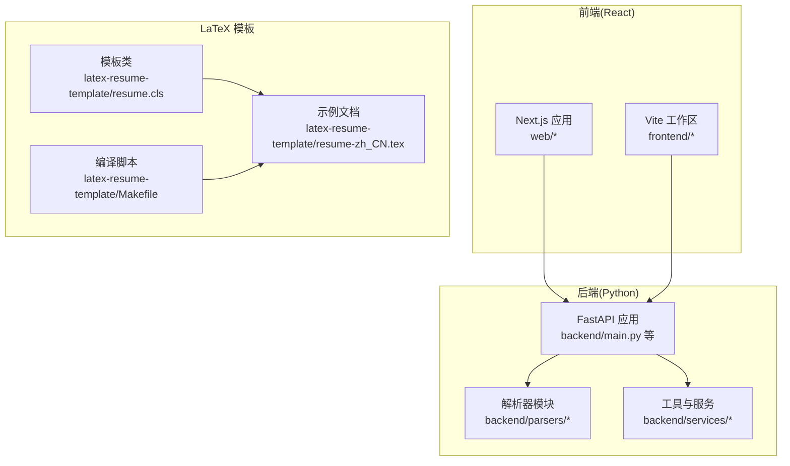
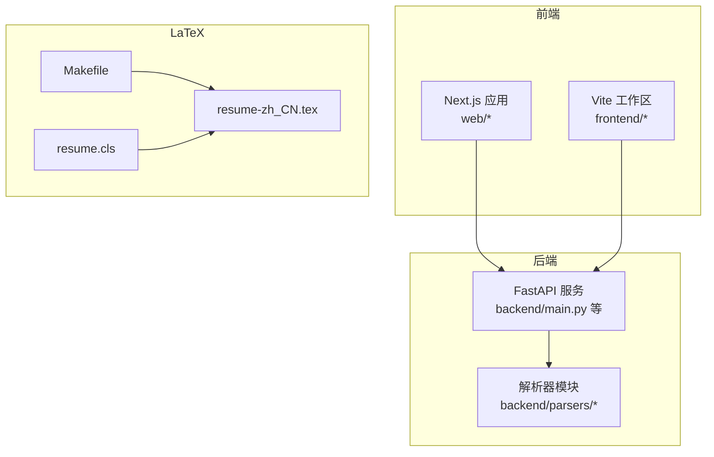
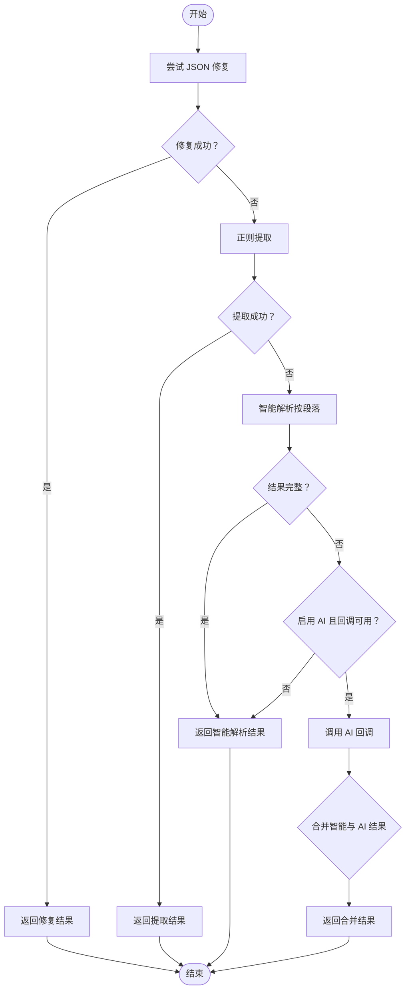
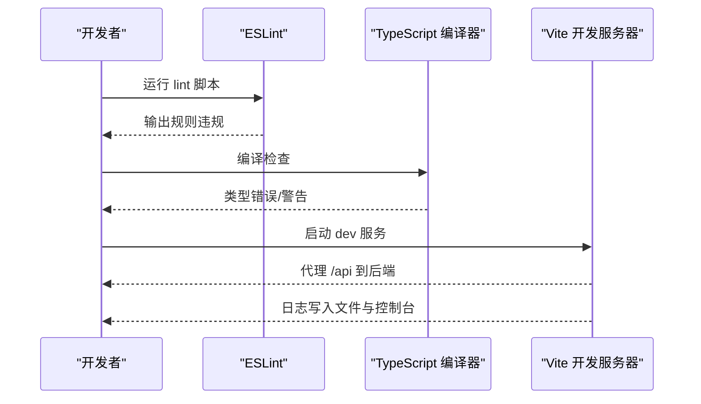
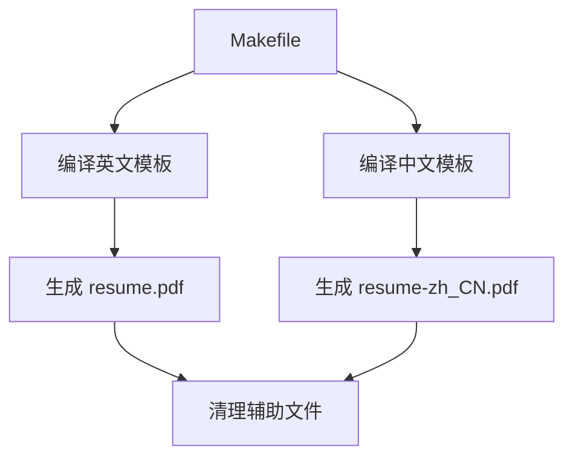
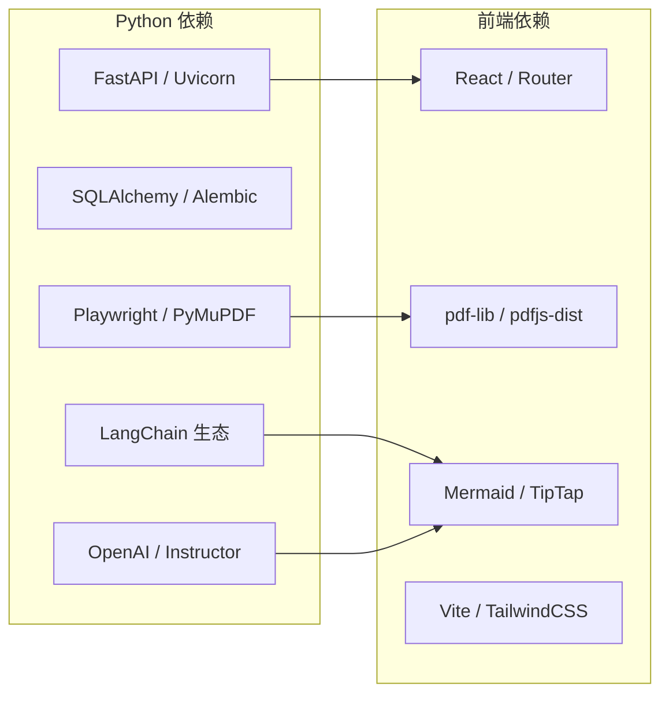

# 代码规范

<cite>
**本文引用的文件**
- [backend/format_helper.py](file://backend/format_helper.py)
- [backend/parsers/__init__.py](file://backend/parsers/__init__.py)
- [frontend/package.json](file://frontend/package.json)
- [frontend/tsconfig.json](file://frontend/tsconfig.json)
- [frontend/vite.config.ts](file://frontend/vite.config.ts)
- [frontend/tailwind.config.js](file://frontend/tailwind.config.js)
- [web/package.json](file://web/package.json)
- [web/tsconfig.json](file://web/tsconfig.json)
- [web/eslint.config.mjs](file://web/eslint.config.mjs)
- [latex-resume-template/Makefile](file://latex-resume-template/Makefile)
- [latex-resume-template/resume.cls](file://latex-resume-template/resume.cls)
- [latex-resume-template/resume-zh_CN.tex](file://latex-resume-template/resume-zh_CN.tex)
- [requirements.txt](file://requirements.txt)
</cite>

## 目录
1. [简介](#简介)
2. [项目结构](#项目结构)
3. [核心组件](#核心组件)
4. [架构总览](#架构总览)
5. [详细组件分析](#详细组件分析)
6. [依赖分析](#依赖分析)
7. [性能考虑](#性能考虑)
8. [故障排查指南](#故障排查指南)
9. [结论](#结论)
10. [附录](#附录)

## 简介
本文件为 ResumeAgent 项目的代码规范文档，覆盖后端 Python、前端 TypeScript/JavaScript、LaTeX 模板三大领域的风格与实践建议。内容基于仓库现有配置与代码文件提炼而来，旨在统一团队开发风格、提升可读性与可维护性，并提供工具化与自动化支持。

## 项目结构
项目采用前后端分离与多子项目的组织方式：
- 后端 Python：FastAPI 应用与工具模块，包含解析器、路由、中间件、服务层等。
- 前端 React/Vite：Next.js 与 Vite 双栈，分别用于 Web 展示与工作区编辑。
- LaTeX 模板：简历模板与编译流程，支持中英文双语。
- 依赖管理：Python 使用 requirements.txt；前端使用 package.json 管理依赖与脚本。

图表来源
- [backend/format_helper.py:1-168](file://backend/format_helper.py#L1-L168)
- [backend/parsers/__init__.py:1-26](file://backend/parsers/__init__.py#L1-L26)
- [latex-resume-template/resume.cls:1-125](file://latex-resume-template/resume.cls#L1-L125)
- [latex-resume-template/resume-zh_CN.tex:1-110](file://latex-resume-template/resume-zh_CN.tex#L1-L110)
- [latex-resume-template/Makefile:1-26](file://latex-resume-template/Makefile#L1-L26)

章节来源
- [backend/format_helper.py:1-168](file://backend/format_helper.py#L1-L168)
- [backend/parsers/__init__.py:1-26](file://backend/parsers/__init__.py#L1-L26)
- [latex-resume-template/resume.cls:1-125](file://latex-resume-template/resume.cls#L1-L125)
- [latex-resume-template/resume-zh_CN.tex:1-110](file://latex-resume-template/resume-zh_CN.tex#L1-L110)
- [latex-resume-template/Makefile:1-26](file://latex-resume-template/Makefile#L1-L26)

## 核心组件
- 后端解析器聚合：将复杂解析逻辑拆分为独立模块，便于维护与扩展。
- 前端构建与代理：Vite 提供开发服务器、代理与日志记录；Tailwind 提供主题与样式。
- Next.js 应用：使用 ESLint Next 规则，配合 TypeScript 严格模式。
- LaTeX 模板：提供简历类与示例文档，支持中英双语与编译流程。

章节来源
- [backend/format_helper.py:1-168](file://backend/format_helper.py#L1-L168)
- [backend/parsers/__init__.py:1-26](file://backend/parsers/__init__.py#L1-L26)
- [frontend/vite.config.ts:1-159](file://frontend/vite.config.ts#L1-L159)
- [frontend/tailwind.config.js:1-129](file://frontend/tailwind.config.js#L1-L129)
- [web/eslint.config.mjs:1-19](file://web/eslint.config.mjs#L1-L19)
- [web/tsconfig.json:1-35](file://web/tsconfig.json#L1-L35)
- [latex-resume-template/resume.cls:1-125](file://latex-resume-template/resume.cls#L1-L125)

## 架构总览
后端以 FastAPI 为核心，解析器模块化，前端通过 Next.js 与 Vite 分别承载 Web 与工作区功能，LaTeX 模板独立编译。

图表来源
- [web/tsconfig.json:1-35](file://web/tsconfig.json#L1-L35)
- [frontend/vite.config.ts:1-159](file://frontend/vite.config.ts#L1-L159)
- [backend/format_helper.py:1-168](file://backend/format_helper.py#L1-L168)
- [latex-resume-template/resume.cls:1-125](file://latex-resume-template/resume.cls#L1-L125)
- [latex-resume-template/resume-zh_CN.tex:1-110](file://latex-resume-template/resume-zh_CN.tex#L1-L110)
- [latex-resume-template/Makefile:1-26](file://latex-resume-template/Makefile#L1-L26)

## 详细组件分析

### 后端 Python 代码风格与规范
- 命名约定
  - 模块与函数：使用下划线命名法，清晰表达意图。
  - 类型提示：广泛使用 typing 模块，明确参数与返回值类型。
  - 导入顺序：标准库 → 第三方库 → 项目内相对导入，保持稳定顺序。
- 注释与文档
  - 模块级文档字符串：简述模块职责与拆分逻辑。
  - 函数级文档字符串：说明输入、输出、异常与策略。
  - 行内注释：解释关键分支与策略选择。
- 错误处理
  - 统一捕获异常并返回结构化错误信息，避免泄露内部细节。
  - 多层降级解析策略：JSON 修复 → 正则提取 → 智能解析 → AI 解析。
- 复杂度与可维护性
  - 将解析逻辑拆分为独立模块，降低单文件复杂度。
  - 明确的解析顺序与状态判断，保证结果完整性。

图表来源
- [backend/format_helper.py:121-168](file://backend/format_helper.py#L121-L168)

章节来源
- [backend/format_helper.py:1-168](file://backend/format_helper.py#L1-L168)
- [backend/parsers/__init__.py:1-26](file://backend/parsers/__init__.py#L1-L26)

### 前端 TypeScript/JavaScript 代码规范
- ESLint 规则
  - 使用 Next.js 官方 ESLint 配置，遵循 Core Web Vitals 与 TypeScript 规范。
  - 自定义忽略列表覆盖默认忽略项，确保必要文件纳入检查。
- TypeScript 配置
  - 严格模式开启，禁止隐式 any。
  - 路径别名 @/* 指向 src，提升导入可读性。
  - JSX 使用 react-jsx，模块解析采用 bundler。
- 组件与文件组织
  - 页面与组件按功能划分，共享逻辑抽取为 hooks。
  - 工具与服务分层清晰，避免页面直接耦合底层实现。
- 构建与开发体验
  - Vite 提供代理与本地日志记录，便于调试。
  - Tailwind 配置集中管理主题、颜色与字体族，支持暗色模式。

图表来源
- [web/eslint.config.mjs:1-19](file://web/eslint.config.mjs#L1-L19)
- [web/tsconfig.json:1-35](file://web/tsconfig.json#L1-L35)
- [frontend/vite.config.ts:1-159](file://frontend/vite.config.ts#L1-L159)

章节来源
- [web/eslint.config.mjs:1-19](file://web/eslint.config.mjs#L1-L19)
- [web/tsconfig.json:1-35](file://web/tsconfig.json#L1-L35)
- [frontend/tsconfig.json:1-22](file://frontend/tsconfig.json#L1-L22)
- [frontend/vite.config.ts:1-159](file://frontend/vite.config.ts#L1-L159)
- [frontend/tailwind.config.js:1-129](file://frontend/tailwind.config.js#L1-L129)
- [web/package.json:1-39](file://web/package.json#L1-L39)
- [frontend/package.json:1-66](file://frontend/package.json#L1-L66)

### LaTeX 模板编写规范
- 模板类与文档
  - 模板类定义字体、边距、标题样式与日期列布局。
  - 示例文档展示姓名、联系方式、实习/项目/开源/技能/教育等板块。
- 编译流程
  - Makefile 提供中英文双语编译目标与清理规则。
- 字体与国际化
  - 支持中文字体与 Adobe 字体方案，示例文档提供注释说明。

图表来源
- [latex-resume-template/Makefile:1-26](file://latex-resume-template/Makefile#L1-L26)
- [latex-resume-template/resume-zh_CN.tex:1-110](file://latex-resume-template/resume-zh_CN.tex#L1-L110)
- [latex-resume-template/resume.cls:1-125](file://latex-resume-template/resume.cls#L1-L125)

章节来源
- [latex-resume-template/Makefile:1-26](file://latex-resume-template/Makefile#L1-L26)
- [latex-resume-template/resume.cls:1-125](file://latex-resume-template/resume.cls#L1-L125)
- [latex-resume-template/resume-zh_CN.tex:1-110](file://latex-resume-template/resume-zh_CN.tex#L1-L110)

## 依赖分析
- Python 依赖
  - Web 框架与异步：FastAPI、Uvicorn、SSE-Starlette。
  - 数据与向量：SQLAlchemy、Alembic、PostgreSQL 驱动、pgvector。
  - LLM 与解析：OpenAI、Instructor、JSON Repair、LangChain 生态。
  - 浏览器自动化与 OCR：Playwright、PyMuPDF、BeautifulSoup、Crawl4AI。
  - 工具库：ReportLab、NumPy、Pillow、Aiofiles、Structlog 等。
- 前端依赖
  - React 生态：React、React Router、Framer Motion、TipTap。
  - PDF 与可视化：pdf-lib、pdfjs-dist、mermaid、react-markdown。
  - 构建与样式：Vite、TailwindCSS、PostCSS、TypeScript。

图表来源
- [requirements.txt:1-90](file://requirements.txt#L1-L90)
- [frontend/package.json:1-66](file://frontend/package.json#L1-L66)
- [web/package.json:1-39](file://web/package.json#L1-L39)

章节来源
- [requirements.txt:1-90](file://requirements.txt#L1-L90)
- [frontend/package.json:1-66](file://frontend/package.json#L1-L66)
- [web/package.json:1-39](file://web/package.json#L1-L39)

## 性能考虑
- 后端解析降级策略：优先使用成本低的方法，AI 作为兜底，减少延迟与费用。
- 前端预构建优化：Vite 预构建重型依赖，避免首屏重优化导致的闪烁。
- LaTeX 编译：Makefile 清理中间文件，避免重复编译开销。
- 日志与可观测性：前端开发服务器将日志同时输出到文件与控制台，便于问题定位。

章节来源
- [backend/format_helper.py:121-168](file://backend/format_helper.py#L121-L168)
- [frontend/vite.config.ts:140-156](file://frontend/vite.config.ts#L140-L156)
- [latex-resume-template/Makefile:24-26](file://latex-resume-template/Makefile#L24-L26)

## 故障排查指南
- 前端代理与重启
  - 通过开发服务器中间件提供的 /api/test、/switch-main、/restart-frontend 接口验证与切换入口。
- ESLint 与 TypeScript
  - 使用 ESLint Next 规则与 TypeScript 严格模式，先修复规则违规再提交。
- LaTeX 编译
  - 使用 Makefile 的 en/zh_CN 目标编译，清理 *.log 等辅助文件后重试。
- 后端解析
  - 若智能解析结果不完整，检查文本结构与分段标识；必要时启用 AI 回调。

章节来源
- [frontend/vite.config.ts:60-119](file://frontend/vite.config.ts#L60-L119)
- [web/eslint.config.mjs:1-19](file://web/eslint.config.mjs#L1-L19)
- [web/tsconfig.json:1-35](file://web/tsconfig.json#L1-L35)
- [latex-resume-template/Makefile:1-26](file://latex-resume-template/Makefile#L1-L26)
- [backend/format_helper.py:121-168](file://backend/format_helper.py#L121-L168)

## 结论
本规范以现有配置与代码为依据，形成后端 Python、前端 TypeScript/JS、LaTeX 模板的统一风格与最佳实践。建议在团队内推广并结合 CI/CD 实现自动检查，持续提升代码质量与交付效率。

## 附录
- 工具与脚本
  - 前端：Vite 开发、构建、预览脚本。
  - Next.js：dev/build/start/lint 脚本与认证相关脚本。
  - LaTeX：Makefile 提供一键编译与清理。
- IDE 集成建议
  - VSCode：安装 ESLint、TailwindCSS Intellisense、ESLint Next 规则生效。
  - Python：使用 Pylance/Pyright，结合 requirements.txt 管理虚拟环境。
  - LaTeX：使用 XeLaTeX 编译，Makefile 作为统一入口。

章节来源
- [frontend/package.json:1-66](file://frontend/package.json#L1-L66)
- [web/package.json:1-39](file://web/package.json#L1-L39)
- [latex-resume-template/Makefile:1-26](file://latex-resume-template/Makefile#L1-L26)