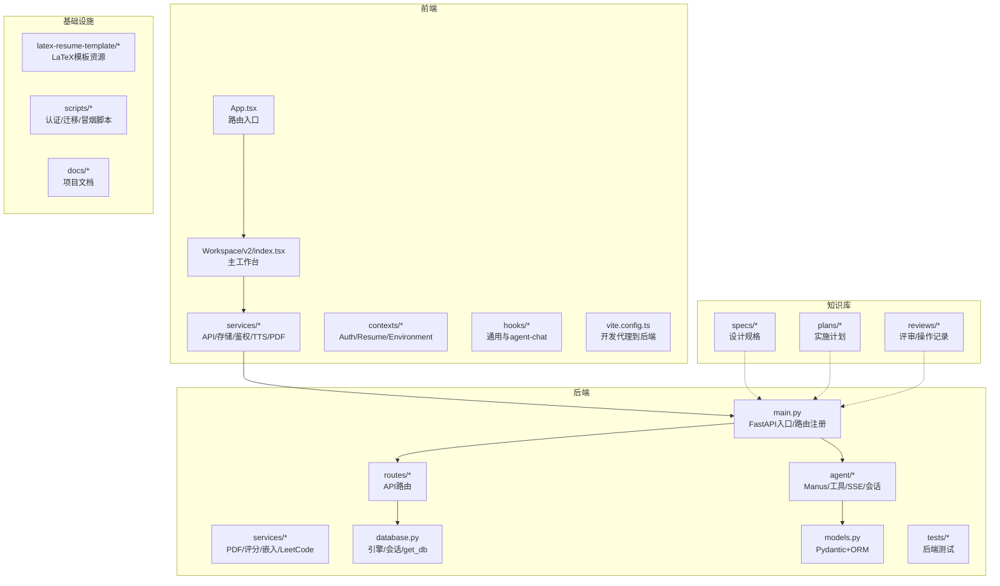
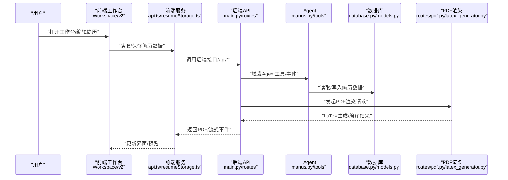

# 协作工具

<cite>
**本文引用的文件**
- [README.md](file://README.md)
- [AGENTS.md](file://AGENTS.md)
- [CLAUDE.md](file://CLAUDE.md)
- [CODEX.md](file://CODEX.md)
- [requirements.txt](file://requirements.txt)
- [knowledge-base/specs/2026-03-23-nl-resume-refactor-design.md](file://knowledge-base/specs/2026-03-23-nl-resume-refactor-design.md)
- [knowledge-base/plans/2026-03-24-nl-resume-refactor.md](file://knowledge-base/plans/2026-03-24-nl-resume-refactor.md)
- [knowledge-base/reviews/2026-03-24-nl-resume-refactor-review.md](file://knowledge-base/reviews/2026-03-24-nl-resume-refactor-review.md)
- [backend/main.py](file://backend/main.py)
- [backend/agent/agent/manus.py](file://backend/agent/agent/manus.py)
- [backend/agent/web/routes/](file://backend/agent/web/routes/)
- [frontend/src/pages/Workspace/v2/index.tsx](file://frontend/src/pages/Workspace/v2/index.tsx)
- [frontend/src/services/resumeStorage.ts](file://frontend/src/services/resumeStorage.ts)
- [frontend/src/services/api.ts](file://frontend/src/services/api.ts)
- [frontend/src/lib/runtimeEnv.ts](file://frontend/src/lib/runtimeEnv.ts)
- [frontend/vite.config.ts](file://frontend/vite.config.ts)
- [backend/routes/pdf.py](file://backend/routes/pdf.py)
- [backend/latex_generator.py](file://backend/latex_generator.py)
- [frontend/src/pages/Workspace/v2/utils/convertToBackend.ts](file://frontend/src/pages/Workspace/v2/utils/convertToBackend.ts)
- [backend/routes/auth.py](file://backend/routes/auth.py)
- [backend/middleware/auth.py](file://backend/middleware/auth.py)
- [frontend/src/contexts/AuthContext.tsx](file://frontend/src/contexts/AuthContext.tsx)
- [frontend/src/services/authService.ts](file://frontend/src/services/authService.ts)
- [backend/database.py](file://backend/database.py)
- [backend/models.py](file://backend/models.py)
- [backend/tests/](file://backend/tests/)
- [frontend/package.json](file://frontend/package.json)
- [backend/alembic/versions/](file://backend/alembic/versions/)
- [scripts/bootstrap-auth-env.sh](file://scripts/bootstrap-auth-env.sh)
- [scripts/dev-auth-web.sh](file://scripts/dev-auth-web.sh)
- [scripts/migrate-better-auth-db.sh](file://scripts/migrate-better-auth-db.sh)
- [scripts/smoke-auth-stack.sh](file://scripts/smoke-auth-stack.sh)
- [.claude/settings.local.json](file://.claude/settings.local.json)
- [.claude/rules/](file://.claude/rules/)
- [.claude/skills/](file://.claude/skills/)
</cite>

## 目录
1. [简介](#简介)
2. [项目结构](#项目结构)
3. [核心组件](#核心组件)
4. [架构总览](#架构总览)
5. [详细组件分析](#详细组件分析)
6. [依赖关系分析](#依赖关系分析)
7. [性能考虑](#性能考虑)
8. [故障排查指南](#故障排查指南)
9. [结论](#结论)
10. [附录](#附录)

## 简介
本指南面向团队协作与项目管理，结合仓库中的协作规则与知识库实践，系统阐述 GitHub 协作流程（Issues 管理、Pull Request 流程与代码审查标准）、项目管理工具使用与任务分配、进度跟踪方法、沟通渠道与会议制度、决策流程、知识库管理与文档更新、远程协作工具配置与跨时区协调，以及冲突解决机制与团队冲突管理策略。目标是帮助新成员快速融入，确保贡献者遵循统一规范，提升交付质量与协作效率。

## 项目结构
项目采用单仓多模块组织，包含前端、后端、LaTeX 模板、知识库与脚本等部分。协作规范与知识沉淀集中于知识库目录，形成“设计—计划—评审—操作记录”的闭环。

图示来源
- [AGENTS.md:66-70](file://AGENTS.md#L66-L70)
- [CLAUDE.md:43-70](file://CLAUDE.md#L43-L70)
- [CODEX.md:38-65](file://CODEX.md#L38-L65)

章节来源
- [AGENTS.md:3-13](file://AGENTS.md#L3-L13)
- [CLAUDE.md:41-70](file://CLAUDE.md#L41-L70)
- [CODEX.md:36-65](file://CODEX.md#L36-L65)

## 核心组件
- 知识库（设计/计划/评审/操作记录）：统一沉淀架构决策、设计文档与实施计划，确保变更可追溯。
- 协作规则（AGENTS/CLAUDE/CODEX）：定义研发流程、编码约束、验证闭环与提交规范，保障一致性。
- 前后端链路：前端工作台与后端 Agent/PDF/鉴权/数据库协同，形成简历数据的统一口径。
- 脚本与环境：认证栈初始化、迁移与冒烟验证脚本，支撑本地与CI环境的一致性。

章节来源
- [AGENTS.md:8-13](file://AGENTS.md#L8-L13)
- [CLAUDE.md:93-230](file://CLAUDE.md#L93-L230)
- [CODEX.md:98-200](file://CODEX.md#L98-L200)

## 架构总览
下图展示从用户操作到后端处理与PDF渲染的关键路径，强调简历数据在各层的形态与一致性要求。

图示来源
- [CLAUDE.md:280-300](file://CLAUDE.md#L280-L300)
- [frontend/src/pages/Workspace/v2/index.tsx](file://frontend/src/pages/Workspace/v2/index.tsx)
- [frontend/src/services/resumeStorage.ts](file://frontend/src/services/resumeStorage.ts)
- [frontend/src/services/api.ts](file://frontend/src/services/api.ts)
- [backend/main.py](file://backend/main.py)
- [backend/agent/agent/manus.py](file://backend/agent/agent/manus.py)
- [backend/database.py](file://backend/database.py)
- [backend/models.py](file://backend/models.py)
- [backend/routes/pdf.py](file://backend/routes/pdf.py)
- [backend/latex_generator.py](file://backend/latex_generator.py)

## 详细组件分析

### GitHub 协作流程（Issues/PR/代码审查）
- Issues 管理
  - 问题分类：需求、缺陷、重构、安全、性能、文档与知识库更新。
  - 标签与里程碑：使用标签标识优先级、模块与类型；里程碑对齐迭代计划。
  - 模板：使用仓库提供的模板规范描述背景、期望与验证条件。
- Pull Request 流程
  - 分支策略：特性分支从 develop 拉取，合入前保证本地与远端同步。
  - 提交信息：遵循“类型(scope): 描述”的格式，避免空泛表述。
  - CI 与测试：后端优先运行目标测试，前端执行构建与关键路径验证。
- 代码审查标准
  - 覆盖面：前后端、Agent、PDF 链路均需验证；关键事件与数据流一致。
  - 证据：以运行结果、截图、测试与文档事实为依据，避免主观臆断。
  - 一致性：与 AGENTS/CLAUDE/CODEX 的项目事实保持一致，必要时同步更新规则文档。

章节来源
- [CLAUDE.md:93-230](file://CLAUDE.md#L93-L230)
- [CODEX.md:98-200](file://CODEX.md#L98-L200)
- [AGENTS.md:34-44](file://AGENTS.md#L34-L44)

### 项目管理工具与任务分配
- 设计与计划
  - 设计文档：位于 knowledge-base/specs，聚焦“目标—方案—风险—收益”的六角度思考。
  - 实施计划：位于 knowledge-base/plans，明确里程碑、交付物与验证方式。
- 任务分配
  - 以功能域划分：前端工作台、后端API/Agent、PDF渲染、鉴权与数据库。
  - 评审与记录：通过 knowledge-base/reviews 记录评审意见与操作记录。
- 进度跟踪
  - 通过里程碑与计划文件追踪关键节点；结合 PR 与测试报告核验完成度。

章节来源
- [AGENTS.md:8-13](file://AGENTS.md#L8-L13)
- [CLAUDE.md:346-365](file://CLAUDE.md#L346-L365)
- [CODEX.md:229-247](file://CODEX.md#L229-L247)

### 沟通渠道规范、会议制度与决策流程
- 沟通渠道
  - 问题与讨论：Issues/PR评论区；紧急问题可口头同步并在Issue中留痕。
  - 规则与上下文：优先参考 AGENTS/CLAUDE/CODEX 与知识库文档。
- 会议制度
  - 立项会：明确目标、范围、风险与验收标准（调用 brainstorming/writing-plans）。
  - 日常站会：同步阻塞、依赖与风险；记录在知识库或共享看板。
  - 评审会：功能上线前进行跨链路验证（UI/后端/Agent/PDF），形成评审记录。
- 决策流程
  - 六角度思考：第一性原理、理性逻辑、概率风险、迭代优化、逆向思维、批判性思维。
  - 证据优先：结论基于代码、命令结果、测试、截图或文档事实。

章节来源
- [CLAUDE.md:93-125](file://CLAUDE.md#L93-L125)
- [CLAUDE.md:303-343](file://CLAUDE.md#L303-L343)
- [CODEX.md:102-153](file://CODEX.md#L102-L153)

### 知识库管理、文档更新与信息共享
- 知识库位置
  - 设计/计划/评审/操作记录统一存放于 knowledge-base 下的对应目录。
  - docs/ 为项目文档，knowledge-base/ 为架构与运营记录的主库。
- 更新机制
  - 任务完成后，如涉及架构、接口、Agent 流程、PDF 链路或用户流程变化，追加设计/计划/Review/操作记录。
  - 保持 AGENTS/CLAUDE/CODEX 与实际实现一致，必要时同步更新规则文档。
- 信息共享
  - 通过 PR 与评审记录沉淀经验；定期回顾知识库，提炼最佳实践。

章节来源
- [AGENTS.md:8-13](file://AGENTS.md#L8-L13)
- [CLAUDE.md:224-230](file://CLAUDE.md#L224-L230)
- [CODEX.md:240-247](file://CODEX.md#L240-L247)

### 远程协作工具配置、虚拟会议设置与跨时区协调
- 远程协作工具
  - 本地开发：前端通过 Vite 代理到后端端口，后端监听固定端口，便于联调。
  - 认证栈：提供初始化、迁移与冒烟验证脚本，确保本地与CI环境一致。
- 虚拟会议设置
  - 建议使用具备屏幕共享与白板功能的平台，配合知识库链接与任务看板。
- 跨时区协调
  - 以里程碑与计划文件为统一节奏；每日站会同步阻塞与依赖，减少等待成本。

章节来源
- [CLAUDE.md:254-278](file://CLAUDE.md#L254-L278)
- [frontend/vite.config.ts](file://frontend/vite.config.ts)
- [scripts/bootstrap-auth-env.sh](file://scripts/bootstrap-auth-env.sh)
- [scripts/migrate-better-auth-db.sh](file://scripts/migrate-better-auth-db.sh)
- [scripts/smoke-auth-stack.sh](file://scripts/smoke-auth-stack.sh)

### 冲突解决机制与团队冲突管理策略
- 冲突识别
  - 任务范围不清晰、接口契约不一致、Agent/PDF/前端事件不匹配、知识库与实现不一致。
- 解决流程
  - 明确假设与取舍，列出多种解释供选择；必要时暂停并发起立项会。
  - 以证据说话：运行验证、截图、测试与文档事实；避免主观臆断。
  - 评审与记录：形成评审记录与操作记录，沉淀经验。
- 预防策略
  - 严格遵循研发四阶段流程；最小改动与完整闭环；保持规则文档一致。

章节来源
- [CLAUDE.md:93-125](file://CLAUDE.md#L93-L125)
- [CLAUDE.md:193-230](file://CLAUDE.md#L193-L230)
- [CODEX.md:102-153](file://CODEX.md#L102-L153)

## 依赖关系分析
- 技术栈与版本
  - 前端：React 18 + TypeScript + Vite；UI 采用 Tailwind CSS + lucide-react + Radix Slot + TipTap。
  - 后端：FastAPI + Python；数据库默认 SQLite，支持 PostgreSQL 切换。
  - Agent：Manus + 工具系统 + SSE；运行在主后端进程内。
  - PDF：LaTeX/XeLaTeX + 模板资源；支持中英渲染。
- 关键依赖
  - 认证：JWT + passlib/bcrypt；前后端鉴权组件与中间件配套。
  - 搜索与数据处理：Google/Baidu/DuckDuckGo 搜索、Pillow、PyMuPDF、LangChain 等。
  - 浏览器自动化：Playwright + browser-use；用于端到端验证与截图取证。

章节来源
- [CLAUDE.md:26-40](file://CLAUDE.md#L26-L40)
- [requirements.txt:1-90](file://requirements.txt#L1-L90)

## 性能考虑
- 渲染链路优化
  - PDF 渲染链路长，需关注中文字体、富文本转 LaTeX、section order 与图片/Logo 渲染稳定性。
  - 事件驱动：Agent 工具事件与前端状态同步，避免重复渲染与状态漂移。
- 数据一致性
  - 简历数据在前端、后端、Agent 与 PDF 链路中存在不同形态，修改时必须统一口径，优先复用现有转换函数。
- 验证闭环
  - UI 任务必须启 dev server 实测；后端改动必须覆盖正常流程、边界与错误路径；Agent/PDF 改动必须验证事件落地与真实渲染链路。

章节来源
- [CLAUDE.md:193-230](file://CLAUDE.md#L193-L230)
- [CLAUDE.md:280-300](file://CLAUDE.md#L280-L300)

## 故障排查指南
- 常见问题定位
  - 前端：确认开发代理配置与端口；检查 API 基础地址与路由注册。
  - 后端：检查数据库连接与会话获取；核对鉴权中间件与前端上下文/服务一致。
  - Agent：确认工具事件与前端事件路由一致；检查 ResumeDataStore 同步。
  - PDF：核对 JSON 到 LaTeX 转换与编译错误输出；关注中文字体与富文本渲染。
- 验证步骤
  - 前端：构建通过 + 浏览器实测；关键路径覆盖空值/超限/非法类型/鉴权失败/DB异常/外部依赖down。
  - 后端：目标测试优先；无测试时用 HTTP 请求验证接口。
  - Agent：验证事件顺序、工具事件、ResumeDataStore 更新、前端状态与预览刷新。
  - PDF：覆盖前端调用、后端接口、LaTeX 生成与编译错误输出。
- 环境与脚本
  - 使用认证栈脚本进行初始化、迁移与冒烟验证，确保本地与CI一致。

章节来源
- [CLAUDE.md:193-230](file://CLAUDE.md#L193-L230)
- [CLAUDE.md:254-278](file://CLAUDE.md#L254-L278)
- [frontend/vite.config.ts](file://frontend/vite.config.ts)
- [backend/database.py](file://backend/database.py)
- [backend/middleware/auth.py](file://backend/middleware/auth.py)
- [frontend/src/contexts/AuthContext.tsx](file://frontend/src/contexts/AuthContext.tsx)
- [frontend/src/services/authService.ts](file://frontend/src/services/authService.ts)
- [scripts/bootstrap-auth-env.sh](file://scripts/bootstrap-auth-env.sh)
- [scripts/migrate-better-auth-db.sh](file://scripts/migrate-better-auth-db.sh)
- [scripts/smoke-auth-stack.sh](file://scripts/smoke-auth-stack.sh)

## 结论
通过统一的知识库与协作规则，Resume-Agent 形成了从设计到实施再到评审与操作记录的闭环。团队应严格遵循研发四阶段流程、最小改动与完整闭环原则，确保前后端、Agent 与 PDF 链路的一致性与可验证性。借助脚本与标准化流程，降低环境差异带来的风险，提升交付质量与协作效率。

## 附录
- 快速参考
  - 项目主页与贡献指引：参见根目录说明文件。
  - 研发规则：AGENTS/CLAUDE/CODEX 三份规则文档。
  - 知识库：specs/plans/reviews 三类文档，按日期命名归档。
  - 技术栈与依赖：参见 CLAUDE/requirements.txt。

章节来源
- [README.md:99-106](file://README.md#L99-L106)
- [AGENTS.md:34-44](file://AGENTS.md#L34-L44)
- [CLAUDE.md:367-380](file://CLAUDE.md#L367-L380)
- [CODEX.md:229-247](file://CODEX.md#L229-L247)