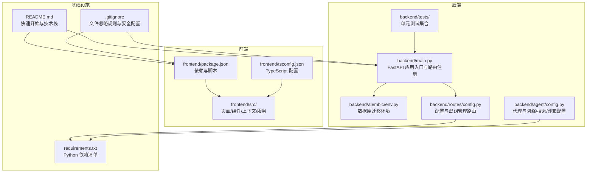
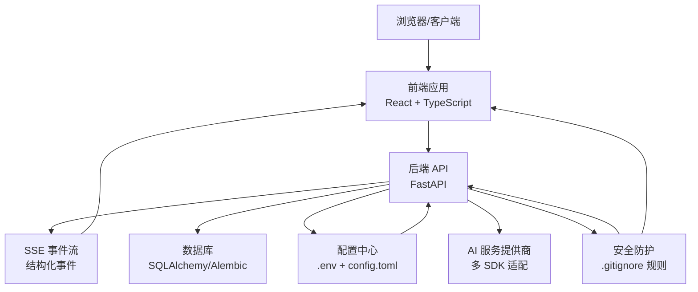
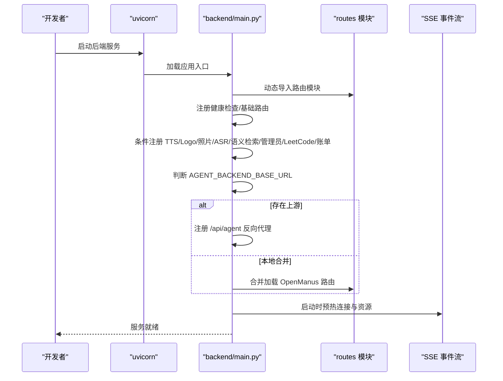
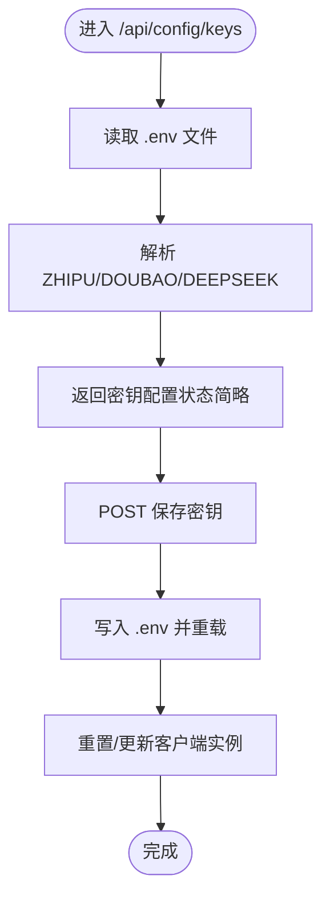
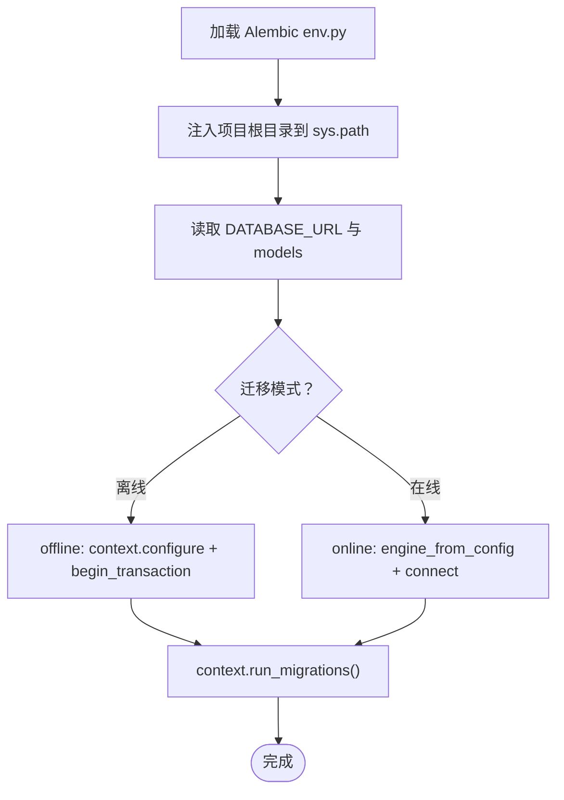
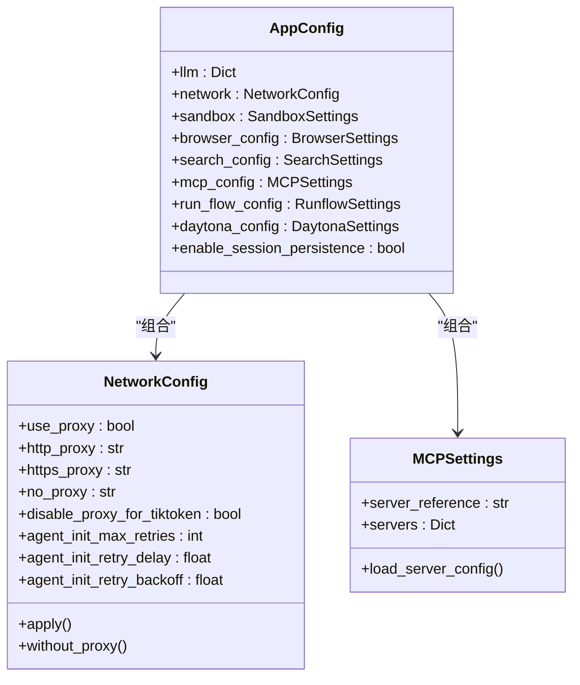
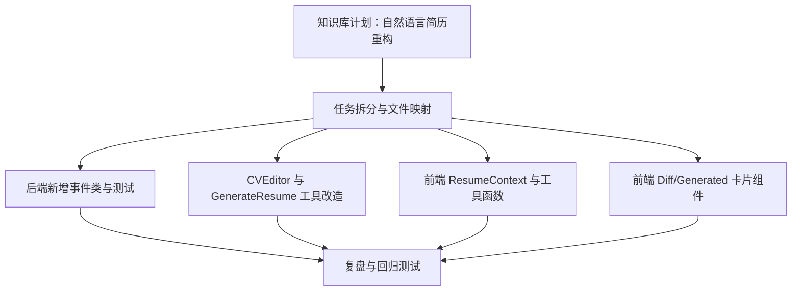
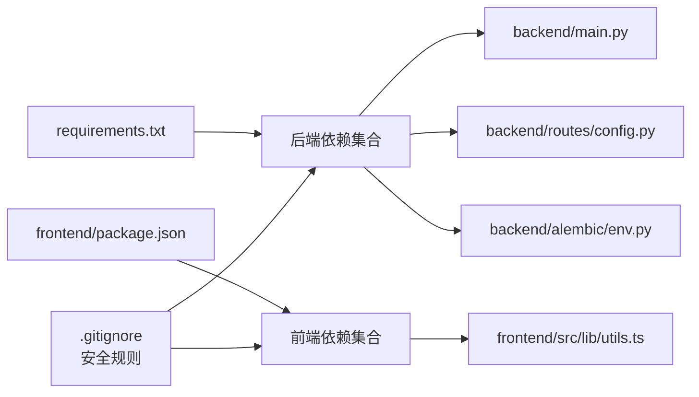

# 开发指南

<cite>
**本文引用的文件**
- [.gitignore](file://.gitignore)
- [README.md](file://README.md)
- [requirements.txt](file://requirements.txt)
- [backend/main.py](file://backend/main.py)
- [frontend/package.json](file://frontend/package.json)
- [frontend/tsconfig.json](file://frontend/tsconfig.json)
- [backend/alembic/env.py](file://backend/alembic/env.py)
- [backend/agent/config.py](file://backend/agent/config.py)
- [backend/routes/config.py](file://backend/routes/config.py)
- [backend/tests/test_resume_text_preprocessor.py](file://backend/tests/test_resume_text_preprocessor.py)
- [frontend/src/lib/utils.ts](file://frontend/src/lib/utils.ts)
- [knowledge-base/plans/2026-03-24-nl-resume-refactor.md](file://knowledge-base/plans/2026-03-24-nl-resume-refactor.md)
</cite>

## 更新摘要
**所做更改**
- 新增代码规范章节，重点介绍.gitignore中新增的敏感数据和调试产物忽略规则
- 更新开发环境配置，包含Playwright调试快照、运行时对话数据和Claude Code本地设置的处理
- 增强安全意识和数据保护最佳实践
- 完善开发工作流程中的文件管理和清理指导

## 目录
1. [简介](#简介)
2. [项目结构](#项目结构)
3. [核心组件](#核心组件)
4. [架构总览](#架构总览)
5. [详细组件分析](#详细组件分析)
6. [依赖关系分析](#依赖关系分析)
7. [性能考虑](#性能考虑)
8. [故障排查指南](#故障排查指南)
9. [代码规范](#代码规范)
10. [开发环境配置](#开发环境配置)
11. [结论](#结论)
12. [附录](#附录)

## 简介
本开发指南面向参与 Resume-Agent 项目的开发者，覆盖代码规范、提交流程、代码审查标准、版本管理策略、开发环境配置、IDE 设置、调试技巧与性能分析、设计文档与需求评审、技术决策记录与知识管理、新功能开发流程、重构指导与遗留代码处理，以及团队协作工具与沟通规范。文档以仓库现有实现为依据，结合知识库计划与测试用例，帮助团队达成一致的开发实践。

## 项目结构
项目采用前后端分离架构，后端基于 FastAPI，前端基于 React 18 + TypeScript + Vite，数据库迁移使用 Alembic，AI 服务通过多提供商适配，浏览器自动化与可视化工具链完善，具备可观测性中间件与统一日志体系。

**图示来源**
- [README.md:1-106](file://README.md#L1-L106)
- [backend/main.py:1-326](file://backend/main.py#L1-L326)
- [frontend/package.json:1-66](file://frontend/package.json#L1-L66)
- [frontend/tsconfig.json:1-22](file://frontend/tsconfig.json#L1-L22)
- [backend/alembic/env.py:1-80](file://backend/alembic/env.py#L1-L80)
- [backend/routes/config.py:1-309](file://backend/routes/config.py#L1-L309)
- [backend/agent/config.py:1-546](file://backend/agent/config.py#L1-L546)
- [requirements.txt:1-90](file://requirements.txt#L1-L90)
- [.gitignore:128-132](file://.gitignore#L128-L132)

**章节来源**
- [README.md:38-86](file://README.md#L38-L86)
- [backend/main.py:92-139](file://backend/main.py#L92-L139)
- [frontend/package.json:6-11](file://frontend/package.json#L6-L11)
- [frontend/tsconfig.json:1-22](file://frontend/tsconfig.json#L1-L22)
- [backend/alembic/env.py:30-41](file://backend/alembic/env.py#L30-L41)
- [backend/routes/config.py:34-36](file://backend/routes/config.py#L34-L36)
- [backend/agent/config.py:28-51](file://backend/agent/config.py#L28-L51)
- [requirements.txt:1-90](file://requirements.txt#L1-L90)
- [.gitignore:128-132](file://.gitignore#L128-L132)

## 核心组件
- 后端入口与路由
  - FastAPI 应用集中注册健康检查、配置、简历、PDF、分享、认证、LeetCode、账单等路由，并按需加载 TTS、Logo、照片、ASR、语义检索、管理员等路由。
  - 支持将 /api/agent 请求反向代理到外部 Agent 后端，或在本地合并加载 OpenManus 路由。
- 配置与密钥管理
  - 提供 /api/ai/config、/api/config/keys、/api/ai/test-keys、/api/ai/test、/api/chat 等接口，支持从 .env 读取与更新密钥，测试各提供商可用性。
- 数据库迁移
  - Alembic 环境通过 env.py 将项目根目录注入 sys.path，确保模型与数据库配置正确加载。
- 代理与网络配置
  - 代理、网络、浏览器、沙箱、搜索、MCP、RunFlow、Daytona 等配置通过 TOML 与 .env 组合加载，支持运行时热更新与上下文持久化开关。
- 前端工程化
  - Vite + React + TypeScript，TailwindCSS，组件与上下文解耦，服务层统一 API 调用，工具函数封装样式合并等基础能力。
- **安全与数据保护**
  - 通过.gitignore规则自动忽略敏感调试数据、本地配置文件和第三方工具的本地设置，确保仓库清洁度和信息安全。

**章节来源**
- [backend/main.py:73-139](file://backend/main.py#L73-L139)
- [backend/routes/config.py:45-309](file://backend/routes/config.py#L45-L309)
- [backend/alembic/env.py:15-41](file://backend/alembic/env.py#L15-L41)
- [backend/agent/config.py:285-546](file://backend/agent/config.py#L285-L546)
- [frontend/package.json:6-11](file://frontend/package.json#L6-L11)
- [.gitignore:128-132](file://.gitignore#L128-L132)

## 架构总览
后端通过 FastAPI 提供 REST 与 SSE 流式响应，前端通过 Axios 与 SSE 传输层接收结构化事件，配合 React 上下文实现编辑态与聊天态的实时同步。数据库迁移通过 Alembic 管理，密钥与配置通过路由集中管理，代理与网络参数通过配置模块统一注入。所有组件都遵循.gitignore的安全规则，自动排除敏感数据和调试产物。

**图示来源**
- [backend/main.py:92-139](file://backend/main.py#L92-L139)
- [backend/routes/config.py:45-309](file://backend/routes/config.py#L45-L309)
- [backend/alembic/env.py:30-41](file://backend/alembic/env.py#L30-L41)
- [backend/agent/config.py:338-351](file://backend/agent/config.py#L338-L351)
- [.gitignore:128-132](file://.gitignore#L128-L132)

## 详细组件分析

### 后端入口与路由注册
- 模块化导入与兼容路径
  - 动态导入 routes 模块，兼容包/脚本两种运行方式；统一设置 sys.path，保证相对导入稳定。
- 路由注册顺序与条件加载
  - 健康检查与基础路由优先注册；TTS 路由按依赖存在与否动态注册；Logo、照片、ASR、语义检索、管理员、LeetCode、账单等路由按需注册。
- 代理与合并路由
  - 若配置 AGENT_BACKEND_BASE_URL，则将 /api/agent/** 反向代理到上游；否则合并加载 OpenManus 路由。
- 启动优化
  - 启动时预热 HTTP 连接、数据库连接、Logo 自动同步、tiktoken 编码文件，降低首次请求延迟。

**图示来源**
- [backend/main.py:61-139](file://backend/main.py#L61-L139)
- [backend/main.py:227-316](file://backend/main.py#L227-L316)

**章节来源**
- [backend/main.py:61-139](file://backend/main.py#L61-L139)
- [backend/main.py:227-316](file://backend/main.py#L227-L316)

### 配置与密钥管理
- 密钥状态查询与安全展示
  - 从 .env 文件解析 API Key，不返回完整 Key，仅返回简要预览，避免泄露。
- 保存密钥
  - 将新密钥写入 .env，必要时重载环境变量；更新智谱客户端实例与 DeepSeek API Key。
- 提示词模板管理
  - 后台管理接口支持获取与保存提示词模板，便于统一维护。
- AI 可用性测试
  - 对已配置的提供商发起最小调用，返回可用性与错误详情；通用聊天接口支持默认提供商选择。

**图示来源**
- [backend/routes/config.py:51-175](file://backend/routes/config.py#L51-L175)

**章节来源**
- [backend/routes/config.py:51-175](file://backend/routes/config.py#L51-L175)
- [backend/routes/config.py:177-199](file://backend/routes/config.py#L177-L199)
- [backend/routes/config.py:201-309](file://backend/routes/config.py#L201-L309)

### 数据库迁移与 Alembic 环境
- 环境注入与模型加载
  - env.py 将项目根目录注入 sys.path，确保 models 与 DATABASE_URL 正确加载。
- 离线/在线迁移
  - 支持离线与在线两种迁移模式，连接池配置为 NullPool，事务内执行迁移。

**图示来源**
- [backend/alembic/env.py:15-80](file://backend/alembic/env.py#L15-L80)

**章节来源**
- [backend/alembic/env.py:15-80](file://backend/alembic/env.py#L15-L80)

### 代理与网络配置（Agent 配置）
- 配置来源与展开
  - 从 config.toml 读取，支持 ${VAR_NAME} 环境变量展开；.env 优先于 agent-backend 目录。
- 结构化配置
  - LLMSettings、ProxyConfig、NetworkConfig、BrowserSettings、SandboxSettings、SearchSettings、MCPSettings、RunflowSettings、DaytonaSettings 等。
- 网络代理与 TikToken 下载
  - NetworkConfig 提供全局代理与禁用代理的上下文管理，避免 TikToken 下载受代理影响。
- MCP 服务器配置
  - 从 JSON 文件加载 MCP 服务器配置，支持 SSE 与 stdio 两种连接类型。

**图示来源**
- [backend/agent/config.py:285-546](file://backend/agent/config.py#L285-L546)

**章节来源**
- [backend/agent/config.py:338-351](file://backend/agent/config.py#L338-L351)
- [backend/agent/config.py:417-451](file://backend/agent/config.py#L417-L451)
- [backend/agent/config.py:500-504](file://backend/agent/config.py#L500-L504)

### 前端工程化与工具函数
- 依赖与脚本
  - Vite + React + TypeScript，TailwindCSS，Axios，PDF 工具，Mermaid，拖拽与富文本编辑等生态。
- TypeScript 配置
  - ES2020 目标，bundler 模式，严格模式，路径别名 @/* 指向 src。
- 工具函数
  - cn 函数基于 clsx 与 tailwind-merge 合并类名，减少样式冲突。

**章节来源**
- [frontend/package.json:6-66](file://frontend/package.json#L6-L66)
- [frontend/tsconfig.json:1-22](file://frontend/tsconfig.json#L1-L22)
- [frontend/src/lib/utils.ts:1-8](file://frontend/src/lib/utils.ts#L1-L8)

### 设计文档与知识管理
- 自然语言简历重构计划
  - 明确后端事件（ResumePatchEvent/ResumeGeneratedEvent）、前端上下文（ResumeContext）、工具白名单、SSE 事件路由与前端卡片组件的文件映射与任务步骤。
  - 强调后端 ToolResult 使用 system 字段传递结构化数据，前端 set-by-path 工具函数精确路径写入。

**图示来源**
- [knowledge-base/plans/2026-03-24-nl-resume-refactor.md:17-71](file://knowledge-base/plans/2026-03-24-nl-resume-refactor.md#L17-L71)
- [knowledge-base/plans/2026-03-24-nl-resume-refactor.md:73-178](file://knowledge-base/plans/2026-03-24-nl-resume-refactor.md#L73-L178)
- [knowledge-base/plans/2026-03-24-nl-resume-refactor.md:181-284](file://knowledge-base/plans/2026-03-24-nl-resume-refactor.md#L181-L284)
- [knowledge-base/plans/2026-03-24-nl-resume-refactor.md:287-449](file://knowledge-base/plans/2026-03-24-nl-resume-refactor.md#L287-L449)
- [knowledge-base/plans/2026-03-24-nl-resume-refactor.md:452-516](file://knowledge-base/plans/2026-03-24-nl-resume-refactor.md#L452-L516)
- [knowledge-base/plans/2026-03-24-nl-resume-refactor.md:519-648](file://knowledge-base/plans/2026-03-24-nl-resume-refactor.md#L519-L648)
- [knowledge-base/plans/2026-03-24-nl-resume-refactor.md:651-701](file://knowledge-base/plans/2026-03-24-nl-resume-refactor.md#L651-L701)
- [knowledge-base/plans/2026-03-24-nl-resume-refactor.md:704-800](file://knowledge-base/plans/2026-03-24-nl-resume-refactor.md#L704-L800)

**章节来源**
- [knowledge-base/plans/2026-03-24-nl-resume-refactor.md:17-71](file://knowledge-base/plans/2026-03-24-nl-resume-refactor.md#L17-L71)
- [knowledge-base/plans/2026-03-24-nl-resume-refactor.md:73-178](file://knowledge-base/plans/2026-03-24-nl-resume-refactor.md#L73-L178)
- [knowledge-base/plans/2026-03-24-nl-resume-refactor.md:181-284](file://knowledge-base/plans/2026-03-24-nl-resume-refactor.md#L181-L284)
- [knowledge-base/plans/2026-03-24-nl-resume-refactor.md:287-449](file://knowledge-base/plans/2026-03-24-nl-resume-refactor.md#L287-L449)
- [knowledge-base/plans/2026-03-24-nl-resume-refactor.md:452-516](file://knowledge-base/plans/2026-03-24-nl-resume-refactor.md#L452-L516)
- [knowledge-base/plans/2026-03-24-nl-resume-refactor.md:519-648](file://knowledge-base/plans/2026-03-24-nl-resume-refactor.md#L519-L648)
- [knowledge-base/plans/2026-03-24-nl-resume-refactor.md:651-701](file://knowledge-base/plans/2026-03-24-nl-resume-refactor.md#L651-L701)
- [knowledge-base/plans/2026-03-24-nl-resume-refactor.md:704-800](file://knowledge-base/plans/2026-03-24-nl-resume-refactor.md#L704-L800)

## 依赖关系分析
- 后端依赖
  - FastAPI、uvicorn、pydantic、requests、httpx、报告与 PDF 渲染、LLM SDK、数据库与迁移、认证与加密、浏览器自动化、搜索、数据处理、LangChain、工具库等。
- 前端依赖
  - React 生态、PDF 工具、Mermaid、拖拽、富文本、TailwindCSS、Vite、TypeScript 等。
- 配置与迁移
  - .env 与 config.toml 双通道配置；Alembic 通过 env.py 注入路径并加载模型。
- **安全配置**
  - .gitignore 通过规则自动排除敏感数据和调试产物，确保代码库安全。

**图示来源**
- [requirements.txt:1-90](file://requirements.txt#L1-L90)
- [frontend/package.json:12-66](file://frontend/package.json#L12-L66)
- [backend/main.py:54-139](file://backend/main.py#L54-L139)
- [backend/routes/config.py:9-33](file://backend/routes/config.py#L9-L33)
- [backend/alembic/env.py:15-41](file://backend/alembic/env.py#L15-L41)
- [frontend/src/lib/utils.ts:1-8](file://frontend/src/lib/utils.ts#L1-L8)
- [.gitignore:128-132](file://.gitignore#L128-L132)

**章节来源**
- [requirements.txt:1-90](file://requirements.txt#L1-L90)
- [frontend/package.json:12-66](file://frontend/package.json#L12-L66)
- [backend/main.py:54-139](file://backend/main.py#L54-L139)
- [backend/routes/config.py:9-33](file://backend/routes/config.py#L9-L33)
- [backend/alembic/env.py:15-41](file://backend/alembic/env.py#L15-L41)
- [frontend/src/lib/utils.ts:1-8](file://frontend/src/lib/utils.ts#L1-L8)
- [.gitignore:128-132](file://.gitignore#L128-L132)

## 性能考虑
- 启动预热
  - 后端启动时预热 HTTP 连接、数据库连接、Logo 同步、tiktoken 编码文件，显著降低首次请求延迟。
- SSE 事件与流式传输
  - 通过 SSE 事件流推送结构化事件，前端按事件类型路由到上下文，减少轮询开销。
- 前端不可变更新
  - set-by-path 工具函数基于结构化克隆进行不可变更新，避免深层深拷贝成本。
- 依赖与体积控制
  - 前端按需引入 PDF 工具与图表库，避免打包体积膨胀；后端按需注册路由，减少启动时间。

**章节来源**
- [backend/main.py:227-316](file://backend/main.py#L227-L316)
- [knowledge-base/plans/2026-03-24-nl-resume-refactor.md:452-516](file://knowledge-base/plans/2026-03-24-nl-resume-refactor.md#L452-L516)
- [frontend/src/lib/utils.ts:1-8](file://frontend/src/lib/utils.ts#L1-L8)

## 故障排查指南
- 启动与路由问题
  - 若 /api/agent 无法访问，检查 AGENT_BACKEND_BASE_URL 是否正确；若本地合并路由缺失，确认可选依赖是否安装。
- 密钥与 AI 可用性
  - 使用 /api/config/keys 查询密钥状态；使用 /api/ai/test-keys 检测各提供商可用性；必要时重置客户端实例。
- 数据库迁移
  - 确认 Alembic env.py 已注入项目根目录；检查 DATABASE_URL 与 models 是否正确加载；按离线/在线模式分别排查。
- 前端样式与类型
  - 若 cn 合并类名异常，检查 clsx 与 tailwind-merge 版本；TypeScript 编译错误时核对 tsconfig.json 的 strict 与 bundler 配置。
- **文件忽略与安全问题**
  - 若发现敏感文件被意外提交，检查.gitignore规则；确保Playwright调试快照、运行时对话数据和Claude Code本地设置被正确忽略。

**章节来源**
- [backend/main.py:141-225](file://backend/main.py#L141-L225)
- [backend/routes/config.py:51-175](file://backend/routes/config.py#L51-L175)
- [backend/routes/config.py:201-309](file://backend/routes/config.py#L201-L309)
- [backend/alembic/env.py:15-80](file://backend/alembic/env.py#L15-L80)
- [frontend/src/lib/utils.ts:1-8](file://frontend/src/lib/utils.ts#L1-L8)
- [.gitignore:128-132](file://.gitignore#L128-L132)

## 代码规范

### 文件忽略与安全规则
项目采用严格的文件忽略策略，通过.gitignore规则自动保护敏感数据和调试产物：

#### 敏感调试数据保护
- **Playwright调试快照**：`.playwright-mcp/` 目录自动忽略，防止调试截图和测试快照进入版本控制
- **运行时对话数据**：`data/conversations/` 目录自动忽略，保护用户对话历史和会话数据
- **第三方工具本地设置**：`.claude/settings.local.json` 文件自动忽略，防止Claude Code配置泄露

#### 环境配置管理
- **本地环境文件**：`.env`、`.env.local`、`.env.remote`、`.env.production` 等本地配置文件被忽略
- **前端环境文件**：`frontend/.env.local`、`frontend/.env.remote`、`frontend/.env.production` 等前端本地配置被忽略
- **例外规则**：保留 `.env.example` 和 `frontend/.env.example` 作为配置模板

#### 开发工具与临时文件
- **IDE配置**：`.vscode/`、`.idea/` 目录被忽略，防止IDE特定配置进入仓库
- **系统文件**：`.DS_Store`、`Thumbs.db` 等系统生成文件被忽略
- **临时文件**：`*.tmp`、`*.temp`、`*.pid` 等临时文件被忽略

#### 最佳实践建议
- 在开发过程中产生的调试数据应保持在本地，不要提交到远程仓库
- 如需共享调试信息，请使用安全的方式（如私有Gist）而非直接提交到仓库
- 定期检查.gitignore规则的有效性，确保敏感数据不会意外提交
- 团队成员应了解这些规则，避免误操作导致数据泄露

**章节来源**
- [.gitignore:128-132](file://.gitignore#L128-L132)
- [.gitignore:21-31](file://.gitignore#L21-L31)
- [.gitignore:32-37](file://.gitignore#L32-L37)
- [.gitignore:38-41](file://.gitignore#L38-L41)
- [.gitignore:51-56](file://.gitignore#L51-L56)

## 开发环境配置

### 环境变量管理
- **本地开发**：使用 `.env.local` 文件存储本地开发所需的敏感配置
- **生产环境**：使用 `.env.production` 文件存储生产环境配置
- **远程环境**：使用 `.env.remote` 文件存储远程服务器配置
- **配置模板**：保留 `.env.example` 作为团队共享的配置模板，不包含实际值

### 调试工具配置
- **Playwright测试**：调试快照自动保存在 `.playwright-mcp/` 目录，无需手动清理
- **Claude Code集成**：本地设置文件 `.claude/settings.local.json` 自动忽略，保护个人偏好配置
- **运行时数据**：对话历史和运行时数据自动保存在 `data/conversations/` 目录，便于调试但不提交

### IDE与开发工具
- **VS Code**：`.vscode/` 目录包含IDE特定配置，自动忽略以避免跨平台冲突
- **IntelliJ IDEA**：`.idea/` 目录包含IDE特定配置，自动忽略以避免跨平台冲突
- **临时文件**：`*.swp`、`*.swo` 等编辑器临时文件自动忽略

### 安全配置最佳实践
- 不要在代码中硬编码敏感信息
- 使用环境变量管理配置
- 定期更新和轮换API密钥
- 在提交前检查是否有敏感信息被意外提交
- 使用Git钩子或CI/CD流程自动检测敏感信息

**章节来源**
- [.gitignore:128-132](file://.gitignore#L128-L132)
- [.gitignore:21-31](file://.gitignore#L21-L31)
- [.gitignore:32-37](file://.gitignore#L32-L37)
- [.gitignore:38-41](file://.gitignore#L38-L41)
- [.gitignore:51-56](file://.gitignore#L51-L56)

## 结论
本指南基于仓库现有实现，总结了开发流程、代码规范、配置与路由、数据库迁移、代理与网络配置、前端工程化、设计与知识管理、性能优化与故障排查等方面的最佳实践。特别强调了通过.gitignore规则实现的自动安全保护机制，包括Playwright调试快照、运行时对话数据和Claude Code本地设置的自动忽略。建议在新功能开发与重构过程中遵循本文档的流程与规范，确保一致性、安全性与可维护性。

## 附录
- 快速开始与技术栈
  - 参考 README 的环境要求、安装与启动步骤，以及技术栈说明。
- 测试与验证
  - 建议在本地先运行目标模块测试，再执行 pytest；可参考简历文本预处理测试用例的组织方式。
- **安全检查清单**
  - 提交前检查是否有敏感文件被意外添加
  - 确认.gitignore规则正常工作
  - 验证环境变量配置正确且安全

**章节来源**
- [README.md:52-94](file://README.md#L52-L94)
- [backend/tests/test_resume_text_preprocessor.py:1-56](file://backend/tests/test_resume_text_preprocessor.py#L1-L56)
- [.gitignore:128-132](file://.gitignore#L128-L132)