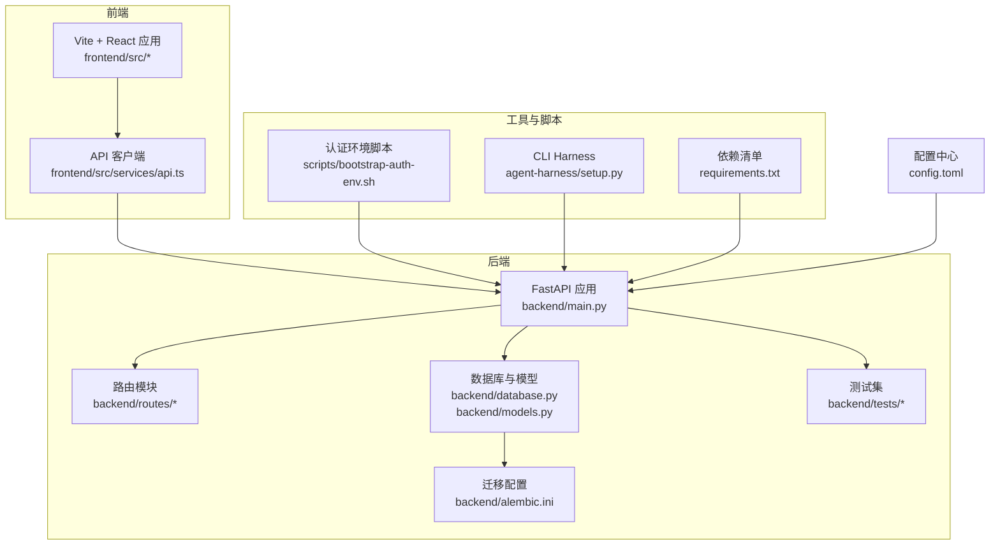
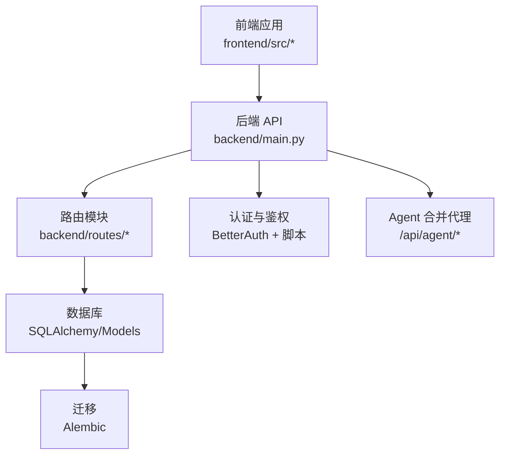
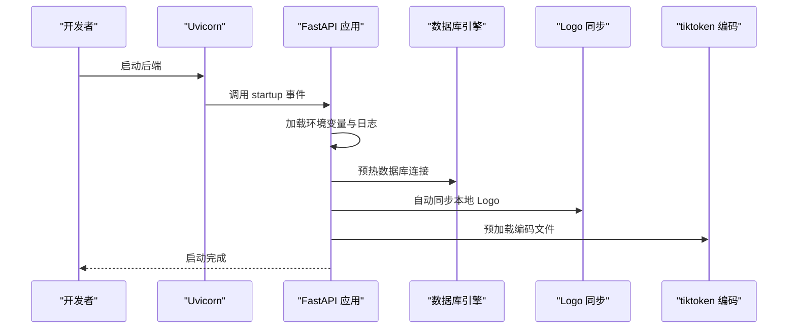
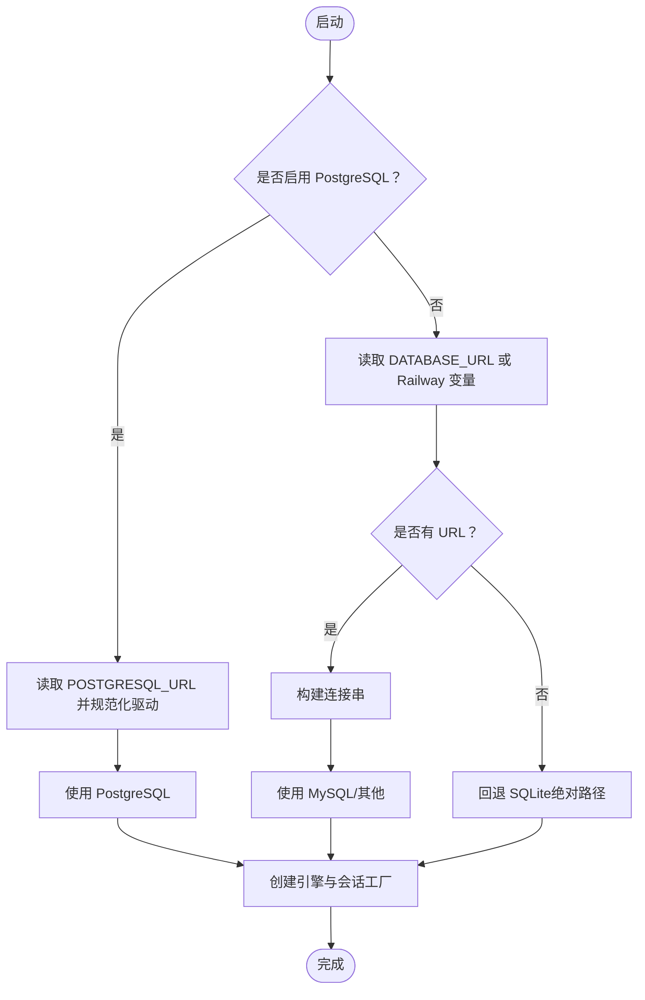
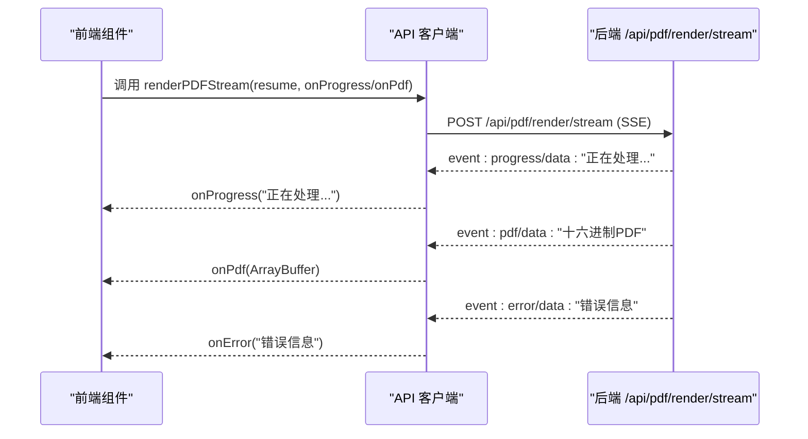
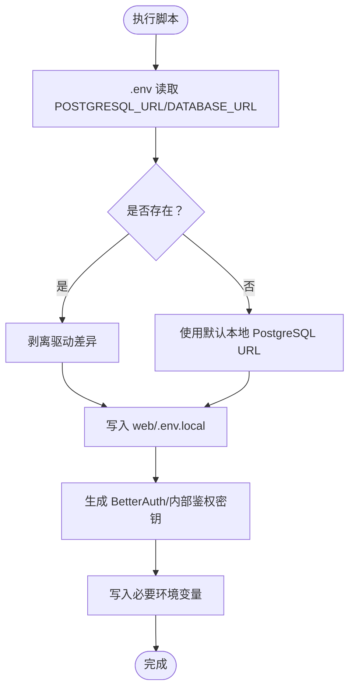
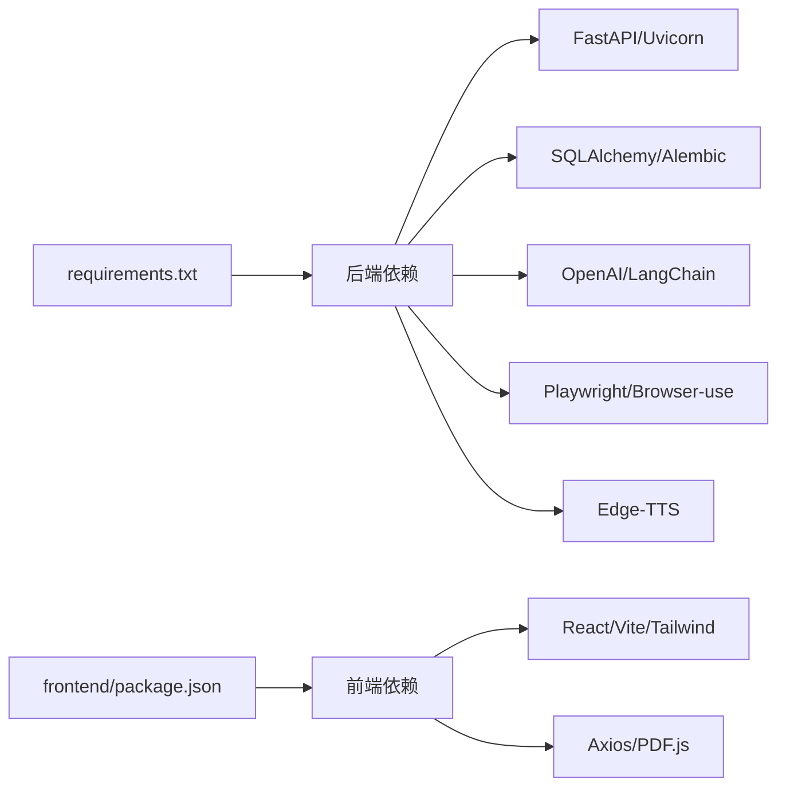

# 开发流程

<cite>
**本文引用的文件**
- [backend/main.py](file://backend/main.py)
- [requirements.txt](file://requirements.txt)
- [backend/database.py](file://backend/database.py)
- [backend/models.py](file://backend/models.py)
- [backend/alembic.ini](file://backend/alembic.ini)
- [backend/tests/test_resume_text_preprocessor.py](file://backend/tests/test_resume_text_preprocessor.py)
- [backend/tests/test_generate_resume_tool.py](file://backend/tests/test_generate_resume_tool.py)
- [frontend/package.json](file://frontend/package.json)
- [frontend/src/services/api.ts](file://frontend/src/services/api.ts)
- [scripts/bootstrap-auth-env.sh](file://scripts/bootstrap-auth-env.sh)
- [agent-harness/setup.py](file://agent-harness/setup.py)
- [config.toml](file://config.toml)
- [knowledge-base/plans/2026-03-24-nl-resume-refactor.md](file://knowledge-base/plans/2026-03-24-nl-resume-refactor.md)
</cite>

## 目录
1. [简介](#简介)
2. [项目结构](#项目结构)
3. [核心组件](#核心组件)
4. [架构总览](#架构总览)
5. [详细组件分析](#详细组件分析)
6. [依赖分析](#依赖分析)
7. [性能考虑](#性能考虑)
8. [故障排查指南](#故障排查指南)
9. [结论](#结论)
10. [附录](#附录)

## 简介
本文件面向参与 ResumeAgent 项目的开发者，系统性梳理从需求分析到代码部署的完整开发流程，覆盖功能开发、单元测试、集成测试、代码审查、分支管理与合并请求流程、本地开发环境搭建、数据库初始化与迁移、API 测试方法、持续集成与自动化测试运行、部署流水线、问题跟踪、版本发布与回滚策略等。

## 项目结构
项目采用前后端分离架构，后端基于 FastAPI，前端基于 Vite + React + TypeScript，辅以 Alembic 进行数据库迁移，配合 CLI 工具与认证脚本支撑本地开发与运维。

图示来源
- [backend/main.py:1-326](file://backend/main.py#L1-L326)
- [frontend/src/services/api.ts:1-800](file://frontend/src/services/api.ts#L1-L800)
- [backend/database.py:1-138](file://backend/database.py#L1-L138)
- [backend/models.py:1-372](file://backend/models.py#L1-L372)
- [backend/alembic.ini:1-36](file://backend/alembic.ini#L1-L36)
- [scripts/bootstrap-auth-env.sh:1-204](file://scripts/bootstrap-auth-env.sh#L1-L204)
- [agent-harness/setup.py:1-16](file://agent-harness/setup.py#L1-L16)
- [requirements.txt:1-90](file://requirements.txt#L1-L90)
- [config.toml:1-28](file://config.toml#L1-L28)

章节来源
- [backend/main.py:1-326](file://backend/main.py#L1-L326)
- [frontend/package.json:1-66](file://frontend/package.json#L1-L66)

## 核心组件
- 后端服务入口与路由装配：FastAPI 应用在入口文件中集中注册路由、CORS、可观测性与代理逻辑，支持可选 TTS 路由与 Agent 合并代理。
- 数据库与模型：统一的数据库连接工厂、连接池参数与模型定义，支持 SQLite/MySQL/PostgreSQL。
- 前端 API 客户端：封装 PDF 渲染、流式生成、鉴权头与错误解析等通用能力。
- 认证与环境：提供本地认证环境初始化脚本，自动推断数据库 URL 并生成密钥。
- CLI 工具：提供命令行入口，便于本地调试与集成。
- 配置中心：以 TOML 管理 LLM 与视觉模型参数，支持从环境变量注入。

章节来源
- [backend/main.py:54-139](file://backend/main.py#L54-L139)
- [backend/database.py:26-112](file://backend/database.py#L26-L112)
- [backend/models.py:111-372](file://backend/models.py#L111-L372)
- [frontend/src/services/api.ts:115-283](file://frontend/src/services/api.ts#L115-L283)
- [scripts/bootstrap-auth-env.sh:154-200](file://scripts/bootstrap-auth-env.sh#L154-L200)
- [agent-harness/setup.py:10-14](file://agent-harness/setup.py#L10-L14)
- [config.toml:1-28](file://config.toml#L1-L28)

## 架构总览
后端通过 FastAPI 提供 REST 接口，前端通过 axios 调用后端 API，数据库通过 SQLAlchemy 管理，Alembic 负责迁移。认证与鉴权通过 BetterAuth 与后端路由协同，Agent 功能可通过反向代理或内嵌路由接入。

图示来源
- [backend/main.py:107-138](file://backend/main.py#L107-L138)
- [backend/database.py:114-138](file://backend/database.py#L114-L138)
- [backend/alembic.ini:1-36](file://backend/alembic.ini#L1-L36)
- [scripts/bootstrap-auth-env.sh:185-193](file://scripts/bootstrap-auth-env.sh#L185-L193)

## 详细组件分析

### 后端服务与路由装配
- 启动流程：加载环境变量、设置日志、注册中间件与路由，按需启用 TTS 与 Agent 合并代理。
- 代理逻辑：当配置了上游 Agent 地址时，将 /api/agent/** 反代至上游；否则内嵌 OpenManus 路由。
- 启动优化：预热 HTTP 连接、数据库连接、Logo 同步与 tiktoken 编码文件。

图示来源
- [backend/main.py:228-316](file://backend/main.py#L228-L316)

章节来源
- [backend/main.py:54-139](file://backend/main.py#L54-L139)
- [backend/main.py:141-225](file://backend/main.py#L141-L225)
- [backend/main.py:228-316](file://backend/main.py#L228-L316)

### 数据库与模型
- 数据库 URL 解析：支持 PostgreSQL/MySQL/SQLite，自动处理驱动差异与 Railway 环境变量。
- 连接池参数：可配置 pre_ping、回收时间、大小、溢出、超时等，适配远程高延迟场景。
- 模型定义：Pydantic 数据模型与 SQLAlchemy ORM 模型并存，统一模块别名避免重复映射。

图示来源
- [backend/database.py:26-67](file://backend/database.py#L26-L67)
- [backend/database.py:91-112](file://backend/database.py#L91-L112)

章节来源
- [backend/database.py:26-112](file://backend/database.py#L26-L112)
- [backend/models.py:111-372](file://backend/models.py#L111-L372)

### 前端 API 客户端与 PDF 渲染
- 统一封装：提供 AI 测试、简历生成、PDF 渲染（含流式）、配额查询、鉴权头等。
- 错误解析：统一解析后端返回的错误详情，区分 401/403 等场景。
- 流式协议：遵循 SSE 协议解析 progress/pdf/error 事件，支持进度与二进制 PDF 数据。

图示来源
- [frontend/src/services/api.ts:288-525](file://frontend/src/services/api.ts#L288-L525)

章节来源
- [frontend/src/services/api.ts:115-283](file://frontend/src/services/api.ts#L115-L283)
- [frontend/src/services/api.ts:288-525](file://frontend/src/services/api.ts#L288-L525)

### 认证与环境初始化
- 自动推断数据库 URL：优先使用根 .env 中的 POSTGRESQL_URL/DATABASE_URL，否则剥离驱动差异。
- 生成密钥：使用 openssl 或 node 生成随机密钥，写入 web/.env.local。
- 环境变量：设置 BetterAuth URL、数据库 URL、内部鉴权密钥与代理允许的来源。

图示来源
- [scripts/bootstrap-auth-env.sh:154-170](file://scripts/bootstrap-auth-env.sh#L154-L170)
- [scripts/bootstrap-auth-env.sh:185-193](file://scripts/bootstrap-auth-env.sh#L185-L193)

章节来源
- [scripts/bootstrap-auth-env.sh:154-200](file://scripts/bootstrap-auth-env.sh#L154-L200)

### CLI 工具与入口
- 提供命令行入口，便于本地调试与集成测试。
- 通过 setuptools 定义 console_scripts，暴露可执行命令。

章节来源
- [agent-harness/setup.py:10-14](file://agent-harness/setup.py#L10-L14)

### 配置中心
- 以 TOML 管理 LLM 与视觉模型参数，支持从环境变量注入 API Key。
- 适用于不同供应商（DashScope、Zhipu）的模型选择与温度、最大 token 等参数。

章节来源
- [config.toml:1-28](file://config.toml#L1-L28)

## 依赖分析
- 后端依赖：FastAPI、Uvicorn、SQLAlchemy/Alembic、OpenAI/LangChain、Browser 自动化、TTS、LangChain 生态等。
- 前端依赖：React、Vite、Tailwind、Axios、PDF.js、Mermaid 等。
- 本地开发：通过 requirements.txt 安装后端依赖，前端通过 package.json 管理依赖。

图示来源
- [requirements.txt:1-90](file://requirements.txt#L1-L90)
- [frontend/package.json:1-66](file://frontend/package.json#L1-L66)

章节来源
- [requirements.txt:1-90](file://requirements.txt#L1-L90)
- [frontend/package.json:1-66](file://frontend/package.json#L1-L66)

## 性能考虑
- 启动优化：数据库连接预热、Logo 自动同步、tiktoken 编码预加载，降低首次请求延迟。
- 连接池：合理设置 pool_pre_ping、recycle、size、overflow、timeout，适配高延迟远程数据库。
- 流式渲染：前端按 SSE 事件增量更新，后端按进度事件推送，减少等待时间。
- 代理与可观测性：CORS、可观测性中间件与代理链路，保障跨域与链路追踪。

章节来源
- [backend/main.py:228-316](file://backend/main.py#L228-L316)
- [backend/database.py:91-112](file://backend/database.py#L91-L112)
- [frontend/src/services/api.ts:288-525](file://frontend/src/services/api.ts#L288-L525)

## 故障排查指南
- 启动失败：检查日志级别与目录、环境变量是否正确加载；确认数据库 URL 与驱动一致性。
- 数据库连接：查看连接池参数与超时设置，必要时开启 pre_ping；确认远程数据库可达。
- PDF 渲染：区分 401/403 场景与通用错误，检查鉴权头与配额限制；关注 SSE 事件解析与二进制数据校验。
- 认证环境：确认 .env 与 web/.env.local 的密钥与数据库 URL；必要时使用脚本重新生成。

章节来源
- [backend/main.py:228-316](file://backend/main.py#L228-L316)
- [backend/database.py:91-112](file://backend/database.py#L91-L112)
- [frontend/src/services/api.ts:62-90](file://frontend/src/services/api.ts#L62-L90)
- [scripts/bootstrap-auth-env.sh:154-200](file://scripts/bootstrap-auth-env.sh#L154-L200)

## 结论
本开发流程文档从需求到部署提供了端到端的实践指南，结合模块化路由、统一数据库与模型、前后端 API 客户端、认证脚本与 CLI 工具，形成可维护、可扩展且具备可观测性的工程体系。建议在团队内固化分支策略、合并请求规范与自动化测试流程，持续完善 CI/CD 与发布回滚策略。

## 附录

### 本地开发环境搭建步骤
- 安装后端依赖：使用 requirements.txt 安装后端依赖。
- 启动后端：使用 uvicorn 启动后端服务。
- 安装前端依赖：使用 package.json 安装前端依赖。
- 启动前端：使用 Vite 启动前端开发服务器。
- 初始化认证环境：运行认证环境脚本，生成密钥与数据库 URL。
- 初始化数据库：根据环境选择 SQLite/MySQL/PostgreSQL，必要时执行迁移。

章节来源
- [requirements.txt:1-90](file://requirements.txt#L1-L90)
- [frontend/package.json:1-66](file://frontend/package.json#L1-L66)
- [scripts/bootstrap-auth-env.sh:154-200](file://scripts/bootstrap-auth-env.sh#L154-L200)
- [backend/database.py:26-67](file://backend/database.py#L26-L67)

### 数据库初始化与迁移
- 连接配置：根据环境变量选择数据库类型与 URL，自动处理驱动差异。
- 迁移配置：使用 Alembic 管理迁移脚本与版本控制。
- 执行迁移：在开发环境中执行迁移，确保表结构与版本一致。

章节来源
- [backend/database.py:26-67](file://backend/database.py#L26-L67)
- [backend/alembic.ini:1-36](file://backend/alembic.ini#L1-L36)

### API 测试方法
- 健康检查：调用健康检查端点验证服务可用性。
- AI 测试：调用 AI 测试端点验证 LLM 可用性。
- 简历生成：调用简历生成端点，验证结构化输出。
- PDF 渲染：调用 PDF 渲染端点，验证流式输出与二进制数据。

章节来源
- [backend/main.py:11-12](file://backend/main.py#L11-L12)
- [frontend/src/services/api.ts:115-125](file://frontend/src/services/api.ts#L115-L125)
- [frontend/src/services/api.ts:227-283](file://frontend/src/services/api.ts#L227-L283)

### 单元测试与集成测试
- 单元测试：针对文本预处理、工具 Schema 等编写测试用例，确保逻辑正确性。
- 集成测试：通过 API 客户端发起请求，验证端到端流程与错误处理。

章节来源
- [backend/tests/test_resume_text_preprocessor.py:1-56](file://backend/tests/test_resume_text_preprocessor.py#L1-L56)
- [backend/tests/test_generate_resume_tool.py:1-41](file://backend/tests/test_generate_resume_tool.py#L1-L41)

### 分支管理策略与合并请求流程
- 分支策略：采用功能分支开发，主分支保持稳定，发布前打标签。
- 合并请求：提交 PR 时附带变更说明与测试结果，至少一名审阅者批准后方可合并。
- 代码审查：关注安全性、性能、可维护性与测试覆盖率。

（本节为通用实践说明，不直接分析具体文件）

### 持续集成与自动化测试运行
- 自动化测试：在 CI 中运行后端与前端测试，确保变更不破坏既有功能。
- 依赖安装：在 CI 中安装后端与前端依赖，模拟真实环境。
- 构建与部署：在 CI 中执行构建与部署脚本，确保产物质量。

（本节为通用实践说明，不直接分析具体文件）

### 部署流水线
- 构建：前端构建产物与后端打包。
- 部署：将构建产物部署至目标环境，配置数据库与环境变量。
- 回滚：记录部署版本，出现问题时快速回滚至上一稳定版本。

（本节为通用实践说明，不直接分析具体文件）

### 问题跟踪、版本发布与回滚策略
- 问题跟踪：使用 Issue/PR 描述问题与修复方案，关联相关模块与测试。
- 版本发布：采用语义化版本号，发布前执行回归测试与安全扫描。
- 回滚策略：保留最近 N 个版本镜像，出现问题时回滚至上一个稳定版本。

（本节为通用实践说明，不直接分析具体文件）