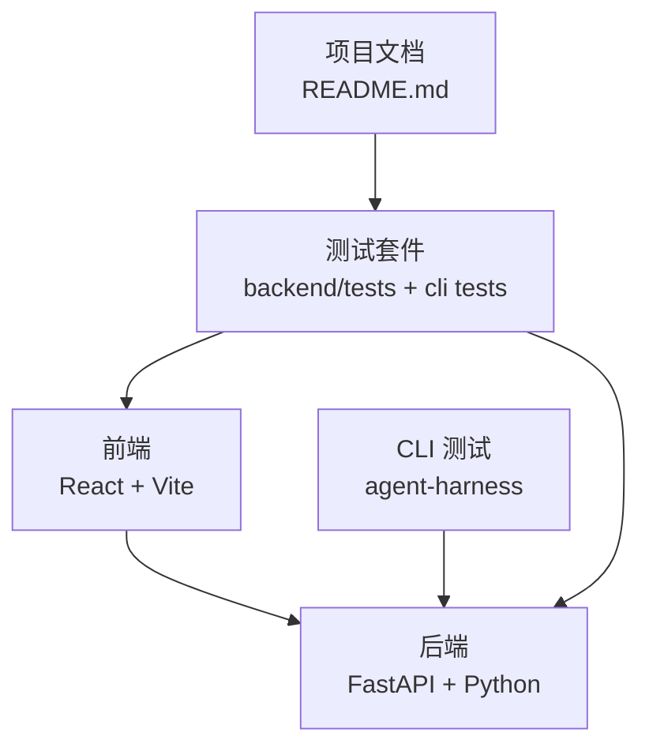
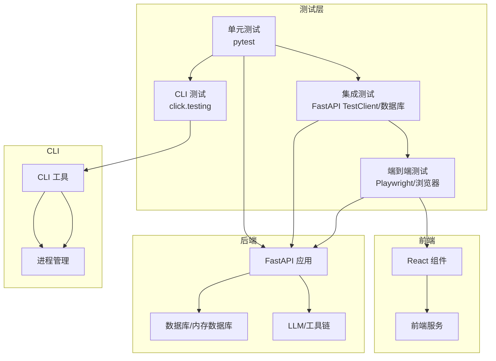
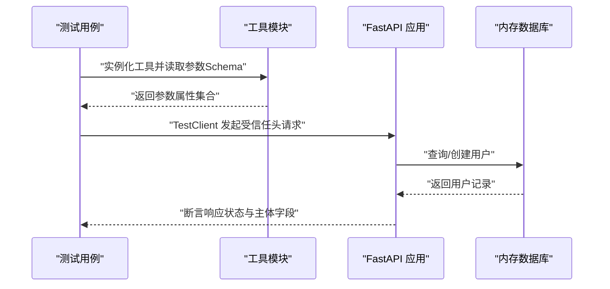
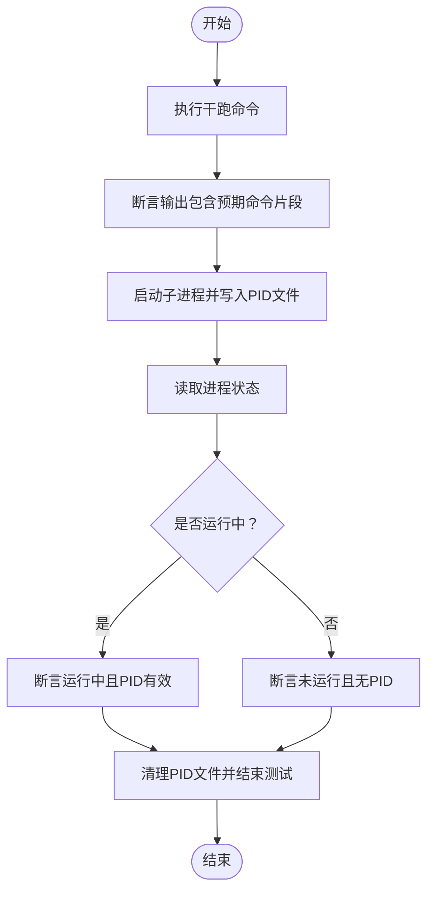
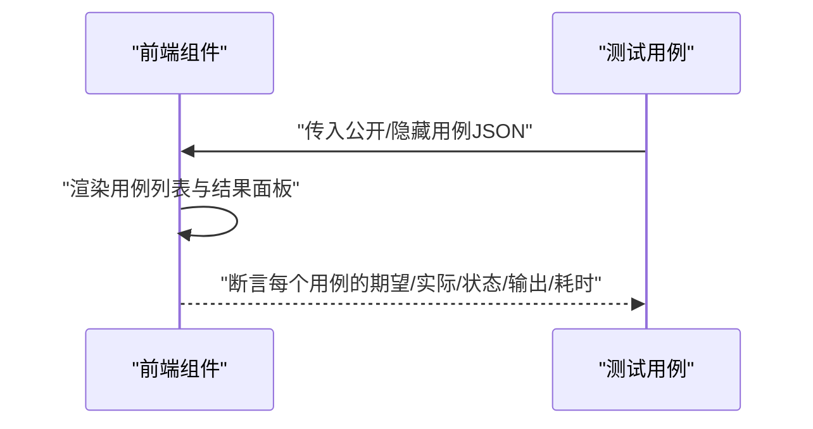
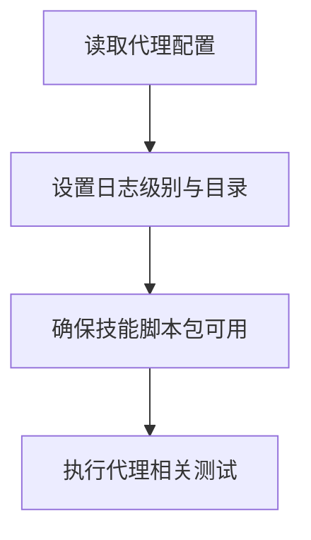
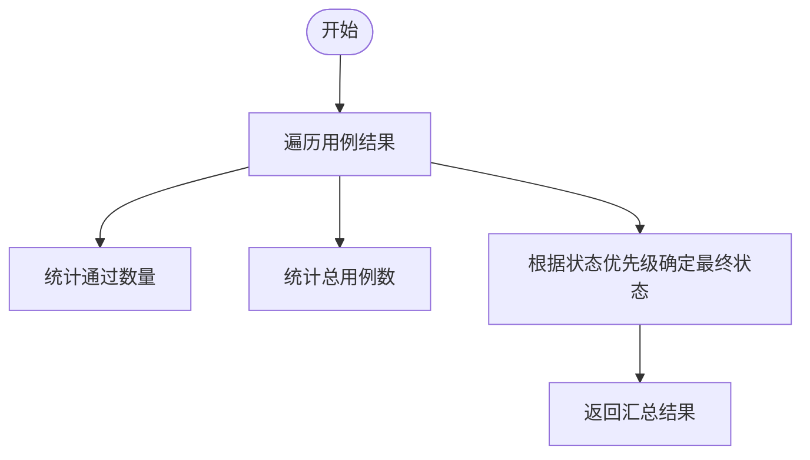
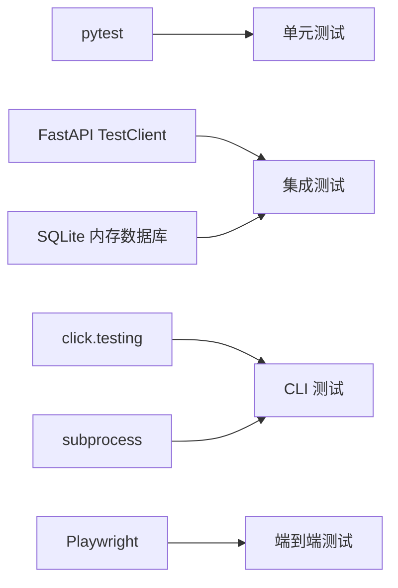

# 测试指南

<cite>
**本文引用的文件**
- [README.md](file://README.md)
- [requirements.txt](file://requirements.txt)
- [backend/tests/test_generate_resume_tool.py](file://backend/tests/test_generate_resume_tool.py)
- [backend/tests/test_better_auth_users.py](file://backend/tests/test_better_auth_users.py)
- [agent-harness/cli_anything/resume_agent/tests/test_core.py](file://agent-harness/cli_anything/resume_agent/tests/test_core.py)
- [agent-harness/cli_anything/resume_agent/tests/test_process_manager.py](file://agent-harness/cli_anything/resume_agent/tests/test_process_manager.py)
- [frontend/package.json](file://frontend/package.json)
- [backend/agent/config.py](file://backend/agent/config.py)
- [backend/agent/skills/office-files/docx/scripts/__init__.py](file://backend/agent/skills/office-files/docx/scripts/__init__.py)
- [backend/services/leetcode_runner.py](file://backend/services/leetcode_runner.py)
- [frontend/src/pages/LeetCode/components/ProblemWorkspacePage.tsx](file://frontend/src/pages/LeetCode/components/ProblemWorkspacePage.tsx)
- [frontend/src/pages/LeetCode/components/ProblemEditorForm.tsx](file://frontend/src/pages/LeetCode/components/ProblemEditorForm.tsx)
</cite>

## 目录
1. 引言
2. 项目结构
3. 核心组件
4. 架构总览
5. 详细组件分析
6. 依赖关系分析
7. 性能考虑
8. 故障排查指南
9. 结论
10. 附录

## 引言
本测试指南面向 Resume-Agent 项目的开发与维护团队，系统阐述如何在该全栈项目中开展高质量测试，覆盖单元测试、集成测试与端到端测试，并结合测试金字塔原则给出分层策略、覆盖率目标与测试数据管理方法。同时，针对 Python 后端（FastAPI）、React 前端、以及 AI 代理功能，提供具体的测试方法、模拟对象使用与测试环境配置建议；并补充性能测试、安全测试与兼容性测试要点，以及 CI/CD 中的测试自动化与测试报告生成实践。

## 项目结构
- 后端采用 FastAPI + Python，核心业务位于 backend/agent 与 backend/services，测试集中在 backend/tests。
- 前端基于 React + TypeScript + Vite，测试相关依赖集中在 frontend/package.json 的开发依赖中。
- CLI 测试位于 agent-harness/cli_anything/resume_agent/tests，用于验证命令行工具与进程状态。
- 项目根 README 提供了启动方式与测试建议，便于开发者快速定位测试入口。

图示来源
- [README.md:71-86](file://README.md#L71-L86)
- [requirements.txt:1-90](file://requirements.txt#L1-L90)
- [frontend/package.json:1-66](file://frontend/package.json#L1-L66)

章节来源
- [README.md:52-86](file://README.md#L52-L86)
- [requirements.txt:1-90](file://requirements.txt#L1-L90)
- [frontend/package.json:1-66](file://frontend/package.json#L1-L66)

## 核心组件
- 后端测试基线
  - 使用 pytest 运行 backend/tests 下的测试用例，覆盖工具参数校验、数据库与认证中间件行为、LaTeX 导出相关逻辑等。
  - 示例：工具 Schema 校验、BetterAuth 用户解析与复用、内部信任头访问接口等。
- CLI 测试基线
  - 使用 click.testing.CliRunner 验证命令行子命令输出与 JSON 模式，以及进程状态与 PID 文件处理。
- 前端测试基线
  - 基于 Vite 的开发与构建脚本，结合 LeetCode 练习页面的测试用例展示逻辑，指导前端组件测试与交互验证。

章节来源
- [backend/tests/test_generate_resume_tool.py:1-41](file://backend/tests/test_generate_resume_tool.py#L1-L41)
- [backend/tests/test_better_auth_users.py:1-98](file://backend/tests/test_better_auth_users.py#L1-L98)
- [agent-harness/cli_anything/resume_agent/tests/test_core.py:1-99](file://agent-harness/cli_anything/resume_agent/tests/test_core.py#L1-L99)
- [agent-harness/cli_anything/resume_agent/tests/test_process_manager.py:1-49](file://agent-harness/cli_anything/resume_agent/tests/test_process_manager.py#L1-L49)
- [frontend/package.json:1-66](file://frontend/package.json#L1-L66)

## 架构总览
下图展示了测试在系统中的位置与交互关系：前端组件与后端 API 在本地联调，CLI 工具负责进程生命周期与状态检查，测试套件贯穿三层以保证质量。

图示来源
- [backend/tests/test_better_auth_users.py:59-98](file://backend/tests/test_better_auth_users.py#L59-L98)
- [agent-harness/cli_anything/resume_agent/tests/test_core.py:10-80](file://agent-harness/cli_anything/resume_agent/tests/test_core.py#L10-L80)
- [agent-harness/cli_anything/resume_agent/tests/test_process_manager.py:13-49](file://agent-harness/cli_anything/resume_agent/tests/test_process_manager.py#L13-L49)

## 详细组件分析

### 后端单元测试与集成测试
- 工具参数 Schema 校验
  - 目标：确保工具定义的参数名与类型满足预期，避免运行期错误。
  - 方法：直接加载工具模块进行实例化与断言。
- 数据库与认证中间件
  - 目标：验证用户解析、复用与受信任头访问接口的行为。
  - 方法：使用内存 SQLite 与 SQLAlchemy 会话，构造 BetterAuth 用户资料，断言用户创建与复用逻辑；通过 TestClient 发送带受信任头的请求，断言响应状态与主体字段。
- 内存数据库与会话
  - 目标：在无外部数据库依赖的情况下稳定运行测试。
  - 方法：使用静态池连接 SQLite 内存数据库，手动创建表结构，注入依赖覆盖实现。

图示来源
- [backend/tests/test_generate_resume_tool.py:35-41](file://backend/tests/test_generate_resume_tool.py#L35-L41)
- [backend/tests/test_better_auth_users.py:25-57](file://backend/tests/test_better_auth_users.py#L25-L57)
- [backend/tests/test_better_auth_users.py:78-98](file://backend/tests/test_better_auth_users.py#L78-L98)

章节来源
- [backend/tests/test_generate_resume_tool.py:1-41](file://backend/tests/test_generate_resume_tool.py#L1-L41)
- [backend/tests/test_better_auth_users.py:1-98](file://backend/tests/test_better_auth_users.py#L1-L98)

### CLI 工具测试
- 命令行输出与 JSON 模式
  - 目标：验证 status、service-status、browser-* 等命令的输出格式与干跑行为。
  - 方法：使用 CliRunner 调用主入口，断言 exit_code 与输出片段。
- 进程状态与 PID 文件
  - 目标：验证进程运行状态检测、PID 文件写入与清理。
  - 方法：启动子进程写入 PID，断言状态为运行中；终止后断言停止。

图示来源
- [agent-harness/cli_anything/resume_agent/tests/test_core.py:10-80](file://agent-harness/cli_anything/resume_agent/tests/test_core.py#L10-L80)
- [agent-harness/cli_anything/resume_agent/tests/test_process_manager.py:13-49](file://agent-harness/cli_anything/resume_agent/tests/test_process_manager.py#L13-L49)

章节来源
- [agent-harness/cli_anything/resume_agent/tests/test_core.py:1-99](file://agent-harness/cli_anything/resume_agent/tests/test_core.py#L1-L99)
- [agent-harness/cli_anything/resume_agent/tests/test_process_manager.py:1-49](file://agent-harness/cli_anything/resume_agent/tests/test_process_manager.py#L1-L49)

### 前端组件测试（React）
- 测试驱动的组件验证
  - 目标：验证 LeetCode 练习页面的“运行”与“提交”结果展示逻辑，确保用例结果、标准输出/错误、耗时等字段正确渲染。
  - 方法：通过组件渲染后的 DOM 片段断言关键节点存在与值匹配。
- 测试数据与用例
  - 目标：为前端组件提供稳定的测试用例数据（公开/隐藏用例 JSON），便于回归验证。
  - 方法：在表单组件中读取/更新用例 JSON 字符串，驱动组件渲染。

图示来源
- [frontend/src/pages/LeetCode/components/ProblemWorkspacePage.tsx:1133-1166](file://frontend/src/pages/LeetCode/components/ProblemWorkspacePage.tsx#L1133-L1166)
- [frontend/src/pages/LeetCode/components/ProblemEditorForm.tsx:144-158](file://frontend/src/pages/LeetCode/components/ProblemEditorForm.tsx#L144-L158)

章节来源
- [frontend/src/pages/LeetCode/components/ProblemWorkspacePage.tsx:1133-1166](file://frontend/src/pages/LeetCode/components/ProblemWorkspacePage.tsx#L1133-L1166)
- [frontend/src/pages/LeetCode/components/ProblemEditorForm.tsx:144-158](file://frontend/src/pages/LeetCode/components/ProblemEditorForm.tsx#L144-L158)

### AI 代理功能测试
- 配置与日志
  - 目标：确保代理配置项（如浏览器、搜索、MCP、网络等）可被测试读取，日志级别与目录可控。
  - 方法：通过配置类属性读取，设置日志级别与目录后执行测试。
- Office 文件技能测试
  - 目标：验证 docx/pdf/pptx/xlsx 等技能在测试环境下的可用性。
  - 方法：将 scripts 目录标记为包，以便相对导入，减少循环依赖问题对测试的影响。

图示来源
- [backend/agent/config.py:492-545](file://backend/agent/config.py#L492-L545)
- [backend/agent/skills/office-files/docx/scripts/__init__.py:1](file://backend/agent/skills/office-files/docx/scripts/__init__.py#L1)

章节来源
- [backend/agent/config.py:492-545](file://backend/agent/config.py#L492-L545)
- [backend/agent/skills/office-files/docx/scripts/__init__.py:1](file://backend/agent/skills/office-files/docx/scripts/__init__.py#L1)

### 性能测试与算法评测
- LeetCode 评测汇总
  - 目标：对算法执行结果进行汇总统计（通过数、总用例数、状态聚合）。
  - 方法：遍历结果数组，计算通过数与总用例数，依据状态优先级确定最终状态。

图示来源
- [backend/services/leetcode_runner.py:127-142](file://backend/services/leetcode_runner.py#L127-L142)

章节来源
- [backend/services/leetcode_runner.py:127-142](file://backend/services/leetcode_runner.py#L127-L142)

## 依赖关系分析
- 后端依赖
  - FastAPI、SQLAlchemy、Alembic、OpenAI、LangChain、Playwright、browser-use 等，为测试提供 API、ORM、LLM、浏览器自动化等能力支撑。
- 前端依赖
  - React、Vite、TypeScript、TailwindCSS、@testing-library（如引入）等，为组件测试与构建提供基础。
- 测试工具链
  - pytest、FastAPI TestClient、click.testing、subprocess、sqlite 内存数据库等，构成测试执行与断言的基础。

图示来源
- [requirements.txt:1-90](file://requirements.txt#L1-L90)
- [frontend/package.json:54-66](file://frontend/package.json#L54-L66)

章节来源
- [requirements.txt:1-90](file://requirements.txt#L1-L90)
- [frontend/package.json:54-66](file://frontend/package.json#L54-L66)

## 性能考虑
- 单元测试优先：保持小而快，避免外部依赖，优先覆盖热点路径与边界条件。
- 集成测试聚焦：使用内存数据库与最小化外部服务，缩短反馈周期。
- 端到端测试节制：仅对关键用户旅程与跨域交互进行 E2E 验证，避免过度脆弱。
- 性能指标：对关键 API 与算法评测增加延迟与吞吐统计，结合 CI 报告追踪回归。
- 并行与隔离：利用 pytest 的并发与分片能力，确保测试互不干扰。

## 故障排查指南
- 日志与配置
  - 设置 LOG_LEVEL、LOG_MODE、LOG_DIR 等环境变量，确保测试日志可收集与定位问题。
- 数据库与会话
  - 使用内存数据库与静态池连接，避免并发写导致的锁冲突；在测试结束后清理表与会话。
- CLI 与进程
  - 检查 PID 文件是否存在、进程是否仍在运行；必要时清理残留文件并重试。
- 前端渲染
  - 关注用例结果面板的节点渲染与文本断言，确保 JSON 输入与输出一致。

章节来源
- [backend/agent/config.py:530-542](file://backend/agent/config.py#L530-L542)
- [agent-harness/cli_anything/resume_agent/tests/test_process_manager.py:13-49](file://agent-harness/cli_anything/resume_agent/tests/test_process_manager.py#L13-L49)

## 结论
通过分层测试策略与现有测试基线，Resume-Agent 可在快速迭代的同时维持稳定性。建议持续完善覆盖率、优化测试执行效率，并在 CI 中引入自动化报告与回归监控，确保质量门禁与交付节奏的平衡。

## 附录

### 测试金字塔与覆盖率建议
- 单元测试（70%+）：重点覆盖工具参数、业务规则、数据转换与边界条件。
- 集成测试（20%）：覆盖 API 行为、数据库交互、认证中间件与外部服务适配。
- 端到端测试（10%）：覆盖关键用户旅程与跨域交互，如简历生成与导出流程。

### 测试数据管理
- 使用内存数据库与固定种子数据，确保可重复性。
- 对外部服务（LLM、OCR、PDF 渲染）使用桩/假实现或本地镜像，降低不可用风险。

### 模拟对象与依赖注入
- 使用 monkeypatch 注入环境变量与依赖覆盖，隔离外部状态。
- 在 FastAPI 中使用 dependency_overrides 注入测试用会话。

### 测试环境配置
- 后端：设置 LOG_LEVEL/INFO、LOG_DIR/logs、数据库连接字符串为内存数据库。
- 前端：使用 Vite 开发服务器，按需启用热更新与源码映射。
- CLI：准备临时目录存放 PID 与日志文件，确保权限与路径正确。

### CI/CD 中的测试自动化与报告
- 在流水线中分阶段执行单元、集成与端到端测试，失败即阻断。
- 生成并归档测试报告（HTML/XML），结合覆盖率工具输出趋势图。