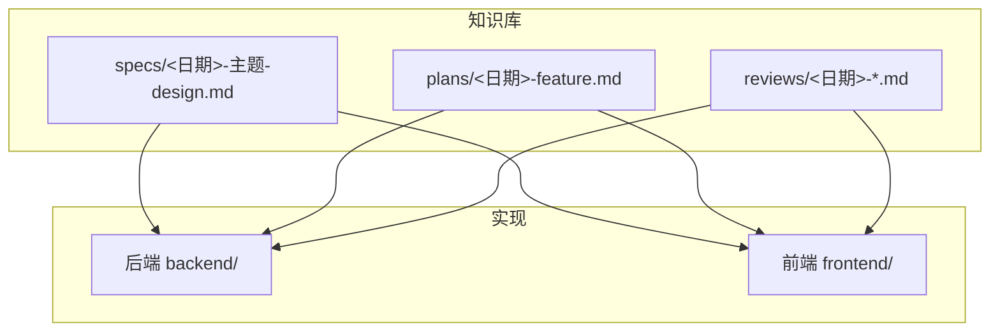
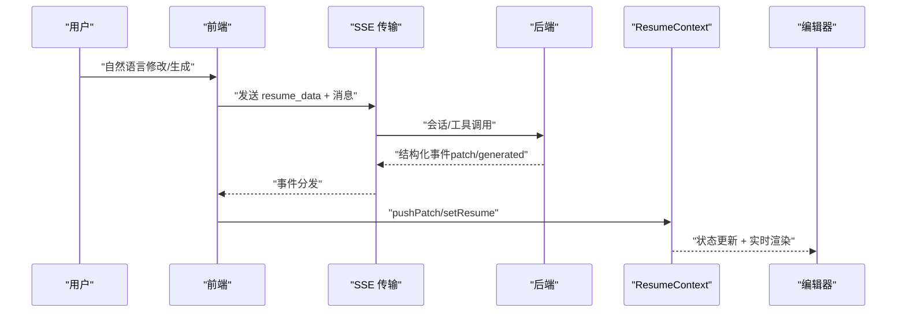
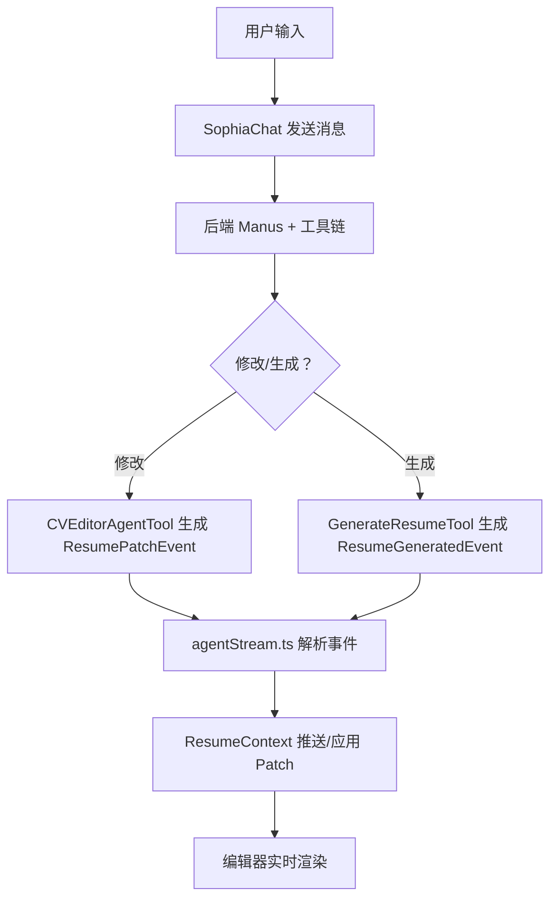
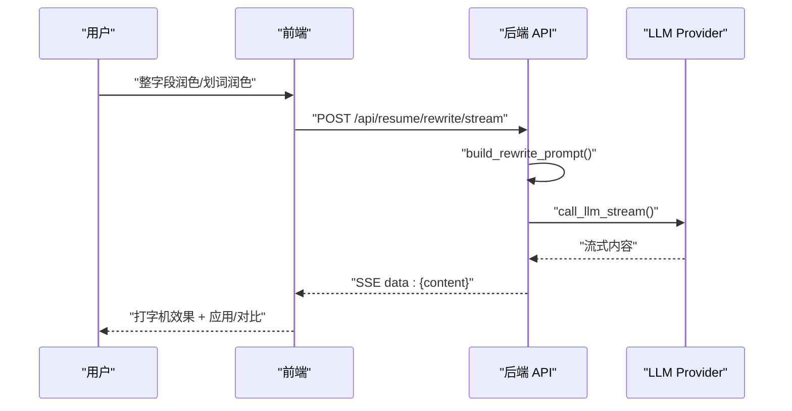
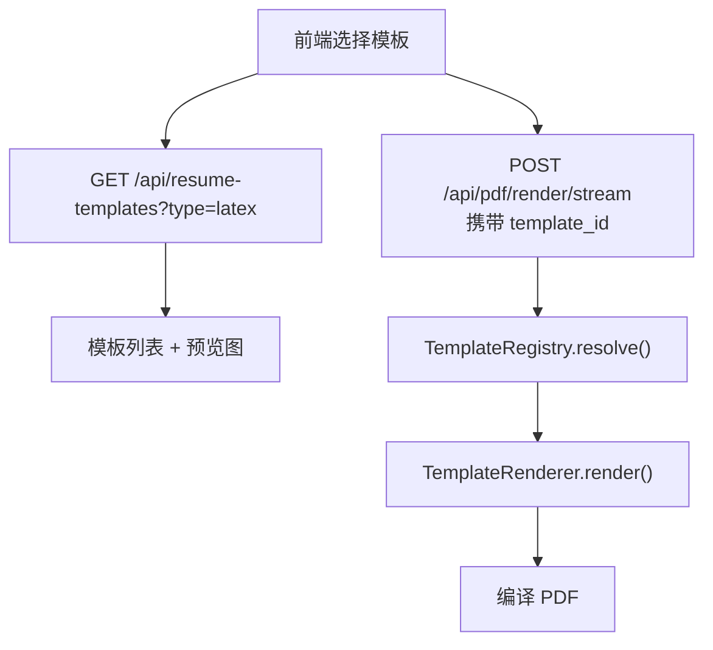
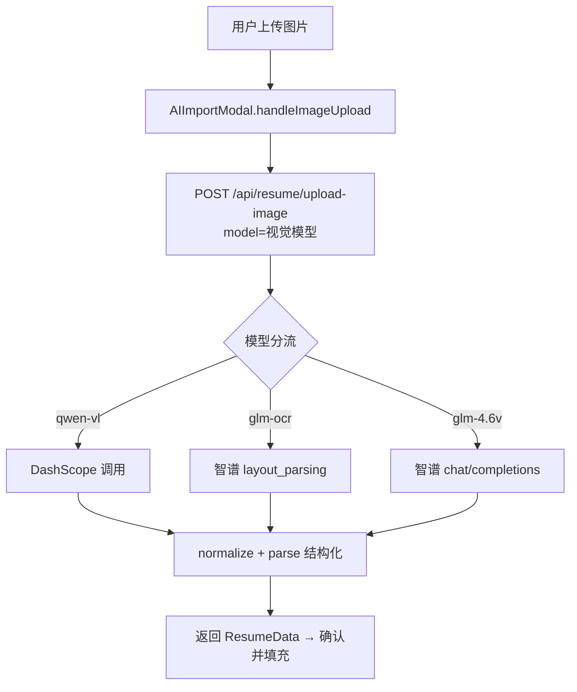
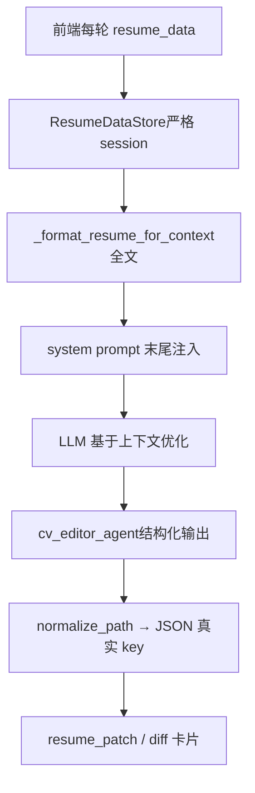
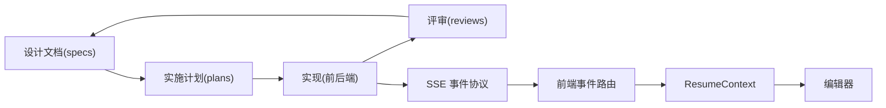

# 设计文档

<cite>
**本文引用的文件**
- [2026-03-23-nl-resume-refactor-design.md](file://knowledge-base/specs/2026-03-23-nl-resume-refactor-design.md)
- [2026-03-31-ai-polish-architecture.md](file://knowledge-base/specs/2026-03-31-ai-polish-architecture.md)
- [2026-03-31-polish-chat-design.md](file://knowledge-base/specs/2026-03-31-polish-chat-design.md)
- [2026-05-21-latex-template-gallery-design.md](file://knowledge-base/specs/2026-05-21-latex-template-gallery-design.md)
- [2026-06-19-image-resume-import-design.md](file://knowledge-base/specs/2026-06-19-image-resume-import-design.md)
- [2026-03-24-nl-resume-refactor.md](file://knowledge-base/plans/2026-03-24-nl-resume-refactor.md)
- [2026-05-10-leetcode-practice-system.md](file://knowledge-base/plans/2026-05-10-leetcode-practice-system.md)
- [2026-03-24-nl-resume-refactor-review.md](file://knowledge-base/reviews/2026-03-24-nl-resume-refactor-review.md)
- [2026-06-18-ai-enhance-batch2-review.md](file://knowledge-base/reviews/2026-06-18-ai-enhance-batch2-review.md)
- [resume-reader-hybrid-refactor.md](file://docs/resume-reader-hybrid-refactor.md)
- [DESIGN.md](file://.agents/skills/stitch-design-taste/DESIGN.md)
- [AGENTS.md](file://AGENTS.md)
- [CLAUDE.md](file://CLAUDE.md)
- [CODEX.md](file://CODEX.md)
</cite>

## 目录
1. [简介](#简介)
2. [项目结构](#项目结构)
3. [核心组件](#核心组件)
4. [架构总览](#架构总览)
5. [详细组件分析](#详细组件分析)
6. [依赖分析](#依赖分析)
7. [性能考量](#性能考量)
8. [故障排查指南](#故障排查指南)
9. [结论](#结论)
10. [附录](#附录)

## 简介
本指南面向 ResumeAgent 项目的设计文档编写与管理，系统化梳理架构设计文档、功能设计文档与技术方案的模板与规范，明确需求评审流程、技术决策记录与设计变更管理机制，并结合现有案例（简历重构设计、AI 润色架构、LaTeX 模板广场、图片简历导入等）进行深入分析。同时提供设计文档质量评估标准、评审流程与版本管理策略，涵盖设计模式应用、技术选型依据与风险评估方法，帮助团队在持续演进中保持一致性、可追溯性与可维护性。

## 项目结构
- 知识库集中存放于 knowledge-base/，包含三类文档：
  - specs：架构/功能设计文档（YYYY-MM-DD-topic-design.md）
  - plans：实施计划（YYYY-MM-DD-feature.md）
  - reviews：评审与操作记录（YYYY-MM-DD-*.md）
- 文档与实现遵循“先文档、后实现、再评审”的闭环流程，确保设计、计划、评审与操作记录同步沉淀至知识库。

**图表来源**
- [AGENTS.md:1-45](file://AGENTS.md#L1-L45)
- [CLAUDE.md:367-380](file://CLAUDE.md#L367-L380)

**章节来源**
- [AGENTS.md:8-14](file://AGENTS.md#L8-L14)
- [CLAUDE.md:230-247](file://CLAUDE.md#L230-L247)

## 核心组件
- 设计文档（Specs）
  - 用途：定义目标、范围、数据模型、事件协议、前后端接口、UI 组件与交互、技术选型与约束、风险与验证清单。
  - 示例：简历重构设计、AI 润色架构、LaTeX 模板广场、图片简历导入。
- 实施计划（Plans）
  - 用途：将设计拆解为可执行的任务清单、文件映射、关键代码约定、里程碑与验证步骤。
  - 示例：自然语言简历重构实施计划、LeetCode 刷题系统实施计划。
- 评审与操作记录（Reviews）
  - 用途：记录实施状态、端到端验证发现的问题与修复、遗留风险与下一步建议。
  - 示例：简历重构复盘、AI 能力增强批次评审。

**章节来源**
- [2026-03-23-nl-resume-refactor-design.md:1-451](file://knowledge-base/specs/2026-03-23-nl-resume-refactor-design.md#L1-L451)
- [2026-03-31-ai-polish-architecture.md:1-245](file://knowledge-base/specs/2026-03-31-ai-polish-architecture.md#L1-L245)
- [2026-05-21-latex-template-gallery-design.md:1-371](file://knowledge-base/specs/2026-05-21-latex-template-gallery-design.md#L1-L371)
- [2026-06-19-image-resume-import-design.md:1-154](file://knowledge-base/specs/2026-06-19-image-resume-import-design.md#L1-L154)
- [2026-03-24-nl-resume-refactor.md:1-800](file://knowledge-base/plans/2026-03-24-nl-resume-refactor.md#L1-L800)
- [2026-05-10-leetcode-practice-system.md:1-412](file://knowledge-base/plans/2026-05-10-leetcode-practice-system.md#L1-L412)
- [2026-03-24-nl-resume-refactor-review.md:1-90](file://knowledge-base/reviews/2026-03-24-nl-resume-refactor-review.md#L1-L90)
- [2026-06-18-ai-enhance-batch2-review.md:1-47](file://knowledge-base/reviews/2026-06-18-ai-enhance-batch2-review.md#L1-L47)

## 架构总览
- 事件驱动与结构化协议
  - 后端通过结构化事件（如 ResumePatchEvent、ResumeGeneratedEvent）替代嵌入式 markdown diff，前端以 SSE 事件路由到共享状态（ResumeContext），实现 Chat 与编辑器并排、实时 diff 审批与应用。
- 前后端协作
  - 前端负责 UI 交互与状态管理，后端负责工具链与事件生成；二者通过标准化事件与接口契约协同。
- 可扩展性与演进
  - 通过插件化模板渲染器（LaTeX 模板广场）、可插拔 AI Provider（AI 润色）、可扩展的事件类型（ResumePatch/Generated）支撑持续演进。

**图表来源**
- [2026-03-23-nl-resume-refactor-design.md:313-377](file://knowledge-base/specs/2026-03-23-nl-resume-refactor-design.md#L313-L377)
- [2026-03-23-nl-resume-refactor-design.md:141-227](file://knowledge-base/specs/2026-03-23-nl-resume-refactor-design.md#L141-L227)

**章节来源**
- [2026-03-23-nl-resume-refactor-design.md:28-451](file://knowledge-base/specs/2026-03-23-nl-resume-refactor-design.md#L28-L451)

## 详细组件分析

### 组件A：自然语言简历修改与生成（简历重构设计）
- 目标与范围
  - 支持自然语言修改、从零生成、JD 优化；采用 Diff 审批模式与并排显示。
- 数据模型与转换
  - 统一使用 ResumeData 作为权威格式，提供 toResumeData 转换函数与迁移策略。
- 事件协议与前端状态
  - 新增 ResumePatchEvent/ResumeGeneratedEvent，前端 ResumeContext 管理 pendingPatches 与应用逻辑，set-by-path 精确写入避免数组覆盖。
- 完整数据流
  - 自然语言修改、从零生成、JD 优化三条主线，均通过 SSE 事件与前端路由实现闭环。

**图表来源**
- [2026-03-23-nl-resume-refactor-design.md:313-377](file://knowledge-base/specs/2026-03-23-nl-resume-refactor-design.md#L313-L377)
- [2026-03-23-nl-resume-refactor-design.md:232-311](file://knowledge-base/specs/2026-03-23-nl-resume-refactor-design.md#L232-L311)

**章节来源**
- [2026-03-23-nl-resume-refactor-design.md:28-451](file://knowledge-base/specs/2026-03-23-nl-resume-refactor-design.md#L28-L451)
- [2026-03-24-nl-resume-refactor.md:42-71](file://knowledge-base/plans/2026-03-24-nl-resume-refactor.md#L42-L71)
- [2026-03-24-nl-resume-refactor-review.md:10-90](file://knowledge-base/reviews/2026-03-24-nl-resume-refactor-review.md#L10-L90)

### 组件B：AI 润色功能（整体架构与对话式重构）
- 功能概述
  - 整字段润色与划词润色两类入口，支持多轮对话、字段感知、快捷标签与复合意图。
- 架构与数据流
  - 前端 SSE 流式调用后端 /api/resume/rewrite/stream，后端 build_rewrite_prompt + call_llm_stream，SSE 返回增量内容。
- 复合意图与 Provider 配置
  - 划词链路支持 rewrite + bold/remove/list 等复合意图；支持 deepseek/zhipu/doubao Provider 切换。
- 已知问题与修复
  - 硬编码 Provider、useTypewriter 初始延迟重复触发、onComplete 双次调用等问题已修复。

**图表来源**
- [2026-03-31-ai-polish-architecture.md:50-77](file://knowledge-base/specs/2026-03-31-ai-polish-architecture.md#L50-L77)
- [2026-03-31-ai-polish-architecture.md:127-176](file://knowledge-base/specs/2026-03-31-ai-polish-architecture.md#L127-L176)

**章节来源**
- [2026-03-31-ai-polish-architecture.md:1-245](file://knowledge-base/specs/2026-03-31-ai-polish-architecture.md#L1-L245)
- [2026-03-31-polish-chat-design.md:1-111](file://knowledge-base/specs/2026-03-31-polish-chat-design.md#L1-L111)
- [2026-06-18-ai-enhance-batch2-review.md:18-47](file://knowledge-base/reviews/2026-06-18-ai-enhance-batch2-review.md#L18-L47)

### 组件C：LaTeX 模板广场设计
- 目标与范围
  - 新增独立 LaTeX 模板广场，支持模板列表、预览、按模板渲染 PDF；兼容现有 ResumeData。
- 推荐架构
  - 每套模板独立 Renderer，通过 TemplateRegistry 解析与渲染；后端新增 /api/resume-templates?type=latex。
- 前后端契约
  - RenderPDFRequest 扩展 template_id；前端请求体包含 template_id 与 section_order；后端兼容 classic 模板。

**图表来源**
- [2026-05-21-latex-template-gallery-design.md:95-104](file://knowledge-base/specs/2026-05-21-latex-template-gallery-design.md#L95-L104)
- [2026-05-21-latex-template-gallery-design.md:106-181](file://knowledge-base/specs/2026-05-21-latex-template-gallery-design.md#L106-L181)

**章节来源**
- [2026-05-21-latex-template-gallery-design.md:1-371](file://knowledge-base/specs/2026-05-21-latex-template-gallery-design.md#L1-L371)

### 组件D：图片解析导入简历设计
- 背景与目标
  - 支持 JPG/PNG 图片上传，通过视觉模型（qwen-vl/glm-ocr/glm-4.6v）识别后复用现有结构化解析链路。
- 方案与接口
  - 新增 POST /api/resume/upload-image，前端 FileUploadZone 与 AIImportModal 分流；后端 image_to_text + recognize_with_ocr。
- 错误处理与约束
  - 显式错误反馈（余额不足等），不写 plan-B 回退；限制最大 2 张图片与文件大小。

**图表来源**
- [2026-06-19-image-resume-import-design.md:47-62](file://knowledge-base/specs/2026-06-19-image-resume-import-design.md#L47-L62)
- [2026-06-19-image-resume-import-design.md:91-114](file://knowledge-base/specs/2026-06-19-image-resume-import-design.md#L91-L114)

**章节来源**
- [2026-06-19-image-resume-import-design.md:1-154](file://knowledge-base/specs/2026-06-19-image-resume-import-design.md#L1-L154)

### 组件E：简历读取架构重构（从 Tool-Only 到 Hybrid）
- 背景与问题
  - 读取链路与写链路分离导致“读取内容与 diff 修改前不一致”“新建会话像脏读”等问题。
- Hybrid 方案
  - 每轮将简历全文注入 system prompt，写链路仍走工具与结构化输出；统一 path 规范与会话隔离。
- 验证与风险
  - 补全 formatter、normalize_path、session 隔离与清理钩子；建议回归用例覆盖新会话、patch 应用一致性等。

**图表来源**
- [resume-reader-hybrid-refactor.md:246-261](file://docs/resume-reader-hybrid-refactor.md#L246-L261)
- [resume-reader-hybrid-refactor.md:354-378](file://docs/resume-reader-hybrid-refactor.md#L354-L378)

**章节来源**
- [resume-reader-hybrid-refactor.md:1-465](file://docs/resume-reader-hybrid-refactor.md#L1-L465)

### 组件F：设计系统与风格约束（以 stitch-design-taste 为例）
- 配置与风格
  - 通过 Creativity/Density/Variance/Motion Intent 四个拨片控制创意密度与动画意图；定义色彩、字体、组件样式与布局原则。
- 禁忌与反模式
  - 明确禁止的元素与用法（如纯黑、通用 serif、中心化 Hero、圆形加载等），确保设计一致性与可用性。

**章节来源**
- [.agents/skills/stitch-design-taste/DESIGN.md:1-122](file://.agents/skills/stitch-design-taste/DESIGN.md#L1-L122)

## 依赖分析
- 文档与实现耦合
  - 设计文档（specs）与实施计划（plans）共同指导实现；评审（reviews）验证设计落地与回归。
- 组件间依赖
  - ResumeContext 作为共享状态层连接 Chat 与编辑器；SSE 事件类型与前端路由形成解耦；LaTeX 模板渲染器与后端接口契约保证扩展性。
- 外部依赖与集成
  - AI Provider（DashScope/Zhipu/Doubao）、PDF 渲染链路、Office 文件处理（OOXML）等外部能力通过标准化接口接入。

**图表来源**
- [CLAUDE.md:367-380](file://CLAUDE.md#L367-L380)
- [2026-03-23-nl-resume-refactor-design.md:141-227](file://knowledge-base/specs/2026-03-23-nl-resume-refactor-design.md#L141-L227)

**章节来源**
- [CLAUDE.md:230-247](file://CLAUDE.md#L230-L247)
- [2026-03-23-nl-resume-refactor-design.md:380-451](file://knowledge-base/specs/2026-03-23-nl-resume-refactor-design.md#L380-L451)

## 性能考量
- SSE 事件与前端渲染
  - set-by-path 精确写入避免 deepMerge 带来的数组覆盖与大规模重渲染；批量应用 patch 合并为一次 set，减少副作用级联。
- 流式渲染与打字机效果
  - useTypewriter 与 SSE 流式返回配合，降低首屏等待；注意初始延迟与 onComplete 去重，避免重复触发。
- 模板渲染与 PDF 编译
  - 每套模板独立 Renderer，避免单模板生成器复杂分支；模板预览图与 preview 接口减少不必要的编译。

[本节为通用指导，无需引用具体文件]

## 故障排查指南
- 端到端验证与问题修复
  - 端到端验证发现的典型问题包括：前端数据双重嵌套、后端遗留孤立 tool message、前端错误状态丢失、SSE 流崩溃、有序列表渲染异常、LaTeX 渲染 Markdown 原文泄露等，均已记录在评审文档中并提供修复提交。
- 建议的回归用例
  - 新开会话 → 选简历 → “读取开源经历”应含完整 description；优化后 diff 修改前与上一步看到的原文一致；应用 patch 后编辑器与再次“读取”一致；检查 JSON 不应新增小写 openSource 数组。

**章节来源**
- [2026-03-24-nl-resume-refactor-review.md:27-90](file://knowledge-base/reviews/2026-03-24-nl-resume-refactor-review.md#L27-L90)
- [resume-reader-hybrid-refactor.md:413-421](file://docs/resume-reader-hybrid-refactor.md#L413-L421)

## 结论
通过规范化的设计文档模板与评审流程、严格的事件协议与状态管理、可扩展的架构设计（如 LaTeX 模板渲染器与 AI Provider），ResumeAgent 在自然语言简历修改、AI 润色、模板广场与图片导入等场景中实现了高一致性与可维护性。建议持续完善设计文档质量评估标准、版本管理策略与风险评估方法，确保每次变更均可追溯、可验证、可回滚。

[本节为总结性内容，无需引用具体文件]

## 附录

### 设计文档模板与编写规范
- 标题与元信息
  - 标题：[日期]-[主题]-design.md；包含日期、状态、分支等元信息。
- 结构建议
  - 背景、目标、范围、数据模型、事件协议、前后端接口、UI 组件与交互、技术选型与约束、风险与验证清单。
- 示例参考
  - 简历重构设计、AI 润色架构、LaTeX 模板广场、图片简历导入。

**章节来源**
- [2026-03-23-nl-resume-refactor-design.md:1-451](file://knowledge-base/specs/2026-03-23-nl-resume-refactor-design.md#L1-L451)
- [2026-03-31-ai-polish-architecture.md:1-245](file://knowledge-base/specs/2026-03-31-ai-polish-architecture.md#L1-L245)
- [2026-05-21-latex-template-gallery-design.md:1-371](file://knowledge-base/specs/2026-05-21-latex-template-gallery-design.md#L1-L371)
- [2026-06-19-image-resume-import-design.md:1-154](file://knowledge-base/specs/2026-06-19-image-resume-import-design.md#L1-L154)

### 需求评审流程与技术决策记录
- 评审流程
  - 设计文档 → 实施计划 → 实现 → 评审与操作记录 → 知识库沉淀。
- 技术决策记录
  - 明确 Provider 选择、事件类型扩展、路径别名与会话隔离等关键决策及其依据。

**章节来源**
- [CLAUDE.md:367-380](file://CLAUDE.md#L367-L380)
- [2026-03-24-nl-resume-refactor-review.md:70-90](file://knowledge-base/reviews/2026-03-24-nl-resume-refactor-review.md#L70-L90)
- [resume-reader-hybrid-refactor.md:402-432](file://docs/resume-reader-hybrid-refactor.md#L402-L432)

### 设计变更管理
- 版本管理策略
  - 设计文档与评审记录进入 knowledge-base/，避免散落临时目录；实现影响架构、接口、Agent 流程、PDF 链路或用户流程时同步更新知识库。
- 变更追踪
  - 通过提交号与文件对照，确保变更可追溯；遗留风险与下一步建议纳入评审记录。

**章节来源**
- [CLAUDE.md:230-247](file://CLAUDE.md#L230-L247)
- [2026-03-24-nl-resume-refactor.md:348-450](file://knowledge-base/plans/2026-03-24-nl-resume-refactor.md#L348-L450)

### 设计模式应用与技术选型依据
- 设计模式
  - 事件驱动与结构化协议（ResumePatchEvent/ResumeGeneratedEvent）、共享状态（ResumeContext）、Hybrid 读取（注入上下文 + 工具写回）。
- 技术选型
  - SSE 流式传输、React Context 状态管理、多 Provider 的 AI 能力接入、模板插件化渲染器。

**章节来源**
- [2026-03-23-nl-resume-refactor-design.md:141-227](file://knowledge-base/specs/2026-03-23-nl-resume-refactor-design.md#L141-L227)
- [2026-03-31-ai-polish-architecture.md:104-126](file://knowledge-base/specs/2026-03-31-ai-polish-architecture.md#L104-L126)
- [resume-reader-hybrid-refactor.md:246-261](file://docs/resume-reader-hybrid-refactor.md#L246-L261)

### 风险评估方法
- 风险识别
  - Token 增加、System 过长、Path 别名不全、前端未传 resume_data、PDF 渲染失败等。
- 缓解措施
  - 监控 token 与长度、扩展 PATH_ALIASES、产品层保证首包带数据、模板预览图与安全校验。
- 验证清单
  - 新会话读取一致性、patch 应用一致性、JSON 字段正确性等。

**章节来源**
- [resume-reader-hybrid-refactor.md:402-421](file://docs/resume-reader-hybrid-refactor.md#L402-L421)
- [2026-06-19-image-resume-import-design.md:115-121](file://knowledge-base/specs/2026-06-19-image-resume-import-design.md#L115-L121)