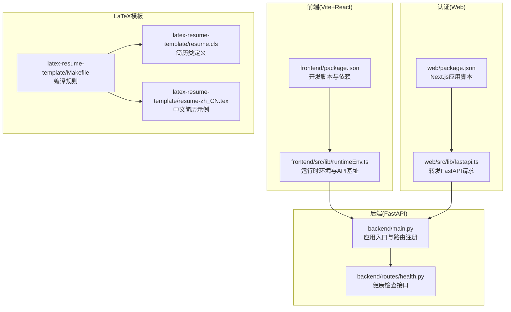
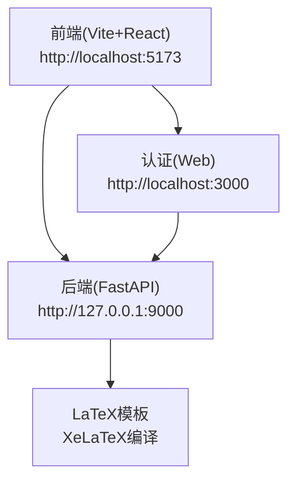
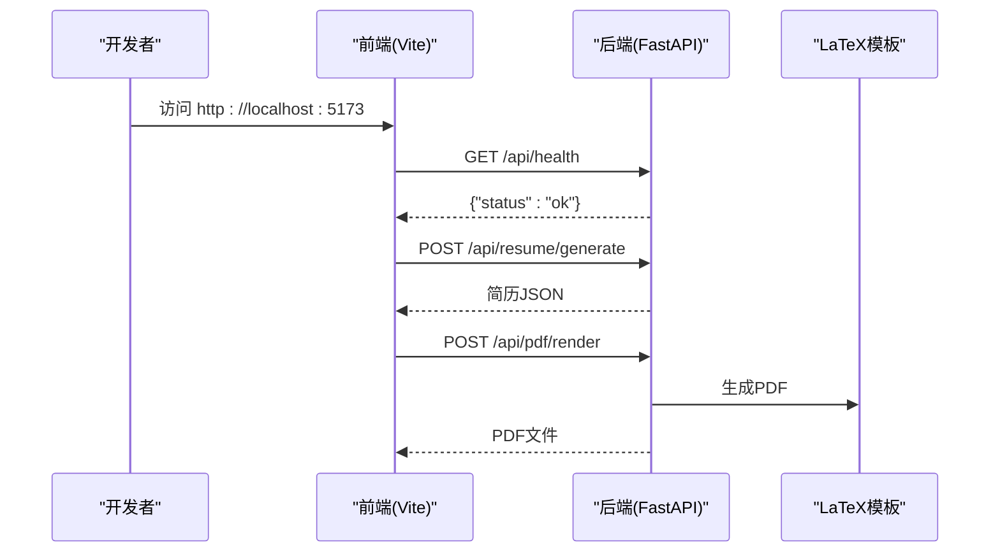
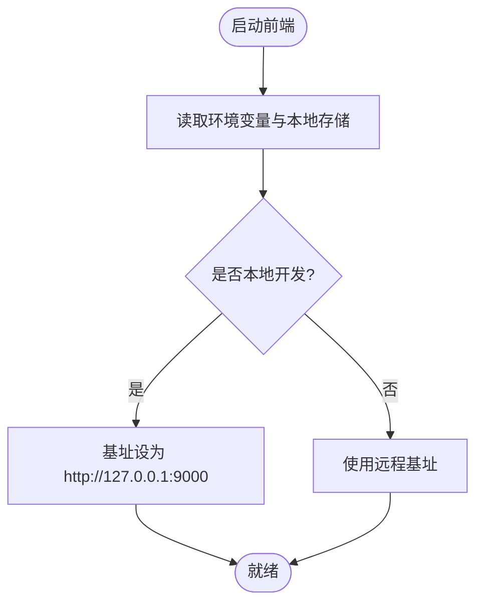
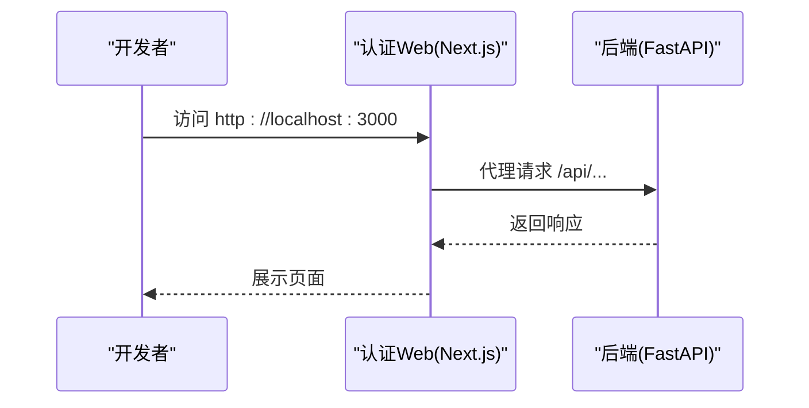
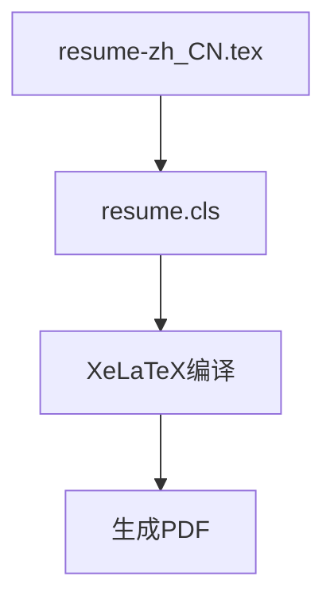
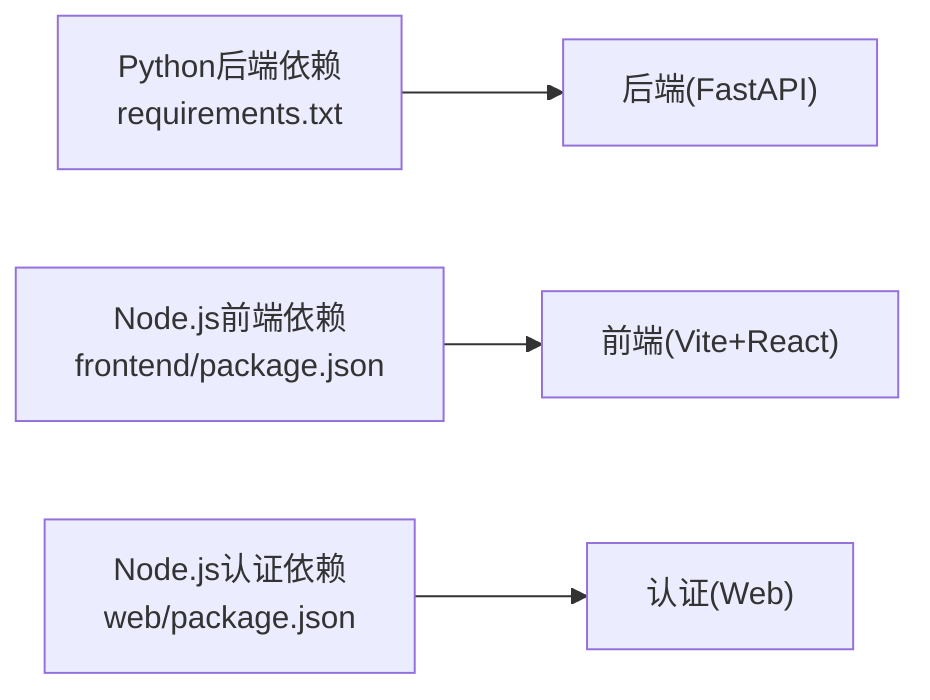

# 快速开始

<cite>
**本文引用的文件**
- [requirements.txt](file://requirements.txt)
- [backend/main.py](file://backend/main.py)
- [backend/routes/health.py](file://backend/routes/health.py)
- [frontend/package.json](file://frontend/package.json)
- [frontend/src/lib/runtimeEnv.ts](file://frontend/src/lib/runtimeEnv.ts)
- [web/package.json](file://web/package.json)
- [web/src/lib/fastapi.ts](file://web/src/lib/fastapi.ts)
- [latex-resume-template/Makefile](file://latex-resume-template/Makefile)
- [latex-resume-template/resume.cls](file://latex-resume-template/resume.cls)
- [latex-resume-template/resume-zh_CN.tex](file://latex-resume-template/resume-zh_CN.tex)
- [config.toml](file://config.toml)
- [scripts/bootstrap-auth-env.sh](file://scripts/bootstrap-auth-env.sh)
- [scripts/dev-auth-web.sh](file://scripts/dev-auth-web.sh)
- [auth-stack.env.example](file://auth-stack.env.example)
</cite>

## 目录
1. [简介](#简介)
2. [项目结构](#项目结构)
3. [核心组件](#核心组件)
4. [架构总览](#架构总览)
5. [详细组件分析](#详细组件分析)
6. [依赖分析](#依赖分析)
7. [性能考虑](#性能考虑)
8. [故障排除指南](#故障排除指南)
9. [结论](#结论)
10. [附录](#附录)

## 简介
本指南面向新手开发者，帮助你在最短时间内搭建并运行 Resume-Agent 项目。你将学到：
- 环境要求与前置条件（Python、Node.js、XeLaTeX、中文字体）
- 依赖安装与环境配置
- 后端 FastAPI 服务与前端 React 应用的完整启动流程
- 访问地址与 OpenAPI 文档位置
- 开发验证步骤与常见问题解决方案

## 项目结构
项目采用前后端分离架构：
- 后端：基于 FastAPI 的 Python 服务，提供健康检查、简历生成、PDF 渲染、认证与代理等接口
- 前端：基于 Vite + React 的 Web 应用，负责简历编辑、预览与导出
- 认证：Next.js + BetterAuth 提供认证与会话管理
- LaTeX 模板：XeLaTeX 支持中文字体渲染简历 PDF

图表来源
- [backend/main.py:1-326](file://backend/main.py#L1-L326)
- [backend/routes/health.py:1-13](file://backend/routes/health.py#L1-L13)
- [frontend/package.json:1-66](file://frontend/package.json#L1-L66)
- [frontend/src/lib/runtimeEnv.ts:1-161](file://frontend/src/lib/runtimeEnv.ts#L1-L161)
- [web/package.json:1-39](file://web/package.json#L1-L39)
- [web/src/lib/fastapi.ts:1-25](file://web/src/lib/fastapi.ts#L1-L25)
- [latex-resume-template/Makefile:1-26](file://latex-resume-template/Makefile#L1-L26)
- [latex-resume-template/resume.cls:1-125](file://latex-resume-template/resume.cls#L1-L125)
- [latex-resume-template/resume-zh_CN.tex:1-110](file://latex-resume-template/resume-zh_CN.tex#L1-L110)

章节来源
- [backend/main.py:1-326](file://backend/main.py#L1-L326)
- [frontend/package.json:1-66](file://frontend/package.json#L1-L66)
- [web/package.json:1-39](file://web/package.json#L1-L39)
- [latex-resume-template/Makefile:1-26](file://latex-resume-template/Makefile#L1-L26)

## 核心组件
- 后端 FastAPI 应用入口与路由注册
  - 应用标题为“Resume API”，内置健康检查、配置、简历、PDF、分享、认证、LeetCode、账单等路由
  - 支持可选的 TTS 路由与反向代理到 Agent 后端
  - 启动时进行日志初始化、数据库连接预热、Logo 自动同步与 tiktoken 预加载
  - 启动命令与端口参考：[backend/main.py:318-326](file://backend/main.py#L318-L326)
- 前端 Vite + React 应用
  - 开发脚本提供本地主机监听，支持热更新
  - 运行时环境通过环境变量与本地存储控制 API 基址与功能开关
  - 参考：[frontend/package.json:6-11](file://frontend/package.json#L6-L11)、[frontend/src/lib/runtimeEnv.ts:55-65](file://frontend/src/lib/runtimeEnv.ts#L55-L65)
- 认证 Web（Next.js + BetterAuth）
  - 提供认证页面与 FastAPI 请求代理
  - 通过环境变量配置 FastAPI 基址与鉴权密钥
  - 参考：[web/package.json:5-17](file://web/package.json#L5-L17)、[web/src/lib/fastapi.ts:5-10](file://web/src/lib/fastapi.ts#L5-L10)
- LaTeX 模板与编译
  - Makefile 提供中英文编译目标，依赖 XeLaTeX
  - 中文支持通过外部字体宏包与 Adobe 字体适配
  - 参考：[latex-resume-template/Makefile:7-14](file://latex-resume-template/Makefile#L7-L14)、[latex-resume-template/resume-zh_CN.tex:6](file://latex-resume-template/resume-zh_CN.tex#L6)

章节来源
- [backend/main.py:93-139](file://backend/main.py#L93-L139)
- [frontend/package.json:6-11](file://frontend/package.json#L6-L11)
- [frontend/src/lib/runtimeEnv.ts:55-65](file://frontend/src/lib/runtimeEnv.ts#L55-L65)
- [web/src/lib/fastapi.ts:5-10](file://web/src/lib/fastapi.ts#L5-L10)
- [latex-resume-template/Makefile:7-14](file://latex-resume-template/Makefile#L7-L14)
- [latex-resume-template/resume-zh_CN.tex:6](file://latex-resume-template/resume-zh_CN.tex#L6)

## 架构总览
下图展示了本地开发时的典型交互：前端通过 Vite 开发服务器访问后端 API；认证 Web 作为可选的代理层；LaTeX 模板用于 PDF 渲染。

图表来源
- [frontend/package.json:8](file://frontend/package.json#L8)
- [backend/main.py:318-326](file://backend/main.py#L318-L326)
- [web/package.json:6](file://web/package.json#L6)
- [latex-resume-template/Makefile:13-14](file://latex-resume-template/Makefile#L13-L14)

## 详细组件分析

### 后端 FastAPI 服务
- 启动命令与端口
  - 使用 uvicorn 启动，建议端口 9000
  - 参考：[backend/main.py:318-326](file://backend/main.py#L318-L326)
- 健康检查
  - 路由：GET /api/health
  - 参考：[backend/routes/health.py:9-12](file://backend/routes/health.py#L9-L12)
- 可选 TTS 路由
  - 若安装相关依赖则注册，否则记录警告
  - 参考：[backend/main.py:110-118](file://backend/main.py#L110-L118)
- Agent 代理
  - 当配置 AGENT_BACKEND_BASE_URL 时，将 /api/agent/** 反向代理到上游
  - 参考：[backend/main.py:141-225](file://backend/main.py#L141-L225)

图表来源
- [backend/routes/health.py:9-12](file://backend/routes/health.py#L9-L12)
- [backend/main.py:318-326](file://backend/main.py#L318-L326)
- [latex-resume-template/Makefile:13-14](file://latex-resume-template/Makefile#L13-L14)

章节来源
- [backend/main.py:93-139](file://backend/main.py#L93-L139)
- [backend/main.py:141-225](file://backend/main.py#L141-L225)
- [backend/routes/health.py:9-12](file://backend/routes/health.py#L9-L12)

### 前端 React 应用
- 启动命令
  - npm run dev（Vite 开发服务器，支持 --host）
  - 参考：[frontend/package.json:8](file://frontend/package.json#L8)
- 运行时环境与 API 基址
  - 本地默认基址 http://127.0.0.1:9000
  - 支持通过环境变量覆盖
  - 参考：[frontend/src/lib/runtimeEnv.ts:5-29](file://frontend/src/lib/runtimeEnv.ts#L5-L29)

图表来源
- [frontend/src/lib/runtimeEnv.ts:55-65](file://frontend/src/lib/runtimeEnv.ts#L55-L65)
- [frontend/src/lib/runtimeEnv.ts:15-30](file://frontend/src/lib/runtimeEnv.ts#L15-L30)

章节来源
- [frontend/package.json:8](file://frontend/package.json#L8)
- [frontend/src/lib/runtimeEnv.ts:55-65](file://frontend/src/lib/runtimeEnv.ts#L55-L65)

### 认证 Web（Next.js + BetterAuth）
- 启动命令
  - npm run dev（Next.js 开发服务器）
  - 参考：[web/package.json:6](file://web/package.json#L6)
- FastAPI 代理
  - 通过 NEXT_PUBLIC_FASTAPI_BASE_URL 配置后端基址
  - 参考：[web/src/lib/fastapi.ts:5-10](file://web/src/lib/fastapi.ts#L5-L10)
- 环境引导脚本
  - 生成/更新 web/.env.local 并可选择写入根 .env 的认证相关键
  - 参考：[scripts/bootstrap-auth-env.sh:172-193](file://scripts/bootstrap-auth-env.sh#L172-L193)

图表来源
- [web/package.json:6](file://web/package.json#L6)
- [web/src/lib/fastapi.ts:5-10](file://web/src/lib/fastapi.ts#L5-L10)

章节来源
- [web/package.json:6](file://web/package.json#L6)
- [web/src/lib/fastapi.ts:5-10](file://web/src/lib/fastapi.ts#L5-L10)
- [scripts/bootstrap-auth-env.sh:172-193](file://scripts/bootstrap-auth-env.sh#L172-L193)

### LaTeX 模板与编译
- 编译目标
  - en：编译英文简历
  - zh_CN：编译中文简历
  - pdf：批量编译所有 .tex
  - 参考：[latex-resume-template/Makefile:7-11](file://latex-resume-template/Makefile#L7-L11)
- 中文支持
  - 使用 zh_CN-Adobefonts_external 宏包与外部字体
  - 参考：[latex-resume-template/resume-zh_CN.tex:6](file://latex-resume-template/resume-zh_CN.tex#L6)
- 字体与样式
  - resume.cls 定义字体、字号、边距、标题样式等
  - 参考：[latex-resume-template/resume.cls:28-36](file://latex-resume-template/resume.cls#L28-L36)

图表来源
- [latex-resume-template/resume-zh_CN.tex:6](file://latex-resume-template/resume-zh_CN.tex#L6)
- [latex-resume-template/resume.cls:28-36](file://latex-resume-template/resume.cls#L28-L36)
- [latex-resume-template/Makefile:13-14](file://latex-resume-template/Makefile#L13-L14)

章节来源
- [latex-resume-template/Makefile:7-14](file://latex-resume-template/Makefile#L7-L14)
- [latex-resume-template/resume-zh_CN.tex:6](file://latex-resume-template/resume-zh_CN.tex#L6)
- [latex-resume-template/resume.cls:28-36](file://latex-resume-template/resume.cls#L28-L36)

## 依赖分析
- 后端依赖（Python）
  - FastAPI、Uvicorn、Pydantic、ReportLab、OpenAI、LangChain、Playwright、PostgreSQL 驱动、PDF 解析与图像处理等
  - 参考：[requirements.txt:1-90](file://requirements.txt#L1-L90)
- 前端依赖（Node.js）
  - Vite、React、TailwindCSS、PDF.js、Mermaid、Axios 等
  - 参考：[frontend/package.json:12-64](file://frontend/package.json#L12-L64)
- 认证 Web 依赖（Node.js）
  - Next.js、BetterAuth、pg、TypeScript 等
  - 参考：[web/package.json:19-38](file://web/package.json#L19-L38)

图表来源
- [requirements.txt:1-90](file://requirements.txt#L1-L90)
- [frontend/package.json:12-64](file://frontend/package.json#L12-L64)
- [web/package.json:19-38](file://web/package.json#L19-L38)

章节来源
- [requirements.txt:1-90](file://requirements.txt#L1-L90)
- [frontend/package.json:12-64](file://frontend/package.json#L12-L64)
- [web/package.json:19-38](file://web/package.json#L19-L38)

## 性能考虑
- 后端启动时的预热策略
  - HTTP 连接预热、数据库连接预热、Logo 自动同步、tiktoken 编码文件预加载
  - 参考：[backend/main.py:228-316](file://backend/main.py#L228-L316)
- 建议
  - 首次启动可能因依赖下载与缓存初始化而稍慢，属正常现象
  - 生产部署时可调整日志级别与预热参数以平衡启动速度与稳定性

章节来源
- [backend/main.py:228-316](file://backend/main.py#L228-L316)

## 故障排除指南
- 启动后端服务报错
  - 确认 uvicorn 版本与端口占用情况
  - 参考：[backend/main.py:318-326](file://backend/main.py#L318-L326)
- 健康检查失败
  - 访问 GET /api/health 验证服务状态
  - 参考：[backend/routes/health.py:9-12](file://backend/routes/health.py#L9-L12)
- 前端无法连接后端
  - 检查 Vite 开发服务器端口（默认 5173）与后端基址配置
  - 参考：[frontend/src/lib/runtimeEnv.ts:55-65](file://frontend/src/lib/runtimeEnv.ts#L55-L65)
- 认证 Web 无法代理到后端
  - 确认 NEXT_PUBLIC_FASTAPI_BASE_URL 与 FASTAPI_INTERNAL_AUTH_SECRET 配置
  - 参考：[web/src/lib/fastapi.ts:5-10](file://web/src/lib/fastapi.ts#L5-L10)、[scripts/bootstrap-auth-env.sh:172-193](file://scripts/bootstrap-auth-env.sh#L172-L193)
- LaTeX 编译失败
  - 确认 XeLaTeX 已安装且中文字体可用
  - 参考：[latex-resume-template/Makefile:13-14](file://latex-resume-template/Makefile#L13-L14)、[latex-resume-template/resume-zh_CN.tex:6](file://latex-resume-template/resume-zh_CN.tex#L6)
- 环境变量与密钥
  - 参考认证示例文件与引导脚本，确保密钥一致且不提交到仓库
  - 参考：[auth-stack.env.example:1-6](file://auth-stack.env.example#L1-L6)、[scripts/bootstrap-auth-env.sh:172-193](file://scripts/bootstrap-auth-env.sh#L172-L193)

章节来源
- [backend/main.py:318-326](file://backend/main.py#L318-L326)
- [backend/routes/health.py:9-12](file://backend/routes/health.py#L9-L12)
- [frontend/src/lib/runtimeEnv.ts:55-65](file://frontend/src/lib/runtimeEnv.ts#L55-L65)
- [web/src/lib/fastapi.ts:5-10](file://web/src/lib/fastapi.ts#L5-L10)
- [latex-resume-template/Makefile:13-14](file://latex-resume-template/Makefile#L13-L14)
- [latex-resume-template/resume-zh_CN.tex:6](file://latex-resume-template/resume-zh_CN.tex#L6)
- [auth-stack.env.example:1-6](file://auth-stack.env.example#L1-L6)
- [scripts/bootstrap-auth-env.sh:172-193](file://scripts/bootstrap-auth-env.sh#L172-L193)

## 结论
按照本指南，你可以完成环境准备、依赖安装、后端与前端的启动，并成功访问本地服务。若遇到问题，可依据“故障排除指南”逐步排查。后续可根据实际需求配置认证、数据库与代理等高级功能。

## 附录

### 环境要求与前置条件
- Python：3.12 及以上
- Node.js：16 及以上
- XeLaTeX：用于 PDF 渲染
- 中文字体：LaTeX 模板已内置 Adobe 字体适配方案

章节来源
- [latex-resume-template/resume-zh_CN.tex:6](file://latex-resume-template/resume-zh_CN.tex#L6)

### 依赖安装步骤
- 后端依赖
  - 使用 pip 安装 requirements.txt 中的 Python 包
  - 参考：[requirements.txt:1-90](file://requirements.txt#L1-L90)
- 前端依赖
  - 使用包管理器安装 frontend/package.json 中的依赖
  - 参考：[frontend/package.json:12-64](file://frontend/package.json#L12-L64)
- 认证 Web 依赖
  - 使用包管理器安装 web/package.json 中的依赖
  - 参考：[web/package.json:19-38](file://web/package.json#L19-L38)

章节来源
- [requirements.txt:1-90](file://requirements.txt#L1-L90)
- [frontend/package.json:12-64](file://frontend/package.json#L12-L64)
- [web/package.json:19-38](file://web/package.json#L19-L38)

### 环境配置方法
- 后端
  - 设置 LOG_MODE、LOG_LEVEL、LOG_DIR 等日志相关环境变量
  - 参考：[backend/main.py:43-51](file://backend/main.py#L43-L51)
- 前端
  - 通过 Vite 环境变量覆盖 API 基址与功能开关
  - 参考：[frontend/src/lib/runtimeEnv.ts:15-30](file://frontend/src/lib/runtimeEnv.ts#L15-L30)
- 认证 Web
  - 使用引导脚本生成/更新 web/.env.local，并可选择写入根 .env
  - 参考：[scripts/bootstrap-auth-env.sh:172-193](file://scripts/bootstrap-auth-env.sh#L172-L193)、[auth-stack.env.example:1-6](file://auth-stack.env.example#L1-L6)

章节来源
- [backend/main.py:43-51](file://backend/main.py#L43-L51)
- [frontend/src/lib/runtimeEnv.ts:15-30](file://frontend/src/lib/runtimeEnv.ts#L15-L30)
- [scripts/bootstrap-auth-env.sh:172-193](file://scripts/bootstrap-auth-env.sh#L172-L193)
- [auth-stack.env.example:1-6](file://auth-stack.env.example#L1-L6)

### 完整安装与启动流程
- 后端 FastAPI
  - 安装依赖：pip install -r requirements.txt
  - 启动服务：uvicorn backend.main:app --reload --port 9000
  - 参考：[backend/main.py:318-326](file://backend/main.py#L318-L326)
- 前端 React
  - 安装依赖：在 frontend 目录执行包管理器 install
  - 启动开发：npm run dev
  - 访问：http://localhost:5173
  - 参考：[frontend/package.json:8](file://frontend/package.json#L8)
- 认证 Web（可选）
  - 安装依赖：在 web 目录执行包管理器 install
  - 启动开发：npm run dev
  - 访问：http://localhost:3000
  - 参考：[web/package.json:6](file://web/package.json#L6)

章节来源
- [backend/main.py:318-326](file://backend/main.py#L318-L326)
- [frontend/package.json:8](file://frontend/package.json#L8)
- [web/package.json:6](file://web/package.json#L6)

### 访问地址与 OpenAPI 文档位置
- 后端服务
  - 健康检查：http://127.0.0.1:9000/api/health
  - 参考：[backend/routes/health.py:9-12](file://backend/routes/health.py#L9-L12)
- 前端应用
  - 访问：http://localhost:5173
  - 参考：[frontend/package.json:8](file://frontend/package.json#L8)
- 认证 Web
  - 访问：http://localhost:3000
  - 参考：[web/package.json:6](file://web/package.json#L6)
- OpenAPI 文档
  - 本项目未直接提供 OpenAPI 文档生成与访问入口，请在后端路由中自行集成或使用第三方工具生成

章节来源
- [backend/routes/health.py:9-12](file://backend/routes/health.py#L9-L12)
- [frontend/package.json:8](file://frontend/package.json#L8)
- [web/package.json:6](file://web/package.json#L6)

### 开发验证步骤
- 后端
  - 健康检查：curl http://127.0.0.1:9000/api/health
  - 参考：[backend/main.py:322-325](file://backend/main.py#L322-L325)
- 前端
  - 启动后在浏览器打开 http://localhost:5173，确认页面加载与 API 请求
  - 参考：[frontend/package.json:8](file://frontend/package.json#L8)
- 认证 Web
  - 启动后在浏览器打开 http://localhost:3000，确认认证页面与代理请求
  - 参考：[web/package.json:6](file://web/package.json#L6)

章节来源
- [backend/main.py:322-325](file://backend/main.py#L322-L325)
- [frontend/package.json:8](file://frontend/package.json#L8)
- [web/package.json:6](file://web/package.json#L6)