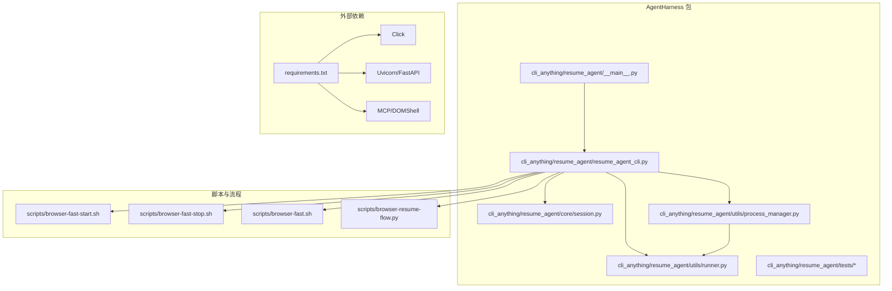
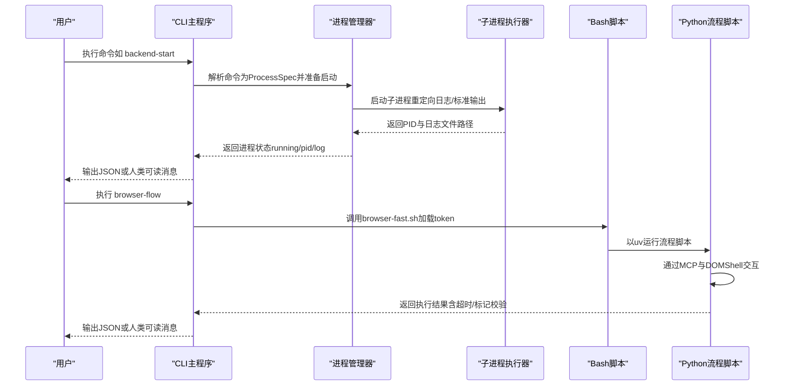
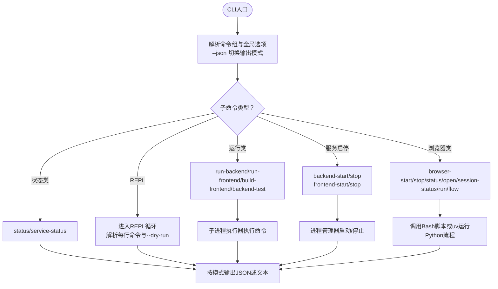
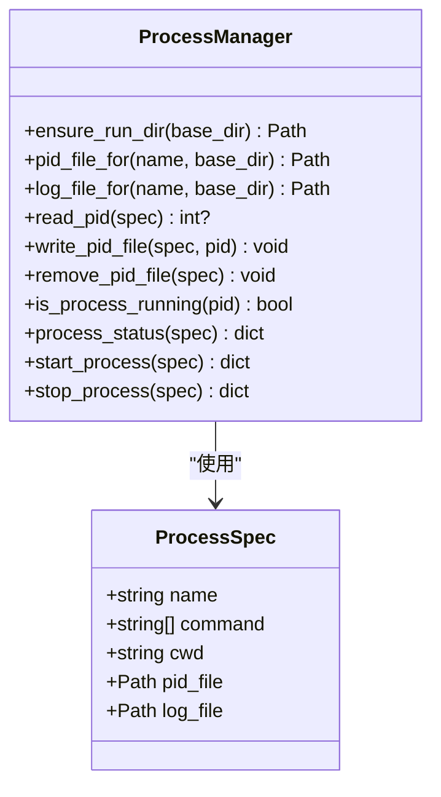
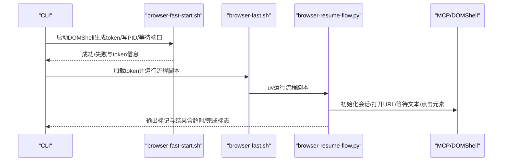
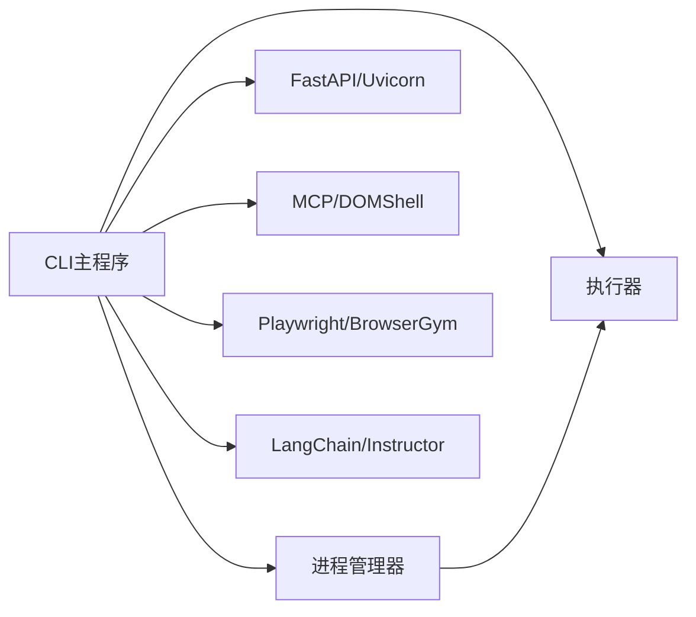

# AgentHarness工具

<cite>
**本文引用的文件**
- [agent-harness/setup.py](file://agent-harness/setup.py)
- [agent-harness/cli_anything/resume_agent/__main__.py](file://agent-harness/cli_anything/resume_agent/__main__.py)
- [agent-harness/cli_anything/resume_agent/resume_agent_cli.py](file://agent-harness/cli_anything/resume_agent/resume_agent_cli.py)
- [agent-harness/cli_anything/resume_agent/core/session.py](file://agent-harness/cli_anything/resume_agent/core/session.py)
- [agent-harness/cli_anything/resume_agent/utils/process_manager.py](file://agent-harness/cli_anything/resume_agent/utils/process_manager.py)
- [agent-harness/cli_anything/resume_agent/utils/runner.py](file://agent-harness/cli_anything/resume_agent/utils/runner.py)
- [agent-harness/cli_anything/resume_agent/tests/test_core.py](file://agent-harness/cli_anything/resume_agent/tests/test_core.py)
- [agent-harness/cli_anything/resume_agent/tests/test_process_manager.py](file://agent-harness/cli_anything/resume_agent/tests/test_process_manager.py)
- [agent-harness/cli_anything/resume_agent/tests/test_browser_scripts.py](file://agent-harness/cli_anything/resume_agent/tests/test_browser_scripts.py)
- [scripts/browser-fast-start.sh](file://scripts/browser-fast-start.sh)
- [scripts/browser-fast-stop.sh](file://scripts/browser-fast-stop.sh)
- [scripts/browser-fast.sh](file://scripts/browser-fast.sh)
- [scripts/browser-resume-flow.py](file://scripts/browser-resume-flow.py)
- [requirements.txt](file://requirements.txt)
</cite>

## 目录
1. [简介](#简介)
2. [项目结构](#项目结构)
3. [核心组件](#核心组件)
4. [架构总览](#架构总览)
5. [详细组件分析](#详细组件分析)
6. [依赖分析](#依赖分析)
7. [性能考虑](#性能考虑)
8. [故障排查指南](#故障排查指南)
9. [结论](#结论)
10. [附录](#附录)

## 简介
AgentHarness 是一个用于 Resume-Agent 的 CLI 工具系统，提供统一的命令行入口以启动/停止后端服务、前端开发服务器、浏览器自动化与交互流程，并支持 REPL 模式与 JSON 输出模式。该工具通过 Click 构建命令结构，结合进程管理器与子进程执行器，实现跨语言与跨组件的协作，覆盖代理测试、数据处理与部署辅助等场景。

## 项目结构
AgentHarness 的核心位于 agent-harness 子目录中，采用“命名空间包”组织方式，包含 CLI 入口、会话状态、进程管理与通用执行器，以及一组针对 CLI 的单元测试。配套的 Bash 脚本与 Python 流程脚本负责浏览器自动化与 DOMShell 桥接。

图示来源
- [agent-harness/cli_anything/resume_agent/__main__.py:1-6](file://agent-harness/cli_anything/resume_agent/__main__.py#L1-L6)
- [agent-harness/cli_anything/resume_agent/resume_agent_cli.py:1-461](file://agent-harness/cli_anything/resume_agent/resume_agent_cli.py#L1-L461)
- [agent-harness/cli_anything/resume_agent/utils/process_manager.py:1-111](file://agent-harness/cli_anything/resume_agent/utils/process_manager.py#L1-L111)
- [agent-harness/cli_anything/resume_agent/utils/runner.py:1-15](file://agent-harness/cli_anything/resume_agent/utils/runner.py#L1-L15)
- [scripts/browser-fast-start.sh:1-81](file://scripts/browser-fast-start.sh#L1-L81)
- [scripts/browser-fast-stop.sh:1-23](file://scripts/browser-fast-stop.sh#L1-L23)
- [scripts/browser-fast.sh:1-26](file://scripts/browser-fast.sh#L1-L26)
- [scripts/browser-resume-flow.py:1-172](file://scripts/browser-resume-flow.py#L1-L172)
- [requirements.txt:1-90](file://requirements.txt#L1-L90)

章节来源
- [agent-harness/setup.py:1-16](file://agent-harness/setup.py#L1-L16)
- [agent-harness/cli_anything/resume_agent/resume_agent_cli.py:150-461](file://agent-harness/cli_anything/resume_agent/resume_agent_cli.py#L150-L461)

## 核心组件
- 命令行入口与分发
  - console_scripts 条目将命令行入口绑定到 CLI 主函数，便于 pip 安装后直接调用。
  - 入口模块同时支持作为脚本直接运行与作为包模块运行。
- 会话状态管理
  - 使用数据类保存当前会话的输出模式（人类可读/JSON），贯穿各命令输出。
- 进程管理器
  - 统一定义 ProcessSpec，封装命令、工作目录、PID 文件与日志文件路径。
  - 提供启动、停止、状态查询与 PID 文件读写能力，确保进程生命周期可控。
- 通用执行器
  - 封装子进程执行结果，返回标准化的 returncode、stdout、stderr，便于上层判断与输出。
- 浏览器自动化与流程编排
  - Bash 启停脚本负责 DOMShell 的启动、停止与健康检查。
  - Python 流程脚本通过 MCP 与 DOMShell 通信，执行页面交互与断言，支持超时与标记校验。

章节来源
- [agent-harness/setup.py:9-14](file://agent-harness/setup.py#L9-L14)
- [agent-harness/cli_anything/resume_agent/__main__.py:1-6](file://agent-harness/cli_anything/resume_agent/__main__.py#L1-L6)
- [agent-harness/cli_anything/resume_agent/core/session.py:1-10](file://agent-harness/cli_anything/resume_agent/core/session.py#L1-L10)
- [agent-harness/cli_anything/resume_agent/utils/process_manager.py:11-111](file://agent-harness/cli_anything/resume_agent/utils/process_manager.py#L11-L111)
- [agent-harness/cli_anything/resume_agent/utils/runner.py:5-15](file://agent-harness/cli_anything/resume_agent/utils/runner.py#L5-L15)
- [scripts/browser-fast-start.sh:1-81](file://scripts/browser-fast-start.sh#L1-L81)
- [scripts/browser-resume-flow.py:145-172](file://scripts/browser-resume-flow.py#L145-L172)

## 架构总览
AgentHarness 的整体架构围绕“CLI 命令组 + 进程管理 + 子进程执行 + 外部脚本/工具”的组合展开。CLI 通过 Click 定义命令组与选项，命令回调根据需要调用进程管理器或直接执行子进程；浏览器相关功能通过 Bash 与 Python 脚本桥接 DOMShell/MCP，完成页面自动化与流程验证。

图示来源
- [agent-harness/cli_anything/resume_agent/resume_agent_cli.py:230-271](file://agent-harness/cli_anything/resume_agent/resume_agent_cli.py#L230-L271)
- [agent-harness/cli_anything/resume_agent/utils/process_manager.py:78-94](file://agent-harness/cli_anything/resume_agent/utils/process_manager.py#L78-L94)
- [agent-harness/cli_anything/resume_agent/utils/runner.py:12-15](file://agent-harness/cli_anything/resume_agent/utils/runner.py#L12-L15)
- [scripts/browser-fast.sh:18-26](file://scripts/browser-fast.sh#L18-L26)
- [scripts/browser-resume-flow.py:67-143](file://scripts/browser-resume-flow.py#L67-L143)

## 详细组件分析

### CLI 命令与参数解析
- 命令组与全局选项
  - 顶层 group 定义 --json 选项，切换输出格式；未指定子命令时进入 REPL。
- 子命令分类
  - 工作区与服务状态：status、service-status
  - 后端/前端：run-backend、run-frontend、build-frontend、backend-test
  - 服务启停：backend-start、backend-stop、frontend-start、frontend-stop
  - 浏览器：browser-start、browser-stop、browser-status、browser-open、browser-session-status、browser-run、browser-flow
  - REPL：内置命令提示与帮助，支持 --dry-run 透传给部分命令
- 参数解析与校验
  - 使用 Click 的 option/argument/context_settings 实现类型化输入与未知选项忽略（用于 browser-run）

图示来源
- [agent-harness/cli_anything/resume_agent/resume_agent_cli.py:150-461](file://agent-harness/cli_anything/resume_agent/resume_agent_cli.py#L150-L461)

章节来源
- [agent-harness/cli_anything/resume_agent/resume_agent_cli.py:150-461](file://agent-harness/cli_anything/resume_agent/resume_agent_cli.py#L150-L461)

### 进程管理器与生命周期
- 数据结构
  - ProcessSpec：封装 name、command、cwd、pid_file、log_file
- 生命周期操作
  - 启动：创建日志目录，以新会话启动子进程，写入 PID 文件
  - 停止：向进程组发送 SIGTERM，清理 PID 文件
  - 状态：读取 PID 并探测进程是否存在，若不存在则清理 PID 文件
- 错误与健壮性
  - 对权限错误与查找错误进行区分处理
  - 日志文件追加写入，避免覆盖

图示来源
- [agent-harness/cli_anything/resume_agent/utils/process_manager.py:11-111](file://agent-harness/cli_anything/resume_agent/utils/process_manager.py#L11-L111)

章节来源
- [agent-harness/cli_anything/resume_agent/utils/process_manager.py:11-111](file://agent-harness/cli_anything/resume_agent/utils/process_manager.py#L11-L111)

### 子进程执行器
- 统一返回结构 CmdResult，包含 returncode、stdout、stderr
- 便于上层命令根据 returncode 决策输出与错误处理

章节来源
- [agent-harness/cli_anything/resume_agent/utils/runner.py:5-15](file://agent-harness/cli_anything/resume_agent/utils/runner.py#L5-L15)

### 浏览器自动化与流程编排
- 启停脚本
  - browser-fast-start.sh：生成/检测 token，守护进程启动 DOMShell，等待端口就绪，写入 PID 与 token 文件
  - browser-fast-stop.sh：读取 PID 并终止进程，清理 PID 文件
  - browser-fast.sh：加载 token，按需以 daemon 模式运行 CLI 或直接运行
- 流程脚本
  - browser-resume-flow.py：通过 MCP 与 DOMShell 通信，执行页面打开、元素点击、文本等待与断言，支持超时与标记校验，最终输出结构化标记

图示来源
- [scripts/browser-fast-start.sh:50-81](file://scripts/browser-fast-start.sh#L50-L81)
- [scripts/browser-fast-stop.sh:9-23](file://scripts/browser-fast-stop.sh#L9-L23)
- [scripts/browser-fast.sh:10-26](file://scripts/browser-fast.sh#L10-L26)
- [scripts/browser-resume-flow.py:67-143](file://scripts/browser-resume-flow.py#L67-L143)

章节来源
- [scripts/browser-fast-start.sh:1-81](file://scripts/browser-fast-start.sh#L1-L81)
- [scripts/browser-fast-stop.sh:1-23](file://scripts/browser-fast-stop.sh#L1-L23)
- [scripts/browser-fast.sh:1-26](file://scripts/browser-fast.sh#L1-L26)
- [scripts/browser-resume-flow.py:1-172](file://scripts/browser-resume-flow.py#L1-L172)

### 配置管理、依赖安装与运行时环境
- 配置与状态
  - 会话状态通过数据类保存，支持 JSON 输出模式切换
  - 浏览器状态通过 .browser-fast 目录下的 pid/env/log 文件与端口探测共同判定
- 依赖安装
  - 通过 setup.py 声明 console_scripts 与依赖（Click）
  - requirements.txt 管理后端与工具链依赖（FastAPI/Uvicorn、MCP、Playwright、LangChain 等）
- 运行时环境
  - CLI 通过 uvicorn 启动后端服务，前端通过 npm run dev 启动
  - 浏览器自动化依赖 DOMShell 与 MCP，token 由脚本生成并持久化

章节来源
- [agent-harness/cli_anything/resume_agent/core/session.py:1-10](file://agent-harness/cli_anything/resume_agent/core/session.py#L1-L10)
- [agent-harness/cli_anything/resume_agent/resume_agent_cli.py:45-71](file://agent-harness/cli_anything/resume_agent/resume_agent_cli.py#L45-L71)
- [agent-harness/setup.py:9-14](file://agent-harness/setup.py#L9-L14)
- [requirements.txt:1-90](file://requirements.txt#L1-L90)

### 工具打包、分发与版本控制
- 打包与分发
  - 使用 setuptools 的 find_namespace_packages 与 console_scripts 定义入口
  - 可通过 pip 安装为可执行命令
- 版本控制
  - setup.py 中声明版本号，建议遵循语义化版本并在发布前更新
- 依赖锁定
  - 推荐在 CI 中使用 requirements.txt 固定版本，确保可重复构建

章节来源
- [agent-harness/setup.py:1-16](file://agent-harness/setup.py#L1-L16)

### 开发示例
- 代理测试工具
  - 使用 browser-flow 执行预设流程（如简历诊断），结合超时与标记校验评估自动化稳定性
- 数据处理工具
  - 结合后端服务与前端构建命令，验证数据导入/导出/渲染链路
- 部署辅助工具
  - 使用 run-backend/run-frontend/build-frontend 与 service-status 快速验证本地开发栈

章节来源
- [agent-harness/cli_anything/resume_agent/resume_agent_cli.py:219-271](file://agent-harness/cli_anything/resume_agent/resume_agent_cli.py#L219-L271)
- [agent-harness/cli_anything/resume_agent/resume_agent_cli.py:353-402](file://agent-harness/cli_anything/resume_agent/resume_agent_cli.py#L353-L402)

### 错误处理、日志记录与调试支持
- 错误处理
  - CLI 使用 ClickException 抛出明确错误信息
  - 子进程执行器返回 returncode，便于上层判断
  - 浏览器流程脚本捕获异常并返回非零退出码
- 日志记录
  - 进程管理器将后端/前端日志追加写入对应 log 文件
  - DOMShell 启停脚本将启动过程输出写入日志文件，便于问题定位
- 调试支持
  - --dry-run 选项允许预览即将执行的命令
  - JSON 输出模式便于机器消费与自动化集成

章节来源
- [agent-harness/cli_anything/resume_agent/resume_agent_cli.py:147-148](file://agent-harness/cli_anything/resume_agent/resume_agent_cli.py#L147-L148)
- [agent-harness/cli_anything/resume_agent/utils/runner.py:12-15](file://agent-harness/cli_anything/resume_agent/utils/runner.py#L12-L15)
- [scripts/browser-resume-flow.py:160-167](file://scripts/browser-resume-flow.py#L160-L167)

### 单元测试、集成测试与持续集成
- 单元测试
  - test_core.py：覆盖 status、service-status、browser-* 系列命令的输出与行为
  - test_process_manager.py：覆盖进程状态、PID 文件读写与运行态检测
  - test_browser_scripts.py：验证浏览器脚本的关键参数存在性
- 集成测试
  - 建议在 CI 中添加对 browser-flow 的端到端测试，模拟 DOMShell 与 MCP 交互
- 持续集成
  - 建议在 GitHub Actions 中加入：
    - Python 环境准备与依赖安装
    - pytest 执行单元/集成测试
    - 前端构建与后端服务健康检查
    - 浏览器自动化流程的最小化验证

章节来源
- [agent-harness/cli_anything/resume_agent/tests/test_core.py:1-99](file://agent-harness/cli_anything/resume_agent/tests/test_core.py#L1-L99)
- [agent-harness/cli_anything/resume_agent/tests/test_process_manager.py:1-49](file://agent-harness/cli_anything/resume_agent/tests/test_process_manager.py#L1-L49)
- [agent-harness/cli_anything/resume_agent/tests/test_browser_scripts.py:1-13](file://agent-harness/cli_anything/resume_agent/tests/test_browser_scripts.py#L1-L13)

## 依赖分析
- 内部依赖
  - CLI 主模块依赖会话状态、进程管理器与执行器
  - 进程管理器依赖执行器进行子进程启动
- 外部依赖
  - Click：命令行框架
  - FastAPI/Uvicorn：后端服务
  - MCP/DOMShell：浏览器自动化桥接
  - Playwright/BrowserGym：浏览器与自动化
  - LangChain/Instructor：智能体与提示工程
  - 其他：数据库、搜索、图像处理、TTS 等

图示来源
- [agent-harness/cli_anything/resume_agent/resume_agent_cli.py:11-20](file://agent-harness/cli_anything/resume_agent/resume_agent_cli.py#L11-L20)
- [agent-harness/cli_anything/resume_agent/utils/process_manager.py:1-111](file://agent-harness/cli_anything/resume_agent/utils/process_manager.py#L1-L111)
- [requirements.txt:1-90](file://requirements.txt#L1-L90)

章节来源
- [requirements.txt:1-90](file://requirements.txt#L1-L90)

## 性能考虑
- 进程并发与资源占用
  - 后端/前端/浏览器服务并发运行时注意端口冲突与 CPU/内存占用
- I/O 与日志
  - 进程日志追加写入，建议定期轮转或清理
- 超时与健壮性
  - 浏览器流程设置超时并强制退出，避免异步资源泄漏

## 故障排查指南
- 浏览器服务未启动
  - 检查 .browser-fast 下的 pid/env/log 文件与端口占用
  - 使用 browser-start 重新启动，查看日志文件定位问题
- 浏览器流程失败
  - 检查 DOMSHELL_TOKEN 是否正确加载
  - 观察流程脚本输出的标记与超时情况
- 服务启停异常
  - 查看进程 PID 文件与实际进程是否一致，必要时手动清理
- JSON 输出与人类可读输出
  - 使用 --json 获取结构化输出，便于自动化脚本解析

章节来源
- [agent-harness/cli_anything/resume_agent/resume_agent_cli.py:114-138](file://agent-harness/cli_anything/resume_agent/resume_agent_cli.py#L114-L138)
- [scripts/browser-fast-start.sh:22-48](file://scripts/browser-fast-start.sh#L22-L48)
- [scripts/browser-resume-flow.py:160-167](file://scripts/browser-resume-flow.py#L160-L167)

## 结论
AgentHarness 通过清晰的命令分层、进程生命周期管理与浏览器自动化脚本，提供了从开发到验证的一体化 CLI 工具体系。配合 JSON 输出与 --dry-run 选项，既满足开发者日常效率，也便于自动化集成与持续交付。建议在团队内推广统一的命令规范与测试策略，持续完善浏览器流程与依赖版本管理。

## 附录
- 常用命令速查
  - 状态：status、service-status
  - 后端：run-backend、backend-start、backend-stop、backend-test
  - 前端：run-frontend、build-frontend、frontend-start、frontend-stop
  - 浏览器：browser-start、browser-stop、browser-status、browser-open、browser-session-status、browser-run、browser-flow
  - 其他：--json 切换输出、REPL 模式