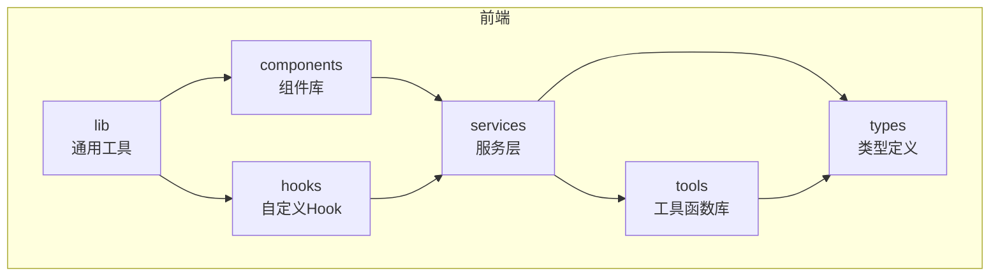
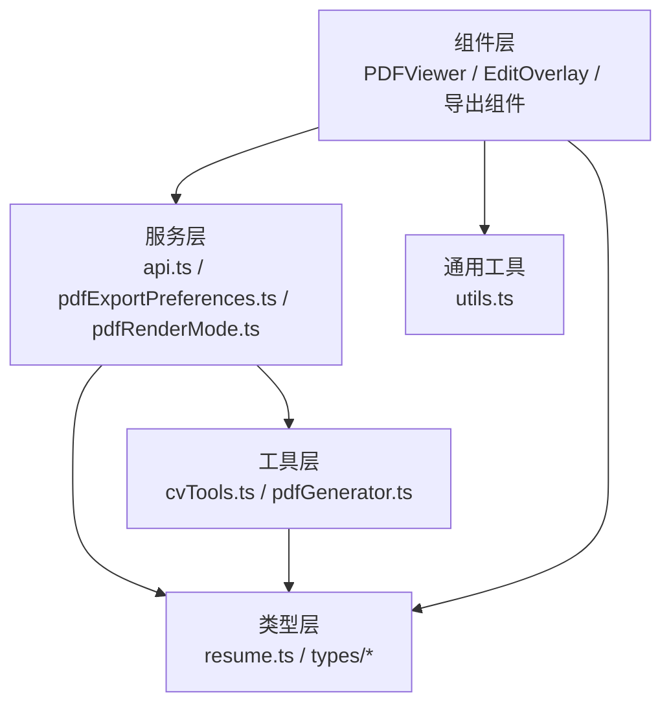
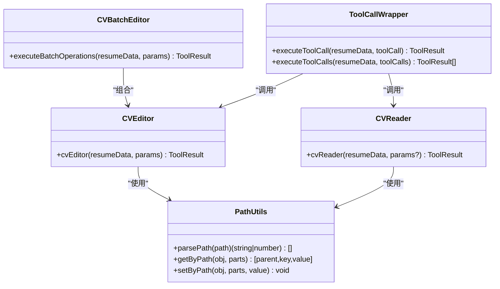
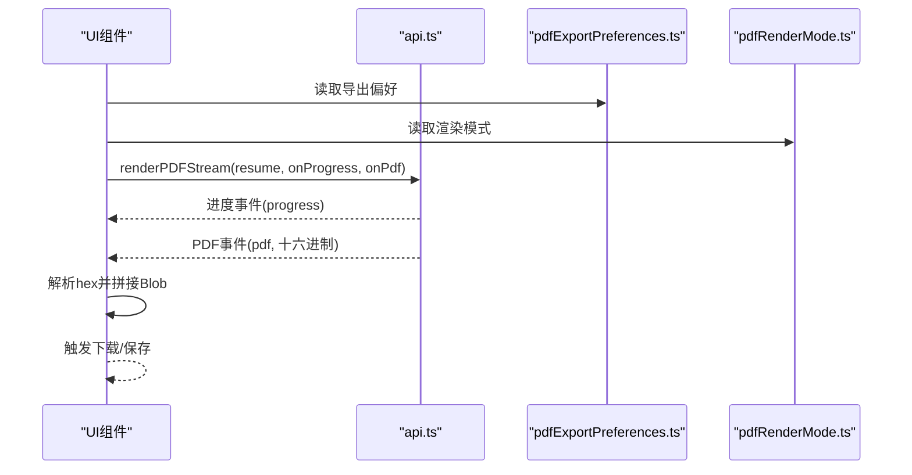
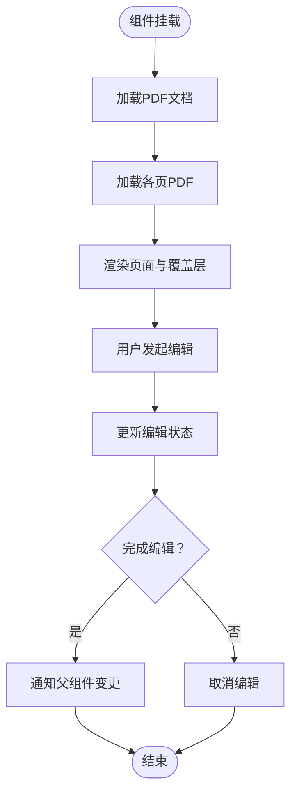
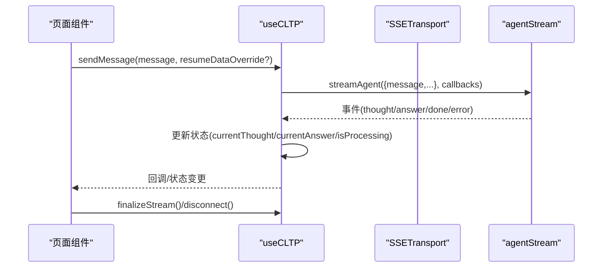
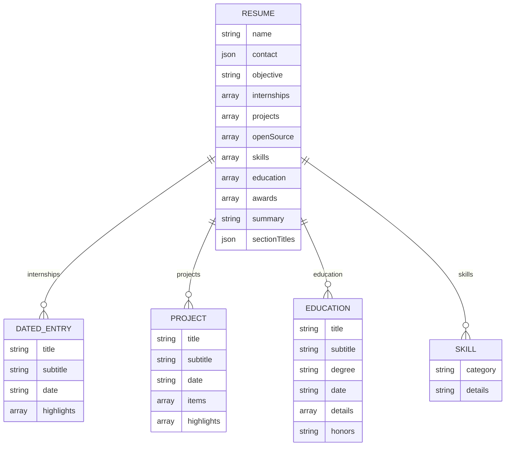
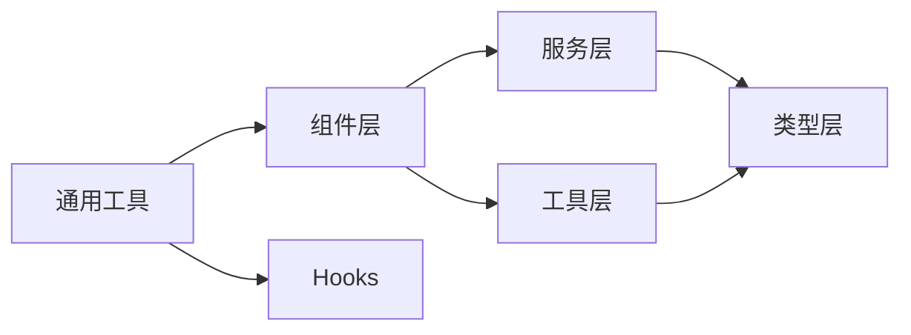

# 前端工具开发

<cite>
**本文引用的文件**
- [README.md](file://README.md)
- [package.json](file://frontend/package.json)
- [cvTools.ts](file://frontend/src/tools/cvTools.ts)
- [pdfExportPreferences.ts](file://frontend/src/services/pdfExportPreferences.ts)
- [pdfRenderMode.ts](file://frontend/src/services/pdfRenderMode.ts)
- [pdfGenerator.ts](file://frontend/src/components/ExportShare/pdfGenerator.ts)
- [index.tsx](file://frontend/src/components/PDFEditor/index.tsx)
- [PDFViewer.tsx](file://frontend/src/components/PDFEditor/PDFViewer.tsx)
- [EditOverlay.tsx](file://frontend/src/components/PDFEditor/EditOverlay.tsx)
- [useCLTP.ts](file://frontend/src/hooks/useCLTP.ts)
- [api.ts](file://frontend/src/services/api.ts)
- [utils.ts](file://frontend/src/lib/utils.ts)
- [resume.ts](file://frontend/src/types/resume.ts)
</cite>

## 目录
1. [简介](#简介)
2. [项目结构](#项目结构)
3. [核心组件](#核心组件)
4. [架构总览](#架构总览)
5. [详细组件分析](#详细组件分析)
6. [依赖关系分析](#依赖关系分析)
7. [性能考虑](#性能考虑)
8. [故障排查指南](#故障排查指南)
9. [结论](#结论)
10. [附录](#附录)

## 简介
本指南聚焦于前端工具开发，围绕 React 组件工具的开发模式、状态管理与事件处理机制展开；同时系统阐述工具函数库的设计、API 封装与类型定义，并给出组件复用、样式定制与国际化支持的实践建议。文档还提供了 PDF 导出工具、图片处理工具与数据转换工具的开发示例，涵盖测试策略、性能优化与用户体验设计，并补充工具发布、版本管理与社区贡献流程。

## 项目结构
前端采用 React + TypeScript + Vite 的技术栈，核心目录组织如下：
- components：可复用 UI 组件与业务组件（如 PDF 编辑器、导出分享）
- hooks：自定义 Hook（如流式交互 useCLTP）
- services：API 封装与持久化逻辑（如 PDF 渲染、偏好设置）
- tools：工具函数库（如简历数据读写与批处理）
- types：全局类型定义（如 Resume 结构）
- lib：通用工具方法（如类名合并）

章节来源
- [README.md:1-106](file://README.md#L1-L106)
- [package.json:1-66](file://frontend/package.json#L1-L66)

## 核心组件
本项目的核心工具与组件包括：
- 简历数据工具层：CVReader、CVEditor、CVBatchEditor 及路径解析与数据格式转换
- PDF 导出与渲染：浏览器端 PDF 生成、流式渲染与偏好设置
- PDF 编辑器：基于 pdfjs-dist 的查看与编辑组件
- 流式交互：useCLTP Hook，封装 SSE 事件流与状态管理
- 类型体系：Resume 及相关条目类型，确保数据一致性

章节来源
- [cvTools.ts:1-618](file://frontend/src/tools/cvTools.ts#L1-L618)
- [pdfGenerator.ts:1-189](file://frontend/src/components/ExportShare/pdfGenerator.ts#L1-L189)
- [PDFViewer.tsx:1-177](file://frontend/src/components/PDFEditor/PDFViewer.tsx#L1-L177)
- [useCLTP.ts:1-387](file://frontend/src/hooks/useCLTP.ts#L1-L387)
- [resume.ts:1-98](file://frontend/src/types/resume.ts#L1-L98)

## 架构总览
前端整体架构由“组件层 → 服务层 → 工具层 → 类型层”构成，服务层负责与后端 API 交互与本地存储，工具层提供数据读写与批处理能力，类型层保障数据结构安全。

图表来源
- [PDFViewer.tsx:1-177](file://frontend/src/components/PDFEditor/PDFViewer.tsx#L1-L177)
- [api.ts:1-800](file://frontend/src/services/api.ts#L1-L800)
- [cvTools.ts:1-618](file://frontend/src/tools/cvTools.ts#L1-L618)
- [pdfGenerator.ts:1-189](file://frontend/src/components/ExportShare/pdfGenerator.ts#L1-L189)
- [utils.ts:1-8](file://frontend/src/lib/utils.ts#L1-L8)

## 详细组件分析

### 简历数据工具层（CVReader/Editor/Batch）
该工具层提供对简历数据的读取、更新、新增与删除能力，支持路径解析与批量操作，并内置后端/前端字段映射与格式转换。

图表来源
- [cvTools.ts:149-413](file://frontend/src/tools/cvTools.ts#L149-L413)
- [cvTools.ts:415-618](file://frontend/src/tools/cvTools.ts#L415-L618)

章节来源
- [cvTools.ts:1-618](file://frontend/src/tools/cvTools.ts#L1-L618)

### PDF 导出与渲染
- 浏览器端 PDF 生成：将简历 JSON 渲染为 HTML 并转 PDF
- 流式渲染：后端 SSE 推送进度与 PDF 数据，前端解析并拼接
- 偏好设置：用户选择“总是询问/优先默认”，并持久化目录句柄与标签
- 渲染模式：本地/远程渲染模式切换与持久化

图表来源
- [api.ts:285-525](file://frontend/src/services/api.ts#L285-L525)
- [pdfExportPreferences.ts:1-171](file://frontend/src/services/pdfExportPreferences.ts#L1-L171)
- [pdfRenderMode.ts:1-17](file://frontend/src/services/pdfRenderMode.ts#L1-L17)

章节来源
- [pdfGenerator.ts:1-189](file://frontend/src/components/ExportShare/pdfGenerator.ts#L1-L189)
- [api.ts:1-800](file://frontend/src/services/api.ts#L1-L800)
- [pdfExportPreferences.ts:1-171](file://frontend/src/services/pdfExportPreferences.ts#L1-L171)
- [pdfRenderMode.ts:1-17](file://frontend/src/services/pdfRenderMode.ts#L1-L17)

### PDF 编辑器组件
- PDFViewer：加载 PDF、维护页面列表、整合编辑状态
- EditOverlay：覆盖层展示与管理编辑项
- hooks：usePDFDocument、useEditState 等

图表来源
- [PDFViewer.tsx:14-177](file://frontend/src/components/PDFEditor/PDFViewer.tsx#L14-L177)
- [EditOverlay.tsx:11-41](file://frontend/src/components/PDFEditor/EditOverlay.tsx#L11-L41)

章节来源
- [PDFViewer.tsx:1-177](file://frontend/src/components/PDFEditor/PDFViewer.tsx#L1-L177)
- [EditOverlay.tsx:1-41](file://frontend/src/components/PDFEditor/EditOverlay.tsx#L1-L41)
- [index.tsx:1-26](file://frontend/src/components/PDFEditor/index.tsx#L1-L26)

### 流式交互 Hook（useCLTP）
- 统一封装 SSE 事件流，提取 thought/answer/done/error
- 状态管理：当前思考、当前回答、连接状态、错误信息、完成计数
- 生命周期：发送消息、断开连接、最终化

图表来源
- [useCLTP.ts:180-387](file://frontend/src/hooks/useCLTP.ts#L180-L387)
- [api.ts:131-225](file://frontend/src/services/api.ts#L131-L225)

章节来源
- [useCLTP.ts:1-387](file://frontend/src/hooks/useCLTP.ts#L1-L387)
- [api.ts:1-800](file://frontend/src/services/api.ts#L1-L800)

### 类型定义与数据模型
- Resume 及其子结构（DatedEntry、Project、Education、Skill 等）
- 统一前后端字段映射与格式转换，保证工具链一致性

图表来源
- [resume.ts:80-98](file://frontend/src/types/resume.ts#L80-L98)
- [resume.ts:8-61](file://frontend/src/types/resume.ts#L8-L61)

章节来源
- [resume.ts:1-98](file://frontend/src/types/resume.ts#L1-L98)
- [cvTools.ts:440-523](file://frontend/src/tools/cvTools.ts#L440-L523)

## 依赖关系分析
- 组件依赖服务层与工具层，服务层依赖类型定义
- 工具层内部通过路径解析与格式转换解耦不同数据形态
- 类型定义贯穿全链路，确保编译期安全

图表来源
- [cvTools.ts:1-618](file://frontend/src/tools/cvTools.ts#L1-L618)
- [api.ts:1-800](file://frontend/src/services/api.ts#L1-L800)
- [utils.ts:1-8](file://frontend/src/lib/utils.ts#L1-L8)

章节来源
- [cvTools.ts:1-618](file://frontend/src/tools/cvTools.ts#L1-L618)
- [api.ts:1-800](file://frontend/src/services/api.ts#L1-L800)
- [utils.ts:1-8](file://frontend/src/lib/utils.ts#L1-L8)

## 性能考虑
- PDF 渲染与编辑
  - 使用 pdfjs-dist 异步加载页面，避免阻塞主线程
  - 流式渲染通过 SSE 分块传输，前端按事件拼接，减少一次性内存压力
- 数据处理
  - 路径解析与格式转换采用轻量算法，避免深层拷贝
  - 批量操作聚合结果，减少多次 UI 重绘
- 网络与缓存
  - API 层统一错误解析与降级提示，避免重复请求
  - 偏好设置与渲染模式使用本地存储，降低网络往返
- 样式与资源
  - 使用 Tailwind 合并与条件类名，配合 cn 工具减少冗余样式

章节来源
- [PDFViewer.tsx:52-68](file://frontend/src/components/PDFEditor/PDFViewer.tsx#L52-L68)
- [api.ts:285-525](file://frontend/src/services/api.ts#L285-L525)
- [cvTools.ts:580-606](file://frontend/src/tools/cvTools.ts#L580-L606)
- [utils.ts:1-8](file://frontend/src/lib/utils.ts#L1-L8)

## 故障排查指南
- PDF 导出失败
  - 检查权限与目录句柄：确保已授权目录写入
  - 检查偏好设置行为：是否选择“优先默认”
  - 检查渲染模式：本地/远程模式切换记录
- 流式渲染异常
  - 观察 SSE 事件：progress/error/pdf 是否正常到达
  - 校验 hex 数据：长度为偶数且可解析为字节数组
- 简历数据读写
  - 路径解析报错：确认路径格式与索引范围
  - 格式转换问题：检查后端/前端字段映射与日期格式
- 流式交互
  - 断线重连：使用 disconnect/finalizeStream 控制生命周期
  - 错误信息：从事件中提取标准化错误文案

章节来源
- [pdfExportPreferences.ts:94-157](file://frontend/src/services/pdfExportPreferences.ts#L94-L157)
- [api.ts:320-525](file://frontend/src/services/api.ts#L320-L525)
- [cvTools.ts:49-128](file://frontend/src/tools/cvTools.ts#L49-L128)
- [useCLTP.ts:321-355](file://frontend/src/hooks/useCLTP.ts#L321-L355)

## 结论
本项目通过清晰的分层架构与完善的类型体系，实现了简历数据的读写、PDF 的导出与渲染、以及流式交互体验。工具层与服务层的职责分离提升了可维护性，而组件层的可复用性与样式工具则保障了开发效率与一致性。建议在后续迭代中进一步完善单元测试与集成测试，强化国际化与无障碍支持，并持续优化流式渲染与大文件处理的性能表现。

## 附录

### 组件复用与样式定制
- 复用策略
  - 将通用逻辑下沉至 hooks 与工具函数，组件仅关注渲染与交互
  - 使用类型约束确保跨组件数据一致性
- 样式定制
  - 通过 Tailwind 与 cn 工具实现条件样式合并
  - 在组件入口导出统一的类型与工具函数，便于外部扩展

章节来源
- [index.tsx:1-26](file://frontend/src/components/PDFEditor/index.tsx#L1-L26)
- [utils.ts:1-8](file://frontend/src/lib/utils.ts#L1-L8)

### 国际化支持建议
- 文案与提示语集中管理，结合运行时语言环境动态切换
- 日期与数字格式化使用 Intl API，确保本地化体验
- 错误提示与引导文案统一走 i18n 管道，避免硬编码

（本节为通用指导，无需特定文件引用）

### 工具开发示例

- PDF 导出工具
  - 功能：将简历 JSON 渲染为 HTML 并转 PDF
  - 关键点：清理文件名、构建 HTML、配置 html2pdf 选项、异步保存
  - 示例参考：[pdfGenerator.ts:21-51](file://frontend/src/components/ExportShare/pdfGenerator.ts#L21-L51)

- 图片处理工具（概念性）
  - 功能：裁剪、压缩、水印叠加
  - 关键点：Canvas API 或第三方库封装，支持进度回调与错误处理
  - 示例参考：[package.json:32-44](file://frontend/package.json#L32-L44)（引入 html2canvas、pdf-lib 等依赖）

- 数据转换工具
  - 功能：后端字段到前端字段映射、日期格式转换、富文本到纯文本
  - 关键点：路径映射表、日期规范化、换行转 HTML 段落
  - 示例参考：[cvTools.ts:440-523](file://frontend/src/tools/cvTools.ts#L440-L523)

章节来源
- [pdfGenerator.ts:1-189](file://frontend/src/components/ExportShare/pdfGenerator.ts#L1-L189)
- [cvTools.ts:440-523](file://frontend/src/tools/cvTools.ts#L440-L523)
- [package.json:1-66](file://frontend/package.json#L1-L66)

### 测试策略
- 单元测试
  - 路径解析与数据转换：边界值、非法路径、越界索引
  - 工具调用：成功/失败分支、批量操作统计
- 集成测试
  - PDF 渲染：流式事件顺序、hex 数据解析、Blob 生成
  - 流式交互：事件类型识别、错误冒泡、生命周期控制
- 用户体验测试
  - 加载态与错误态：占位图、提示文案、重试机制
  - 性能指标：首屏时间、PDF 渲染耗时、内存占用

（本节为通用指导，无需特定文件引用）

### 性能优化与用户体验设计
- 性能
  - 惰性加载与分页渲染，避免一次性加载全部页面
  - 流式事件分块处理，及时释放中间变量
  - 本地缓存与回放，减少重复计算
- 体验
  - 明确的加载与错误反馈，提供重试与帮助链接
  - 无障碍支持：键盘导航、屏幕阅读器友好
  - 响应式布局与高对比度主题

（本节为通用指导，无需特定文件引用）

### 发布、版本管理与社区贡献
- 版本管理
  - 使用语义化版本，变更日志记录重大修复与功能
  - 前端包管理采用 package.json，遵循依赖锁定策略
- 发布流程
  - 构建产物校验与最小化，确保兼容性
  - CI/CD 自动化测试与打包，发布到制品库或 CDN
- 社区贡献
  - 提交规范与 PR 模plate，Issue 模板与标签体系
  - 代码风格与 Lint 规则统一，提交前执行格式化与静态检查

章节来源
- [README.md:99-106](file://README.md#L99-L106)
- [package.json:1-66](file://frontend/package.json#L1-L66)