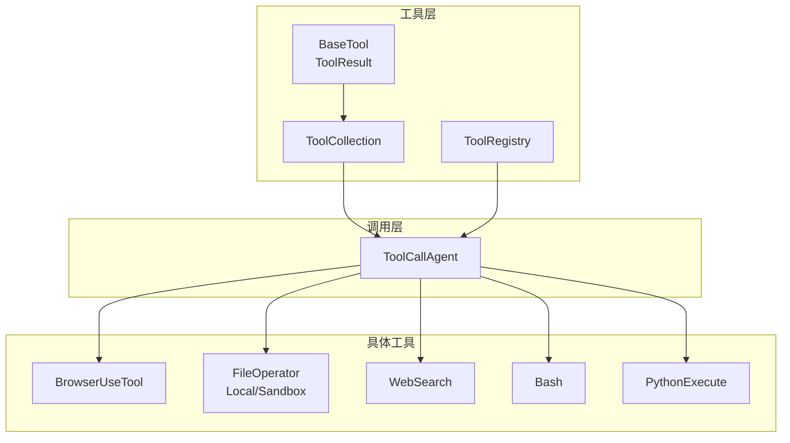
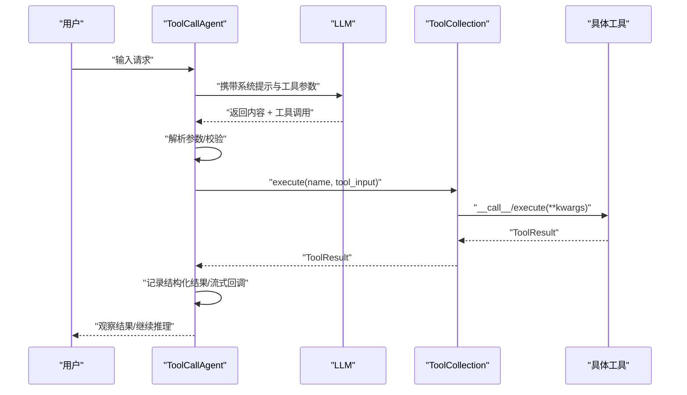
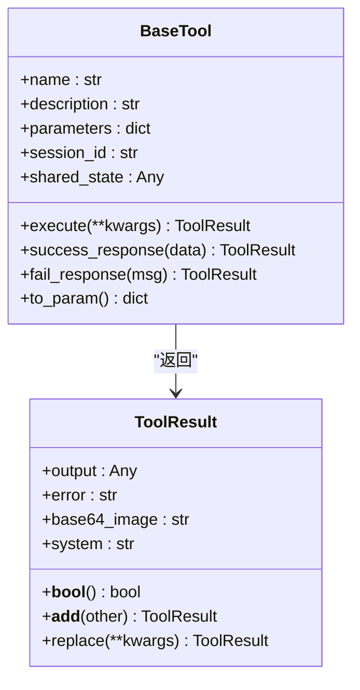
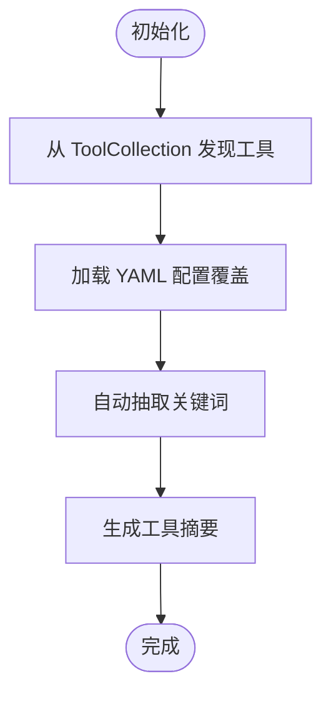
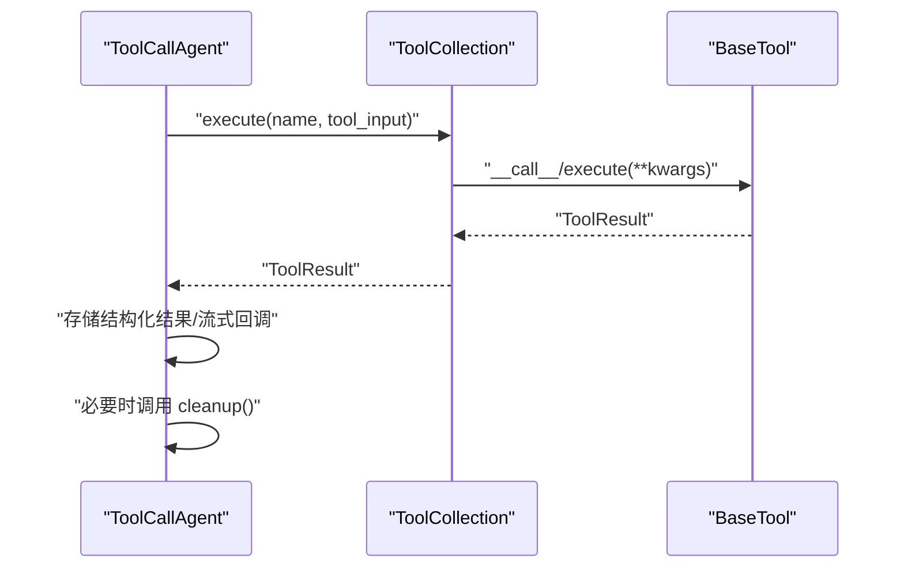
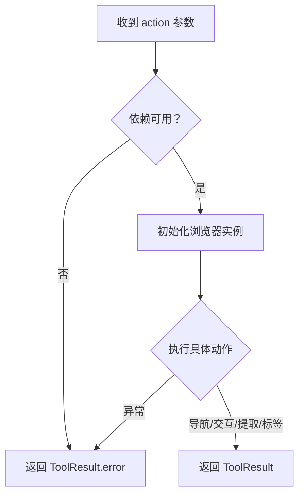
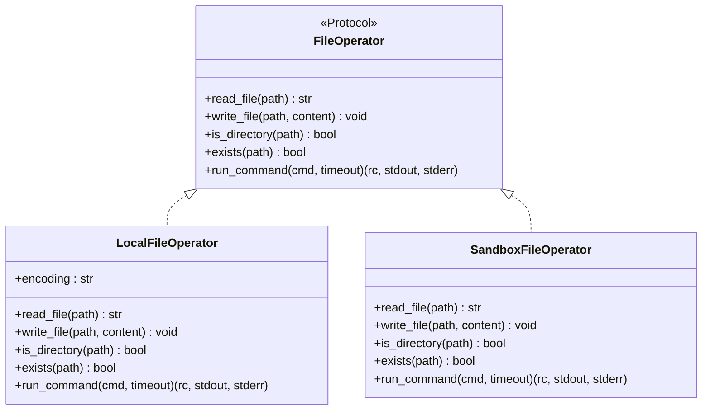
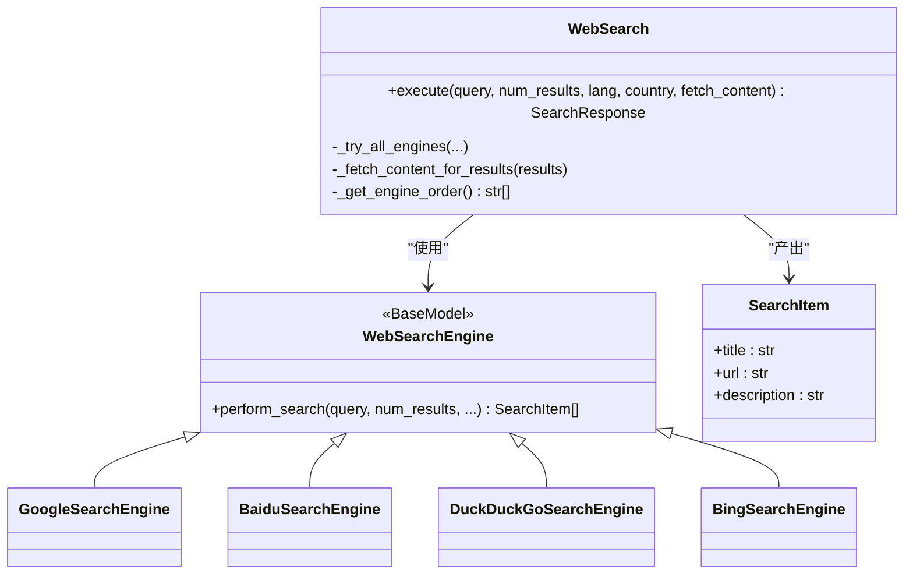
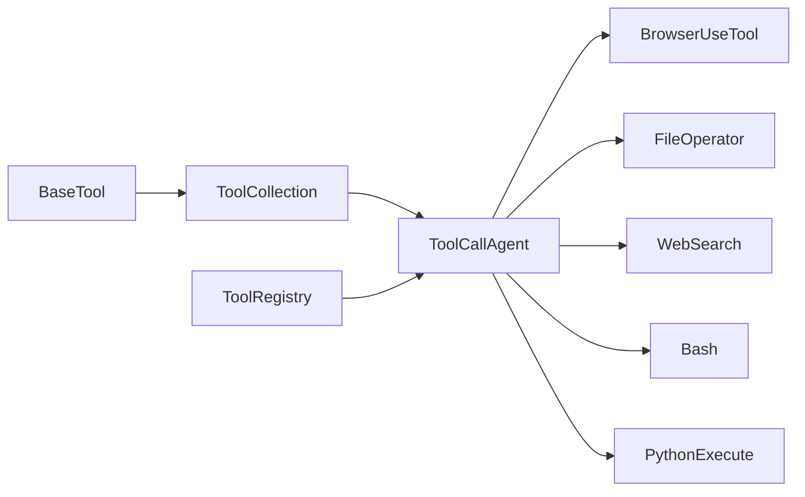

# 工具扩展

<cite>
**本文引用的文件**
- [backend/agent/tool/base.py](file://backend/agent/tool/base.py)
- [backend/agent/tool/__init__.py](file://backend/agent/tool/__init__.py)
- [backend/agent/tool/tool_collection.py](file://backend/agent/tool/tool_collection.py)
- [backend/agent/domain/intent/tool_registry.py](file://backend/agent/domain/intent/tool_registry.py)
- [backend/agent/agent/toolcall.py](file://backend/agent/agent/toolcall.py)
- [backend/agent/tool/browser_use_tool.py](file://backend/agent/tool/browser_use_tool.py)
- [backend/agent/tool/file_operators.py](file://backend/agent/tool/file_operators.py)
- [backend/agent/tool/web_search.py](file://backend/agent/tool/web_search.py)
- [backend/agent/tool/bash.py](file://backend/agent/tool/bash.py)
- [backend/agent/tool/python_execute.py](file://backend/agent/tool/python_execute.py)
- [backend/agent/tool/search/base.py](file://backend/agent/tool/search/base.py)
- [backend/agent/tool/search/google_search.py](file://backend/agent/tool/search/google_search.py)
- [backend/agent/tool/search/baidu_search.py](file://backend/agent/tool/search/baidu_search.py)
- [backend/agent/tool/search/bing_search.py](file://backend/agent/tool/search/bing_search.py)
- [backend/agent/tool/search/duckduckgo_search.py](file://backend/agent/tool/search/duckduckgo_search.py)
</cite>

## 目录
1. [简介](#简介)
2. [项目结构](#项目结构)
3. [核心组件](#核心组件)
4. [架构总览](#架构总览)
5. [详细组件分析](#详细组件分析)
6. [依赖分析](#依赖分析)
7. [性能考量](#性能考量)
8. [故障排查指南](#故障排查指南)
9. [结论](#结论)
10. [附录](#附录)

## 简介
本指南面向希望在 ResumeAgent 中扩展自定义工具的开发者，系统讲解工具基类设计、参数与结果处理、工具注册与意图识别、工具集合管理、异步与错误恢复、资源清理、测试与性能优化等主题，并给出浏览器工具、文件操作工具与搜索工具的实现要点与最佳实践。

## 项目结构
工具相关代码主要位于后端模块 backend/agent/tool 下，围绕“工具基类 + 工具集合 + 注册中心 + 调用代理”的分层组织：
- 工具基类与结果模型：定义统一的工具抽象、参数校验、结果封装与成功/失败响应。
- 工具集合：集中管理工具实例，提供按名执行、批量执行与去重注册。
- 注册中心：从工具集合与配置文件自动发现工具元数据，支持关键词抽取与优先级管理。
- 调用代理：在智能体中调度工具，负责参数解析、异常捕获、流式输出与资源清理。
- 具体工具：浏览器、文件操作、搜索、命令行、代码执行等。

图表来源
- [backend/agent/tool/base.py:80-178](file://backend/agent/tool/base.py#L80-L178)
- [backend/agent/tool/tool_collection.py:11-74](file://backend/agent/tool/tool_collection.py#L11-L74)
- [backend/agent/domain/intent/tool_registry.py:60-259](file://backend/agent/domain/intent/tool_registry.py#L60-L259)
- [backend/agent/agent/toolcall.py:21-522](file://backend/agent/agent/toolcall.py#L21-L522)
- [backend/agent/tool/browser_use_tool.py:40-577](file://backend/agent/tool/browser_use_tool.py#L40-L577)
- [backend/agent/tool/file_operators.py:15-159](file://backend/agent/tool/file_operators.py#L15-L159)
- [backend/agent/tool/web_search.py:168-484](file://backend/agent/tool/web_search.py#L168-L484)
- [backend/agent/tool/bash.py:116-159](file://backend/agent/tool/bash.py#L116-L159)
- [backend/agent/tool/python_execute.py:9-76](file://backend/agent/tool/python_execute.py#L9-L76)

章节来源
- [backend/agent/tool/base.py:1-178](file://backend/agent/tool/base.py#L1-L178)
- [backend/agent/tool/tool_collection.py:1-74](file://backend/agent/tool/tool_collection.py#L1-L74)
- [backend/agent/domain/intent/tool_registry.py:1-259](file://backend/agent/domain/intent/tool_registry.py#L1-L259)
- [backend/agent/agent/toolcall.py:1-522](file://backend/agent/agent/toolcall.py#L1-L522)

## 核心组件
- 工具基类 BaseTool：继承 Pydantic 的 BaseModel，提供统一的参数 schema、函数式元数据导出、成功/失败结果构造器。
- 结果模型 ToolResult：承载输出、错误、图片等字段，支持布尔化、拼接与替换。
- 工具集合 ToolCollection：以名称映射工具实例，提供按名执行、批量执行、去重添加与参数导出。
- 注册中心 ToolRegistry：从工具集合与 YAML 配置加载工具元数据，自动抽取关键词与优先级，支持热重载。
- 调用代理 ToolCallAgent：在智能体中解析 LLM 的工具调用，执行工具、记录结构化结果、流式回调与资源清理。

章节来源
- [backend/agent/tool/base.py:40-178](file://backend/agent/tool/base.py#L40-L178)
- [backend/agent/tool/tool_collection.py:11-74](file://backend/agent/tool/tool_collection.py#L11-L74)
- [backend/agent/domain/intent/tool_registry.py:60-259](file://backend/agent/domain/intent/tool_registry.py#L60-L259)
- [backend/agent/agent/toolcall.py:21-522](file://backend/agent/agent/toolcall.py#L21-L522)

## 架构总览
工具扩展遵循“声明式参数 + 统一结果 + 集中式注册 + 智能体编排”的模式。LLM 通过函数调用协议选择工具，ToolCallAgent 解析参数并交由 ToolCollection 执行，最终将结果回填至对话历史。

图表来源
- [backend/agent/agent/toolcall.py:258-480](file://backend/agent/agent/toolcall.py#L258-L480)
- [backend/agent/tool/tool_collection.py:27-48](file://backend/agent/tool/tool_collection.py#L27-L48)
- [backend/agent/tool/base.py:120-127](file://backend/agent/tool/base.py#L120-L127)

## 详细组件分析

### 工具基类与结果模型
- 设计要点
  - 参数 schema 通过 Pydantic 字段定义，便于 LLM 函数调用协议对接。
  - 成功/失败响应通过 success_response/fail_response 统一封装，便于上层消费。
  - ToolResult 支持布尔化、拼接与字符串化，便于条件判断与日志输出。
- 接口规范
  - 必须实现异步 execute 方法，接收关键字参数并返回 ToolResult。
  - 可选实现 cleanup 异步清理资源。
- 结果处理
  - 输出可为字符串或结构化对象（经 JSON 序列化）。
  - 错误通过 error 字段传递，便于统一处理。

图表来源
- [backend/agent/tool/base.py:80-178](file://backend/agent/tool/base.py#L80-L178)

章节来源
- [backend/agent/tool/base.py:40-178](file://backend/agent/tool/base.py#L40-L178)

### 工具集合与注册中心
- 工具集合
  - 以工具名映射工具实例，避免同名冲突。
  - 提供按名执行与批量执行能力，异常转换为 ToolFailure。
- 注册中心
  - 自动从 ToolCollection 抽取工具元数据，再叠加 YAML 配置覆盖。
  - 自动关键词抽取（中英文停用词过滤）、正则模式与优先级管理。
  - 支持热重载，便于开发调试。

图表来源
- [backend/agent/domain/intent/tool_registry.py:98-243](file://backend/agent/domain/intent/tool_registry.py#L98-L243)

章节来源
- [backend/agent/tool/tool_collection.py:11-74](file://backend/agent/tool/tool_collection.py#L11-L74)
- [backend/agent/domain/intent/tool_registry.py:60-259](file://backend/agent/domain/intent/tool_registry.py#L60-L259)

### 调用代理与工具编排
- 参数解析与校验
  - 将 LLM 返回的 JSON 字符串解析为字典，进行参数校验与安全守卫。
- 安全守卫
  - 对浏览请求限制特定工具（如禁止直接生成 HTML）。
- 结果存储
  - 将部分工具的结构化结果编码到 ToolResult.system，便于后续处理。
- 流式输出与取消
  - 支持设置流式回调与取消事件，提升交互体验。
- 资源清理
  - 在 agent 生命周期结束时遍历工具实例调用其 cleanup。

图表来源
- [backend/agent/agent/toolcall.py:383-522](file://backend/agent/agent/toolcall.py#L383-L522)
- [backend/agent/tool/tool_collection.py:27-48](file://backend/agent/tool/tool_collection.py#L27-L48)

章节来源
- [backend/agent/agent/toolcall.py:21-522](file://backend/agent/agent/toolcall.py#L21-L522)

### 浏览器工具（BrowserUseTool）
- 功能特性
  - 支持导航、点击、输入、滚动、键盘发送、下拉选择、内容提取、标签页管理等。
  - 内置 WebSearch 工具组合，支持“先搜索再浏览”。
  - 支持截图作为 base64 图片回传，辅助视觉反馈。
- 异步与锁
  - 使用 asyncio.Lock 保证并发安全。
- 资源清理
  - 提供 cleanup 停止浏览器进程，支持对象销毁时的兜底清理。

图表来源
- [backend/agent/tool/browser_use_tool.py:192-504](file://backend/agent/tool/browser_use_tool.py#L192-L504)

章节来源
- [backend/agent/tool/browser_use_tool.py:40-577](file://backend/agent/tool/browser_use_tool.py#L40-L577)

### 文件操作工具（FileOperator）
- 接口设计
  - FileOperator 协议定义读写、存在性、目录判断与命令执行。
- 本地实现
  - LocalFileOperator 直接基于文件系统与子进程执行命令。
- 沙箱实现
  - SandboxFileOperator 通过沙箱客户端执行命令，具备超时与错误处理。
- 适用场景
  - 在本地或受限环境中进行文件读写与命令执行，保障安全边界。

图表来源
- [backend/agent/tool/file_operators.py:15-159](file://backend/agent/tool/file_operators.py#L15-L159)

章节来源
- [backend/agent/tool/file_operators.py:1-159](file://backend/agent/tool/file_operators.py#L1-L159)

### 搜索工具（WebSearch 与搜索引擎）
- WebSearch
  - 统一的搜索入口，支持多引擎回退、实时查询增强、内容抓取与结构化输出。
  - 结果封装为 SearchResponse，包含元数据与内容预览。
- 搜索引擎实现
  - Google/Baidu/DuckDuckGo/Bing：均实现 WebSearchEngine.perform_search，返回 SearchItem 列表。
- 异步与重试
  - 使用线程池执行阻塞 IO，结合 tenacity 实现指数退避重试。

图表来源
- [backend/agent/tool/search/base.py:6-41](file://backend/agent/tool/search/base.py#L6-L41)
- [backend/agent/tool/web_search.py:168-484](file://backend/agent/tool/web_search.py#L168-L484)
- [backend/agent/tool/search/google_search.py:8-34](file://backend/agent/tool/search/google_search.py#L8-L34)
- [backend/agent/tool/search/baidu_search.py:8-55](file://backend/agent/tool/search/baidu_search.py#L8-L55)
- [backend/agent/tool/search/bing_search.py:40-147](file://backend/agent/tool/search/bing_search.py#L40-L147)
- [backend/agent/tool/search/duckduckgo_search.py:8-58](file://backend/agent/tool/search/duckduckgo_search.py#L8-L58)

章节来源
- [backend/agent/tool/web_search.py:1-484](file://backend/agent/tool/web_search.py#L1-L484)
- [backend/agent/tool/search/base.py:1-41](file://backend/agent/tool/search/base.py#L1-L41)

### 命令行与代码执行工具
- Bash
  - 维护一个 bash 会话，支持长任务、交互式输入与超时处理。
- PythonExecute
  - 在独立进程中执行代码，限制全局作用域，通过超时保护防止卡死。

章节来源
- [backend/agent/tool/bash.py:1-159](file://backend/agent/tool/bash.py#L1-L159)
- [backend/agent/tool/python_execute.py:1-76](file://backend/agent/tool/python_execute.py#L1-L76)

## 依赖分析
- 组件耦合
  - BaseTool 与 ToolResult 为工具层通用契约，被所有具体工具实现。
  - ToolCollection 仅依赖 BaseTool，解耦于具体工具实现。
  - ToolRegistry 依赖 ToolCollection 与 YAML 配置，提供意图识别能力。
  - ToolCallAgent 依赖 ToolCollection 与 LLM 接口，负责工具调度与生命周期管理。
- 外部依赖
  - 浏览器工具依赖 browser-use（可选），需在运行环境安装。
  - 搜索工具依赖各搜索引擎 SDK 与网络请求库，注意网络与反爬策略。
  - 文件操作工具依赖沙箱客户端（可选），用于隔离执行环境。

图表来源
- [backend/agent/tool/base.py:80-178](file://backend/agent/tool/base.py#L80-L178)
- [backend/agent/tool/tool_collection.py:11-74](file://backend/agent/tool/tool_collection.py#L11-L74)
- [backend/agent/domain/intent/tool_registry.py:60-259](file://backend/agent/domain/intent/tool_registry.py#L60-L259)
- [backend/agent/agent/toolcall.py:21-522](file://backend/agent/agent/toolcall.py#L21-L522)

章节来源
- [backend/agent/tool/__init__.py:1-49](file://backend/agent/tool/__init__.py#L1-L49)

## 性能考量
- 异步与并发
  - 使用 asyncio.Lock 与线程池执行阻塞操作，避免竞争与阻塞事件循环。
  - 搜索工具使用 asyncio.gather 并发抓取结果页内容。
- 超时与重试
  - Bash 会话内置超时与重启机制；WebSearch 使用指数退避重试降低外部依赖抖动。
- 资源复用
  - 浏览器工具维护长连接会话，减少启动成本。
- 日志与可观测性
  - 统一日志输出，关键路径打印参数与耗时，便于定位性能瓶颈。

[本节为通用指导，无需列出章节来源]

## 故障排查指南
- 工具执行失败
  - 检查 ToolCollection.execute 返回的 ToolFailure.error，确认工具名是否存在与参数是否正确。
  - 查看 ToolCallAgent.execute_tool 的 JSON 解析与异常分支，定位参数格式问题。
- 浏览器工具不可用
  - 确认 browser-use 依赖已安装且可导入；检查配置项（如代理、headless）。
  - 若出现“浏览器未初始化”，确认 _ensure_browser_initialized 已调用。
- 搜索工具无结果
  - 检查引擎回退顺序与重试配置；确认网络可达与反爬策略。
  - 对实时查询，确认查询增强逻辑是否生效。
- 文件操作超时
  - 调整命令超时阈值；在沙箱环境中关注权限与路径。
- 清理与资源泄露
  - 确保在 agent 生命周期结束时调用 cleanup；对浏览器工具可在对象销毁时兜底清理。

章节来源
- [backend/agent/tool/tool_collection.py:27-48](file://backend/agent/tool/tool_collection.py#L27-L48)
- [backend/agent/agent/toolcall.py:420-480](file://backend/agent/agent/toolcall.py#L420-L480)
- [backend/agent/tool/browser_use_tool.py:143-151](file://backend/agent/tool/browser_use_tool.py#L143-L151)
- [backend/agent/tool/web_search.py:313-354](file://backend/agent/tool/web_search.py#L313-L354)
- [backend/agent/tool/file_operators.py:86-94](file://backend/agent/tool/file_operators.py#L86-L94)

## 结论
通过统一的工具基类、工具集合与注册中心，ResumeAgent 实现了灵活、可扩展的工具生态。结合调用代理的参数解析、安全守卫与资源清理，开发者可以快速构建高质量的工具并将其无缝接入智能体工作流。建议在新增工具时严格遵循参数 schema、结果封装与清理接口，确保一致性与可维护性。

[本节为总结性内容，无需列出章节来源]

## 附录

### 自定义工具开发步骤
- 定义参数 schema：在工具类中设置 name/description/parameters。
- 实现 execute：接收关键字参数，返回 ToolResult。
- 可选实现 cleanup：释放外部资源。
- 注册工具：将工具实例加入 ToolCollection；若需意图识别，补充 YAML 配置。
- 集成测试：编写单元测试与集成测试，覆盖正常路径、异常路径与超时场景。

章节来源
- [backend/agent/tool/base.py:80-178](file://backend/agent/tool/base.py#L80-L178)
- [backend/agent/tool/tool_collection.py:11-74](file://backend/agent/tool/tool_collection.py#L11-L74)
- [backend/agent/domain/intent/tool_registry.py:98-243](file://backend/agent/domain/intent/tool_registry.py#L98-L243)

### 工具注册系统与版本控制
- 注册系统
  - ToolRegistry 从 ToolCollection 与 YAML 配置加载工具元数据，支持关键词抽取与优先级。
- 版本控制
  - 建议在 YAML 配置中维护工具版本号与变更记录，配合热重载实现灰度发布。
  - 对浏览器工具等可选依赖，通过 try/except 包裹导入，避免影响主流程。

章节来源
- [backend/agent/domain/intent/tool_registry.py:166-219](file://backend/agent/domain/intent/tool_registry.py#L166-L219)
- [backend/agent/tool/__init__.py:1-49](file://backend/agent/tool/__init__.py#L1-L49)