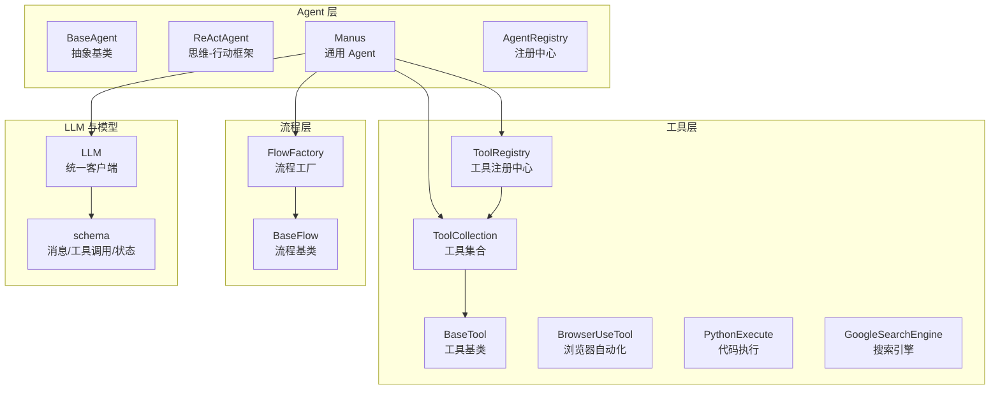
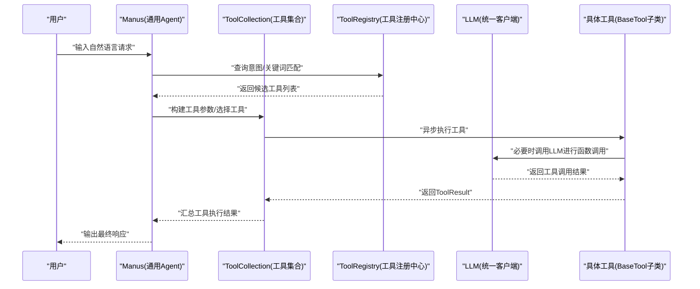
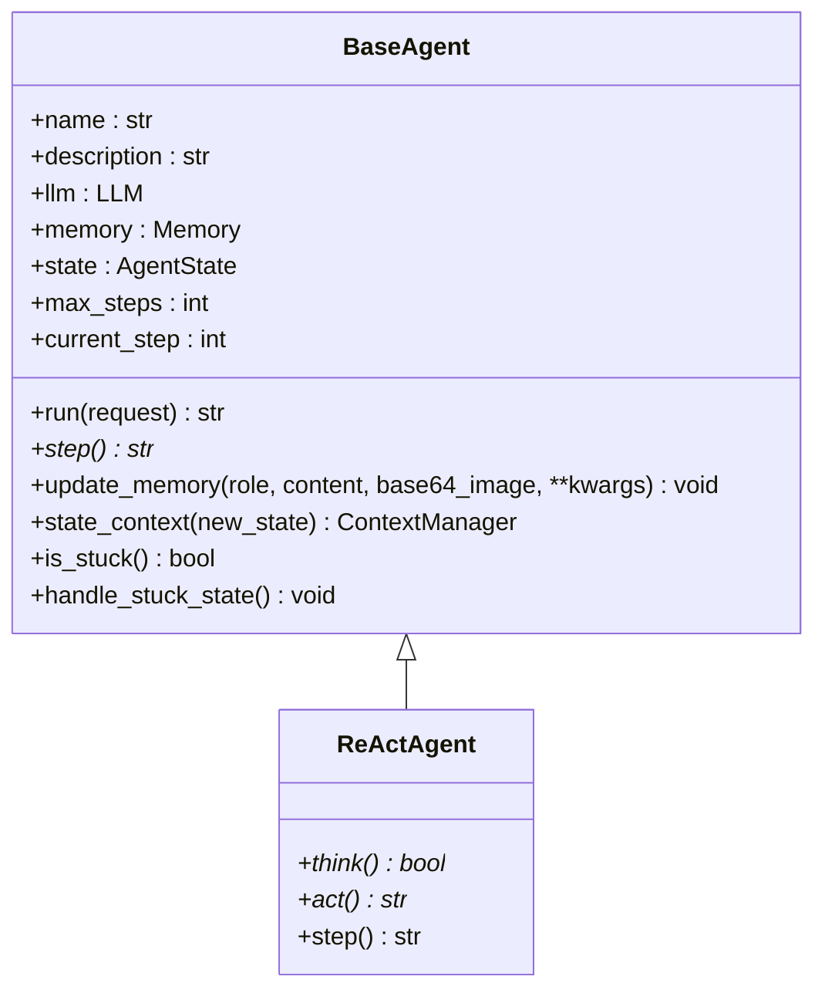
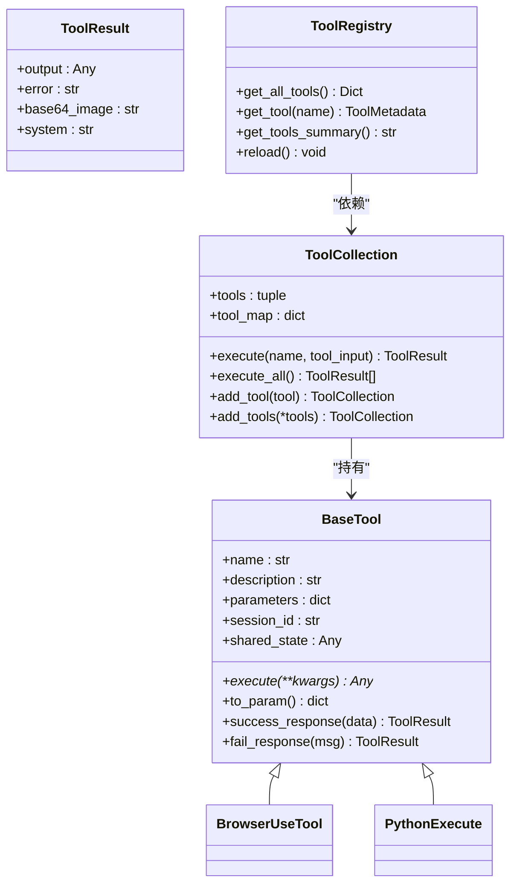
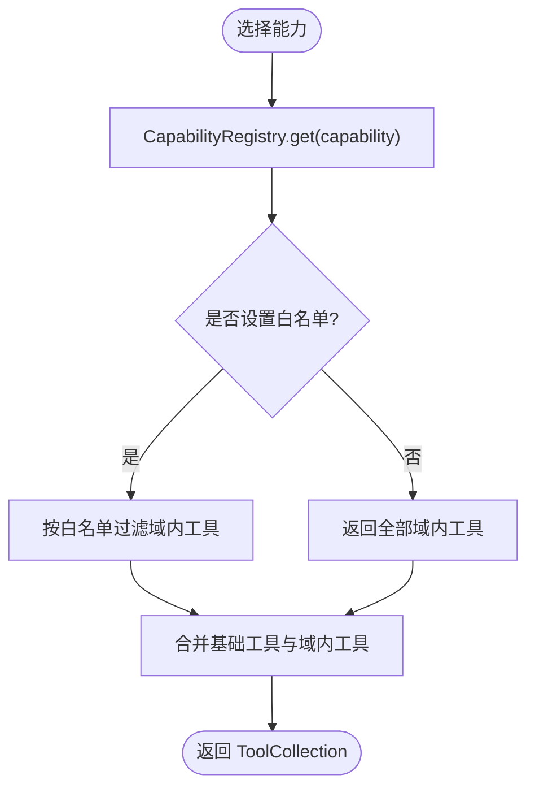
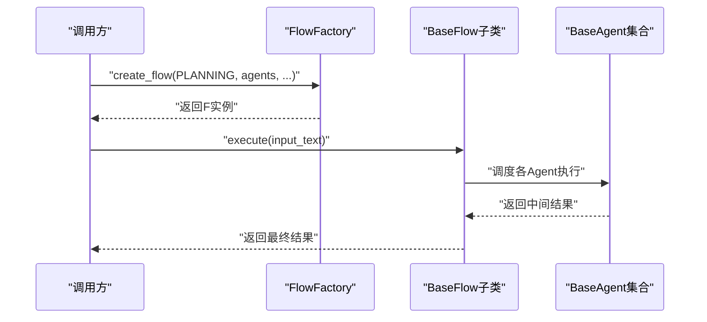
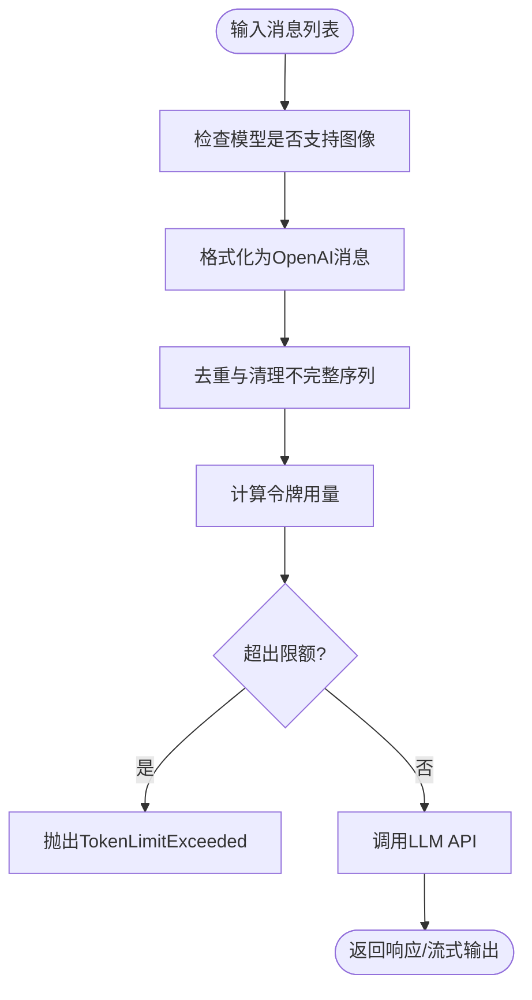
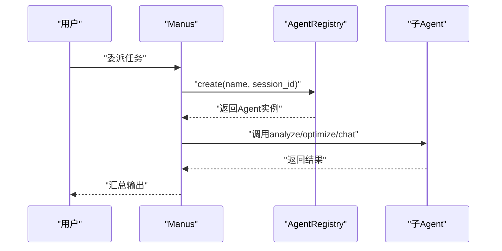
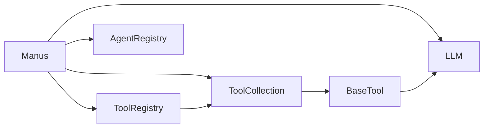

# 扩展开发

<cite>
**本文引用的文件**
- [backend/agent/agent/base.py](file://backend/agent/agent/base.py)
- [backend/agent/agent/react.py](file://backend/agent/agent/react.py)
- [backend/agent/agent/manus.py](file://backend/agent/agent/manus.py)
- [backend/agent/agent/registry.py](file://backend/agent/agent/registry.py)
- [backend/agent/flow/base.py](file://backend/agent/flow/base.py)
- [backend/agent/flow/flow_factory.py](file://backend/agent/flow/flow_factory.py)
- [backend/agent/tool/base.py](file://backend/agent/tool/base.py)
- [backend/agent/tool/tool_collection.py](file://backend/agent/tool/tool_collection.py)
- [backend/agent/tool/browser_use_tool.py](file://backend/agent/tool/browser_use_tool.py)
- [backend/agent/tool/python_execute.py](file://backend/agent/tool/python_execute.py)
- [backend/agent/tool/search/google_search.py](file://backend/agent/tool/search/google_search.py)
- [backend/agent/domain/intent/tool_registry.py](file://backend/agent/domain/intent/tool_registry.py)
- [backend/agent/agent/capability.py](file://backend/agent/agent/capability.py)
- [backend/agent/llm.py](file://backend/agent/llm.py)
- [backend/agent/schema.py](file://backend/agent/schema.py)
</cite>

## 目录
1. [引言](#引言)
2. [项目结构](#项目结构)
3. [核心组件](#核心组件)
4. [架构总览](#架构总览)
5. [详细组件分析](#详细组件分析)
6. [依赖关系分析](#依赖关系分析)
7. [性能考量](#性能考量)
8. [故障排查指南](#故障排查指南)
9. [结论](#结论)
10. [附录](#附录)

## 引言
本指南面向希望在 ResumeAgent 项目中进行扩展开发的开发者，涵盖插件系统设计、工具系统扩展机制、第三方集成方法，以及 Agent 技能开发、自定义工具创建、模板定制与 API 扩展的实现方式。文档同时提供扩展点识别、接口设计、兼容性保障与性能优化建议，并给出测试方法与发布流程，帮助你在不影响主流程的前提下安全地进行二次开发。

## 项目结构
ResumeAgent 采用分层清晰的架构：前端负责交互与展示，后端包含 Agent 核心、工具系统、意图识别、LLM 接入与流式处理、数据库与路由等模块。扩展开发主要围绕以下区域：
- Agent 层：抽象基类、具体 Agent 实现、能力注册与代理编排
- 工具层：工具基类、工具集合、工具注册与意图识别
- 流程层：流程工厂与多 Agent 协作
- LLM 层：统一的 LLM 客户端、令牌计数与消息格式化
- 数据模型层：消息、工具调用、状态枚举等

**图表来源**
- [backend/agent/agent/base.py:15-199](file://backend/agent/agent/base.py#L15-L199)
- [backend/agent/agent/react.py:11-39](file://backend/agent/agent/react.py#L11-L39)
- [backend/agent/agent/manus.py:72-177](file://backend/agent/agent/manus.py#L72-L177)
- [backend/agent/agent/registry.py:4-37](file://backend/agent/agent/registry.py#L4-L37)
- [backend/agent/flow/base.py:9-58](file://backend/agent/flow/base.py#L9-L58)
- [backend/agent/flow/flow_factory.py:13-31](file://backend/agent/flow/flow_factory.py#L13-L31)
- [backend/agent/tool/base.py:80-178](file://backend/agent/tool/base.py#L80-L178)
- [backend/agent/tool/tool_collection.py:11-74](file://backend/agent/tool/tool_collection.py#L11-L74)
- [backend/agent/domain/intent/tool_registry.py:60-259](file://backend/agent/domain/intent/tool_registry.py#L60-L259)
- [backend/agent/tool/browser_use_tool.py:40-577](file://backend/agent/tool/browser_use_tool.py#L40-L577)
- [backend/agent/tool/python_execute.py:9-76](file://backend/agent/tool/python_execute.py#L9-L76)
- [backend/agent/tool/search/google_search.py:8-34](file://backend/agent/tool/search/google_search.py#L8-L34)
- [backend/agent/llm.py:211-800](file://backend/agent/llm.py#L211-L800)
- [backend/agent/schema.py:54-229](file://backend/agent/schema.py#L54-L229)

**章节来源**
- [backend/agent/agent/base.py:15-199](file://backend/agent/agent/base.py#L15-L199)
- [backend/agent/tool/base.py:80-178](file://backend/agent/tool/base.py#L80-L178)
- [backend/agent/flow/flow_factory.py:13-31](file://backend/agent/flow/flow_factory.py#L13-L31)
- [backend/agent/llm.py:211-800](file://backend/agent/llm.py#L211-L800)
- [backend/agent/schema.py:54-229](file://backend/agent/schema.py#L54-L229)

## 核心组件
- Agent 抽象基类与生命周期
  - 提供状态机、内存管理、运行循环、卡顿检测与恢复策略
  - 子类需实现 step 方法，遵循统一的状态上下文与异常处理
- 工具基类与结果封装
  - 统一的工具参数 schema、函数调用格式转换、成功/失败结果封装
  - 支持组合与链式处理，便于扩展与复用
- 工具集合与注册中心
  - 工具集合负责执行与并发控制；工具注册中心负责意图识别与关键词抽取
- 流程工厂与多 Agent 编排
  - 工厂模式创建不同类型的执行流程，支持多 Agent 协作
- LLM 统一接入与令牌计数
  - 支持多种供应商、模型类型与流式响应；内置令牌计数与去重校验
- 数据模型与消息格式
  - 明确的角色、工具调用、消息与状态枚举，确保跨模块一致性

**章节来源**
- [backend/agent/agent/base.py:15-199](file://backend/agent/agent/base.py#L15-L199)
- [backend/agent/tool/base.py:80-178](file://backend/agent/tool/base.py#L80-L178)
- [backend/agent/tool/tool_collection.py:11-74](file://backend/agent/tool/tool_collection.py#L11-L74)
- [backend/agent/domain/intent/tool_registry.py:60-259](file://backend/agent/domain/intent/tool_registry.py#L60-L259)
- [backend/agent/flow/flow_factory.py:13-31](file://backend/agent/flow/flow_factory.py#L13-L31)
- [backend/agent/llm.py:211-800](file://backend/agent/llm.py#L211-L800)
- [backend/agent/schema.py:54-229](file://backend/agent/schema.py#L54-L229)

## 架构总览
下图展示了扩展开发的关键交互路径：Agent 通过工具集合调用工具，工具注册中心提供意图识别与关键词匹配，LLM 提供推理与函数调用能力，流程工厂协调多 Agent 执行。

**图表来源**
- [backend/agent/agent/manus.py:133-161](file://backend/agent/agent/manus.py#L133-L161)
- [backend/agent/tool/tool_collection.py:27-48](file://backend/agent/tool/tool_collection.py#L27-L48)
- [backend/agent/domain/intent/tool_registry.py:220-237](file://backend/agent/domain/intent/tool_registry.py#L220-L237)
- [backend/agent/llm.py:791-800](file://backend/agent/llm.py#L791-L800)
- [backend/agent/tool/base.py:120-178](file://backend/agent/tool/base.py#L120-L178)

## 详细组件分析

### Agent 抽象基类与扩展点
- 设计要点
  - 状态机：IDLE/RUNNING/FINISHED/ERROR，通过上下文管理器安全切换
  - 内存管理：滑动窗口消息存储，支持清理不完整序列
  - 运行循环：最大步数限制、卡顿检测与策略调整
  - 子类扩展：继承 BaseAgent 并实现 step，即可无缝接入统一调度
- 兼容性与稳定性
  - 默认 LLM 与 Memory 初始化，允许子类覆盖
  - 异常时进入 ERROR 状态并回滚，避免脏状态传播
- 性能建议
  - 控制 max_steps 与 Memory 窗口大小，平衡精度与资源占用
  - 在 step 中尽量使用异步 I/O，避免阻塞

**图表来源**
- [backend/agent/agent/base.py:15-199](file://backend/agent/agent/base.py#L15-L199)
- [backend/agent/agent/react.py:11-39](file://backend/agent/agent/react.py#L11-L39)

**章节来源**
- [backend/agent/agent/base.py:15-199](file://backend/agent/agent/base.py#L15-L199)
- [backend/agent/agent/react.py:11-39](file://backend/agent/agent/react.py#L11-L39)

### 工具系统与扩展机制
- 工具基类与结果封装
  - ToolResult 统一封装输出、错误、图片与系统信息
  - BaseTool 提供 to_param 将工具暴露为函数调用格式
- 工具集合与执行
  - ToolCollection 负责工具映射、顺序执行与并发控制
  - 支持批量执行与错误聚合，便于调试与可观测性
- 工具注册中心与意图识别
  - ToolRegistry 自动从 ToolCollection 发现工具，支持 YAML 配置覆盖
  - 自动提取关键词与正则模式，提供工具摘要与优先级
- 第三方集成示例
  - 浏览器自动化：BrowserUseTool 通过锁与上下文管理器确保线程安全
  - 代码执行：PythonExecute 通过进程隔离与超时控制保障安全
  - 搜索引擎：GoogleSearchEngine 适配统一接口，便于替换其他引擎

**图表来源**
- [backend/agent/tool/base.py:40-178](file://backend/agent/tool/base.py#L40-L178)
- [backend/agent/tool/tool_collection.py:11-74](file://backend/agent/tool/tool_collection.py#L11-L74)
- [backend/agent/domain/intent/tool_registry.py:60-259](file://backend/agent/domain/intent/tool_registry.py#L60-L259)
- [backend/agent/tool/browser_use_tool.py:40-577](file://backend/agent/tool/browser_use_tool.py#L40-L577)
- [backend/agent/tool/python_execute.py:9-76](file://backend/agent/tool/python_execute.py#L9-L76)

**章节来源**
- [backend/agent/tool/base.py:40-178](file://backend/agent/tool/base.py#L40-L178)
- [backend/agent/tool/tool_collection.py:11-74](file://backend/agent/tool/tool_collection.py#L11-L74)
- [backend/agent/domain/intent/tool_registry.py:60-259](file://backend/agent/domain/intent/tool_registry.py#L60-L259)
- [backend/agent/tool/browser_use_tool.py:40-577](file://backend/agent/tool/browser_use_tool.py#L40-L577)
- [backend/agent/tool/python_execute.py:9-76](file://backend/agent/tool/python_execute.py#L9-L76)

### Agent 能力与白名单
- 能力注册中心
  - 通过 ResumeCapability 定义工具白名单与附加指令
  - 支持 analyze/edit/optimize/full 等能力维度
- Manus Agent 的工具装配
  - 根据能力选择域内工具，实现最小权限与功能聚焦
- 扩展建议
  - 新增能力时，定义新的 ResumeCapability 并注册
  - 在 ToolCollection 构建阶段按白名单装配工具

**图表来源**
- [backend/agent/agent/capability.py:14-68](file://backend/agent/agent/capability.py#L14-L68)
- [backend/agent/agent/manus.py:133-161](file://backend/agent/agent/manus.py#L133-L161)

**章节来源**
- [backend/agent/agent/capability.py:14-68](file://backend/agent/agent/capability.py#L14-L68)
- [backend/agent/agent/manus.py:133-161](file://backend/agent/agent/manus.py#L133-L161)

### 流程工厂与多 Agent 协作
- 流程基类
  - 支持单/多 Agent 输入，自动推导主 Agent
- 流程工厂
  - 通过枚举与映射创建不同流程类型（如 Planning）
- 扩展建议
  - 新增流程类型时，在工厂中注册映射
  - 在流程中注入工具集合与 Agent 注册中心，实现动态编排

**图表来源**
- [backend/agent/flow/flow_factory.py:13-31](file://backend/agent/flow/flow_factory.py#L13-L31)
- [backend/agent/flow/base.py:9-58](file://backend/agent/flow/base.py#L9-L58)
- [backend/agent/agent/registry.py:4-37](file://backend/agent/agent/registry.py#L4-L37)

**章节来源**
- [backend/agent/flow/flow_factory.py:13-31](file://backend/agent/flow/flow_factory.py#L13-L31)
- [backend/agent/flow/base.py:9-58](file://backend/agent/flow/base.py#L9-L58)
- [backend/agent/agent/registry.py:4-37](file://backend/agent/agent/registry.py#L4-L37)

### LLM 接入与消息格式化
- 统一客户端
  - 支持 Azure/OpenAI/AWS Bedrock，内置重试与超时
  - 令牌计数与去重校验，确保 API 兼容性
- 消息格式化
  - 将内部消息对象转换为 OpenAI 格式，处理工具调用与图片
- 扩展建议
  - 新增模型时，完善令牌计数与消息格式化规则
  - 在 ask_with_images 中严格校验最后一条消息角色

**图表来源**
- [backend/agent/llm.py:324-494](file://backend/agent/llm.py#L324-L494)
- [backend/agent/llm.py:495-624](file://backend/agent/llm.py#L495-L624)
- [backend/agent/llm.py:625-783](file://backend/agent/llm.py#L625-L783)
- [backend/agent/schema.py:54-229](file://backend/agent/schema.py#L54-L229)

**章节来源**
- [backend/agent/llm.py:324-494](file://backend/agent/llm.py#L324-L494)
- [backend/agent/llm.py:495-624](file://backend/agent/llm.py#L495-L624)
- [backend/agent/llm.py:625-783](file://backend/agent/llm.py#L625-L783)
- [backend/agent/schema.py:54-229](file://backend/agent/schema.py#L54-L229)

### Agent 注册中心与代理编排
- Agent 注册中心
  - 支持类注册与工厂注册两种方式
  - 动态创建 Agent 实例，便于扩展新 Agent 类型
- Manus 的委派策略
  - 通过 AgentRegistry.create 动态委派任务给子 Agent
  - 支持并行委托多个分析 Agent，聚合结果

**图表来源**
- [backend/agent/agent/registry.py:4-37](file://backend/agent/agent/registry.py#L4-L37)
- [backend/agent/agent/manus.py:188-214](file://backend/agent/agent/manus.py#L188-L214)

**章节来源**
- [backend/agent/agent/registry.py:4-37](file://backend/agent/agent/registry.py#L4-L37)
- [backend/agent/agent/manus.py:188-214](file://backend/agent/agent/manus.py#L188-L214)

## 依赖关系分析
- 组件耦合
  - Manus 依赖 ToolCollection、ToolRegistry、LLM、AgentRegistry 与流程工厂
  - 工具依赖 LLM 与外部服务（如浏览器、搜索引擎），通过参数与上下文解耦
- 外部依赖
  - LLM 客户端支持多供应商；工具层通过 BaseTool 抽象屏蔽差异
- 循环依赖
  - 通过模块导入与延迟初始化避免循环依赖风险

**图表来源**
- [backend/agent/agent/manus.py:133-161](file://backend/agent/agent/manus.py#L133-L161)
- [backend/agent/tool/tool_collection.py:11-74](file://backend/agent/tool/tool_collection.py#L11-L74)
- [backend/agent/domain/intent/tool_registry.py:60-259](file://backend/agent/domain/intent/tool_registry.py#L60-L259)
- [backend/agent/tool/base.py:80-178](file://backend/agent/tool/base.py#L80-L178)
- [backend/agent/llm.py:211-800](file://backend/agent/llm.py#L211-L800)

**章节来源**
- [backend/agent/agent/manus.py:133-161](file://backend/agent/agent/manus.py#L133-L161)
- [backend/agent/tool/tool_collection.py:11-74](file://backend/agent/tool/tool_collection.py#L11-L74)
- [backend/agent/domain/intent/tool_registry.py:60-259](file://backend/agent/domain/intent/tool_registry.py#L60-L259)
- [backend/agent/tool/base.py:80-178](file://backend/agent/tool/base.py#L80-L178)
- [backend/agent/llm.py:211-800](file://backend/agent/llm.py#L211-L800)

## 性能考量
- 令牌与成本控制
  - 使用 TokenCounter 估算输入/工具调用令牌，结合 LLM 的 max_input_tokens 与 max_tokens 控制成本
  - 在 ask/ask_with_images 中进行限额检查，避免超额请求
- I/O 与并发
  - 工具执行采用异步与进程隔离（如 PythonExecute），避免阻塞与越权
  - 流式响应降低首屏延迟，注意累积令牌统计的准确性
- 内存与状态
  - Memory 滑动窗口限制消息数量，定期清理不完整序列
  - Agent 状态机在异常时回滚，避免长期处于错误状态

[本节为通用指导，无需特定文件引用]

## 故障排查指南
- 常见问题定位
  - 工具执行失败：检查 ToolCollection.execute 的 ToolError 捕获与 ToolFailure 返回
  - LLM 调用异常：关注 ask/ask_with_images 的重试与异常分支，核对网络配置与鉴权
  - 令牌超限：确认 TokenCounter 与 LLM 的限额配置，必要时降低消息长度或分段处理
- 日志与可观测性
  - LLM 与工具层均记录调试日志，便于追踪消息格式化与调用链
- 回滚与恢复
  - BaseAgent 的 state_context 在异常时进入 ERROR 并回滚状态
  - BrowserUseTool 提供 cleanup 与 __del__ 保障资源释放

**章节来源**
- [backend/agent/tool/tool_collection.py:27-48](file://backend/agent/tool/tool_collection.py#L27-L48)
- [backend/agent/llm.py:495-624](file://backend/agent/llm.py#L495-L624)
- [backend/agent/agent/base.py:60-85](file://backend/agent/agent/base.py#L60-L85)
- [backend/agent/tool/browser_use_tool.py:550-570](file://backend/agent/tool/browser_use_tool.py#L550-L570)

## 结论
ResumeAgent 的扩展开发以“工具即插件”的理念为核心：通过 BaseTool 抽象与 ToolCollection/ToolRegistry 实现工具的标准化与可发现性；借助 LLM 统一客户端与消息格式化保障跨模型兼容；通过 Agent 抽象与流程工厂实现多 Agent 协作与能力编排。遵循本文的扩展点识别、接口设计与兼容性建议，可在不破坏现有稳定性的前提下快速迭代新功能。

[本节为总结性内容，无需特定文件引用]

## 附录

### Agent 技能开发步骤
- 定义技能目标与输入输出
- 设计工具参数 schema 与错误处理
- 实现 BaseTool 子类的 execute 方法
- 在 ToolCollection 中注册工具
- 通过 ToolRegistry 验证关键词与优先级
- 在 Manus 的能力配置中启用相关工具

**章节来源**
- [backend/agent/tool/base.py:80-178](file://backend/agent/tool/base.py#L80-L178)
- [backend/agent/tool/tool_collection.py:53-74](file://backend/agent/tool/tool_collection.py#L53-L74)
- [backend/agent/domain/intent/tool_registry.py:166-205](file://backend/agent/domain/intent/tool_registry.py#L166-L205)
- [backend/agent/agent/manus.py:133-161](file://backend/agent/agent/manus.py#L133-L161)

### 自定义工具创建最佳实践
- 参数校验与文档化：在 parameters 中明确必填字段与依赖关系
- 错误处理：使用 fail_response 返回统一错误格式
- 并发与隔离：长耗时或危险操作使用进程/锁保护
- 可观测性：在关键路径记录日志，便于调试

**章节来源**
- [backend/agent/tool/base.py:120-178](file://backend/agent/tool/base.py#L120-L178)
- [backend/agent/tool/python_execute.py:25-76](file://backend/agent/tool/python_execute.py#L25-L76)
- [backend/agent/tool/browser_use_tool.py:143-151](file://backend/agent/tool/browser_use_tool.py#L143-L151)

### 模板定制与 API 扩展
- 模板定制：通过 ResumeCapability 的 instructions_addendum 注入提示词
- API 扩展：新增工具时遵循 BaseTool 接口，确保 to_param 与 ToolResult 格式一致
- 意图识别：在 ToolRegistry 的 YAML 配置中补充 keywords/patterns 与优先级

**章节来源**
- [backend/agent/agent/capability.py:14-68](file://backend/agent/agent/capability.py#L14-L68)
- [backend/agent/domain/intent/tool_registry.py:166-205](file://backend/agent/domain/intent/tool_registry.py#L166-L205)

### 测试方法与发布流程
- 单元测试
  - 工具：构造最小输入，断言 ToolResult 的 output/error
  - Agent：模拟 run 循环，断言状态与消息序列
  - LLM：mock 客户端，断言消息格式化与令牌计数
- 集成测试
  - Manually 构造 ToolCollection 与 ToolRegistry，验证工具链路
  - 使用真实 LLM 与外部服务（如浏览器）进行端到端验证
- 发布流程
  - 更新 ToolRegistry 的 YAML 配置（如有变更）
  - 增加或更新单元测试与集成测试
  - 在 CI 中执行测试套件并通过后再合并

[本节为通用指导，无需特定文件引用]