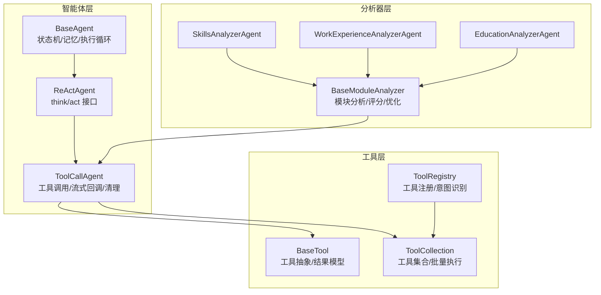
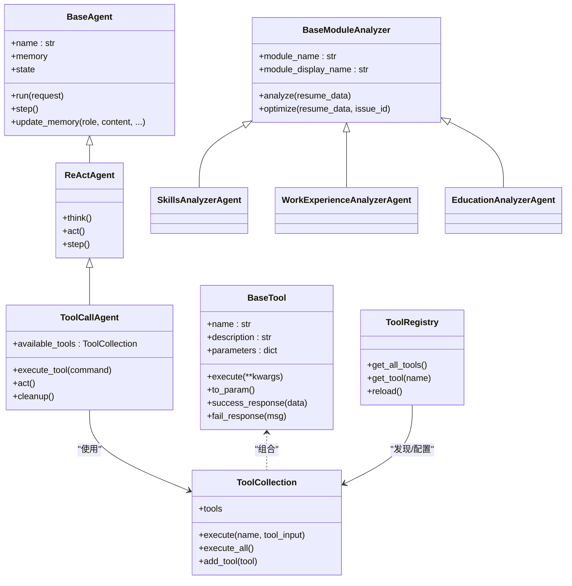
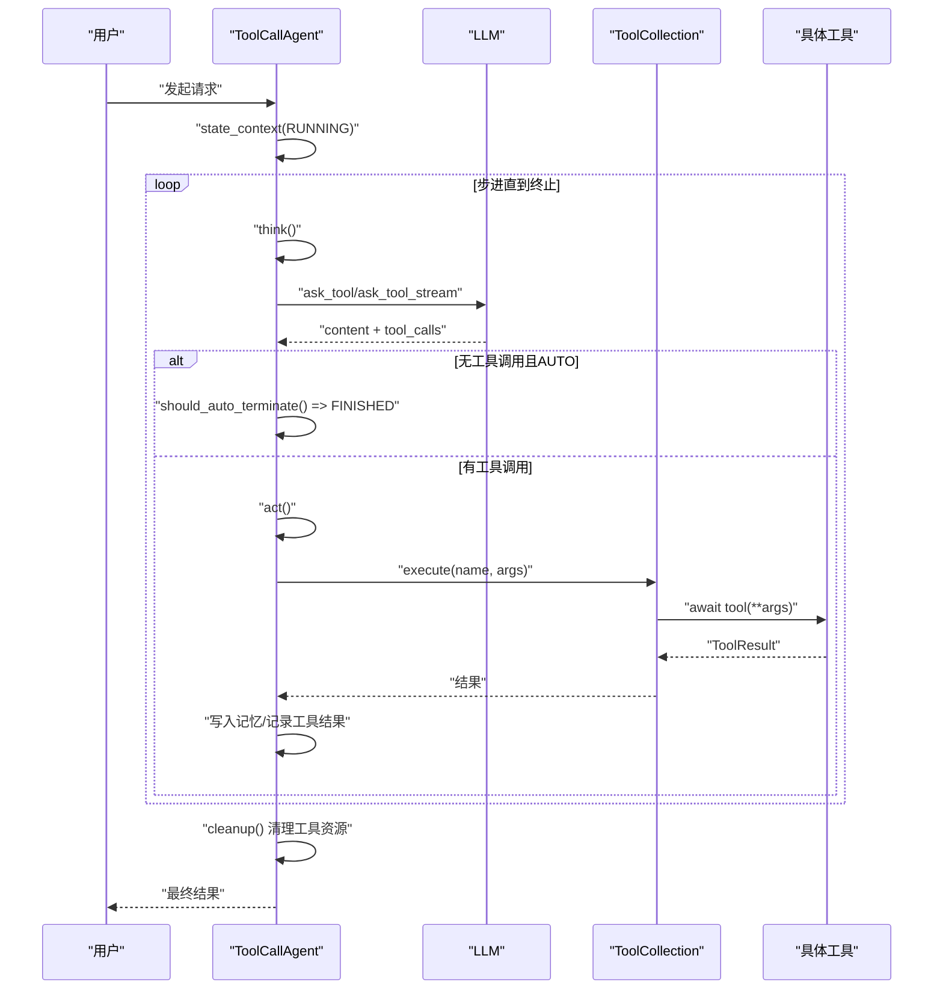
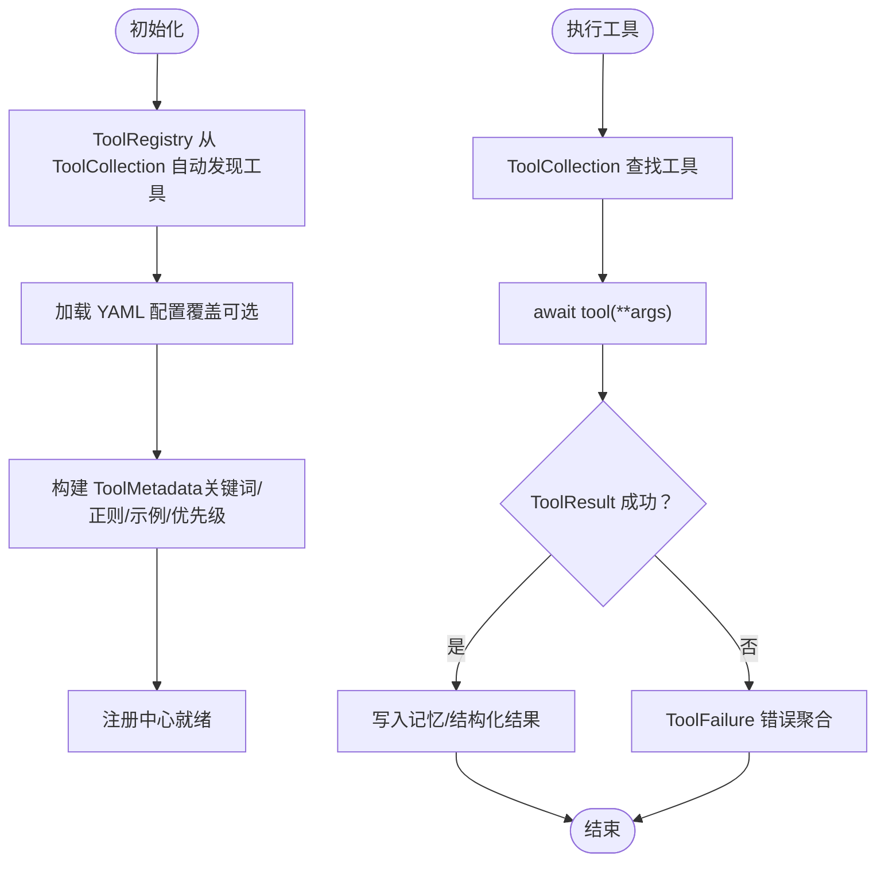
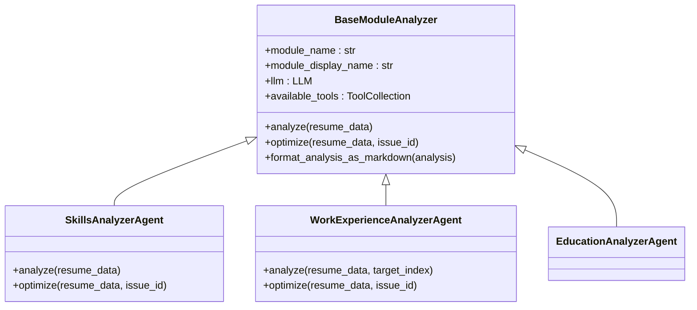
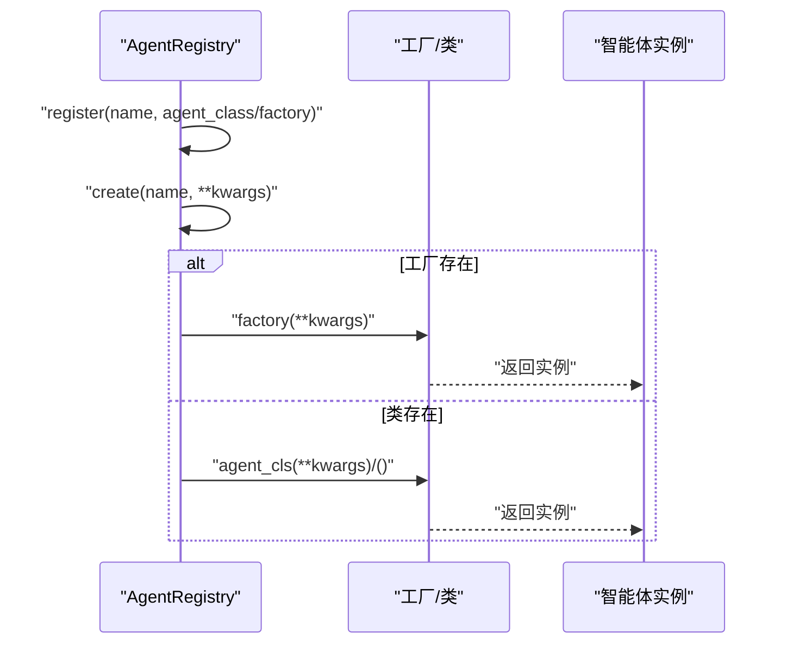
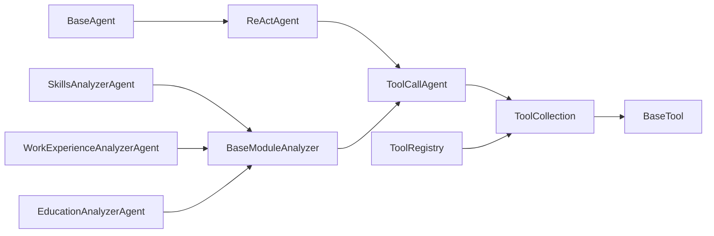

# 插件系统

<cite>
**本文引用的文件**
- [backend/agent/agent/base.py](file://backend/agent/agent/base.py)
- [backend/agent/agent/react.py](file://backend/agent/agent/react.py)
- [backend/agent/agent/toolcall.py](file://backend/agent/agent/toolcall.py)
- [backend/agent/agent/module/base_module_analyzer.py](file://backend/agent/agent/module/base_module_analyzer.py)
- [backend/agent/agent/analyzers/skills_analyzer.py](file://backend/agent/agent/analyzers/skills_analyzer.py)
- [backend/agent/agent/analyzers/work_experience_analyzer.py](file://backend/agent/agent/analyzers/work_experience_analyzer.py)
- [backend/agent/agent/analyzers/education_analyzer.py](file://backend/agent/agent/analyzers/education_analyzer.py)
- [backend/agent/agent/module/__init__.py](file://backend/agent/agent/module/__init__.py)
- [backend/agent/agent/registry.py](file://backend/agent/agent/registry.py)
- [backend/agent/tool/base.py](file://backend/agent/tool/base.py)
- [backend/agent/tool/tool_collection.py](file://backend/agent/tool/tool_collection.py)
- [backend/agent/domain/intent/tool_registry.py](file://backend/agent/domain/intent/tool_registry.py)
- [backend/agent/skills/office-files/SKILL.md](file://backend/agent/skills/office-files/SKILL.md)
</cite>

## 目录
1. [引言](#引言)
2. [项目结构](#项目结构)
3. [核心组件](#核心组件)
4. [架构总览](#架构总览)
5. [详细组件分析](#详细组件分析)
6. [依赖分析](#依赖分析)
7. [性能考虑](#性能考虑)
8. [故障排查指南](#故障排查指南)
9. [结论](#结论)
10. [附录](#附录)

## 引言
本指南面向希望在 ResumeAgent 中开发与扩展“插件系统”的工程师与架构师。文档聚焦于“Agent 技能插件”的架构设计、模块化组织与扩展机制，涵盖生命周期管理、依赖注入与配置系统，解释插件接口定义、参数传递、错误处理与性能监控，并提供技能分析器、模块分析器与工具集合的具体实现示例与最佳实践。

## 项目结构
ResumeAgent 的插件体系围绕“智能体（Agent）+ 工具（Tool）+ 分析器（Analyzer）”三层展开：
- 智能体层：提供统一的状态机、记忆与执行循环，支持工具调用与自动终止。
- 工具层：封装可复用能力，统一结果模型与参数格式，支持批量执行与错误聚合。
- 分析器层：面向简历各模块的分析与优化，提供评分、优先级与报告输出。

图表来源
- [backend/agent/agent/base.py:15-199](file://backend/agent/agent/base.py#L15-L199)
- [backend/agent/agent/react.py:11-39](file://backend/agent/agent/react.py#L11-L39)
- [backend/agent/agent/toolcall.py:21-522](file://backend/agent/agent/toolcall.py#L21-L522)
- [backend/agent/tool/base.py:80-178](file://backend/agent/tool/base.py#L80-L178)
- [backend/agent/tool/tool_collection.py:11-74](file://backend/agent/tool/tool_collection.py#L11-L74)
- [backend/agent/domain/intent/tool_registry.py:60-259](file://backend/agent/domain/intent/tool_registry.py#L60-L259)
- [backend/agent/agent/module/base_module_analyzer.py:19-320](file://backend/agent/agent/module/base_module_analyzer.py#L19-L320)
- [backend/agent/agent/analyzers/skills_analyzer.py:7-85](file://backend/agent/agent/analyzers/skills_analyzer.py#L7-L85)
- [backend/agent/agent/analyzers/work_experience_analyzer.py:33-280](file://backend/agent/agent/analyzers/work_experience_analyzer.py#L33-L280)
- [backend/agent/agent/analyzers/education_analyzer.py:5-10](file://backend/agent/agent/analyzers/education_analyzer.py#L5-L10)

章节来源
- [backend/agent/agent/base.py:15-199](file://backend/agent/agent/base.py#L15-L199)
- [backend/agent/agent/react.py:11-39](file://backend/agent/agent/react.py#L11-L39)
- [backend/agent/agent/toolcall.py:21-522](file://backend/agent/agent/toolcall.py#L21-L522)
- [backend/agent/tool/base.py:80-178](file://backend/agent/tool/base.py#L80-L178)
- [backend/agent/tool/tool_collection.py:11-74](file://backend/agent/tool/tool_collection.py#L11-L74)
- [backend/agent/domain/intent/tool_registry.py:60-259](file://backend/agent/domain/intent/tool_registry.py#L60-L259)
- [backend/agent/agent/module/base_module_analyzer.py:19-320](file://backend/agent/agent/module/base_module_analyzer.py#L19-L320)
- [backend/agent/agent/analyzers/skills_analyzer.py:7-85](file://backend/agent/agent/analyzers/skills_analyzer.py#L7-L85)
- [backend/agent/agent/analyzers/work_experience_analyzer.py:33-280](file://backend/agent/agent/analyzers/work_experience_analyzer.py#L33-L280)
- [backend/agent/agent/analyzers/education_analyzer.py:5-10](file://backend/agent/agent/analyzers/education_analyzer.py#L5-L10)

## 核心组件
- BaseAgent：抽象智能体基类，提供状态上下文、内存管理、执行循环与卡住检测。
- ReActAgent：定义 think/act 接口，统一“思考-行动”步进。
- ToolCallAgent：增强工具调用能力，支持自动终止、流式回调、特殊工具处理与资源清理。
- BaseModuleAnalyzer：模块分析器基类，统一 analyze/optimize 接口、评分与报告格式化。
- BaseTool/ToolCollection：工具抽象与集合，统一参数格式、批量执行与错误聚合。
- ToolRegistry：工具注册中心，支持自动发现、配置覆盖与关键词抽取。
- AgentRegistry：智能体注册中心，支持工厂与类注册。

章节来源
- [backend/agent/agent/base.py:15-199](file://backend/agent/agent/base.py#L15-L199)
- [backend/agent/agent/react.py:11-39](file://backend/agent/agent/react.py#L11-L39)
- [backend/agent/agent/toolcall.py:21-522](file://backend/agent/agent/toolcall.py#L21-L522)
- [backend/agent/agent/module/base_module_analyzer.py:19-320](file://backend/agent/agent/module/base_module_analyzer.py#L19-L320)
- [backend/agent/tool/base.py:80-178](file://backend/agent/tool/base.py#L80-L178)
- [backend/agent/tool/tool_collection.py:11-74](file://backend/agent/tool/tool_collection.py#L11-L74)
- [backend/agent/domain/intent/tool_registry.py:60-259](file://backend/agent/domain/intent/tool_registry.py#L60-L259)
- [backend/agent/agent/registry.py:4-37](file://backend/agent/agent/registry.py#L4-L37)

## 架构总览
插件系统采用“智能体-工具-分析器”分层与“注册中心”解耦的设计：
- 智能体通过 ToolCallAgent 统一调度工具，结合 ToolCollection 执行函数式调用。
- 分析器基于 BaseModuleAnalyzer 定义模块化分析与优化流程，支持评分与优先级计算。
- 工具注册中心 ToolRegistry 从 ToolCollection 自动发现工具，并允许 YAML 配置覆盖与关键词抽取。
- AgentRegistry 提供智能体的注册与创建，支持工厂与类两种方式。

图表来源
- [backend/agent/agent/base.py:15-199](file://backend/agent/agent/base.py#L15-L199)
- [backend/agent/agent/react.py:11-39](file://backend/agent/agent/react.py#L11-L39)
- [backend/agent/agent/toolcall.py:21-522](file://backend/agent/agent/toolcall.py#L21-L522)
- [backend/agent/tool/base.py:80-178](file://backend/agent/tool/base.py#L80-L178)
- [backend/agent/tool/tool_collection.py:11-74](file://backend/agent/tool/tool_collection.py#L11-L74)
- [backend/agent/domain/intent/tool_registry.py:60-259](file://backend/agent/domain/intent/tool_registry.py#L60-L259)
- [backend/agent/agent/module/base_module_analyzer.py:19-320](file://backend/agent/agent/module/base_module_analyzer.py#L19-L320)
- [backend/agent/agent/analyzers/skills_analyzer.py:7-85](file://backend/agent/agent/analyzers/skills_analyzer.py#L7-L85)
- [backend/agent/agent/analyzers/work_experience_analyzer.py:33-280](file://backend/agent/agent/analyzers/work_experience_analyzer.py#L33-L280)
- [backend/agent/agent/analyzers/education_analyzer.py:5-10](file://backend/agent/agent/analyzers/education_analyzer.py#L5-L10)

## 详细组件分析

### 智能体生命周期与控制流
- 状态机：BaseAgent 提供 state_context 上下文，确保异常时进入 ERROR 状态并恢复。
- 执行循环：BaseAgent.run 启动执行，逐步调用 step，支持卡住检测与自动终止。
- ReActAgent：定义 think/act 接口，step 统一“思考-行动”。
- ToolCallAgent：在 think 中根据工具选择策略决定是否自动终止；act 执行工具调用并将结果写入记忆。

图表来源
- [backend/agent/agent/base.py:60-156](file://backend/agent/agent/base.py#L60-L156)
- [backend/agent/agent/react.py:33-39](file://backend/agent/agent/react.py#L33-L39)
- [backend/agent/agent/toolcall.py:258-522](file://backend/agent/agent/toolcall.py#L258-L522)
- [backend/agent/tool/tool_collection.py:27-48](file://backend/agent/tool/tool_collection.py#L27-L48)

章节来源
- [backend/agent/agent/base.py:60-156](file://backend/agent/agent/base.py#L60-L156)
- [backend/agent/agent/react.py:33-39](file://backend/agent/agent/react.py#L33-L39)
- [backend/agent/agent/toolcall.py:258-522](file://backend/agent/agent/toolcall.py#L258-L522)
- [backend/agent/tool/tool_collection.py:27-48](file://backend/agent/tool/tool_collection.py#L27-L48)

### 工具系统与依赖注入
- BaseTool：定义工具抽象、参数 schema 与标准化结果模型 ToolResult。
- ToolCollection：维护工具映射，支持批量执行、顺序执行与去重添加。
- ToolRegistry：从 ToolCollection 自动发现工具，支持 YAML 配置覆盖、关键词抽取与优先级设置。
- 依赖注入：智能体通过构造函数注入 LLM、Memory、ToolCollection；工具通过 ToolCollection 注入。

图表来源
- [backend/agent/tool/base.py:80-178](file://backend/agent/tool/base.py#L80-L178)
- [backend/agent/tool/tool_collection.py:11-74](file://backend/agent/tool/tool_collection.py#L11-L74)
- [backend/agent/domain/intent/tool_registry.py:98-244](file://backend/agent/domain/intent/tool_registry.py#L98-L244)

章节来源
- [backend/agent/tool/base.py:80-178](file://backend/agent/tool/base.py#L80-L178)
- [backend/agent/tool/tool_collection.py:11-74](file://backend/agent/tool/tool_collection.py#L11-L74)
- [backend/agent/domain/intent/tool_registry.py:98-244](file://backend/agent/domain/intent/tool_registry.py#L98-L244)

### 模块分析器与技能插件
- BaseModuleAnalyzer：定义 analyze/optimize 接口、评分与优先级计算、标准问题/亮点/弱点对象创建、Markdown 报告格式化、LLM 辅助分析。
- SkillsAnalyzerAgent：技能模块的轻量规则分析与优化示例。
- WorkExperienceAnalyzerAgent：基于规则的分析与优化示例，支持量化指标、动词开头与结构化要点。
- EducationAnalyzerAgent：通过注册适配现有教育分析模块。

图表来源
- [backend/agent/agent/module/base_module_analyzer.py:19-320](file://backend/agent/agent/module/base_module_analyzer.py#L19-L320)
- [backend/agent/agent/analyzers/skills_analyzer.py:7-85](file://backend/agent/agent/analyzers/skills_analyzer.py#L7-L85)
- [backend/agent/agent/analyzers/work_experience_analyzer.py:33-280](file://backend/agent/agent/analyzers/work_experience_analyzer.py#L33-L280)
- [backend/agent/agent/analyzers/education_analyzer.py:5-10](file://backend/agent/agent/analyzers/education_analyzer.py#L5-L10)

章节来源
- [backend/agent/agent/module/base_module_analyzer.py:19-320](file://backend/agent/agent/module/base_module_analyzer.py#L19-L320)
- [backend/agent/agent/analyzers/skills_analyzer.py:7-85](file://backend/agent/agent/analyzers/skills_analyzer.py#L7-L85)
- [backend/agent/agent/analyzers/work_experience_analyzer.py:33-280](file://backend/agent/agent/analyzers/work_experience_analyzer.py#L33-L280)
- [backend/agent/agent/analyzers/education_analyzer.py:5-10](file://backend/agent/agent/analyzers/education_analyzer.py#L5-L10)

### 智能体注册与加载顺序
- AgentRegistry：支持类注册与工厂注册；create 支持参数注入与回退构造。
- 加载顺序：先注册类/工厂，再通过 create 按需创建实例；ToolRegistry 在 ToolCollection 就绪后初始化。

图表来源
- [backend/agent/agent/registry.py:4-37](file://backend/agent/agent/registry.py#L4-L37)

章节来源
- [backend/agent/agent/registry.py:4-37](file://backend/agent/agent/registry.py#L4-L37)

### 技能插件的路由与工作流
- office-files 技能套件通过 SKILL.md 定义入口与子技能路由，依据用户提及的文件类型或扩展名选择相应子技能。
- 工作流：识别格式 → 加载子技能 → 执行相应流程。

章节来源
- [backend/agent/skills/office-files/SKILL.md:1-57](file://backend/agent/skills/office-files/SKILL.md#L1-L57)

## 依赖分析
- 智能体层对工具层的依赖：ToolCallAgent 依赖 ToolCollection 与 BaseTool；BaseAgent/ReActAgent 作为通用基类被 ToolCallAgent 继承。
- 分析器层对智能体层的依赖：BaseModuleAnalyzer 继承 ToolCallAgent，从而获得工具调用与记忆能力。
- 工具注册中心对工具层的依赖：ToolRegistry 依赖 ToolCollection 与 BaseTool，用于自动发现与配置覆盖。
- 模块导出：模块分析器包导出基类与部分实现，便于外部扩展。

图表来源
- [backend/agent/agent/base.py:15-199](file://backend/agent/agent/base.py#L15-L199)
- [backend/agent/agent/react.py:11-39](file://backend/agent/agent/react.py#L11-L39)
- [backend/agent/agent/toolcall.py:21-522](file://backend/agent/agent/toolcall.py#L21-L522)
- [backend/agent/tool/base.py:80-178](file://backend/agent/tool/base.py#L80-L178)
- [backend/agent/tool/tool_collection.py:11-74](file://backend/agent/tool/tool_collection.py#L11-L74)
- [backend/agent/domain/intent/tool_registry.py:60-259](file://backend/agent/domain/intent/tool_registry.py#L60-L259)
- [backend/agent/agent/module/base_module_analyzer.py:19-320](file://backend/agent/agent/module/base_module_analyzer.py#L19-L320)
- [backend/agent/agent/analyzers/skills_analyzer.py:7-85](file://backend/agent/agent/analyzers/skills_analyzer.py#L7-L85)
- [backend/agent/agent/analyzers/work_experience_analyzer.py:33-280](file://backend/agent/agent/analyzers/work_experience_analyzer.py#L33-L280)
- [backend/agent/agent/analyzers/education_analyzer.py:5-10](file://backend/agent/agent/analyzers/education_analyzer.py#L5-L10)

章节来源
- [backend/agent/agent/module/__init__.py:13-20](file://backend/agent/agent/module/__init__.py#L13-L20)

## 性能考虑
- 流式回调：ToolCallAgent 支持 on_content_delta 与取消事件，减少大响应等待时间。
- 自动终止：在 AUTO 模式下，若 LLM 返回纯文本而无工具调用，立即终止以节省 token。
- 工具批量执行：ToolCollection 提供 execute_all，便于并行化与顺序执行的权衡。
- 日志与可观测性：统一日志记录与状态切换，便于定位性能瓶颈。
- 内存与状态：BaseAgent 的 state_context 保证异常安全与状态恢复，避免资源泄漏。

## 故障排查指南
- 工具执行失败：ToolCollection 捕获 ToolError 并返回 ToolFailure，便于聚合与上报。
- Token 限额：ToolCallAgent 捕获 TokenLimitExceeded 并写入记忆与终止状态。
- 参数解析：execute_tool 对 JSON 参数进行校验，记录错误信息以便调试。
- 特殊工具：_handle_special_tool 与 _should_finish_execution 控制任务完成条件。
- 注册中心：ToolRegistry 的 reload 支持开发期热更新；检查配置文件格式与关键字规范化。

章节来源
- [backend/agent/tool/tool_collection.py:27-48](file://backend/agent/tool/tool_collection.py#L27-L48)
- [backend/agent/agent/toolcall.py:304-381](file://backend/agent/agent/toolcall.py#L304-L381)
- [backend/agent/agent/toolcall.py:420-480](file://backend/agent/agent/toolcall.py#L420-L480)
- [backend/agent/domain/intent/tool_registry.py:198-244](file://backend/agent/domain/intent/tool_registry.py#L198-L244)

## 结论
ResumeAgent 的插件系统通过清晰的分层与注册中心实现了高内聚、低耦合的扩展能力。智能体层提供统一的工具调用与生命周期管理，工具层提供标准化的执行模型与配置发现，分析器层聚焦领域能力与评分优化。借助这些机制，开发者可以快速实现新的技能分析器、工具与智能体，并通过配置与工厂灵活装配。

## 附录

### 插件开发示例清单
- 技能分析器示例
  - [SkillsAnalyzerAgent:7-85](file://backend/agent/agent/analyzers/skills_analyzer.py#L7-L85)
  - [WorkExperienceAnalyzerAgent:33-280](file://backend/agent/agent/analyzers/work_experience_analyzer.py#L33-L280)
- 模块分析器基类
  - [BaseModuleAnalyzer:19-320](file://backend/agent/agent/module/base_module_analyzer.py#L19-L320)
- 工具集合与工具
  - [ToolCollection:11-74](file://backend/agent/tool/tool_collection.py#L11-L74)
  - [BaseTool:80-178](file://backend/agent/tool/base.py#L80-L178)
- 工具注册中心
  - [ToolRegistry:60-259](file://backend/agent/domain/intent/tool_registry.py#L60-L259)
- 智能体注册中心
  - [AgentRegistry:4-37](file://backend/agent/agent/registry.py#L4-L37)
- 技能套件入口
  - [office-files SKILL.md:1-57](file://backend/agent/skills/office-files/SKILL.md#L1-L57)