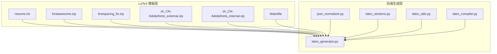
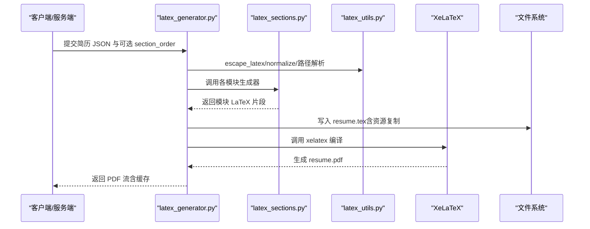
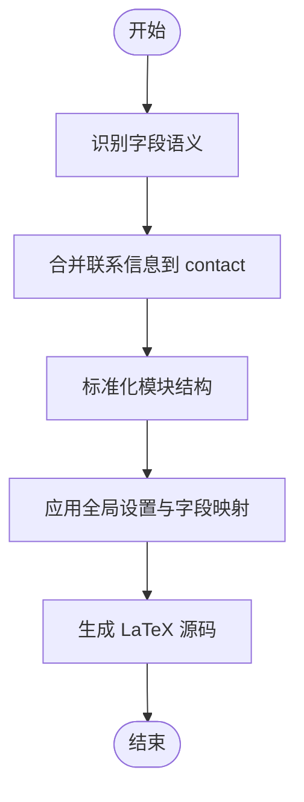
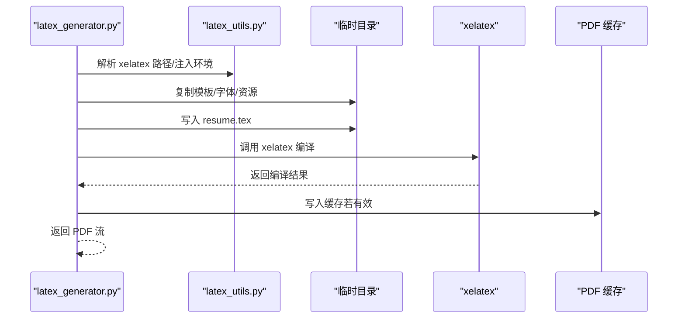
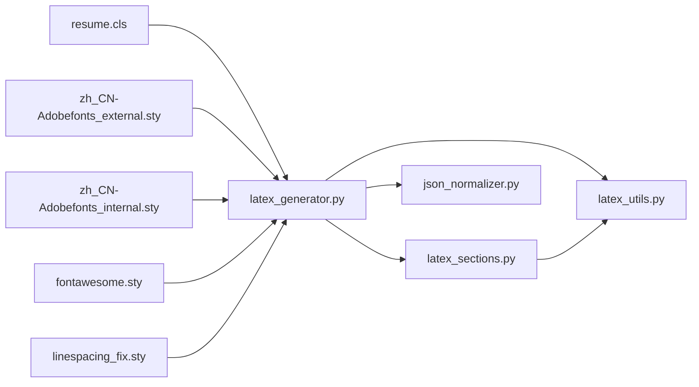

# 模板定制

<cite>
**本文引用的文件**
- [resume.cls](file://latex-resume-template/resume.cls)
- [latex_generator.py](file://backend/latex_generator.py)
- [latex_compiler.py](file://backend/latex_compiler.py)
- [latex_utils.py](file://backend/latex_utils.py)
- [latex_sections.py](file://backend/latex_sections.py)
- [json_normalizer.py](file://backend/json_normalizer.py)
- [Makefile](file://latex-resume-template/Makefile)
- [fontawesome.sty](file://latex-resume-template/fontawesome.sty)
- [linespacing_fix.sty](file://latex-resume-template/linespacing_fix.sty)
- [zh_CN-Adobefonts_external.sty](file://latex-resume-template/zh_CN-Adobefonts_external.sty)
- [zh_CN-Adobefonts_internal.sty](file://latex-resume-template/zh_CN-Adobefonts_internal.sty)
</cite>

## 目录
1. [引言](#引言)
2. [项目结构](#项目结构)
3. [核心组件](#核心组件)
4. [架构总览](#架构总览)
5. [详细组件分析](#详细组件分析)
6. [依赖关系分析](#依赖关系分析)
7. [性能考量](#性能考量)
8. [故障排查指南](#故障排查指南)
9. [结论](#结论)
10. [附录](#附录)

## 引言
本指南面向希望基于现有 LaTeX 简历模板系统进行定制与扩展的开发者与维护者。文档围绕模板系统架构、模板结构、编译流程、变量系统、样式定制与布局调整、模板继承与条件渲染、动态内容插入、模板验证与编译优化、兼容性测试、发布与版本管理、社区贡献等方面展开，帮助读者快速上手并安全地进行模板开发与发布。

## 项目结构
该系统由三层组成：
- LaTeX 模板层：提供简历类与样式宏包，定义排版规范与可定制项。
- 后端生成层：将 JSON 简历数据转换为 LaTeX 源码并编译为 PDF，提供缓存与错误摘要能力。
- 构建与工具层：Makefile 提供一键编译，样式宏包提供字体与排版修复。



**图表来源**
- [resume.cls:1-125](file://latex-resume-template/resume.cls#L1-L125)
- [latex_generator.py:1-676](file://backend/latex_generator.py#L1-L676)
- [latex_sections.py:1-879](file://backend/latex_sections.py#L1-L879)
- [latex_utils.py:1-252](file://backend/latex_utils.py#L1-L252)
- [json_normalizer.py:1-536](file://backend/json_normalizer.py#L1-L536)
- [Makefile:1-26](file://latex-resume-template/Makefile#L1-L26)

**章节来源**
- [resume.cls:1-125](file://latex-resume-template/resume.cls#L1-L125)
- [latex_generator.py:1-676](file://backend/latex_generator.py#L1-L676)
- [latex_sections.py:1-879](file://backend/latex_sections.py#L1-L879)
- [latex_utils.py:1-252](file://backend/latex_utils.py#L1-L252)
- [json_normalizer.py:1-536](file://backend/json_normalizer.py#L1-L536)
- [Makefile:1-26](file://latex-resume-template/Makefile#L1-L26)

## 核心组件
- 模板类与样式
  - resume.cls：定义文档类选项（字体大小）、页面几何、标题格式、时间列布局、姓名与联系方式排版命令等。
  - fontawesome.sty：提供 FontAwesome 图标集与调用命令。
  - linespacing_fix.sty：修复 setspace 导致的段落间距问题。
  - zh_CN-Adobefonts_external/internal.sty：中文字体设置与 CJK 字体族命令。
- 生成与编译
  - latex_generator.py：JSON → LaTeX 转换、全局设置应用、资源下载与裁剪、PDF 编译与缓存。
  - latex_sections.py：各模块（教育、实习/工作、项目、技能、奖项、开源、自定义）的 LaTeX 生成器。
  - latex_compiler.py：直接编译用户上传的 LaTeX 源码（slager 原版样式）。
  - latex_utils.py：LaTeX 转义、HTML 清洗、简历数据标准化、XeLaTeX 可执行路径解析与环境注入。
  - json_normalizer.py：通用 JSON 标准化器，识别语义并扁平化为模板期望结构。
- 构建与工具
  - Makefile：一键编译中英文示例，清理辅助文件。

**章节来源**
- [resume.cls:1-125](file://latex-resume-template/resume.cls#L1-L125)
- [fontawesome.sty:1-649](file://latex-resume-template/fontawesome.sty#L1-L649)
- [linespacing_fix.sty:1-25](file://latex-resume-template/linespacing_fix.sty#L1-L25)
- [zh_CN-Adobefonts_external.sty:1-32](file://latex-resume-template/zh_CN-Adobefonts_external.sty#L1-L32)
- [zh_CN-Adobefonts_internal.sty:1-33](file://latex-resume-template/zh_CN-Adobefonts_internal.sty#L1-L33)
- [latex_generator.py:1-676](file://backend/latex_generator.py#L1-L676)
- [latex_sections.py:1-879](file://backend/latex_sections.py#L1-L879)
- [latex_compiler.py:1-131](file://backend/latex_compiler.py#L1-L131)
- [latex_utils.py:1-252](file://backend/latex_utils.py#L1-L252)
- [json_normalizer.py:1-536](file://backend/json_normalizer.py#L1-L536)
- [Makefile:1-26](file://latex-resume-template/Makefile#L1-L26)

## 架构总览
系统采用“数据驱动 + 模板类 + 宏包”的分层设计：
- 数据层：JSON 简历数据（支持中英文字段名与多种结构）。
- 标准化层：json_normalizer 将异构数据映射为模板期望的标准字段与结构。
- 生成层：latex_generator 将标准化后的数据转换为 LaTeX 源码，应用全局设置（字体、边距、行距、头像与间距等）。
- 模块层：latex_sections 提供各模块的 LaTeX 生成器，统一时间列与列表风格。
- 编译层：latex_compiler/latex_generator 调用 XeLaTeX 编译为 PDF，内置缓存与错误摘要。
- 样式层：resume.cls 与多个宏包提供排版与字体控制。



**图表来源**
- [latex_generator.py:261-461](file://backend/latex_generator.py#L261-L461)
- [latex_sections.py:1-879](file://backend/latex_sections.py#L1-L879)
- [latex_utils.py:25-74](file://backend/latex_utils.py#L25-L74)
- [latex_compiler.py:18-125](file://backend/latex_compiler.py#L18-L125)

**章节来源**
- [latex_generator.py:261-461](file://backend/latex_generator.py#L261-L461)
- [latex_sections.py:1-879](file://backend/latex_sections.py#L1-L879)
- [latex_utils.py:25-74](file://backend/latex_utils.py#L25-L74)
- [latex_compiler.py:18-125](file://backend/latex_compiler.py#L18-L125)

## 详细组件分析

### 模板类与样式系统
- 文档类选项与页面几何
  - 字体大小选项：9/10/11/12pt 透传至 article。
  - 页面尺寸与边距：A4，左右上下默认 0.4in，可按设置覆盖。
  - 行距：linespread 可调，默认 1.0。
- 标题与时间列
  - section/subsection 格式化与分隔线。
  - 时间列固定宽度（左右两列），确保教育/实习/项目/开源等模块严格对齐。
- 姓名与联系方式
  - name/contactInfo/blogLine/role 等命令，支持条件渲染（如生日/年龄、状态去重、标签模式）。
- 中文字体与图标
  - zh_CN-Adobefonts_external/internal 提供 CJK 主字体族与字体族命令。
  - fontawesome.sty 提供图标命令，配合 \href 实现链接与图标混合显示。
- 排版修复
  - linespacing_fix.sty 修复 setspace 的段落间距问题。

```mermaid
classDiagram
class ResumeCls {
"+声明字体大小选项"
"+设置页面几何"
"+标题格式化"
"+时间列布局"
"+姓名/联系方式命令"
"+中文字体宏包"
"+图标宏包"
"+行距修复"
}
class FontAwesomeSty {
"+定义图标字体"
"+提供图标命令"
}
class LinespacingFixSty {
"+修复段落间距"
}
class ZhCnAdobefontsExternalSty {
"+设置 CJK 主字体"
"+提供字体族命令"
}
class ZhCnAdobefontsInternalSty {
"+设置 CJK 主字体"
"+提供字体族命令"
}
ResumeCls --> FontAwesomeSty : "使用"
ResumeCls --> LinespacingFixSty : "使用"
ResumeCls --> ZhCnAdobefontsExternalSty : "使用"
ResumeCls --> ZhCnAdobefontsInternalSty : "使用"
```

**图表来源**
- [resume.cls:1-125](file://latex-resume-template/resume.cls#L1-L125)
- [fontawesome.sty:1-649](file://latex-resume-template/fontawesome.sty#L1-L649)
- [linespacing_fix.sty:1-25](file://latex-resume-template/linespacing_fix.sty#L1-L25)
- [zh_CN-Adobefonts_external.sty:1-32](file://latex-resume-template/zh_CN-Adobefonts_external.sty#L1-L32)
- [zh_CN-Adobefonts_internal.sty:1-33](file://latex-resume-template/zh_CN-Adobefonts_internal.sty#L1-L33)

**章节来源**
- [resume.cls:1-125](file://latex-resume-template/resume.cls#L1-L125)
- [fontawesome.sty:1-649](file://latex-resume-template/fontawesome.sty#L1-L649)
- [linespacing_fix.sty:1-25](file://latex-resume-template/linespacing_fix.sty#L1-L25)
- [zh_CN-Adobefonts_external.sty:1-32](file://latex-resume-template/zh_CN-Adobefonts_external.sty#L1-L32)
- [zh_CN-Adobefonts_internal.sty:1-33](file://latex-resume-template/zh_CN-Adobefonts_internal.sty#L1-L33)

### JSON 标准化与变量系统
- 语义识别
  - json_normalizer 通过正则模式识别字段语义（姓名、电话、邮箱、地址、求职意向、个人简介、工作/实习/项目/开源/技能/教育/奖项等），支持中英文与嵌套结构。
- 结构扁平化
  - 将异构数据扁平化为模板期望的字段与数组结构，自动合并联系信息到 contact。
- 动态字段映射
  - 实习/工作/项目/教育等模块字段映射与兼容处理（如 AI 返回字段与编辑器期望字段的互转）。
- 变量与条件渲染
  - latex_generator 根据 globalSettings 应用字段标签模式（icon/text/none）、生日/年龄显示模式、头像偏移与尺寸、列表类型、字号覆盖等，实现条件渲染与动态内容插入。



**图表来源**
- [json_normalizer.py:66-95](file://backend/json_normalizer.py#L66-L95)
- [latex_generator.py:261-461](file://backend/latex_generator.py#L261-L461)

**章节来源**
- [json_normalizer.py:1-536](file://backend/json_normalizer.py#L1-L536)
- [latex_generator.py:261-461](file://backend/latex_generator.py#L261-L461)

### 模块生成器与布局控制
- 模块映射与顺序
  - latex_sections 定义模块生成器映射与默认顺序，支持自定义模块（custom_*）。
- 时间列与列表风格
  - 统一使用 datedsubsection/ datedline 等命令，确保时间列宽度与对齐一致。
  - 列表类型（none/unordered/ordered）与缩进、间距、字号控制。
- 动态内容与图标
  - 项目/开源模块支持链接内联、图标、下方显示等模式；技能模块支持 HTML/Markdown 混合。
- 字号与间距
  - 支持全局与单项字号覆盖（如公司名、学校名），支持经历项间距与项目间距。

```mermaid
classDiagram
class SectionGenerators {
"+SECTION_GENERATORS 映射"
"+DEFAULT_SECTION_ORDER"
"+generate_section_*()"
}
class Internships {
"+列表类型/Logo/字号/间距"
}
class Projects {
"+链接显示模式/图标/子项目"
}
class Skills {
"+HTML/Markdown/分类"
}
class Education {
"+Logo/字号/荣誉/详情"
}
class Awards {
"+有序/无序列表"
}
class Opensource {
"+仓库链接显示模式"
}
class Custom {
"+可见性过滤/时间列"
}
SectionGenerators --> Internships
SectionGenerators --> Projects
SectionGenerators --> Skills
SectionGenerators --> Education
SectionGenerators --> Awards
SectionGenerators --> Opensource
SectionGenerators --> Custom
```

**图表来源**
- [latex_sections.py:858-879](file://backend/latex_sections.py#L858-L879)
- [latex_sections.py:26-197](file://backend/latex_sections.py#L26-L197)
- [latex_sections.py:287-458](file://backend/latex_sections.py#L287-L458)
- [latex_sections.py:460-548](file://backend/latex_sections.py#L460-L548)
- [latex_sections.py:550-638](file://backend/latex_sections.py#L550-L638)
- [latex_sections.py:640-686](file://backend/latex_sections.py#L640-L686)
- [latex_sections.py:688-794](file://backend/latex_sections.py#L688-L794)
- [latex_sections.py:800-853](file://backend/latex_sections.py#L800-L853)

**章节来源**
- [latex_sections.py:858-879](file://backend/latex_sections.py#L858-L879)
- [latex_sections.py:26-197](file://backend/latex_sections.py#L26-L197)
- [latex_sections.py:287-458](file://backend/latex_sections.py#L287-L458)
- [latex_sections.py:460-548](file://backend/latex_sections.py#L460-L548)
- [latex_sections.py:550-638](file://backend/latex_sections.py#L550-L638)
- [latex_sections.py:640-686](file://backend/latex_sections.py#L640-L686)
- [latex_sections.py:688-794](file://backend/latex_sections.py#L688-L794)
- [latex_sections.py:800-853](file://backend/latex_sections.py#L800-L853)

### 编译流程与缓存
- 编译路径解析与环境注入
  - latex_utils 提供 resolve_xelatex_executable 与 subprocess_env_with_xelatex_bin，解决 Windows/MacTeX/BasicTeX 的路径问题。
- LaTeX 源码生成与资源准备
  - latex_generator 复制模板文件与字体目录，下载公司/学校 Logo 与头像，裁剪不可用资源，生成 LaTeX 源码。
- 编译与错误摘要
  - latex_compiler/latex_generator 调用 xelatex，捕获 stderr/stdout，提取关键错误行与尾部日志，生成可读摘要。
- 缓存策略
  - 内存缓存（最多 50 个），基于简历数据与 section_order 的哈希键，命中即返回。



**图表来源**
- [latex_generator.py:463-604](file://backend/latex_generator.py#L463-L604)
- [latex_utils.py:202-252](file://backend/latex_utils.py#L202-L252)
- [latex_compiler.py:18-125](file://backend/latex_compiler.py#L18-L125)

**章节来源**
- [latex_generator.py:463-604](file://backend/latex_generator.py#L463-L604)
- [latex_utils.py:202-252](file://backend/latex_utils.py#L202-L252)
- [latex_compiler.py:18-125](file://backend/latex_compiler.py#L18-L125)

### 模板变量系统与样式定制
- 全局设置（globalSettings）
  - latexFontSize、latexMargin、latexLineSpacing、latexHeaderTopGapPx、latexHeaderNameContactGapPx、latexHeaderBottomGapPx、fieldLabelModes、contactLabelMode、birthDateDisplayMode、experienceListType、companyLogoSize、schoolLogoSize、companyNameFontSize、schoolNameFontSize、projectLinkDisplay、projectLinkLabel、openSourceRepoDisplay、openSourceRepoLabel、projectExperienceGap、experienceGap 等。
- 字段标签模式
  - fieldLabelModes 支持 icon/text/none，contactLabelMode 为回退策略；birthDateDisplayMode 控制生日/年龄展示。
- 头像与间距
  - photoOffsetX/Y、photoWidthCm、photoHeightCm 控制头像定位与尺寸；头三段间距（顶部/姓名-联系/底部）支持 px 到 pt 的映射。
- 列表与字号
  - experienceListType 控制实习/工作列表风格；companyNameFontSize/schoolNameFontSize 支持单项覆盖。
- 链接与图标
  - 项目/开源链接显示模式与标签，支持图标模式（FontAwesome）与内联链接。

**章节来源**
- [latex_generator.py:293-461](file://backend/latex_generator.py#L293-L461)
- [latex_sections.py:38-43](file://backend/latex_sections.py#L38-L43)
- [latex_sections.py:308-310](file://backend/latex_sections.py#L308-L310)
- [latex_sections.py:708-709](file://backend/latex_sections.py#L708-L709)
- [resume.cls:71-95](file://latex-resume-template/resume.cls#L71-L95)

### 模板继承机制与条件渲染
- 模板继承
  - resume.cls 继承 article，通过 DeclareOption/ExecuteOptions 与 PassOptionsToClass 实现字体大小选项透传。
- 条件渲染
  - latex_generator 根据字段是否存在与值是否为空进行条件渲染（如头像、状态去重、标签前缀）。
  - latex_sections 根据全局/单项设置选择列表类型、Logo、字号、链接显示模式等。

**章节来源**
- [resume.cls:4-13](file://latex-resume-template/resume.cls#L4-L13)
- [latex_generator.py:372-443](file://backend/latex_generator.py#L372-L443)
- [latex_sections.py:40-43](file://backend/latex_sections.py#L40-L43)
- [latex_sections.py:308-310](file://backend/latex_sections.py#L308-L310)

### 动态内容插入与资源管理
- 动态内容
  - 通过 LaTeX 命令与 \href 插入链接与图标；支持 HTML/Markdown 内容转换。
- 资源管理
  - 自动下载公司 Logo、学校 Logo、头像，仅保留可用资源，避免 includegraphics 指向不存在文件。
  - 字体目录与宏包复制到临时目录，确保编译环境隔离。

**章节来源**
- [latex_generator.py:497-538](file://backend/latex_generator.py#L497-L538)
- [latex_generator.py:20-25](file://backend/latex_generator.py#L20-L25)
- [latex_sections.py:69-78](file://backend/latex_sections.py#L69-L78)
- [latex_sections.py:583-589](file://backend/latex_sections.py#L583-L589)

## 依赖关系分析
- 模块耦合
  - latex_generator 依赖 latex_sections、json_normalizer、latex_utils；latex_sections 依赖 latex_utils 与 html_to_latex（间接）。
  - 模板类与宏包独立，通过 LaTeX 导言区引入。
- 外部依赖
  - XeLaTeX（BasicTeX/MacTeX）、fontspec、xeCJK、setspace、fontawesome、geometry、titlesec、enumitem、hyperref 等。
- 潜在循环依赖
  - 未发现直接循环导入；latex_sections 与 latex_utils 为单向依赖。



**图表来源**
- [latex_generator.py:20-23](file://backend/latex_generator.py#L20-L23)
- [latex_sections.py:6-9](file://backend/latex_sections.py#L6-L9)
- [latex_utils.py:1-10](file://backend/latex_utils.py#L1-L10)
- [resume.cls:1-27](file://latex-resume-template/resume.cls#L1-L27)
- [zh_CN-Adobefonts_external.sty:1-6](file://latex-resume-template/zh_CN-Adobefonts_external.sty#L1-L6)
- [zh_CN-Adobefonts_internal.sty:1-6](file://latex-resume-template/zh_CN-Adobefonts_internal.sty#L1-L6)
- [fontawesome.sty:1-22](file://latex-resume-template/fontawesome.sty#L1-L22)
- [linespacing_fix.sty:1-6](file://latex-resume-template/linespacing_fix.sty#L1-L6)

**章节来源**
- [latex_generator.py:20-23](file://backend/latex_generator.py#L20-L23)
- [latex_sections.py:6-9](file://backend/latex_sections.py#L6-L9)
- [latex_utils.py:1-10](file://backend/latex_utils.py#L1-L10)
- [resume.cls:1-27](file://latex-resume-template/resume.cls#L1-L27)
- [zh_CN-Adobefonts_external.sty:1-6](file://latex-resume-template/zh_CN-Adobefonts_external.sty#L1-L6)
- [zh_CN-Adobefonts_internal.sty:1-6](file://latex-resume-template/zh_CN-Adobefonts_internal.sty#L1-L6)
- [fontawesome.sty:1-22](file://latex-resume-template/fontawesome.sty#L1-L22)
- [linespacing_fix.sty:1-6](file://latex-resume-template/linespacing_fix.sty#L1-L6)

## 性能考量
- 编译性能
  - 单次编译，超时控制（180s）；Windows/MacTeX 首次安装包可能较慢。
- 缓存策略
  - 内存缓存（最多 50 个），命中即返回，显著降低重复生成成本。
- 资源下载
  - 仅下载可用 Logo/头像，失败自动降级，避免编译失败重试。
- 字体与宏包
  - 临时目录复制字体与宏包，避免系统环境污染，提升可移植性。

**章节来源**
- [latex_generator.py:570-586](file://backend/latex_generator.py#L570-L586)
- [latex_generator.py:606-676](file://backend/latex_generator.py#L606-L676)
- [latex_generator.py:497-538](file://backend/latex_generator.py#L497-L538)

## 故障排查指南
- XeLaTeX 未找到
  - 提供安装提示（BasicTeX/MacTeX），并在 PATH 前置 xelatex 所在目录。
- 编译错误
  - 提取关键错误行与尾部日志，生成可读摘要；检查 LaTeX 源码与资源路径。
- 字体与编码
  - 确认 zh_CN-Adobefonts_external/internal 宏包与字体文件存在；确保导言区设置 Unicode 编码与断行 locale。
- 资源缺失
  - 若 includegraphics 指向不存在文件，检查资源下载与裁剪逻辑；确认 logo_map/school_logo_map 与 resume 中的引用一致。

**章节来源**
- [latex_utils.py:202-252](file://backend/latex_utils.py#L202-L252)
- [latex_compiler.py:64-114](file://backend/latex_compiler.py#L64-L114)
- [latex_generator.py:543-561](file://backend/latex_generator.py#L543-L561)
- [latex_generator.py:511-538](file://backend/latex_generator.py#L511-L538)

## 结论
该模板系统通过“数据驱动 + 模板类 + 宏包”的架构实现了高可定制性与强健的编译流程。JSON 标准化器与模块生成器确保数据与排版的一致性，全局设置与字段标签模式提供了灵活的样式控制。结合缓存与资源管理，系统在性能与稳定性方面表现良好。建议在模板开发中遵循统一的字段语义、模块化生成器与严格的错误处理流程，以保障可维护性与可扩展性。

## 附录

### 开发示例：创建新模板
- 新增模板文件
  - 在 latex-resume-template 目录新增 .cls/.sty 文件，定义文档类选项、页面几何、标题与命令。
  - 示例参考：[resume.cls:1-125](file://latex-resume-template/resume.cls#L1-L125)、[fontawesome.sty:1-649](file://latex-resume-template/fontawesome.sty#L1-L649)、[linespacing_fix.sty:1-25](file://latex-resume-template/linespacing_fix.sty#L1-L25)、[zh_CN-Adobefonts_external.sty:1-32](file://latex-resume-template/zh_CN-Adobefonts_external.sty#L1-L32)、[zh_CN-Adobefonts_internal.sty:1-33](file://latex-resume-template/zh_CN-Adobefonts_internal.sty#L1-L33)。
- 修改生成器
  - 在 latex_generator.py 中添加模板文件复制逻辑与导言区引入。
  - 在 latex_sections.py 中新增模块生成器或复用现有命令。
- 验证与编译
  - 使用 Makefile 或 latex_compiler.py 进行编译验证；检查 PDF 输出与资源路径。

**章节来源**
- [resume.cls:1-125](file://latex-resume-template/resume.cls#L1-L125)
- [fontawesome.sty:1-649](file://latex-resume-template/fontawesome.sty#L1-L649)
- [linespacing_fix.sty:1-25](file://latex-resume-template/linespacing_fix.sty#L1-L25)
- [zh_CN-Adobefonts_external.sty:1-32](file://latex-resume-template/zh_CN-Adobefonts_external.sty#L1-L32)
- [zh_CN-Adobefonts_internal.sty:1-33](file://latex-resume-template/zh_CN-Adobefonts_internal.sty#L1-L33)
- [latex_generator.py:479-496](file://backend/latex_generator.py#L479-L496)
- [latex_sections.py:858-879](file://backend/latex_sections.py#L858-L879)
- [Makefile:1-26](file://latex-resume-template/Makefile#L1-L26)
- [latex_compiler.py:18-125](file://backend/latex_compiler.py#L18-L125)

### 样式修改与字体配置
- 字体大小与边距
  - 通过 globalSettings.latexFontSize、latexMargin 控制；默认 11pt、0.4in。
- 行距与标题
  - latexLineSpacing 控制行距；标题格式在 resume.cls 中定义。
- 中文字体
  - 使用 zh_CN-Adobefonts_external/internal 宏包设置 CJK 字体族；确保字体文件存在。
- 图标与链接
  - 使用 fontawesome.sty 与 \href；支持图标模式与内联链接。

**章节来源**
- [latex_generator.py:293-352](file://backend/latex_generator.py#L293-L352)
- [resume.cls:38-125](file://latex-resume-template/resume.cls#L38-L125)
- [zh_CN-Adobefonts_external.sty:11-31](file://latex-resume-template/zh_CN-Adobefonts_external.sty#L11-L31)
- [zh_CN-Adobefonts_internal.sty:10-31](file://latex-resume-template/zh_CN-Adobefonts_internal.sty#L10-L31)
- [fontawesome.sty:29-34](file://latex-resume-template/fontawesome.sty#L29-L34)

### 模板验证、编译优化与兼容性测试
- 验证
  - 使用 latex_compiler.py 编译示例 LaTeX 源码；检查 PDF 输出与错误摘要。
- 编译优化
  - 启用缓存；减少不必要的宏包与字体；确保资源路径正确。
- 兼容性
  - Windows/MacTeX/BasicTeX 路径解析；Unicode 编码与断行 locale 设置；字体文件存在性检查。

**章节来源**
- [latex_compiler.py:18-125](file://backend/latex_compiler.py#L18-L125)
- [latex_utils.py:202-252](file://backend/latex_utils.py#L202-L252)

### 发布流程、版本管理与社区贡献
- 发布流程
  - 更新模板文件与宏包；更新 Makefile；编写测试用例；打包发布。
- 版本管理
  - 使用语义化版本；记录变更日志；确保向后兼容。
- 社区贡献
  - 提交 PR 前运行测试；遵循代码风格；提供文档与示例。

[本节为通用指导，无需具体文件引用]