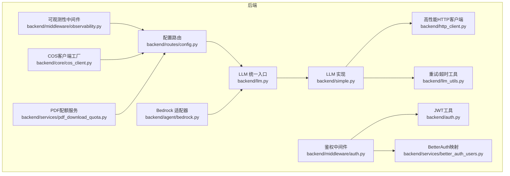
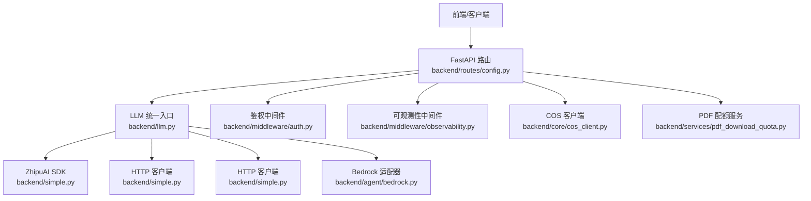
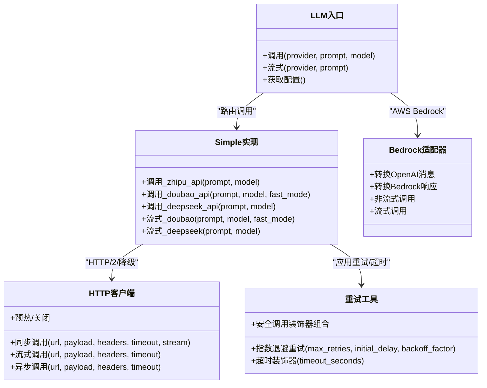
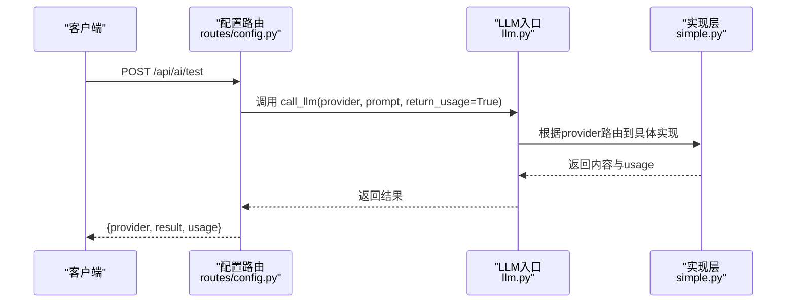
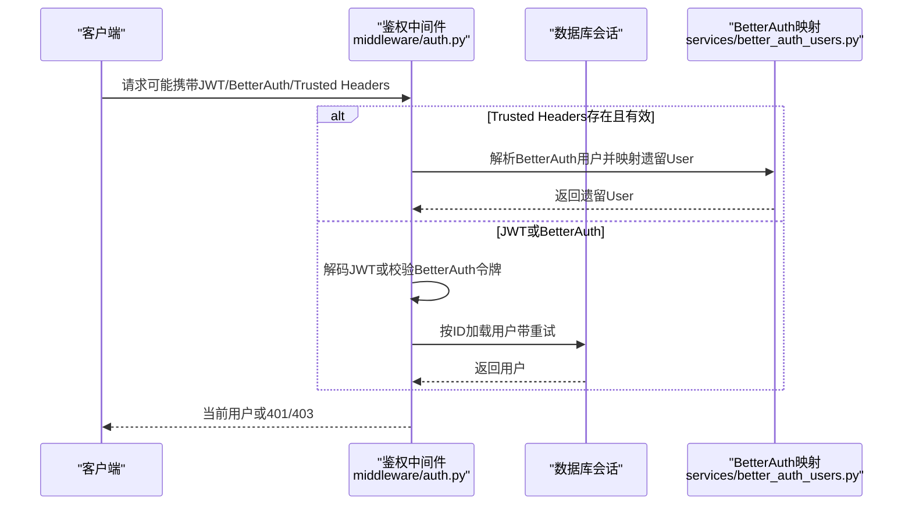
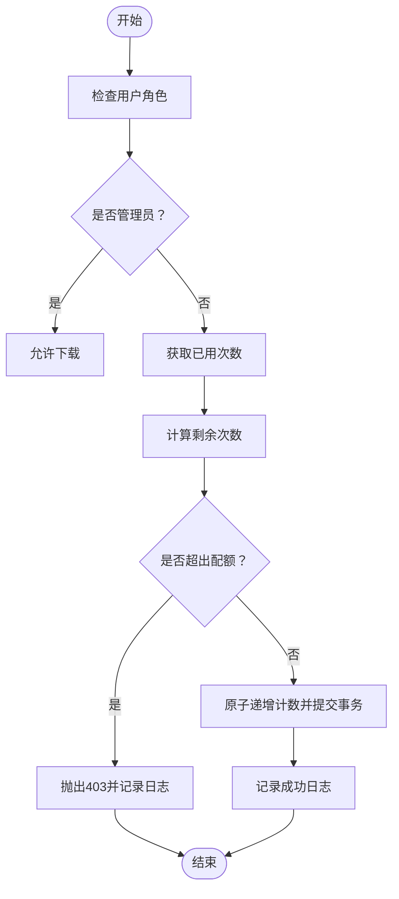
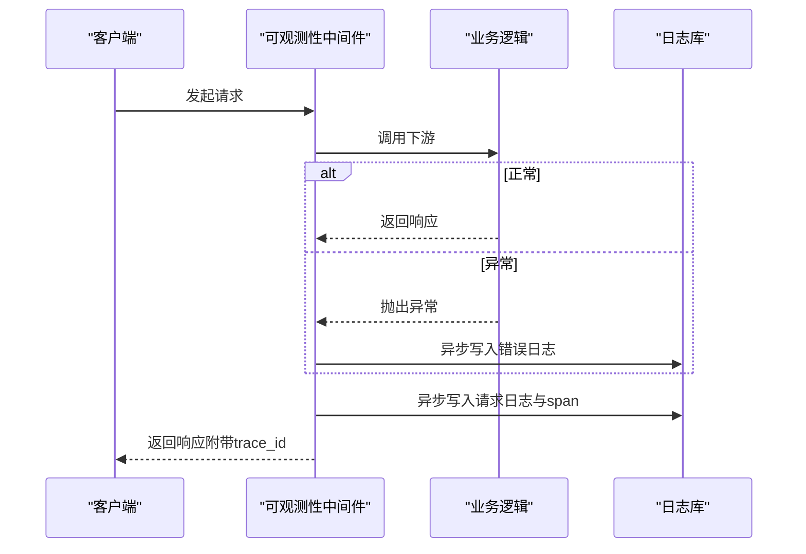
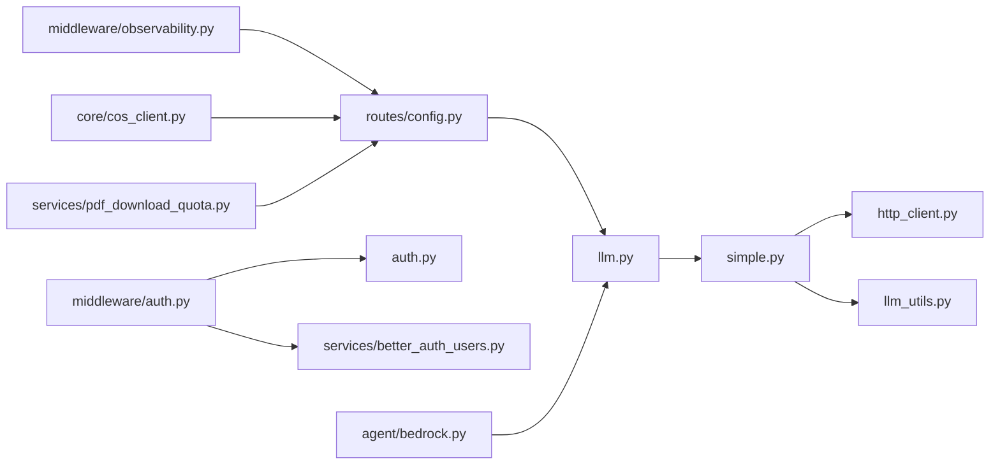

# 第三方集成

<cite>
**本文引用的文件**   
- [backend/llm.py](file://backend/llm.py)
- [backend/simple.py](file://backend/simple.py)
- [backend/llm_utils.py](file://backend/llm_utils.py)
- [backend/http_client.py](file://backend/http_client.py)
- [backend/agent/bedrock.py](file://backend/agent/bedrock.py)
- [backend/routes/config.py](file://backend/routes/config.py)
- [backend/middleware/auth.py](file://backend/middleware/auth.py)
- [backend/middleware/observability.py](file://backend/middleware/observability.py)
- [backend/auth.py](file://backend/auth.py)
- [backend/core/cos_client.py](file://backend/core/cos_client.py)
- [backend/services/pdf_download_quota.py](file://backend/services/pdf_download_quota.py)
- [backend/services/better_auth_users.py](file://backend/services/better_auth_users.py)
</cite>

## 目录
1. [简介](#简介)
2. [项目结构](#项目结构)
3. [核心组件](#核心组件)
4. [架构总览](#架构总览)
5. [组件详解](#组件详解)
6. [依赖关系分析](#依赖关系分析)
7. [性能考量](#性能考量)
8. [故障排查指南](#故障排查指南)
9. [结论](#结论)
10. [附录](#附录)

## 简介
本指南面向需要在系统中集成第三方服务（LLM、存储、认证与配额等）的开发者，系统性阐述外部API集成方法、认证机制、数据交换协议、适配器模式、配置管理、故障转移策略，并给出针对支付网关、存储服务与认证系统的集成建议。文档同时覆盖API限流、重试机制、错误处理、集成测试、监控告警与性能优化策略，并提供OpenAI、ZhipuAI、Bedrock等服务的具体接入路径与最佳实践。

## 项目结构
后端采用分层与模块化组织，第三方服务集成主要集中在以下模块：
- LLM统一入口与适配：backend/llm.py、backend/simple.py
- HTTP客户端与性能优化：backend/http_client.py
- 重试与超时工具：backend/llm_utils.py
- AWS Bedrock适配器：backend/agent/bedrock.py
- 配置管理与密钥测试：backend/routes/config.py
- 认证与鉴权：backend/middleware/auth.py、backend/auth.py、backend/services/better_auth_users.py
- 存储与配额：backend/core/cos_client.py、backend/services/pdf_download_quota.py
- 可观测性：backend/middleware/observability.py

**图表来源**
- [backend/llm.py:1-168](file://backend/llm.py#L1-L168)
- [backend/simple.py:1-614](file://backend/simple.py#L1-L614)
- [backend/http_client.py:1-301](file://backend/http_client.py#L1-L301)
- [backend/llm_utils.py:1-103](file://backend/llm_utils.py#L1-L103)
- [backend/agent/bedrock.py:1-335](file://backend/agent/bedrock.py#L1-L335)
- [backend/routes/config.py:1-309](file://backend/routes/config.py#L1-L309)
- [backend/middleware/auth.py:1-191](file://backend/middleware/auth.py#L1-L191)
- [backend/middleware/observability.py:1-191](file://backend/middleware/observability.py#L1-L191)
- [backend/auth.py:1-66](file://backend/auth.py#L1-L66)
- [backend/core/cos_client.py:1-47](file://backend/core/cos_client.py#L1-L47)
- [backend/services/pdf_download_quota.py:1-111](file://backend/services/pdf_download_quota.py#L1-L111)
- [backend/services/better_auth_users.py:1-55](file://backend/services/better_auth_users.py#L1-L55)

**章节来源**
- [backend/llm.py:1-168](file://backend/llm.py#L1-L168)
- [backend/simple.py:1-614](file://backend/simple.py#L1-L614)
- [backend/http_client.py:1-301](file://backend/http_client.py#L1-L301)
- [backend/llm_utils.py:1-103](file://backend/llm_utils.py#L1-L103)
- [backend/agent/bedrock.py:1-335](file://backend/agent/bedrock.py#L1-L335)
- [backend/routes/config.py:1-309](file://backend/routes/config.py#L1-L309)
- [backend/middleware/auth.py:1-191](file://backend/middleware/auth.py#L1-L191)
- [backend/middleware/observability.py:1-191](file://backend/middleware/observability.py#L1-L191)
- [backend/auth.py:1-66](file://backend/auth.py#L1-L66)
- [backend/core/cos_client.py:1-47](file://backend/core/cos_client.py#L1-L47)
- [backend/services/pdf_download_quota.py:1-111](file://backend/services/pdf_download_quota.py#L1-L111)
- [backend/services/better_auth_users.py:1-55](file://backend/services/better_auth_users.py#L1-L55)

## 核心组件
- LLM统一入口与适配器模式
  - 统一入口：backend/llm.py，负责根据provider路由到具体实现，集中校验API Key与模型参数。
  - 实现层：backend/simple.py，封装ZhipuAI、豆包（火山引擎）、DeepSeek的调用细节，内置重试与超时策略。
  - AWS Bedrock适配器：backend/agent/bedrock.py，将OpenAI风格的消息与工具格式转换为Bedrock兼容格式，并支持流式与非流式调用。
- HTTP客户端与性能优化
  - backend/http_client.py：优先使用HTTP/2（httpx），支持DNS预解析、连接池复用、压缩与降级方案（requests），并提供同步/异步/流式调用接口。
- 重试与超时工具
  - backend/llm_utils.py：提供带指数退避的重试装饰器与超时装饰器，组合为安全调用装饰器，便于在LLM调用中统一应用。
- 配置管理与密钥测试
  - backend/routes/config.py：提供获取/保存API Key、测试Key可用性、AI测试接口、默认Provider选择等。
- 认证与鉴权
  - backend/middleware/auth.py：支持JWT与BetterAuth两种令牌来源，内部可信Header桥接，带数据库连接重试与用户加载选项。
  - backend/auth.py：JWT生成/解码、密码哈希/校验。
  - backend/services/better_auth_users.py：将BetterAuth用户映射为遗留User记录。
- 存储与配额
  - backend/core/cos_client.py：构建禁用系统代理的COS客户端，支持超时与本地资源偏好策略。
  - backend/services/pdf_download_quota.py：非管理员默认配额限制与并发安全计数。
- 可观测性
  - backend/middleware/observability.py：请求日志、错误日志、链路span采集，异步落库避免阻塞。

**章节来源**
- [backend/llm.py:52-167](file://backend/llm.py#L52-L167)
- [backend/simple.py:176-571](file://backend/simple.py#L176-L571)
- [backend/agent/bedrock.py:38-335](file://backend/agent/bedrock.py#L38-L335)
- [backend/http_client.py:78-281](file://backend/http_client.py#L78-L281)
- [backend/llm_utils.py:11-103](file://backend/llm_utils.py#L11-L103)
- [backend/routes/config.py:45-309](file://backend/routes/config.py#L45-L309)
- [backend/middleware/auth.py:113-191](file://backend/middleware/auth.py#L113-L191)
- [backend/auth.py:42-66](file://backend/auth.py#L42-L66)
- [backend/services/better_auth_users.py:33-55](file://backend/services/better_auth_users.py#L33-L55)
- [backend/core/cos_client.py:19-47](file://backend/core/cos_client.py#L19-L47)
- [backend/services/pdf_download_quota.py:22-111](file://backend/services/pdf_download_quota.py#L22-L111)
- [backend/middleware/observability.py:19-191](file://backend/middleware/observability.py#L19-L191)

## 架构总览
下图展示第三方服务集成的整体交互：前端通过FastAPI路由调用LLM统一入口，LLM根据provider选择对应SDK或HTTP客户端进行调用；Bedrock适配器负责OpenAI风格消息到Bedrock的转换；认证中间件保障访问安全；可观测性中间件记录请求与错误；存储与配额服务分别负责对象存储与使用配额。

**图表来源**
- [backend/routes/config.py:24-309](file://backend/routes/config.py#L24-L309)
- [backend/llm.py:52-167](file://backend/llm.py#L52-L167)
- [backend/simple.py:176-571](file://backend/simple.py#L176-L571)
- [backend/agent/bedrock.py:38-335](file://backend/agent/bedrock.py#L38-L335)
- [backend/middleware/auth.py:113-191](file://backend/middleware/auth.py#L113-L191)
- [backend/middleware/observability.py:19-191](file://backend/middleware/observability.py#L19-L191)
- [backend/core/cos_client.py:19-47](file://backend/core/cos_client.py#L19-L47)
- [backend/services/pdf_download_quota.py:22-111](file://backend/services/pdf_download_quota.py#L22-L111)

## 组件详解

### LLM统一入口与适配器模式
- 统一入口
  - 支持provider：deepseek、doubao、zhipu；根据环境变量或默认值选择模型与基础URL；缺失API Key时返回400级错误。
  - 流式与非流式调用：doubao与deepseek支持流式；zhipu通过非流式封装。
- 实现层
  - ZhipuAI：使用官方SDK，支持复用客户端实例与动态API Key切换；内置极简系统提示词与低温度/低max_tokens参数以提升速度。
  - 豆包（火山引擎）：HTTP调用，启用最低思考强度参数以显著提速；支持流式SSE。
  - DeepSeek：HTTP调用，兼容gzip响应与编码推断；严格空响应与JSON校验。
- 重试与超时
  - 对Zhipu、豆包、DeepSeek调用均应用带指数退避的重试装饰器，降低瞬时网络波动影响。
- Bedrock适配器
  - OpenAI消息/工具格式转换至Bedrock；支持非流式与流式调用；维护toolUseId以跨轮对话保持工具调用上下文。

**图表来源**
- [backend/llm.py:52-167](file://backend/llm.py#L52-L167)
- [backend/simple.py:176-571](file://backend/simple.py#L176-L571)
- [backend/agent/bedrock.py:38-335](file://backend/agent/bedrock.py#L38-L335)
- [backend/http_client.py:161-281](file://backend/http_client.py#L161-L281)
- [backend/llm_utils.py:11-103](file://backend/llm_utils.py#L11-L103)

**章节来源**
- [backend/llm.py:52-167](file://backend/llm.py#L52-L167)
- [backend/simple.py:176-571](file://backend/simple.py#L176-L571)
- [backend/agent/bedrock.py:38-335](file://backend/agent/bedrock.py#L38-L335)
- [backend/http_client.py:161-281](file://backend/http_client.py#L161-L281)
- [backend/llm_utils.py:11-103](file://backend/llm_utils.py#L11-L103)

### 配置管理与密钥测试
- 获取密钥状态：从.env文件解析API Key配置状态，不暴露完整Key。
- 保存密钥：写入.env文件并触发SDK客户端重置（如Zhipu）。
- 密钥可用性测试：对已配置的Key发起最小调用，返回ok或错误详情。
- AI测试：对指定provider进行一次完整调用，返回结果与token用量。
- 默认Provider选择：按顺序检测环境变量，若均未配置则返回400。

**图表来源**
- [backend/routes/config.py:256-274](file://backend/routes/config.py#L256-L274)
- [backend/llm.py:52-117](file://backend/llm.py#L52-L117)
- [backend/simple.py:176-571](file://backend/simple.py#L176-L571)

**章节来源**
- [backend/routes/config.py:51-309](file://backend/routes/config.py#L51-L309)
- [backend/llm.py:52-117](file://backend/llm.py#L52-L117)

### 认证与鉴权
- 支持三种来源：trusted headers（内部桥接）、JWT Bearer、BetterAuth令牌。
- 用户解析：优先trusted headers映射为BetterAuthUser，再映射为遗留User记录；否则JWT解码或BetterAuth校验。
- 数据库连接重试：鉴权过程中对常见数据库异常进行有限重试与回滚/失效处理。
- 权限控制：提供管理员/成员访问修饰器。

**图表来源**
- [backend/middleware/auth.py:113-191](file://backend/middleware/auth.py#L113-L191)
- [backend/services/better_auth_users.py:33-55](file://backend/services/better_auth_users.py#L33-L55)

**章节来源**
- [backend/middleware/auth.py:113-191](file://backend/middleware/auth.py#L113-L191)
- [backend/services/better_auth_users.py:33-55](file://backend/services/better_auth_users.py#L33-L55)

### 存储与配额
- COS客户端工厂：禁用系统代理、自定义超时、区域与桶配置；支持本地资源优先策略。
- PDF下载配额：非管理员默认上限；并发安全原子递增；超限时返回403并记录日志。

**图表来源**
- [backend/services/pdf_download_quota.py:58-111](file://backend/services/pdf_download_quota.py#L58-L111)

**章节来源**
- [backend/core/cos_client.py:19-47](file://backend/core/cos_client.py#L19-L47)
- [backend/services/pdf_download_quota.py:22-111](file://backend/services/pdf_download_quota.py#L22-L111)

### 可观测性与监控告警
- 请求日志：记录方法、路径、状态码、延迟、用户ID、IP、UA、请求/响应大小。
- 错误日志：捕获异常类型、消息与堆栈，仅在需要时强制flush获取request_log_id。
- 链路span：对业务API生成span，排除健康检查；支持错误标记。
- 兜底异常处理：BrokenPipe与通用异常统一返回500并附带trace_id。

**图表来源**
- [backend/middleware/observability.py:19-191](file://backend/middleware/observability.py#L19-L191)

**章节来源**
- [backend/middleware/observability.py:19-191](file://backend/middleware/observability.py#L19-L191)

## 依赖关系分析
- LLM统一入口依赖实现层与HTTP客户端；实现层依赖重试工具与HTTP客户端；配置路由依赖LLM统一入口与模型定义。
- 认证中间件依赖JWT工具与BetterAuth服务；可观测性中间件独立于业务逻辑，仅读取请求元数据并异步落库。
- 存储与配额服务与路由解耦，通过业务调用触发。

**图表来源**
- [backend/llm.py:52-167](file://backend/llm.py#L52-L167)
- [backend/simple.py:176-571](file://backend/simple.py#L176-L571)
- [backend/http_client.py:161-281](file://backend/http_client.py#L161-L281)
- [backend/llm_utils.py:11-103](file://backend/llm_utils.py#L11-L103)
- [backend/routes/config.py:45-309](file://backend/routes/config.py#L45-L309)
- [backend/middleware/auth.py:113-191](file://backend/middleware/auth.py#L113-L191)
- [backend/auth.py:42-66](file://backend/auth.py#L42-L66)
- [backend/services/better_auth_users.py:33-55](file://backend/services/better_auth_users.py#L33-L55)
- [backend/middleware/observability.py:19-191](file://backend/middleware/observability.py#L19-L191)
- [backend/core/cos_client.py:19-47](file://backend/core/cos_client.py#L19-L47)
- [backend/services/pdf_download_quota.py:22-111](file://backend/services/pdf_download_quota.py#L22-L111)
- [backend/agent/bedrock.py:38-335](file://backend/agent/bedrock.py#L38-L335)

**章节来源**
- [backend/llm.py:52-167](file://backend/llm.py#L52-L167)
- [backend/simple.py:176-571](file://backend/simple.py#L176-L571)
- [backend/http_client.py:161-281](file://backend/http_client.py#L161-L281)
- [backend/llm_utils.py:11-103](file://backend/llm_utils.py#L11-L103)
- [backend/routes/config.py:45-309](file://backend/routes/config.py#L45-L309)
- [backend/middleware/auth.py:113-191](file://backend/middleware/auth.py#L113-L191)
- [backend/auth.py:42-66](file://backend/auth.py#L42-L66)
- [backend/services/better_auth_users.py:33-55](file://backend/services/better_auth_users.py#L33-L55)
- [backend/middleware/observability.py:19-191](file://backend/middleware/observability.py#L19-L191)
- [backend/core/cos_client.py:19-47](file://backend/core/cos_client.py#L19-L47)
- [backend/services/pdf_download_quota.py:22-111](file://backend/services/pdf_download_quota.py#L22-L111)
- [backend/agent/bedrock.py:38-335](file://backend/agent/bedrock.py#L38-L335)

## 性能考量
- HTTP/2与连接复用
  - 优先使用httpx开启HTTP/2，启用多路复用、头部压缩与Keep-Alive；预热连接与DNS预解析减少首包延迟。
- 重试与超时
  - 对LLM调用统一应用指数退避重试与超时装饰器，避免瞬时抖动放大。
- 响应优化
  - Zhipu/DeepSeek调用采用低温度、低max_tokens与精简系统提示词；豆包启用最低思考强度参数。
- 异步与流式
  - 支持异步HTTP/2客户端与SSE流式输出，降低端到端等待时间。
- 存储与配额
  - COS禁用系统代理与自定义超时，本地资源优先策略减少跨代理失败概率；PDF配额并发安全计数避免超卖。

**章节来源**
- [backend/http_client.py:78-281](file://backend/http_client.py#L78-L281)
- [backend/llm_utils.py:11-103](file://backend/llm_utils.py#L11-L103)
- [backend/simple.py:176-571](file://backend/simple.py#L176-L571)
- [backend/core/cos_client.py:19-47](file://backend/core/cos_client.py#L19-L47)
- [backend/services/pdf_download_quota.py:75-111](file://backend/services/pdf_download_quota.py#L75-L111)

## 故障排查指南
- API Key缺失
  - 症状：调用LLM返回400，提示缺少API Key。
  - 处理：通过配置路由保存或在环境变量中设置；使用密钥可用性测试接口验证。
- 调用失败与错误详情
  - 症状：HTTPException或通用异常。
  - 处理：查看可观测性中间件记录的trace_id与错误日志；结合重试装饰器与指数退避策略定位瞬时问题。
- 数据库连接异常
  - 症状：鉴权过程出现503或连接错误。
  - 处理：中间件已内置有限重试与回滚/失效处理；检查数据库配置与网络连通性。
- PDF下载配额超限
  - 症状：403 Forbidden，提示达到下载上限。
  - 处理：检查用户角色与已用次数；确认原子递增逻辑是否被并发场景触发。

**章节来源**
- [backend/routes/config.py:201-253](file://backend/routes/config.py#L201-L253)
- [backend/middleware/observability.py:174-191](file://backend/middleware/observability.py#L174-L191)
- [backend/middleware/auth.py:50-86](file://backend/middleware/auth.py#L50-L86)
- [backend/services/pdf_download_quota.py:58-99](file://backend/services/pdf_download_quota.py#L58-L99)

## 结论
本项目通过LLM统一入口与适配器模式，将多家第三方服务（ZhipuAI、豆包、DeepSeek、Bedrock）整合为一致的调用体验；配合高性能HTTP客户端、重试与超时工具、可观测性中间件与认证体系，形成稳定、可扩展、可观测的第三方服务集成框架。建议在生产环境启用HTTP/2、合理配置重试与超时、完善监控告警与日志追踪，并对存储与配额策略进行持续审计与优化。

## 附录

### OpenAI、ZhipuAI、Bedrock接入要点
- OpenAI风格消息与工具
  - Bedrock适配器负责将OpenAI消息与工具格式转换为Bedrock兼容格式，并在流式与非流式场景下统一输出。
- ZhipuAI
  - 使用官方SDK，支持动态API Key切换与客户端复用；调用参数极简化以提升速度。
- Bedrock
  - 通过boto3客户端调用converse与converse_stream，维护toolUseId以保持工具调用上下文。

**章节来源**
- [backend/agent/bedrock.py:60-335](file://backend/agent/bedrock.py#L60-L335)
- [backend/simple.py:176-264](file://backend/simple.py#L176-L264)

### 支付网关、存储服务与认证系统的集成建议
- 支付网关
  - 采用统一HTTP客户端进行REST调用，遵循幂等设计；对回调签名与异步通知进行严格校验；记录trace_id与订单号关联日志。
- 存储服务（对象存储/COS）
  - 使用客户端工厂创建禁用系统代理的客户端，设置合理超时；对上传/下载操作实施重试与断点续传策略；在本地开发环境下优先使用本地缓存资源。
- 认证系统
  - 统一使用JWT与BetterAuth双通道；内部可信Header桥接用于服务间通信；对数据库连接异常进行有限重试；权限控制通过修饰器实现。

**章节来源**
- [backend/http_client.py:161-281](file://backend/http_client.py#L161-L281)
- [backend/core/cos_client.py:19-47](file://backend/core/cos_client.py#L19-L47)
- [backend/middleware/auth.py:113-191](file://backend/middleware/auth.py#L113-L191)

### API限流、重试机制与错误处理
- 限流
  - 在路由层或上游网关实施速率限制；对LLM调用采用指数退避重试，避免雪崩效应。
- 重试
  - 使用带指数退避的重试装饰器，结合超时控制，确保失败快速恢复。
- 错误处理
  - 统一异常捕获与trace_id返回；可观测性中间件异步落库，避免阻塞主流程。

**章节来源**
- [backend/llm_utils.py:11-103](file://backend/llm_utils.py#L11-L103)
- [backend/middleware/observability.py:174-191](file://backend/middleware/observability.py#L174-L191)

### 集成测试、监控告警与性能优化策略
- 集成测试
  - 使用配置路由的密钥可用性测试与AI测试接口，对各Provider进行最小化调用验证。
- 监控告警
  - 通过可观测性中间件记录请求/错误/链路span；结合日志聚合与告警规则对异常进行及时处置。
- 性能优化
  - 启用HTTP/2、DNS预解析与连接复用；调优LLM参数（温度、max_tokens、系统提示词）；对存储与配额操作进行并发安全与本地优先策略。

**章节来源**
- [backend/routes/config.py:201-274](file://backend/routes/config.py#L201-L274)
- [backend/middleware/observability.py:19-191](file://backend/middleware/observability.py#L19-L191)
- [backend/http_client.py:78-281](file://backend/http_client.py#L78-L281)