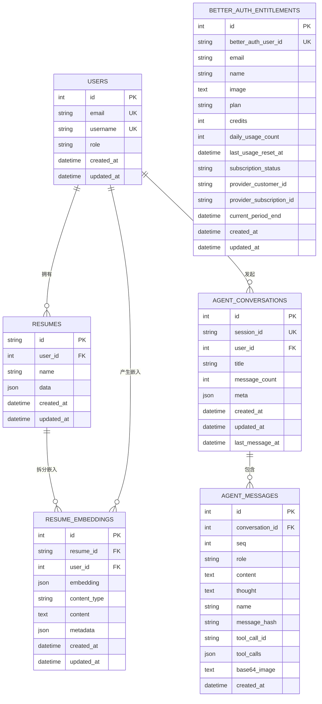
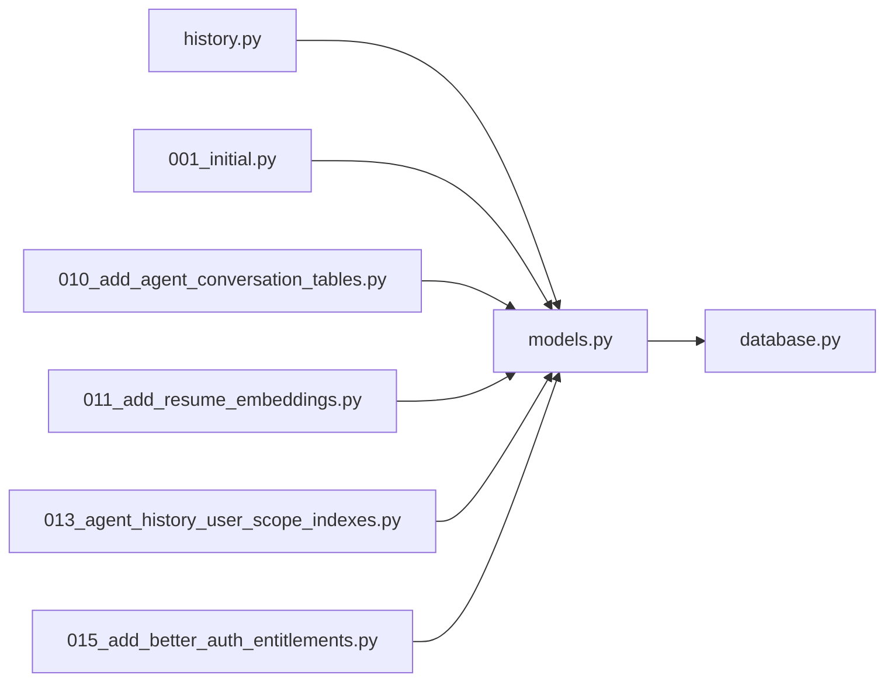
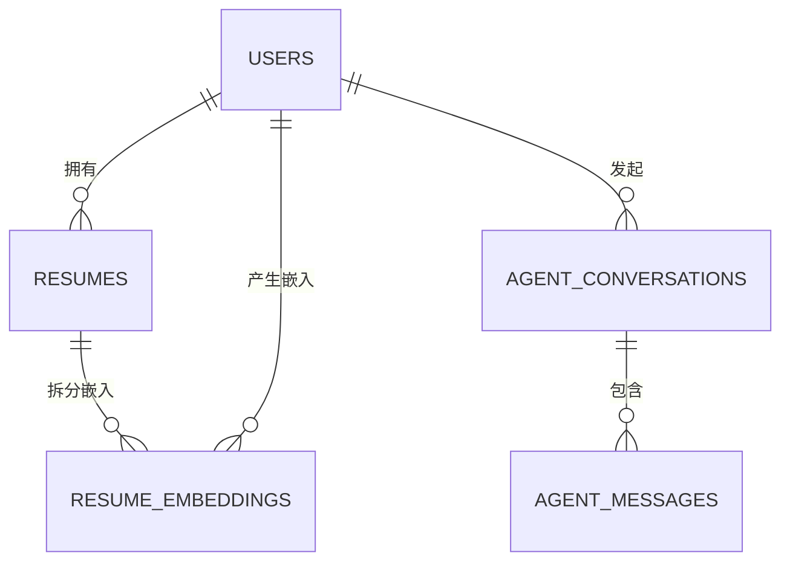

# 实体关系设计

<cite>
**本文引用的文件**
- [models.py](file://backend/models.py)
- [database.py](file://backend/database.py)
- [001_initial.py](file://backend/alembic/versions/001_initial.py)
- [010_add_agent_conversation_tables.py](file://backend/alembic/versions/010_add_agent_conversation_tables.py)
- [011_add_resume_embeddings.py](file://backend/alembic/versions/011_add_resume_embeddings.py)
- [013_agent_history_user_scope_indexes.py](file://backend/alembic/versions/013_agent_history_user_scope_indexes.py)
- [015_add_better_auth_entitlements.py](file://backend/alembic/versions/015_add_better_auth_entitlements.py)
- [history.py](file://backend/agent/web/routes/history.py)
</cite>

## 目录
1. [简介](#简介)
2. [项目结构](#项目结构)
3. [核心组件](#核心组件)
4. [架构总览](#架构总览)
5. [详细组件分析](#详细组件分析)
6. [依赖分析](#依赖分析)
7. [性能考虑](#性能考虑)
8. [故障排查指南](#故障排查指南)
9. [结论](#结论)
10. [附录](#附录)

## 简介
本文件聚焦于数据库实体关系设计，系统梳理并解释 User、Resume、AgentConversation、AgentMessage 等核心实体之间的关系映射，涵盖一对一、一对多、多对多关系，明确外键约束与级联策略，阐述业务逻辑与数据完整性保障机制，并提供 ER 图与 SQL 关系定义示例。

## 项目结构
- 后端数据库层采用 SQLAlchemy ORM，模型定义集中在 models.py，数据库连接与会话管理位于 database.py。
- 实体关系通过 Alembic 迁移逐步演进，初始版本包含 users 与 resumes 表，后续引入 agent_conversations、agent_messages、resume_embeddings 等表，形成完整的实体关系网络。

```mermaid
graph TB
subgraph "数据库层"
U["users<br/>用户表"]
R["resumes<br/>简历表"]
AC["agent_conversations<br/>对话会话表"]
AM["agent_messages<br/>对话消息表"]
RE["resume_embeddings<br/>简历向量嵌入表"]
BA["better_auth_entitlements<br/>BetterAuth 权益表"]
end
U -- "1" --> |"外键: user_id"| R
U -- "0..*" --> |"外键: user_id"| AC
AC -- "1" --> |"外键: conversation_id"| AM
R -- "1" --> |"外键: resume_id"| RE
U -- "1" --> |"外键: user_id"| RE
```

图表来源
- [models.py](file://backend/models.py)
- [001_initial.py](file://backend/alembic/versions/001_initial.py)
- [010_add_agent_conversation_tables.py](file://backend/alembic/versions/010_add_agent_conversation_tables.py)
- [011_add_resume_embeddings.py](file://backend/alembic/versions/011_add_resume_embeddings.py)
- [015_add_better_auth_entitlements.py](file://backend/alembic/versions/015_add_better_auth_entitlements.py)

章节来源
- [models.py](file://backend/models.py)
- [database.py](file://backend/database.py)

## 核心组件
- User（用户）
  - 主键：id（自增整数）
  - 索引：username、email（唯一）、role、updated_at
  - 一对多：拥有多个 Resume；关系定义包含级联删除孤儿记录
- Resume（简历）
  - 主键：id（字符串）
  - 外键：user_id → users.id（级联删除）
  - 索引：user_id、updated_at
  - 一对一：与 ResumeEmbedding（见下节）
- AgentConversation（对话会话）
  - 主键：id（自增整数）
  - 外键：user_id → users.id（SET NULL）
  - 索引：session_id（唯一）、user_id、updated_at、复合索引（user_id, last_message_at, updated_at）
  - 一对多：包含多个 AgentMessage
- AgentMessage（对话消息）
  - 主键：id（自增整数）
  - 外键：conversation_id → agent_conversations.id（CASCADE）
  - 唯一约束：(conversation_id, seq)
  - 索引：conversation_id、tool_call_id、message_hash
  - 一对一：与 ResumeEmbedding（见下节）
- ResumeEmbedding（简历向量嵌入）
  - 主键：id（自增整数）
  - 外键：resume_id → resumes.id（CASCADE）、user_id → users.id（CASCADE）
  - 索引：resume_id、user_id、content_type、(user_id, content_type)
  - 业务用途：支持语义搜索与相似度检索

章节来源
- [models.py](file://backend/models.py)
- [001_initial.py](file://backend/alembic/versions/001_initial.py)
- [010_add_agent_conversation_tables.py](file://backend/alembic/versions/010_add_agent_conversation_tables.py)
- [011_add_resume_embeddings.py](file://backend/alembic/versions/011_add_resume_embeddings.py)
- [013_agent_history_user_scope_indexes.py](file://backend/alembic/versions/013_agent_history_user_scope_indexes.py)
- [015_add_better_auth_entitlements.py](file://backend/alembic/versions/015_add_better_auth_entitlements.py)

## 架构总览
- 数据库连接与会话
  - database.py 提供统一的数据库 URL 解析与连接池配置，支持 MySQL、PostgreSQL 与 SQLite，默认 SQLite 用于开发。
  - Base 作为 ORM 基类，所有模型继承自 Base；init_db() 用于初始化数据库（创建所有表）。
- 实体关系与约束
  - User 与 Resume：一对多（用户可有多份简历，删除用户时级联删除其简历）
  - User 与 AgentConversation：一对多（用户可有多次对话会话，删除用户时会话 user_id 设为 NULL）
  - AgentConversation 与 AgentMessage：一对多（会话包含多条消息，删除会话时级联删除消息）
  - Resume 与 ResumeEmbedding：一对多（简历可拆分为多段向量嵌入，删除简历时级联删除嵌入）
  - User 与 ResumeEmbedding：一对多（用户可产生多份简历的嵌入，删除用户时级联删除）



图表来源
- [models.py](file://backend/models.py)
- [001_initial.py](file://backend/alembic/versions/001_initial.py)
- [010_add_agent_conversation_tables.py](file://backend/alembic/versions/010_add_agent_conversation_tables.py)
- [011_add_resume_embeddings.py](file://backend/alembic/versions/011_add_resume_embeddings.py)
- [015_add_better_auth_entitlements.py](file://backend/alembic/versions/015_add_better_auth_entitlements.py)

## 详细组件分析

### User（用户）与 Resume（简历）
- 关系类型：一对多
- 外键约束：resumes.user_id → users.id（级联删除）
- 级联策略：删除用户时，其所有简历被级联删除；更新用户不影响简历
- 索引与性能：users.email、users.username、users.role、users.updated_at；resumes.user_id、resumes.updated_at
- 业务逻辑：用户可维护多份简历，用于不同场景；删除用户时彻底清除其简历数据，保证数据隔离与合规

章节来源
- [models.py](file://backend/models.py)
- [001_initial.py](file://backend/alembic/versions/001_initial.py)

### User（用户）与 AgentConversation（对话会话）
- 关系类型：一对多
- 外键约束：agent_conversations.user_id → users.id（SET NULL）
- 级联策略：删除用户时，会话的 user_id 设为 NULL，保留会话历史；更新用户不影响会话归属
- 索引与性能：agent_conversations.session_id（唯一）、user_id、updated_at、复合索引（user_id, last_message_at, updated_at）
- 业务逻辑：匿名或跨用户场景仍可保留会话；管理员可按用户维度检索会话

章节来源
- [models.py](file://backend/models.py)
- [010_add_agent_conversation_tables.py](file://backend/alembic/versions/010_add_agent_conversation_tables.py)
- [013_agent_history_user_scope_indexes.py](file://backend/alembic/versions/013_agent_history_user_scope_indexes.py)

### AgentConversation（对话会话）与 AgentMessage（对话消息）
- 关系类型：一对多
- 外键约束：agent_messages.conversation_id → agent_conversations.id（CASCADE）
- 级联策略：删除会话时，其所有消息被级联删除；消息独立于会话生命周期
- 唯一约束：(conversation_id, seq) 确保同一会话内的消息序号唯一
- 索引与性能：agent_messages.conversation_id、tool_call_id、message_hash
- 业务逻辑：消息按序号排列，支持增量追加与幂等保存；消息去重通过 message_hash 索引实现

章节来源
- [models.py](file://backend/models.py)
- [010_add_agent_conversation_tables.py](file://backend/alembic/versions/010_add_agent_conversation_tables.py)

### Resume（简历）与 ResumeEmbedding（简历向量嵌入）
- 关系类型：一对多
- 外键约束：resume_embeddings.resume_id → resumes.id（CASCADE）、resume_embeddings.user_id → users.id（CASCADE）
- 级联策略：删除简历或用户时，其嵌入数据被级联删除
- 索引与性能：resume_embeddings.resume_id、user_id、content_type、(user_id, content_type)
- 业务逻辑：将简历拆分为摘要、经验、项目、技能等片段，生成向量嵌入，支持语义检索与相似度匹配

章节来源
- [models.py](file://backend/models.py)
- [011_add_resume_embeddings.py](file://backend/alembic/versions/011_add_resume_embeddings.py)

### BetterAuthEntitlement（BetterAuth 权益）
- 关系类型：一对一（以 better_auth_user_id 唯一）
- 索引与性能：better_auth_user_id、email、plan、subscription_status、provider_*、updated_at
- 业务逻辑：记录用户订阅计划、配额、计费周期等权益信息，支撑商业化功能

章节来源
- [models.py](file://backend/models.py)
- [015_add_better_auth_entitlements.py](file://backend/alembic/versions/015_add_better_auth_entitlements.py)

### AgentMessage 与 ResumeEmbedding 的潜在关联
- 当 AgentMessage 携带与简历相关的片段（如 content 或 tool_calls）时，可与 ResumeEmbedding 的 content_type（如 summary/experience/projects/skills）进行语义匹配，实现“消息-嵌入”的关联检索。
- 建议在业务层通过 content_type 与 content 字段建立检索索引，提升匹配效率。

（本小节为概念性说明，不直接分析具体源码文件）

## 依赖分析
- 模块耦合
  - models.py 定义所有实体与关系，history.py 通过 models.User 与存储适配器交互，体现对 User 的依赖。
  - database.py 提供 Base 与 Session，所有模型共享同一 Base，避免重复映射导致的同步异常。
- 外部依赖
  - Alembic 迁移文件定义了表结构、索引与约束，确保数据库结构与模型一致。
  - 支持 MySQL、PostgreSQL 与 SQLite，运行时根据环境变量动态选择连接串。



图表来源
- [models.py](file://backend/models.py)
- [database.py](file://backend/database.py)
- [history.py](file://backend/agent/web/routes/history.py)
- [001_initial.py](file://backend/alembic/versions/001_initial.py)
- [010_add_agent_conversation_tables.py](file://backend/alembic/versions/010_add_agent_conversation_tables.py)
- [011_add_resume_embeddings.py](file://backend/alembic/versions/011_add_resume_embeddings.py)
- [013_agent_history_user_scope_indexes.py](file://backend/alembic/versions/013_agent_history_user_scope_indexes.py)
- [015_add_better_auth_entitlements.py](file://backend/alembic/versions/015_add_better_auth_entitlements.py)

章节来源
- [models.py](file://backend/models.py)
- [database.py](file://backend/database.py)
- [history.py](file://backend/agent/web/routes/history.py)

## 性能考虑
- 索引策略
  - users：email、username、role、updated_at
  - resumes：user_id、updated_at
  - agent_conversations：session_id（唯一）、user_id、updated_at、(user_id, last_message_at, updated_at)
  - agent_messages：conversation_id、tool_call_id、message_hash
  - resume_embeddings：resume_id、user_id、content_type、(user_id, content_type)
- 连接池与超时
  - database.py 提供连接池参数（pool_size、max_overflow、pool_timeout、pool_pre_ping）与数据库类型检测，确保在高延迟远程数据库场景下的稳定性。
- 级联删除与数据一致性
  - CASCADE 级联删除用于简历与消息，避免悬挂数据；SET NULL 用于会话归属，保留历史。

（本节为通用性能讨论，不直接分析具体源码文件）

## 故障排查指南
- 历史会话管理异常
  - history.py 对数据库连接异常（OperationalError、InterfaceError、DisconnectionError、DBAPIError）进行捕获并返回标准化错误信息，建议优先检查数据库连通性与 Alembic 升级状态。
- 级联删除与唯一约束
  - 若出现外键冲突或唯一约束冲突，检查迁移脚本是否正确执行，确认表结构与模型定义一致。
- 连接串与数据库类型
  - database.py 支持多种数据库类型，若连接失败，检查环境变量 DATABASE_URL 或 POSTGRESQL_URL，并确认驱动格式（如 mysql+pymysql://、postgresql+psycopg://）。

章节来源
- [history.py](file://backend/agent/web/routes/history.py)
- [database.py](file://backend/database.py)

## 结论
本设计以 User 为核心枢纽，围绕简历与对话两大业务域构建实体关系：User 与 Resume 为一对多，User 与 AgentConversation 为一对多，AgentConversation 与 AgentMessage 为一对多，Resume 与 ResumeEmbedding 为一对多。通过外键约束与索引策略保障数据完整性与查询性能，结合 Alembic 迁移实现结构演进与版本控制。该关系设计满足多用户、多简历、多会话与语义检索的业务需求。

## 附录

### 实体关系图（ER）


图表来源
- [models.py](file://backend/models.py)

### SQL 关系定义示例（基于迁移脚本）
- users 表
  - 主键：id
  - 唯一：email
  - 索引：username、role、updated_at
- resumes 表
  - 主键：id
  - 外键：user_id → users(id)（ON DELETE CASCADE）
  - 索引：user_id、updated_at
- agent_conversations 表
  - 主键：id
  - 唯一：session_id
  - 外键：user_id → users(id)（ON DELETE SET NULL）
  - 索引：user_id、updated_at、(user_id, last_message_at, updated_at)
- agent_messages 表
  - 主键：id
  - 外键：conversation_id → agent_conversations(id)（ON DELETE CASCADE）
  - 唯一：(conversation_id, seq)
  - 索引：conversation_id、tool_call_id、message_hash
- resume_embeddings 表
  - 主键：id
  - 外键：resume_id → resumes(id)（ON DELETE CASCADE）、user_id → users(id)（ON DELETE CASCADE）
  - 索引：resume_id、user_id、content_type、(user_id, content_type)

章节来源
- [001_initial.py](file://backend/alembic/versions/001_initial.py)
- [010_add_agent_conversation_tables.py](file://backend/alembic/versions/010_add_agent_conversation_tables.py)
- [011_add_resume_embeddings.py](file://backend/alembic/versions/011_add_resume_embeddings.py)
- [013_agent_history_user_scope_indexes.py](file://backend/alembic/versions/013_agent_history_user_scope_indexes.py)
- [015_add_better_auth_entitlements.py](file://backend/alembic/versions/015_add_better_auth_entitlements.py)