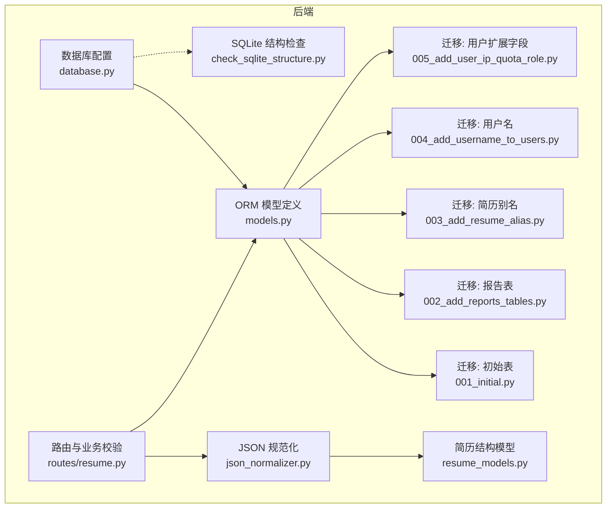
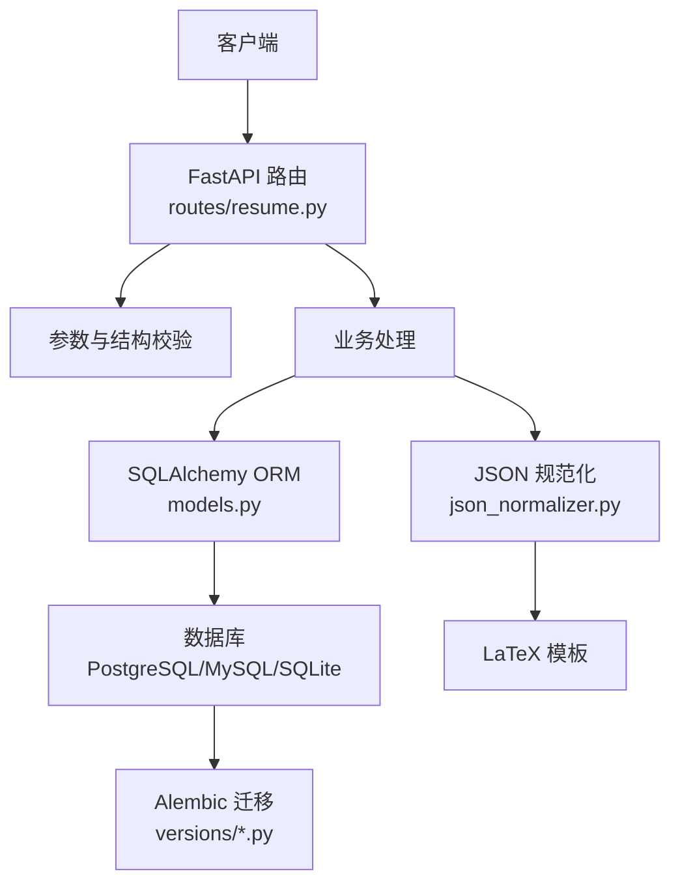
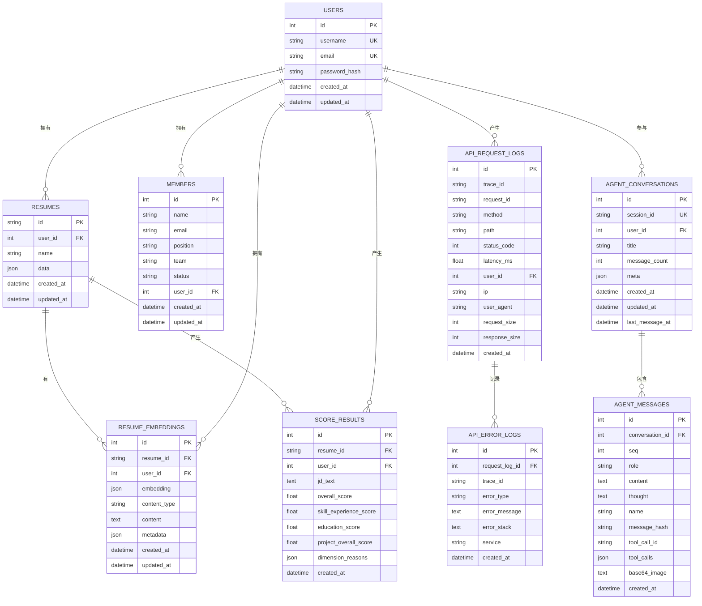
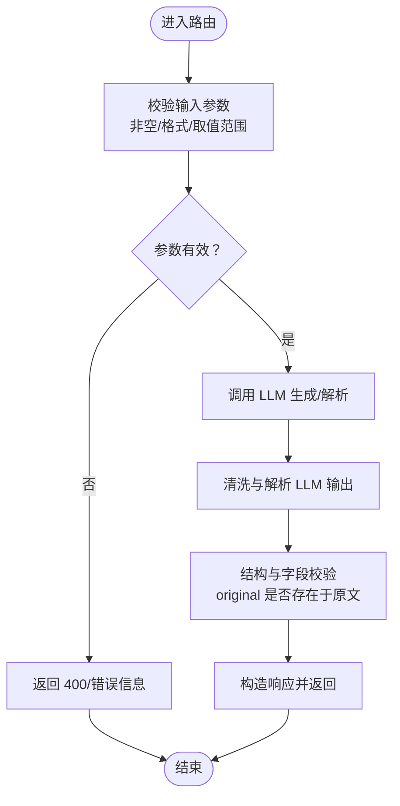
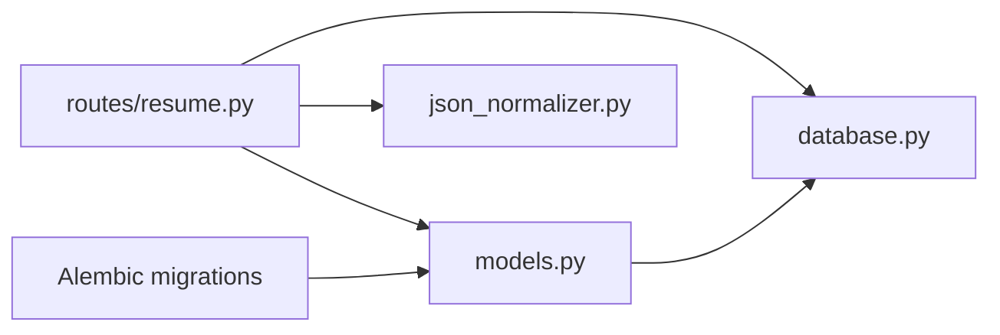

# 数据完整性与验证

<cite>
**本文档引用的文件**
- [models.py](file://backend/models.py)
- [database.py](file://backend/database.py)
- [001_initial.py](file://backend/alembic/versions/001_initial.py)
- [002_add_reports_tables.py](file://backend/alembic/versions/002_add_reports_tables.py)
- [003_add_resume_alias.py](file://backend/alembic/versions/003_add_resume_alias.py)
- [004_add_username_to_users.py](file://backend/alembic/versions/004_add_username_to_users.py)
- [005_add_user_ip_quota_role.py](file://backend/alembic/versions/005_add_user_ip_quota_role.py)
- [resume.py](file://backend/routes/resume.py)
- [json_normalizer.py](file://backend/json_normalizer.py)
- [resume_models.py](file://backend/resume_models.py)
- [check_sqlite_structure.py](file://backend/check_sqlite_structure.py)
</cite>

## 目录
1. [引言](#引言)
2. [项目结构](#项目结构)
3. [核心组件](#核心组件)
4. [架构总览](#架构总览)
5. [详细组件分析](#详细组件分析)
6. [依赖分析](#依赖分析)
7. [性能考虑](#性能考虑)
8. [故障排除指南](#故障排除指南)
9. [结论](#结论)

## 引言
本文件聚焦于 ResumeAgent 项目中的“数据完整性与验证”机制，系统梳理数据库层面的约束实现（NOT NULL、UNIQUE、外键与级联策略）、数据验证规则与业务规则、数据类型选择原则与范围限制、一致性保障与事务策略，以及最佳实践与常见问题解决方案。文档面向开发者与运维人员，既提供代码级细节，也提供概念性指导。

## 项目结构
围绕数据完整性与验证的关键文件分布如下：
- 数据库模型与约束：backend/models.py（SQLAlchemy ORM 定义）
- 数据库初始化与连接：backend/database.py
- 迁移脚本（Alembic）：backend/alembic/versions/*.py
- 路由层数据校验：backend/routes/resume.py
- JSON 规范化与结构校验：backend/json_normalizer.py
- 简历结构化模型：backend/resume_models.py
- SQLite 结构检查工具：backend/check_sqlite_structure.py

图表来源
- [database.py:1-138](file://backend/database.py#L1-L138)
- [models.py:111-372](file://backend/models.py#L111-L372)
- [001_initial.py:19-49](file://backend/alembic/versions/001_initial.py#L19-L49)
- [002_add_reports_tables.py:19-67](file://backend/alembic/versions/002_add_reports_tables.py#L19-L67)
- [003_add_resume_alias.py:19-25](file://backend/alembic/versions/003_add_resume_alias.py#L19-L25)
- [004_add_username_to_users.py:19-32](file://backend/alembic/versions/004_add_username_to_users.py#L19-L32)
- [005_add_user_ip_quota_role.py:18-28](file://backend/alembic/versions/005_add_user_ip_quota_role.py#L18-L28)
- [resume.py:1-200](file://backend/routes/resume.py#L1-L200)
- [json_normalizer.py:1-120](file://backend/json_normalizer.py#L1-L120)
- [resume_models.py:1-128](file://backend/resume_models.py#L1-L128)
- [check_sqlite_structure.py:38-96](file://backend/check_sqlite_structure.py#L38-L96)

章节来源
- [models.py:111-372](file://backend/models.py#L111-L372)
- [database.py:1-138](file://backend/database.py#L1-L138)
- [001_initial.py:19-49](file://backend/alembic/versions/001_initial.py#L19-L49)
- [002_add_reports_tables.py:19-67](file://backend/alembic/versions/002_add_reports_tables.py#L19-L67)
- [003_add_resume_alias.py:19-25](file://backend/alembic/versions/003_add_resume_alias.py#L19-L25)
- [004_add_username_to_users.py:19-32](file://backend/alembic/versions/004_add_username_to_users.py#L19-L32)
- [005_add_user_ip_quota_role.py:18-28](file://backend/alembic/versions/005_add_user_ip_quota_role.py#L18-L28)
- [resume.py:1-200](file://backend/routes/resume.py#L1-L200)
- [json_normalizer.py:1-120](file://backend/json_normalizer.py#L1-L120)
- [resume_models.py:1-128](file://backend/resume_models.py#L1-L128)
- [check_sqlite_structure.py:38-96](file://backend/check_sqlite_structure.py#L38-L96)

## 核心组件
- 数据库模型与约束
  - 用户表 users：唯一约束（username、email），非空约束（username、email、password_hash），时间戳自动填充。
  - 简历表 resumes：主键、外键（users.id，级联删除）、非空约束（name、data），索引（user_id、updated_at）。
  - 成员表 members：外键 users.id（SET NULL），非空约束（name）。
  - 接口请求日志表 api_request_logs：外键 users.id（SET NULL），索引（trace_id、request_id、path、user_id、ip）。
  - 错误日志表 api_error_logs：外键 api_request_logs.id（SET NULL）。
  - Agent 对话表 agent_conversations：唯一约束（session_id），外键 users.id（SET NULL）。
  - Agent 消息表 agent_messages：唯一约束（conversation_id, seq），外键 agent_conversations.id（CASCADE）。
  - 简历向量表 resume_embeddings：外键 resumes.id、users.id（CASCADE），非空约束（embedding、content_type、content）。
  - 评分结果表 score_results：外键 resumes.id、users.id（CASCADE），非空约束（jd_text、overall_score、dimension_reasons）。
- 迁移脚本
  - 初始版本：创建 users、resumes 表及索引。
  - 报告相关：创建 documents、reports、report_conversations 表，建立外键（CASCADE）。
  - 用户扩展：添加 username（唯一非空）、last_login_ip、api_quota、role（非空默认值）。
  - 简历扩展：为 resumes 添加 alias（可空）。
- 路由层校验
  - 语法/表达体检、JD 优化、关键词融入、翻译等接口均进行输入参数校验与输出结构校验。
- JSON 规范化
  - 递归识别字段语义，合并联系信息，标准化工作/实习/项目/教育等结构，确保模板兼容。
- SQLite 结构检查
  - 打印表结构、索引与外键关系，辅助排查约束与索引问题。

章节来源
- [models.py:111-372](file://backend/models.py#L111-L372)
- [001_initial.py:19-49](file://backend/alembic/versions/001_initial.py#L19-L49)
- [002_add_reports_tables.py:19-67](file://backend/alembic/versions/002_add_reports_tables.py#L19-L67)
- [003_add_resume_alias.py:19-25](file://backend/alembic/versions/003_add_resume_alias.py#L19-L25)
- [004_add_username_to_users.py:19-32](file://backend/alembic/versions/004_add_username_to_users.py#L19-L32)
- [005_add_user_ip_quota_role.py:18-28](file://backend/alembic/versions/005_add_user_ip_quota_role.py#L18-L28)
- [resume.py:362-420](file://backend/routes/resume.py#L362-L420)
- [json_normalizer.py:66-96](file://backend/json_normalizer.py#L66-L96)
- [check_sqlite_structure.py:38-96](file://backend/check_sqlite_structure.py#L38-L96)

## 架构总览
数据完整性与验证贯穿三层：
- 数据层（SQLAlchemy ORM + Alembic 迁移）：定义表结构、列属性、唯一/非空约束、外键与级联策略。
- 服务层（FastAPI 路由）：对请求参数与响应结构进行业务规则校验与规范化。
- 应用层（JSON 规范化器）：将异构输入统一为标准简历结构，确保模板渲染一致性。

图表来源
- [resume.py:1-200](file://backend/routes/resume.py#L1-L200)
- [models.py:111-372](file://backend/models.py#L111-L372)
- [database.py:1-138](file://backend/database.py#L1-L138)
- [001_initial.py:19-49](file://backend/alembic/versions/001_initial.py#L19-L49)
- [json_normalizer.py:66-96](file://backend/json_normalizer.py#L66-L96)

## 详细组件分析

### 数据库模型与约束分析
- 用户表 users
  - 唯一约束：username、email
  - 非空约束：username、email、password_hash
  - 时间戳：created_at、updated_at 自动填充
  - 关系：与 resumes 一对多（级联删除 via CASCADE）
- 简历表 resumes
  - 主键：id
  - 外键：user_id → users.id（ondelete=CASCADE）
  - 非空：name、data（JSON）
  - 索引：user_id、updated_at
- 成员表 members
  - 外键：user_id → users.id（ondelete=SET NULL）
  - 非空：name
- 接口日志表 api_request_logs
  - 外键：user_id → users.id（ondelete=SET NULL）
  - 索引：trace_id、request_id、path、user_id、ip
- 错误日志表 api_error_logs
  - 外键：request_log_id → api_request_logs.id（ondelete=SET NULL）
- Agent 对话表 agent_conversations
  - 唯一约束：session_id
  - 外键：user_id → users.id（ondelete=SET NULL）
- Agent 消息表 agent_messages
  - 唯一约束：(conversation_id, seq)
  - 外键：conversation_id → agent_conversations.id（ondelete=CASCADE）
- 简历向量表 resume_embeddings
  - 外键：resume_id → resumes.id，user_id → users.id（ondelete=CASCADE）
  - 非空：embedding、content_type、content
- 评分结果表 score_results
  - 外键：resume_id → resumes.id，user_id → users.id（ondelete=CASCADE）
  - 非空：jd_text、overall_score、dimension_reasons

图表来源
- [models.py:111-372](file://backend/models.py#L111-L372)

章节来源
- [models.py:111-372](file://backend/models.py#L111-L372)

### 外键与级联策略
- 用户删除（软/硬）：users 删除时，resumes、members、api_request_logs、agent_conversations、resume_embeddings、score_results 通过 CASCADE 或 SET NULL 保持一致性。
- 典型策略
  - CASCADE：resumes.user_id、agent_messages.conversation_id、resume_embeddings.resume_id/user_id、score_results.resume_id/user_id
  - SET NULL：api_request_logs.user_id、agent_conversations.user_id
- 迁移脚本验证
  - 初始版本创建 users/resumes 并设置外键与索引。
  - 报告表引入 reports.user_id、reports.main_id 的外键（CASCADE）。
  - 用户扩展字段（username 唯一非空、role 默认值）提升身份与配额管理的完整性。

章节来源
- [models.py:111-372](file://backend/models.py#L111-L372)
- [001_initial.py:19-49](file://backend/alembic/versions/001_initial.py#L19-L49)
- [002_add_reports_tables.py:19-67](file://backend/alembic/versions/002_add_reports_tables.py#L19-L67)
- [004_add_username_to_users.py:19-32](file://backend/alembic/versions/004_add_username_to_users.py#L19-L32)

### 数据验证规则与业务规则
- 路由层校验
  - 语法/表达体检：校验输入 text 非空；解析 LLM 输出后，仅保留 original 在原文中出现且与 suggestion 不同的条目；限定 severity 与 type 取值集合；分数裁剪至 0-100。
  - JD 优化/关键词融入：校验 jd_text 与 fields 非空；确保 suggestions 中 original 必须在对应字段内容中精确匹配。
  - 翻译：并发限制与错误聚合，至少一条成功即返回。
  - 通用体检：维度评分与建议抽取，确保 original 在字段内容中出现。
- JSON 规范化
  - 递归识别字段语义（姓名、电话、邮箱、联系方式、工作/实习/项目/教育/技能/奖项等），合并联系信息，标准化结构，确保模板兼容。
  - 对开源经历、工作/实习、项目、教育等进行字段映射与结构规整。
- 简历结构模型
  - resume_models.py 定义了简历的 Pydantic 模型，字段均为可选，允许灵活输入，不强制任何字段，便于与 LLM 输出对接。

图表来源
- [resume.py:362-420](file://backend/routes/resume.py#L362-L420)
- [json_normalizer.py:66-96](file://backend/json_normalizer.py#L66-L96)
- [resume_models.py:82-128](file://backend/resume_models.py#L82-L128)

章节来源
- [resume.py:362-420](file://backend/routes/resume.py#L362-L420)
- [json_normalizer.py:66-96](file://backend/json_normalizer.py#L66-L96)
- [resume_models.py:82-128](file://backend/resume_models.py#L82-L128)

### 数据类型选择与范围限制
- 字符串类型
  - String(255)/String(512)/String(10000)：用于 email、username、路径、标题、内容摘要等，长度限制与业务含义匹配。
  - IPv6 最长 45 字符：last_login_ip 使用 String(45)。
- JSON 类型
  - JSON/JSONB：用于存储结构化简历数据、日志元数据、评分维度原因等，便于检索与扩展。
- 时间类型
  - DateTime(timezone=True)：统一带时区的时间戳，支持 server_default 与 onupdate。
- 数值类型
  - Integer/Float：latency_ms、overall_score、各维度分数等，配合裁剪逻辑确保 0-100。
- 约束与索引
  - UNIQUE：username、email、session_id、trace_id/request_id/path 等组合索引。
  - INDEX：user_id、updated_at、ip、path 等高频查询字段。

章节来源
- [models.py:111-372](file://backend/models.py#L111-L372)
- [001_initial.py:19-49](file://backend/alembic/versions/001_initial.py#L19-L49)
- [002_add_reports_tables.py:19-67](file://backend/alembic/versions/002_add_reports_tables.py#L19-L67)

### 一致性保障与事务策略
- 连接池与超时
  - database.py 配置 pool_pre_ping、pool_recycle、pool_size、max_overflow、pool_timeout 等参数，确保远程数据库高延迟场景下的稳定性。
  - PostgreSQL 连接超时可配置，失败时可快速回退。
- 会话管理
  - get_db 提供依赖注入式会话，确保每次请求获取/关闭会话，避免连接泄漏。
- 级联与外键
  - 通过 CASCADE/SET NULL 策略在数据库层面保证引用完整性，减少应用层复杂逻辑。
- 迁移与演进
  - Alembic 迁移脚本逐步添加字段与索引，确保历史数据回填与约束升级。

章节来源
- [database.py:72-138](file://backend/database.py#L72-L138)
- [models.py:111-372](file://backend/models.py#L111-L372)
- [004_add_username_to_users.py:19-32](file://backend/alembic/versions/004_add_username_to_users.py#L19-L32)

### 最佳实践与常见问题
- 最佳实践
  - 在数据库层定义唯一/非空约束，在应用层进行输入校验与输出结构校验，形成双重保障。
  - 使用 Alembic 迁移管理结构变更，确保历史数据兼容与索引完善。
  - 对 LLM 输出进行严格清洗与结构校验，仅接受精确可替换的 original 片段。
  - 使用 JSON 字段存储半结构化数据，结合规范化器统一输出。
- 常见问题
  - 外键冲突：确保父表记录存在后再插入子表记录；利用 SET NULL/CASCADE 策略降低破坏性风险。
  - 索引缺失导致慢查询：为高频过滤/排序字段（如 user_id、path、ip）建立索引。
  - SQLite 与 MySQL/PostgreSQL 差异：通过 database.py 的 URL 自动转换与方言适配，避免运行时差异。
  - 连接池耗尽：调整 pool_size/max_overflow/pool_timeout，结合 pool_pre_ping 降低无效连接。

章节来源
- [database.py:26-112](file://backend/database.py#L26-L112)
- [check_sqlite_structure.py:38-96](file://backend/check_sqlite_structure.py#L38-L96)

## 依赖分析
- 模块耦合
  - routes/resume.py 依赖 models.py（ORM）、json_normalizer.py（结构化）、database.py（会话）。
  - models.py 依赖 database.Base（声明式基类）与 SQLAlchemy 类型。
  - Alembic 迁移脚本直接操作 SQLAlchemy 表结构，与 models.py 的定义保持一致。
- 外部依赖
  - SQLAlchemy：ORM 与迁移框架。
  - FastAPI：路由与依赖注入。
  - LLM 调用：用于生成/解析结构化数据，需配合严格的输出校验。

图表来源
- [resume.py:1-200](file://backend/routes/resume.py#L1-L200)
- [models.py:111-372](file://backend/models.py#L111-L372)
- [database.py:1-138](file://backend/database.py#L1-L138)

章节来源
- [resume.py:1-200](file://backend/routes/resume.py#L1-L200)
- [models.py:111-372](file://backend/models.py#L111-L372)
- [database.py:1-138](file://backend/database.py#L1-L138)

## 性能考虑
- 连接池参数
  - pool_pre_ping：在高延迟网络下建议开启，减少陈旧连接。
  - pool_recycle：合理回收连接，避免长时间占用。
  - pool_size/max_overflow：根据并发与资源情况调整。
- 索引策略
  - 为高频查询字段建立索引，减少全表扫描。
  - 联合唯一索引（如 agent_messages 的 (conversation_id, seq)）避免重复与提升查找效率。
- 查询优化
  - 使用 select 加载关系，避免 N+1 查询。
  - 对大数据 JSON 字段进行必要索引或物化视图（视数据库支持而定）。

## 故障排除指南
- SQLite 结构检查
  - 使用 check_sqlite_structure.py 查看表结构、索引与外键关系，定位约束与索引缺失问题。
- 迁移失败
  - 检查 Alembic 版本与数据库结构一致性，必要时回滚并修正迁移脚本。
- 连接问题
  - 调整 database.py 中的连接参数（如 pool_timeout、PG_CONNECT_TIMEOUT），确认数据库可达性。
- LLM 输出异常
  - 在 routes/resume.py 中加强清洗与结构校验，确保 original 在原文中出现且与 suggestion 不同。

章节来源
- [check_sqlite_structure.py:38-96](file://backend/check_sqlite_structure.py#L38-L96)
- [database.py:72-138](file://backend/database.py#L72-L138)
- [resume.py:362-420](file://backend/routes/resume.py#L362-L420)

## 结论
本项目通过数据库层约束（唯一、非空、外键与级联）、迁移脚本演进、路由层严格校验与 JSON 规范化器，构建了多层次的数据完整性与验证体系。配合合理的连接池与索引策略，能够在保证数据一致性的同时满足高并发与可扩展需求。建议持续完善约束与索引，强化对 LLM 输出的结构化校验，并通过迁移脚本有序演进数据库结构。